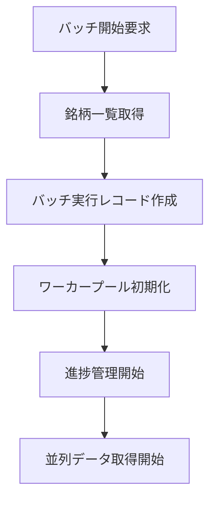
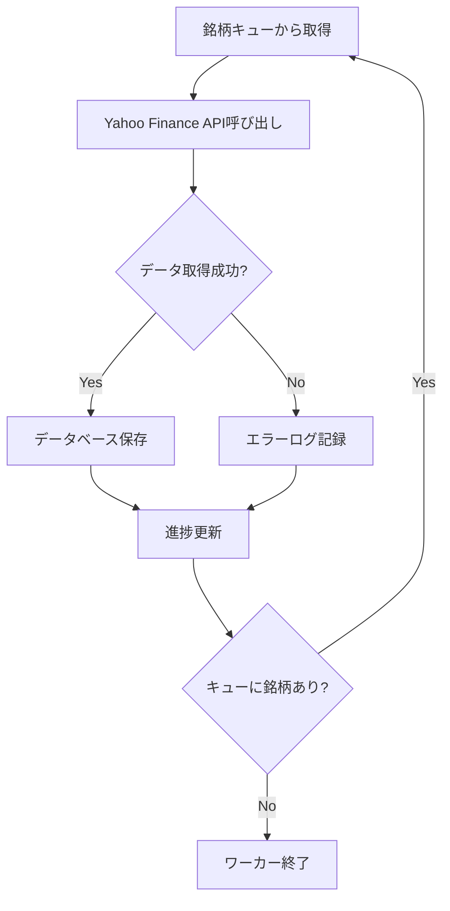
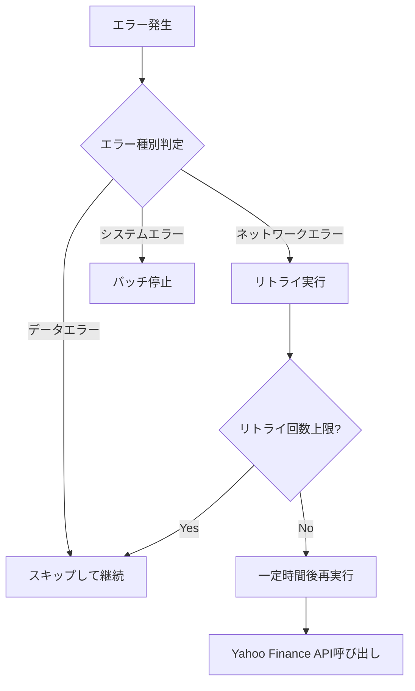

# 全銘柄一括取得システム仕様書（Bulk Data Fetch System）

このドキュメントは、全銘柄一括取得システムの完全な仕様をまとめたものです。Phase 1（MVP実装済み）とPhase 2（将来拡張計画）の両方を含みます。

## 📋 システム概要

**目的**: JPXから取得した銘柄一覧を基に、全銘柄の株価データを効率的に一括取得する

**主要機能**:
- 複数銘柄を並列で取得・保存するジョブを開始し、進捗と状態を取得できます
- 認証はヘッダ `X-API-KEY` に設定したAPIキーで行います（環境変数 `API_KEY` が未設定の場合は認証スキップ）
- 簡易レート制限（1分あたりのリクエスト数）に対応しています

**実装フェーズ**:
- **Phase 1 (MVP - 実装済み)**: 基本的なREST API、簡易バッチ処理、インメモリジョブ管理
- **Phase 2 (計画中)**: 高度なバッチ処理エンジン、データベース永続化、WebSocket進捗配信、エラーリカバリ

---

## 🎯 要件定義

### 機能要件（全フェーズ共通）
1. **全銘柄データ取得**: JPX銘柄一覧の全銘柄に対して株価データを一括取得
2. **JPX銘柄一覧管理**: JPX公式サイトから銘柄一覧を取得し、データベースで管理
3. **進捗表示**: 取得進捗をリアルタイムで表示
4. **エラーハンドリング**: 個別銘柄のエラー時もバッチ処理を継続
5. **取得状況管理**: 中断・再開機能
6. **結果レポート**: 取得完了後のサマリー表示

### 非機能要件
1. **パフォーマンス**: 効率的な並列処理による高速化
2. **信頼性**: ネットワークエラーに対する堅牢性
3. **拡張性**: 銘柄数増加に対応可能な設計
4. **監視性**: 詳細なログ出力と状況可視化

---

# Phase 1: MVP実装（実装済み）

## エンドポイント

### POST `/api/bulk/start`
- 説明: 一括取得ジョブを開始します。
- 認証: 必須（`X-API-KEY`）※環境変数 `API_KEY` が設定されている場合のみ
- リクエストボディ:
```json
{
  "symbols": ["7203.T", "6758.T"],
  "interval": "1d",
  "period": "1mo"
}
```
  - `symbols` (必須): 取得する銘柄コードの配列
  - `interval` (オプション): データの間隔（デフォルト: `1d`）
  - `period` (オプション): データの期間

- 成功レスポンス (202 Accepted):
```json
{
  "success": true,
  "job_id": "job-1720000000000",
  "status": "accepted"
}
```

- エラーレスポンス (400 Bad Request):
```json
{
  "success": false,
  "error": "VALIDATION_ERROR",
  "message": "'symbols' は文字列リストで指定してください"
}
```

- エラーレスポンス (401 Unauthorized):
```json
{
  "success": false,
  "error": "UNAUTHORIZED",
  "message": "APIキーが不正です。ヘッダ 'X-API-KEY' を設定してください"
}
```

- エラーレスポンス (429 Too Many Requests):
```json
{
  "success": false,
  "error": "RATE_LIMIT_EXCEEDED",
  "message": "レート制限を超過しました。しばらく待って再試行してください"
}
```

### GET `/api/bulk/status/{job_id}`
- 説明: ジョブの進捗と状態を取得します。
- 認証: 必須（`X-API-KEY`）※環境変数 `API_KEY` が設定されている場合のみ
- URLパラメータ:
  - `job_id`: ジョブID

- 成功レスポンス (200 OK):
```json
{
  "success": true,
  "job": {
    "id": "job-1720000000000",
    "status": "running",
    "progress": {
      "total": 2,
      "processed": 1,
      "successful": 1,
      "failed": 0,
      "progress_percentage": 50.0
    },
    "created_at": 1720000000.0,
    "updated_at": 1720000050.0
  }
}
```

- ジョブステータス値:
  - `running`: 実行中
  - `completed`: 完了
  - `failed`: 失敗
  - `cancel_requested`: キャンセル要求済み

- 完了時の追加フィールド:
```json
{
  "success": true,
  "job": {
    "id": "job-1720000000000",
    "status": "completed",
    "progress": {...},
    "summary": {
      "total_symbols": 2,
      "successful": 2,
      "failed": 0,
      "duration_seconds": 5.2
    },
    "created_at": 1720000000.0,
    "updated_at": 1720000055.0
  }
}
```

- エラーレスポンス (404 Not Found):
```json
{
  "success": false,
  "error": "NOT_FOUND",
  "message": "指定されたジョブが見つかりません"
}
```

### POST `/api/bulk/stop/{job_id}`
- 説明: ジョブのキャンセルを要求します（簡易実装）。
- 認証: 必須（`X-API-KEY`）※環境変数 `API_KEY` が設定されている場合のみ
- URLパラメータ:
  - `job_id`: ジョブID

- 成功レスポンス (200 OK):
```json
{
  "success": true,
  "message": "キャンセルを受け付けました",
  "job": {
    "id": "job-1720000000000",
    "status": "cancel_requested",
    "progress": {...},
    "created_at": 1720000000.0,
    "updated_at": 1720000030.0
  }
}
```

- エラーレスポンス (404 Not Found):
```json
{
  "success": false,
  "error": "NOT_FOUND",
  "message": "指定されたジョブが見つかりません"
}
```

## 認証・レート制限
- `.env` に `API_KEY` を設定してください。
- `.env` に `RATE_LIMIT_PER_MINUTE` を設定することでレート制限を調整できます（デフォルト: 60）。

## 進捗通知（WebSocket）
- 現在の実装は進捗のREST取得に対応しています。
- WebSocketによるリアルタイム通知は `flask_socketio` の導入後に有効化予定です（コードに拡張用の土台あり）。

## Phase 1 の制限事項
- **ジョブ管理**: インメモリ管理のため、アプリケーション再起動時にジョブ情報が失われます
- **並列処理**: 簡易なスレッド実行です。大規模運用ではキュー（RQ/Celery等）の採用が必要です
- **進捗配信**: WebSocketによるリアルタイム通知は未実装（RESTポーリングのみ）
- **エラーリカバリ**: 基本的なリトライのみで、高度なエラーハンドリングは未実装
- **外部API制限**: Yahoo Finance APIへの大量アクセスとなるため、レート制限の設定を慎重に行ってください

---

# Phase 2: 高度なバッチ処理（計画中）

## 🗂️ JPX銘柄一覧の取得と管理

### データ取得元
- **URL**: https://www.jpx.co.jp/markets/statistics-equities/misc/tvdivq0000001vg2-att/data_j.xls
- **形式**: Excel形式（.xls）
- **内容**: 東証上場全銘柄の情報（銘柄コード、銘柄名、市場区分等）

### 銘柄マスタテーブル (stock_master)
```sql
CREATE TABLE stock_master (
    id SERIAL PRIMARY KEY,
    stock_code VARCHAR(10) UNIQUE NOT NULL,     -- 銘柄コード（例: "7203"）
    stock_name VARCHAR(100) NOT NULL,            -- 銘柄名（例: "トヨタ自動車"）
    market_category VARCHAR(50),                 -- 市場区分（例: "プライム"）
    sector VARCHAR(100),                         -- 業種
    is_active BOOLEAN DEFAULT TRUE,              -- 有効フラグ
    created_at TIMESTAMP DEFAULT CURRENT_TIMESTAMP,
    updated_at TIMESTAMP DEFAULT CURRENT_TIMESTAMP
);

CREATE INDEX idx_stock_master_code ON stock_master(stock_code);
CREATE INDEX idx_stock_master_active ON stock_master(is_active);
```

### 銘柄一覧更新履歴テーブル (stock_master_updates)
```sql
CREATE TABLE stock_master_updates (
    id SERIAL PRIMARY KEY,
    update_type VARCHAR(20) NOT NULL,            -- 'manual', 'scheduled'
    total_stocks INTEGER NOT NULL,               -- 総銘柄数
    added_stocks INTEGER DEFAULT 0,              -- 新規追加銘柄数
    updated_stocks INTEGER DEFAULT 0,            -- 更新銘柄数
    removed_stocks INTEGER DEFAULT 0,            -- 削除（無効化）銘柄数
    status VARCHAR(20) NOT NULL,                 -- 'success', 'failed'
    error_message TEXT,
    started_at TIMESTAMP DEFAULT CURRENT_TIMESTAMP,
    completed_at TIMESTAMP
);
```

### 取得・更新フロー

#### 1. JPXからデータ取得
```python
import requests
import pandas as pd
from io import BytesIO

def fetch_jpx_stock_list() -> pd.DataFrame:
    """JPXから銘柄一覧を取得"""
    url = "https://www.jpx.co.jp/markets/statistics-equities/misc/tvdivq0000001vg2-att/data_j.xls"

    # Excelファイルをダウンロード
    response = requests.get(url, timeout=30)
    response.raise_for_status()

    # Excelデータを読み込み
    df = pd.read_excel(BytesIO(response.content))

    # 必要な列を抽出・正規化
    # (JPXのExcelフォーマットに応じて調整が必要)
    normalized_df = df[['コード', '銘柄名', '市場・商品区分', '業種']].copy()
    normalized_df.columns = ['stock_code', 'stock_name', 'market_category', 'sector']

    return normalized_df
```

#### 2. データベース更新
```python
async def update_stock_master(df: pd.DataFrame) -> dict:
    """銘柄マスタを更新"""
    update_record = {
        'update_type': 'manual',
        'total_stocks': len(df),
        'added_stocks': 0,
        'updated_stocks': 0,
        'removed_stocks': 0,
        'status': 'success'
    }

    try:
        # 更新履歴レコード作成
        update_id = await create_update_record(update_record)

        # 既存の銘柄コード一覧を取得
        existing_codes = await get_existing_stock_codes()

        # 新規銘柄と更新銘柄を処理
        for _, row in df.iterrows():
            code = row['stock_code']
            if code not in existing_codes:
                await insert_stock(row)
                update_record['added_stocks'] += 1
            else:
                await update_stock(row)
                update_record['updated_stocks'] += 1

        # 削除された銘柄を無効化
        new_codes = set(df['stock_code'])
        removed_codes = existing_codes - new_codes
        update_record['removed_stocks'] = len(removed_codes)
        await deactivate_stocks(removed_codes)

        # 更新履歴を完了
        await complete_update_record(update_id, update_record)

        return update_record

    except Exception as e:
        update_record['status'] = 'failed'
        update_record['error_message'] = str(e)
        await complete_update_record(update_id, update_record)
        raise
```

#### 3. API エンドポイント（Phase 2）

**POST `/api/stock-master/update`**
- 説明: JPXから最新の銘柄一覧を取得し、銘柄マスタを更新します
- 認証: 必須（`X-API-KEY`）

成功レスポンス (200 OK):
```json
{
  "success": true,
  "update_summary": {
    "total_stocks": 3800,
    "added_stocks": 15,
    "updated_stocks": 120,
    "removed_stocks": 5,
    "updated_at": "2024-01-15T10:30:00Z"
  }
}
```

**GET `/api/stock-master/list`**
- 説明: 銘柄マスタ一覧を取得します
- 認証: 必須（`X-API-KEY`）
- クエリパラメータ:
  - `is_active` (オプション): true/false（デフォルト: true）
  - `market_category` (オプション): 市場区分でフィルタ
  - `limit` (オプション): 取得件数上限（デフォルト: 100）
  - `offset` (オプション): オフセット（デフォルト: 0）

成功レスポンス (200 OK):
```json
{
  "success": true,
  "total": 3800,
  "stocks": [
    {
      "stock_code": "7203",
      "stock_name": "トヨタ自動車",
      "market_category": "プライム",
      "sector": "輸送用機器",
      "is_active": true
    }
  ]
}
```

### 運用方針
1. **初回セットアップ**: システム導入時に手動で `/api/stock-master/update` を実行
2. **定期更新**: 月次または週次で自動更新（Phase 3でスケジューリング実装予定）
3. **データ検証**: 更新後は件数チェックと異常値検出を実施
4. **バックアップ**: 更新前に銘柄マスタのバックアップを取得

---

## 🏗️ システム構成

### アーキテクチャ図
```
[フロントエンド]
       ↓
[バッチ制御API]
       ↓
[バッチ処理エンジン] ←→ [進捗管理]
       ↓
[並列データ取得ワーカー]
       ↓
[Yahoo Finance API] / [データベース]
```

### コンポーネント構成
```
batch_processor/
├── controller.py          # バッチ制御API
├── engine.py             # バッチ処理エンジン
├── worker.py             # データ取得ワーカー
├── progress_manager.py   # 進捗管理
├── error_handler.py      # エラーハンドリング
├── config.py            # バッチ設定
└── models.py            # データモデル
```

---

## 📊 データ構造（Phase 2）

### バッチ実行情報テーブル (batch_executions)
```sql
CREATE TABLE batch_executions (
    id SERIAL PRIMARY KEY,
    batch_type VARCHAR(50) NOT NULL,        -- 'all_stocks', 'partial', etc.
    status VARCHAR(20) NOT NULL,            -- 'running', 'completed', 'failed', 'paused'
    total_stocks INTEGER NOT NULL,
    processed_stocks INTEGER DEFAULT 0,
    successful_stocks INTEGER DEFAULT 0,
    failed_stocks INTEGER DEFAULT 0,
    start_time TIMESTAMP DEFAULT CURRENT_TIMESTAMP,
    end_time TIMESTAMP,
    error_message TEXT,
    created_at TIMESTAMP DEFAULT CURRENT_TIMESTAMP
);
```

### バッチ実行詳細テーブル (batch_execution_details)
```sql
CREATE TABLE batch_execution_details (
    id SERIAL PRIMARY KEY,
    batch_execution_id INTEGER REFERENCES batch_executions(id),
    stock_code VARCHAR(10) NOT NULL,
    status VARCHAR(20) NOT NULL,            -- 'pending', 'processing', 'completed', 'failed'
    start_time TIMESTAMP,
    end_time TIMESTAMP,
    error_message TEXT,
    records_inserted INTEGER DEFAULT 0,
    created_at TIMESTAMP DEFAULT CURRENT_TIMESTAMP
);
```

### WebSocket進捗情報
```json
{
    "batch_id": "uuid",
    "status": "running|completed|failed|paused",
    "progress": {
        "total": 3800,
        "processed": 1250,
        "successful": 1200,
        "failed": 50,
        "percentage": 32.89
    },
    "current_processing": ["7203", "6758", "9984"],
    "estimated_completion": "2024-01-15T14:30:00Z",
    "throughput": {
        "stocks_per_minute": 45,
        "records_per_minute": 2250
    }
}
```

---

## ⚙️ 処理フロー（Phase 2）

### 1. バッチ開始フロー


### 2. データ取得フロー


### 3. エラーハンドリングフロー


---

## 🔧 実装詳細（Phase 2）

### BatchEngine クラス
```python
class BatchEngine:
    def __init__(self, config: BatchConfig):
        self.config = config
        self.worker_pool = None
        self.progress_manager = ProgressManager()
        self.error_handler = ErrorHandler()

    async def start_batch(self, stock_codes: List[str]) -> str:
        """バッチ処理開始"""
        batch_id = self._create_batch_execution()
        await self._initialize_workers()
        await self._process_stocks_parallel(stock_codes, batch_id)
        return batch_id

    async def pause_batch(self, batch_id: str):
        """バッチ処理一時停止"""
        pass

    async def resume_batch(self, batch_id: str):
        """バッチ処理再開"""
        pass

    async def stop_batch(self, batch_id: str):
        """バッチ処理停止"""
        pass
```

### StockDataWorker クラス
```python
class StockDataWorker:
    def __init__(self, worker_id: int, config: BatchConfig):
        self.worker_id = worker_id
        self.config = config
        self.yahoo_client = YahooFinanceClient()

    async def process_stock(self, stock_code: str, batch_id: str) -> ProcessResult:
        """個別銘柄処理"""
        try:
            # データ取得
            stock_data = await self.yahoo_client.get_stock_data(
                stock_code,
                period=self.config.period,
                interval=self.config.interval
            )

            # データ保存
            records_saved = await self._save_to_database(stock_data)

            return ProcessResult(
                success=True,
                records_count=records_saved,
                error_message=None
            )

        except Exception as e:
            return ProcessResult(
                success=False,
                records_count=0,
                error_message=str(e)
            )
```

### ProgressManager クラス
```python
class ProgressManager:
    def __init__(self):
        self.websocket_manager = WebSocketManager()

    async def update_progress(self, batch_id: str, progress_data: dict):
        """進捗情報更新"""
        # データベース更新
        await self._update_batch_execution(batch_id, progress_data)

        # WebSocket配信
        await self.websocket_manager.broadcast_progress(batch_id, progress_data)

    def calculate_eta(self, total: int, processed: int, start_time: datetime) -> datetime:
        """完了予定時刻算出"""
        if processed == 0:
            return None

        elapsed = datetime.now() - start_time
        remaining = total - processed
        avg_time_per_item = elapsed / processed
        eta = datetime.now() + (avg_time_per_item * remaining)

        return eta
```

---

## 📈 パフォーマンス設計（Phase 2）

### 並列処理設定
```python
BATCH_CONFIG = {
    # ワーカー設定
    "max_workers": 10,              # 最大並列ワーカー数
    "worker_timeout": 30,           # ワーカータイムアウト（秒）

    # API制限対応
    "requests_per_second": 5,       # API呼び出し制限
    "burst_limit": 20,              # バースト制限

    # リトライ設定
    "max_retries": 3,               # 最大リトライ回数
    "retry_delay": 2,               # リトライ間隔（秒）
    "backoff_multiplier": 2,        # 指数バックオフ

    # バッチサイズ
    "batch_size": 50,               # 一度に処理する銘柄数
    "commit_interval": 10,          # データベースコミット間隔
}
```

### データベース最適化
```sql
-- バッチ処理用インデックス
CREATE INDEX idx_batch_executions_status ON batch_executions(status);
CREATE INDEX idx_batch_execution_details_batch_id ON batch_execution_details(batch_execution_id);
CREATE INDEX idx_batch_execution_details_status ON batch_execution_details(status);

-- パーティショニング（将来的な拡張）
CREATE TABLE batch_executions_2024 PARTITION OF batch_executions
FOR VALUES FROM ('2024-01-01') TO ('2025-01-01');
```

---

## 🛡️ エラーハンドリング（Phase 2）

### エラー分類
1. **一時的エラー（リトライ対象）**
   - ネットワークタイムアウト
   - API制限（Rate Limit）
   - 一時的なサーバーエラー（5xx）

2. **永続的エラー（スキップ対象）**
   - 銘柄コード不正（404）
   - データ形式エラー
   - 認証エラー（401, 403）

3. **システムエラー（バッチ停止）**
   - データベース接続エラー
   - メモリ不足
   - 予期しない例外

### エラー処理戦略
```python
class ErrorHandler:
    def __init__(self):
        self.error_stats = defaultdict(int)

    async def handle_error(self, error: Exception, stock_code: str, context: dict) -> ErrorAction:
        """エラー処理判定"""
        error_type = self._classify_error(error)

        if error_type == ErrorType.TEMPORARY:
            return await self._handle_temporary_error(error, stock_code, context)
        elif error_type == ErrorType.PERMANENT:
            return await self._handle_permanent_error(error, stock_code, context)
        else:  # SYSTEM
            return await self._handle_system_error(error, stock_code, context)

    def _classify_error(self, error: Exception) -> ErrorType:
        """エラー分類"""
        if isinstance(error, (TimeoutError, ConnectionError)):
            return ErrorType.TEMPORARY
        elif isinstance(error, HTTPError) and error.status_code == 404:
            return ErrorType.PERMANENT
        elif isinstance(error, DatabaseError):
            return ErrorType.SYSTEM
        else:
            return ErrorType.PERMANENT  # デフォルトは永続的エラー
```

---

## 📊 監視・ログ（Phase 2）

### ログ出力項目
```python
BATCH_LOG_FORMAT = {
    "timestamp": "2024-01-15T10:30:00Z",
    "batch_id": "batch_20240115_103000",
    "worker_id": 1,
    "stock_code": "7203",
    "action": "data_fetch|data_save|error_occurred",
    "status": "success|failed|retry",
    "duration_ms": 1500,
    "records_count": 50,
    "error_message": null,
    "retry_count": 0
}
```

### メトリクス収集
- **スループット**: 分あたり処理銘柄数
- **成功率**: 処理成功/失敗の比率
- **平均処理時間**: 銘柄あたりの平均処理時間
- **エラー率**: エラー種別ごとの発生率
- **リソース使用量**: CPU、メモリ、ネットワーク使用量

---

## 🔄 運用手順（Phase 2）

### バッチ開始手順
1. システム状態確認（データベース接続、API接続）
2. 銘柄マスタ最新化
   - JPX公式サイトから銘柄一覧Excelファイル（data_j.xls）をダウンロード
   - `/api/stock-master/update` APIを呼び出してデータベース更新
   - 更新結果（追加/更新/削除銘柄数）を確認
3. バッチ実行要求送信
   - 銘柄マスタから有効な銘柄コード一覧を取得
   - `/api/bulk/start` APIで一括取得ジョブを開始
4. 進捗監視開始

### 障害時対応手順
1. **エラー検知**: ログ監視、アラート受信
2. **状況確認**: バッチ実行状況、エラー内容確認
3. **対応判定**: 継続/一時停止/停止の判断
4. **対応実行**: 必要に応じてバッチ操作実行
5. **復旧確認**: 正常動作確認

### データ整合性確認
- バッチ完了後の件数チェック
- 欠損データの検出・補完
- データ品質チェック（異常値検出）

---

## 🎯 今後の拡張予定

### Phase 2の追加機能
- **データベース永続化**: バッチ実行情報とジョブ状態の永続化
- **WebSocket進捗配信**: リアルタイム進捗通知
- **高度なエラーリカバリ**: エラー分類に基づいた適切な処理
- **ワーカープール管理**: 効率的な並列処理

### Phase 3: スケーラビリティ（将来構想）
- **スケジューリング**: 定期実行機能
- **差分更新**: 前回実行からの差分のみ取得
- **データ検証**: 取得データの品質チェック
- **通知機能**: 完了/エラー時のメール/Slack通知
- **分散処理**: 複数サーバーでの並列実行
- **ロードバランシング**: 処理負荷の動的調整
- **ストリーミング処理**: リアルタイムデータ取得

---

## 📝 Phase 1からPhase 2への移行計画

### 移行ステップ
1. **データベーススキーマ追加**: `batch_executions`、`batch_execution_details`テーブル作成
2. **バッチエンジン実装**: `BatchEngine`、`StockDataWorker`、`ProgressManager`クラス実装
3. **API拡張**: 既存エンドポイントをバッチエンジンに接続
4. **WebSocket実装**: `flask_socketio`を使用したリアルタイム進捗配信
5. **エラーハンドリング強化**: `ErrorHandler`クラスの実装
6. **テスト・検証**: 段階的なロールアウトとモニタリング

### 互換性維持
- Phase 1のAPIエンドポイントは維持（下位互換性）
- 既存のフロントエンドコードは最小限の変更で動作
- 段階的な移行が可能な設計

---

この統合仕様により、現在の実装（Phase 1）から将来の拡張（Phase 2以降）へのスムーズな移行が可能になります。