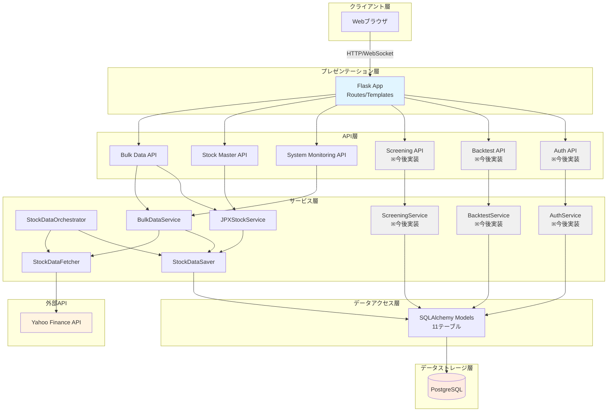
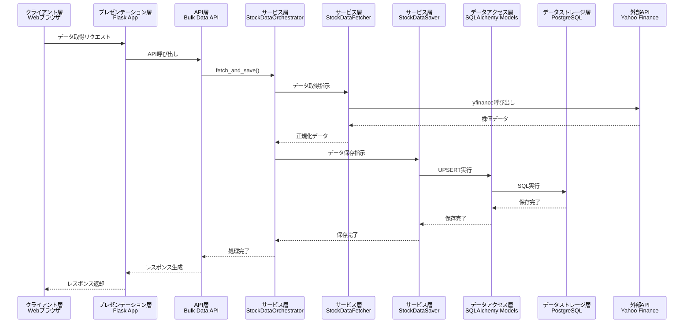
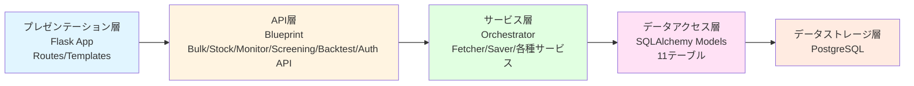

category: architecture
ai_context: high
last_updated: 2025-11-15
related_docs:
  - ./component_dependency.md
  - ./service_responsibilities.md
  - ./data_flow.md
  - ./database_design.md
  - ../api/api_reference.md
  - ../frontend/frontend_spec.md

# システムアーキテクチャ概要

## 目次

- [1. プロジェクト概要](#1-プロジェクト概要)
- [2. 主要機能一覧](#2-主要機能一覧)
- [3. システム全体像](#3-システム全体像)
- [4. アーキテクチャ構成](#4-アーキテクチャ構成)
- [5. 技術スタック](#5-技術スタック)
- [6. 主要パッケージ](#6-主要パッケージ)

---

## 1. プロジェクト概要

### システムの目的

日本株の投資判断を支援するための株価データ収集・管理・分析システム。Yahoo Finance APIを活用し、JPX上場銘柄(4,000銘柄以上)の株価データを8種類の時間軸で自動取得・蓄積し、ダッシュボード、銘柄検索、スクリーニング、バックテスト等の機能を提供する。

### 解決する課題

| 課題                               | 解決策                                     |
| ---------------------------------- | ------------------------------------------ |
| 手動でのデータ収集には時間がかかる | Yahoo Finance APIとの自動連携              |
| 複数時間軸データの統一管理が困難   | 8種類の時間軸を一元管理するDB設計          |
| 大量銘柄データ取得の非効率性       | 並列処理とバッチ機能による高速化           |
| データ整合性の維持が困難           | PostgreSQLによる堅牢な管理                 |
| 投資判断に必要な情報の分散         | ダッシュボード・銘柄検索・分析ツールの統合 |

### 主な価値

- **時間節約**: 手動収集作業を自動化
- **多角的分析**: 8種類の時間軸(1分足〜月足)で短期〜長期投資に対応
- **スケーラビリティ**: 単一銘柄から全JPX銘柄まで柔軟に対応
- **信頼性**: PostgreSQLとエラーハンドリングによる安定稼働
- **総合的な投資支援**: データ収集から分析、バックテストまで一気通貫

### 設計理念

- **動作優先**: まず動くものを作る
- **シンプル設計**: 複雑さを避ける
- **段階的拡張**: 必要になってから機能追加

---

## 2. 主要機能一覧

frontend_spec.mdに定義された6つの主要機能を実現するためのシステム機能を以下に示します。

### 1. 日本株データのDB格納(データプラットフォーム)

| 機能                           | できること                                                                                                                    | エンドポイント/技術                            | 実装レイヤー                                       |
| ------------------------------ | ----------------------------------------------------------------------------------------------------------------------------- | ---------------------------------------------- | -------------------------------------------------- |
| **バルク取得**                 | 複数銘柄を並列処理で一括取得(最大10並列)<br>リアルタイム進捗表示、ETA推定                                                     | 既存: `POST /api/bulk/start`<br>WebSocket      | API層<br>サービス層                                |
| **JPX全銘柄取得**              | 4,000銘柄以上を自動取得<br>バッチ実行履歴の記録                                                                               | 既存: `POST /api/bulk/jpx-sequential/start`    | API層<br>サービス層                                |
| **マルチタイムフレーム管理**   | 8種類の時間軸データを自動振り分け<br>(1分足、5分足、15分足、30分足、1時間足、1日足、1週足、1月足)<br>重複チェックとUPSERT操作 | 既存: サービス層(StockDataSaver)               | サービス層<br>データアクセス層                     |
| **ファンダメンタルデータ取得** | EPS、BPS、売上、営業利益、純利益、ROE、自己資本比率等の財務指標取得                                                           | `POST /api/fetch-fundamental`<br>※今後実装予定 | API層 (新規作成)<br>サービス層<br>データアクセス層 |

### 2. ダッシュボード

| 機能                         | できること                               | エンドポイント/画面                                 | 実装レイヤー                                                    |
| ---------------------------- | ---------------------------------------- | --------------------------------------------------- | --------------------------------------------------------------- |
| **ポートフォリオ概況表示**   | ポートフォリオ評価額、保有銘柄一覧の確認 | `GET /api/portfolio/summary`<br>※今後実装予定       | API層<br>サービス層<br>データアクセス層<br>プレゼンテーション層 |
| **主要インデックス表示**     | 時系列インデックスデータの表示           | `GET /api/indices`<br>※今後実装予定                 | API層<br>サービス層<br>データアクセス層                         |
| **データ取得ジョブ管理**     | 手動トリガボタン、ジョブステータス表示   | 既存: `POST /api/bulk/start`<br>WebSocket           | API層<br>プレゼンテーション層<br>フロントエンド                 |
| **ウィジェットカスタマイズ** | ダッシュボードの表示項目カスタマイズ     | `PUT /api/user/dashboard-settings`<br>※今後実装予定 | API層<br>サービス層<br>データアクセス層                         |

### 3. 銘柄検索と詳細表示

| 機能                     | できること                                                | エンドポイント                                                       | 実装レイヤー                                                                              |
| ------------------------ | --------------------------------------------------------- | -------------------------------------------------------------------- | ----------------------------------------------------------------------------------------- |
| **銘柄マスタ検索**       | 銘柄コード/名称で検索<br>JPX全上場銘柄の基本情報管理      | 既存: `GET /api/stock-master/list`<br>`GET /api/stock-master/search` | API層<br>サービス層<br>データアクセス層                                                   |
| **株価データ参照**       | 時系列ごとの価格情報(OHLCV)の取得<br>ページネーション対応 | 既存: `GET /api/stocks`                                              | API層<br>データアクセス層                                                                 |
| **チャート表示**         | 複数期間の株価チャート表示                                | `GET /api/stocks/{symbol}/chart`<br>※今後実装予定                    | API層<br>サービス層<br>プレゼンテーション層<br>フロントエンド: チャートライブラリ(検討中) |
| **ファンダメンタル表示** | 財務指標の表示                                            | `GET /api/stocks/{symbol}/fundamental`<br>※今後実装予定              | API層<br>サービス層<br>データアクセス層                                                   |
| **銘柄比較機能**         | 複数銘柄の比較                                            | `POST /api/stocks/compare`<br>※今後実装予定                          | API層<br>サービス層<br>プレゼンテーション層                                               |

### 4. 分析ツール(スクリーニング)

| 機能                       | できること                                                    | エンドポイント                                                           | 実装レイヤー                                                    |
| -------------------------- | ------------------------------------------------------------- | ------------------------------------------------------------------------ | --------------------------------------------------------------- |
| **スクリーニング**         | PER、PBR、ROE等の指標で銘柄絞り込み<br>期間指定、複合条件設定 | `POST /api/screening/execute`<br>※今後実装予定                           | API層<br>サービス層<br>データアクセス層<br>プレゼンテーション層 |
| **スクリーニング結果保存** | 絞込結果の保存                                                | `POST /api/screening/save`<br>`GET /api/screening/list`<br>※今後実装予定 | API層<br>サービス層<br>データアクセス層                         |
| **データエクスポート**     | CSV形式でのエクスポート                                       | `GET /api/screening/{id}/export`<br>※今後実装予定                        | API層<br>サービス層                                             |

### 5. バックテスト(簡易)

| 機能                 | できること                                             | エンドポイント                                         | 実装レイヤー                                                                              |
| -------------------- | ------------------------------------------------------ | ------------------------------------------------------ | ----------------------------------------------------------------------------------------- |
| **バックテスト実行** | 期間、初期資金、売買ルールを設定し過去データで戦略検証 | `POST /api/backtest/start`<br>※今後実装予定            | API層<br>サービス層<br>データアクセス層<br>プレゼンテーション層                           |
| **結果可視化**       | 資産曲線、取引ログ、パフォーマンス指標の表示           | `GET /api/backtest/{id}/result`<br>※今後実装予定       | API層<br>サービス層<br>プレゼンテーション層<br>フロントエンド: チャートライブラリ(検討中) |
| **ジョブ管理**       | バックテスト実行状況の監視                             | `GET /api/backtest/jobs`<br>WebSocket<br>※今後実装予定 | API層<br>サービス層<br>WebSocket: Flask-SocketIO                                          |

### 6. ユーザー設定と認証

| 機能                 | できること                        | エンドポイント                                                                                  | 実装レイヤー                                                                                      |
| -------------------- | --------------------------------- | ----------------------------------------------------------------------------------------------- | ------------------------------------------------------------------------------------------------- |
| **認証**             | ログイン/ログアウト(OAuth/メール) | `POST /api/auth/login`<br>`POST /api/auth/logout`<br>`POST /api/auth/register`<br>※今後実装予定 | API層<br>サービス層<br>データアクセス層<br>プレゼンテーション層                                   |
| **プロフィール管理** | ユーザープロフィール編集          | `GET /api/user/profile`<br>`PUT /api/user/profile`<br>※今後実装予定                             | API層<br>サービス層<br>データアクセス層<br>プレゼンテーション層                                   |
| **通知設定**         | 通知のオン/オフ設定               | `GET /api/user/notification-settings`<br>`PUT /api/user/notification-settings`<br>※今後実装予定 | API層<br>サービス層<br>データアクセス層<br>プレゼンテーション層                                   |
| **表示設定**         | テーマ・言語切替                  | `GET /api/user/display-settings`<br>`PUT /api/user/display-settings`<br>※今後実装予定           | API層<br>サービス層<br>データアクセス層<br>プレゼンテーション層<br>フロントエンド: CSS/JavaScript |

### 共通機能(監視・管理)

| 機能                 | できること                                  | エンドポイント                            | 実装レイヤー                                                                                      |
| -------------------- | ------------------------------------------- | ----------------------------------------- | ------------------------------------------------------------------------------------------------- |
| **ヘルスチェック**   | システム稼働状態、DB接続、外部API接続の確認 | 既存: `GET /api/system/health-check`      | API層<br>サービス層                                                                               |
| **バッチ履歴管理**   | バッチ処理の実行履歴、成功/失敗の記録       | `GET /api/batch/history`<br>※今後実装予定 | API層<br>サービス層<br>データアクセス層                                                           |
| **リアルタイム進捗** | WebSocketによる進捗配信、ETA表示            | 既存: WebSocket                           | プレゼンテーション層: Flask-SocketIO<br>フロントエンド: `app/static/script.js` (Socket.IO Client) |

---

## 3. システム全体像

### アーキテクチャ図



### データフロー



---

## 4. アーキテクチャ構成

### レイヤー構成



### レイヤー別責任

| レイヤー                 | 責任                                          | 主要コンポーネント                                        |
| ------------------------ | --------------------------------------------- | --------------------------------------------------------- |
| **プレゼンテーション層** | HTTPリクエスト処理、画面表示、WebSocket通信   | Flask App、Routes、Templates                              |
| **API層**                | エンドポイント定義、リクエスト/レスポンス変換 | Blueprint(Bulk/Stock/Monitor/Screening/Backtest/Auth API) |
| **サービス層**           | ビジネスロジック、外部API連携、データ処理     | Orchestrator、Fetcher、Saver、各種サービス                |
| **データアクセス層**     | DB操作、データモデル定義                      | SQLAlchemy Models                                         |
| **データストレージ層**   | データ永続化                                  | PostgreSQL                                                |

### サービスモジュール構成

```
app/services/
├── stock_data/          # 株価データ関連
│   ├── orchestrator.py  # データ取得・保存統括
│   ├── fetcher.py       # データ取得
│   ├── saver.py         # データ保存
│   ├── converter.py     # データ変換
│   └── validator.py     # データ検証
├── bulk/                # バルクデータ処理
│   └── bulk_service.py
├── jpx/                 # JPX銘柄管理
│   └── jpx_stock_service.py
├── batch/               # バッチ実行管理
│   └── batch_service.py
├── screening/           # スクリーニング(※今後実装)
│   └── screening_service.py
├── backtest/            # バックテスト(※今後実装)
│   └── backtest_service.py
├── auth/                # 認証(※今後実装)
│   └── auth_service.py
└── common/              # 共通機能
    └── error_handler.py
```

### データベーステーブル構成(データアクセス層)

**SQLAlchemy Models(11テーブル):**

| カテゴリ          | テーブル名                                           | 用途             | モデルクラス                             |
| ----------------- | ---------------------------------------------------- | ---------------- | ---------------------------------------- |
| **株価データ(8)** | `stocks_1m`, `stocks_5m`, `stocks_15m`, `stocks_30m` | 短期足(分足)     | Stocks1m, Stocks5m, Stocks15m, Stocks30m |
|                   | `stocks_1h`                                          | 時間足           | Stocks1h                                 |
|                   | `stocks_1d`, `stocks_1wk`, `stocks_1mo`              | 日足・週足・月足 | Stocks1d, Stocks1wk, Stocks1mo           |
| **管理データ(3)** | `stock_master`                                       | JPX銘柄マスタ    | StockMaster                              |
|                   | `batch_execution`                                    | バッチ実行サマリ | BatchExecution                           |
|                   | `batch_execution_detail`                             | バッチ実行詳細   | BatchExecutionDetail                     |

**今後追加予定のテーブル:**
- ポートフォリオ管理テーブル
- スクリーニング条件保存テーブル
- バックテスト結果テーブル
- ユーザー管理テーブル

**共通カラム:**
- `symbol`: 銘柄コード
- `date`/`datetime`: 日付/日時
- `open`, `high`, `low`, `close`: 四本値
- `volume`: 出来高

---

## 5. 技術スタック

### バックエンド

| カテゴリ          | 技術            | バージョン | 用途              |
| ----------------- | --------------- | ---------- | ----------------- |
| Webフレームワーク | Flask           | 3.0.0      | HTTPサーバー      |
| WebSocket         | Flask-SocketIO  | 5.3.5      | リアルタイム通信  |
| ORM               | SQLAlchemy      | 2.0.23     | データベース操作  |
| DBドライバ        | psycopg2-binary | 2.9.9      | PostgreSQL接続    |
| データ取得        | yfinance        | 0.2.66     | Yahoo Finance API |
| データ処理        | pandas          | 2.2.0+     | データ操作        |
| スケジューラ      | APScheduler     | 3.10.4     | 定期実行          |
| WSGIサーバー      | Waitress        | 3.0.0      | 本番環境          |

### フロントエンド

| カテゴリ     | 技術               | 用途                       |
| ------------ | ------------------ | -------------------------- |
| テンプレート | Jinja2             | サーバーサイドレンダリング |
| WebSocket    | Socket.IO Client   | リアルタイム通信           |
| スクリプト   | Vanilla JavaScript | UI制御                     |
| チャート     | ※検討中            | 株価チャート描画           |

### データベース

| 項目       | 内容                            |
| ---------- | ------------------------------- |
| RDBMS      | PostgreSQL 12+                  |
| テーブル数 | 11(株価8 + 管理3) ※今後拡張予定 |

### 開発・テスト

| カテゴリ       | 技術           | 用途                |
| -------------- | -------------- | ------------------- |
| テスト         | pytest         | ユニット/統合テスト |
| スクレイピング | selenium       | JPX銘柄一覧取得     |
| Excelファイル  | xlrd, openpyxl | 銘柄リスト読込      |

---

## 6. 主要パッケージ

### コアパッケージ

#### app/ - アプリケーション本体

```
app/
├── app.py              # プレゼンテーション層: Flaskアプリメイン
├── models.py           # データアクセス層: SQLAlchemy Models定義
├── api/                # API層: Blueprint群
├── services/           # サービス層: ビジネスロジック
├── utils/              # ユーティリティ
├── templates/          # プレゼンテーション層: HTMLテンプレート
└── static/             # プレゼンテーション層: 静的ファイル
```

#### app/api/ - API層
エンドポイント定義(Blueprint)

**実装済み:**
- `bulk_data.py`: Bulk Data API(一括データ取得)
- `stock_master.py`: Stock Master API(銘柄マスタ)
- `system_monitoring.py`: System Monitoring API(システム監視)

**今後実装予定:**
- `screening.py`: Screening API(銘柄スクリーニング)
- `backtest.py`: Backtest API(バックテスト)
- `auth.py`: Auth API(認証)

#### app/services/ - サービス層
ビジネスロジック(機能別モジュール)

**stock_data/** - 株価データ処理
- `orchestrator.py`: **StockDataOrchestrator** - データ取得・保存統括
- `fetcher.py`: **StockDataFetcher** - Yahoo Finance APIからデータ取得
- `saver.py`: **StockDataSaver** - データアクセス層経由でDB保存
- `converter.py`: **StockDataConverter** - データ形式変換
- `validator.py`: **StockDataValidator** - データ検証

**bulk/** - バルク処理
- `bulk_service.py`: **BulkDataService** - 複数銘柄並列取得

**jpx/** - JPX銘柄管理
- `jpx_stock_service.py`: **JPXStockService** - JPX銘柄マスタ管理

**batch/** - バッチ管理
- `batch_service.py`: **BatchService** - バッチ実行履歴管理

**今後実装予定:**
- **screening/**: スクリーニングサービス
- **backtest/**: バックテストサービス
- **auth/**: 認証サービス

**common/** - 共通機能
- `error_handler.py`: **ErrorHandler** - エラーハンドリング統一管理

#### app/utils/ - ユーティリティ

- `structured_logger.py`: **StructuredLogger** - JSON形式ログ出力
- `timeframe_utils.py`: **TimeframeUtils** - 時間軸変換・管理
- `database_utils.py`: **DatabaseUtils** - DB接続管理
- `api_response.py`: API レスポンス標準化

### 主要クラス・メソッド

#### StockDataOrchestrator
データ取得・保存の統括管理

```python
# 主要メソッド
fetch_and_save(symbol, interval, period)  # 単一銘柄取得
fetch_and_save_multiple_timeframes()       # 複数時間軸取得
```

#### BulkDataService
複数銘柄の並列処理

```python
# 主要メソッド
fetch_multiple_stocks(symbols, interval)   # バルク取得
fetch_all_stocks_from_list_file()         # リストファイルから一括
```

#### JPXStockService
JPX銘柄マスタ管理

```python
# 主要メソッド
update_stock_master()                      # マスタ更新
get_stock_list()                          # 銘柄一覧取得
```

---

## 関連ドキュメント

- [フロントエンド機能仕様](../frontend/frontend_spec.md)
- [コンポーネント依存関係](./component_dependency.md)
- [サービス責任分掌](./service_responsibilities.md)
- [データフロー](./data_flow.md)
- [データベース設計](./database_design.md)
- [APIリファレンス](../api/api_reference.md)

---

**最終更新**: 2025-11-15
