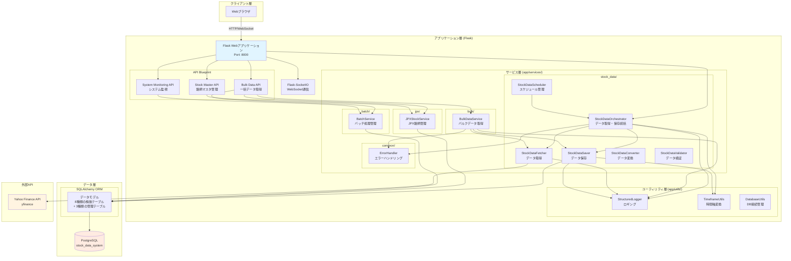
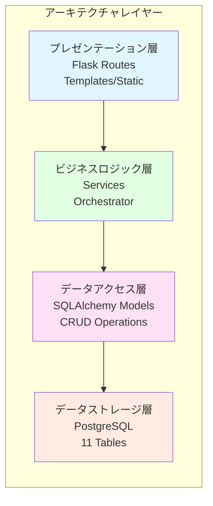

category: architecture
ai_context: high
last_updated: 2025-01-02
related_docs:
  - ./component_dependency.md
  - ./service_responsibilities.md
  - ./data_flow.md
  - ./database_design.md
  - ../api/api_reference.md

# システムアーキテクチャ概要

## 目次

- [1. プロジェクト概要](#1-プロジェクト概要)
- [2. システム全体像](#2-システム全体像)
- [3. アーキテクチャ構成](#3-アーキテクチャ構成)
- [4. 技術スタック](#4-技術スタック)
- [5. プロジェクトディレクトリ構成](#5-プロジェクトディレクトリ構成)
- [6. 主要コンポーネント](#6-主要コンポーネント)
- [7. システムの特徴](#7-システムの特徴)
- [8. 開発方針](#8-開発方針)

## 1. プロジェクト概要

### 1.1 目的

Yahoo Finance（yfinance）から日本企業の株価データを取得し、PostgreSQLデータベースに格納・管理するWebアプリケーション。

### 1.2 設計理念

- **動作優先**: まず動くものを作る
- **シンプル設計**: 複雑さを避け、必要最小限の構成
- **段階的拡張**: 必要になってから機能追加・リファクタリング

### 1.3 現在の状態

**実装完了済み（v1.0）:**
- ✅ 8種類の時間軸対応（1m, 5m, 15m, 30m, 1h, 1d, 1wk, 1mo）
- ✅ マルチタイムフレームデータ管理
- ✅ バルクデータ取得（並列処理対応）
- ✅ JPX全銘柄マスタ管理
- ✅ WebSocketリアルタイム進捗配信
- ✅ サービスモジュール化（機能別ディレクトリ構成）
---
## 2. システム全体像

### 2.1 システムアーキテクチャ図



### 2.2 レイヤー構造


---
## 3. アーキテクチャ構成

### 3.1 レイヤー分離

| レイヤー                 | 役割                         | 主要コンポーネント                                 |
| ------------------------ | ---------------------------- | -------------------------------------------------- |
| **プレゼンテーション層** | HTTPリクエスト処理、画面表示 | Flask Routes, Templates, Static Files              |
| **API層**                | APIエンドポイント提供        | Blueprint (bulk_api, stock_master_api, system_api) |
| **ビジネスロジック層**   | データ処理、ビジネスルール   | Services (Orchestrator, BulkService, JPXService等) |
| **データアクセス層**     | DB操作、ORM                  | SQLAlchemy Models                                  |
| **データストレージ層**   | データ永続化                 | PostgreSQL                                         |

### 3.2 サービスモジュール化

サービス層は機能別にモジュール化されています：

```
app/services/
├── stock_data/      # 株価データ取得・保存
│   ├── fetcher.py
│   ├── saver.py
│   ├── converter.py
│   ├── validator.py
│   ├── orchestrator.py
│   └── scheduler.py
├── bulk/            # 一括データ取得
│   └── bulk_service.py
├── jpx/             # JPX銘柄マスタ管理
│   └── jpx_stock_service.py
├── batch/           # バッチ実行管理
│   └── batch_service.py
└── common/          # 共通機能
    └── error_handler.py
```

**モジュール化の目的:**
- クラス増加時のスケーラビリティ向上
- 責務の明確化
- 依存関係の整理
---
## 4. 技術スタック

### 4.1 バックエンド

| カテゴリ          | 技術            | バージョン | 用途                       |
| ----------------- | --------------- | ---------- | -------------------------- |
| Webフレームワーク | Flask           | 3.0.0      | HTTPサーバー・ルーティング |
| WebSocket         | Flask-SocketIO  | 5.3.5      | リアルタイム通信           |
| ORM               | SQLAlchemy      | 2.0.23     | データベース操作           |
| DBドライバ        | psycopg2-binary | 2.9.9      | PostgreSQL接続             |
| 株価データ取得    | yfinance        | 0.2.66     | Yahoo Finance API          |
| 環境変数管理      | python-dotenv   | 1.0.0      | 設定管理                   |
| スケジューラ      | APScheduler     | 3.10.4     | 定期実行                   |
| データ処理        | pandas          | 2.2.0+     | データフレーム操作         |
| WSGIサーバー      | Waitress        | 3.0.0      | 本番環境サーバー           |
| 非同期処理        | eventlet        | 0.36.1     | WebSocket対応              |

### 4.2 フロントエンド

| カテゴリ             | 技術               | 用途                       |
| -------------------- | ------------------ | -------------------------- |
| テンプレートエンジン | Jinja2             | HTML生成                   |
| スタイル             | CSS                | スタイリング               |
| スクリプト           | Vanilla JavaScript | クライアントサイドロジック |
| WebSocket            | Socket.IO Client   | リアルタイム通信           |

### 4.3 データベース

| カテゴリ   | 技術           | 詳細                             |
| ---------- | -------------- | -------------------------------- |
| RDBMS      | PostgreSQL 12+ | データストレージ                 |
| テーブル数 | 11テーブル     | 8種類の株価 + 3種類のマスタ/管理 |

**株価テーブル:**
- `stocks_1m`, `stocks_5m`, `stocks_15m`, `stocks_30m`（分足・時間足）
- `stocks_1h`（時間足）
- `stocks_1d`, `stocks_1wk`, `stocks_1mo`（日足・週足・月足）

**管理テーブル:**
- `stock_master`（JPX銘柄マスタ）
- `batch_execution`（バッチ実行管理）
- `batch_execution_detail`（バッチ実行詳細）

### 4.4 開発・テスト

| カテゴリ             | 技術              | バージョン     | 用途                |
| -------------------- | ----------------- | -------------- | ------------------- |
| テストフレームワーク | pytest            | 7.4.3          | ユニット/統合テスト |
| Webスクレイピング    | selenium          | 4.15.2         | JPX銘柄一覧取得     |
| Webドライバ管理      | webdriver-manager | 4.0.1          | ドライバ自動管理    |
| Excelファイル処理    | xlrd, openpyxl    | 2.0.1+, 3.1.0+ | 銘柄リスト読込      |
---
## 5. プロジェクトディレクトリ構成

### 5.1 全体構成

```
stock-investment-analyzer/
├── app/
│   ├── app.py                          # Flaskアプリケーションメイン
│   ├── models.py                       # SQLAlchemyモデル定義
│   ├── api/                            # API Blueprint群
│   │   ├── __init__.py
│   │   ├── bulk_data.py               # バルクデータAPI
│   │   ├── stock_master.py            # 銘柄マスタAPI
│   │   └── system_monitoring.py       # システム監視API
│   ├── services/                       # サービス層（モジュール化）
│   │   ├── stock_data/                # 株価データ関連
│   │   │   ├── __init__.py
│   │   │   ├── fetcher.py
│   │   │   ├── saver.py
│   │   │   ├── converter.py
│   │   │   ├── validator.py
│   │   │   ├── orchestrator.py
│   │   │   └── scheduler.py
│   │   ├── bulk/                      # バルクデータ処理
│   │   │   ├── __init__.py
│   │   │   └── bulk_service.py
│   │   ├── jpx/                       # JPX銘柄管理
│   │   │   ├── __init__.py
│   │   │   └── jpx_stock_service.py
│   │   ├── batch/                     # バッチ実行管理
│   │   │   ├── __init__.py
│   │   │   └── batch_service.py
│   │   └── common/                    # 共通機能
│   │       ├── __init__.py
│   │       └── error_handler.py
│   ├── utils/                         # ユーティリティ
│   │   ├── __init__.py
│   │   ├── database_utils.py
│   │   ├── structured_logger.py
│   │   ├── timeframe_utils.py
│   │   └── api_response.py
│   ├── templates/                     # HTMLテンプレート
│   │   ├── index.html
│   │   └── websocket_test.html
│   └── static/                        # 静的ファイル
│       ├── style.css
│       ├── app.js
│       └── jpx_sequential.js
├── docs/                              # ドキュメント
│   ├── architecture/                  # アーキテクチャドキュメント
│   ├── api/                          # API仕様書
│   ├── development/                  # 開発ガイド
│   ├── testing/                      # テストガイド
│   └── guides/                       # その他ガイド
├── tests/                            # テストコード
│   ├── conftest.py
│   ├── unit/
│   ├── integration/
│   └── e2e/
├── scripts/                          # ユーティリティスクリプト
├── .env                              # 環境変数（gitignore）
├── requirements.txt                  # Python依存関係
├── pyproject.toml                    # プロジェクト設定
└── README.md                         # プロジェクトREADME
```

### 5.2 主要ディレクトリの役割

#### app/
アプリケーション本体。Flask アプリ、モデル、サービス、API、UI を含む。

#### app/api/
API Blueprint群。フロントエンド → バックエンド呼び出し用のルート定義。

- `bulk_data.py`: 一括データ取得API
- `stock_master.py`: JPX銘柄マスタAPI
- `system_monitoring.py`: システム監視API

#### app/services/
ビジネスロジック層。機能別にモジュール化。

- `stock_data/`: 株価データの取得・保存・変換・検証
- `bulk/`: 複数銘柄の一括処理
- `jpx/`: JPX銘柄マスタ管理
- `batch/`: バッチ実行履歴管理
- `common/`: エラーハンドリング等の共通機能

#### docs/
プロジェクトドキュメント。アーキテクチャ、API仕様、開発ガイド等。

#### tests/
テストコード。ユニット、統合、E2Eテスト。
---
## 6. 主要コンポーネント

### 6.1 Flaskアプリケーション (app.py)

**役割:**
- HTTPリクエストのルーティング
- APIエンドポイントの提供
- WebSocket通信の管理
- Blueprint統合

**主要エンドポイント:**
- `/` - メインページ
- `/api/fetch-data` - 単一銘柄データ取得
- `/api/stocks` - 株価データCRUD操作
- `/api/system/health-check` - ヘルスチェック
- `/api/system/db-connection-test` - DB接続テスト
- `/api/system/api-connection-test` - 外部API接続テスト

### 6.2 データモデル (models.py)

**8種類の株価テーブル:**

| テーブル名 | 時間軸  | 日時型   | 用途                     |
| ---------- | ------- | -------- | ------------------------ |
| stocks_1m  | 1分足   | datetime | デイトレード、超短期分析 |
| stocks_5m  | 5分足   | datetime | デイトレード             |
| stocks_15m | 15分足  | datetime | スイングトレード         |
| stocks_30m | 30分足  | datetime | 中期分析                 |
| stocks_1h  | 1時間足 | datetime | 中期分析                 |
| stocks_1d  | 日足    | date     | 一般的な分析             |
| stocks_1wk | 週足    | date     | 中長期分析               |
| stocks_1mo | 月足    | date     | 長期投資                 |

**共通カラム:**
- `symbol` (VARCHAR): 銘柄コード
- `date`/`datetime`: 日付/日時
- `open`, `high`, `low`, `close` (DECIMAL): 四本値
- `volume` (BIGINT): 出来高
- `created_at`, `updated_at` (TIMESTAMP): 作成/更新日時

**管理テーブル:**
- `stock_master`: JPX銘柄マスタ（全上場企業4000+銘柄）
- `batch_execution`: バッチ実行管理
- `batch_execution_detail`: バッチ実行詳細

### 6.3 サービス層

#### StockDataOrchestrator (stock_data/orchestrator.py)
**役割:** データ取得・保存の統括管理

**主要メソッド:**
- `fetch_and_save()`: 単一銘柄・単一時間軸のデータ取得・保存
- `fetch_and_save_multiple_timeframes()`: 複数時間軸の一括取得
- `check_data_integrity()`: データ整合性チェック
- `update_all_timeframes()`: 全時間軸の更新

#### BulkDataService (bulk/bulk_service.py)
**役割:** 複数銘柄の一括データ取得

**主要機能:**
- 並列処理による高速データ取得（ThreadPoolExecutor、最大10並列）
- 進捗トラッキング（WebSocket配信）
- ETA（残り時間）推定
- リトライ機能
- エラーハンドリング

**主要メソッド:**
- `fetch_single_stock()`: 単一銘柄取得
- `fetch_multiple_stocks()`: 複数銘柄取得（バッチ/並列）
- `fetch_all_stocks_from_list_file()`: リストファイルから一括取得

#### JPXStockService (jpx/jpx_stock_service.py)
**役割:** JPX全銘柄マスタの管理

**主要機能:**
- JPX銘柄一覧の取得・管理（Selenium使用）
- 銘柄マスタの更新
- 順次データ取得の制御

#### StockDataFetcher (stock_data/fetcher.py)
**役割:** Yahoo Finance APIからのデータ取得

**主要機能:**
- yfinanceライブラリを使用したデータ取得
- データの正規化・変換
- エラーハンドリング

#### StockDataSaver (stock_data/saver.py)
**役割:** データベースへのデータ保存

**主要機能:**
- 時間軸に応じたテーブル振り分け（TimeframeUtils使用）
- 重複チェック（UPSERT操作）
- トランザクション管理

### 6.4 API Blueprint

#### Bulk Data API (api/bulk_data.py)
**エンドポイント:**
- `POST /api/bulk/start`: バルクデータ取得開始
- `GET /api/bulk/status/<job_id>`: ジョブステータス取得
- `POST /api/bulk/stop/<job_id>`: ジョブ停止
- `POST /api/bulk/jpx-sequential/start`: JPX全銘柄順次取得開始

#### Stock Master API (api/stock_master.py)
**エンドポイント:**
- `GET /api/stock-master/list`: 銘柄一覧取得
- `POST /api/stock-master/update`: 銘柄マスタ更新
- `GET /api/stock-master/status`: 銘柄マスタ状態取得

#### System Monitoring API (api/system_monitoring.py)
**エンドポイント:**
- `GET /api/system/health-check`: ヘルスチェック
- `POST /api/system/db-connection-test`: DB接続テスト
- `POST /api/system/api-connection-test`: 外部API接続テスト

**Blueprint `url_prefix`**: `/api/system`

### 6.5 ユーティリティ

#### StructuredLogger (utils/structured_logger.py)
**役割:** 構造化ロギング

**機能:**
- JSON形式のログ出力
- ファイルローテーション
- レベル別ログ管理

#### TimeframeUtils (utils/timeframe_utils.py)
**役割:** 時間軸の変換・管理

**機能:**
- 時間軸文字列の検証
- 対応するモデルクラスの取得
- テーブル名の取得

#### ErrorHandler (services/common/error_handler.py)
**役割:** エラーハンドリングの統一管理

**機能:**
- エラー分類（一時的、恒久的、システムエラー）
- エラーメッセージの生成
- エラーレスポンスの標準化
---
## 7. システムの特徴

### 7.1 マルチタイムフレーム対応

**8種類の時間軸を完全サポート:**
- 短期分析: 1分、5分、15分、30分、1時間足
- 中長期分析: 日足、週足、月足

**テーブル自動振り分け:**
- `TimeframeUtils` が時間軸に応じて適切なテーブルを選択
- 日時型の自動判定（datetime型 vs date型）

### 7.2 スケーラブルなデータ取得

**単一銘柄取得:**
- `StockDataOrchestrator` による統括管理
- リトライ機能付き

**バルクデータ取得:**
- 並列処理による高速化（ThreadPoolExecutor、最大10並列）
- WebSocketによるリアルタイム進捗配信
- ETA（残り時間）推定機能

**JPX全銘柄順次取得:**
- 4,000銘柄以上の自動取得
- 8種類の時間軸を順次処理
- 進捗管理・エラーハンドリング

### 7.3 堅牢なエラーハンドリング

**多層エラーハンドリング:**
1. カスタム例外クラス（`DatabaseError`, `StockDataError`）
2. `ErrorHandler` による統一的なエラー処理
3. `StructuredLogger` による詳細ログ記録

**リトライ機能:**
- ネットワークエラー時の自動リトライ
- リトライ回数・待機時間の設定可能

### 7.4 リアルタイム性

**WebSocketによる双方向通信:**
- 進捗状況のリアルタイム配信
- バッチ処理のステータス通知
- クライアント-サーバー間の効率的な通信

### 7.5 拡張性

**モジュール化された設計:**
- 各コンポーネントが独立して動作
- 新しい時間軸の追加が容易
- サービスの追加・変更が柔軟

**Blueprint による API 分離:**
- 機能ごとにAPIを分離
- 独立したルーティング管理
- メンテナンス性の向上
---
## 8. 開発方針

### 8.1 基本方針

- **動作第一**: 完璧でなくても動くものを作る
- **シンプル第一**: 複雑な設計は避ける
- **後から改善**: リファクタリングは動作確認後
- **学習重視**: 新しい技術は必要になってから

### 8.2 コーディング規約

**Python:**
- PEP 8準拠
- Type Hints使用
- Docstring記述（Google Style）

**JavaScript:**
- ESLint使用
- モダンES6+構文

**CSS:**
- BEM記法
- レスポンシブデザイン対応

### 8.3 テスト戦略

**テストレベル:**
- ユニットテスト: 個別関数・メソッドのテスト
- 統合テスト: サービス間連携のテスト
- E2Eテスト: エンドツーエンドの動作確認

**ツール:**
- pytest（テストフレームワーク）
- pytest-cov（カバレッジ測定）
---
## 関連ドキュメント

- [コンポーネント依存関係](./component_dependency.md) - サービス間の依存関係
- [サービス責任分掌](./service_responsibilities.md) - 各サービスの役割
- [データフロー](./data_flow.md) - データの流れと処理フロー
- [データベース設計](./database_design.md) - データベーススキーマ詳細
- [フロントエンド設計](./frontend_design.md) - UI/UX設計
- [APIリファレンス](../api/api_reference.md) - API エンドポイント詳細
---
**最終更新**: 2025-01-02
