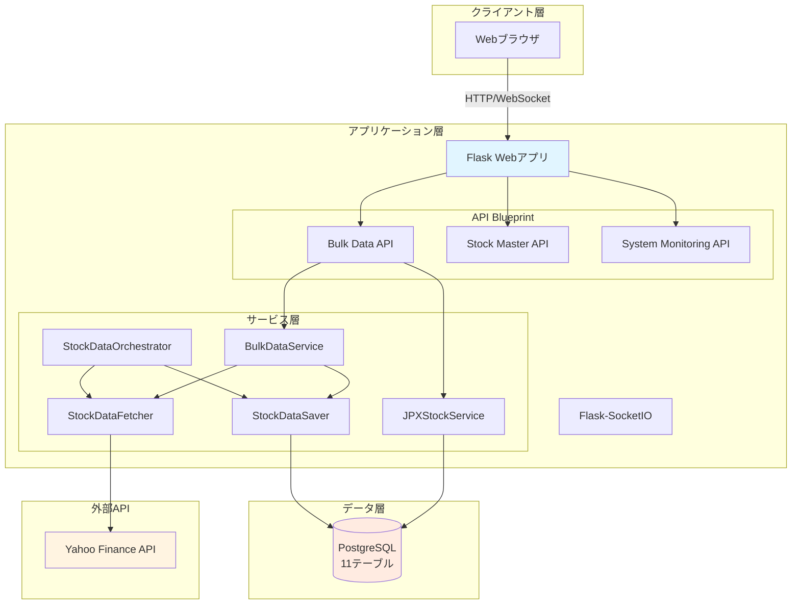
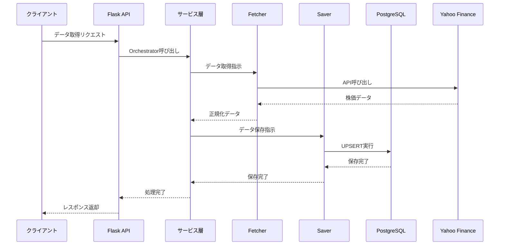
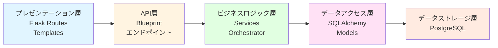

category: architecture
ai_context: high
last_updated: 2025-01-08
related_docs:
  - ./component_dependency.md
  - ./service_responsibilities.md
  - ./data_flow.md
  - ./database_design.md
  - ../api/api_reference.md

# システムアーキテクチャ概要

## 目次

- [1. プロジェクト概要](#1-プロジェクト概要)
- [2. 主要機能一覧](#2-主要機能一覧)
- [3. システム全体像](#3-システム全体像)
- [4. アーキテクチャ構成](#4-アーキテクチャ構成)
- [5. 技術スタック](#5-技術スタック)
- [6. 主要パッケージ](#6-主要パッケージ)

---

## 1. プロジェクト概要

### システムの目的

日本株の投資判断を支援するための株価データ収集・管理システム。Yahoo Finance APIを活用し、JPX上場銘柄（4,000銘柄以上）の株価データを8種類の時間軸で自動取得・蓄積する。

### 解決する課題

| 課題 | 解決策 |
|------|--------|
| 手動でのデータ収集には時間がかかる | Yahoo Finance APIとの自動連携 |
| 複数時間軸データの統一管理が困難 | 8種類の時間軸を一元管理するDB設計 |
| 大量銘柄データ取得の非効率性 | 並列処理とバッチ機能による高速化 |
| データ整合性の維持が困難 | PostgreSQLによる堅牢な管理 |

### 主な価値

- **時間節約**: 手動収集作業を自動化
- **多角的分析**: 8種類の時間軸（1分足〜月足）で短期〜長期投資に対応
- **スケーラビリティ**: 単一銘柄から全JPX銘柄まで柔軟に対応
- **信頼性**: PostgreSQLとエラーハンドリングによる安定稼働

### 設計理念

- **動作優先**: まず動くものを作る
- **シンプル設計**: 複雑さを避ける
- **段階的拡張**: 必要になってから機能追加

---

## 2. 主要機能一覧

### データ取得

| 機能 | できること | エンドポイント |
|------|-----------|---------------|
| **単一銘柄取得** | 指定銘柄の株価データを8種類の時間軸で取得 | `POST /api/fetch-data` |
| **バルク取得** | 複数銘柄を並列処理で一括取得（最大10並列）<br>リアルタイム進捗表示、ETA推定 | `POST /api/bulk/start` |
| **JPX全銘柄取得** | 4,000銘柄以上を自動取得<br>バッチ実行履歴の記録 | `POST /api/bulk/jpx-sequential/start` |

### データ管理

| 機能 | できること | エンドポイント |
|------|-----------|---------------|
| **マルチタイムフレーム管理** | 8種類の時間軸データを自動振り分け<br>重複チェックとUPSERT操作 | - |
| **銘柄マスタ管理** | JPX全上場銘柄の基本情報管理<br>銘柄一覧の検索・フィルタリング | `GET /api/stock-master/list`<br>`POST /api/stock-master/update` |
| **株価データ参照** | 保存済みデータの検索・参照<br>ページネーション対応 | `GET /api/stocks` |

### 監視・管理

| 機能 | できること | エンドポイント |
|------|-----------|---------------|
| **ヘルスチェック** | システム稼働状態、DB接続、外部API接続の確認 | `GET /api/system/health-check` |
| **バッチ履歴管理** | バッチ処理の実行履歴、成功/失敗の記録 | - |
| **リアルタイム進捗** | WebSocketによる進捗配信、ETA表示 | WebSocket |

---

## 3. システム全体像

### アーキテクチャ図



### データフロー



---

## 4. アーキテクチャ構成

### レイヤー構成



### サービスモジュール構成

```
app/services/
├── stock_data/          # 株価データ関連
│   ├── orchestrator.py  # データ取得・保存統括
│   ├── fetcher.py       # データ取得
│   ├── saver.py         # データ保存
│   ├── converter.py     # データ変換
│   └── validator.py     # データ検証
├── bulk/                # バルクデータ処理
│   └── bulk_service.py
├── jpx/                 # JPX銘柄管理
│   └── jpx_stock_service.py
├── batch/               # バッチ実行管理
│   └── batch_service.py
└── common/              # 共通機能
    └── error_handler.py
```

### データベーステーブル構成

| カテゴリ | テーブル名 | 用途 |
|---------|-----------|------|
| **株価データ** | `stocks_1m`, `stocks_5m`, `stocks_15m`, `stocks_30m` | 短期足（分足） |
| | `stocks_1h` | 時間足 |
| | `stocks_1d`, `stocks_1wk`, `stocks_1mo` | 日足・週足・月足 |
| **管理データ** | `stock_master` | JPX銘柄マスタ |
| | `batch_execution` | バッチ実行サマリ |
| | `batch_execution_detail` | バッチ実行詳細 |

**共通カラム:**
- `symbol` (VARCHAR): 銘柄コード
- `date`/`datetime`: 日付/日時
- `open`, `high`, `low`, `close` (DECIMAL): 四本値
- `volume` (BIGINT): 出来高

---

## 5. 技術スタック

### バックエンド

| カテゴリ | 技術 | バージョン | 用途 |
|---------|------|-----------|------|
| Webフレームワーク | Flask | 3.0.0 | HTTPサーバー |
| WebSocket | Flask-SocketIO | 5.3.5 | リアルタイム通信 |
| ORM | SQLAlchemy | 2.0.23 | データベース操作 |
| DBドライバ | psycopg2-binary | 2.9.9 | PostgreSQL接続 |
| データ取得 | yfinance | 0.2.66 | Yahoo Finance API |
| データ処理 | pandas | 2.2.0+ | データ操作 |
| スケジューラ | APScheduler | 3.10.4 | 定期実行 |
| WSGIサーバー | Waitress | 3.0.0 | 本番環境 |

### フロントエンド

| カテゴリ | 技術 |
|---------|------|
| テンプレート | Jinja2 |
| WebSocket | Socket.IO Client |
| スクリプト | Vanilla JavaScript |

### データベース

| 項目 | 内容 |
|------|------|
| RDBMS | PostgreSQL 12+ |
| テーブル数 | 11（株価8 + 管理3） |

### 開発・テスト

| カテゴリ | 技術 | 用途 |
|---------|------|------|
| テスト | pytest | ユニット/統合テスト |
| スクレイピング | selenium | JPX銘柄一覧取得 |
| Excelファイル | xlrd, openpyxl | 銘柄リスト読込 |

---

## 6. 主要パッケージ

### コアパッケージ

#### app/
アプリケーション本体

```
app/
├── app.py              # Flaskアプリケーションメイン
├── models.py           # SQLAlchemyモデル定義
├── api/                # API Blueprint群
├── services/           # ビジネスロジック層
├── utils/              # ユーティリティ
├── templates/          # HTMLテンプレート
└── static/             # 静的ファイル
```

#### app/api/
APIエンドポイント定義

- `bulk_data.py`: 一括データ取得API
- `stock_master.py`: 銘柄マスタAPI
- `system_monitoring.py`: システム監視API

#### app/services/
サービス層（機能別モジュール）

**stock_data/** - 株価データ処理
- `orchestrator.py`: データ取得・保存の統括管理
- `fetcher.py`: Yahoo Finance APIからデータ取得
- `saver.py`: データベースへの保存
- `converter.py`: データ形式の変換
- `validator.py`: データ検証

**bulk/** - バルク処理
- `bulk_service.py`: 複数銘柄の一括取得（並列処理）

**jpx/** - JPX銘柄管理
- `jpx_stock_service.py`: JPX全銘柄マスタ管理

**batch/** - バッチ管理
- `batch_service.py`: バッチ実行履歴管理

**common/** - 共通機能
- `error_handler.py`: エラーハンドリング統一管理

#### app/utils/
ユーティリティモジュール

- `structured_logger.py`: JSON形式のログ出力
- `timeframe_utils.py`: 時間軸の変換・管理
- `database_utils.py`: DB接続管理
- `api_response.py`: API レスポンス標準化

### 主要クラス・メソッド

#### StockDataOrchestrator
データ取得・保存の統括管理

```python
# 主要メソッド
fetch_and_save(symbol, interval, period)  # 単一銘柄取得
fetch_and_save_multiple_timeframes()       # 複数時間軸取得
```

#### BulkDataService
複数銘柄の並列処理

```python
# 主要メソッド
fetch_multiple_stocks(symbols, interval)   # バルク取得
fetch_all_stocks_from_list_file()         # リストファイルから一括
```

#### JPXStockService
JPX銘柄マスタ管理

```python
# 主要メソッド
update_stock_master()                      # マスタ更新
get_stock_list()                          # 銘柄一覧取得
```

---

## 関連ドキュメント

- [コンポーネント依存関係](./component_dependency.md)
- [サービス責任分掌](./service_responsibilities.md)
- [データフロー](./data_flow.md)
- [データベース設計](./database_design.md)
- [APIリファレンス](../api/api_reference.md)

---

**最終更新**: 2025-01-08
