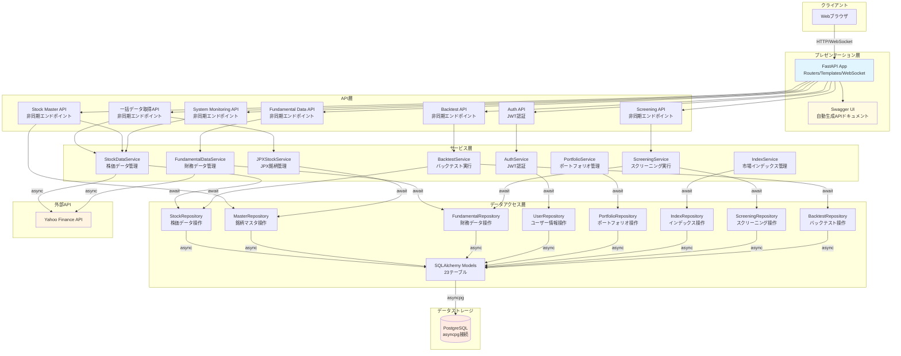
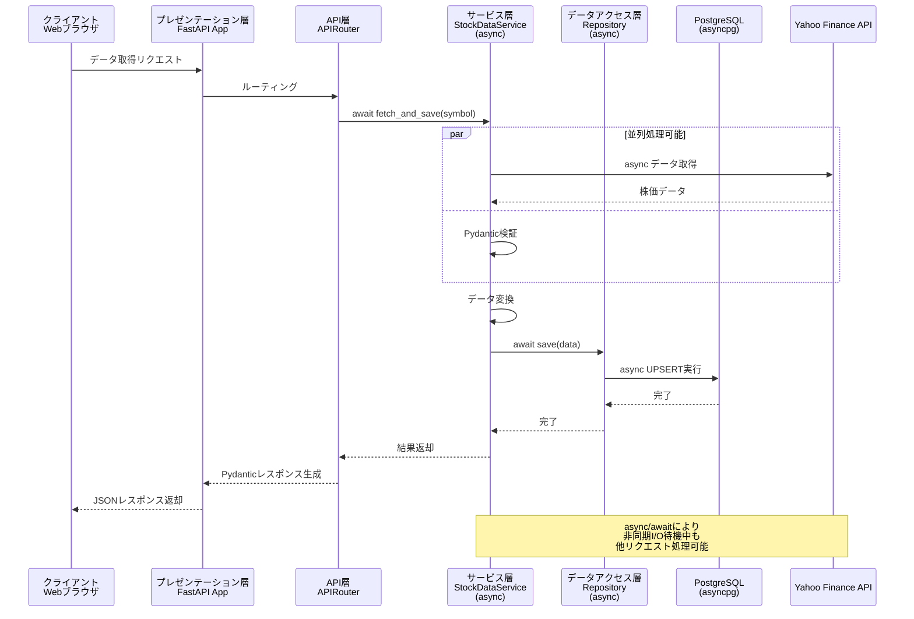
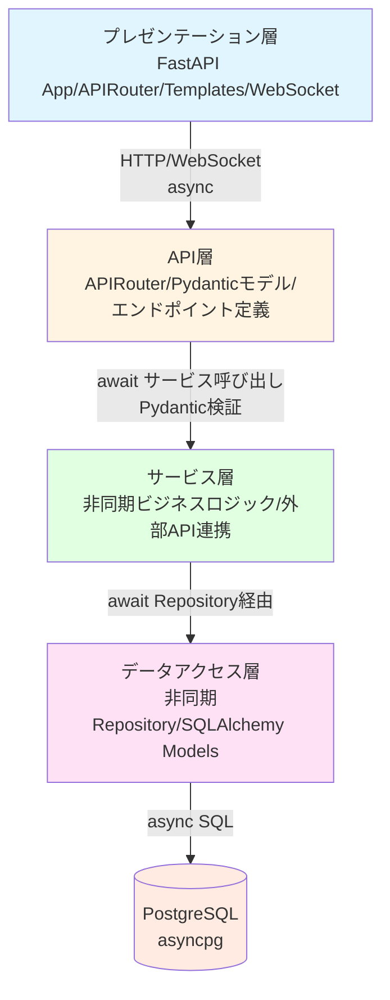

category: architecture
ai_context: high
last_updated: 2025-11-16
related_docs:
  - ./component_dependency.md
  - ./service_responsibilities.md
  - ./data_flow.md
  - ./database_design.md
  - ../api/api_reference.md
  - ../frontend/frontend_spec.md

# システムアーキテクチャ概要

## 目次

- [1. プロジェクト概要](#1-プロジェクト概要)
- [2. 主要機能一覧](#2-主要機能一覧)
- [3. システム全体像](#3-システム全体像)
- [4. アーキテクチャ構成(4層構造)](#4-アーキテクチャ構成4層構造)
- [5. 技術スタック](#5-技術スタック)
- [6. ディレクトリ構成(4層構造対応)](#6-ディレクトリ構成4層構造対応)

---

## 1. プロジェクト概要

### システムの目的

日本株の投資判断を支援するための株価データ収集・管理・分析システム。Yahoo Finance APIを活用し、JPX上場銘柄(4,000銘柄以上)の株価データを8種類の時間軸で自動取得・蓄積し、ダッシュボード、銘柄検索、スクリーニング、バックテスト等の機能を提供する。

### 解決する課題

| 課題                               | 解決策                                     |
| ---------------------------------- | ------------------------------------------ |
| 手動でのデータ収集には時間がかかる | Yahoo Finance APIとの自動連携              |
| 複数時間軸データの統一管理が困難   | 8種類の時間軸を一元管理するDB設計          |
| 大量銘柄データ取得の非効率性       | 並列処理とバッチ機能による高速化           |
| データ整合性の維持が困難           | PostgreSQLによる堅牢な管理                 |
| 投資判断に必要な情報の分散         | ダッシュボード・銘柄検索・分析ツールの統合 |

### 主な価値

- **時間節約**: 手動収集作業を自動化
- **多角的分析**: 8種類の時間軸(1分足〜月足)で短期〜長期投資に対応
- **スケーラビリティ**: 単一銘柄から全JPX銘柄まで柔軟に対応
- **信頼性**: PostgreSQLとエラーハンドリングによる安定稼働
- **総合的な投資支援**: データ収集から分析、バックテストまで一気通貫

### 設計理念

- **動作優先**: まず動くものを作る
- **シンプル設計**: 複雑さを避ける
- **段階的拡張**: 必要になってから機能追加

---

## 2. 主要機能一覧

frontend_spec.mdに定義された6つの主要機能を実現するためのシステム機能を以下に示します。

### 1. 日本株データのDB格納(データプラットフォーム)

| 機能                           | できること                                                                                                                    | エンドポイント/技術                            | 実装レイヤー                            |
| ------------------------------ | ----------------------------------------------------------------------------------------------------------------------------- | ---------------------------------------------- | --------------------------------------- |
| **JPX全銘柄取得**              | 4,000銘柄以上を自動取得<br>バッチ実行履歴の記録                                                                               | `POST /api/batch/jpx-sequential/start`    | API層<br>サービス層                     |
| **マルチタイムフレーム管理**   | 8種類の時間軸データを自動振り分け<br>(1分足、5分足、15分足、30分足、1時間足、1日足、1週足、1月足)<br>重複チェックとUPSERT操作 | サービス層(StockDataSaver)               | サービス層<br>データアクセス層          |
| **ファンダメンタルデータ取得** | EPS、BPS、売上、営業利益、純利益、ROE、自己資本比率等の財務指標取得<br>Yahoo Finance APIから財務データを取得し、fundamental_dataテーブルに格納<br>年次・四半期データの両方をサポート | `POST /api/fundamental/fetch`<br>`GET /api/fundamental/{symbol}` | API層<br>サービス層<br>データアクセス層 |

### 2. ダッシュボード

| 機能                         | できること                               | エンドポイント/画面                                 | 実装レイヤー                                                    |
| ---------------------------- | ---------------------------------------- | --------------------------------------------------- | --------------------------------------------------------------- |
| **ポートフォリオ概況表示**   | ポートフォリオ評価額、保有銘柄一覧、損益情報の確認<br>リアルタイム株価との連動で現在評価額を計算<br>銘柄別保有数量・平均取得単価・現在価格・損益率を表示 | `GET /api/portfolio/summary`<br>`GET /api/portfolio/holdings` | API層<br>サービス層<br>データアクセス層<br>プレゼンテーション層 |
| **主要インデックス表示**     | 日経平均、TOPIX、マザーズ指数等の時系列データ表示<br>日次・週次・月次の推移チャート<br>前日比・騰落率の表示 | `GET /api/indices/list`<br>`GET /api/indices/{index_code}/history` | API層<br>サービス層<br>データアクセス層                         |
| **データ取得ジョブ管理**     | 手動トリガボタン、ジョブステータス表示<br>実行履歴の確認、進捗状況のリアルタイム表示   | `POST /api/batch/start`<br>`GET /api/batch/status/{job_id}`<br>WebSocket: 進捗配信 | API層<br>プレゼンテーション層<br>フロントエンド                 |
| **ウィジェットカスタマイズ** | ダッシュボードの表示項目カスタマイズ<br>ウィジェットの表示/非表示、配置順序の変更<br>ユーザー設定の永続化 | `GET /api/user/dashboard-settings`<br>`PUT /api/user/dashboard-settings` | API層<br>サービス層<br>データアクセス層                         |

### 3. 銘柄検索と詳細表示

| 機能                     | できること                                                | エンドポイント                                                       | 実装レイヤー                                                                              |
| ------------------------ | --------------------------------------------------------- | -------------------------------------------------------------------- | ----------------------------------------------------------------------------------------- |
| **銘柄マスタ検索**       | 銘柄コード/名称で検索<br>JPX全上場銘柄の基本情報管理      | `GET /api/stock-master/list`<br>`GET /api/stock-master/search` | API層<br>サービス層<br>データアクセス層                                                   |
| **株価データ参照**       | 時系列ごとの価格情報(OHLCV)の取得<br>ページネーション対応 | `GET /api/stocks`                                              | API層<br>データアクセス層                                                                 |
| **チャート表示**         | 複数期間の株価チャート表示<br>ローソク足、移動平均線(SMA/EMA)、出来高の表示<br>期間選択(1日、5日、1ヶ月、3ヶ月、1年、5年、全期間)<br>時間軸切り替え(1分足〜月足) | `GET /api/stocks/{symbol}/chart` | API層<br>サービス層<br>プレゼンテーション層<br>フロントエンド: Lightweight Charts |
| **ファンダメンタル表示** | 財務指標の表示<br>EPS、PER、PBR、ROE、配当利回り等<br>年次・四半期推移グラフ<br>業界平均との比較 | `GET /api/stocks/{symbol}/fundamental`              | API層<br>サービス層<br>データアクセス層                                                   |
| **銘柄比較機能**         | 複数銘柄(最大5銘柄)の並列比較<br>株価推移の重ね合わせチャート<br>財務指標の並列表示<br>騰落率の比較 | `POST /api/stocks/compare`                          | API層<br>サービス層<br>プレゼンテーション層                                               |

### 4. 分析ツール(スクリーニング)

| 機能                       | できること                                                    | エンドポイント                                                           | 実装レイヤー                                                    |
| -------------------------- | ------------------------------------------------------------- | ------------------------------------------------------------------------ | --------------------------------------------------------------- |
| **スクリーニング**         | PER、PBR、ROE、配当利回り等の財務指標で銘柄絞り込み<br>株価、出来高、時価総額での条件設定<br>複数条件のAND/OR組み合わせ<br>ソート機能(昇順/降順)<br>プリセット条件の提供(割安株、高配当株、成長株等) | `POST /api/screening/execute`<br>`GET /api/screening/presets` | API層<br>サービス層<br>データアクセス層<br>プレゼンテーション層 |
| **スクリーニング結果保存** | 絞込結果の保存と再利用<br>条件セットの名前付け保存<br>保存済み条件の一覧表示・削除<br>お気に入り条件の管理 | `POST /api/screening/save`<br>`GET /api/screening/list`<br>`DELETE /api/screening/{id}` | API層<br>サービス層<br>データアクセス層                         |
| **データエクスポート**     | CSV/Excel形式でのエクスポート<br>選択列のカスタマイズ<br>エンコーディング選択(UTF-8/Shift-JIS) | `GET /api/screening/{id}/export`                        | API層<br>サービス層                                             |

### 5. バックテスト(簡易)

| 機能                 | できること                                             | エンドポイント                                         | 実装レイヤー                                                                              |
| -------------------- | ------------------------------------------------------ | ------------------------------------------------------ | ----------------------------------------------------------------------------------------- |
| **バックテスト実行** | 期間、初期資金、売買ルールを設定し過去データで戦略検証<br>シンプル移動平均クロス戦略の実装<br>買いエントリー/エグジット条件の設定<br>手数料・スリッページの考慮<br>複数銘柄での並列実行対応 | `POST /api/backtest/start`<br>`GET /api/backtest/{id}/status` | API層<br>サービス層<br>データアクセス層<br>プレゼンテーション層                           |
| **結果可視化**       | 資産曲線、取引ログ、パフォーマンス指標の表示<br>総収益率、シャープレシオ、最大ドローダウンの算出<br>売買タイミングの表示(チャート上)<br>勝率、平均利益/損失の集計 | `GET /api/backtest/{id}/result`<br>`GET /api/backtest/{id}/trades` | API層<br>サービス層<br>プレゼンテーション層<br>フロントエンド: Lightweight Charts |
| **ジョブ管理**       | バックテスト実行状況の監視<br>実行中ジョブの一覧表示<br>進捗率のリアルタイム更新<br>ジョブのキャンセル機能<br>実行履歴の保存と再確認 | `GET /api/backtest/jobs`<br>`DELETE /api/backtest/{id}/cancel`<br>WebSocket: 進捗配信 | API層<br>サービス層<br>WebSocket: Starlette WebSocket |

### 6. ユーザー設定と認証

| 機能                 | できること                        | エンドポイント                                                                                  | 実装レイヤー                                                                                      |
| -------------------- | --------------------------------- | ----------------------------------------------------------------------------------------------- | ------------------------------------------------------------------------------------------------- |
| **認証**             | JWT認証方式を採用<br>ログイン/ログアウト機能<br>新規ユーザー登録<br>パスワードハッシュ化(bcrypt)<br>トークンリフレッシュ機能<br>セッション管理 | `POST /api/auth/login`<br>`POST /api/auth/logout`<br>`POST /api/auth/register`<br>`POST /api/auth/refresh` | API層<br>サービス層<br>データアクセス層<br>プレゼンテーション層<br>ライブラリ: PyJWT, passlib |
| **プロフィール管理** | ユーザープロフィール編集<br>メールアドレス、表示名の変更<br>パスワード変更<br>アバター画像のアップロード(オプション) | `GET /api/user/profile`<br>`PUT /api/user/profile`<br>`PUT /api/user/password` | API層<br>サービス層<br>データアクセス層<br>プレゼンテーション層                                   |
| **通知設定**         | 通知のオン/オフ設定<br>株価アラート(目標価格到達時)<br>バッチ処理完了通知<br>バックテスト完了通知<br>メール通知/ブラウザ通知の切り替え | `GET /api/user/notification-settings`<br>`PUT /api/user/notification-settings`<br>`POST /api/user/alerts` | API層<br>サービス層<br>データアクセス層<br>プレゼンテーション層                                   |
| **表示設定**         | テーマ切替(ライト/ダーク)<br>言語切替(日本語/英語)<br>チャート表示設定<br>タイムゾーン設定<br>ブラウザローカルストレージと同期 | `GET /api/user/display-settings`<br>`PUT /api/user/display-settings` | API層<br>サービス層<br>データアクセス層<br>プレゼンテーション層<br>フロントエンド: CSS Variables/LocalStorage |

### 共通機能(監視・管理)

| 機能                 | できること                                  | エンドポイント                            | 実装レイヤー                                                                                      |
| -------------------- | ------------------------------------------- | ----------------------------------------- | ------------------------------------------------------------------------------------------------- |
| **ヘルスチェック**   | システム稼働状態、DB接続、外部API接続の確認 | `GET /api/system/health-check`      | API層<br>サービス層                                                                               |
| **バッチ履歴管理**   | バッチ処理の実行履歴、成功/失敗の記録<br>実行日時、対象銘柄数、取得件数、エラー詳細<br>履歴のフィルタリング・ソート機能<br>ページネーション対応 | `GET /api/batch/history` | API層<br>サービス層<br>データアクセス層                                                           |
| **リアルタイム進捗** | WebSocketによる進捗配信、ETA表示            | WebSocket                           | プレゼンテーション層: Starlette WebSocket<br>フロントエンド: `app/static/script.js` (WebSocket API) |

---

## 3. システム全体像

### アーキテクチャ図(4層構造)



### データフロー(非同期処理)



---

## 4. アーキテクチャ構成(4層構造)

### レイヤー構成



### レイヤー別責任と配置

| レイヤー               | 責任                                                                                   | 配置ディレクトリ                            | 担当分担例        |
| ---------------------- | -------------------------------------------------------------------------------------- | ------------------------------------------- | ----------------- |
| **プレゼンテーション層** | 非同期HTTPリクエスト処理、画面表示(HTML/CSS/JS)、WebSocket通信、Swagger UI自動生成    | `app/main.py`, `app/templates/`, `app/static/` | 開発者A(フロント) |
| **API層**              | 非同期RESTful APIエンドポイント定義、Pydantic検証、OpenAPIスキーマ自動生成             | `app/api/`                                  | 開発者A(フロント) |
| **サービス層**         | 非同期ビジネスロジック、非同期外部API連携(Yahoo Finance)、Pydanticデータ変換・検証     | `app/services/`                             | 開発者B(バック)   |
| **データアクセス層**   | 非同期Repository Pattern、SQLAlchemy Models(async)、非同期DB操作の抽象化               | `app/repositories/`                         | 開発者B(バック)   |

### 共通モジュール

| モジュール         | 責任                                                               | 配置ディレクトリ  | 共有範囲   |
| ------------------ | ------------------------------------------------------------------ | ----------------- | ---------- |
| **型定義**         | Pydanticモデル、APIリクエスト/レスポンススキーマ、OpenAPI自動生成元 | `app/schemas/`    | 全レイヤー |
| **例外定義**       | カスタムException、FastAPI HTTPExceptionラッパー                   | `app/exceptions/` | 全レイヤー |
| **ユーティリティ** | ロガー、時間軸変換、非同期DB接続など                               | `app/utils/`      | 全レイヤー |

### 4層構造の利点

#### 1. 責任の明確な分離
- 各層が独立した責務を持つ
- レイヤー間の依存関係が一方向
- テストとメンテナンスが容易

#### 2. 並行開発の実現
```
開発者A(フロントエンド/API):
├── プレゼンテーション層の実装
│   ├── HTMLテンプレート
│   ├── CSS/JavaScript
│   ├── WebSocket UI
│   └── Swagger UI設定
└── API層の実装
    ├── APIRouterエンドポイント(async def)
    ├── Pydanticリクエスト/レスポンススキーマ
    ├── OpenAPIメタデータ定義
    └── 自動バリデーション設定

開発者B(バックエンド/データ):
├── サービス層の実装
│   ├── 非同期ビジネスロジック(async def)
│   ├── 非同期Yahoo Finance連携
│   ├── Pydanticデータ変換・検証
│   └── 並列処理実装(asyncio.gather)
└── データアクセス層の実装
    ├── 非同期Repository実装
    ├── SQLAlchemy Models定義(async)
    ├── asyncpg接続設定
    └── 非同期クエリ最適化
```

#### 3. 契約駆動開発(Contract-First Development with FastAPI)
1. **Pydanticスキーマを先に決定** → OpenAPI自動生成
2. **並行開発開始**
   - 開発者A: Swagger UIを見ながらUI開発
   - 開発者B: Pydanticスキーマに従ってビジネスロジック開発
3. **統合**: 型安全性により統合時のエラーが激減

#### 4. Repository Patternの採用(非同期対応)
サービス層がデータベースの実装詳細に依存しないため:
- テスト時に非同期モックRepositoryに差し替え可能
- データソース変更時の影響範囲が限定的
- 非同期クエリロジックの再利用性向上
- asyncpg/psycopg2の切り替えが容易

---

## 5. 技術スタック

### FastAPI選定理由

| 理由                       | 説明                                                                                     |
| -------------------------- | ---------------------------------------------------------------------------------------- |
| **非同期処理ネイティブ**   | 4,000銘柄の並列取得に最適。async/awaitでYahoo Finance API呼び出しを効率化               |
| **自動APIドキュメント生成** | OpenAPI/Swagger UI/ReDocが自動生成。フロント/バック並行開発を促進                        |
| **型安全性**               | Pydantic統合により`app/types/`の型定義を実行時検証。バリデーションを自動化              |
| **高パフォーマンス**       | Starlette/Uvicorn基盤でFlaskより高速。大量データ処理に有利                               |
| **WebSocket対応**          | Starlette経由でWebSocketをネイティブサポート。リアルタイム進捗表示に最適                |
| **モダンなPython**         | Python 3.8+の機能をフル活用。既存の設計理念(型重視、シンプル設計)に合致                 |
| **SQLAlchemy互換**         | 既存のRepository PatternとModelsをそのまま利用可能。移行コストが低い                     |
| **段階的拡張に適合**       | 必要な機能だけを追加可能。「動作優先」「シンプル設計」「段階的拡張」の設計理念に完全一致 |

### バックエンド

| カテゴリ          | 技術            | バージョン | 用途                               |
| ----------------- | --------------- | ---------- | ---------------------------------- |
| Webフレームワーク | FastAPI         | 0.104.0+   | 非同期HTTPサーバー                 |
| バリデーション    | Pydantic        | 2.5.0+     | 型検証・シリアライズ               |
| ASGIサーバー      | Uvicorn         | 0.24.0+    | 本番環境(Gunicornとの組み合わせ可) |
| WebSocket         | Starlette       | 0.27.0+    | リアルタイム通信(FastAPI内包)      |
| ORM               | SQLAlchemy      | 2.0.23     | データベース操作(非同期対応)       |
| 非同期DBドライバ  | asyncpg         | 0.29.0     | PostgreSQL非同期接続               |
| 同期DBドライバ    | psycopg2-binary | 2.9.9      | 移行期の互換性用                   |
| データ取得        | yfinance        | 0.2.66     | Yahoo Finance API                  |
| データ処理        | pandas          | 2.2.0+     | データ操作                         |
| スケジューラ      | APScheduler     | 3.10.4     | 定期実行                           |
| 認証              | PyJWT           | 2.8.0+     | JWT トークン発行・検証             |
| パスワード        | passlib         | 1.7.4+     | パスワードハッシュ化(bcrypt)       |
| データ検証        | email-validator | 2.1.0+     | メールアドレス検証                 |

### フロントエンド

| カテゴリ     | 技術                           | バージョン | 用途                                       |
| ------------ | ------------------------------ | ---------- | ------------------------------------------ |
| テンプレート | Jinja2                         | 3.1.0+     | サーバーサイドレンダリング(FastAPI互換)    |
| WebSocket    | JavaScript WebSocket API       | -          | リアルタイム通信(Starlette WebSocket対応)  |
| スクリプト   | Vanilla JavaScript (ES6+)      | -          | UI制御                                     |
| チャート     | Lightweight Charts             | 4.1.0+     | 株価チャート描画(TradingView製、軽量・高速)|
| APIクライアント | Fetch API                   | -          | FastAPI自動生成OpenAPIスキーマとの連携     |
| UI補助       | Bootstrap                      | 5.3.0+     | レスポンシブデザイン、コンポーネント       |

#### チャートライブラリ選定理由: Lightweight Charts
- **軽量**: バンドルサイズが小さく、ページ読み込みが高速
- **高パフォーマンス**: Canvas描画により大量データでも滑らか
- **金融特化**: ローソク足、出来高、移動平均線等を標準サポート
- **カスタマイズ性**: テーマ、スタイル、インジケーターの追加が容易
- **TradingView製**: 金融チャートの標準ツールとして信頼性が高い
- **無料**: Apache 2.0ライセンスで商用利用可能

#### APIクライアント選定理由: Fetch API
- **ネイティブ**: ブラウザ標準APIで追加ライブラリ不要
- **モダン**: Promise/async-awaitで読みやすいコード
- **軽量**: バンドルサイズゼロ
- **十分な機能**: JSON自動パース、ヘッダー管理、エラーハンドリング対応

### データベース

| 項目       | 内容                                                                                                      |
| ---------- | --------------------------------------------------------------------------------------------------------- |
| RDBMS      | PostgreSQL 12+                                                                                            |
| テーブル数 | 全23テーブル |

#### データベーステーブル設計

**株価データ(8テーブル)**
- `stock_1m` - 1分足株価データ
- `stock_5m` - 5分足株価データ
- `stock_15m` - 15分足株価データ
- `stock_30m` - 30分足株価データ
- `stock_1h` - 1時間足株価データ
- `stock_1d` - 日足株価データ
- `stock_1wk` - 週足株価データ
- `stock_1mo` - 月足株価データ

**マスタデータ(3テーブル)**
- `stock_master` - 銘柄マスタ(全銘柄の基本情報)
- `jpx_stock_master` - JPX銘柄マスタ(JPX上場銘柄情報)
- `batch_execution_log` - バッチ実行履歴

**財務データ(1テーブル)**
- `fundamental_data` - ファンダメンタルデータ(EPS、PER、PBR、ROE等の財務指標)

**ユーザー管理(3テーブル)**
- `users` - ユーザー情報(認証情報、プロフィール)
- `user_sessions` - ユーザーセッション(JWT トークン管理)
- `user_settings` - ユーザー設定(表示設定、通知設定等)

**ポートフォリオ管理(2テーブル)**
- `portfolios` - ポートフォリオ情報(ユーザー別ポートフォリオ定義)
- `portfolio_holdings` - 保有銘柄(銘柄別保有数量・取得単価)

**市場データ(1テーブル)**
- `market_indices` - 市場インデックス(日経平均、TOPIX等の時系列データ)

**スクリーニング(2テーブル)**
- `screening_conditions` - スクリーニング条件(保存された条件セット)
- `screening_results` - スクリーニング結果(実行結果の保存)

**バックテスト(2テーブル)**
- `backtest_jobs` - バックテストジョブ(実行履歴、パラメータ、結果サマリ)
- `backtest_trades` - バックテスト取引履歴(売買タイミング、損益詳細)

**通知管理(1テーブル)**
- `user_alerts` - ユーザーアラート(株価アラート設定、通知履歴)

### 開発・テスト

| カテゴリ       | 技術           | 用途                |
| -------------- | -------------- | ------------------- |
| テスト         | pytest         | ユニット/統合テスト |
| スクレイピング | selenium       | JPX銘柄一覧取得     |
| Excelファイル  | xlrd, openpyxl | 銘柄リスト読込      |

---

## 6. ディレクトリ構成(4層構造対応)

### アプリケーション全体構成

```
STOCK-INVESTMENT-ANALYZER/
├── app/                # アプリケーション本体
│   ├── api/            # API層: APIRouterエンドポイント(async)
│   ├── services/       # サービス層: 非同期ビジネスロジック
│   ├── repositories/   # データアクセス層: 非同期Repository + Models
│   ├── schemas/        # 共通: Pydanticスキーマ定義
│   ├── templates/      # プレゼンテーション層: HTMLテンプレート
│   ├── static/         # プレゼンテーション層: 静的ファイル
│   │   ├── css/        # スタイルシート
│   │   ├── js/         # JavaScript
│   │   └── images/     # 画像ファイル
│   ├── exceptions/     # 共通: カスタムException
│   ├── utils/          # 共通: ユーティリティ
│   └── main.py         # プレゼンテーション層: FastAPIアプリメイン
├── docs/               # ドキュメント
│   ├── architecture/   # アーキテクチャドキュメント
│   ├── api/            # APIリファレンス
│   └── frontend/       # フロントエンド仕様
├── tests/              # テストコード
│   ├── unit/           # ユニットテスト(非同期対応)
│   ├── integration/    # 統合テスト(非同期対応)
│   └── e2e/            # E2Eテスト
├── requirements.txt    # 依存パッケージ
├── .env.example        # 環境変数サンプル
└── README.md           # プロジェクト概要
```


### 実装優先順位

システムの段階的な構築を実現するため、以下の優先順位で実装を進めます。

#### フェーズ1: コア機能(データプラットフォーム)
1. データベーススキーマ作成(23テーブル)
2. 基盤ユーティリティ(DB接続、ロガー、時間軸変換)
3. 株価データ取得・保存機能
4. JPX銘柄マスタ管理
5. バッチ処理機能

#### フェーズ2: 基本UI
1. 認証機能(JWT)
2. ダッシュボード
3. 銘柄検索・一覧表示
4. チャート表示(Lightweight Charts)

#### フェーズ3: 財務・分析機能
1. ファンダメンタルデータ取得
2. ポートフォリオ管理
3. 市場インデックス表示
4. スクリーニング機能

#### フェーズ4: 高度な機能
1. バックテスト機能
2. アラート・通知機能
3. データエクスポート
4. パフォーマンス最適化

### FastAPI固有の設計要素

#### Pydanticスキーマの役割
- レイヤー間の契約を明確化
- 実行時型検証による自動バリデーション
- OpenAPI/Swagger UI/ReDocの自動生成
- JSON⇔Pythonオブジェクトの自動変換

#### 非同期処理の実装方針
- 全レイヤーで`async/await`を使用
- 並列処理は`asyncio.gather()`を活用
- DBアクセスは`asyncpg`で非同期化
- 外部API呼び出しも非同期対応

#### 依存性注入の活用
- DB接続: `Depends(get_async_db)`
- サービス層: `Depends(get_service)`
- 認証/認可: `Depends(get_current_user)`

---

## 関連ドキュメント

- [フロントエンド機能仕様](../frontend/frontend_spec.md)
- [コンポーネント依存関係](./component_dependency.md)
- [サービス責任分掌](./service_responsibilities.md)
- [データフロー](./data_flow.md)
- [データベース設計](./database_design.md)
- [APIリファレンス](../api/api_reference.md)

---

**最終更新**: 2025-11-16
