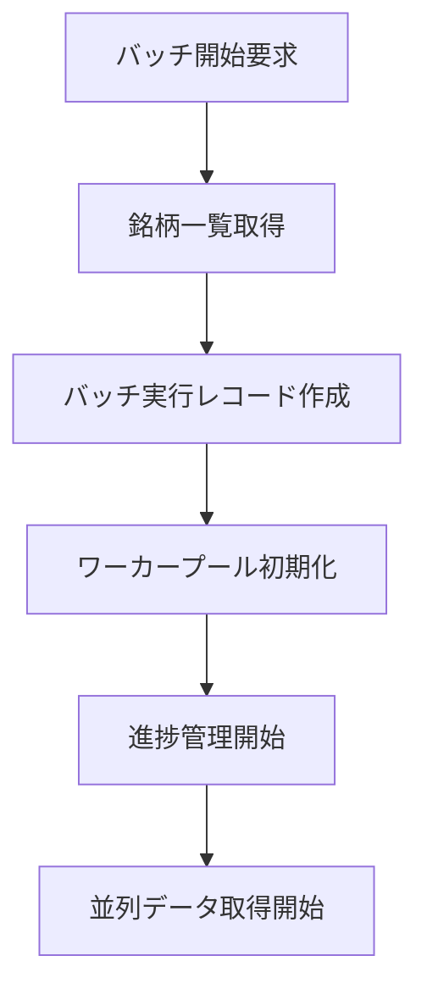
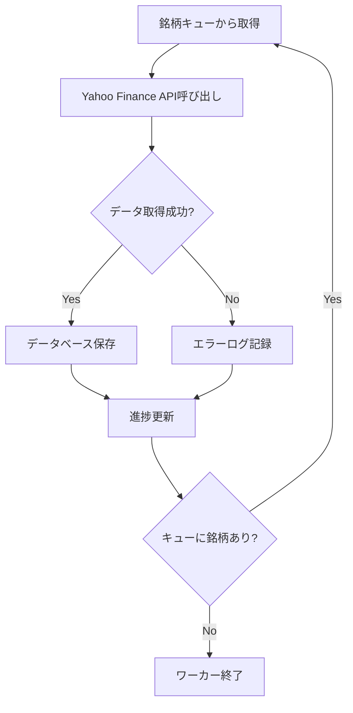
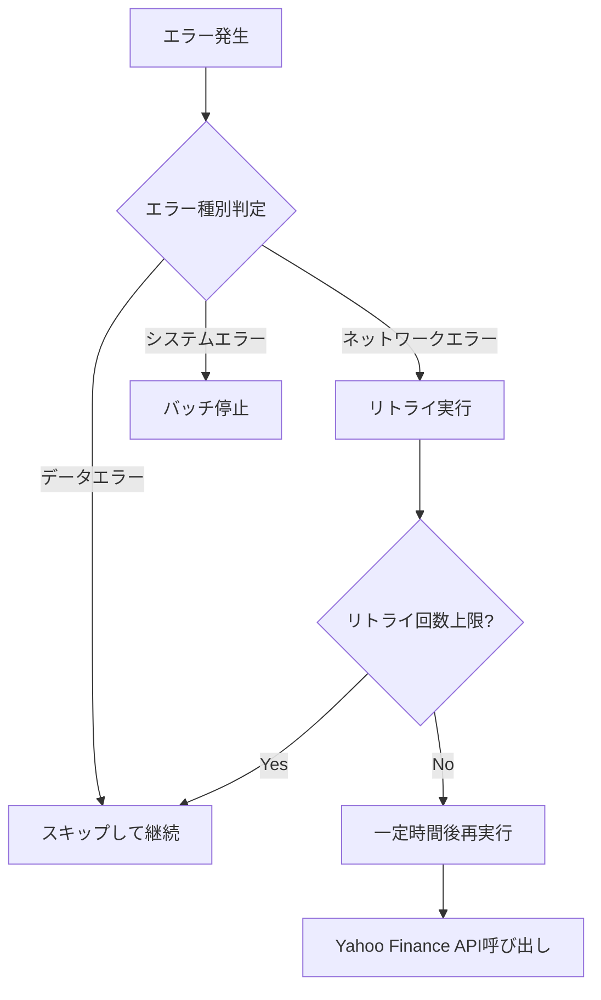

# バッチ処理設計仕様書

## 📋 概要
全銘柄一括取得機能のためのバッチ処理システムの設計仕様

**目的**: JPXから取得した銘柄一覧を基に、全銘柄の株価データを効率的に一括取得する

---

## 🎯 要件定義

### 機能要件
1. **全銘柄データ取得**: JPX銘柄一覧の全銘柄に対して株価データを一括取得
2. **進捗表示**: 取得進捗をリアルタイムで表示
3. **エラーハンドリング**: 個別銘柄のエラー時もバッチ処理を継続
4. **取得状況管理**: 中断・再開機能
5. **結果レポート**: 取得完了後のサマリー表示

### 非機能要件
1. **パフォーマンス**: 効率的な並列処理による高速化
2. **信頼性**: ネットワークエラーに対する堅牢性
3. **拡張性**: 銘柄数増加に対応可能な設計
4. **監視性**: 詳細なログ出力と状況可視化

---

## 🏗️ システム構成

### アーキテクチャ図
```
[フロントエンド]
       ↓
[バッチ制御API]
       ↓
[バッチ処理エンジン] ←→ [進捗管理]
       ↓
[並列データ取得ワーカー]
       ↓
[Yahoo Finance API] / [データベース]
```

### コンポーネント構成
```
batch_processor/
├── controller.py          # バッチ制御API
├── engine.py             # バッチ処理エンジン
├── worker.py             # データ取得ワーカー
├── progress_manager.py   # 進捗管理
├── error_handler.py      # エラーハンドリング
├── config.py            # バッチ設定
└── models.py            # データモデル
```

---

## 📊 データ構造

### バッチ実行情報テーブル (batch_executions)
```sql
CREATE TABLE batch_executions (
    id SERIAL PRIMARY KEY,
    batch_type VARCHAR(50) NOT NULL,        -- 'all_stocks', 'partial', etc.
    status VARCHAR(20) NOT NULL,            -- 'running', 'completed', 'failed', 'paused'
    total_stocks INTEGER NOT NULL,
    processed_stocks INTEGER DEFAULT 0,
    successful_stocks INTEGER DEFAULT 0,
    failed_stocks INTEGER DEFAULT 0,
    start_time TIMESTAMP DEFAULT CURRENT_TIMESTAMP,
    end_time TIMESTAMP,
    error_message TEXT,
    created_at TIMESTAMP DEFAULT CURRENT_TIMESTAMP
);
```

### バッチ実行詳細テーブル (batch_execution_details)
```sql
CREATE TABLE batch_execution_details (
    id SERIAL PRIMARY KEY,
    batch_execution_id INTEGER REFERENCES batch_executions(id),
    stock_code VARCHAR(10) NOT NULL,
    status VARCHAR(20) NOT NULL,            -- 'pending', 'processing', 'completed', 'failed'
    start_time TIMESTAMP,
    end_time TIMESTAMP,
    error_message TEXT,
    records_inserted INTEGER DEFAULT 0,
    created_at TIMESTAMP DEFAULT CURRENT_TIMESTAMP
);
```

### 進捗情報 (WebSocket用)
```json
{
    "batch_id": "uuid",
    "status": "running|completed|failed|paused",
    "progress": {
        "total": 3800,
        "processed": 1250,
        "successful": 1200,
        "failed": 50,
        "percentage": 32.89
    },
    "current_processing": ["7203", "6758", "9984"],
    "estimated_completion": "2024-01-15T14:30:00Z",
    "throughput": {
        "stocks_per_minute": 45,
        "records_per_minute": 2250
    }
}
```

---

## ⚙️ 処理フロー

### 1. バッチ開始フロー


### 2. データ取得フロー


### 3. エラーハンドリングフロー


---

## 🔧 実装詳細

### BatchEngine クラス
```python
class BatchEngine:
    def __init__(self, config: BatchConfig):
        self.config = config
        self.worker_pool = None
        self.progress_manager = ProgressManager()
        self.error_handler = ErrorHandler()

    async def start_batch(self, stock_codes: List[str]) -> str:
        """バッチ処理開始"""
        batch_id = self._create_batch_execution()
        await self._initialize_workers()
        await self._process_stocks_parallel(stock_codes, batch_id)
        return batch_id

    async def pause_batch(self, batch_id: str):
        """バッチ処理一時停止"""
        pass

    async def resume_batch(self, batch_id: str):
        """バッチ処理再開"""
        pass

    async def stop_batch(self, batch_id: str):
        """バッチ処理停止"""
        pass
```

### StockDataWorker クラス
```python
class StockDataWorker:
    def __init__(self, worker_id: int, config: BatchConfig):
        self.worker_id = worker_id
        self.config = config
        self.yahoo_client = YahooFinanceClient()

    async def process_stock(self, stock_code: str, batch_id: str) -> ProcessResult:
        """個別銘柄処理"""
        try:
            # データ取得
            stock_data = await self.yahoo_client.get_stock_data(
                stock_code,
                period=self.config.period,
                interval=self.config.interval
            )

            # データ保存
            records_saved = await self._save_to_database(stock_data)

            return ProcessResult(
                success=True,
                records_count=records_saved,
                error_message=None
            )

        except Exception as e:
            return ProcessResult(
                success=False,
                records_count=0,
                error_message=str(e)
            )
```

### ProgressManager クラス
```python
class ProgressManager:
    def __init__(self):
        self.websocket_manager = WebSocketManager()

    async def update_progress(self, batch_id: str, progress_data: dict):
        """進捗情報更新"""
        # データベース更新
        await self._update_batch_execution(batch_id, progress_data)

        # WebSocket配信
        await self.websocket_manager.broadcast_progress(batch_id, progress_data)

    def calculate_eta(self, total: int, processed: int, start_time: datetime) -> datetime:
        """完了予定時刻算出"""
        if processed == 0:
            return None

        elapsed = datetime.now() - start_time
        remaining = total - processed
        avg_time_per_item = elapsed / processed
        eta = datetime.now() + (avg_time_per_item * remaining)

        return eta
```

---

## 📈 パフォーマンス設計

### 並列処理設定
```python
BATCH_CONFIG = {
    # ワーカー設定
    "max_workers": 10,              # 最大並列ワーカー数
    "worker_timeout": 30,           # ワーカータイムアウト（秒）

    # API制限対応
    "requests_per_second": 5,       # API呼び出し制限
    "burst_limit": 20,              # バースト制限

    # リトライ設定
    "max_retries": 3,               # 最大リトライ回数
    "retry_delay": 2,               # リトライ間隔（秒）
    "backoff_multiplier": 2,        # 指数バックオフ

    # バッチサイズ
    "batch_size": 50,               # 一度に処理する銘柄数
    "commit_interval": 10,          # データベースコミット間隔
}
```

### データベース最適化
```sql
-- バッチ処理用インデックス
CREATE INDEX idx_batch_executions_status ON batch_executions(status);
CREATE INDEX idx_batch_execution_details_batch_id ON batch_execution_details(batch_execution_id);
CREATE INDEX idx_batch_execution_details_status ON batch_execution_details(status);

-- パーティショニング（将来的な拡張）
CREATE TABLE batch_executions_2024 PARTITION OF batch_executions
FOR VALUES FROM ('2024-01-01') TO ('2025-01-01');
```

---

## 🛡️ エラーハンドリング

### エラー分類
1. **一時的エラー（リトライ対象）**
   - ネットワークタイムアウト
   - API制限（Rate Limit）
   - 一時的なサーバーエラー（5xx）

2. **永続的エラー（スキップ対象）**
   - 銘柄コード不正（404）
   - データ形式エラー
   - 認証エラー（401, 403）

3. **システムエラー（バッチ停止）**
   - データベース接続エラー
   - メモリ不足
   - 予期しない例外

### エラー処理戦略
```python
class ErrorHandler:
    def __init__(self):
        self.error_stats = defaultdict(int)

    async def handle_error(self, error: Exception, stock_code: str, context: dict) -> ErrorAction:
        """エラー処理判定"""
        error_type = self._classify_error(error)

        if error_type == ErrorType.TEMPORARY:
            return await self._handle_temporary_error(error, stock_code, context)
        elif error_type == ErrorType.PERMANENT:
            return await self._handle_permanent_error(error, stock_code, context)
        else:  # SYSTEM
            return await self._handle_system_error(error, stock_code, context)

    def _classify_error(self, error: Exception) -> ErrorType:
        """エラー分類"""
        if isinstance(error, (TimeoutError, ConnectionError)):
            return ErrorType.TEMPORARY
        elif isinstance(error, HTTPError) and error.status_code == 404:
            return ErrorType.PERMANENT
        elif isinstance(error, DatabaseError):
            return ErrorType.SYSTEM
        else:
            return ErrorType.PERMANENT  # デフォルトは永続的エラー
```

---

## 📊 監視・ログ

### ログ出力項目
```python
BATCH_LOG_FORMAT = {
    "timestamp": "2024-01-15T10:30:00Z",
    "batch_id": "batch_20240115_103000",
    "worker_id": 1,
    "stock_code": "7203",
    "action": "data_fetch|data_save|error_occurred",
    "status": "success|failed|retry",
    "duration_ms": 1500,
    "records_count": 50,
    "error_message": null,
    "retry_count": 0
}
```

### メトリクス収集
- **スループット**: 分あたり処理銘柄数
- **成功率**: 処理成功/失敗の比率
- **平均処理時間**: 銘柄あたりの平均処理時間
- **エラー率**: エラー種別ごとの発生率
- **リソース使用量**: CPU、メモリ、ネットワーク使用量

---

## 🔄 運用手順

### バッチ開始手順
1. システム状態確認（データベース接続、API接続）
2. 銘柄マスタ最新化（JPX連携）
3. バッチ実行要求送信
4. 進捗監視開始

### 障害時対応手順
1. **エラー検知**: ログ監視、アラート受信
2. **状況確認**: バッチ実行状況、エラー内容確認
3. **対応判定**: 継続/一時停止/停止の判断
4. **対応実行**: 必要に応じてバッチ操作実行
5. **復旧確認**: 正常動作確認

### データ整合性確認
- バッチ完了後の件数チェック
- 欠損データの検出・補完
- データ品質チェック（異常値検出）

---

## 🎯 今後の拡張予定

### Phase 2: 高度な機能
- **スケジューリング**: 定期実行機能
- **差分更新**: 前回実行からの差分のみ取得
- **データ検証**: 取得データの品質チェック
- **通知機能**: 完了/エラー時のメール/Slack通知

### Phase 3: スケーラビリティ
- **分散処理**: 複数サーバーでの並列実行
- **ロードバランシング**: 処理負荷の動的調整
- **ストリーミング処理**: リアルタイムデータ取得

---

この設計により、効率的で安定した全銘柄一括取得機能を実現できます。