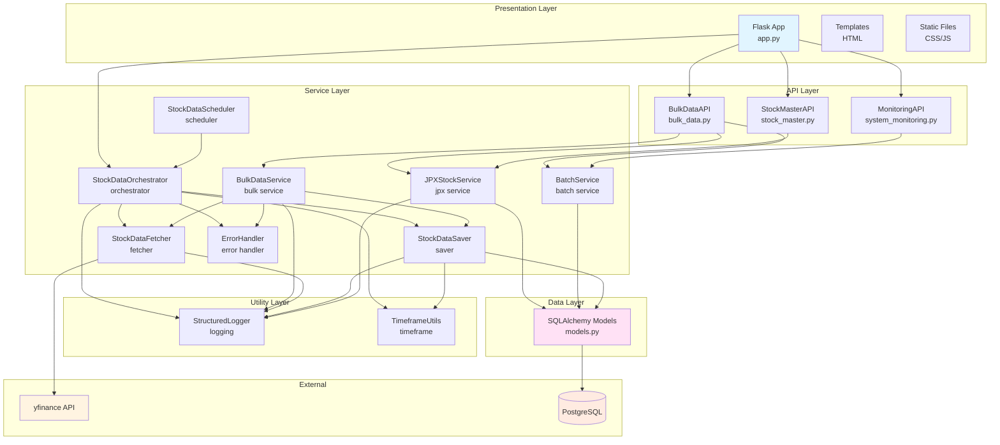
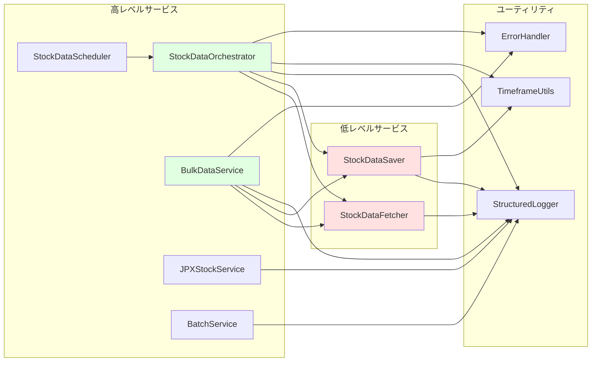
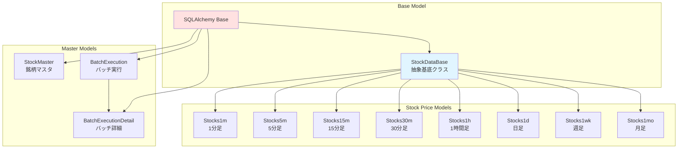
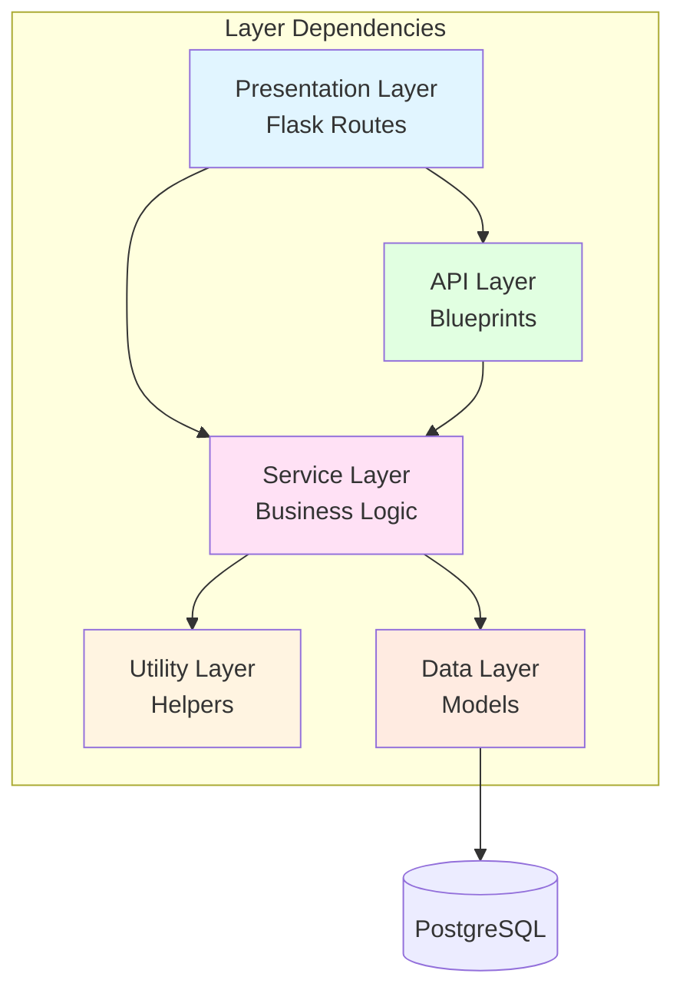
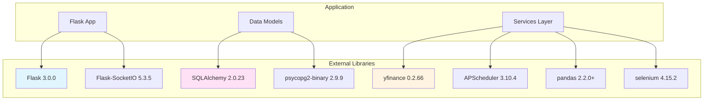

# コンポーネント依存関係

## 目次

- [1. 概要](#1-概要)
- [2. コンポーネント依存関係図](#2-コンポーネント依存関係図)
- [3. 各サービスの依存関係](#3-各サービスの依存関係)
- [4. 依存関係の詳細](#4-依存関係の詳細)
- [5. 循環依存の管理](#5-循環依存の管理)

## 1. 概要

本ドキュメントでは、システム内の各コンポーネント間の依存関係を可視化し、サービス間の関係性を明確にします。

**依存関係の原則:**
- **単方向依存**: 循環依存を避け、明確な依存方向を維持
- **層間依存**: 上位層から下位層への依存のみ許可
- **疎結合**: インターフェースを通じた依存で、実装の詳細に依存しない

## 2. コンポーネント依存関係図

### 2.1 全体依存関係



### 2.2 サービス間依存関係（詳細）



### 2.3 データモデル依存関係



### 2.4 サービスモジュール構造（実装済み）

**実装完了済み（v1.0）:**

システムは機能別にモジュール化されています:

```
app/services/
├── stock_data/      # 株価データ取得・保存
│   ├── fetcher.py          # StockDataFetcher
│   ├── saver.py            # StockDataSaver
│   ├── converter.py        # データ変換
│   ├── validator.py        # データ検証
│   ├── orchestrator.py     # StockDataOrchestrator
│   └── scheduler.py        # StockDataScheduler
├── bulk/            # 一括データ取得
│   └── bulk_service.py     # BulkDataService + ProgressTracker
├── jpx/             # JPX銘柄マスタ管理
│   └── jpx_stock_service.py # JPXStockService
├── batch/           # バッチ実行管理
│   └── batch_service.py    # BatchService
└── common/          # 共通機能
    └── error_handler.py    # ErrorHandler
```

**モジュール間依存の原則:**
- 上位モジュール（bulk, stock_data/orchestrator） → 下位モジュール（stock_data/fetcher, stock_data/saver）
- 疎結合: すべてのモジュールは独立して機能
- 低レベルサービス（Fetcher/Saver）は高レベルサービス（Orchestrator/Bulk）からのみ参照

## 3. 各サービスの依存関係

### 3.1 StockDataOrchestrator（統括サービス）

**依存先:**
- `StockDataFetcher` - データ取得
- `StockDataSaver` - データ保存
- `StructuredLogger` - ロギング
- `TimeframeUtils` - 時間軸変換
- `ErrorHandler` - エラー処理

**役割:**
単一銘柄のデータ取得・保存を統括管理する高レベルサービス

**依存される側:**
- Flask app.py
- StockDataScheduler

### 3.2 BulkDataService（一括取得サービス）

**依存先:**
- `StockDataFetcher` - データ取得
- `StockDataSaver` - データ保存
- `StructuredLogger` - ロギング（通常ログ + バッチログ）
- `ErrorHandler` - エラー処理
- `concurrent.futures` - 並列処理

**役割:**
複数銘柄のデータを並列処理で効率的に取得

**依存される側:**
- BulkDataAPI (api/bulk_data.py)

**特徴:**
- ThreadPoolExecutor で並列処理
- WebSocket経由で進捗配信
- ETA推定機能

### 3.3 JPXStockService（JPX銘柄サービス）

**依存先:**
- `StockMaster` モデル - 銘柄マスタデータ
- `StructuredLogger` - ロギング
- `selenium` - Webスクレイピング

**役割:**
JPX（日本取引所グループ）の全銘柄マスタを管理

**依存される側:**
- BulkDataAPI
- StockMasterAPI

**特徴:**
- JPX公式サイトから銘柄一覧を取得
- 銘柄マスタの更新管理

### 3.4 BatchService（バッチ管理サービス）

**依存先:**
- `BatchExecution` モデル - バッチ実行管理
- `BatchExecutionDetail` モデル - バッチ実行詳細
- `StructuredLogger` - ロギング

**役割:**
バッチ処理の実行履歴・ステータスを管理

**依存される側:**
- BulkDataAPI
- MonitoringAPI

### 3.5 StockDataFetcher（データ取得サービス）

**依存先:**
- `yfinance` - Yahoo Finance API
- `StructuredLogger` - ロギング

**役割:**
Yahoo Financeから株価データを取得

**依存される側:**
- StockDataOrchestrator
- BulkDataService

**特徴:**
- エラーハンドリング
- データの正規化

### 3.6 StockDataSaver（データ保存サービス）

**依存先:**
- `SQLAlchemy Models` - 各時間軸のモデル
- `TimeframeUtils` - 時間軸に応じたモデル選択
- `StructuredLogger` - ロギング

**役割:**
取得したデータを適切なテーブルに保存

**依存される側:**
- StockDataOrchestrator
- BulkDataService

**特徴:**
- UPSERT操作（重複チェック）
- トランザクション管理

### 3.7 StockDataScheduler（スケジューラ）

**依存先:**
- `StockDataOrchestrator` - 定期実行する処理
- `APScheduler` - スケジューリング

**役割:**
定期的なデータ更新をスケジューリング

**特徴:**
- Cron形式のスケジュール設定
- バックグラウンド実行

## 4. 依存関係の詳細

### 4.1 レイヤー間依存



**依存ルール:**
1. **Presentation → API/Service**: プレゼンテーション層はAPIまたはサービスを直接呼び出し可
2. **API → Service**: API層はサービス層を呼び出し
3. **Service → Service**: サービス間は高レベル→低レベルの依存のみ
4. **Service → Utility**: サービスはユーティリティを自由に利用
5. **Service → Data**: サービスはデータモデルを利用
6. **Data → DB**: データモデルはデータベースに接続

**禁止される依存:**
- 下位層から上位層への依存
- 同一層内での循環依存
- データ層からサービス層への依存

### 4.2 モジュール間依存マトリクス

| 依存元 ↓ / 依存先 → | Flask | BulkAPI | StockAPI | MonitorAPI | Orchestrator | BulkService | JPXService | BatchService | Fetcher | Saver | Models |
| ------------------- | ----- | ------- | -------- | ---------- | ------------ | ----------- | ---------- | ------------ | ------- | ----- | ------ |
| Flask               | -     | ✓       | ✓        | ✓          | ✓            | -           | -          | -            | -       | -     | ✓      |
| BulkAPI             | -     | -       | -        | -          | -            | ✓           | ✓          | ✓            | -       | -     | -      |
| StockAPI            | -     | -       | -        | -          | -            | -           | ✓          | -            | -       | -     | -      |
| MonitorAPI          | -     | -       | -        | -          | -            | -           | -          | ✓            | -       | -     | -      |
| Orchestrator        | -     | -       | -        | -          | -            | -           | -          | -            | ✓       | ✓     | -      |
| BulkService         | -     | -       | -        | -          | -            | -           | -          | -            | ✓       | ✓     | -      |
| JPXService          | -     | -       | -        | -          | -            | -           | -          | -            | -       | -     | ✓      |
| BatchService        | -     | -       | -        | -          | -            | -           | -          | -            | -       | -     | ✓      |
| Fetcher             | -     | -       | -        | -          | -            | -           | -          | -            | -       | -     | -      |
| Saver               | -     | -       | -        | -          | -            | -           | -          | -            | -       | -     | ✓      |

✓ = 依存関係あり、- = 依存関係なし

### 4.3 外部ライブラリ依存



## 5. 循環依存の管理

### 5.1 循環依存の回避策

本システムでは、以下の方針で循環依存を回避しています:

**1. 明確なレイヤー分離**
- 上位層から下位層への単方向依存のみ
- 下位層は上位層を知らない

**2. 依存性注入 (Dependency Injection)**
```python
class StockDataOrchestrator:
    def __init__(self):
        # 依存するサービスをコンストラクタで生成
        self.fetcher = StockDataFetcher()
        self.saver = StockDataSaver()
```

**3. インターフェース分離**
- 共通ユーティリティは独立したモジュールに配置
- サービス間で共有するロジックは Utils に分離

**4. イベント駆動アーキテクチャ**
- WebSocketによる非同期通知
- サービス間の直接呼び出しを減らす

### 5.2 依存関係チェックリスト

新しいコンポーネントを追加する際のチェック項目:

- [ ] 循環依存が発生していないか確認
- [ ] 適切なレイヤーに配置されているか確認
- [ ] 依存するコンポーネント数が適切か（多すぎないか）
- [ ] 下位層から上位層への依存がないか確認
- [ ] 共通ロジックは Utils に分離されているか確認

### 5.3 依存グラフの健全性指標

**良い依存関係:**
- 依存の深さが3階層以内
- 1つのコンポーネントの依存先が5個以内
- 循環依存がゼロ

**現在の状態:**
- ✓ 最大依存深さ: 3階層（Flask → Service → Utility）
- ✓ 平均依存数: 2-3個
- ✓ 循環依存: 0個

## 関連ドキュメント

- [アーキテクチャ概要](architecture_overview.md) - システム全体のアーキテクチャ
- [サービス責任分掌](service_responsibilities.md) - 各サービスの役割と責任
- [データフロー](data_flow.md) - データの流れと処理フロー
- [データベース設計](database_design.md) - データベーススキーマ詳細
- [API仕様書](../api/README.md) - API エンドポイント詳細
