# データフロー

## 目次

- [1. 概要](#1-概要)
- [2. データフロー全体図](#2-データフロー全体図)
- [3. 主要データフロー](#3-主要データフロー)
- [4. データ変換処理](#4-データ変換処理)
- [5. エラー処理フロー](#5-エラー処理フロー)

## 1. 概要

本ドキュメントでは、システム内のデータの流れを可視化し、データ取得から保存までの処理フローを明確にします。

**データフローの特徴:**
- **Yahoo Finance → PostgreSQL**: 外部APIからデータベースへの一方向フロー
- **リアルタイム配信**: WebSocketによる進捗情報の即時配信
- **マルチタイムフレーム対応（実装済み）**: 8種類の時間軸（1m, 5m, 15m, 30m, 1h, 1d, 1wk, 1mo）に対応したデータ振り分け
- **並列処理**: ThreadPoolExecutorによる最大10並列の効率的なデータ取得

## 2. データフロー全体図

### 2.1 システム全体のデータフロー

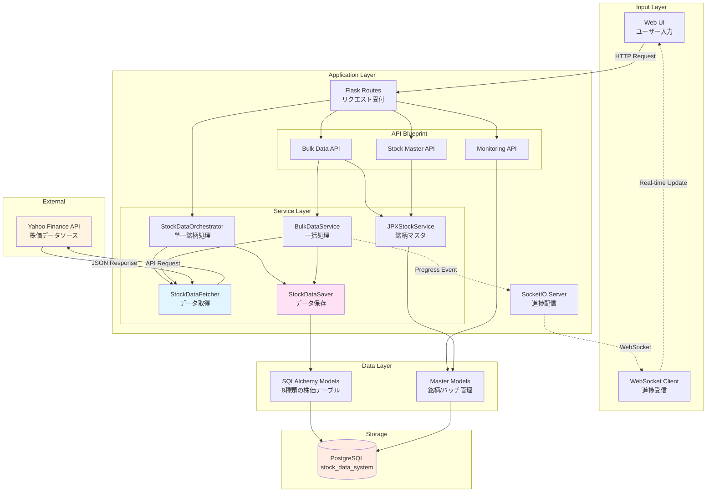

### 2.2 サービスモジュール構造（実装済み）

**実装完了済み（v1.0）:**

```
app/services/
├── stock_data/      # 株価データ取得・保存
│   ├── fetcher.py          # StockDataFetcher
│   ├── saver.py            # StockDataSaver
│   ├── orchestrator.py     # StockDataOrchestrator
│   └── scheduler.py        # StockDataScheduler
├── bulk/            # 一括データ取得
│   └── bulk_service.py     # BulkDataService
├── jpx/             # JPX銘柄マスタ管理
│   └── jpx_stock_service.py # JPXStockService
└── batch/           # バッチ実行管理
    └── batch_service.py    # BatchService
```

**データフローへの影響:**
- データフロー自体（取得→変換→保存）は変更なし
- サービスの所在が機能別ディレクトリに整理
- Orchestrator/BulkはFetcher/Saverを組み合わせて動作（従来どおり）

## 3. 主要データフロー

### 3.1 単一銘柄データ取得フロー

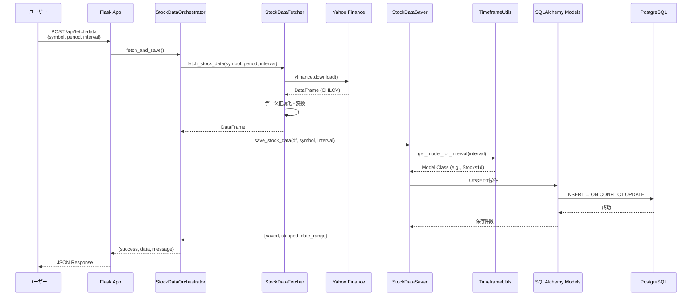

**処理ステップ:**
1. **リクエスト受付**: ユーザーが銘柄コード・期間・時間軸を指定
2. **データ取得**: Yahoo Finance APIから株価データを取得
3. **データ変換**: DataFrameを正規化（カラム名統一、型変換）
4. **テーブル選択**: 時間軸に応じて保存先テーブルを決定
5. **データ保存**: UPSERT操作で重複を避けて保存
6. **結果返却**: 保存件数・スキップ件数・日付範囲を返却

### 3.2 バルクデータ取得フロー（並列処理）

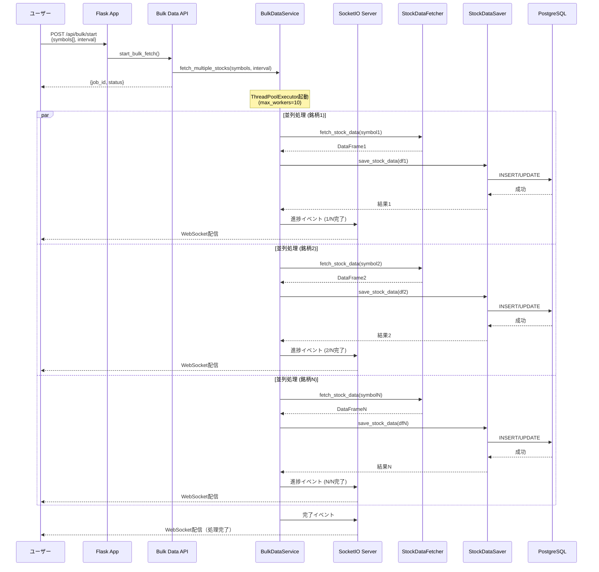

**処理ステップ:**
1. **ジョブ登録**: バルク取得ジョブを登録し、job_idを返却
2. **並列実行**: ThreadPoolExecutorで最大10銘柄を並列処理
3. **進捗配信**: 各銘柄の処理完了時にWebSocketで進捗を配信
4. **ETA計算**: 処理速度から残り時間を推定
5. **完了通知**: 全銘柄の処理完了をWebSocketで通知

### 3.3 JPX全銘柄順次取得フロー（実装済み）

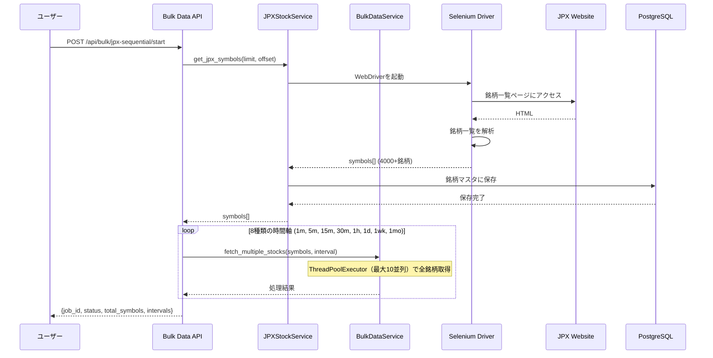

**処理ステップ（実装済み）:**
1. **銘柄一覧取得**: SeleniumでJPX公式サイトから銘柄一覧を取得
2. **銘柄マスタ保存**: 取得した銘柄をstock_masterテーブルに保存
3. **8時間軸ループ**: 実装済みの8種類の時間軸それぞれで全銘柄のデータを取得
4. **並列処理**: ThreadPoolExecutorで最大10銘柄を並列処理
5. **進捗管理**: WebSocket経由でリアルタイム進捗配信（時間軸 × 銘柄数）

### 3.4 銘柄マスタ更新フロー

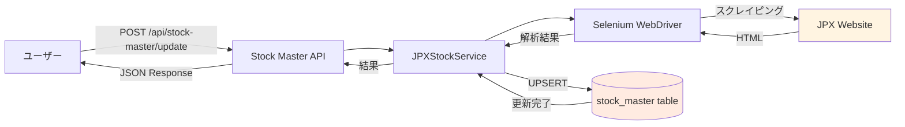

### 3.5 データ取得フロー（詳細）

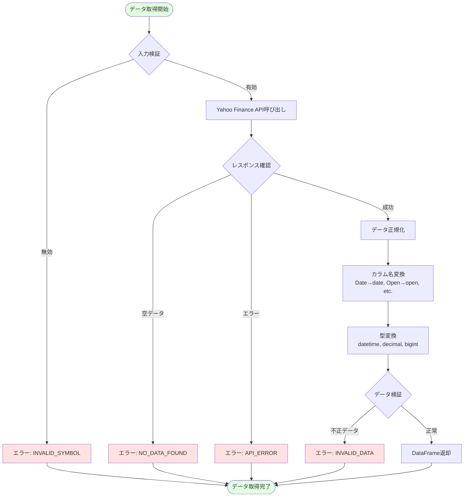

### 3.6 データ保存フロー（詳細）

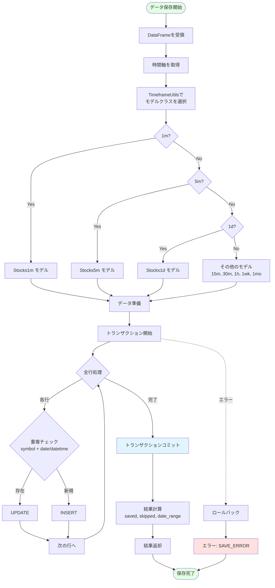

## 4. データ変換処理

### 4.1 Yahoo Finance → DataFrame変換

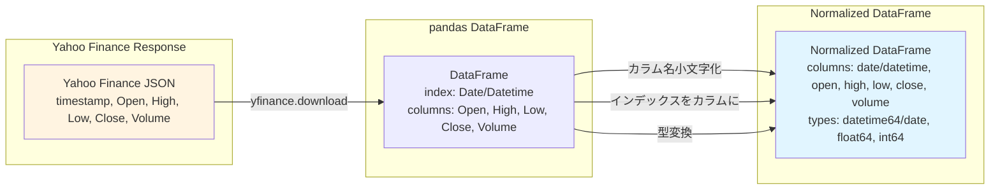

**変換ルール:**

| 変換前（Yahoo Finance） | 変換後（システム） | 型                |
| ----------------------- | ------------------ | ----------------- |
| Date (index)            | date / datetime    | datetime64 / date |
| Open                    | open               | DECIMAL(10,2)     |
| High                    | high               | DECIMAL(10,2)     |
| Low                     | low                | DECIMAL(10,2)     |
| Close                   | close              | DECIMAL(10,2)     |
| Volume                  | volume             | BIGINT            |

### 4.2 DataFrame → SQLAlchemyモデル変換

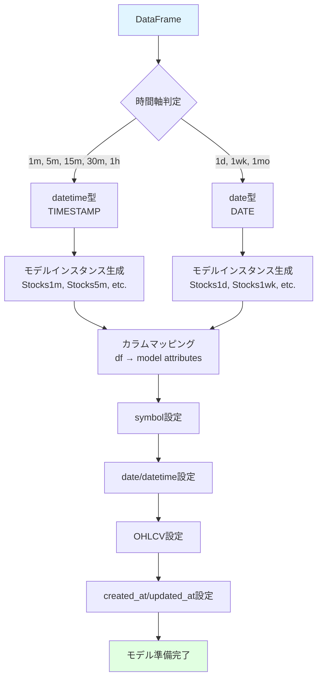

### 4.3 時間軸ごとのテーブル振り分け

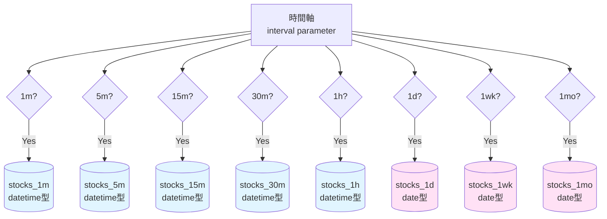

## 5. エラー処理フロー

### 5.1 エラーハンドリング階層

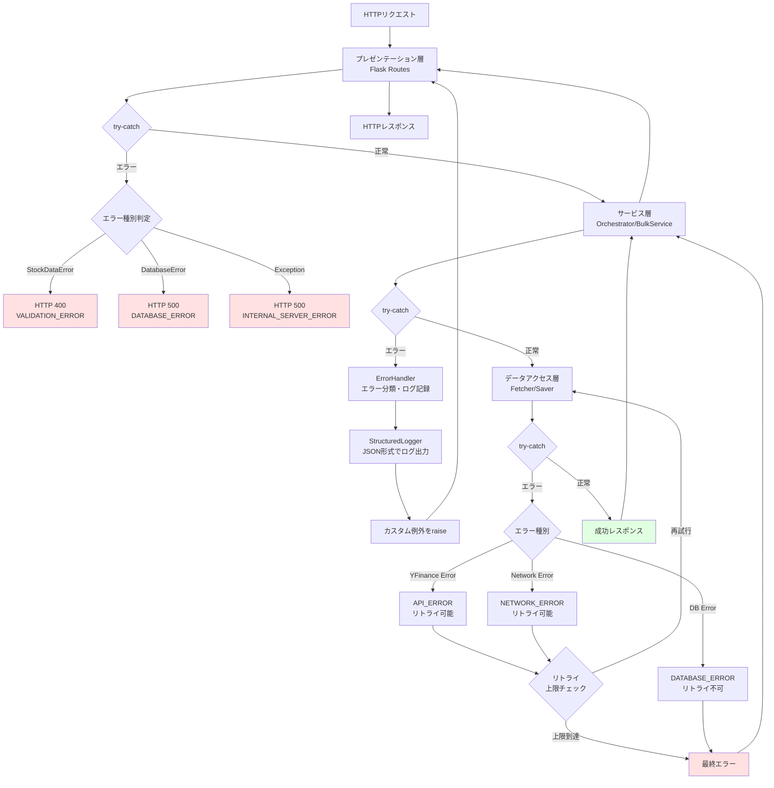

### 5.2 エラー種別と対応

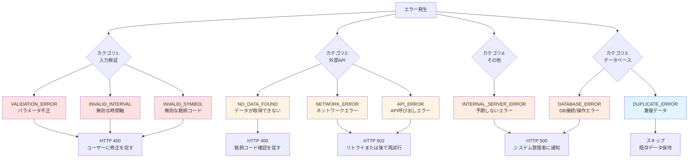

### 5.3 リトライロジック

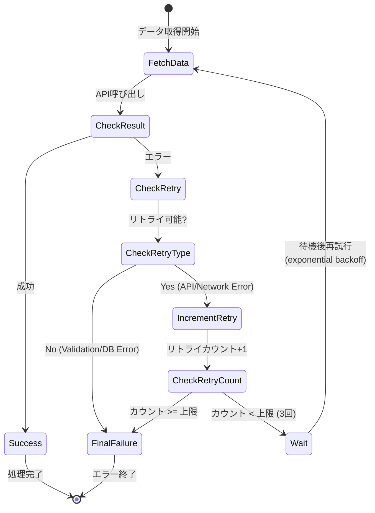

**リトライ設定:**
- **最大リトライ回数**: 3回
- **待機時間**: Exponential Backoff (1秒 → 2秒 → 4秒)
- **リトライ可能エラー**: API_ERROR, NETWORK_ERROR
- **リトライ不可エラー**: VALIDATION_ERROR, DATABASE_ERROR

### 5.4 WebSocket進捗配信フロー

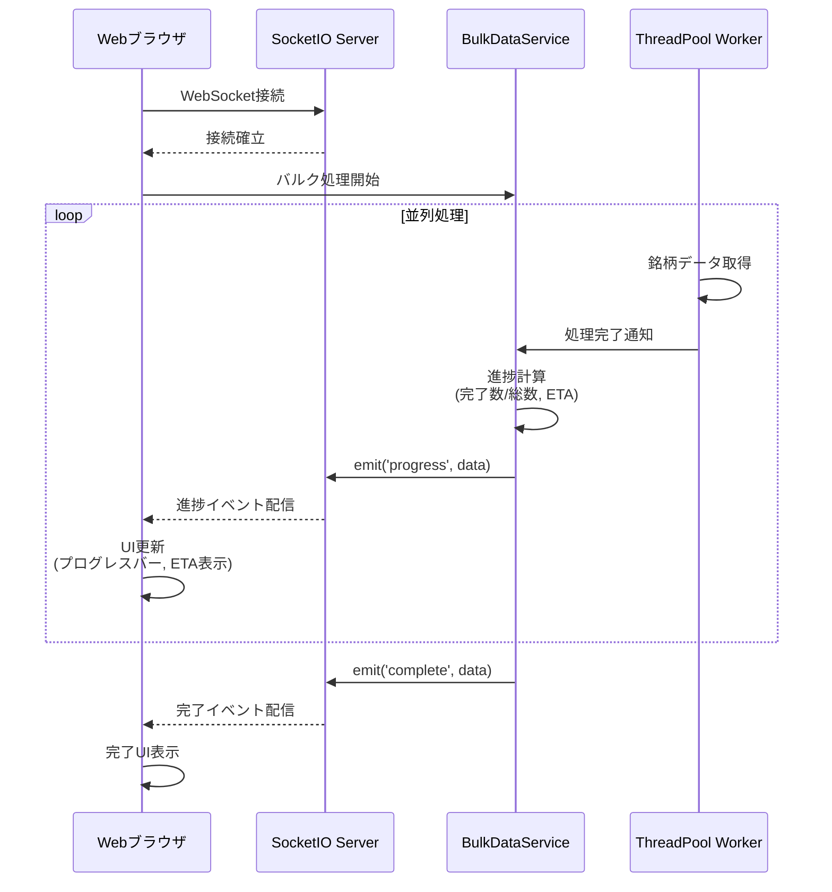

**進捗データ構造:**
```json
{
  "job_id": "job_123456",
  "status": "running",
  "progress": {
    "total": 100,
    "completed": 45,
    "failed": 2,
    "percentage": 45.0
  },
  "eta": {
    "seconds_remaining": 120,
    "estimated_completion_time": "2025-10-22T16:45:30"
  },
  "current_symbol": "7203.T"
}
```

## 関連ドキュメント

- [アーキテクチャ概要](architecture_overview.md) - システム全体のアーキテクチャ
- [コンポーネント依存関係](component_dependency.md) - サービス間の依存関係
- [サービス責任分掌](service_responsibilities.md) - 各サービスの役割と責任
- [データベース設計](database_design.md) - データベーススキーマ詳細
- [API仕様書](../api/README.md) - API エンドポイント詳細
