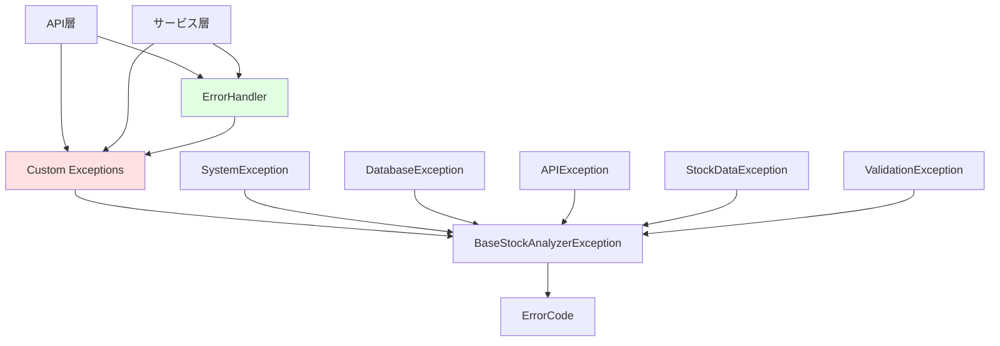
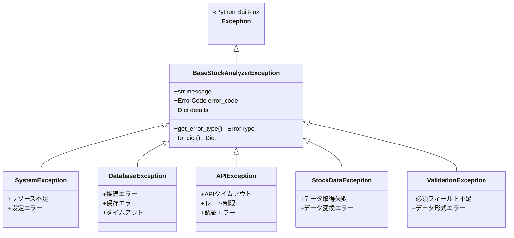
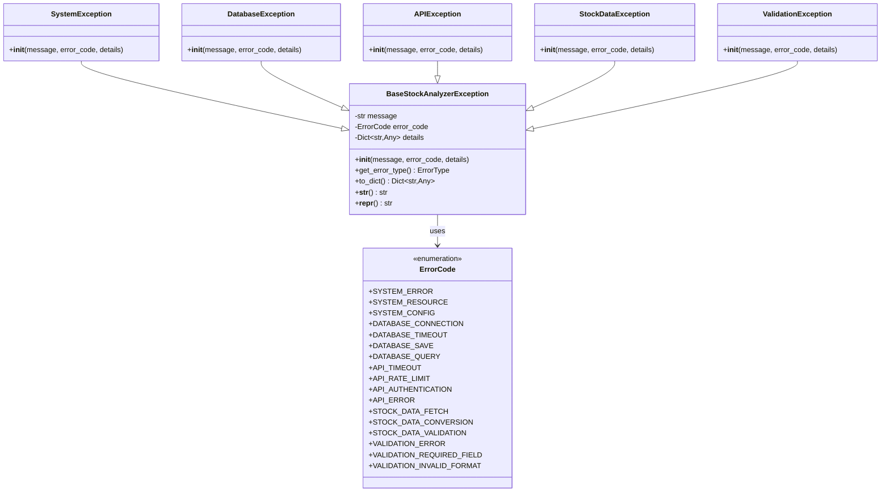
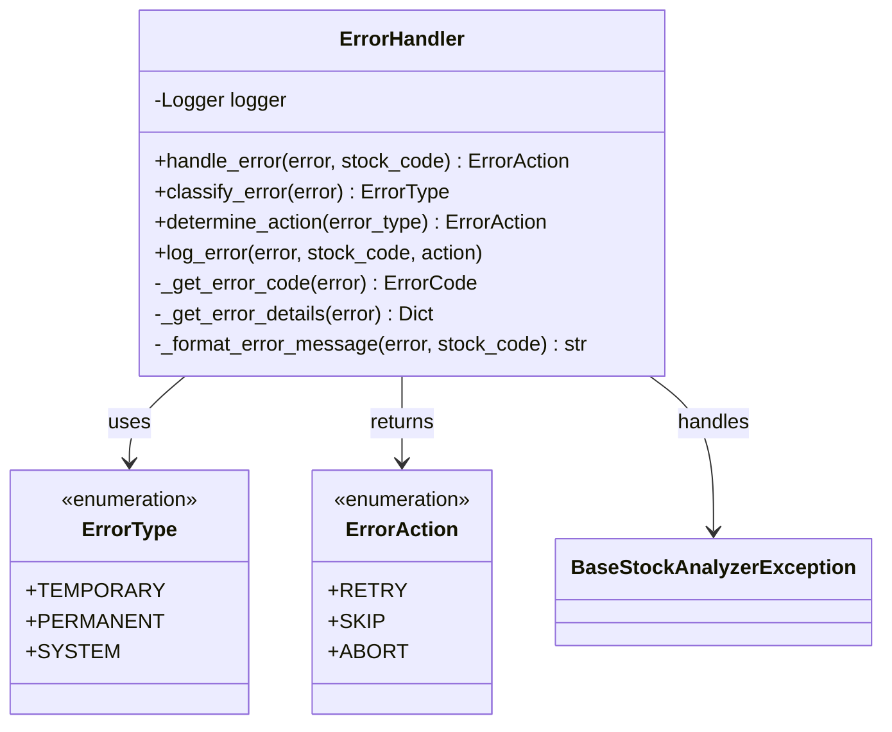
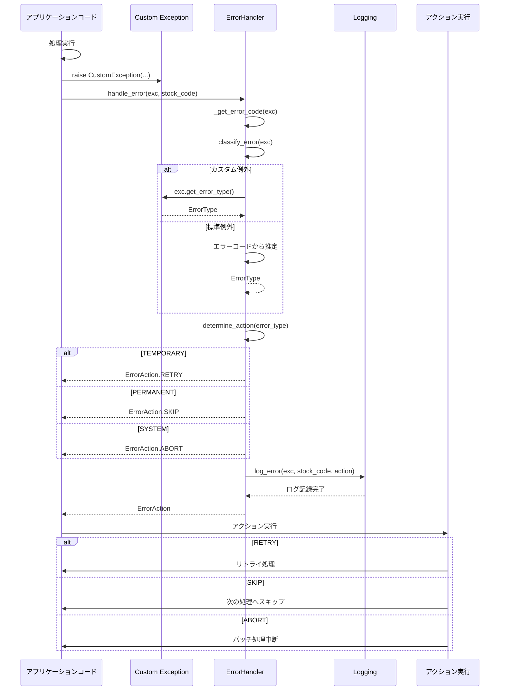
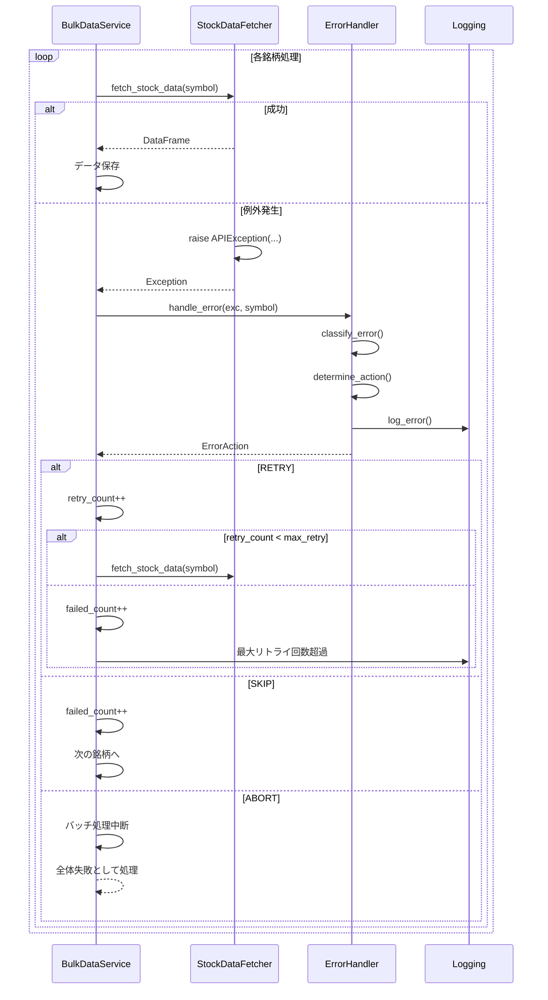

category: architecture
ai_context: high
last_updated: 2025-01-09
related_docs:
  - ./architecture_overview.md
  - ./layers/service_layer.md
  - ./layers/api_layer.md

# 例外処理システム 仕様書

## 目次

- [1. 概要](#1-概要)
- [2. 構成](#2-構成)
- [3. 例外クラス体系](#3-例外クラス体系)
- [4. クラス図](#4-クラス図)
- [5. エラーハンドリングフロー](#5-エラーハンドリングフロー)
- [6. 例外クラス詳細](#6-例外クラス詳細)
- [7. エラーハンドラー詳細](#7-エラーハンドラー詳細)
- [8. ベストプラクティス](#8-ベストプラクティス)

---

## 1. 概要

### 役割

例外処理システムは、統一された例外体系とエラーハンドリング機構を提供し、システム全体でのエラー処理の一貫性と追跡性を保証します。

### 責務

| 責務 | 説明 |
|------|------|
| **カスタム例外定義** | システム固有の例外クラス体系の提供 |
| **エラー分類** | 例外を一時的/永続的/システムエラーに分類 |
| **エラーアクション決定** | リトライ/スキップ/中断の判断 |
| **エラーロギング** | 詳細なエラー情報の記録 |
| **エラーレスポンス生成** | API層へのエラーレスポンス生成支援 |
| **既存例外との互換性** | 既存の例外クラスとの後方互換性維持 |

### 設計原則

- **階層的な例外体系**: 基底クラスから派生した明確な継承構造
- **コンテキスト保持**: エラーコード、詳細情報、スタックトレースの保持
- **自動分類**: エラーコードに基づく自動エラー分類
- **復旧可能性**: 一時的エラーに対する自動リトライ機構
- **後方互換性**: 既存コードへの影響を最小限に

---

## 2. 構成

### ファイル構成

```
app/
├── exceptions.py                      # カスタム例外定義（350行）
│   ├── ErrorCode                      # エラーコード定数
│   ├── BaseStockAnalyzerException     # 基底例外クラス
│   ├── カテゴリ別例外クラス（5）
│   │   ├── SystemException            # システムエラー
│   │   ├── DatabaseException          # データベースエラー
│   │   ├── APIException               # 外部APIエラー
│   │   ├── StockDataException         # 株価データエラー
│   │   └── ValidationException        # バリデーションエラー
│   └── 既存例外クラス（4）
│       ├── DatabaseError              # (互換性維持)
│       ├── StockDataError             # (互換性維持)
│       ├── JPXDownloadError           # (互換性維持)
│       └── JPXParseError              # (互換性維持)
│
└── services/common/
    └── error_handler.py               # エラーハンドラー（200行）
        ├── ErrorType                  # エラータイプ列挙型
        ├── ErrorAction                # エラーアクション列挙型
        └── ErrorHandler               # エラーハンドリング統括クラス
```

### 依存関係



---

## 3. 例外クラス体系

### 例外クラス階層



### エラーコード一覧

| カテゴリ | エラーコード | 説明 | エラータイプ | アクション |
|---------|------------|------|-------------|----------|
| **システム** | SYSTEM_ERROR | システムエラー | SYSTEM | ABORT |
| | SYSTEM_RESOURCE | リソース不足 | SYSTEM | ABORT |
| | SYSTEM_CONFIG | 設定エラー | PERMANENT | ABORT |
| **データベース** | DATABASE_CONNECTION | 接続失敗 | TEMPORARY | RETRY |
| | DATABASE_TIMEOUT | タイムアウト | TEMPORARY | RETRY |
| | DATABASE_SAVE | 保存失敗 | PERMANENT | SKIP |
| | DATABASE_QUERY | クエリエラー | PERMANENT | SKIP |
| **API** | API_TIMEOUT | タイムアウト | TEMPORARY | RETRY |
| | API_RATE_LIMIT | レート制限 | TEMPORARY | RETRY |
| | API_AUTHENTICATION | 認証失敗 | PERMANENT | ABORT |
| | API_ERROR | 一般的なAPIエラー | TEMPORARY | RETRY |
| **株価データ** | STOCK_DATA_FETCH | 取得失敗 | TEMPORARY | RETRY |
| | STOCK_DATA_CONVERSION | 変換エラー | PERMANENT | SKIP |
| | STOCK_DATA_VALIDATION | 検証エラー | PERMANENT | SKIP |
| **バリデーション** | VALIDATION_ERROR | バリデーションエラー | PERMANENT | SKIP |
| | VALIDATION_REQUIRED_FIELD | 必須フィールド不足 | PERMANENT | SKIP |
| | VALIDATION_INVALID_FORMAT | 形式エラー | PERMANENT | SKIP |

---

## 4. クラス図

### 例外クラス構造



### エラーハンドラー構造



---

## 5. エラーハンドリングフロー

### 例外発生から処理までのフロー



### バルクデータ取得時のエラーハンドリング



---

## 6. 例外クラス詳細

### 6.1 BaseStockAnalyzerException

**役割**: 全カスタム例外の基底クラス

**属性**:

| 属性 | 型 | 説明 |
|-----|-----|------|
| `message` | str | エラーメッセージ |
| `error_code` | ErrorCode | エラーコード定数 |
| `details` | Dict[str, Any] | 追加の詳細情報 |

**メソッド**:

| メソッド | 説明 | 戻り値 |
|---------|------|--------|
| `get_error_type()` | エラーコードからエラータイプを判定 | ErrorType |
| `to_dict()` | 辞書形式に変換 | Dict[str, Any] |

**使用例**:

```python
from app.exceptions import BaseStockAnalyzerException, ErrorCode

raise BaseStockAnalyzerException(
    message="エラーメッセージ",
    error_code=ErrorCode.SYSTEM_ERROR,
    details={"context": "additional info"}
)
```

**エラータイプマッピング**:

```python
def get_error_type(self) -> ErrorType:
    """エラーコードからエラータイプを判定."""
    temporary_errors = {
        ErrorCode.DATABASE_CONNECTION,
        ErrorCode.DATABASE_TIMEOUT,
        ErrorCode.API_TIMEOUT,
        ErrorCode.API_RATE_LIMIT,
        ErrorCode.API_ERROR,
        ErrorCode.STOCK_DATA_FETCH,
    }

    system_errors = {
        ErrorCode.SYSTEM_ERROR,
        ErrorCode.SYSTEM_RESOURCE,
    }

    if self.error_code in temporary_errors:
        return ErrorType.TEMPORARY
    elif self.error_code in system_errors:
        return ErrorType.SYSTEM
    else:
        return ErrorType.PERMANENT
```

---

### 6.2 SystemException

**役割**: システム全体に影響するエラー

**対象エラー**:
- リソース不足（メモリ、ディスク）
- 設定ファイルエラー
- システム初期化失敗

**使用例**:

```python
from app.exceptions import SystemException, ErrorCode

raise SystemException(
    message="システムリソースが不足しています",
    error_code=ErrorCode.SYSTEM_RESOURCE,
    details={
        "available_memory": "128MB",
        "required_memory": "1GB"
    }
)
```

---

### 6.3 DatabaseException

**役割**: データベース関連のエラー

**対象エラー**:
- 接続タイムアウト（一時的）
- クエリエラー（永続的）
- 保存失敗（永続的）

**使用例**:

```python
from app.exceptions import DatabaseException, ErrorCode

# 一時的エラー（リトライ対象）
raise DatabaseException(
    message="データベース接続タイムアウト",
    error_code=ErrorCode.DATABASE_TIMEOUT,
    details={"timeout": 30, "host": "localhost"}
)

# 永続的エラー（スキップ対象）
raise DatabaseException(
    message="データ保存に失敗",
    error_code=ErrorCode.DATABASE_SAVE,
    details={
        "table": "stocks_1d",
        "stock_code": "7203.T",
        "constraint_violation": "UNIQUE(symbol, date)"
    }
)
```

---

### 6.4 APIException

**役割**: 外部API（Yahoo Finance等）関連のエラー

**対象エラー**:
- タイムアウト（一時的）
- レート制限（一時的）
- 認証エラー（永続的、システム）

**使用例**:

```python
from app.exceptions import APIException, ErrorCode

# リトライ対象
raise APIException(
    message="Yahoo Finance APIタイムアウト",
    error_code=ErrorCode.API_TIMEOUT,
    details={
        "endpoint": "/v8/finance/chart",
        "timeout": 30,
        "symbol": "7203.T"
    }
)

# レート制限（待機後リトライ）
raise APIException(
    message="APIレート制限に達しました",
    error_code=ErrorCode.API_RATE_LIMIT,
    details={
        "retry_after": 60,  # 秒
        "limit": "2000 requests/hour"
    }
)
```

---

### 6.5 StockDataException

**役割**: 株価データ処理関連のエラー

**対象エラー**:
- データ取得失敗（一時的）
- データ変換エラー（永続的）
- データ検証エラー（永続的）

**使用例**:

```python
from app.exceptions import StockDataException, ErrorCode

# 取得失敗（リトライ対象）
raise StockDataException(
    message="株価データの取得に失敗",
    error_code=ErrorCode.STOCK_DATA_FETCH,
    details={
        "stock_code": "7203.T",
        "interval": "1d",
        "period": "1mo"
    }
)

# 変換エラー（スキップ対象）
raise StockDataException(
    message="株価データの変換に失敗",
    error_code=ErrorCode.STOCK_DATA_CONVERSION,
    details={
        "stock_code": "7203.T",
        "error": "Missing required columns: ['Close']",
        "available_columns": ["open", "high", "low"]
    }
)
```

---

### 6.6 ValidationException

**役割**: データ検証エラー

**対象エラー**:
- 必須フィールド不足
- データ形式エラー
- パラメータ範囲外

**使用例**:

```python
from app.exceptions import ValidationException, ErrorCode

raise ValidationException(
    message="必須フィールドが不足しています",
    error_code=ErrorCode.VALIDATION_REQUIRED_FIELD,
    details={
        "missing_fields": ["stock_code", "date"],
        "provided_fields": ["open", "close"]
    }
)
```

---

## 7. エラーハンドラー詳細

### 7.1 ErrorHandler クラス

**役割**: エラーの分類とアクション決定

**主要メソッド**:

| メソッド | 説明 | パラメータ | 戻り値 |
|---------|------|-----------|--------|
| `handle_error()` | エラーを処理してアクションを返す | error, stock_code | ErrorAction |
| `classify_error()` | エラーを分類 | error | ErrorType |
| `determine_action()` | アクションを決定 | error_type | ErrorAction |
| `log_error()` | エラーをログに記録 | error, stock_code, action | None |

**使用例**:

```python
from app.services.common.error_handler import ErrorHandler, ErrorAction
from app.exceptions import APIException, ErrorCode

error_handler = ErrorHandler()

try:
    # 何らかの処理
    fetch_stock_data("7203.T")
except Exception as e:
    action = error_handler.handle_error(e, stock_code="7203.T")

    if action == ErrorAction.RETRY:
        # リトライ処理
        retry_count += 1
        if retry_count < max_retry:
            continue
    elif action == ErrorAction.SKIP:
        # スキップして次へ
        failed_stocks.append("7203.T")
        continue
    elif action == ErrorAction.ABORT:
        # バッチ処理を停止
        logger.critical("バッチ処理を中断します")
        break
```

---

### 7.2 エラー分類ロジック

**分類フロー**:

```mermaid
flowchart TD
    Start[エラー発生] --> IsCustom{カスタム例外?}

    IsCustom -->|Yes| GetType[get_error_type()]
    GetType --> TypeCheck{エラータイプ}

    IsCustom -->|No| IsDatabase{DatabaseError?}
    IsDatabase -->|Yes| Temp1[TEMPORARY]
    IsDatabase -->|No| IsStockData{StockDataError?}
    IsStockData -->|Yes| Temp2[TEMPORARY]
    IsStockData -->|No| IsOther{その他既存例外?}
    IsOther -->|Yes| Perm[PERMANENT]
    IsOther -->|No| System[SYSTEM]

    TypeCheck -->|TEMPORARY| Retry[RETRY]
    TypeCheck -->|PERMANENT| Skip[SKIP]
    TypeCheck -->|SYSTEM| Abort[ABORT]

    Temp1 --> Retry
    Temp2 --> Retry
    Perm --> Skip
    System --> Abort

    Retry --> End[アクション返却]
    Skip --> End
    Abort --> End
```

**実装例**:

```python
def classify_error(self, error: Exception) -> ErrorType:
    """エラーを分類."""
    # カスタム例外
    if isinstance(error, BaseStockAnalyzerException):
        return error.get_error_type()

    # 既存例外（後方互換性）
    if isinstance(error, (DatabaseError, StockDataError)):
        return ErrorType.TEMPORARY

    if isinstance(error, (JPXDownloadError, JPXParseError)):
        return ErrorType.PERMANENT

    # その他の例外
    return ErrorType.SYSTEM
```

---

### 7.3 ログ出力形式

**ログレベル**:

| ErrorType | ログレベル | 説明 |
|-----------|----------|------|
| TEMPORARY | WARNING | リトライ可能なエラー |
| PERMANENT | ERROR | スキップして継続 |
| SYSTEM | CRITICAL | システム全体に影響 |

**ログ出力例**:

```python
def log_error(
    self,
    error: Exception,
    stock_code: Optional[str] = None,
    action: Optional[ErrorAction] = None
) -> None:
    """エラーをログに記録."""
    error_type = self.classify_error(error)
    error_code = self._get_error_code(error)
    details = self._get_error_details(error)

    log_message = (
        f"[{error_type.name}] "
        f"Stock: {stock_code or 'N/A'} | "
        f"Error: {error_code.name if error_code else 'UNKNOWN'} | "
        f"Message: {str(error)} | "
        f"Action: {action.name if action else 'N/A'} | "
        f"Details: {details}"
    )

    if error_type == ErrorType.TEMPORARY:
        self.logger.warning(log_message)
    elif error_type == ErrorType.PERMANENT:
        self.logger.error(log_message, exc_info=True)
    elif error_type == ErrorType.SYSTEM:
        self.logger.critical(log_message, exc_info=True)
```

**出力例**:

```
WARNING: [TEMPORARY] Stock: 7203.T | Error: API_TIMEOUT | Message: Yahoo Finance APIタイムアウト | Action: RETRY | Details: {'endpoint': '/v8/finance/chart', 'timeout': 30}

ERROR: [PERMANENT] Stock: 6758.T | Error: STOCK_DATA_CONVERSION | Message: データ変換失敗 | Action: SKIP | Details: {'missing_columns': ['Close']}

CRITICAL: [SYSTEM] Stock: N/A | Error: SYSTEM_RESOURCE | Message: メモリ不足 | Action: ABORT | Details: {'available': '128MB', 'required': '1GB'}
```

---

## 8. ベストプラクティス

### 8.1 適切なエラーコードの選択

**推奨**:

```python
# 良い例: 具体的なエラーコード
raise APIException(
    message="レート制限に達しました",
    error_code=ErrorCode.API_RATE_LIMIT,  # 具体的
    details={"retry_after": 60}
)

# 悪い例: 汎用的すぎるエラーコード
raise APIException(
    message="レート制限に達しました",
    error_code=ErrorCode.API_ERROR,  # 汎用的すぎる
)
```

---

### 8.2 詳細情報の活用

**推奨**:

```python
# 良い例: デバッグに有用な詳細情報
raise StockDataException(
    message="株価データの変換に失敗",
    error_code=ErrorCode.STOCK_DATA_CONVERSION,
    details={
        "stock_code": "7203.T",
        "interval": "1d",
        "raw_data_shape": (100, 5),
        "expected_columns": ["Open", "High", "Low", "Close", "Volume"],
        "actual_columns": ["open", "high", "low"],  # 大文字小文字の違い
        "missing_columns": ["Close", "Volume"]
    }
)

# 悪い例: 詳細情報不足
raise StockDataException(
    message="変換エラー",
    error_code=ErrorCode.STOCK_DATA_CONVERSION
)
```

---

### 8.3 既存例外との互換性

**既存コード**:

```python
# 既存コード（引き続き動作）
from app.exceptions import DatabaseError

raise DatabaseError("データベースエラー")
```

**新規コード（推奨）**:

```python
# 新しいコード
from app.exceptions import DatabaseException, ErrorCode

raise DatabaseException(
    message="データベース接続エラー",
    error_code=ErrorCode.DATABASE_CONNECTION,
    details={"host": "localhost", "port": 5432}
)
```

---

### 8.4 ErrorHandlerとの連携

**サービス層での使用例**:

```python
from app.services.common.error_handler import ErrorHandler, ErrorAction
from app.exceptions import APIException, ErrorCode

class BulkDataService:
    def __init__(self):
        self.error_handler = ErrorHandler()
        self.max_retry = 3

    def fetch_with_retry(self, symbol: str, interval: str) -> Optional[pd.DataFrame]:
        """リトライ機能付きデータ取得."""
        retry_count = 0

        while retry_count < self.max_retry:
            try:
                return self.fetcher.fetch_stock_data(symbol, interval)
            except Exception as e:
                action = self.error_handler.handle_error(e, stock_code=symbol)

                if action == ErrorAction.RETRY:
                    retry_count += 1
                    if retry_count < self.max_retry:
                        time.sleep(2 ** retry_count)  # exponential backoff
                        continue
                    else:
                        logger.warning(f"最大リトライ回数超過: {symbol}")
                        return None

                elif action == ErrorAction.SKIP:
                    logger.warning(f"スキップ: {symbol}")
                    return None

                elif action == ErrorAction.ABORT:
                    logger.critical(f"処理中断: {symbol}")
                    raise

        return None
```

---

### 8.5 ログとの連携

**推奨パターン**:

```python
import logging
from app.exceptions import DatabaseException, ErrorCode
from app.services.common.error_handler import ErrorHandler

logger = logging.getLogger(__name__)
error_handler = ErrorHandler()

try:
    # データベース処理
    save_stock_data(symbol, data)
except Exception as e:
    # エラーハンドラーで処理
    action = error_handler.handle_error(e, stock_code=symbol)

    # 追加の詳細ログ
    if isinstance(e, DatabaseException):
        logger.error(
            f"Database operation failed: {e.to_dict()}",
            extra={"stock_code": symbol, "action": action.name}
        )

    # アクション実行
    if action == ErrorAction.RETRY:
        # リトライロジック
        pass
```

---

### 8.6 カスタム例外の作成（拡張）

**新しいカテゴリの追加例**:

```python
from app.exceptions import BaseStockAnalyzerException, ErrorCode

class NetworkException(BaseStockAnalyzerException):
    """ネットワーク関連の例外."""

    def __init__(
        self,
        message: str,
        error_code: ErrorCode = ErrorCode.API_TIMEOUT,
        details: Optional[Dict[str, Any]] = None
    ):
        super().__init__(message, error_code, details)

# 使用例
raise NetworkException(
    message="ネットワーク接続エラー",
    error_code=ErrorCode.API_TIMEOUT,
    details={"url": "https://example.com", "timeout": 30}
)
```

---

## 関連ドキュメント

- [アーキテクチャ概要](./architecture_overview.md)
- [サービス層仕様書](./layers/service_layer.md)
- [API層仕様書](./layers/api_layer.md)

---

**最終更新**: 2025-01-09
