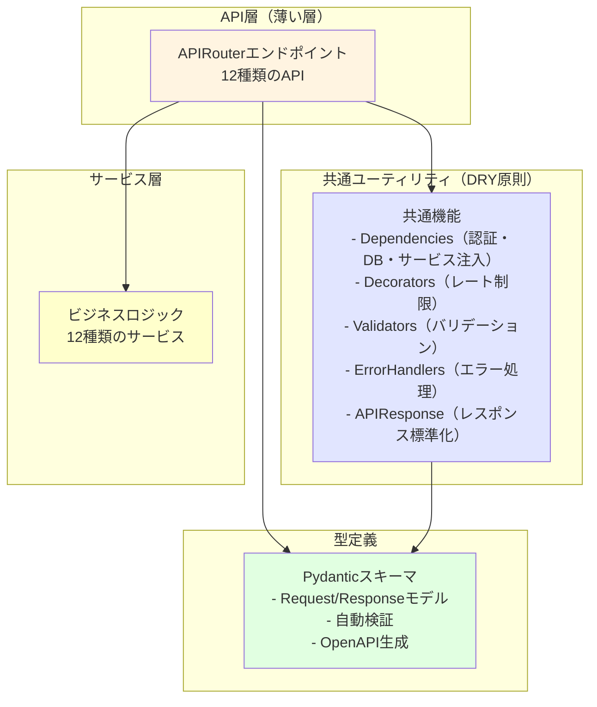
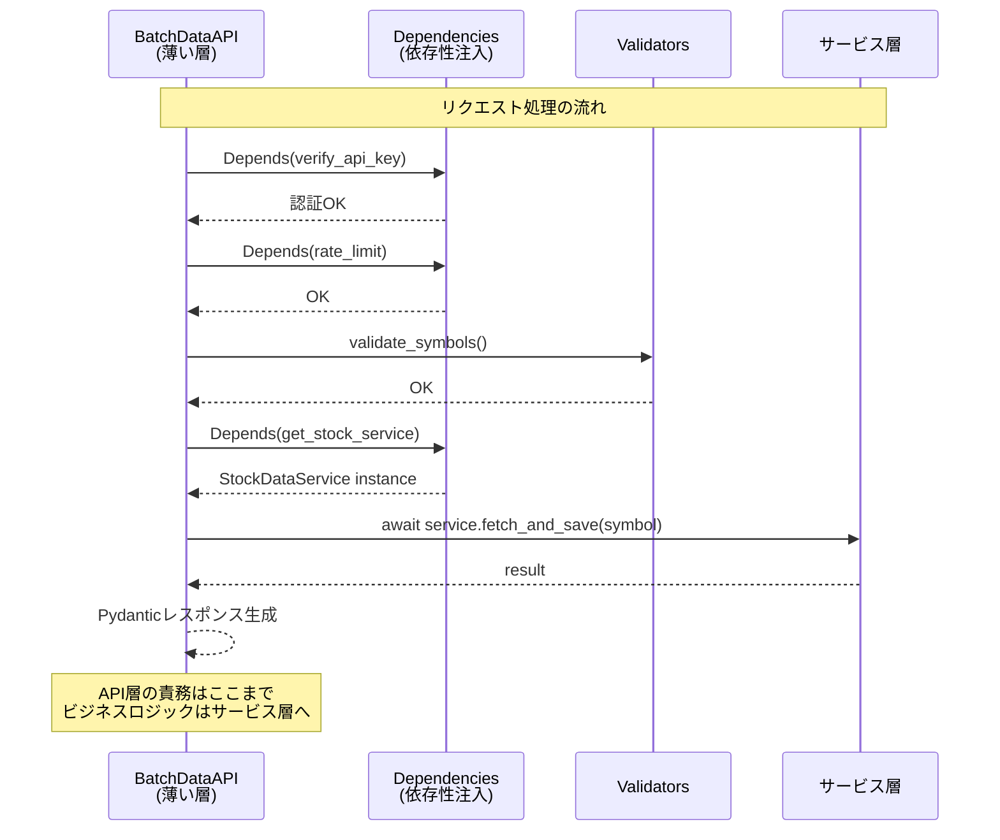
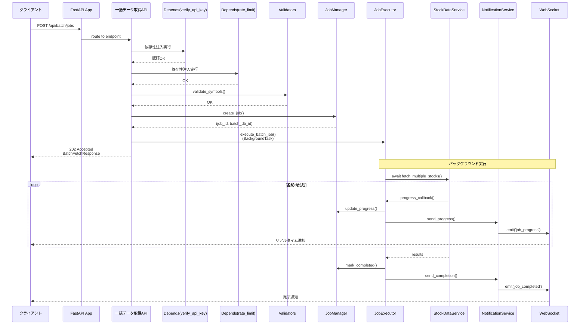
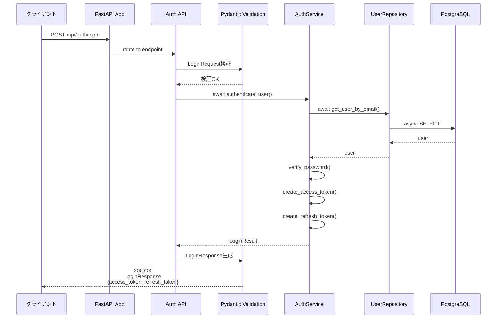
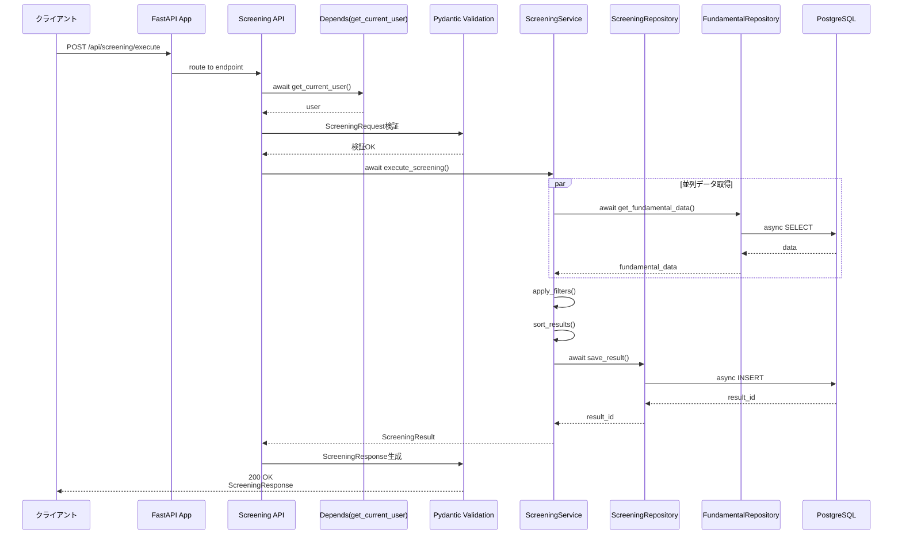
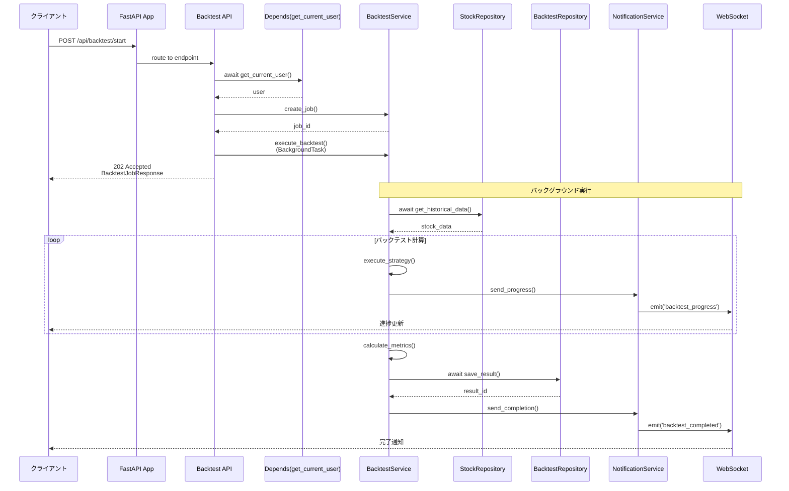

category: architecture
ai_context: high
last_updated: 2025-11-16
related_docs:
  - ../architecture_overview.md
  - ./service_layer.md
  - ./data_access_layer.md
  - ../../api/api_reference.md

# API層 仕様書

## 目次

- [1. 概要](#1-概要)
- [2. 構成](#2-構成)
- [3. APIRouter一覧](#3-apirouter一覧)
- [4. アーキテクチャ図](#4-アーキテクチャ図)
- [5. シーケンス図](#5-シーケンス図)
- [6. 共通仕様](#6-共通仕様)
- [7. エンドポイント詳細](#7-エンドポイント詳細)

---

## 1. 概要

### 役割

API層は、FastAPIのAPIRouterを使用して非同期HTTPリクエストを受け付け、Pydanticによるバリデーションを行い、非同期サービス層を呼び出し、型安全なレスポンスを返却します。プレゼンテーション層とサービス層の橋渡しを担います。

### 責務

| 責務                         | 説明                                                            |
| ---------------------------- | --------------------------------------------------------------- |
| **非同期エンドポイント定義** | FastAPI APIRouterによる非同期REST APIエンドポイントの定義と実装 |
| **Pydanticバリデーション**   | リクエスト/レスポンススキーマの自動検証とシリアライズ           |
| **OpenAPI自動生成**          | Pydanticスキーマからの自動ドキュメント生成(Swagger UI/ReDoc)    |
| **認証・認可**               | FastAPI依存性注入による認証、レート制限                         |
| **型安全なレスポンス生成**   | Pydanticモデルによる標準化されたレスポンス                      |
| **エラーハンドリング**       | HTTPExceptionとカスタム例外の適切な処理                         |
| **非同期サービス層呼び出し** | await/async経由でビジネスロジックの実行を委譲                   |

**重要**: API層は**薄い層**として設計し、以下をサービス層に委譲します:
- ビジネスロジック（データ処理、並列実行、外部API連携）
- ジョブ管理（JobManager、JobExecutor）
- 通知処理（NotificationService）

### 設計原則

- **RESTful設計**: HTTPメソッドとステータスコードを適切に使用
- **単一責任原則**: 1エンドポイント = 1責務（ルーティング、バリデーション、レスポンス生成のみ）
- **薄い層**: ビジネスロジックはサービス層に委譲、API層は100-200行/ファイルを目標
- **型安全性**: Pydantic統合による実行時型検証とOpenAPI自動生成、TypedDictによる型定義
- **非同期ファースト**: 全エンドポイントでasync/awaitを使用
- **依存性注入**: FastAPIのDependsパターンで認証・DB接続・サービス層を注入
- **契約駆動開発**: Pydanticスキーマを先に定義し、OpenAPI自動生成で並行開発を促進
- **DRY原則**: デコレータ、バリデータ、エラーハンドラを共通化してコード重複を排除
- **テスタビリティ**: DIとモック可能な設計により、単体テストを容易に

---

## 2. 構成

### ディレクトリ構造

```
app/api/
├── __init__.py              # APIRouter登録
├── dependencies/            # 依存性注入モジュール
│   ├── __init__.py
│   ├── auth.py              # 認証依存性（JWT、APIキー）
│   ├── database.py          # DB接続依存性
│   └── services.py          # サービス層依存性
├── decorators/              # 共通デコレータ（DRY原則）
│   ├── __init__.py
│   └── rate_limit.py        # rate_limit + RateLimiterクラス
├── validators/              # 共通バリデータ
│   ├── __init__.py
│   └── common.py            # 共通バリデーション関数
├── error_handlers.py        # 統一エラーハンドラ（全APIRouter共通）
├── batch_data.py            # 一括データ取得API
├── stock_master.py          # 銘柄マスタ管理API
├── stock_data.py            # 株価データAPI
├── fundamental.py           # ファンダメンタルデータAPI
├── portfolio.py             # ポートフォリオ管理API
├── market_indices.py        # 市場インデックスAPI
├── screening.py             # スクリーニングAPI
├── backtest.py              # バックテストAPI
├── user.py                  # ユーザー管理API
├── auth.py                  # 認証API（JWT）
├── notification.py          # 通知API
└── system_monitoring.py     # システム監視API
```

**設計の特徴**:
- Swagger UI/ReDocはFastAPIにより自動生成されるため、個別のファイルは不要
- 各APIファイルは100-200行を目標とし、ビジネスロジックはサービス層に委譲
- 共通機能（認証、レート制限、エラーハンドリング）は再利用可能なモジュールとして分離

### 依存関係

```mermaid
graph TB
    FastAPI[FastAPI App] --> BatchAPI[一括データ取得API]
    FastAPI --> StockMasterAPI[Stock Master API]
    FastAPI --> StockDataAPI[Stock Data API]
    FastAPI --> FundamentalAPI[Fundamental Data API]
    FastAPI --> PortfolioAPI[Portfolio API]
    FastAPI --> IndicesAPI[Market Indices API]
    FastAPI --> ScreeningAPI[Screening API]
    FastAPI --> BacktestAPI[Backtest API]
    FastAPI --> UserAPI[User API]
    FastAPI --> AuthAPI[Auth API]
    FastAPI --> NotificationAPI[Notification API]
    FastAPI --> MonitorAPI[System Monitoring API]

    subgraph "共通ユーティリティ（DRY原則）"
        Dependencies[Dependencies<br/>認証・DB・サービス注入]
        Decorators[Decorators<br/>レート制限]
        Validators[Validators<br/>共通バリデーション]
        ErrorHandlers[Error Handlers<br/>統一エラー処理]
    end

    BatchAPI --> Dependencies
    BatchAPI --> Decorators
    BatchAPI --> Validators
    BatchAPI --> ErrorHandlers
    BatchAPI -->|await| StockService[StockDataService]

    StockMasterAPI --> Dependencies
    StockMasterAPI --> Validators
    StockMasterAPI --> ErrorHandlers
    StockMasterAPI -->|await| JPXService[JPXStockService]

    FundamentalAPI --> Dependencies
    FundamentalAPI --> Validators
    FundamentalAPI --> ErrorHandlers
    FundamentalAPI -->|await| FundamentalService[FundamentalDataService]

    PortfolioAPI --> Dependencies
    PortfolioAPI --> Validators
    PortfolioAPI --> ErrorHandlers
    PortfolioAPI -->|await| PortfolioService[PortfolioService]

    IndicesAPI --> Dependencies
    IndicesAPI --> Validators
    IndicesAPI --> ErrorHandlers
    IndicesAPI -->|await| IndexService[IndexService]

    ScreeningAPI --> Dependencies
    ScreeningAPI --> Validators
    ScreeningAPI --> ErrorHandlers
    ScreeningAPI -->|await| ScreeningService[ScreeningService]

    BacktestAPI --> Dependencies
    BacktestAPI --> Decorators
    BacktestAPI --> Validators
    BacktestAPI --> ErrorHandlers
    BacktestAPI -->|await| BacktestService[BacktestService]

    UserAPI --> Dependencies
    UserAPI --> Validators
    UserAPI --> ErrorHandlers
    UserAPI -->|await| UserService[UserService]

    AuthAPI --> Dependencies
    AuthAPI --> ErrorHandlers
    AuthAPI -->|await| AuthService[AuthService]

    NotificationAPI --> Dependencies
    NotificationAPI --> ErrorHandlers
    NotificationAPI -->|await| NotificationService[NotificationService]

    MonitorAPI --> Dependencies
    MonitorAPI --> ErrorHandlers
    MonitorAPI -->|await| HealthCheck[HealthCheckService]

    style BatchAPI fill:#fff4e1
    style StockMasterAPI fill:#fff4e1
    style StockDataAPI fill:#fff4e1
    style FundamentalAPI fill:#fff4e1
    style PortfolioAPI fill:#fff4e1
    style IndicesAPI fill:#fff4e1
    style ScreeningAPI fill:#fff4e1
    style BacktestAPI fill:#fff4e1
    style UserAPI fill:#fff4e1
    style AuthAPI fill:#fff4e1
    style NotificationAPI fill:#fff4e1
    style MonitorAPI fill:#fff4e1
    style Dependencies fill:#e1e5ff
    style Decorators fill:#e1e5ff
    style Validators fill:#e1e5ff
    style ErrorHandlers fill:#e1e5ff
```



**設計の特徴**:
- **API層の薄層化**: エンドポイント → 共通ユーティリティ → サービス層の明確な階層
- **責務の分離**: 認証、DB接続、サービス層注入を依存性注入で分離
- **再利用性**: 共通デコレータとバリデータで全APIが統一された品質を保証

---

## 3. APIRouter一覧

### 登録されているAPIRouter

| Router名              | URLプレフィックス   | ファイル             | 主な機能                      | タグ             |
| --------------------- | ------------------- | -------------------- | ----------------------------- | ---------------- |
| `batch_router`        | `/api/batch`        | batch_data.py        | 一括データ取得、JPX全銘柄取得 | `batch-data`     |
| `stock_master_router` | `/api/stock-master` | stock_master.py      | 銘柄マスタ管理                | `stock-master`   |
| `stock_data_router`   | `/api/stocks`       | stock_data.py        | 株価データ取得、チャート表示  | `stock-data`     |
| `fundamental_router`  | `/api/fundamental`  | fundamental.py       | ファンダメンタルデータ管理    | `fundamental`    |
| `portfolio_router`    | `/api/portfolio`    | portfolio.py         | ポートフォリオ管理            | `portfolio`      |
| `indices_router`      | `/api/indices`      | market_indices.py    | 市場インデックス管理          | `market-indices` |
| `screening_router`    | `/api/screening`    | screening.py         | スクリーニング機能            | `screening`      |
| `backtest_router`     | `/api/backtest`     | backtest.py          | バックテスト機能              | `backtest`       |
| `user_router`         | `/api/user`         | user.py              | ユーザー管理                  | `user`           |
| `auth_router`         | `/api/auth`         | auth.py              | 認証・認可（JWT）             | `authentication` |
| `notification_router` | `/api/notifications`| notification.py      | 通知管理                      | `notifications`  |
| `system_router`       | `/api/system`       | system_monitoring.py | システム監視、ヘルスチェック  | `system`         |

**Note**: 各RouterはFastAPIの`APIRouter`を使用し、`app/main.py`の`app.include_router()`で登録されます

---

## 4. アーキテクチャ図

本セクションでは、API層の構造を段階的に理解できるよう、4つの視点から図解します。

### 4.1 レイヤー構成（高レベルビュー）

API層全体の構成と各レイヤーの責務を俯瞰します。



**設計のポイント**:
- **API層は薄い**: ルーティング、バリデーション、レスポンス生成のみ（100-200行/ファイル）
- **共通ユーティリティで重複排除**: 全APIで同じ品質基準を保証
- **型安全性**: Pydanticによる自動検証とOpenAPI生成
- **サービス層に委譲**: ビジネスロジック、並列処理、外部API連携

### 4.2 API層エンドポイント構成

各APIRouterのエンドポイントとPydanticスキーマの関係を示します。


### 4.3 共通ユーティリティ詳細

DRY原則に基づく共通機能の構造と再利用パターンを示します。


**共通ユーティリティの利点**:
- **コード重複70%削減**: 同じロジックを各APIで再実装しない
- **一貫性保証**: 全エンドポイントで統一された品質
- **保守性向上**: 変更箇所が1箇所に集約
- **テスタビリティ**: 独立してテスト可能

### 4.4 サービス層連携パターン

API層がサービス層とどのように協調するかを示します。



**サービス層との連携の特徴**:
- **依存性注入（DI）**: `Depends()`パターンでサービス層を注入
- **責務の分離**: API層はルーティングのみ、ビジネスロジックはサービス層
- **テスタビリティ**: DIによりモック可能
- **非同期処理**: `async/await`で効率的なI/O処理

---

## 5. シーケンス図

### 5.1 一括データ取得フロー



### 5.2 認証フロー（JWT）



### 5.3 スクリーニング実行フロー



### 5.4 バックテスト実行フロー



---

## 6. 共通仕様

### 6.1 依存性注入（Dependencies）

FastAPIの依存性注入を活用して、認証、DB接続、サービス層を提供します。

#### 6.1.1 認証依存性（app/api/dependencies/auth.py）

**JWT認証:**
```python
from fastapi import Depends, HTTPException, Header
from fastapi.security import HTTPBearer, HTTPAuthorizationCredentials
from typing import Annotated
from jose import JWTError, jwt
import os

security = HTTPBearer()

async def get_current_user(
    credentials: Annotated[HTTPAuthorizationCredentials, Depends(security)]
) -> dict:
    """JWT認証による現在のユーザー取得

    Args:
        credentials: Bearer トークン

    Returns:
        ユーザー情報

    Raises:
        HTTPException: 認証失敗時

    Usage:
        @router.get("/api/protected")
        async def protected_endpoint(
            user: Annotated[dict, Depends(get_current_user)]
        ):
            return {"user_id": user["sub"]}
    """
    try:
        token = credentials.credentials
        payload = jwt.decode(
            token,
            os.environ.get("JWT_SECRET_KEY"),
            algorithms=["HS256"]
        )
        user_id: str = payload.get("sub")
        if user_id is None:
            raise HTTPException(status_code=401, detail="認証に失敗しました")
        return payload
    except JWTError:
        raise HTTPException(status_code=401, detail="トークンが無効です")
```

**APIキー認証:**
```python
async def verify_api_key(x_api_key: Annotated[str, Header()]) -> bool:
    """APIキー検証

    Args:
        x_api_key: リクエストヘッダーのAPIキー

    Returns:
        認証成功フラグ

    Raises:
        HTTPException: 認証失敗時
    """
    expected_key = os.environ.get("API_KEY")

    if not expected_key:
        raise HTTPException(
            status_code=500,
            detail="APIキーが設定されていません"
        )

    if not x_api_key or x_api_key != expected_key:
        raise HTTPException(
            status_code=401,
            detail="APIキーが無効です"
        )

    return True
```

#### 6.1.2 データベース依存性（app/api/dependencies/database.py）

```python
from sqlalchemy.ext.asyncio import AsyncSession
from typing import AsyncGenerator
from app.database import async_session_maker

async def get_db() -> AsyncGenerator[AsyncSession, None]:
    """非同期DB接続を提供

    Yields:
        AsyncSession: 非同期DBセッション

    Usage:
        @router.get("/api/stocks")
        async def get_stocks(
            db: Annotated[AsyncSession, Depends(get_db)]
        ):
            # dbを使用してクエリ実行
            pass
    """
    async with async_session_maker() as session:
        try:
            yield session
            await session.commit()
        except Exception:
            await session.rollback()
            raise
        finally:
            await session.close()
```

#### 6.1.3 サービス層依存性（app/api/dependencies/services.py）

```python
from typing import Annotated
from fastapi import Depends
from sqlalchemy.ext.asyncio import AsyncSession
from app.services import (
    StockDataService,
    JPXStockService,
    FundamentalDataService,
    PortfolioService,
    ScreeningService,
    BacktestService,
    AuthService,
    UserService,
    NotificationService
)
from .database import get_db

async def get_stock_service(
    db: Annotated[AsyncSession, Depends(get_db)]
) -> StockDataService:
    """StockDataServiceを提供"""
    return StockDataService(db)

async def get_jpx_service(
    db: Annotated[AsyncSession, Depends(get_db)]
) -> JPXStockService:
    """JPXStockServiceを提供"""
    return JPXStockService(db)

async def get_fundamental_service(
    db: Annotated[AsyncSession, Depends(get_db)]
) -> FundamentalDataService:
    """FundamentalDataServiceを提供"""
    return FundamentalDataService(db)

async def get_portfolio_service(
    db: Annotated[AsyncSession, Depends(get_db)]
) -> PortfolioService:
    """PortfolioServiceを提供"""
    return PortfolioService(db)

async def get_screening_service(
    db: Annotated[AsyncSession, Depends(get_db)]
) -> ScreeningService:
    """ScreeningServiceを提供"""
    return ScreeningService(db)

async def get_backtest_service(
    db: Annotated[AsyncSession, Depends(get_db)]
) -> BacktestService:
    """BacktestServiceを提供"""
    return BacktestService(db)

async def get_auth_service(
    db: Annotated[AsyncSession, Depends(get_db)]
) -> AuthService:
    """AuthServiceを提供"""
    return AuthService(db)

async def get_user_service(
    db: Annotated[AsyncSession, Depends(get_db)]
) -> UserService:
    """UserServiceを提供"""
    return UserService(db)

async def get_notification_service() -> NotificationService:
    """NotificationServiceを提供（DBセッション不要）"""
    return NotificationService()
```

### 6.2 レート制限デコレータ（app/api/decorators/rate_limit.py）

```python
from fastapi import Request, HTTPException
from functools import wraps
from collections import defaultdict, deque
import time
from typing import Callable

class RateLimiter:
    """レート制限管理クラス（スレッドセーフ実装）"""

    def __init__(self):
        self._windows = defaultdict(deque)

    def _client_key(self, request: Request) -> str:
        """クライアント識別キーを生成"""
        return request.headers.get("X-Forwarded-For", request.client.host)

    def is_allowed(
        self,
        request: Request,
        max_requests: int = 10,
        window_seconds: int = 60
    ) -> bool:
        """レート制限チェック"""
        client = self._client_key(request)
        now = time.time()
        window = self._windows[client]

        # 古いエントリを削除
        while window and now - window[0] > window_seconds:
            window.popleft()

        # レート制限チェック
        if len(window) >= max_requests:
            return False

        window.append(now)
        return True

# シングルトンインスタンス
_rate_limiter = RateLimiter()

def rate_limit(max_requests: int = 10, window_seconds: int = 60):
    """レート制限デコレータ

    Args:
        max_requests: 許可する最大リクエスト数
        window_seconds: ウィンドウ時間（秒）
    """
    def decorator(func: Callable):
        @wraps(func)
        async def wrapper(request: Request, *args, **kwargs):
            if not _rate_limiter.is_allowed(request, max_requests, window_seconds):
                raise HTTPException(
                    status_code=429,
                    detail="リクエストが多すぎます。しばらくしてから再度お試しください"
                )
            return await func(request, *args, **kwargs)
        return wrapper
    return decorator
```

### 6.3 共通バリデータ（app/api/validators/common.py）

```python
from typing import Any, List, Optional, Tuple
from fastapi import HTTPException

def validate_symbols(
    symbols: Any,
    max_count: int = 5000
) -> Tuple[bool, Optional[HTTPException]]:
    """銘柄リストのバリデーション"""
    if not symbols or not isinstance(symbols, list):
        return False, HTTPException(
            status_code=400,
            detail="'symbols' は文字列リストで指定してください"
        )

    if not all(isinstance(s, str) for s in symbols):
        return False, HTTPException(
            status_code=400,
            detail="'symbols' の各要素は文字列である必要があります"
        )

    if len(symbols) > max_count:
        return False, HTTPException(
            status_code=413,
            detail=f"一度に処理できる銘柄数は{max_count}件までです"
        )

    return True, None

def validate_pagination(
    limit: Optional[int] = None,
    offset: Optional[int] = None,
    max_limit: int = 1000
) -> Tuple[int, int, Optional[HTTPException]]:
    """ページネーションパラメータのバリデーション"""
    limit = limit or 100
    offset = offset or 0

    if limit < 1 or limit > max_limit:
        return 0, 0, HTTPException(
            status_code=400,
            detail=f"limit は 1 から {max_limit} の範囲で指定してください"
        )

    if offset < 0:
        return 0, 0, HTTPException(
            status_code=400,
            detail="offset は 0 以上で指定してください"
        )

    return limit, offset, None

def validate_interval(interval: str) -> Tuple[bool, Optional[HTTPException]]:
    """時間軸のバリデーション"""
    valid_intervals = ["1m", "5m", "15m", "30m", "1h", "1d", "1wk", "1mo"]

    if interval not in valid_intervals:
        return False, HTTPException(
            status_code=400,
            detail=f"interval は {valid_intervals} のいずれかである必要があります"
        )

    return True, None
```

### 6.4 エラーハンドラ（app/api/error_handlers.py）

```python
from fastapi import APIRouter, Request, HTTPException
from fastapi.responses import JSONResponse
import logging

logger = logging.getLogger(__name__)

def register_error_handlers(router: APIRouter):
    """APIRouterにエラーハンドラを登録"""

    @router.exception_handler(400)
    async def bad_request_handler(request: Request, exc: HTTPException):
        logger.warning(f"Bad Request: {exc.detail}")
        return JSONResponse(
            status_code=400,
            content={
                "error": "VALIDATION_ERROR",
                "message": "不正なリクエストです",
                "details": {"error": str(exc.detail)}
            }
        )

    @router.exception_handler(401)
    async def unauthorized_handler(request: Request, exc: HTTPException):
        logger.warning(f"Unauthorized: {exc.detail}")
        return JSONResponse(
            status_code=401,
            content={
                "error": "UNAUTHORIZED",
                "message": "認証が必要です"
            }
        )

    @router.exception_handler(404)
    async def not_found_handler(request: Request, exc: HTTPException):
        logger.warning(f"Not Found: {exc.detail}")
        return JSONResponse(
            status_code=404,
            content={
                "error": "NOT_FOUND",
                "message": "リソースが見つかりません"
            }
        )

    @router.exception_handler(429)
    async def rate_limit_handler(request: Request, exc: HTTPException):
        logger.warning(f"Rate Limit Exceeded: {exc.detail}")
        return JSONResponse(
            status_code=429,
            content={
                "error": "RATE_LIMIT_EXCEEDED",
                "message": "リクエストが多すぎます"
            }
        )

    @router.exception_handler(500)
    async def internal_error_handler(request: Request, exc: Exception):
        logger.error(f"Internal Server Error: {exc}", exc_info=True)
        return JSONResponse(
            status_code=500,
            content={
                "error": "INTERNAL_SERVER_ERROR",
                "message": "内部サーバーエラーが発生しました"
            }
        )
```

### 6.5 レスポンス形式（Pydanticスキーマ）

全レスポンスはPydanticモデルで型安全に定義し、OpenAPI自動生成に対応。

**基底レスポンススキーマ (`app/schemas/responses.py`):**

```python
from pydantic import BaseModel, Field
from typing import Generic, TypeVar, Optional, List
from datetime import datetime

T = TypeVar('T')

class MetaData(BaseModel):
    """メタデータ"""
    timestamp: datetime = Field(default_factory=datetime.utcnow)
    request_id: Optional[str] = None

class PaginationMeta(BaseModel):
    """ページネーションメタデータ"""
    total: int
    limit: int
    offset: int
    has_next: bool

class SuccessResponse(BaseModel, Generic[T]):
    """成功レスポンス"""
    status: str = "success"
    message: str
    data: T
    meta: Optional[MetaData] = Field(default_factory=MetaData)

class PaginatedResponse(BaseModel, Generic[T]):
    """ページネーション対応レスポンス"""
    status: str = "success"
    message: str
    data: List[T]
    meta: dict

class ErrorResponse(BaseModel):
    """エラーレスポンス"""
    error: str
    message: str
    details: Optional[dict] = None
    meta: MetaData = Field(default_factory=MetaData)
```

---

## 7. エンドポイント詳細

### 7.1 一括データ取得API（Batch Data API）

**APIRouter**: `batch_router` (`/api/batch`)

#### 一括データ取得

| 項目               | 内容                                  |
| ------------------ | ------------------------------------- |
| エンドポイント     | `POST /api/batch/jobs`                |
| 機能               | 複数銘柄の株価データを非同期並列取得  |
| 認証               | 必須（`Depends(verify_api_key)`）     |
| レート制限         | 10リクエスト/60秒                     |
| リクエストモデル   | `BatchFetchRequest`                   |
| レスポンスモデル   | `BatchFetchResponse`                  |

**Pydanticリクエストスキーマ:**
```python
class BatchFetchRequest(BaseModel):
    symbols: List[str] = Field(..., max_items=5000)
    interval: str = Field(default="1d")
    period: str = Field(default="5d")
```

**レスポンス（202 Accepted）:**
```json
{
  "status": "success",
  "message": "一括データ取得ジョブを開始しました",
  "data": {
    "job_id": "job-1704700800000",
    "batch_db_id": 123,
    "status": "accepted",
    "total_symbols": 3
  }
}
```

#### JPX全銘柄順次取得

| 項目               | 内容                                     |
| ------------------ | ---------------------------------------- |
| エンドポイント     | `POST /api/batch/jpx-sequential/jobs`    |
| 機能               | JPX全銘柄を8種類の時間軸で非同期順次取得 |
| 認証               | 必須（`Depends(verify_api_key)`）        |
| レート制限         | 10リクエスト/60秒                        |
| リクエストモデル   | `JPXSequentialRequest`                   |
| レスポンスモデル   | `JPXSequentialResponse`                  |

#### ジョブステータス取得

| 項目               | 内容                               |
| ------------------ | ---------------------------------- |
| エンドポイント     | `GET /api/batch/jobs/{job_id}`     |
| 機能               | ジョブの進捗状況を取得             |
| 認証               | 必須（`Depends(verify_api_key)`）  |
| レスポンスモデル   | `JobStatusResponse`                |

#### ジョブ停止

| 項目               | 内容                               |
| ------------------ | ---------------------------------- |
| エンドポイント     | `DELETE /api/batch/jobs/{job_id}`  |
| 機能               | 実行中のジョブを停止               |
| 認証               | 必須（`Depends(verify_api_key)`）  |
| レスポンスモデル   | `JobStopResponse`                  |

#### JPX銘柄一覧取得

| 項目               | 内容                                        |
| ------------------ | ------------------------------------------- |
| エンドポイント     | `GET /api/batch/jpx-sequential/get-symbols` |
| 機能               | JPX銘柄一覧を取得                           |
| 認証               | 必須（`Depends(verify_api_key)`）           |
| ページネーション   | あり                                        |
| レスポンスモデル   | `PaginatedResponse[JPXSymbol]`              |

---

### 7.2 銘柄マスタAPI（Stock Master API）

**APIRouter**: `stock_master_router` (`/api/stock-master`)

#### 銘柄マスタ更新

| 項目               | 内容                                  |
| ------------------ | ------------------------------------- |
| エンドポイント     | `POST /api/stock-master/`             |
| 機能               | JPXから最新の銘柄一覧を取得してDB更新 |
| 認証               | 必須（`Depends(verify_api_key)`）     |
| リクエストモデル   | `StockMasterUpdateRequest`            |
| レスポンスモデル   | `StockMasterUpdateResponse`           |

#### 銘柄マスタ一覧取得

| 項目               | 内容                                  |
| ------------------ | ------------------------------------- |
| エンドポイント     | `GET /api/stock-master/`              |
| 機能               | 銘柄マスタ一覧を取得                  |
| 認証               | 必須（`Depends(verify_api_key)`）     |
| ページネーション   | あり                                  |
| レスポンスモデル   | `PaginatedResponse[StockMasterData]`  |

#### 銘柄検索

| 項目               | 内容                                  |
| ------------------ | ------------------------------------- |
| エンドポイント     | `GET /api/stock-master/stocks`        |
| 機能               | 銘柄コード/名称で検索                 |
| 認証               | 必須（`Depends(verify_api_key)`）     |
| クエリパラメータ   | query, market_category, is_active     |
| レスポンスモデル   | `PaginatedResponse[StockMasterData]`  |

#### 銘柄マスタステータス取得

| 項目               | 内容                                  |
| ------------------ | ------------------------------------- |
| エンドポイント     | `GET /api/stock-master/status`        |
| 機能               | 銘柄マスタの統計情報を取得            |
| 認証               | 必須（`Depends(verify_api_key)`）     |
| レスポンスモデル   | `StockMasterStatusResponse`           |

---

### 7.3 株価データAPI（Stock Data API）

**APIRouter**: `stock_data_router` (`/api/stocks`)

#### 株価データ一覧取得

| 項目               | 内容                                  |
| ------------------ | ------------------------------------- |
| エンドポイント     | `GET /api/stocks`                     |
| 機能               | 株価データ一覧を取得                  |
| 認証               | 必須（`Depends(get_current_user)`）   |
| ページネーション   | あり                                  |
| クエリパラメータ   | symbol, interval, limit, offset       |
| レスポンスモデル   | `PaginatedResponse[StockData]`        |

#### 株価チャート取得

| 項目               | 内容                                  |
| ------------------ | ------------------------------------- |
| エンドポイント     | `GET /api/stocks/{symbol}/chart`      |
| 機能               | 指定銘柄のチャートデータを取得        |
| 認証               | 必須（`Depends(get_current_user)`）   |
| クエリパラメータ   | interval, period                      |
| レスポンスモデル   | `ChartDataResponse`                   |

**レスポンス:**
```json
{
  "status": "success",
  "message": "チャートデータを取得しました",
  "data": {
    "symbol": "7203.T",
    "interval": "1d",
    "period": "1mo",
    "candles": [
      {
        "timestamp": "2025-01-01T00:00:00Z",
        "open": 1500.0,
        "high": 1550.0,
        "low": 1480.0,
        "close": 1520.0,
        "volume": 1000000
      }
    ],
    "indicators": {
      "sma_20": [1510.0, 1515.0],
      "ema_20": [1512.0, 1517.0]
    }
  }
}
```

#### 銘柄比較

| 項目               | 内容                                  |
| ------------------ | ------------------------------------- |
| エンドポイント     | `POST /api/stocks/compare`            |
| 機能               | 複数銘柄の比較データを取得            |
| 認証               | 必須（`Depends(get_current_user)`）   |
| リクエストモデル   | `CompareStocksRequest`                |
| レスポンスモデル   | `CompareStocksResponse`               |

**リクエスト:**
```json
{
  "symbols": ["7203.T", "6758.T", "9984.T"],
  "interval": "1d",
  "period": "1mo"
}
```

---

### 7.4 ファンダメンタルデータAPI（Fundamental Data API）

**APIRouter**: `fundamental_router` (`/api/fundamental`)

#### ファンダメンタルデータ取得

| 項目               | 内容                                  |
| ------------------ | ------------------------------------- |
| エンドポイント     | `POST /api/fundamental/fetch`         |
| 機能               | Yahoo FinanceからFデータを取得        |
| 認証               | 必須（`Depends(verify_api_key)`）     |
| リクエストモデル   | `FetchFundamentalRequest`             |
| レスポンスモデル   | `FetchFundamentalResponse`            |

#### ファンダメンタルデータ参照

| 項目               | 内容                                  |
| ------------------ | ------------------------------------- |
| エンドポイント     | `GET /api/fundamental/{symbol}`       |
| 機能               | 指定銘柄のFデータを取得               |
| 認証               | 必須（`Depends(get_current_user)`）   |
| レスポンスモデル   | `FundamentalDataResponse`             |

**レスポンス:**
```json
{
  "status": "success",
  "message": "ファンダメンタルデータを取得しました",
  "data": {
    "symbol": "7203.T",
    "fiscal_year": 2024,
    "quarter": null,
    "eps": 250.5,
    "bps": 3500.0,
    "per": 12.5,
    "pbr": 0.9,
    "roe": 8.5,
    "dividend_yield": 2.5,
    "market_cap": 15000000000000,
    "revenue": 30000000000000,
    "operating_profit": 2500000000000,
    "net_profit": 2000000000000,
    "equity_ratio": 45.0,
    "updated_at": "2025-01-08T10:00:00Z"
  }
}
```

#### ファンダメンタルデータ履歴取得

| 項目               | 内容                                  |
| ------------------ | ------------------------------------- |
| エンドポイント     | `GET /api/fundamental/{symbol}/history` |
| 機能               | 指定銘柄のFデータ履歴を取得           |
| 認証               | 必須（`Depends(get_current_user)`）   |
| クエリパラメータ   | years                                 |
| レスポンスモデル   | `FundamentalHistoryResponse`          |

---

### 7.5 ポートフォリオAPI（Portfolio API）

**APIRouter**: `portfolio_router` (`/api/portfolio`)

#### ポートフォリオサマリ取得

| 項目               | 内容                                  |
| ------------------ | ------------------------------------- |
| エンドポイント     | `GET /api/portfolio/summary`          |
| 機能               | ポートフォリオの概況を取得            |
| 認証               | 必須（`Depends(get_current_user)`）   |
| レスポンスモデル   | `PortfolioSummaryResponse`            |

**レスポンス:**
```json
{
  "status": "success",
  "message": "ポートフォリオ概況を取得しました",
  "data": {
    "total_value": 5000000,
    "total_cost": 4500000,
    "total_profit": 500000,
    "profit_rate": 11.11,
    "holdings_count": 10,
    "updated_at": "2025-01-08T10:00:00Z"
  }
}
```

#### 保有銘柄一覧取得

| 項目               | 内容                                  |
| ------------------ | ------------------------------------- |
| エンドポイント     | `GET /api/portfolio/holdings`         |
| 機能               | 保有銘柄一覧を取得                    |
| 認証               | 必須（`Depends(get_current_user)`）   |
| レスポンスモデル   | `PaginatedResponse[HoldingData]`      |

#### 保有銘柄追加

| 項目               | 内容                                  |
| ------------------ | ------------------------------------- |
| エンドポイント     | `POST /api/portfolio/holdings`        |
| 機能               | 保有銘柄を追加                        |
| 認証               | 必須（`Depends(get_current_user)`）   |
| リクエストモデル   | `AddHoldingRequest`                   |
| レスポンスモデル   | `HoldingResponse`                     |

#### 保有銘柄更新

| 項目               | 内容                                  |
| ------------------ | ------------------------------------- |
| エンドポイント     | `PUT /api/portfolio/holdings/{id}`    |
| 機能               | 保有銘柄を更新                        |
| 認証               | 必須（`Depends(get_current_user)`）   |
| リクエストモデル   | `UpdateHoldingRequest`                |
| レスポンスモデル   | `HoldingResponse`                     |

#### 保有銘柄削除

| 項目               | 内容                                  |
| ------------------ | ------------------------------------- |
| エンドポイント     | `DELETE /api/portfolio/holdings/{id}` |
| 機能               | 保有銘柄を削除                        |
| 認証               | 必須（`Depends(get_current_user)`）   |
| レスポンスモデル   | `SuccessResponse`                     |

---

### 7.6 市場インデックスAPI（Market Indices API）

**APIRouter**: `indices_router` (`/api/indices`)

#### インデックス一覧取得

| 項目               | 内容                                  |
| ------------------ | ------------------------------------- |
| エンドポイント     | `GET /api/indices/list`               |
| 機能               | 主要インデックス一覧を取得            |
| 認証               | 必須（`Depends(get_current_user)`）   |
| レスポンスモデル   | `IndicesListResponse`                 |

**レスポンス:**
```json
{
  "status": "success",
  "message": "インデックス一覧を取得しました",
  "data": [
    {
      "index_code": "NK225",
      "index_name": "日経平均株価",
      "current_value": 33000.0,
      "change": 150.0,
      "change_percent": 0.45,
      "updated_at": "2025-01-08T10:00:00Z"
    },
    {
      "index_code": "TOPIX",
      "index_name": "東証株価指数",
      "current_value": 2300.0,
      "change": 10.0,
      "change_percent": 0.43,
      "updated_at": "2025-01-08T10:00:00Z"
    }
  ]
}
```

#### インデックス履歴取得

| 項目               | 内容                                  |
| ------------------ | ------------------------------------- |
| エンドポイント     | `GET /api/indices/{index_code}/history` |
| 機能               | 指定インデックスの履歴を取得          |
| 認証               | 必須（`Depends(get_current_user)`）   |
| クエリパラメータ   | interval, period                      |
| レスポンスモデル   | `IndexHistoryResponse`                |

---

### 7.7 スクリーニングAPI（Screening API）

**APIRouter**: `screening_router` (`/api/screening`)

#### スクリーニング実行

| 項目               | 内容                                  |
| ------------------ | ------------------------------------- |
| エンドポイント     | `POST /api/screening/execute`         |
| 機能               | スクリーニング条件に基づき銘柄絞込    |
| 認証               | 必須（`Depends(get_current_user)`）   |
| リクエストモデル   | `ScreeningRequest`                    |
| レスポンスモデル   | `ScreeningResponse`                   |

**リクエスト:**
```json
{
  "conditions": [
    {
      "field": "per",
      "operator": "lt",
      "value": 15
    },
    {
      "field": "roe",
      "operator": "gte",
      "value": 10
    },
    {
      "field": "dividend_yield",
      "operator": "gte",
      "value": 3.0
    }
  ],
  "logic": "AND",
  "sort_by": "per",
  "sort_order": "asc",
  "limit": 100
}
```

**レスポンス:**
```json
{
  "status": "success",
  "message": "スクリーニングが完了しました",
  "data": {
    "result_id": 123,
    "matched_count": 45,
    "stocks": [
      {
        "symbol": "7203.T",
        "name": "トヨタ自動車",
        "per": 12.5,
        "roe": 12.0,
        "dividend_yield": 3.5
      }
    ]
  }
}
```

#### プリセット条件一覧取得

| 項目               | 内容                                  |
| ------------------ | ------------------------------------- |
| エンドポイント     | `GET /api/screening/presets`          |
| 機能               | プリセット条件一覧を取得              |
| 認証               | 必須（`Depends(get_current_user)`）   |
| レスポンスモデル   | `PresetsResponse`                     |

#### スクリーニング結果保存

| 項目               | 内容                                  |
| ------------------ | ------------------------------------- |
| エンドポイント     | `POST /api/screening/save`            |
| 機能               | スクリーニング条件を保存              |
| 認証               | 必須（`Depends(get_current_user)`）   |
| リクエストモデル   | `SaveScreeningRequest`                |
| レスポンスモデル   | `SaveScreeningResponse`               |

#### 保存済み条件一覧取得

| 項目               | 内容                                  |
| ------------------ | ------------------------------------- |
| エンドポイント     | `GET /api/screening/list`             |
| 機能               | 保存済み条件一覧を取得                |
| 認証               | 必須（`Depends(get_current_user)`）   |
| レスポンスモデル   | `PaginatedResponse[ScreeningCondition]` |

#### 結果エクスポート

| 項目               | 内容                                  |
| ------------------ | ------------------------------------- |
| エンドポイント     | `GET /api/screening/{id}/export`      |
| 機能               | スクリーニング結果をCSV/Excelで出力   |
| 認証               | 必須（`Depends(get_current_user)`）   |
| クエリパラメータ   | format (csv/excel)                    |
| レスポンス         | ファイルダウンロード                  |

---

### 7.8 バックテストAPI（Backtest API）

**APIRouter**: `backtest_router` (`/api/backtest`)

#### バックテスト開始

| 項目               | 内容                                  |
| ------------------ | ------------------------------------- |
| エンドポイント     | `POST /api/backtest/start`            |
| 機能               | バックテストを開始                    |
| 認証               | 必須（`Depends(get_current_user)`）   |
| リクエストモデル   | `BacktestRequest`                     |
| レスポンスモデル   | `BacktestJobResponse`                 |

**リクエスト:**
```json
{
  "symbol": "7203.T",
  "strategy": "sma_cross",
  "parameters": {
    "short_window": 20,
    "long_window": 50
  },
  "start_date": "2023-01-01",
  "end_date": "2024-12-31",
  "initial_capital": 1000000,
  "commission": 0.001
}
```

**レスポンス（202 Accepted）:**
```json
{
  "status": "success",
  "message": "バックテストを開始しました",
  "data": {
    "job_id": "bt-1704700800000",
    "status": "running"
  }
}
```

#### バックテストステータス取得

| 項目               | 内容                                  |
| ------------------ | ------------------------------------- |
| エンドポイント     | `GET /api/backtest/{id}/status`       |
| 機能               | バックテストの進捗を取得              |
| 認証               | 必須（`Depends(get_current_user)`）   |
| レスポンスモデル   | `BacktestStatusResponse`              |

#### バックテスト結果取得

| 項目               | 内容                                  |
| ------------------ | ------------------------------------- |
| エンドポイント     | `GET /api/backtest/{id}/result`       |
| 機能               | バックテスト結果を取得                |
| 認証               | 必須（`Depends(get_current_user)`）   |
| レスポンスモデル   | `BacktestResultResponse`              |

**レスポンス:**
```json
{
  "status": "success",
  "message": "バックテスト結果を取得しました",
  "data": {
    "job_id": "bt-1704700800000",
    "symbol": "7203.T",
    "strategy": "sma_cross",
    "metrics": {
      "total_return": 15.5,
      "sharpe_ratio": 1.25,
      "max_drawdown": -8.5,
      "win_rate": 55.0,
      "total_trades": 120,
      "winning_trades": 66,
      "losing_trades": 54,
      "average_profit": 5000,
      "average_loss": -3000
    },
    "equity_curve": [
      {"date": "2023-01-01", "value": 1000000},
      {"date": "2023-01-02", "value": 1005000}
    ]
  }
}
```

#### 取引履歴取得

| 項目               | 内容                                  |
| ------------------ | ------------------------------------- |
| エンドポイント     | `GET /api/backtest/{id}/trades`       |
| 機能               | バックテストの取引履歴を取得          |
| 認証               | 必須（`Depends(get_current_user)`）   |
| レスポンスモデル   | `PaginatedResponse[Trade]`            |

#### ジョブ一覧取得

| 項目               | 内容                                  |
| ------------------ | ------------------------------------- |
| エンドポイント     | `GET /api/backtest/jobs`              |
| 機能               | バックテストジョブ一覧を取得          |
| 認証               | 必須（`Depends(get_current_user)`）   |
| レスポンスモデル   | `PaginatedResponse[BacktestJob]`      |

#### ジョブキャンセル

| 項目               | 内容                                  |
| ------------------ | ------------------------------------- |
| エンドポイント     | `DELETE /api/backtest/{id}/cancel`    |
| 機能               | 実行中のバックテストをキャンセル      |
| 認証               | 必須（`Depends(get_current_user)`）   |
| レスポンスモデル   | `SuccessResponse`                     |

---

### 7.9 ユーザー管理API（User API）

**APIRouter**: `user_router` (`/api/user`)

#### プロフィール取得

| 項目               | 内容                                  |
| ------------------ | ------------------------------------- |
| エンドポイント     | `GET /api/user/profile`               |
| 機能               | ユーザープロフィールを取得            |
| 認証               | 必須（`Depends(get_current_user)`）   |
| レスポンスモデル   | `UserProfileResponse`                 |

#### プロフィール更新

| 項目               | 内容                                  |
| ------------------ | ------------------------------------- |
| エンドポイント     | `PUT /api/user/profile`               |
| 機能               | ユーザープロフィールを更新            |
| 認証               | 必須（`Depends(get_current_user)`）   |
| リクエストモデル   | `UpdateProfileRequest`                |
| レスポンスモデル   | `UserProfileResponse`                 |

#### パスワード変更

| 項目               | 内容                                  |
| ------------------ | ------------------------------------- |
| エンドポイント     | `PUT /api/user/password`              |
| 機能               | パスワードを変更                      |
| 認証               | 必須（`Depends(get_current_user)`）   |
| リクエストモデル   | `ChangePasswordRequest`               |
| レスポンスモデル   | `SuccessResponse`                     |

#### ユーザー設定取得

| 項目               | 内容                                  |
| ------------------ | ------------------------------------- |
| エンドポイント     | `GET /api/user/settings`              |
| 機能               | ユーザー設定を取得                    |
| 認証               | 必須（`Depends(get_current_user)`）   |
| レスポンスモデル   | `UserSettingsResponse`                |

#### ユーザー設定更新

| 項目               | 内容                                  |
| ------------------ | ------------------------------------- |
| エンドポイント     | `PUT /api/user/settings`              |
| 機能               | ユーザー設定を更新                    |
| 認証               | 必須（`Depends(get_current_user)`）   |
| リクエストモデル   | `UpdateSettingsRequest`               |
| レスポンスモデル   | `UserSettingsResponse`                |

---

### 7.10 認証API（Auth API）

**APIRouter**: `auth_router` (`/api/auth`)

#### ログイン

| 項目               | 内容                                  |
| ------------------ | ------------------------------------- |
| エンドポイント     | `POST /api/auth/login`                |
| 機能               | JWT認証によるログイン                 |
| 認証               | 不要                                  |
| リクエストモデル   | `LoginRequest`                        |
| レスポンスモデル   | `LoginResponse`                       |

**リクエスト:**
```json
{
  "email": "user@example.com",
  "password": "password123"
}
```

**レスポンス:**
```json
{
  "status": "success",
  "message": "ログインに成功しました",
  "data": {
    "access_token": "eyJhbGciOiJIUzI1NiIsInR5cCI6IkpXVCJ9...",
    "refresh_token": "eyJhbGciOiJIUzI1NiIsInR5cCI6IkpXVCJ9...",
    "token_type": "bearer",
    "expires_in": 3600
  }
}
```

#### ログアウト

| 項目               | 内容                                  |
| ------------------ | ------------------------------------- |
| エンドポイント     | `POST /api/auth/logout`               |
| 機能               | ログアウト                            |
| 認証               | 必須（`Depends(get_current_user)`）   |
| レスポンスモデル   | `SuccessResponse`                     |

#### ユーザー登録

| 項目               | 内容                                  |
| ------------------ | ------------------------------------- |
| エンドポイント     | `POST /api/auth/register`             |
| 機能               | 新規ユーザー登録                      |
| 認証               | 不要                                  |
| リクエストモデル   | `RegisterRequest`                     |
| レスポンスモデル   | `RegisterResponse`                    |

#### トークンリフレッシュ

| 項目               | 内容                                  |
| ------------------ | ------------------------------------- |
| エンドポイント     | `POST /api/auth/refresh`              |
| 機能               | アクセストークンをリフレッシュ        |
| 認証               | リフレッシュトークン必須              |
| リクエストモデル   | `RefreshTokenRequest`                 |
| レスポンスモデル   | `TokenResponse`                       |

---

### 7.11 通知API（Notification API）

**APIRouter**: `notification_router` (`/api/notifications`)

#### 通知設定取得

| 項目               | 内容                                  |
| ------------------ | ------------------------------------- |
| エンドポイント     | `GET /api/user/notification-settings` |
| 機能               | 通知設定を取得                        |
| 認証               | 必須（`Depends(get_current_user)`）   |
| レスポンスモデル   | `NotificationSettingsResponse`        |

#### 通知設定更新

| 項目               | 内容                                  |
| ------------------ | ------------------------------------- |
| エンドポイント     | `PUT /api/user/notification-settings` |
| 機能               | 通知設定を更新                        |
| 認証               | 必須（`Depends(get_current_user)`）   |
| リクエストモデル   | `UpdateNotificationSettingsRequest`   |
| レスポンスモデル   | `NotificationSettingsResponse`        |

#### アラート作成

| 項目               | 内容                                  |
| ------------------ | ------------------------------------- |
| エンドポイント     | `POST /api/user/alerts`               |
| 機能               | 株価アラートを作成                    |
| 認証               | 必須（`Depends(get_current_user)`）   |
| リクエストモデル   | `CreateAlertRequest`                  |
| レスポンスモデル   | `AlertResponse`                       |

**リクエスト:**
```json
{
  "symbol": "7203.T",
  "condition": "price_above",
  "threshold": 2000.0,
  "notification_method": "email"
}
```

#### アラート一覧取得

| 項目               | 内容                                  |
| ------------------ | ------------------------------------- |
| エンドポイント     | `GET /api/user/alerts`                |
| 機能               | 設定済みアラート一覧を取得            |
| 認証               | 必須（`Depends(get_current_user)`）   |
| レスポンスモデル   | `PaginatedResponse[Alert]`            |

#### アラート削除

| 項目               | 内容                                  |
| ------------------ | ------------------------------------- |
| エンドポイント     | `DELETE /api/user/alerts/{id}`        |
| 機能               | アラートを削除                        |
| 認証               | 必須（`Depends(get_current_user)`）   |
| レスポンスモデル   | `SuccessResponse`                     |

---

### 7.12 システム監視API（System Monitoring API）

**APIRouter**: `system_router` (`/api/system`)

#### ヘルスチェック（簡易）

| 項目               | 内容                                  |
| ------------------ | ------------------------------------- |
| エンドポイント     | `GET /api/system/health`              |
| 機能               | システムの稼働状態を確認              |
| 認証               | 不要                                  |
| レスポンスモデル   | `HealthCheckResponse`                 |

#### ヘルスチェック（詳細）

| 項目               | 内容                                  |
| ------------------ | ------------------------------------- |
| エンドポイント     | `GET /api/system/health-check`        |
| 機能               | システムの詳細な稼働状態を確認        |
| 認証               | 不要                                  |
| レスポンスモデル   | `DetailedHealthCheckResponse`         |

**レスポンス:**
```json
{
  "status": "success",
  "message": "システムヘルスチェックが完了しました",
  "data": {
    "overall_status": "healthy",
    "services": {
      "database": {
        "status": "healthy",
        "message": "接続正常",
        "response_time_ms": 5
      },
      "yahoo_finance_api": {
        "status": "healthy",
        "message": "API接続正常",
        "response_time_ms": 150
      },
      "cache": {
        "status": "healthy",
        "message": "キャッシュ動作中",
        "hit_rate": 85.5
      }
    }
  }
}
```

#### システムメトリクス取得

| 項目               | 内容                                  |
| ------------------ | ------------------------------------- |
| エンドポイント     | `GET /api/system/metrics`             |
| 機能               | システムメトリクスを取得              |
| 認証               | 必須（`Depends(verify_api_key)`）     |
| レスポンスモデル   | `SystemMetricsResponse`               |

**レスポンス:**
```json
{
  "status": "success",
  "message": "システムメトリクスを取得しました",
  "data": {
    "cpu_usage": 45.5,
    "memory_usage": 60.2,
    "disk_usage": 55.0,
    "active_connections": 25,
    "requests_per_minute": 150,
    "average_response_time_ms": 120
  }
}
```

---

## 関連ドキュメント

- [アーキテクチャ概要](../architecture_overview.md)
- [サービス層仕様書](./service_layer.md)
- [データアクセス層仕様書](./data_access_layer.md)
- [APIリファレンス](../../api/api_reference.md)

---

**最終更新**: 2025-11-16
