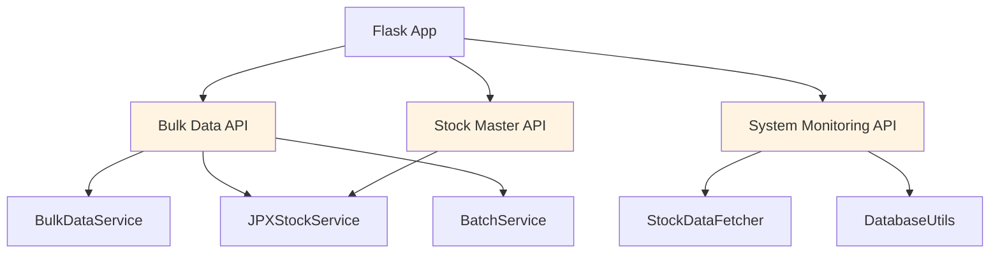
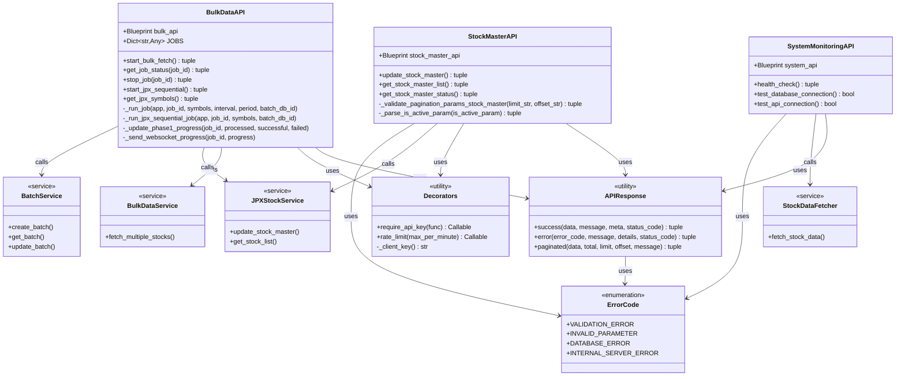
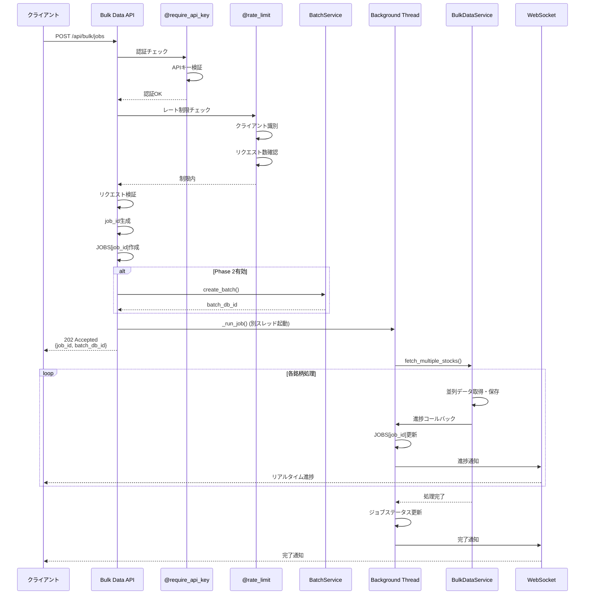
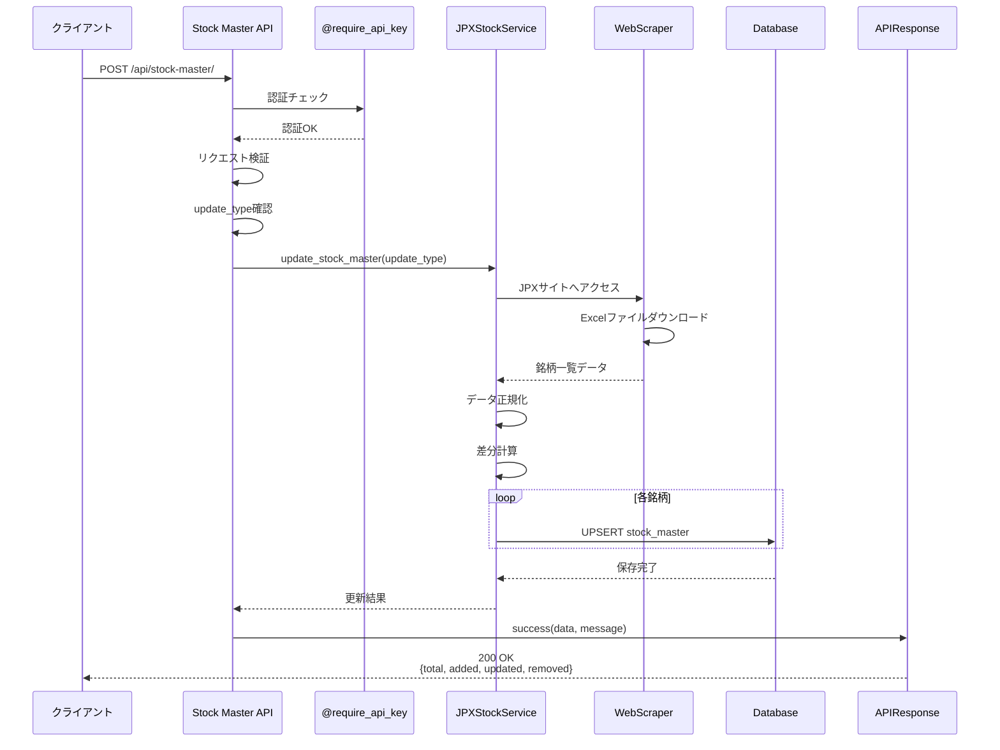
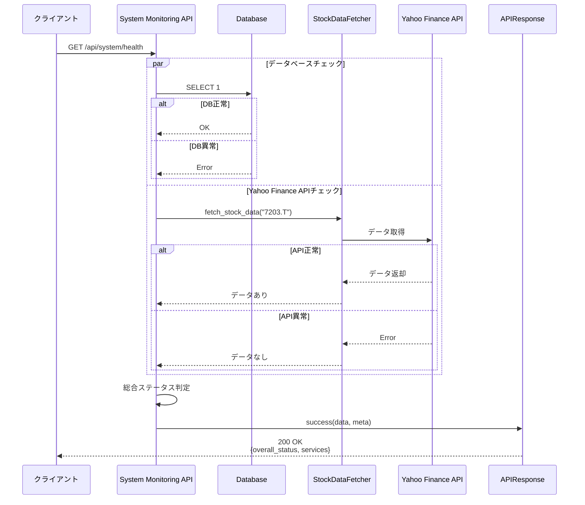
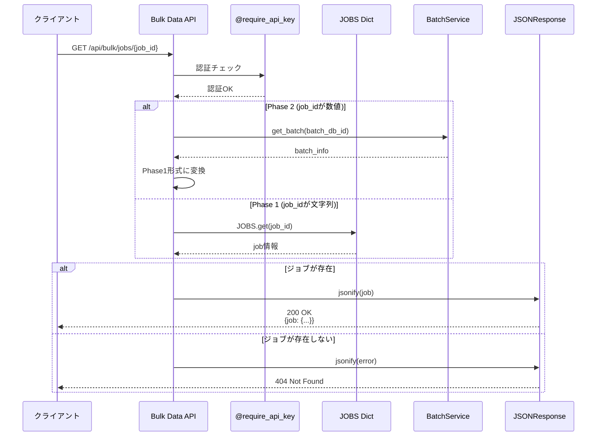

category: architecture
ai_context: high
last_updated: 2025-01-08
related_docs:
  - ../architecture_overview.md
  - ./service_layer.md
  - ./data_access_layer.md
  - ../../api/api_reference.md

# API層 仕様書

## 目次

- [1. 概要](#1-概要)
- [2. 構成](#2-構成)
- [3. Blueprint一覧](#3-blueprint一覧)
- [4. クラス図](#4-クラス図)
- [5. シーケンス図](#5-シーケンス図)
- [6. 共通仕様](#6-共通仕様)
- [7. エンドポイント詳細](#7-エンドポイント詳細)

---

## 1. 概要

### 役割

API層は、HTTPリクエストを受け付け、サービス層を呼び出し、レスポンスを返却するプレゼンテーション層とサービス層の橋渡しを担います。

### 責務

| 責務 | 説明 |
|------|------|
| **エンドポイント定義** | REST API エンドポイントの定義と実装 |
| **リクエスト検証** | 入力パラメータのバリデーション |
| **認証・認可** | APIキーによる認証、レート制限 |
| **レスポンス生成** | 標準化されたJSONレスポンスの生成 |
| **エラーハンドリング** | 例外のキャッチと適切なHTTPステータスコード返却 |
| **サービス層呼び出し** | ビジネスロジックの実行を委譲 |

### 設計原則

- **RESTful設計**: HTTPメソッドとステータスコードを適切に使用
- **薄い層**: ビジネスロジックはサービス層に委譲
- **標準化**: 共通のレスポンス形式（`APIResponse`）を使用
- **セキュリティ**: 全エンドポイントでAPIキー認証を実施

---

## 2. 構成

### ディレクトリ構造

```
app/api/
├── __init__.py              # Blueprint登録
├── bulk_data.py             # バルクデータ処理API
├── stock_master.py          # 銘柄マスタ管理API
├── system_monitoring.py     # システム監視API
├── swagger.py               # Swagger UI提供
└── openapi.yaml             # OpenAPI仕様定義
```

### 依存関係



---

## 3. Blueprint一覧

### 登録されているBlueprint

| Blueprint名 | URLプレフィックス | ファイル | 主な機能 |
|------------|------------------|---------|---------|
| `bulk_api` | `/api/bulk` | bulk_data.py | バルクデータ取得、JPX全銘柄取得 |
| `stock_master_api` | `/api/stock-master` | stock_master.py | 銘柄マスタ管理 |
| `system_api` | `/api/system` | system_monitoring.py | システム監視、ヘルスチェック |
| `swagger_api` | `/api/docs` | swagger.py | Swagger UI、OpenAPI仕様 |

---

## 4. クラス図

### API層の主要コンポーネント



### クラス責務

| クラス | 責務 |
|--------|------|
| **BulkDataAPI** | バルクデータ取得エンドポイント提供、非同期ジョブ管理 |
| **StockMasterAPI** | 銘柄マスタ管理エンドポイント提供 |
| **SystemMonitoringAPI** | システム監視エンドポイント提供 |
| **APIResponse** | 統一されたレスポンス形式の生成 |
| **Decorators** | 認証・レート制限の横断的関心事を処理 |
| **ErrorCode** | エラーコードの定数定義 |

---

## 5. シーケンス図

### 5.1 バルクデータ取得フロー



### 5.2 銘柄マスタ更新フロー



### 5.3 ヘルスチェックフロー



### 5.4 ジョブステータス取得フロー



---

## 6. 共通仕様

### 認証

全エンドポイント（ヘルスチェックを除く）で`@require_api_key`デコレータによるAPIキー認証を実施。

**認証方法:**
- リクエストヘッダー: `X-API-Key: <api_key>`
- 環境変数 `API_KEY` と照合

**エラーレスポンス（401）:**
```json
{
  "success": false,
  "error": "UNAUTHORIZED",
  "message": "APIキーが必要です"
}
```

### レート制限

バルクデータAPIでは`@rate_limit()`デコレータによるレート制限を実施。

**制限内容:**
- クライアントごとに10秒間で5リクエストまで
- 超過時は429エラーを返却

**エラーレスポンス（429）:**
```json
{
  "success": false,
  "error": "RATE_LIMIT_EXCEEDED",
  "message": "リクエストが多すぎます。しばらくしてから再度お試しください"
}
```

### レスポンス形式

`APIResponse`ユーティリティを使用した標準化されたレスポンス。

**成功時:**
```json
{
  "status": "success",
  "message": "メッセージ",
  "data": { ... },
  "meta": { ... }
}
```

**エラー時:**
```json
{
  "status": "error",
  "error": {
    "code": "ERROR_CODE",
    "message": "エラーメッセージ",
    "details": { ... }
  }
}
```

**ページネーション:**
```json
{
  "status": "success",
  "data": [ ... ],
  "meta": {
    "pagination": {
      "total": 100,
      "limit": 10,
      "offset": 0,
      "has_next": true
    }
  }
}
```

---

## 7. エンドポイント詳細

### 7.1 Bulk Data API

**Blueprint**: `bulk_api` (`/api/bulk`)

#### 一括データ取得

| 項目 | 内容 |
|------|------|
| **エンドポイント** | `POST /api/bulk/jobs` |
| **機能** | 複数銘柄の株価データを並列取得 |
| **認証** | 必須（APIキー） |
| **レート制限** | あり（10秒/5リクエスト） |
| **非同期** | はい（バックグラウンド実行） |

**リクエスト:**
```json
{
  "symbols": ["7203.T", "6758.T", "9984.T"],
  "interval": "1d",
  "period": "5d"
}
```

**レスポンス（202 Accepted）:**
```json
{
  "success": true,
  "job_id": "job-1704700800000",
  "batch_db_id": 123,
  "status": "accepted"
}
```

**バリデーション:**
- `symbols`: 文字列リスト必須、最大5000件
- `interval`: 省略時 `"1d"`
- `period`: オプショナル

#### JPX全銘柄順次取得

| 項目 | 内容 |
|------|------|
| **エンドポイント** | `POST /api/bulk/jpx-sequential/jobs` |
| **機能** | JPX全銘柄を8種類の時間軸で順次取得 |
| **認証** | 必須（APIキー） |
| **レート制限** | あり |
| **非同期** | はい（バックグラウンド実行） |

**リクエスト:**
```json
{
  "symbols": ["7203.T", "6758.T", ...]
}
```

**レスポンス（202 Accepted）:**
```json
{
  "success": true,
  "job_id": "jpx-seq-1704700800000",
  "batch_db_id": 124,
  "status": "accepted",
  "total_symbols": 4000,
  "intervals": ["1d", "1wk", "1mo", "1h", "30m", "15m", "5m", "1m"]
}
```

**処理フロー:**
1. 8種類の時間軸（`1d`, `1wk`, `1mo`, `1h`, `30m`, `15m`, `5m`, `1m`）を順次処理
2. 各時間軸で全銘柄を並列取得
3. 進捗をWebSocketで配信

#### ジョブステータス取得

| 項目 | 内容 |
|------|------|
| **エンドポイント** | `GET /api/bulk/jobs/<job_id>` |
| **機能** | 実行中または完了したジョブの進捗状況取得 |
| **認証** | 必須（APIキー） |
| **レート制限** | あり |

**レスポンス:**
```json
{
  "success": true,
  "job": {
    "id": "job-1704700800000",
    "status": "running",
    "progress": {
      "total": 100,
      "processed": 50,
      "successful": 48,
      "failed": 2,
      "progress_percentage": 50.0
    },
    "created_at": 1704700800.0,
    "updated_at": 1704700850.0
  }
}
```

**ステータス値:**
- `running`: 実行中
- `completed`: 完了
- `failed`: 失敗
- `stopped`: 停止

#### ジョブ停止

| 項目 | 内容 |
|------|------|
| **エンドポイント** | `DELETE /api/bulk/jobs/<job_id>` |
| **機能** | 実行中のジョブを停止 |
| **認証** | 必須（APIキー） |
| **レート制限** | あり |

#### JPX銘柄一覧取得

| 項目 | 内容 |
|------|------|
| **エンドポイント** | `GET /api/bulk/jpx-sequential/get-symbols` |
| **機能** | データベースから有効なJPX銘柄一覧を取得 |
| **認証** | 必須（APIキー） |
| **レート制限** | あり |

**クエリパラメータ:**
- `limit`: 取得件数（デフォルト: 100）
- `offset`: オフセット（デフォルト: 0）

---

### 7.2 Stock Master API

**Blueprint**: `stock_master_api` (`/api/stock-master`)

#### 銘柄マスタ更新

| 項目 | 内容 |
|------|------|
| **エンドポイント** | `POST /api/stock-master/` |
| **機能** | JPXから最新の銘柄一覧を取得してDBを更新 |
| **認証** | 必須（APIキー） |
| **処理時間** | 長時間（数分程度） |

**リクエスト:**
```json
{
  "update_type": "manual"
}
```

**パラメータ:**
- `update_type`: `"manual"` または `"scheduled"`（デフォルト: `"manual"`）

**レスポンス（200 OK）:**
```json
{
  "status": "success",
  "message": "銘柄マスタの更新が完了しました",
  "data": {
    "update_type": "manual",
    "total_stocks": 3800,
    "added_stocks": 50,
    "updated_stocks": 3700,
    "removed_stocks": 10,
    "status": "success"
  }
}
```

**エラーコード:**
- `JPX_DOWNLOAD_ERROR`: JPXサイトからのダウンロード失敗
- `JPX_PARSE_ERROR`: データパース失敗
- `DATABASE_ERROR`: データベース更新失敗

#### 銘柄マスタ一覧取得

| 項目 | 内容 |
|------|------|
| **エンドポイント** | `GET /api/stock-master/` <br> `GET /api/stock-master/stocks` |
| **機能** | データベースに保存されている銘柄マスタ一覧を取得 |
| **認証** | 必須（APIキー） |
| **ページネーション** | あり |

**クエリパラメータ:**

| パラメータ | 型 | デフォルト | 説明 |
|-----------|-----|-----------|------|
| `is_active` | string | `"true"` | `"true"`, `"false"`, `"all"` |
| `market_category` | string | なし | 市場区分で部分一致フィルタ |
| `limit` | int | `100` | 取得件数（1-1000） |
| `offset` | int | `0` | オフセット（0以上） |

**レスポンス（200 OK）:**
```json
{
  "status": "success",
  "message": "銘柄一覧を取得しました",
  "data": [
    {
      "id": 1,
      "stock_code": "1301",
      "stock_name": "極洋",
      "market_category": "プライム",
      "sector_33": "水産・農林業",
      "sector_17": "食品",
      "is_active": true,
      "created_at": "2025-01-01T00:00:00Z",
      "updated_at": "2025-01-08T00:00:00Z"
    }
  ],
  "meta": {
    "pagination": {
      "total": 3800,
      "limit": 100,
      "offset": 0,
      "has_next": true
    }
  }
}
```

#### 銘柄マスタステータス取得

| 項目 | 内容 |
|------|------|
| **エンドポイント** | `GET /api/stock-master/status` |
| **機能** | 銘柄マスタの統計情報を取得 |
| **認証** | 必須（APIキー） |

**レスポンス（200 OK）:**
```json
{
  "status": "success",
  "data": {
    "total_stocks": 3800,
    "active_stocks": 3750,
    "inactive_stocks": 50,
    "market_categories": {
      "プライム": 1800,
      "スタンダード": 1500,
      "グロース": 500
    },
    "last_updated": "2025-01-08T10:00:00Z"
  }
}
```

---

### 7.3 System Monitoring API

**Blueprint**: `system_api` (`/api/system`)

#### ヘルスチェック

| 項目 | 内容 |
|------|------|
| **エンドポイント** | `GET /api/system/health` <br> `GET /api/system/health-check` |
| **機能** | システム全体の稼働状態を確認 |
| **認証** | 不要 |
| **チェック項目** | データベース接続、Yahoo Finance API接続 |

**レスポンス（200 OK - 正常時）:**
```json
{
  "status": "success",
  "data": {
    "overall_status": "healthy",
    "services": {
      "database": {
        "status": "healthy",
        "message": "接続正常"
      },
      "yahoo_finance_api": {
        "status": "healthy",
        "message": "API接続正常"
      }
    }
  },
  "meta": {
    "timestamp": "2025-01-08T10:00:00Z"
  }
}
```

**ステータス値:**
- `healthy`: 正常
- `degraded`: 一部サービスに問題あり
- `error`: 重大な問題あり

**個別サービスステータス:**
- `healthy`: 正常
- `warning`: 警告（データ取得できず等）
- `error`: エラー（接続失敗等）

**レスポンス（200 OK - 異常時）:**
```json
{
  "status": "success",
  "data": {
    "overall_status": "error",
    "services": {
      "database": {
        "status": "error",
        "message": "接続エラー: connection refused"
      },
      "yahoo_finance_api": {
        "status": "healthy",
        "message": "API接続正常"
      }
    }
  },
  "meta": {
    "timestamp": "2025-01-08T10:00:00Z"
  }
}
```

---

## 関連ドキュメント

- [アーキテクチャ概要](../architecture_overview.md)
- [サービス層仕様書](./service_layer.md)
- [データアクセス層仕様書](./data_access_layer.md)
- [APIリファレンス](../../api/api_reference.md)

---

**最終更新**: 2025-01-08
