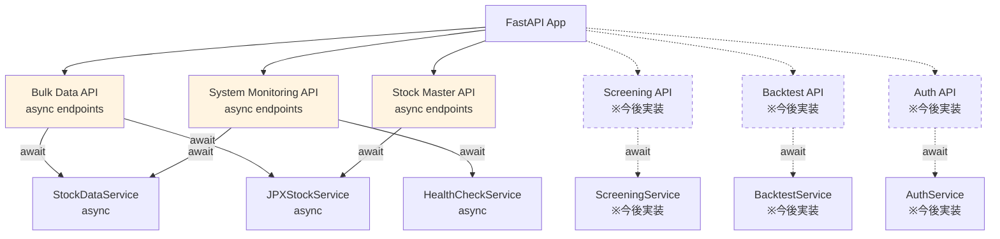
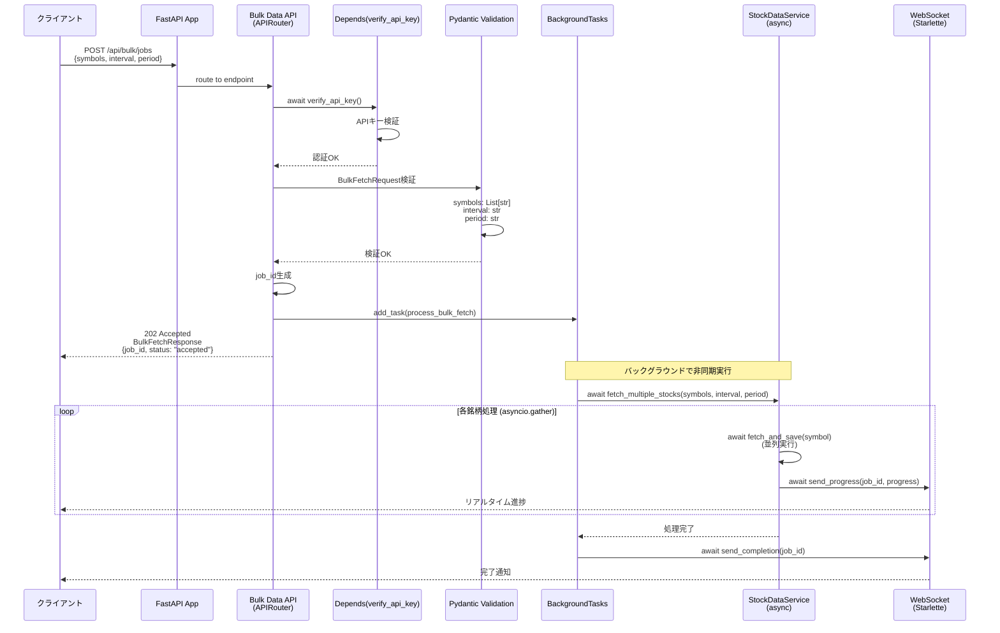
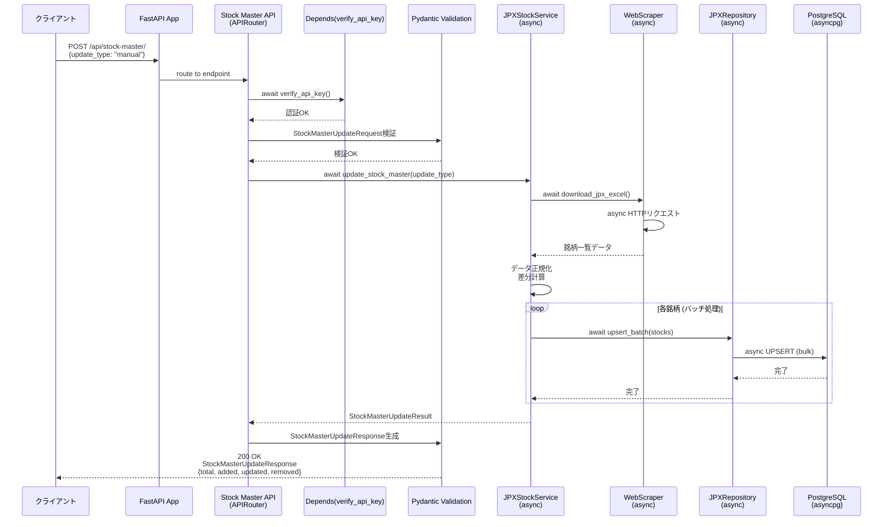
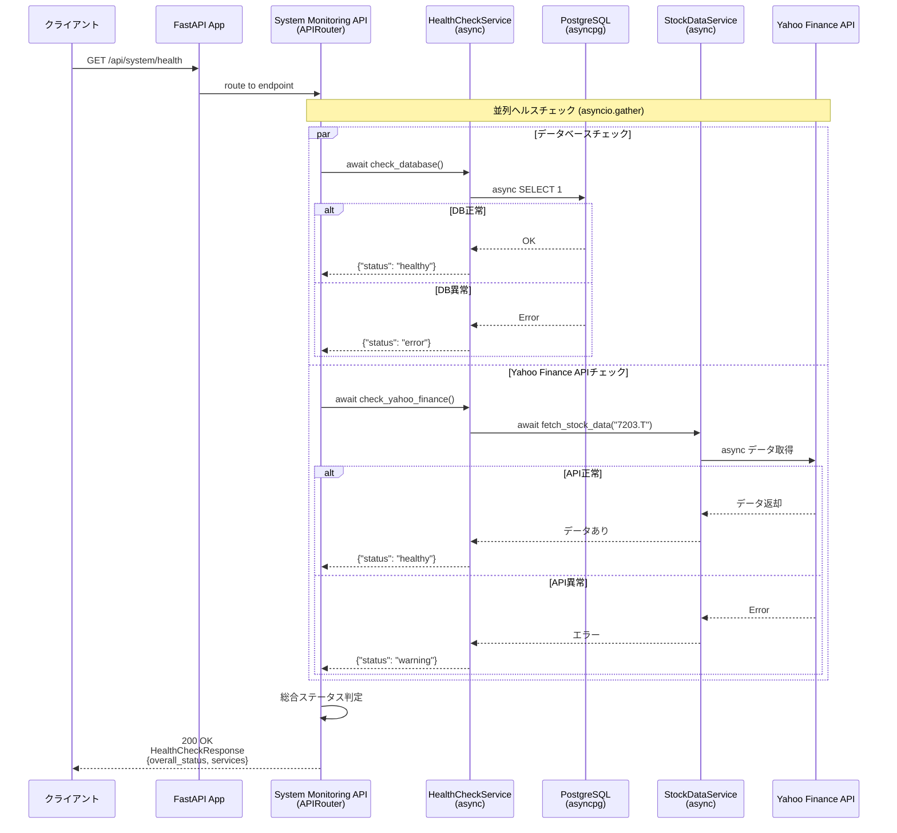
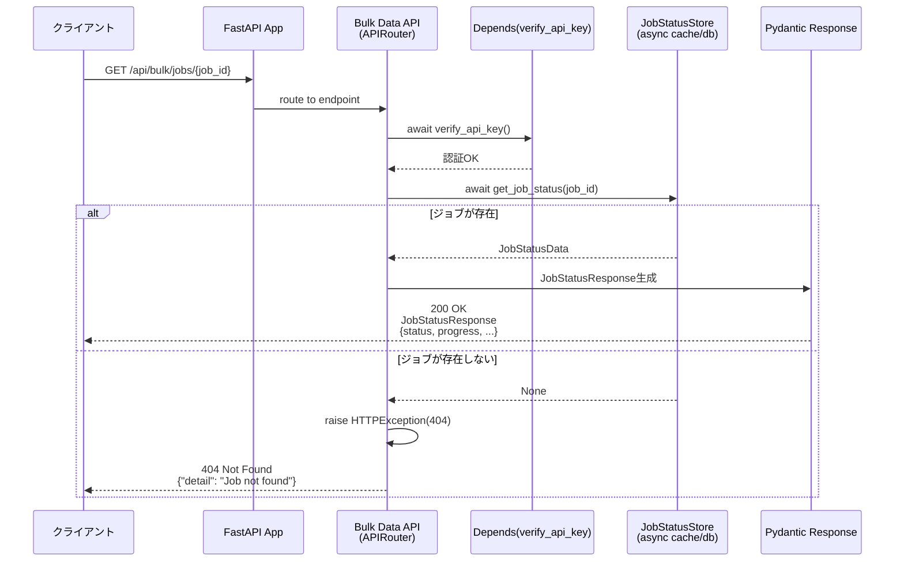

category: architecture
ai_context: high
last_updated: 2025-01-08
related_docs:
  - ../architecture_overview.md
  - ./service_layer.md
  - ./data_access_layer.md
  - ../../api/api_reference.md

# API層 仕様書

## 目次

- [1. 概要](#1-概要)
- [2. 構成](#2-構成)
- [3. Blueprint一覧](#3-blueprint一覧)
- [4. クラス図](#4-クラス図)
- [5. シーケンス図](#5-シーケンス図)
- [6. 共通仕様](#6-共通仕様)
- [7. エンドポイント詳細](#7-エンドポイント詳細)

---

## 1. 概要

### 役割

API層は、FastAPIのAPIRouterを使用して非同期HTTPリクエストを受け付け、Pydanticによるバリデーションを行い、非同期サービス層を呼び出し、型安全なレスポンスを返却します。プレゼンテーション層とサービス層の橋渡しを担います。

### 責務

| 責務 | 説明 |
|------|------|
| **非同期エンドポイント定義** | FastAPI APIRouterによる非同期REST APIエンドポイントの定義と実装 |
| **Pydanticバリデーション** | リクエスト/レスポンススキーマの自動検証とシリアライズ |
| **OpenAPI自動生成** | Pydanticスキーマからの自動ドキュメント生成(Swagger UI/ReDoc) |
| **認証・認可** | FastAPI依存性注入による認証、レート制限 |
| **型安全なレスポンス生成** | Pydanticモデルによる標準化されたレスポンス |
| **エラーハンドリング** | HTTPExceptionとカスタム例外の適切な処理 |
| **非同期サービス層呼び出し** | await/async経由でビジネスロジックの実行を委譲 |

### 設計原則

- **RESTful設計**: HTTPメソッドとステータスコードを適切に使用
- **薄い層**: ビジネスロジックはサービス層に委譲、API層はルーティングと検証のみ
- **型安全性**: Pydantic統合による実行時型検証とOpenAPI自動生成
- **非同期ファースト**: 全エンドポイントでasync/awaitを使用
- **依存性注入**: FastAPIのDependsパターンで認証・DB接続・サービス層を注入
- **契約駆動開発**: Pydanticスキーマを先に定義し、OpenAPI自動生成で並行開発を促進

---

## 2. 構成

### ディレクトリ構造

```
app/api/
├── __init__.py              # APIRouter登録
├── bulk_data.py             # バルクデータ処理API (非同期)
├── stock_master.py          # 銘柄マスタ管理API (非同期)
├── system_monitoring.py     # システム監視API (非同期)
├── screening.py             # スクリーニングAPI (※今後実装)
├── backtest.py              # バックテストAPI (※今後実装)
└── auth.py                  # 認証API (※今後実装)
```

**Note**: Swagger UI/ReDocはFastAPIにより自動生成されるため、個別のファイルは不要

### 依存関係



---

## 3. APIRouter一覧

### 登録されているAPIRouter

| Router名 | URLプレフィックス | ファイル | 主な機能 | タグ |
|----------|------------------|---------|---------|------|
| `bulk_router` | `/api/bulk` | bulk_data.py | バルクデータ取得、JPX全銘柄取得 | `bulk-data` |
| `stock_master_router` | `/api/stock-master` | stock_master.py | 銘柄マスタ管理 | `stock-master` |
| `system_router` | `/api/system` | system_monitoring.py | システム監視、ヘルスチェック | `system` |
| `screening_router` | `/api/screening` | screening.py | スクリーニング機能 (※今後実装) | `screening` |
| `backtest_router` | `/api/backtest` | backtest.py | バックテスト機能 (※今後実装) | `backtest` |
| `auth_router` | `/api/auth` | auth.py | 認証・認可 (※今後実装) | `authentication` |

**Note**: 各RouterはFastAPIの`APIRouter`を使用し、`app/main.py`の`app.include_router()`で登録されます

---

## 4. クラス図

### API層の主要コンポーネント

```mermaid
classDiagram
    class BulkDataAPI {
        <<APIRouter>>
        +APIRouter router
        +async start_bulk_fetch(request: BulkFetchRequest) BulkFetchResponse
        +async get_job_status(job_id: str) JobStatusResponse
        +async stop_job(job_id: str) JobStopResponse
        +async start_jpx_sequential(request: JPXSequentialRequest) JPXSequentialResponse
        +async get_jpx_symbols(limit: int, offset: int) JPXSymbolsResponse
    }

    class StockMasterAPI {
        <<APIRouter>>
        +APIRouter router
        +async update_stock_master(request: StockMasterUpdateRequest) StockMasterUpdateResponse
        +async get_stock_master_list(params: StockMasterListParams) PaginatedResponse
        +async search_stock_master(query: str) SearchResponse
        +async get_stock_master_status() StockMasterStatusResponse
    }

    class SystemMonitoringAPI {
        <<APIRouter>>
        +APIRouter router
        +async health_check() HealthCheckResponse
        +async get_system_metrics() SystemMetricsResponse
    }

    class BulkFetchRequest {
        <<Pydantic Schema>>
        +symbols: List[str]
        +interval: str
        +period: str
    }

    class BulkFetchResponse {
        <<Pydantic Schema>>
        +status: str
        +job_id: str
        +batch_db_id: int
        +message: str
    }

    class JobStatusResponse {
        <<Pydantic Schema>>
        +status: str
        +job: JobStatus
    }

    class HealthCheckResponse {
        <<Pydantic Schema>>
        +status: str
        +data: HealthCheckData
        +meta: MetaData
    }

    class PaginatedResponse {
        <<Pydantic Schema>>
        +status: str
        +data: List[T]
        +meta: PaginationMeta
    }

    class Dependencies {
        <<dependency injection>>
        +async get_db() AsyncSession
        +async get_current_user(token: str) User
        +async verify_api_key(api_key: str) bool
        +async get_stock_service(db) StockDataService
        +async get_jpx_service(db) JPXStockService
    }

    class HTTPException {
        <<FastAPI Exception>>
        +status_code: int
        +detail: str
    }

    class CustomException {
        <<Custom Exception>>
        +ValidationError
        +DatabaseError
        +ExternalAPIError
    }

    class StockDataService {
        <<service>>
        +async fetch_multiple_stocks()
        +async fetch_and_save()
    }

    class JPXStockService {
        <<service>>
        +async update_stock_master()
        +async get_stock_list()
    }

    BulkDataAPI --> BulkFetchRequest : validates
    BulkDataAPI --> BulkFetchResponse : returns
    BulkDataAPI --> Dependencies : uses Depends()
    BulkDataAPI --> StockDataService : await calls
    BulkDataAPI --> JPXStockService : await calls
    BulkDataAPI --> HTTPException : raises
    BulkDataAPI --> CustomException : handles

    StockMasterAPI --> Dependencies : uses Depends()
    StockMasterAPI --> JPXStockService : await calls
    StockMasterAPI --> PaginatedResponse : returns
    StockMasterAPI --> HTTPException : raises

    SystemMonitoringAPI --> HealthCheckResponse : returns
    SystemMonitoringAPI --> Dependencies : uses Depends()
    SystemMonitoringAPI --> StockDataService : await calls
    SystemMonitoringAPI --> HTTPException : raises

    Dependencies --> StockDataService : creates
    Dependencies --> JPXStockService : creates
```



### コンポーネント責務

| コンポーネント | 責務 |
|--------------|------|
| **BulkDataAPI** | バルクデータ取得非同期エンドポイント提供、ジョブ管理 |
| **StockMasterAPI** | 銘柄マスタ管理非同期エンドポイント提供 |
| **SystemMonitoringAPI** | システム監視非同期エンドポイント提供 |
| **Pydantic Schemas** | リクエスト/レスポンスの型定義・自動検証・OpenAPI生成 |
| **Dependencies** | 依存性注入によるDB接続・認証・サービス層提供 |
| **HTTPException** | FastAPI標準の例外処理 |
| **CustomException** | カスタムビジネスロジック例外 |

---

## 5. シーケンス図

### 5.1 バルクデータ取得フロー (FastAPI非同期)



### 5.2 銘柄マスタ更新フロー (FastAPI非同期)



### 5.3 ヘルスチェックフロー (FastAPI非同期)



### 5.4 ジョブステータス取得フロー (FastAPI非同期)



---

## 6. 共通仕様

### 認証 (FastAPI依存性注入)

全エンドポイント（ヘルスチェックを除く）でFastAPIの`Depends()`による依存性注入でAPIキー認証を実施。

**実装方法:**
```python
from fastapi import Depends, HTTPException, Header
from typing import Annotated

async def verify_api_key(x_api_key: Annotated[str, Header()]) -> bool:
    """APIキー検証 (依存性注入用)"""
    if x_api_key != settings.API_KEY:
        raise HTTPException(
            status_code=401,
            detail="Invalid API Key"
        )
    return True

# エンドポイント例
@router.post("/bulk/jobs")
async def start_bulk_fetch(
    request: BulkFetchRequest,
    api_key: Annotated[bool, Depends(verify_api_key)]
):
    ...
```

**認証方法:**
- リクエストヘッダー: `X-API-Key: <api_key>`
- 環境変数 `API_KEY` と照合

**エラーレスポンス（401） - FastAPI HTTPException:**
```json
{
  "detail": "Invalid API Key"
}
```

### レート制限 (FastAPI Middleware)

FastAPIのミドルウェアまたはSlowAPIライブラリによるレート制限を実施。

**実装例 (SlowAPI):**
```python
from slowapi import Limiter, _rate_limit_exceeded_handler
from slowapi.util import get_remote_address

limiter = Limiter(key_func=get_remote_address)
app.state.limiter = limiter
app.add_exception_handler(RateLimitExceeded, _rate_limit_exceeded_handler)

@router.post("/bulk/jobs")
@limiter.limit("5/10seconds")
async def start_bulk_fetch(request: Request, ...):
    ...
```

**制限内容:**
- クライアントIPごとに10秒間で5リクエストまで
- 超過時は429エラーを返却

**エラーレスポンス（429）:**
```json
{
  "detail": "Rate limit exceeded: 5 per 10 seconds"
}
```

### レスポンス形式 (Pydanticスキーマ)

全レスポンスはPydanticモデルで型安全に定義し、OpenAPI自動生成に対応。

**基底レスポンススキーマ (`app/schemas/responses.py`):**

```python
from pydantic import BaseModel, Field
from typing import Generic, TypeVar, Optional, List

T = TypeVar('T')

class MetaData(BaseModel):
    """メタデータ"""
    timestamp: str = Field(..., description="レスポンス生成時刻")
    request_id: Optional[str] = Field(None, description="リクエストID")

class PaginationMeta(BaseModel):
    """ページネーションメタデータ"""
    total: int = Field(..., description="総件数")
    limit: int = Field(..., description="取得件数")
    offset: int = Field(..., description="オフセット")
    has_next: bool = Field(..., description="次のページの有無")

class SuccessResponse(BaseModel, Generic[T]):
    """成功レスポンス"""
    status: str = Field(default="success", description="ステータス")
    message: str = Field(..., description="メッセージ")
    data: T = Field(..., description="データ")
    meta: Optional[MetaData] = Field(None, description="メタデータ")

class PaginatedResponse(BaseModel, Generic[T]):
    """ページネーション対応レスポンス"""
    status: str = Field(default="success")
    message: str = Field(..., description="メッセージ")
    data: List[T] = Field(..., description="データリスト")
    meta: dict = Field(..., description="ページネーション情報")
```

**使用例:**

```python
@router.get("/stocks", response_model=PaginatedResponse[StockData])
async def get_stocks(limit: int = 10, offset: int = 0):
    stocks = await stock_service.get_stocks(limit, offset)
    total = await stock_service.count_stocks()

    return PaginatedResponse(
        message="銘柄一覧を取得しました",
        data=stocks,
        meta={
            "pagination": {
                "total": total,
                "limit": limit,
                "offset": offset,
                "has_next": offset + limit < total
            }
        }
    )
```

**OpenAPI自動生成:**
上記のPydanticスキーマから、FastAPIが自動的にSwagger UI/ReDocを生成

---

## 7. エンドポイント詳細

### 7.1 Bulk Data API

**APIRouter**: `bulk_router` (`/api/bulk`)

#### 一括データ取得

| 項目 | 内容 |
|------|------|
| **エンドポイント** | `POST /api/bulk/jobs` |
| **機能** | 複数銘柄の株価データを非同期並列取得 |
| **認証** | 必須（`Depends(verify_api_key)`） |
| **レート制限** | あり（SlowAPI: 10秒/5リクエスト） |
| **非同期** | はい（BackgroundTasks使用） |
| **リクエストモデル** | `BulkFetchRequest` |
| **レスポンスモデル** | `BulkFetchResponse` |

**Pydanticリクエストスキーマ:**
```python
class BulkFetchRequest(BaseModel):
    symbols: List[str] = Field(..., description="銘柄コードリスト", max_items=5000)
    interval: str = Field(default="1d", description="時間軸")
    period: str = Field(default="5d", description="取得期間")
```

**レスポンス（202 Accepted）:**
```json
{
  "status": "success",
  "message": "バルクデータ取得ジョブを開始しました",
  "data": {
    "job_id": "job-1704700800000",
    "batch_db_id": 123,
    "status": "accepted",
    "total_symbols": 3
  }
}
```

**Pydanticレスポンススキーマ:**
```python
class BulkFetchResponse(SuccessResponse[BulkFetchData]):
    pass

class BulkFetchData(BaseModel):
    job_id: str
    batch_db_id: Optional[int]
    status: str
    total_symbols: int
```

**バリデーション（Pydantic自動）:**
- `symbols`: 文字列リスト必須、最大5000件
- `interval`: デフォルト `"1d"`
- `period`: デフォルト `"5d"`

#### JPX全銘柄順次取得

| 項目 | 内容 |
|------|------|
| **エンドポイント** | `POST /api/bulk/jpx-sequential/jobs` |
| **機能** | JPX全銘柄を8種類の時間軸で非同期順次取得 |
| **認証** | 必須（`Depends(verify_api_key)`） |
| **レート制限** | あり（SlowAPI） |
| **非同期** | はい（BackgroundTasks使用） |
| **リクエストモデル** | `JPXSequentialRequest` |
| **レスポンスモデル** | `JPXSequentialResponse` |

**Pydanticリクエストスキーマ:**
```python
class JPXSequentialRequest(BaseModel):
    symbols: Optional[List[str]] = Field(None, description="銘柄リスト（省略時は全銘柄）")
```

**レスポンス（202 Accepted）:**
```json
{
  "status": "success",
  "message": "JPX全銘柄順次取得ジョブを開始しました",
  "data": {
    "job_id": "jpx-seq-1704700800000",
    "batch_db_id": 124,
    "status": "accepted",
    "total_symbols": 4000,
    "intervals": ["1d", "1wk", "1mo", "1h", "30m", "15m", "5m", "1m"]
  }
}
```

**処理フロー:**
1. 8種類の時間軸（`1d`, `1wk`, `1mo`, `1h`, `30m`, `15m`, `5m`, `1m`）を順次処理
2. 各時間軸で全銘柄を非同期並列取得（`asyncio.gather()`）
3. 進捗をStarlette WebSocketで配信

#### ジョブステータス取得

| 項目 | 内容 |
|------|------|
| **エンドポイント** | `GET /api/bulk/jobs/{job_id}` |
| **機能** | 実行中または完了したジョブの進捗状況を非同期取得 |
| **認証** | 必須（`Depends(verify_api_key)`） |
| **レート制限** | あり |
| **レスポンスモデル** | `JobStatusResponse` |

**Pydanticレスポンススキーマ:**
```python
class JobProgress(BaseModel):
    total: int
    processed: int
    successful: int
    failed: int
    progress_percentage: float

class JobStatus(BaseModel):
    id: str
    status: Literal["running", "completed", "failed", "stopped"]
    progress: JobProgress
    created_at: datetime
    updated_at: datetime

class JobStatusResponse(SuccessResponse[JobStatus]):
    pass
```

**レスポンス:**
```json
{
  "status": "success",
  "message": "ジョブステータスを取得しました",
  "data": {
    "id": "job-1704700800000",
    "status": "running",
    "progress": {
      "total": 100,
      "processed": 50,
      "successful": 48,
      "failed": 2,
      "progress_percentage": 50.0
    },
    "created_at": "2025-01-08T10:00:00Z",
    "updated_at": "2025-01-08T10:00:50Z"
  }
}
```

**ステータス値（Literal型で型安全）:**
- `running`: 実行中
- `completed`: 完了
- `failed`: 失敗
- `stopped`: 停止

#### ジョブ停止

| 項目 | 内容 |
|------|------|
| **エンドポイント** | `DELETE /api/bulk/jobs/{job_id}` |
| **機能** | 実行中のジョブを非同期停止 |
| **認証** | 必須（`Depends(verify_api_key)`） |
| **レート制限** | あり |
| **レスポンスモデル** | `JobStopResponse` |

#### JPX銘柄一覧取得

| 項目 | 内容 |
|------|------|
| **エンドポイント** | `GET /api/bulk/jpx-sequential/get-symbols` |
| **機能** | データベースから有効なJPX銘柄一覧を非同期取得 |
| **認証** | 必須（`Depends(verify_api_key)`） |
| **レート制限** | あり |
| **レスポンスモデル** | `PaginatedResponse[JPXSymbol]` |

**クエリパラメータ（Pydantic自動バリデーション）:**
```python
async def get_jpx_symbols(
    limit: int = Query(default=100, ge=1, le=1000),
    offset: int = Query(default=0, ge=0)
):
    ...
```

---

### 7.2 Stock Master API

**APIRouter**: `stock_master_router` (`/api/stock-master`)

#### 銘柄マスタ更新

| 項目 | 内容 |
|------|------|
| **エンドポイント** | `POST /api/stock-master/` |
| **機能** | JPXから最新の銘柄一覧を非同期取得してDBを更新 |
| **認証** | 必須（`Depends(verify_api_key)`） |
| **処理時間** | 長時間（数分程度、非同期処理） |
| **リクエストモデル** | `StockMasterUpdateRequest` |
| **レスポンスモデル** | `StockMasterUpdateResponse` |

**Pydanticリクエストスキーマ:**
```python
class StockMasterUpdateRequest(BaseModel):
    update_type: Literal["manual", "scheduled"] = Field(
        default="manual",
        description="更新タイプ"
    )
```

**レスポンス（200 OK）:**
```json
{
  "status": "success",
  "message": "銘柄マスタの更新が完了しました",
  "data": {
    "update_type": "manual",
    "total_stocks": 3800,
    "added_stocks": 50,
    "updated_stocks": 3700,
    "removed_stocks": 10,
    "status": "success"
  }
}
```

**Pydanticレスポンススキーマ:**
```python
class StockMasterUpdateData(BaseModel):
    update_type: str
    total_stocks: int
    added_stocks: int
    updated_stocks: int
    removed_stocks: int
    status: str

class StockMasterUpdateResponse(SuccessResponse[StockMasterUpdateData]):
    pass
```

**エラーハンドリング（HTTPException）:**
- `500`: JPXサイトからのダウンロード失敗
- `500`: データパース失敗
- `500`: データベース更新失敗

#### 銘柄マスタ一覧取得

| 項目 | 内容 |
|------|------|
| **エンドポイント** | `GET /api/stock-master/` <br> `GET /api/stock-master/stocks` |
| **機能** | データベースに保存されている銘柄マスタ一覧を非同期取得 |
| **認証** | 必須（`Depends(verify_api_key)`） |
| **ページネーション** | あり（Pydantic自動バリデーション） |
| **レスポンスモデル** | `PaginatedResponse[StockMasterData]` |

**Pydanticクエリパラメータスキーマ:**
```python
class StockMasterListParams(BaseModel):
    is_active: Optional[Literal["true", "false", "all"]] = Field(
        default="true",
        description="有効/無効フィルタ"
    )
    market_category: Optional[str] = Field(
        None,
        description="市場区分で部分一致フィルタ"
    )
    limit: int = Query(default=100, ge=1, le=1000)
    offset: int = Query(default=0, ge=0)
```

**レスポンス（200 OK）:**
```json
{
  "status": "success",
  "message": "銘柄一覧を取得しました",
  "data": [
    {
      "id": 1,
      "stock_code": "1301",
      "stock_name": "極洋",
      "market_category": "プライム",
      "sector_33": "水産・農林業",
      "sector_17": "食品",
      "is_active": true,
      "created_at": "2025-01-01T00:00:00Z",
      "updated_at": "2025-01-08T00:00:00Z"
    }
  ],
  "meta": {
    "pagination": {
      "total": 3800,
      "limit": 100,
      "offset": 0,
      "has_next": true
    }
  }
}
```

**Pydanticレスポンススキーマ:**
```python
class StockMasterData(BaseModel):
    id: int
    stock_code: str
    stock_name: str
    market_category: str
    sector_33: Optional[str]
    sector_17: Optional[str]
    is_active: bool
    created_at: datetime
    updated_at: datetime
```

#### 銘柄マスタステータス取得

| 項目 | 内容 |
|------|------|
| **エンドポイント** | `GET /api/stock-master/status` |
| **機能** | 銘柄マスタの統計情報を非同期取得 |
| **認証** | 必須（`Depends(verify_api_key)`） |
| **レスポンスモデル** | `StockMasterStatusResponse` |

**レスポンス（200 OK）:**
```json
{
  "status": "success",
  "message": "銘柄マスタステータスを取得しました",
  "data": {
    "total_stocks": 3800,
    "active_stocks": 3750,
    "inactive_stocks": 50,
    "market_categories": {
      "プライム": 1800,
      "スタンダード": 1500,
      "グロース": 500
    },
    "last_updated": "2025-01-08T10:00:00Z"
  }
}
```

---

### 7.3 System Monitoring API

**APIRouter**: `system_router` (`/api/system`)

#### ヘルスチェック

| 項目 | 内容 |
|------|------|
| **エンドポイント** | `GET /api/system/health` <br> `GET /api/system/health-check` |
| **機能** | システム全体の稼働状態を非同期並列チェック（`asyncio.gather()`） |
| **認証** | 不要 |
| **チェック項目** | データベース接続（asyncpg）、Yahoo Finance API接続 |
| **レスポンスモデル** | `HealthCheckResponse` |

**Pydanticレスポンススキーマ:**
```python
class ServiceStatus(BaseModel):
    status: Literal["healthy", "warning", "error"]
    message: str

class HealthCheckData(BaseModel):
    overall_status: Literal["healthy", "degraded", "error"]
    services: Dict[str, ServiceStatus]

class HealthCheckResponse(SuccessResponse[HealthCheckData]):
    pass
```

**レスポンス（200 OK - 正常時）:**
```json
{
  "status": "success",
  "message": "システムヘルスチェックが完了しました",
  "data": {
    "overall_status": "healthy",
    "services": {
      "database": {
        "status": "healthy",
        "message": "接続正常"
      },
      "yahoo_finance_api": {
        "status": "healthy",
        "message": "API接続正常"
      }
    }
  },
  "meta": {
    "timestamp": "2025-01-08T10:00:00Z"
  }
}
```

**ステータス値（Literal型で型安全）:**
- `healthy`: 正常
- `degraded`: 一部サービスに問題あり
- `error`: 重大な問題あり

**個別サービスステータス:**
- `healthy`: 正常
- `warning`: 警告（データ取得できず等）
- `error`: エラー（接続失敗等）

**レスポンス（200 OK - 異常時）:**
```json
{
  "status": "success",
  "message": "システムヘルスチェックが完了しました",
  "data": {
    "overall_status": "error",
    "services": {
      "database": {
        "status": "error",
        "message": "接続エラー: connection refused"
      },
      "yahoo_finance_api": {
        "status": "healthy",
        "message": "API接続正常"
      }
    }
  },
  "meta": {
    "timestamp": "2025-01-08T10:00:00Z"
  }
}
```

---

## FastAPI特有の機能

### OpenAPI/Swagger UI自動生成

FastAPIは以下のURLで自動的にAPIドキュメントを提供します:

- **Swagger UI**: `http://localhost:8000/docs`
- **ReDoc**: `http://localhost:8000/redoc`
- **OpenAPIスキーマ**: `http://localhost:8000/openapi.json`

すべてのPydanticスキーマから自動生成され、手動メンテナンス不要です。

### 依存性注入パターン

```python
# app/dependencies.py
from fastapi import Depends, Header, HTTPException
from sqlalchemy.ext.asyncio import AsyncSession
from typing import Annotated

async def get_db() -> AsyncSession:
    """非同期DB接続を提供"""
    async with async_session_maker() as session:
        yield session

async def verify_api_key(x_api_key: Annotated[str, Header()]) -> bool:
    """APIキー検証"""
    if x_api_key != settings.API_KEY:
        raise HTTPException(status_code=401, detail="Invalid API Key")
    return True

async def get_stock_service(
    db: Annotated[AsyncSession, Depends(get_db)]
) -> StockDataService:
    """StockDataServiceを提供"""
    return StockDataService(db)
```

---

## 関連ドキュメント

- [アーキテクチャ概要](../architecture_overview.md)
- [サービス層仕様書](./service_layer.md)
- [データアクセス層仕様書](./data_access_layer.md)
- [APIリファレンス](../../api/api_reference.md)

---

**最終更新**: 2025-11-15
