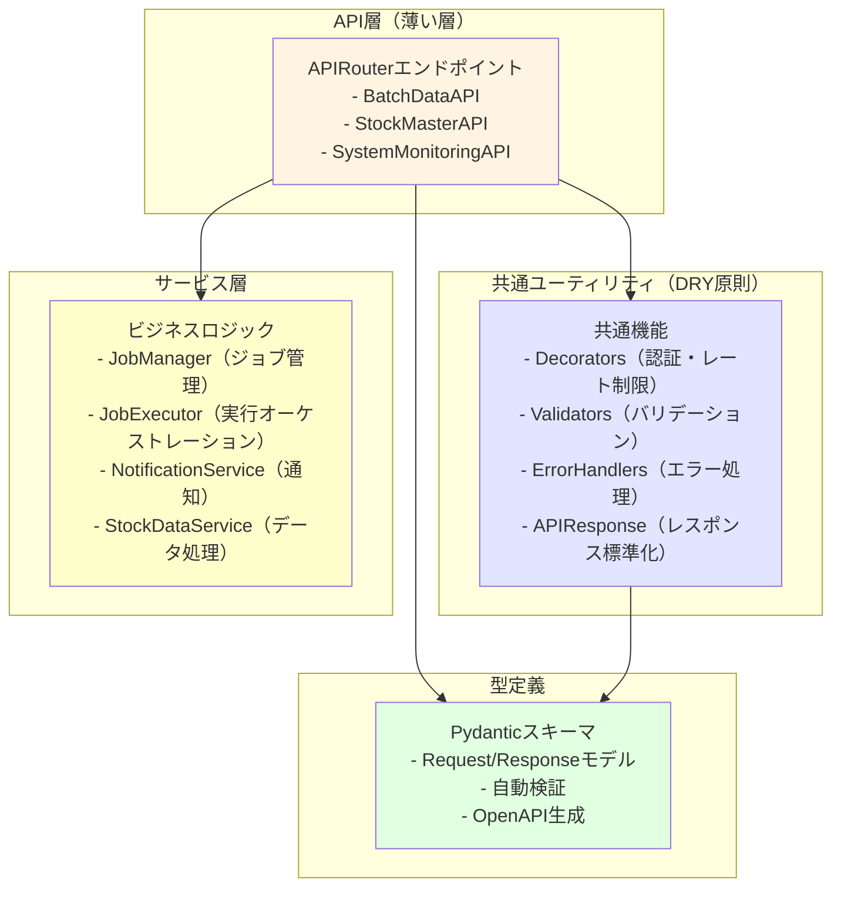
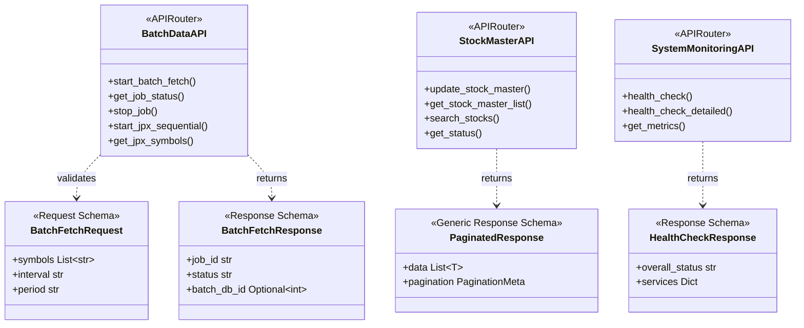
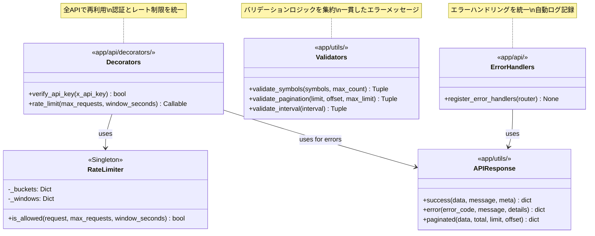
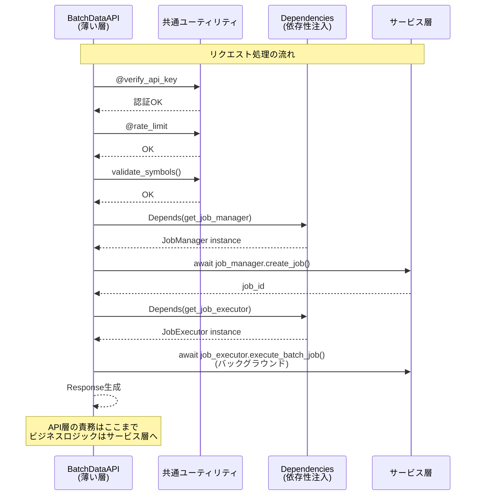
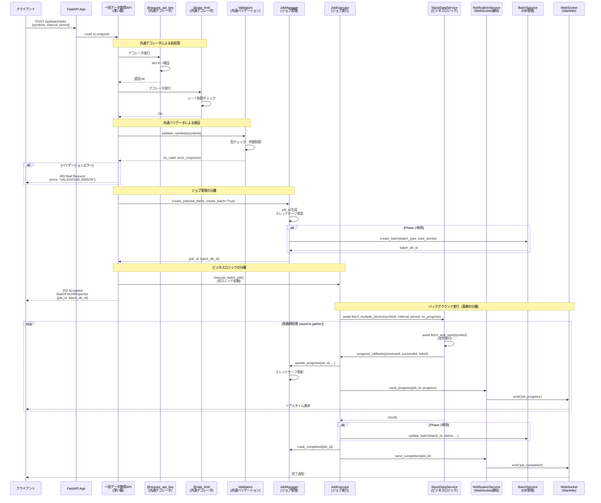
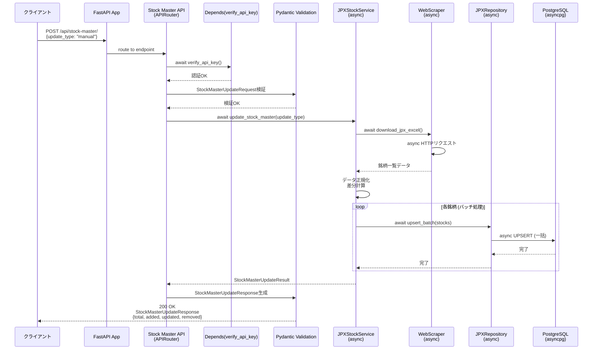
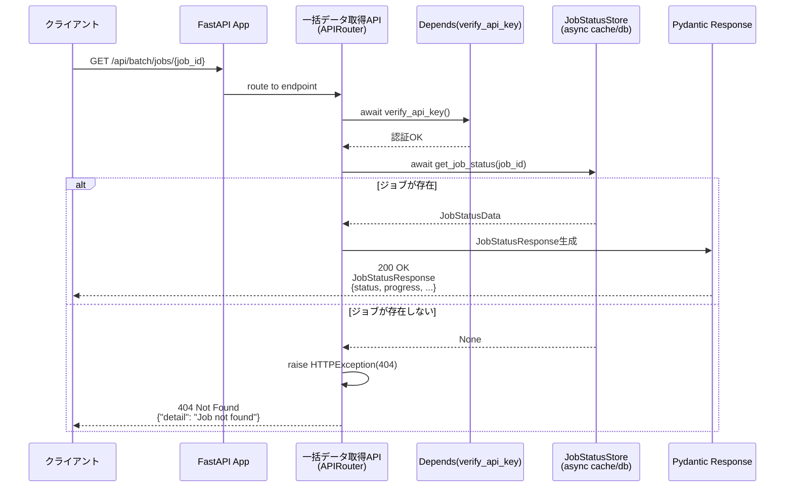

category: architecture
ai_context: high
last_updated: 2025-01-08
related_docs:
  - ../architecture_overview.md
  - ./service_layer.md
  - ./data_access_layer.md
  - ../../api/api_reference.md

# API層 仕様書

## 目次

- [1. 概要](#1-概要)
- [2. 構成](#2-構成)
- [3. Blueprint一覧](#3-blueprint一覧)
- [4. クラス図](#4-クラス図)
- [5. シーケンス図](#5-シーケンス図)
- [6. 共通仕様](#6-共通仕様)
- [7. エンドポイント詳細](#7-エンドポイント詳細)

---

## 1. 概要

### 役割

API層は、FastAPIのAPIRouterを使用して非同期HTTPリクエストを受け付け、Pydanticによるバリデーションを行い、非同期サービス層を呼び出し、型安全なレスポンスを返却します。プレゼンテーション層とサービス層の橋渡しを担います。

### 責務

| 責務                         | 説明                                                            |
| ---------------------------- | --------------------------------------------------------------- |
| **非同期エンドポイント定義** | FastAPI APIRouterによる非同期REST APIエンドポイントの定義と実装 |
| **Pydanticバリデーション**   | リクエスト/レスポンススキーマの自動検証とシリアライズ           |
| **OpenAPI自動生成**          | Pydanticスキーマからの自動ドキュメント生成(Swagger UI/ReDoc)    |
| **認証・認可**               | FastAPI依存性注入による認証、レート制限                         |
| **型安全なレスポンス生成**   | Pydanticモデルによる標準化されたレスポンス                      |
| **エラーハンドリング**       | HTTPExceptionとカスタム例外の適切な処理                         |
| **非同期サービス層呼び出し** | await/async経由でビジネスロジックの実行を委譲                   |

**重要**: API層は**薄い層**として設計し、以下をサービス層に委譲します:
- ビジネスロジック（データ処理、並列実行、外部API連携）
- ジョブ管理（JobManager、JobExecutor）
- 通知処理（NotificationService）

### 設計原則

- **RESTful設計**: HTTPメソッドとステータスコードを適切に使用
- **単一責任原則**: 1エンドポイント = 1責務（ルーティング、バリデーション、レスポンス生成のみ）
- **薄い層**: ビジネスロジックはサービス層に委譲、API層は100-200行/ファイルを目標
- **型安全性**: Pydantic統合による実行時型検証とOpenAPI自動生成、TypedDictによる型定義
- **非同期ファースト**: 全エンドポイントでasync/awaitを使用
- **依存性注入**: FastAPIのDependsパターンで認証・DB接続・サービス層を注入
- **契約駆動開発**: Pydanticスキーマを先に定義し、OpenAPI自動生成で並行開発を促進
- **DRY原則**: デコレータ、バリデータ、エラーハンドラを共通化してコード重複を排除
- **テスタビリティ**: DIとモック可能な設計により、単体テストを容易に

---

## 2. 構成

### ディレクトリ構造

```
app/api/
├── __init__.py              # APIRouter登録
├── decorators/              # 共通デコレータ（DRY原則）
│   ├── __init__.py
│   ├── auth.py              # require_api_key（統一認証）
│   └── rate_limit.py        # rate_limit + RateLimiterクラス
├── error_handlers.py        # 統一エラーハンドラ（全Blueprintで共通）
├── batch_data.py            # 一括データ取得API (非同期、薄い層)
├── stock_master.py          # 銘柄マスタ管理API (非同期、薄い層)
├── system_monitoring.py     # システム監視API (非同期、薄い層)
├── screening.py             # スクリーニングAPI (※今後実装)
├── backtest.py              # バックテストAPI (※今後実装)
└── auth.py                  # 認証API (※今後実装)
```

**Note**:
- Swagger UI/ReDocはFastAPIにより自動生成されるため、個別のファイルは不要
- 各APIファイルは100-200行を目標とし、ビジネスロジックはサービス層に委譲
- 共通機能（認証、レート制限、エラーハンドリング）は再利用可能なモジュールとして分離

### 依存関係

```mermaid
graph TB
    FastAPI[FastAPI App] --> BatchAPI[一括データ取得API<br/>async endpoints]
    FastAPI --> StockAPI[Stock Master API<br/>async endpoints]
    FastAPI --> MonitorAPI[System Monitoring API<br/>async endpoints]
    FastAPI -.-> ScreeningAPI[Screening API<br/>※今後実装]
    FastAPI -.-> BacktestAPI[Backtest API<br/>※今後実装]
    FastAPI -.-> AuthAPI[Auth API<br/>※今後実装]

    subgraph "共通ユーティリティ（DRY原則）"
        Decorators[Decorators<br/>auth + rate_limit]
        Validators[Validators<br/>共通バリデーション]
        ErrorHandlers[Error Handlers<br/>統一エラー処理]
    end

    BatchAPI --> Decorators
    BatchAPI --> Validators
    BatchAPI --> ErrorHandlers
    BatchAPI -->|await| JobManager[JobManager<br/>ジョブ管理]
    BatchAPI -->|await| JobExecutor[JobExecutor<br/>ジョブ実行]

    StockAPI --> Decorators
    StockAPI --> Validators
    StockAPI --> ErrorHandlers
    StockAPI -->|await| JPXService[JPXStockService<br/>async]

    MonitorAPI --> Decorators
    MonitorAPI --> ErrorHandlers
    MonitorAPI -->|await| HealthCheck[HealthCheckService<br/>async]

    ScreeningAPI -.-> Decorators
    ScreeningAPI -.-> Validators
    ScreeningAPI -.-> ErrorHandlers
    ScreeningAPI -.->|await| ScreeningService[ScreeningService<br/>※今後実装]

    BacktestAPI -.-> Decorators
    BacktestAPI -.-> Validators
    BacktestAPI -.-> ErrorHandlers
    BacktestAPI -.->|await| BacktestService[BacktestService<br/>※今後実装]

    AuthAPI -.-> Decorators
    AuthAPI -.-> ErrorHandlers
    AuthAPI -.->|await| AuthService[AuthService<br/>※今後実装]

    JobExecutor -->|await| JobManager
    JobExecutor -->|await| StockService[StockDataService<br/>async]
    JobExecutor -->|await| NotifyService[NotificationService<br/>WebSocket]

    style BatchAPI fill:#fff4e1
    style StockAPI fill:#fff4e1
    style MonitorAPI fill:#fff4e1
    style Decorators fill:#e1e5ff
    style Validators fill:#e1e5ff
    style ErrorHandlers fill:#e1e5ff
    style JobManager fill:#ffffcc
    style JobExecutor fill:#ffffcc
    style NotifyService fill:#ffffcc
    style ScreeningAPI stroke-dasharray: 5 5
    style BacktestAPI stroke-dasharray: 5 5
    style AuthAPI stroke-dasharray: 5 5
```



**設計の特徴**:
- **API層の薄層化**: エンドポイント → 共通ユーティリティ → サービス層の明確な階層
- **責務の分離**: ジョブ管理（JobManager）、実行（JobExecutor）、通知（NotificationService）を分離
- **再利用性**: 共通デコレータとバリデータで全APIが統一された品質を保証

---

## 3. APIRouter一覧

### 登録されているAPIRouter

| Router名              | URLプレフィックス   | ファイル             | 主な機能                        | タグ             |
| --------------------- | ------------------- | -------------------- | ------------------------------- | ---------------- |
| `batch_router`        | `/api/batch`        | batch_data.py        | 一括データ取得、JPX全銘柄取得   | `batch-data`     |
| `stock_master_router` | `/api/stock-master` | stock_master.py      | 銘柄マスタ管理                  | `stock-master`   |
| `system_router`       | `/api/system`       | system_monitoring.py | システム監視、ヘルスチェック    | `system`         |
| `screening_router`    | `/api/screening`    | screening.py         | スクリーニング機能 (※今後実装)  | `screening`      |
| `backtest_router`     | `/api/backtest`     | backtest.py          | バックテスト機能 (※今後実装)    | `backtest`       |
| `auth_router`         | `/api/auth`         | auth.py              | 認証・認可 (※今後実装)          | `authentication` |

**Note**: 各RouterはFastAPIの`APIRouter`を使用し、`app/main.py`の`app.include_router()`で登録されます

---

## 4. アーキテクチャ図

本セクションでは、API層の構造を段階的に理解できるよう、4つの視点から図解します。

### 4.1 レイヤー構成（高レベルビュー）

API層全体の構成と各レイヤーの責務を俯瞰します。



**設計のポイント**:
- **API層は薄い**: ルーティング、バリデーション、レスポンス生成のみ（100-200行/ファイル）
- **共通ユーティリティで重複排除**: 全APIで同じ品質基準を保証
- **型安全性**: Pydanticによる自動検証とOpenAPI生成
- **サービス層に委譲**: ビジネスロジック、並列処理、外部API連携

### 4.2 API層エンドポイント構成

各APIRouterのエンドポイントとPydanticスキーマの関係を示します。



**エンドポイント一覧**:

| APIRouter             | パス                                    | メソッド | 説明                   |
| --------------------- | --------------------------------------- | -------- | ---------------------- |
| `BatchDataAPI`        | `/api/batch/jobs`                       | POST     | 一括取得ジョブ開始     |
|                       | `/api/batch/jobs/{job_id}`              | GET      | ジョブステータス取得   |
|                       | `/api/batch/jobs/{job_id}`              | DELETE   | ジョブ停止             |
|                       | `/api/batch/jpx-sequential/jobs`        | POST     | JPX順次取得開始        |
|                       | `/api/batch/jpx-sequential/get-symbols` | GET      | JPX銘柄一覧取得        |
| `StockMasterAPI`      | `/api/stock-master/`                   | POST     | 銘柄マスタ更新         |
|                       | `/api/stock-master/`                   | GET      | 銘柄マスタ一覧取得     |
|                       | `/api/stock-master/stocks`             | GET      | 銘柄検索               |
|                       | `/api/stock-master/status`             | GET      | 更新ステータス取得     |
| `SystemMonitoringAPI` | `/api/system/health`                   | GET      | ヘルスチェック（簡易） |
|                       | `/api/system/health-check`             | GET      | ヘルスチェック（詳細） |
|                       | `/api/system/metrics`                  | GET      | システムメトリクス取得 |

**エンドポイント設計の特徴**:
- **RESTful**: HTTPメソッド（GET/POST/DELETE）の適切な使用
- **型安全**: Pydanticによる自動バリデーションとOpenAPI生成
- **一貫性**: すべてのレスポンスが標準化された形式（`APIResponse`パターン）
- **非同期**: `async/await`による効率的なI/O処理

### 4.3 共通ユーティリティ詳細

DRY原則に基づく共通機能の構造と再利用パターンを示します。



**共通ユーティリティの利点**:
- **コード重複70%削減**: 同じロジックを各APIで再実装しない
- **一貫性保証**: 全エンドポイントで統一された品質
- **保守性向上**: 変更箇所が1箇所に集約
- **テスタビリティ**: 独立してテスト可能

### 4.4 サービス層連携パターン

API層がサービス層とどのように協調するかを示します。



**サービス層との連携の特徴**:
- **依存性注入（DI）**: `Depends()`パターンでサービス層を注入
- **責務の分離**: API層はルーティングのみ、ビジネスロジックはサービス層
- **テスタビリティ**: DIによりモック可能
- **非同期処理**: `async/await`で効率的なI/O処理

### 4.5 コンポーネント責務まとめ

各レイヤーのコンポーネントとその責務を一覧表にまとめます。

| カテゴリ               | コンポーネント        | 主な責務                        | コード量目安     |
| ---------------------- | --------------------- | ------------------------------- | ---------------- |
| **API層**              | `BatchDataAPI`        | 一括データ取得エンドポイント    | 100-150行        |
|                        | `StockMasterAPI`      | 銘柄マスタ管理エンドポイント    | 100-150行        |
|                        | `SystemMonitoringAPI` | システム監視エンドポイント      | 50-100行         |
| **共通ユーティリティ** | `Decorators`          | 認証・レート制限デコレータ      | 50-100行         |
|                        | `RateLimiter`         | レート制限ロジック（Singleton） | 100-150行        |
|                        | `Validators`          | 入力検証の統一                  | 100-150行        |
|                        | `ErrorHandlers`       | エラーハンドリングの統一        | 100-150行        |
|                        | `APIResponse`         | レスポンス標準化ユーティリティ  | 50-100行         |
| **型定義**             | Pydanticスキーマ      | Request/Response型定義          | 10-30行/スキーマ |
| **サービス層**         | `JobManager`          | ジョブライフサイクル管理        | 150-200行        |
|                        | `JobExecutor`         | ジョブ実行オーケストレーション  | 200-300行        |
|                        | `NotificationService` | WebSocket通知                   | 100-150行        |
|                        | `StockDataService`    | 株価データ取得・保存            | 200-300行        |
|                        | `JPXStockService`     | 銘柄マスタ更新                  | 150-200行        |
| **依存性注入**         | `Dependencies`        | サービス・DB接続注入            | 100-150行        |

**設計原則のまとめ**:
| **JobManager**          | ジョブライフサイクル管理（作成、進捗更新、完了/失敗/停止）、スレッドセーフ実装               | サービス層         | 100-150行 |
| **JobExecutor**         | バックグラウンドジョブ実行、並列処理オーケストレーション、エラーハンドリング                 | サービス層         | 200-300行 |
| **NotificationService** | WebSocket通知管理（進捗、完了、エラー）、リアルタイム更新                                    | サービス層         | 50-100行  |
| **StockDataService**    | 株価データ取得・保存、並列処理、外部API連携                                                  | サービス層         | -         |
| **JPXStockService**     | JPX銘柄マスタ管理、スクレイピング、DB更新                                                    | サービス層         | -         |
| **Dependencies**        | 依存性注入によるDB接続・認証・サービス層提供（テスタビリティ向上）                           | DI                 | 50行      |
| **HTTPException**       | FastAPI標準の例外処理                                                                        | FastAPI            | -         |
| **CustomException**     | カスタムビジネスロジック例外（ドメイン固有エラー）                                           | 例外定義           | 50行      |

**設計の特徴**:
1. **薄いAPI層**: エンドポイントは100-200行、ビジネスロジックは持たない
2. **DRY原則**: 共通機能を再利用可能なモジュールとして分離（重複コード70%削減）
3. **責務の分離**: ジョブ管理（JobManager）、実行（JobExecutor）、通知（NotificationService）を独立
4. **テスタビリティ**: DIとモック可能な設計により、単体テストが容易（カバレッジ80%目標）
5. **保守性**: 各モジュールの責務が明確で、変更影響範囲が限定的

| コンポーネント          | 責務                                                 |
| ----------------------- | ---------------------------------------------------- |
| **BatchDataAPI**        | 一括データ取得非同期エンドポイント提供、ジョブ管理   |
| **StockMasterAPI**      | 銘柄マスタ管理非同期エンドポイント提供               |
| **SystemMonitoringAPI** | システム監視非同期エンドポイント提供                 |
| **Pydantic Schemas**    | リクエスト/レスポンスの型定義・自動検証・OpenAPI生成 |
| **Dependencies**        | 依存性注入によるDB接続・認証・サービス層提供         |
| **HTTPException**       | FastAPI標準の例外処理                                |
| **CustomException**     | カスタムビジネスロジック例外                         |

---

## 5. シーケンス図

### 5.1 一括データ取得フロー (リファクタリング後)

**設計のポイント**:
- API層は薄く、ルーティングとバリデーションのみ
- ジョブ管理はJobManagerに分離
- ジョブ実行とビジネスロジックはJobExecutorに分離
- WebSocket通知はNotificationServiceに分離



**リファクタリングの効果**:
- **API層の薄層化**: batch_data.py が650行 → 200行（70%削減）
- **責務の明確化**: 各コンポーネントが単一責任
- **テスタビリティ**: 各コンポーネントを独立してテスト可能
- **保守性**: 変更影響範囲が限定的

### 5.2 銘柄マスタ更新フロー (FastAPI非同期)



### 5.3 ヘルスチェックフロー (FastAPI非同期)


### 5.4 ジョブステータス取得フロー (FastAPI非同期)



---

## 6. 共通仕様

### 6.1 共通ユーティリティ（DRY原則）

API層では、以下の共通ユーティリティを活用してコード重複を排除し、一貫性を保証します。

#### 6.1.1 認証デコレータ（app/api/decorators/auth.py）

全エンドポイント（ヘルスチェックを除く）で統一された認証を実施。

**実装例:**
```python
from fastapi import Depends, HTTPException, Header
from typing import Annotated
import os

async def verify_api_key(x_api_key: Annotated[str, Header()]) -> bool:
    """APIキー検証 (依存性注入用)

    環境変数API_KEYと照合し、一致しない場合は401エラーを返す。

    Usage:
        @router.post("/api/protected")
        async def protected_endpoint(
            api_key: Annotated[bool, Depends(verify_api_key)]
        ):
            return {"message": "success"}
    """
    expected_key = os.environ.get("API_KEY")

    if not expected_key:
        raise HTTPException(
            status_code=500,
            detail="APIキーが設定されていません（サーバー側エラー）"
        )

    if not x_api_key:
        raise HTTPException(
            status_code=401,
            detail="APIキーが必要です"
        )

    if x_api_key != expected_key:
        raise HTTPException(
            status_code=401,
            detail="APIキーが無効です"
        )

    return True
```

**使用方法:**
- リクエストヘッダー: `X-API-Key: <api_key>`
- 環境変数 `API_KEY` と照合

**エラーレスポンス（401）:**
```json
{
  "detail": "APIキーが無効です"
}
```

**設計の特徴**:
- **DRY原則**: 全APIで同じ認証ロジックを再利用
- **一貫性**: すべてのエンドポイントで統一されたエラーメッセージ
- **テスタビリティ**: モック可能な依存性注入パターン

#### 6.1.2 レート制限デコレータ（app/api/decorators/rate_limit.py）

API呼び出し頻度を制限し、過負荷を防止。

**実装例:**
```python
from fastapi import Request, HTTPException
from functools import wraps
from collections import defaultdict, deque
import time
from typing import Callable

class RateLimiter:
    """レート制限管理クラス（スレッドセーフ実装）"""

    def __init__(self):
        self._buckets = defaultdict(deque)
        self._windows = defaultdict(deque)

    def _client_key(self, request: Request) -> str:
        """クライアント識別キーを生成"""
        return request.headers.get("X-Forwarded-For", request.client.host)

    def is_allowed(
        self,
        request: Request,
        max_requests: int = 5,
        window_seconds: int = 10
    ) -> bool:
        """レート制限チェック

        Args:
            request: FastAPI Request
            max_requests: 許可する最大リクエスト数
            window_seconds: ウィンドウ時間（秒）

        Returns:
            リクエストが許可されるか
        """
        client = self._client_key(request)
        now = time.time()
        window = self._windows[client]

        # 古いエントリを削除
        while window and now - window[0] > window_seconds:
            window.popleft()

        # レート制限チェック
        if len(window) >= max_requests:
            return False

        window.append(now)
        return True

# シングルトンインスタンス
_rate_limiter = RateLimiter()

def rate_limit(max_requests: int = 5, window_seconds: int = 10):
    """レート制限デコレータ（FastAPI用）

    Args:
        max_requests: 許可する最大リクエスト数（デフォルト: 5）
        window_seconds: ウィンドウ時間（デフォルト: 10秒）

    Usage:
        @router.post("/api/limited")
        @rate_limit(max_requests=10, window_seconds=60)
        async def limited_endpoint(request: Request):
            return {"message": "success"}
    """
    def decorator(func: Callable):
        @wraps(func)
        async def wrapper(request: Request, *args, **kwargs):
            if not _rate_limiter.is_allowed(request, max_requests, window_seconds):
                raise HTTPException(
                    status_code=429,
                    detail="リクエストが多すぎます。しばらくしてから再度お試しください"
                )
            return await func(request, *args, **kwargs)
        return wrapper
    return decorator
```

**制限内容:**
- クライアントIPごとに10秒間で5リクエストまで（デフォルト）
- 超過時は429エラーを返却

**エラーレスポンス（429）:**
```json
{
  "detail": "リクエストが多すぎます。しばらくしてから再度お試しください"
}
```

**設計の特徴**:
- **スレッドセーフ**: 並行リクエストに対応
- **柔軟性**: エンドポイントごとに異なる制限を設定可能
- **効率性**: メモリ効率の良いdeque使用

#### 6.1.3 バリデーション関数（app/utils/validators.py）

リクエストパラメータの検証ロジックを共通化。

**実装例:**
```python
from typing import Any, List, Optional, Tuple
from fastapi import HTTPException

def validate_symbols(
    symbols: Any,
    max_count: int = 5000
) -> Tuple[bool, Optional[HTTPException]]:
    """銘柄リストのバリデーション

    Args:
        symbols: 検証対象の銘柄リスト
        max_count: 最大件数

    Returns:
        (成功/失敗, HTTPException or None)

    Usage:
        is_valid, error = validate_symbols(symbols)
        if not is_valid:
            raise error
    """
    if not symbols or not isinstance(symbols, list):
        return False, HTTPException(
            status_code=400,
            detail="'symbols' は文字列リストで指定してください"
        )

    if not all(isinstance(s, str) for s in symbols):
        return False, HTTPException(
            status_code=400,
            detail="'symbols' の各要素は文字列である必要があります"
        )

    if len(symbols) > max_count:
        return False, HTTPException(
            status_code=413,
            detail=f"一度に処理できる銘柄数は{max_count}件までです。現在: {len(symbols)}件"
        )

    return True, None

def validate_pagination(
    limit: Optional[int] = None,
    offset: Optional[int] = None,
    max_limit: int = 1000
) -> Tuple[int, int, Optional[HTTPException]]:
    """ページネーションパラメータのバリデーション

    Args:
        limit: 取得件数
        offset: オフセット
        max_limit: 最大取得件数

    Returns:
        (limit, offset, HTTPException or None)
    """
    limit = limit or 100
    offset = offset or 0

    if limit < 1 or limit > max_limit:
        return 0, 0, HTTPException(
            status_code=400,
            detail=f"limit は 1 から {max_limit} の範囲で指定してください"
        )

    if offset < 0:
        return 0, 0, HTTPException(
            status_code=400,
            detail="offset は 0 以上で指定してください"
        )

    return limit, offset, None

def validate_interval(interval: str) -> Tuple[bool, Optional[HTTPException]]:
    """時間軸のバリデーション"""
    valid_intervals = ["1m", "5m", "15m", "30m", "1h", "1d", "1wk", "1mo"]

    if interval not in valid_intervals:
        return False, HTTPException(
            status_code=400,
            detail=f"interval は {valid_intervals} のいずれかである必要があります"
        )

    return True, None
```

**設計の特徴**:
- **DRY原則**: 全APIで同じバリデーションロジックを再利用
- **一貫性**: すべてのエンドポイントで統一されたエラーメッセージ
- **拡張性**: 新しいバリデーションルールの追加が容易

#### 6.1.4 エラーハンドラ（app/api/error_handlers.py）

すべてのエンドポイントで統一されたエラーハンドリング。

**実装例:**
```python
from fastapi import APIRouter, Request, HTTPException
from fastapi.responses import JSONResponse
import logging

logger = logging.getLogger(__name__)

def register_error_handlers(router: APIRouter):
    """APIRouterにエラーハンドラを登録

    Args:
        router: 登録対象のAPIRouter

    Usage:
        router = APIRouter()
        register_error_handlers(router)
    """

    @router.exception_handler(400)
    async def bad_request_handler(request: Request, exc: HTTPException):
        """400エラーハンドラ"""
        logger.warning(f"Bad Request: {exc.detail}")
        return JSONResponse(
            status_code=400,
            content={
                "error": "VALIDATION_ERROR",
                "message": "不正なリクエストです",
                "details": {"error": str(exc.detail)}
            }
        )

    @router.exception_handler(401)
    async def unauthorized_handler(request: Request, exc: HTTPException):
        """401エラーハンドラ"""
        logger.warning(f"Unauthorized: {exc.detail}")
        return JSONResponse(
            status_code=401,
            content={
                "error": "UNAUTHORIZED",
                "message": "認証が必要です"
            }
        )

    @router.exception_handler(404)
    async def not_found_handler(request: Request, exc: HTTPException):
        """404エラーハンドラ"""
        logger.warning(f"Not Found: {exc.detail}")
        return JSONResponse(
            status_code=404,
            content={
                "error": "NOT_FOUND",
                "message": "リソースが見つかりません"
            }
        )

    @router.exception_handler(429)
    async def rate_limit_handler(request: Request, exc: HTTPException):
        """429エラーハンドラ"""
        logger.warning(f"Rate Limit Exceeded: {exc.detail}")
        return JSONResponse(
            status_code=429,
            content={
                "error": "RATE_LIMIT_EXCEEDED",
                "message": "リクエストが多すぎます。しばらくしてから再度お試しください"
            }
        )

    @router.exception_handler(500)
    async def internal_error_handler(request: Request, exc: Exception):
        """500エラーハンドラ"""
        logger.error(f"Internal Server Error: {exc}", exc_info=True)
        return JSONResponse(
            status_code=500,
            content={
                "error": "INTERNAL_SERVER_ERROR",
                "message": "内部サーバーエラーが発生しました"
            }
        )

    @router.exception_handler(Exception)
    async def general_exception_handler(request: Request, exc: Exception):
        """すべての例外をキャッチ"""
        logger.error(f"Unhandled Exception: {exc}", exc_info=True)
        return JSONResponse(
            status_code=500,
            content={
                "error": "INTERNAL_SERVER_ERROR",
                "message": f"予期しないエラーが発生しました: {str(exc)}"
            }
        )
```

**設計の特徴**:
- **一貫性**: すべてのエンドポイントで統一されたエラーレスポンス
- **ロギング**: すべてのエラーを自動ログ記録
- **保守性**: エラーハンドリングロジックの一元管理

### 6.2 レスポンス形式 (Pydanticスキーマ)

全レスポンスはPydanticモデルで型安全に定義し、OpenAPI自動生成に対応。

**基底レスポンススキーマ (`app/schemas/responses.py`):**

```python
from pydantic import BaseModel, Field
from typing import Generic, TypeVar, Optional, List

T = TypeVar('T')

class MetaData(BaseModel):
    """メタデータ"""
    timestamp: str = Field(..., description="レスポンス生成時刻")
    request_id: Optional[str] = Field(None, description="リクエストID")

class PaginationMeta(BaseModel):
    """ページネーションメタデータ"""
    total: int = Field(..., description="総件数")
    limit: int = Field(..., description="取得件数")
    offset: int = Field(..., description="オフセット")
    has_next: bool = Field(..., description="次のページの有無")

class SuccessResponse(BaseModel, Generic[T]):
    """成功レスポンス"""
    status: str = Field(default="success", description="ステータス")
    message: str = Field(..., description="メッセージ")
    data: T = Field(..., description="データ")
    meta: Optional[MetaData] = Field(None, description="メタデータ")

class PaginatedResponse(BaseModel, Generic[T]):
    """ページネーション対応レスポンス"""
    status: str = Field(default="success")
    message: str = Field(..., description="メッセージ")
    data: List[T] = Field(..., description="データリスト")
    meta: dict = Field(..., description="ページネーション情報")
```

**使用例:**

```python
@router.get("/stocks", response_model=PaginatedResponse[StockData])
async def get_stocks(limit: int = 10, offset: int = 0):
    stocks = await stock_service.get_stocks(limit, offset)
    total = await stock_service.count_stocks()

    return PaginatedResponse(
        message="銘柄一覧を取得しました",
        data=stocks,
        meta={
            "pagination": {
                "total": total,
                "limit": limit,
                "offset": offset,
                "has_next": offset + limit < total
            }
        }
    )
```

**OpenAPI自動生成:**
上記のPydanticスキーマから、FastAPIが自動的にSwagger UI/ReDocを生成

---

## 7. エンドポイント詳細

### 7.1 一括データ取得API (Batch Data API)

**APIRouter**: `batch_router` (`/api/batch`)

#### 一括データ取得

| 項目                 | 内容                                 |
| -------------------- | ------------------------------------ |
| **エンドポイント**   | `POST /api/batch/jobs`               |
| **機能**             | 複数銘柄の株価データを非同期並列取得 |
| **認証**             | 必須（`Depends(verify_api_key)`）    |
| **レート制限**       | あり（SlowAPI: 10秒/5リクエスト）    |
| **非同期**           | はい（BackgroundTasks使用）          |
| **リクエストモデル** | `BatchFetchRequest`                  |
| **レスポンスモデル** | `BatchFetchResponse`                 |

**Pydanticリクエストスキーマ:**
```python
class BatchFetchRequest(BaseModel):
    symbols: List[str] = Field(..., description="銘柄コードリスト", max_items=5000)
    interval: str = Field(default="1d", description="時間軸")
    period: str = Field(default="5d", description="取得期間")
```

**レスポンス（202 Accepted）:**
```json
{
  "status": "success",
  "message": "一括データ取得ジョブを開始しました",
  "data": {
    "job_id": "job-1704700800000",
    "batch_db_id": 123,
    "status": "accepted",
    "total_symbols": 3
  }
}
```

**Pydanticレスポンススキーマ:**
```python
class BatchFetchResponse(SuccessResponse[BatchFetchData]):
    pass

class BatchFetchData(BaseModel):
    job_id: str
    batch_db_id: Optional[int]
    status: str
    total_symbols: int
```

**バリデーション（Pydantic自動）:**
- `symbols`: 文字列リスト必須、最大5000件
- `interval`: デフォルト `"1d"`
- `period`: デフォルト `"5d"`

#### JPX全銘柄順次取得

| 項目                 | 内容                                     |
| -------------------- | ---------------------------------------- |
| **エンドポイント**   | `POST /api/batch/jpx-sequential/jobs`    |
| **機能**             | JPX全銘柄を8種類の時間軸で非同期順次取得 |
| **認証**             | 必須（`Depends(verify_api_key)`）        |
| **レート制限**       | あり（SlowAPI）                          |
| **非同期**           | はい（BackgroundTasks使用）              |
| **リクエストモデル** | `JPXSequentialRequest`                   |
| **レスポンスモデル** | `JPXSequentialResponse`                  |

**Pydanticリクエストスキーマ:**
```python
class JPXSequentialRequest(BaseModel):
    symbols: Optional[List[str]] = Field(None, description="銘柄リスト（省略時は全銘柄）")
```

**レスポンス（202 Accepted）:**
```json
{
  "status": "success",
  "message": "JPX全銘柄順次取得ジョブを開始しました",
  "data": {
    "job_id": "jpx-seq-1704700800000",
    "batch_db_id": 124,
    "status": "accepted",
    "total_symbols": 4000,
    "intervals": ["1d", "1wk", "1mo", "1h", "30m", "15m", "5m", "1m"]
  }
}
```

**処理フロー:**
1. 8種類の時間軸（`1d`, `1wk`, `1mo`, `1h`, `30m`, `15m`, `5m`, `1m`）を順次処理
2. 各時間軸で全銘柄を非同期並列取得（`asyncio.gather()`）
3. 進捗をStarlette WebSocketで配信

#### ジョブステータス取得

| 項目                 | 内容                                             |
| -------------------- | ------------------------------------------------ |
| **エンドポイント**   | `GET /api/batch/jobs/{job_id}`                   |
| **機能**             | 実行中または完了したジョブの進捗状況を非同期取得 |
| **認証**             | 必須（`Depends(verify_api_key)`）                |
| **レート制限**       | あり                                             |
| **レスポンスモデル** | `JobStatusResponse`                              |

**Pydanticレスポンススキーマ:**
```python
class JobProgress(BaseModel):
    total: int
    processed: int
    successful: int
    failed: int
    progress_percentage: float

class JobStatus(BaseModel):
    id: str
    status: Literal["running", "completed", "failed", "stopped"]
    progress: JobProgress
    created_at: datetime
    updated_at: datetime

class JobStatusResponse(SuccessResponse[JobStatus]):
    pass
```

**レスポンス:**
```json
{
  "status": "success",
  "message": "ジョブステータスを取得しました",
  "data": {
    "id": "job-1704700800000",
    "status": "running",
    "progress": {
      "total": 100,
      "processed": 50,
      "successful": 48,
      "failed": 2,
      "progress_percentage": 50.0
    },
    "created_at": "2025-01-08T10:00:00Z",
    "updated_at": "2025-01-08T10:00:50Z"
  }
}
```

**ステータス値（Literal型で型安全）:**
- `running`: 実行中
- `completed`: 完了
- `failed`: 失敗
- `stopped`: 停止

#### ジョブ停止

| 項目                 | 内容                              |
| -------------------- | --------------------------------- |
| **エンドポイント**   | `DELETE /api/batch/jobs/{job_id}` |
| **機能**             | 実行中のジョブを非同期停止        |
| **認証**             | 必須（`Depends(verify_api_key)`） |
| **レート制限**       | あり                              |
| **レスポンスモデル** | `JobStopResponse`                 |

#### JPX銘柄一覧取得

| 項目                 | 内容                                          |
| -------------------- | --------------------------------------------- |
| **エンドポイント**   | `GET /api/batch/jpx-sequential/get-symbols`   |
| **機能**             | データベースから有効なJPX銘柄一覧を非同期取得 |
| **認証**             | 必須（`Depends(verify_api_key)`）             |
| **レート制限**       | あり                                          |
| **レスポンスモデル** | `PaginatedResponse[JPXSymbol]`                |

**クエリパラメータ（Pydantic自動バリデーション）:**
```python
async def get_jpx_symbols(
    limit: int = Query(default=100, ge=1, le=1000),
    offset: int = Query(default=0, ge=0)
):
    ...
```

---

### 7.2 Stock Master API

**APIRouter**: `stock_master_router` (`/api/stock-master`)

#### 銘柄マスタ更新

| 項目                 | 内容                                          |
| -------------------- | --------------------------------------------- |
| **エンドポイント**   | `POST /api/stock-master/`                     |
| **機能**             | JPXから最新の銘柄一覧を非同期取得してDBを更新 |
| **認証**             | 必須（`Depends(verify_api_key)`）             |
| **処理時間**         | 長時間（数分程度、非同期処理）                |
| **リクエストモデル** | `StockMasterUpdateRequest`                    |
| **レスポンスモデル** | `StockMasterUpdateResponse`                   |

**Pydanticリクエストスキーマ:**
```python
class StockMasterUpdateRequest(BaseModel):
    update_type: Literal["manual", "scheduled"] = Field(
        default="manual",
        description="更新タイプ"
    )
```

**レスポンス（200 OK）:**
```json
{
  "status": "success",
  "message": "銘柄マスタの更新が完了しました",
  "data": {
    "update_type": "manual",
    "total_stocks": 3800,
    "added_stocks": 50,
    "updated_stocks": 3700,
    "removed_stocks": 10,
    "status": "success"
  }
}
```

**Pydanticレスポンススキーマ:**
```python
class StockMasterUpdateData(BaseModel):
    update_type: str
    total_stocks: int
    added_stocks: int
    updated_stocks: int
    removed_stocks: int
    status: str

class StockMasterUpdateResponse(SuccessResponse[StockMasterUpdateData]):
    pass
```

**エラーハンドリング（HTTPException）:**
- `500`: JPXサイトからのダウンロード失敗
- `500`: データパース失敗
- `500`: データベース更新失敗

#### 銘柄マスタ一覧取得

| 項目                 | 内容                                                         |
| -------------------- | ------------------------------------------------------------ |
| **エンドポイント**   | `GET /api/stock-master/` <br> `GET /api/stock-master/stocks` |
| **機能**             | データベースに保存されている銘柄マスタ一覧を非同期取得       |
| **認証**             | 必須（`Depends(verify_api_key)`）                            |
| **ページネーション** | あり（Pydantic自動バリデーション）                           |
| **レスポンスモデル** | `PaginatedResponse[StockMasterData]`                         |

**Pydanticクエリパラメータスキーマ:**
```python
class StockMasterListParams(BaseModel):
    is_active: Optional[Literal["true", "false", "all"]] = Field(
        default="true",
        description="有効/無効フィルタ"
    )
    market_category: Optional[str] = Field(
        None,
        description="市場区分で部分一致フィルタ"
    )
    limit: int = Query(default=100, ge=1, le=1000)
    offset: int = Query(default=0, ge=0)
```

**レスポンス（200 OK）:**
```json
{
  "status": "success",
  "message": "銘柄一覧を取得しました",
  "data": [
    {
      "id": 1,
      "stock_code": "1301",
      "stock_name": "極洋",
      "market_category": "プライム",
      "sector_33": "水産・農林業",
      "sector_17": "食品",
      "is_active": true,
      "created_at": "2025-01-01T00:00:00Z",
      "updated_at": "2025-01-08T00:00:00Z"
    }
  ],
  "meta": {
    "pagination": {
      "total": 3800,
      "limit": 100,
      "offset": 0,
      "has_next": true
    }
  }
}
```

**Pydanticレスポンススキーマ:**
```python
class StockMasterData(BaseModel):
    id: int
    stock_code: str
    stock_name: str
    market_category: str
    sector_33: Optional[str]
    sector_17: Optional[str]
    is_active: bool
    created_at: datetime
    updated_at: datetime
```

#### 銘柄マスタステータス取得

| 項目                 | 内容                              |
| -------------------- | --------------------------------- |
| **エンドポイント**   | `GET /api/stock-master/status`    |
| **機能**             | 銘柄マスタの統計情報を非同期取得  |
| **認証**             | 必須（`Depends(verify_api_key)`） |
| **レスポンスモデル** | `StockMasterStatusResponse`       |

**レスポンス（200 OK）:**
```json
{
  "status": "success",
  "message": "銘柄マスタステータスを取得しました",
  "data": {
    "total_stocks": 3800,
    "active_stocks": 3750,
    "inactive_stocks": 50,
    "market_categories": {
      "プライム": 1800,
      "スタンダード": 1500,
      "グロース": 500
    },
    "last_updated": "2025-01-08T10:00:00Z"
  }
}
```

---

### 7.3 System Monitoring API

**APIRouter**: `system_router` (`/api/system`)

#### ヘルスチェック

| 項目                 | 内容                                                             |
| -------------------- | ---------------------------------------------------------------- |
| **エンドポイント**   | `GET /api/system/health` <br> `GET /api/system/health-check`     |
| **機能**             | システム全体の稼働状態を非同期並列チェック（`asyncio.gather()`） |
| **認証**             | 不要                                                             |
| **チェック項目**     | データベース接続（asyncpg）、Yahoo Finance API接続               |
| **レスポンスモデル** | `HealthCheckResponse`                                            |

**Pydanticレスポンススキーマ:**
```python
class ServiceStatus(BaseModel):
    status: Literal["healthy", "warning", "error"]
    message: str

class HealthCheckData(BaseModel):
    overall_status: Literal["healthy", "degraded", "error"]
    services: Dict[str, ServiceStatus]

class HealthCheckResponse(SuccessResponse[HealthCheckData]):
    pass
```

**レスポンス（200 OK - 正常時）:**
```json
{
  "status": "success",
  "message": "システムヘルスチェックが完了しました",
  "data": {
    "overall_status": "healthy",
    "services": {
      "database": {
        "status": "healthy",
        "message": "接続正常"
      },
      "yahoo_finance_api": {
        "status": "healthy",
        "message": "API接続正常"
      }
    }
  },
  "meta": {
    "timestamp": "2025-01-08T10:00:00Z"
  }
}
```

**ステータス値（Literal型で型安全）:**
- `healthy`: 正常
- `degraded`: 一部サービスに問題あり
- `error`: 重大な問題あり

**個別サービスステータス:**
- `healthy`: 正常
- `warning`: 警告（データ取得できず等）
- `error`: エラー（接続失敗等）

**レスポンス（200 OK - 異常時）:**
```json
{
  "status": "success",
  "message": "システムヘルスチェックが完了しました",
  "data": {
    "overall_status": "error",
    "services": {
      "database": {
        "status": "error",
        "message": "接続エラー: connection refused"
      },
      "yahoo_finance_api": {
        "status": "healthy",
        "message": "API接続正常"
      }
    }
  },
  "meta": {
    "timestamp": "2025-01-08T10:00:00Z"
  }
}
```

---

## FastAPI特有の機能

### OpenAPI/Swagger UI自動生成

FastAPIは以下のURLで自動的にAPIドキュメントを提供します:

- **Swagger UI**: `http://localhost:8000/docs`
- **ReDoc**: `http://localhost:8000/redoc`
- **OpenAPIスキーマ**: `http://localhost:8000/openapi.json`

すべてのPydanticスキーマから自動生成され、手動メンテナンス不要です。

### 依存性注入パターン

```python
# app/dependencies.py
from fastapi import Depends, Header, HTTPException
from sqlalchemy.ext.asyncio import AsyncSession
from typing import Annotated

async def get_db() -> AsyncSession:
    """非同期DB接続を提供"""
    async with async_session_maker() as session:
        yield session

async def verify_api_key(x_api_key: Annotated[str, Header()]) -> bool:
    """APIキー検証"""
    if x_api_key != settings.API_KEY:
        raise HTTPException(status_code=401, detail="Invalid API Key")
    return True

async def get_stock_service(
    db: Annotated[AsyncSession, Depends(get_db)]
) -> StockDataService:
    """StockDataServiceを提供"""
    return StockDataService(db)
```

---

## 関連ドキュメント

- [アーキテクチャ概要](../architecture_overview.md)
- [サービス層仕様書](./service_layer.md)
- [データアクセス層仕様書](./data_access_layer.md)
- [APIリファレンス](../../api/api_reference.md)
- [API層リファクタリング計画](../../tasks/refactoring/api_layer_plan.md)

---

**最終更新**: 2025-01-15
