category: architecture
ai_context: high
last_updated: 2025-11-16
related_docs:
  - ../architecture_overview.md
  - ./service_layer.md
  - ./data_access_layer.md
  - ../../api/api_reference.md

# API層 仕様書

## 目次

- [1. 概要](#1-概要)
- [2. 構成](#2-構成)
- [3. APIRouter一覧](#3-apirouter一覧)
- [4. アーキテクチャ図](#4-アーキテクチャ図)
- [5. シーケンス図](#5-シーケンス図)
- [6. 共通仕様](#6-共通仕様)
- [7. エンドポイント詳細](#7-エンドポイント詳細)

---

## 1. 概要

### 役割

API層は、FastAPIのAPIRouterを使用して非同期HTTPリクエストを受け付け、Pydanticによるバリデーションを行い、非同期サービス層を呼び出し、型安全なレスポンスを返却します。プレゼンテーション層とサービス層の橋渡しを担います。

### 責務

| 責務                         | 説明                                                            |
| ---------------------------- | --------------------------------------------------------------- |
| **非同期エンドポイント定義** | FastAPI APIRouterによる非同期REST APIエンドポイントの定義と実装 |
| **Pydanticバリデーション**   | リクエスト/レスポンススキーマの自動検証とシリアライズ           |
| **OpenAPI自動生成**          | Pydanticスキーマからの自動ドキュメント生成(Swagger UI/ReDoc)    |
| **認証・認可**               | FastAPI依存性注入による認証、レート制限                         |
| **型安全なレスポンス生成**   | Pydanticモデルによる標準化されたレスポンス                      |
| **エラーハンドリング**       | HTTPExceptionとカスタム例外の適切な処理                         |
| **非同期サービス層呼び出し** | await/async経由でビジネスロジックの実行を委譲                   |

**重要**: API層は**薄い層**として設計し、以下をサービス層に委譲します:
- ビジネスロジック（データ処理、並列実行、外部API連携）
- ジョブ管理（JobManager、JobExecutor）
- 通知処理（NotificationService）

### 設計原則

- **RESTful設計**: HTTPメソッドとステータスコードを適切に使用
- **単一責任原則**: 1エンドポイント = 1責務（ルーティング、バリデーション、レスポンス生成のみ）
- **薄い層**: ビジネスロジックはサービス層に委譲、API層は100-200行/ファイルを目標
- **型安全性**: Pydantic統合による実行時型検証とOpenAPI自動生成、TypedDictによる型定義
- **非同期ファースト**: 全エンドポイントでasync/awaitを使用
- **依存性注入**: FastAPIのDependsパターンで認証・DB接続・サービス層を注入
- **契約駆動開発**: Pydanticスキーマを先に定義し、OpenAPI自動生成で並行開発を促進
- **DRY原則**: デコレータ、バリデータ、エラーハンドラを共通化してコード重複を排除
- **テスタビリティ**: DIとモック可能な設計により、単体テストを容易に

---

## 2. 構成

### ディレクトリ構造

```
app/api/
├── __init__.py              # APIRouter登録
├── dependencies/            # API層固有の依存性注入
│   ├── __init__.py
│   └── services.py          # サービス層依存性注入
├── batch_data.py            # 一括データ取得API
├── stock_master.py          # 銘柄マスタ管理API
├── stock_data.py            # 株価データAPI
├── fundamental.py           # ファンダメンタルデータAPI
├── portfolio.py             # ポートフォリオ管理API
├── market_indices.py        # 市場インデックスAPI
├── screening.py             # スクリーニングAPI
├── backtest.py              # バックテストAPI
├── user.py                  # ユーザー管理API
├── auth.py                  # 認証API（JWT）
├── notification.py          # 通知API
└── system_monitoring.py     # システム監視API
```

**設計の特徴**:
- Swagger UI/ReDocはFastAPIにより自動生成されるため、個別のファイルは不要
- 各APIファイルは100-200行を目標とし、ビジネスロジックはサービス層に委譲
- API層は**薄い層**として、ルーティング、Pydantic検証、サービス層呼び出しのみに集中
- 横断的関心事（認証、レート制限、エラーハンドリング、バリデーション）は共通モジュールから提供

**API層で使用する共通モジュール**:

以下の機能は共通モジュールから提供されます（詳細は [共通モジュール仕様書](./common_modules.md) を参照）:

| 機能カテゴリ           | 提供モジュール                   | 主要機能                                       |
| ---------------------- | -------------------------------- | ---------------------------------------------- |
| **認証・認可**         | `app/utils/security.py`          | `verify_api_key()`, `get_current_user()`       |
| **DB接続**             | `app/utils/database.py`          | `get_db()` (非同期セッション提供)              |
| **レート制限**         | `app/utils/rate_limiter.py`      | `@rate_limit` デコレータ, `RateLimiter`クラス  |
| **バリデーション**     | `app/utils/validators.py`        | `validate_symbols()`, `validate_pagination()`, `validate_interval()` |
| **エラーハンドリング** | `app/exceptions/handlers.py`     | 統一エラーハンドラ、レスポンス形式標準化       |
| **レスポンス生成**     | `app/utils/api_response.py`      | `success()`, `error()`, `paginated()`          |
| **Pydanticスキーマ**   | `app/schemas/`                   | リクエスト/レスポンススキーマ、型安全性保証    |
| **例外クラス**         | `app/exceptions/`                | カスタム例外階層、統一エラーコード            |

### 依存関係


**設計の特徴**:
- **API層の薄層化**: エンドポイント → 共通ユーティリティ → サービス層の明確な階層
- **責務の分離**: 認証、DB接続、サービス層注入を依存性注入で分離
- **再利用性**: 共通デコレータとバリデータで全APIが統一された品質を保証

---

## 3. APIRouter一覧

### 登録されているAPIRouter

| Router名              | URLプレフィックス   | ファイル             | 主な機能                      | タグ             |
| --------------------- | ------------------- | -------------------- | ----------------------------- | ---------------- |
| `batch_router`        | `/api/batch`        | batch_data.py        | 一括データ取得、JPX全銘柄取得 | `batch-data`     |
| `stock_master_router` | `/api/stock-master` | stock_master.py      | 銘柄マスタ管理                | `stock-master`   |
| `stock_data_router`   | `/api/stocks`       | stock_data.py        | 株価データ取得、チャート表示  | `stock-data`     |
| `fundamental_router`  | `/api/fundamental`  | fundamental.py       | ファンダメンタルデータ管理    | `fundamental`    |
| `portfolio_router`    | `/api/portfolio`    | portfolio.py         | ポートフォリオ管理            | `portfolio`      |
| `indices_router`      | `/api/indices`      | market_indices.py    | 市場インデックス管理          | `market-indices` |
| `screening_router`    | `/api/screening`    | screening.py         | スクリーニング機能            | `screening`      |
| `backtest_router`     | `/api/backtest`     | backtest.py          | バックテスト機能              | `backtest`       |
| `user_router`         | `/api/user`         | user.py              | ユーザー管理                  | `user`           |
| `auth_router`         | `/api/auth`         | auth.py              | 認証・認可（JWT）             | `authentication` |
| `notification_router` | `/api/notifications`| notification.py      | 通知管理                      | `notifications`  |
| `system_router`       | `/api/system`       | system_monitoring.py | システム監視、ヘルスチェック  | `system`         |

**Note**: 各RouterはFastAPIの`APIRouter`を使用し、`app/main.py`の`app.include_router()`で登録されます

---

## 4. アーキテクチャ図

本セクションでは、API層の構造を段階的に理解できるよう、4つの視点から図解します。

### 4.1 レイヤー構成（高レベルビュー）

API層全体の構成と各レイヤーの責務を俯瞰します。


**設計のポイント**:
- **API層は薄い**: ルーティング、バリデーション、レスポンス生成のみ（100-200行/ファイル）
- **共通ユーティリティで重複排除**: 全APIで同じ品質基準を保証
- **型安全性**: Pydanticによる自動検証とOpenAPI生成
- **サービス層に委譲**: ビジネスロジック、並列処理、外部API連携

### 4.2 API層エンドポイント構成

各APIRouterのエンドポイントとPydanticスキーマの関係を示します。


### 4.3 共通ユーティリティ詳細

DRY原則に基づく共通機能の構造と再利用パターンを示します。


**共通ユーティリティの利点**:
- **コード重複70%削減**: 同じロジックを各APIで再実装しない
- **一貫性保証**: 全エンドポイントで統一された品質
- **保守性向上**: 変更箇所が1箇所に集約
- **テスタビリティ**: 独立してテスト可能

### 4.4 サービス層連携パターン

API層がサービス層とどのように協調するかを示します。


**サービス層との連携の特徴**:
- **依存性注入（DI）**: `Depends()`パターンでサービス層を注入
- **責務の分離**: API層はルーティングのみ、ビジネスロジックはサービス層
- **テスタビリティ**: DIによりモック可能
- **非同期処理**: `async/await`で効率的なI/O処理

---

## 5. シーケンス図

### 5.1 一括データ取得フロー

```mermaid
sequenceDiagram
    participant Client as クライアント
    participant FastAPI as FastAPI App
    participant BatchAPI as 一括データ取得API
    participant Auth as Depends(verify_api_key)
    participant RateLimit as Depends(rate_limit)
    participant Validators as Validators
    participant JobMgr as JobManager
    participant JobExec as JobExecutor
    participant StockSvc as StockDataService
    participant NotifySvc as NotificationService
    participant WebSocket as WebSocket

    Client->>FastAPI: POST /api/batch/jobs
    FastAPI->>BatchAPI: route to endpoint

    BatchAPI->>Auth: 依存性注入実行
    Auth-->>BatchAPI: 認証OK

    BatchAPI->>RateLimit: 依存性注入実行
    RateLimit-->>BatchAPI: OK

    BatchAPI->>Validators: validate_symbols()
    Validators-->>BatchAPI: OK

    BatchAPI->>JobMgr: create_job()
    JobMgr-->>BatchAPI: (job_id, batch_db_id)

    BatchAPI->>JobExec: execute_batch_job()<br/>(BackgroundTask)
    BatchAPI-->>Client: 202 Accepted<br/>BatchFetchResponse

    Note over JobExec,WebSocket: バックグラウンド実行

    JobExec->>StockSvc: await fetch_multiple_stocks()

    loop 各銘柄処理
        StockSvc->>JobExec: progress_callback()
        JobExec->>JobMgr: update_progress()
        JobExec->>NotifySvc: send_progress()
        NotifySvc->>WebSocket: emit('job_progress')
        WebSocket-->>Client: リアルタイム進捗
    end

    StockSvc-->>JobExec: results
    JobExec->>JobMgr: mark_completed()
    JobExec->>NotifySvc: send_completion()
    NotifySvc->>WebSocket: emit('job_completed')
    WebSocket-->>Client: 完了通知
```



### 5.2 認証フロー（JWT）


### 5.3 スクリーニング実行フロー


### 5.4 バックテスト実行フロー


---

## 6. 共通仕様

**Note**: このセクションで説明する機能の多くは、共通モジュールから提供されます。詳細は [共通モジュール仕様書](./common_modules.md) を参照してください。

### 6.1 依存性注入（Dependencies）

FastAPIの依存性注入を活用して、認証、DB接続、サービス層を提供します。

#### 6.1.1 認証依存性（共通モジュール提供）

**提供元**: `app/utils/security.py`

**JWT認証**:
- `get_current_user()`: Bearer トークンからユーザー情報を取得
- JWTデコード、ペイロード検証、HTTPException発行
- 使用箇所: ユーザー認証が必要な全エンドポイント

**APIキー認証**:
- `verify_api_key()`: リクエストヘッダー`X-API-Key`の検証
- 環境変数`API_KEY`との照合
- 使用箇所: システム間連携、バッチ処理エンドポイント

**使用例**:
```python
from fastapi import Depends
from app.utils.security import verify_api_key, get_current_user
from app.models import User

@router.post("/api/batch/jobs")
async def start_batch(api_key: str = Depends(verify_api_key)):
    """APIキー認証が必要なエンドポイント."""
    ...

@router.get("/api/user/profile")
async def get_profile(current_user: User = Depends(get_current_user)):
    """JWT認証が必要なエンドポイント."""
    ...
```

#### 6.1.2 データベース依存性（共通モジュール提供）

**提供元**: `app/utils/database.py`

**非同期DB接続**:
- `get_db()`: AsyncSessionを提供するジェネレータ関数
- 自動コミット/ロールバック処理
- セッションライフサイクル管理（開始→処理→終了）

**使用例**:
```python
from fastapi import Depends
from sqlalchemy.ext.asyncio import AsyncSession
from app.utils.database import get_db

@router.get("/api/stocks")
async def get_stocks(db: AsyncSession = Depends(get_db)):
    """DB接続を必要とするエンドポイント."""
    ...
```

#### 6.1.3 サービス層依存性（API層固有）

**提供元**: `app/api/dependencies/services.py`

**サービスインスタンス提供**:
- 各サービスクラスのインスタンスを依存性注入で提供
- DBセッションを引数として受け取り、サービスを初期化
- 提供サービス: StockDataService, JPXStockService, FundamentalDataService, PortfolioService, ScreeningService, BacktestService, AuthService, UserService, NotificationService

**使用例**:
```python
from fastapi import Depends
from app.api.dependencies.services import get_stock_service
from app.services.stock_data_service import StockDataService

@router.get("/api/stocks")
async def get_stocks(
    stock_service: StockDataService = Depends(get_stock_service)
):
    """サービス層を必要とするエンドポイント."""
    result = await stock_service.fetch_data(...)
    return result
```

### 6.2 レート制限（共通モジュール提供）

**提供元**: `app/utils/rate_limiter.py`

**レート制限デコレータ**:
- クライアントIPごとにリクエスト頻度を制限
- デフォルト: 10リクエスト/60秒
- スレッドセーフなRateLimiterクラス（Singleton）
- 超過時は429エラーを返却

**使用例**:
```python
from app.utils.rate_limiter import rate_limit

@router.post("/api/batch/jobs")
@rate_limit(max_requests=10, window_seconds=60)
async def start_batch(...):
    """レート制限付きエンドポイント."""
    ...
```

**制限設定**:
- Batch Data API: 10リクエスト/60秒
- Backtest API: 5リクエスト/60秒
- その他のAPI: 必要に応じて個別設定

### 6.3 共通バリデータ（共通モジュール提供）

**提供元**: `app/utils/validators.py`

**バリデーション関数**:

| 関数名                  | 検証内容                          | 返却値                              |
| ----------------------- | --------------------------------- | ----------------------------------- |
| `validate_symbols()`    | 銘柄リストの型、件数制限（5000件）| `(is_valid, HTTPException or None)` |
| `validate_pagination()` | limit/offsetの範囲チェック        | `(limit, offset, HTTPException)`    |
| `validate_interval()`   | 時間軸の妥当性チェック            | `(is_valid, HTTPException or None)` |

**使用例**:
```python
from app.utils.validators import validate_symbols, validate_pagination, validate_interval

@router.post("/api/batch/jobs")
async def start_batch(request: BatchRequest):
    """バリデーション付きエンドポイント."""
    # 銘柄リスト検証
    is_valid, error = validate_symbols(request.symbols, max_count=5000)
    if not is_valid:
        raise error

    # 時間軸検証
    is_valid, error = validate_interval(request.interval)
    if not is_valid:
        raise error

    ...
```

### 6.4 エラーハンドラ（共通モジュール提供）

**提供元**: `app/exceptions/handlers.py`

**統一エラーハンドリング**:

| ステータスコード | エラー種別             | レスポンス内容                   |
| ---------------- | ---------------------- | -------------------------------- |
| 400              | バリデーションエラー   | `VALIDATION_ERROR`               |
| 401              | 認証エラー             | `UNAUTHORIZED`                   |
| 404              | リソース未検出         | `NOT_FOUND`                      |
| 429              | レート制限超過         | `RATE_LIMIT_EXCEEDED`            |
| 500              | 内部サーバーエラー     | `INTERNAL_SERVER_ERROR`          |

**共通レスポンス形式**:
```json
{
  "error": "ERROR_CODE",
  "message": "エラーメッセージ",
  "details": { "error": "詳細情報" }
}
```

### 6.5 レスポンス形式（共通モジュール提供）

**提供元**: `app/schemas/responses.py`, `app/utils/api_response.py`

**Pydanticスキーマ**:

| スキーマ名            | 用途                     | 主要フィールド                          |
| --------------------- | ------------------------ | --------------------------------------- |
| `MetaData`            | メタ情報                 | timestamp, request_id                   |
| `PaginationMeta`      | ページネーション情報     | total, limit, offset, has_next          |
| `SuccessResponse[T]`  | 成功レスポンス（汎用）   | status, message, data, meta             |
| `PaginatedResponse[T]`| ページネーション対応     | status, message, data (List[T]), meta   |
| `ErrorResponse`       | エラーレスポンス         | error, message, details, meta           |

**成功レスポンス例**:
```json
{
  "status": "success",
  "message": "処理が完了しました",
  "data": { ... },
  "meta": {
    "timestamp": "2025-11-16T10:00:00Z",
    "request_id": "req-123456"
  }
}
```

**ページネーションレスポンス例**:
```json
{
  "status": "success",
  "message": "データを取得しました",
  "data": [...],
  "meta": {
    "pagination": {
      "total": 1000,
      "limit": 100,
      "offset": 0,
      "has_next": true
    }
  }
}
```

---

## 7. エンドポイント詳細

### 7.1 一括データ取得API（Batch Data API）

**APIRouter**: `batch_router` (`/api/batch`)

#### エンドポイント一覧

| エンドポイント                          | メソッド | 機能                             | 認証                       | レート制限        |
| --------------------------------------- | -------- | -------------------------------- | -------------------------- | ----------------- |
| `/api/batch/jobs`                       | POST     | 複数銘柄の株価データを並列取得   | APIキー                    | 10リクエスト/60秒 |
| `/api/batch/jobs/{job_id}`              | GET      | ジョブステータス取得             | APIキー                    | 10リクエスト/60秒 |
| `/api/batch/jobs/{job_id}`              | DELETE   | ジョブ停止                       | APIキー                    | 10リクエスト/60秒 |
| `/api/batch/jpx-sequential/jobs`        | POST     | JPX全銘柄を8種類の時間軸で取得   | APIキー                    | 10リクエスト/60秒 |
| `/api/batch/jpx-sequential/get-symbols` | GET      | JPX銘柄一覧取得                  | APIキー                    | 10リクエスト/60秒 |

#### リクエスト/レスポンススキーマ

**BatchFetchRequest**:
- `symbols`: 銘柄コードリスト（最大5000件）
- `interval`: 時間軸（1m, 5m, 15m, 30m, 1h, 1d, 1wk, 1mo）
- `period`: 取得期間（5d, 1mo, 3mo, 1y, etc.）

**BatchFetchResponse**:
- `job_id`: ジョブID
- `batch_db_id`: バッチDB ID
- `status`: ステータス（accepted, running, completed, failed）
- `total_symbols`: 総銘柄数

---

### 7.2 銘柄マスタAPI（Stock Master API）

**APIRouter**: `stock_master_router` (`/api/stock-master`)

#### エンドポイント一覧

| エンドポイント                | メソッド | 機能                     | 認証    | ページネーション |
| ----------------------------- | -------- | ------------------------ | ------- | ---------------- |
| `/api/stock-master/`          | POST     | 銘柄マスタ更新           | APIキー | -                |
| `/api/stock-master/`          | GET      | 銘柄マスタ一覧取得       | APIキー | あり             |
| `/api/stock-master/stocks`    | GET      | 銘柄検索                 | APIキー | あり             |
| `/api/stock-master/status`    | GET      | 銘柄マスタステータス取得 | APIキー | -                |

#### 主要機能

**銘柄マスタ更新**:
- JPX公式サイトからExcelファイルをダウンロード
- 銘柄コード、銘柄名、市場区分、セクター情報を抽出
- 差分更新（追加、更新、削除）をDB反映

**銘柄検索**:
- クエリパラメータ: `query`（銘柄コード/名称）, `market_category`（市場区分）, `is_active`（有効/無効）
- 部分一致検索対応
- ページネーション対応

---

### 7.3 株価データAPI（Stock Data API）

**APIRouter**: `stock_data_router` (`/api/stocks`)

#### エンドポイント一覧

| エンドポイント                | メソッド | 機能                       | 認証 | ページネーション |
| ----------------------------- | -------- | -------------------------- | ---- | ---------------- |
| `/api/stocks`                 | GET      | 株価データ一覧取得         | JWT  | あり             |
| `/api/stocks/{symbol}/chart`  | GET      | 株価チャートデータ取得     | JWT  | -                |
| `/api/stocks/compare`         | POST     | 複数銘柄の比較データ取得   | JWT  | -                |

#### 主要機能

**株価チャート取得**:
- ローソク足データ（OHLCV）
- テクニカル指標（SMA、EMA）
- 期間選択（1日、5日、1ヶ月、3ヶ月、1年、5年、全期間）
- 時間軸切り替え（1分足〜月足）

**銘柄比較**:
- 最大5銘柄の並列比較
- 株価推移の重ね合わせ
- 騰落率の比較

---

### 7.4 ファンダメンタルデータAPI（Fundamental Data API）

**APIRouter**: `fundamental_router` (`/api/fundamental`)

#### エンドポイント一覧

| エンドポイント                      | メソッド | 機能                     | 認証    |
| ----------------------------------- | -------- | ------------------------ | ------- |
| `/api/fundamental/fetch`            | POST     | Fデータ取得（外部API）   | APIキー |
| `/api/fundamental/{symbol}`         | GET      | Fデータ参照（DB）        | JWT     |
| `/api/fundamental/{symbol}/history` | GET      | Fデータ履歴取得          | JWT     |

#### 取得データ

| カテゴリ     | データ項目                                                  |
| ------------ | ----------------------------------------------------------- |
| 株価指標     | EPS, BPS, PER, PBR, ROE, 配当利回り                         |
| 財務データ   | 売上高, 営業利益, 純利益, 自己資本比率                      |
| 市場データ   | 時価総額, 発行済株式数                                      |

---

### 7.5 ポートフォリオAPI（Portfolio API）

**APIRouter**: `portfolio_router` (`/api/portfolio`)

#### エンドポイント一覧

| エンドポイント                    | メソッド | 機能                   | 認証 |
| --------------------------------- | -------- | ---------------------- | ---- |
| `/api/portfolio/summary`          | GET      | ポートフォリオ概況取得 | JWT  |
| `/api/portfolio/holdings`         | GET      | 保有銘柄一覧取得       | JWT  |
| `/api/portfolio/holdings`         | POST     | 保有銘柄追加           | JWT  |
| `/api/portfolio/holdings/{id}`    | PUT      | 保有銘柄更新           | JWT  |
| `/api/portfolio/holdings/{id}`    | DELETE   | 保有銘柄削除           | JWT  |

#### 主要機能

**ポートフォリオサマリ**:
- 総評価額、総取得コスト、総損益、損益率
- 保有銘柄数
- リアルタイム株価との連動

---

### 7.6 市場インデックスAPI（Market Indices API）

**APIRouter**: `indices_router` (`/api/indices`)

#### エンドポイント一覧

| エンドポイント                         | メソッド | 機能                     | 認証 |
| -------------------------------------- | -------- | ------------------------ | ---- |
| `/api/indices/list`                    | GET      | インデックス一覧取得     | JWT  |
| `/api/indices/{index_code}/history`    | GET      | インデックス履歴取得     | JWT  |

#### 対応インデックス

- 日経平均株価（NK225）
- 東証株価指数（TOPIX）
- マザーズ指数（MOTHERS）
- その他主要指数

---

### 7.7 スクリーニングAPI（Screening API）

**APIRouter**: `screening_router` (`/api/screening`)

#### エンドポイント一覧

| エンドポイント                  | メソッド | 機能                       | 認証 |
| ------------------------------- | -------- | -------------------------- | ---- |
| `/api/screening/execute`        | POST     | スクリーニング実行         | JWT  |
| `/api/screening/presets`        | GET      | プリセット条件一覧         | JWT  |
| `/api/screening/save`           | POST     | スクリーニング条件保存     | JWT  |
| `/api/screening/list`           | GET      | 保存済み条件一覧           | JWT  |
| `/api/screening/{id}/export`    | GET      | 結果エクスポート（CSV/Excel）| JWT  |

#### スクリーニング条件

**対応フィールド**: PER, PBR, ROE, 配当利回り, 株価, 出来高, 時価総額

**演算子**: lt（<）, lte（<=）, gt（>）, gte（>=）, eq（=）, ne（!=）

**論理演算**: AND, OR

**プリセット条件**:
- 割安株（PER < 15, PBR < 1）
- 高配当株（配当利回り > 3%）
- 成長株（ROE > 15%, 売上成長率 > 10%）

---

### 7.8 バックテストAPI（Backtest API）

**APIRouter**: `backtest_router` (`/api/backtest`)

#### エンドポイント一覧

| エンドポイント                  | メソッド | 機能                     | 認証 | レート制限       |
| ------------------------------- | -------- | ------------------------ | ---- | ---------------- |
| `/api/backtest/start`           | POST     | バックテスト開始         | JWT  | 5リクエスト/60秒 |
| `/api/backtest/{id}/status`     | GET      | バックテスト進捗取得     | JWT  | -                |
| `/api/backtest/{id}/result`     | GET      | バックテスト結果取得     | JWT  | -                |
| `/api/backtest/{id}/trades`     | GET      | 取引履歴取得             | JWT  | -                |
| `/api/backtest/jobs`            | GET      | ジョブ一覧取得           | JWT  | -                |
| `/api/backtest/{id}/cancel`     | DELETE   | ジョブキャンセル         | JWT  | -                |

#### 対応戦略

**シンプル移動平均クロス（SMA Cross）**:
- 短期移動平均線と長期移動平均線のクロスで売買判断
- パラメータ: short_window, long_window

#### パフォーマンス指標

- 総収益率（Total Return）
- シャープレシオ（Sharpe Ratio）
- 最大ドローダウン（Max Drawdown）
- 勝率（Win Rate）
- 平均利益/損失（Average Profit/Loss）

---

### 7.9 ユーザー管理API（User API）

**APIRouter**: `user_router` (`/api/user`)

#### エンドポイント一覧

| エンドポイント          | メソッド | 機能                 | 認証 |
| ----------------------- | -------- | -------------------- | ---- |
| `/api/user/profile`     | GET      | プロフィール取得     | JWT  |
| `/api/user/profile`     | PUT      | プロフィール更新     | JWT  |
| `/api/user/password`    | PUT      | パスワード変更       | JWT  |
| `/api/user/settings`    | GET      | ユーザー設定取得     | JWT  |
| `/api/user/settings`    | PUT      | ユーザー設定更新     | JWT  |

#### 管理項目

**プロフィール**:
- メールアドレス、表示名、アバター画像

**ユーザー設定**:
- テーマ（ライト/ダーク）
- 言語（日本語/英語）
- タイムゾーン
- チャート表示設定

---

### 7.10 認証API（Auth API）

**APIRouter**: `auth_router` (`/api/auth`)

#### エンドポイント一覧

| エンドポイント        | メソッド | 機能                     | 認証         |
| --------------------- | -------- | ------------------------ | ------------ |
| `/api/auth/login`     | POST     | ログイン                 | 不要         |
| `/api/auth/logout`    | POST     | ログアウト               | JWT          |
| `/api/auth/register`  | POST     | ユーザー登録             | 不要         |
| `/api/auth/refresh`   | POST     | トークンリフレッシュ     | Refresh Token|

#### JWT仕様

**アクセストークン**:
- 有効期限: 1時間
- ペイロード: user_id, email, role

**リフレッシュトークン**:
- 有効期限: 30日
- 用途: アクセストークンの再発行

**セキュリティ**:
- パスワードハッシュ化（bcrypt）
- トークン署名（HS256）
- HTTPSのみでの使用を推奨

---

### 7.11 通知API（Notification API）

**APIRouter**: `notification_router` (`/api/notifications`)

#### エンドポイント一覧

| エンドポイント                        | メソッド | 機能             | 認証 |
| ------------------------------------- | -------- | ---------------- | ---- |
| `/api/user/notification-settings`     | GET      | 通知設定取得     | JWT  |
| `/api/user/notification-settings`     | PUT      | 通知設定更新     | JWT  |
| `/api/user/alerts`                    | POST     | アラート作成     | JWT  |
| `/api/user/alerts`                    | GET      | アラート一覧取得 | JWT  |
| `/api/user/alerts/{id}`               | DELETE   | アラート削除     | JWT  |

#### アラート種類

**株価アラート**:
- 目標価格到達（上昇/下降）
- 変動率アラート（±X%以上の変動）

**システムアラート**:
- バッチ処理完了通知
- バックテスト完了通知

**通知方法**:
- メール通知
- ブラウザプッシュ通知
- WebSocket通知

---

### 7.12 システム監視API（System Monitoring API）

**APIRouter**: `system_router` (`/api/system`)

#### エンドポイント一覧

| エンドポイント              | メソッド | 機能                       | 認証    |
| --------------------------- | -------- | -------------------------- | ------- |
| `/api/system/health`        | GET      | ヘルスチェック（簡易）     | 不要    |
| `/api/system/health-check`  | GET      | ヘルスチェック（詳細）     | 不要    |
| `/api/system/metrics`       | GET      | システムメトリクス取得     | APIキー |

#### 監視項目

**ヘルスチェック**:
- データベース接続状態
- Yahoo Finance API接続状態
- キャッシュ動作状態

**システムメトリクス**:
- CPU使用率
- メモリ使用率
- ディスク使用率
- アクティブ接続数
- リクエスト数/分
- 平均レスポンスタイム

**ステータス定義**:
- `healthy`: 正常
- `degraded`: 一部サービスに問題あり
- `error`: 重大な問題あり

---

## 関連ドキュメント

- [アーキテクチャ概要](../architecture_overview.md)
- [サービス層仕様書](./service_layer.md)
- [データアクセス層仕様書](./data_access_layer.md)
- [APIリファレンス](../../api/api_reference.md)

---

**最終更新**: 2025-11-16
