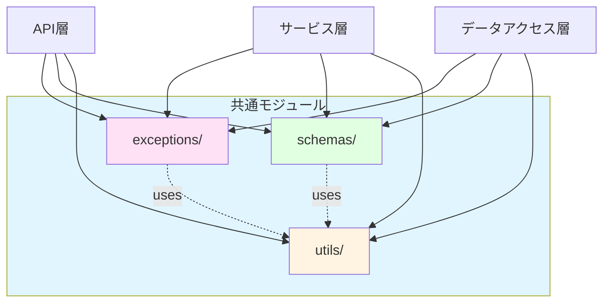
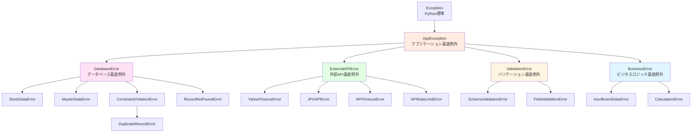
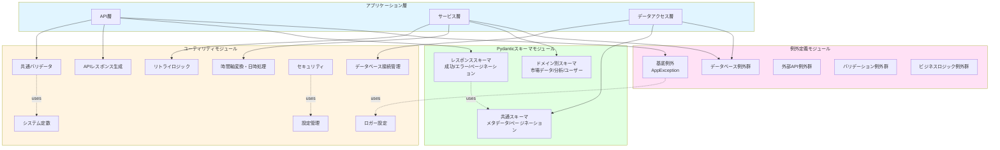
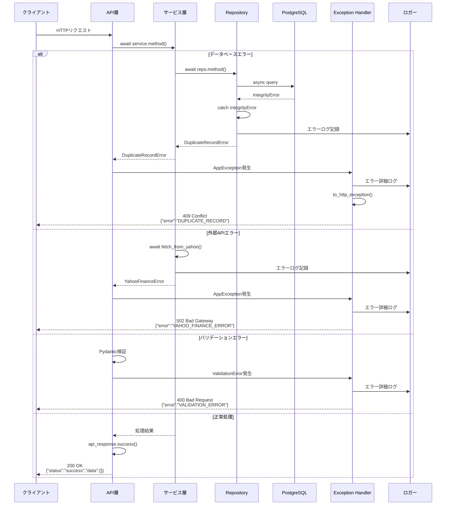
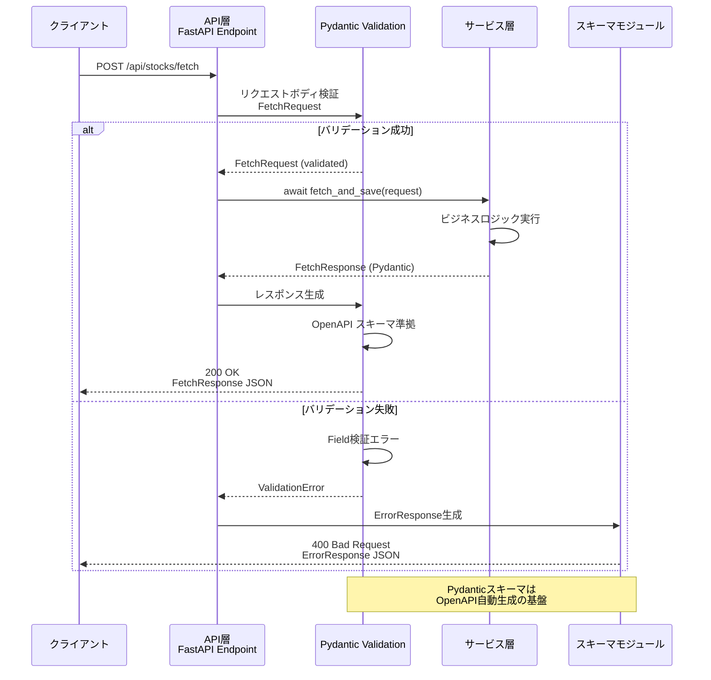

category: architecture
ai_context: high
last_updated: 2025-11-16
related_docs:
  - ../architecture_overview.md
  - ./api_layer.md
  - ./service_layer.md
  - ./data_access_layer.md

# 共通モジュール 仕様書

## 目次

- [1. 概要](#1-概要)
- [2. 構成](#2-構成)
- [3. 例外定義モジュール](#3-例外定義モジュール)
- [4. Pydanticスキーマモジュール](#4-pydanticスキーマモジュール)
- [5. ユーティリティモジュール](#5-ユーティリティモジュール)
- [6. アーキテクチャ図](#6-アーキテクチャ図)
- [7. 設計原則と利用ガイドライン](#7-設計原則と利用ガイドライン)

---

## 1. 概要

### 役割

共通モジュールは、**全レイヤーで共有される型定義、例外クラス、ユーティリティ関数**を提供します。DRY原則に基づき、重複コードを排除し、一貫性のある実装を支援します。

### 責務

| 責務                       | 説明                                                                   |
| -------------------------- | ---------------------------------------------------------------------- |
| **型定義の統一**           | Pydanticモデルによるリクエスト/レスポンススキーマの標準化               |
| **例外階層の提供**         | カスタム例外クラスによる統一されたエラーハンドリング                   |
| **共通処理の抽象化**       | ロガー、バリデータ、時間軸変換などの横断的機能の提供                   |
| **API応答の標準化**        | 成功/エラーレスポンスの一貫した形式の保証                             |
| **OpenAPI自動生成の支援**  | Pydanticスキーマからのドキュメント自動生成                             |
| **型安全性の保証**         | 実行時型検証によるバグの早期発見                                       |

### 設計原則

| 原則                   | 説明                                       | 実装例                                                     |
| ---------------------- | ------------------------------------------ | ---------------------------------------------------------- |
| **DRY原則**            | 重複コードを排除し、共通化を徹底           | 共通バリデータ、エラーハンドラの再利用                     |
| **型安全性**           | Pydanticによる実行時型検証                 | 全データモデルにPydantic BaseModel使用                     |
| **単一責任の原則**     | 各モジュールは明確な責務を持つ             | 例外定義、型定義、ユーティリティを明確に分離               |
| **疎結合**             | モジュール間の依存を最小限に               | 各モジュールが独立して機能                                 |
| **拡張性**             | 新機能追加が容易な構成                     | ベースクラスの継承による拡張                               |
| **一貫性**             | 全レイヤーで統一された規約                 | 統一されたレスポンス形式、エラーメッセージフォーマット     |
| **層を超えた再利用**   | 横断的関心事は共通モジュールで提供         | 認証、レート制限、バリデーションをAPI層以外でも利用可能    |

### 共通モジュールの配置基準

各機能を共通モジュールに配置するか、各層に配置するかは以下の基準で判断します:

| 配置先           | 判断基準                                                 | 例                                                   |
| ---------------- | -------------------------------------------------------- | ---------------------------------------------------- |
| **共通モジュール** | 複数の層で使用される横断的関心事                         | 認証、DB接続、レート制限、バリデーション、例外       |
| **各層**         | 特定の層でのみ使用される機能                             | API層のサービス依存性注入、サービス層のビジネスロジック |

**共通モジュールに配置される機能**:
- **認証・認可** (`app/utils/security.py`): API層、WebSocket、CLI、バックグラウンドジョブで使用
- **データベース接続** (`app/utils/database.py`): 全層でDB接続が必要
- **レート制限** (`app/utils/rate_limiter.py`): API層、WebSocketハンドラで使用
- **バリデーション** (`app/utils/validators.py`): API層、サービス層で使用
- **エラーハンドリング** (`app/exceptions/`): 全層で統一されたエラー処理

**各層に配置される機能**:
- **サービス依存性注入** (`app/api/dependencies/services.py`): API層でのみ使用（FastAPI固有）

---

## 2. 構成

### ディレクトリ構造

```
app/
├── exceptions/                  # 例外定義モジュール
│   ├── __init__.py
│   ├── base.py                  # 基底例外クラス
│   ├── database.py              # データベース関連例外
│   ├── external_api.py          # 外部API関連例外
│   ├── validation.py            # バリデーション関連例外
│   ├── business.py              # ビジネスロジック関連例外
│   └── handlers.py              # FastAPI例外ハンドラ
│
├── schemas/                     # Pydanticスキーマモジュール
│   ├── __init__.py
│   ├── common.py                # 共通スキーマ（メタデータ、ページネーション等）
│   ├── responses.py             # 共通レスポンススキーマ
│   ├── market_data/             # 市場データドメインスキーマ
│   │   ├── __init__.py
│   │   ├── stock_price.py       # 株価データスキーマ
│   │   ├── stock_master.py      # 銘柄マスタスキーマ
│   │   ├── fundamentals.py      # ファンダメンタルデータスキーマ
│   │   └── indices.py           # インデックススキーマ
│   ├── batch.py                 # バッチ処理スキーマ
│   ├── analysis/                # 分析ドメインスキーマ
│   │   ├── __init__.py
│   │   ├── screening.py
│   │   └── backtest.py
│   ├── user/                    # ユーザードメインスキーマ
│   │   ├── __init__.py
│   │   ├── auth.py
│   │   ├── profile.py
│   │   ├── settings.py
│   │   └── portfolio.py
│   └── notification.py          # 通知スキーマ
│
└── utils/                       # ユーティリティモジュール
    ├── __init__.py
    ├── logger.py                # ロガー設定
    ├── time_utils.py            # 時間軸変換・日時処理
    ├── api_response.py          # API レスポンス生成ヘルパー
    ├── validators.py            # 共通バリデータ
    ├── database.py              # データベース接続管理 + 依存性注入
    ├── config.py                # 設定管理
    ├── security.py              # セキュリティユーティリティ + 認証依存性
    ├── retry.py                 # リトライロジック
    ├── rate_limiter.py          # レート制限デコレータ + RateLimiterクラス
    └── constants.py             # システム定数
```

### モジュール間依存関係



---

## 3. 例外定義モジュール

### 3.1 例外階層



### 3.2 基底例外クラス

**AppException（全例外の基底クラス）**:

| 属性             | 型                  | 説明                               |
| ---------------- | ------------------- | ---------------------------------- |
| `message`        | str                 | エラーメッセージ                   |
| `error_code`     | str                 | エラーコード（例: "DB_001"）       |
| `status_code`    | int                 | HTTPステータスコード（デフォルト: 500）|
| `details`        | Optional[dict]      | エラー詳細情報                     |
| `original_error` | Optional[Exception] | 元の例外オブジェクト               |

**主要メソッド**:

| メソッド                | 説明                                       |
| ----------------------- | ------------------------------------------ |
| `to_dict()`             | 例外を辞書形式に変換（API レスポンス用）   |
| `to_http_exception()`   | FastAPI HTTPException に変換               |

### 3.3 例外カテゴリ別詳細

#### データベース関連例外（`app/exceptions/database.py`）

| 例外クラス                 | HTTPステータス | エラーコード         | 用途                       |
| -------------------------- | -------------- | -------------------- | -------------------------- |
| `DatabaseError`            | 500            | `DB_ERROR`           | データベース基底エラー     |
| `StockDataError`           | 500            | `STOCK_DATA_ERROR`   | 株価データ操作エラー       |
| `MasterDataError`          | 500            | `MASTER_DATA_ERROR`  | 銘柄マスタ操作エラー       |
| `ConstraintViolationError` | 400            | `CONSTRAINT_VIOLATION` | 制約違反エラー           |
| `DuplicateRecordError`     | 409            | `DUPLICATE_RECORD`   | UNIQUE制約違反             |
| `RecordNotFoundError`      | 404            | `RECORD_NOT_FOUND`   | レコード未検出             |

#### 外部API関連例外（`app/exceptions/external_api.py`）

| 例外クラス          | HTTPステータス | エラーコード          | 用途                       |
| ------------------- | -------------- | --------------------- | -------------------------- |
| `ExternalAPIError`  | 502            | `EXTERNAL_API_ERROR`  | 外部API基底エラー          |
| `YahooFinanceError` | 502            | `YAHOO_FINANCE_ERROR` | Yahoo Finance API エラー   |
| `JPXAPIError`       | 502            | `JPX_API_ERROR`       | JPX API エラー             |
| `APITimeoutError`   | 504            | `API_TIMEOUT`         | APIタイムアウト            |
| `APIRateLimitError` | 429            | `API_RATE_LIMIT`      | APIレート制限超過          |

#### バリデーション関連例外（`app/exceptions/validation.py`）

| 例外クラス              | HTTPステータス | エラーコード             | 用途                       |
| ----------------------- | -------------- | ------------------------ | -------------------------- |
| `ValidationError`       | 400            | `VALIDATION_ERROR`       | バリデーション基底エラー   |
| `SchemaValidationError` | 400            | `SCHEMA_VALIDATION_ERROR`| Pydanticスキーマ検証エラー |
| `FieldValidationError`  | 400            | `FIELD_VALIDATION_ERROR` | 特定フィールド検証エラー   |

#### ビジネスロジック関連例外（`app/exceptions/business.py`）

| 例外クラス             | HTTPステータス | エラーコード            | 用途                       |
| ---------------------- | -------------- | ----------------------- | -------------------------- |
| `BusinessError`        | 400            | `BUSINESS_ERROR`        | ビジネスロジック基底エラー |
| `InsufficientDataError`| 422            | `INSUFFICIENT_DATA`     | データ不足エラー           |
| `CalculationError`     | 500            | `CALCULATION_ERROR`     | 計算処理エラー             |

### 3.4 FastAPI例外ハンドラ（`app/exceptions/handlers.py`）

**登録される例外ハンドラ**:

| 例外タイプ         | ハンドラ関数                    | 処理内容                                       |
| ------------------ | ------------------------------- | ---------------------------------------------- |
| `AppException`     | `app_exception_handler`         | カスタム例外を統一フォーマットでレスポンス     |
| `HTTPException`    | `http_exception_handler`        | FastAPI標準例外をカスタムフォーマットで返却    |
| `RequestValidationError` | `validation_exception_handler` | Pydantic検証エラーを詳細情報付きで返却        |
| `Exception`        | `general_exception_handler`     | 予期しないエラーをログ記録しエラーレスポンス   |

**統一エラーレスポンス形式**:

```json
{
  "error": "ERROR_CODE",
  "message": "エラーメッセージ",
  "details": {
    "field": "symbol",
    "value": "invalid_value",
    "constraint": "銘柄コードは4桁の数字.Tの形式である必要があります"
  },
  "meta": {
    "timestamp": "2025-11-16T10:00:00Z",
    "request_id": "req-123456"
  }
}
```

---

## 4. Pydanticスキーマモジュール

### 4.1 共通スキーマ（`app/schemas/common.py`）

**メタデータスキーマ**:

| フィールド   | 型   | 説明                           |
| ------------ | ---- | ------------------------------ |
| `timestamp`  | str  | レスポンス生成日時（ISO 8601） |
| `request_id` | str  | リクエストID（トレーサビリティ）|

**ページネーション情報スキーマ**:

| フィールド | 型   | 説明                               |
| ---------- | ---- | ---------------------------------- |
| `total`    | int  | 総件数                             |
| `limit`    | int  | 1ページあたりの件数                |
| `offset`   | int  | オフセット                         |
| `has_next` | bool | 次ページの有無                     |

**時間軸Enum**:

| 値   | 説明     |
| ---- | -------- |
| `1m` | 1分足    |
| `5m` | 5分足    |
| `15m`| 15分足   |
| `30m`| 30分足   |
| `1h` | 1時間足  |
| `1d` | 日足     |
| `1wk`| 週足     |
| `1mo`| 月足     |

### 4.2 共通レスポンススキーマ（`app/schemas/responses.py`）

**成功レスポンス（汎用）**:

| フィールド | 型                  | 説明                   |
| ---------- | ------------------- | ---------------------- |
| `status`   | str                 | "success"固定          |
| `message`  | str                 | 処理結果メッセージ     |
| `data`     | T (Generic)         | レスポンスデータ       |
| `meta`     | Optional[MetaData]  | メタ情報               |

**ページネーション対応レスポンス**:

| フィールド   | 型                       | 説明               |
| ------------ | ------------------------ | ------------------ |
| `status`     | str                      | "success"固定      |
| `message`    | str                      | 処理結果メッセージ |
| `data`       | List[T] (Generic)        | データリスト       |
| `meta`       | PaginatedMetaData        | ページネーション情報|

**エラーレスポンス**:

| フィールド | 型             | 説明               |
| ---------- | -------------- | ------------------ |
| `error`    | str            | エラーコード       |
| `message`  | str            | エラーメッセージ   |
| `details`  | Optional[dict] | エラー詳細情報     |
| `meta`     | MetaData       | メタ情報           |

### 4.3 ドメイン別スキーマ構成

#### 市場データドメイン（`app/schemas/market_data/`）

**株価データスキーマ（`stock_price.py`）**:

| スキーマ名          | 用途                       | 主要フィールド                                 |
| ------------------- | -------------------------- | ---------------------------------------------- |
| `FetchRequest`      | 株価データ取得リクエスト   | symbol, interval, period                       |
| `StockData`         | 株価データ単体             | symbol, date/datetime, open, high, low, close, volume |
| `FetchResponse`     | 株価データ取得レスポンス   | symbol, interval, records_count, data          |
| `ChartDataRequest`  | チャートデータリクエスト   | symbol, interval, start_date, end_date         |
| `ChartDataResponse` | チャートデータレスポンス   | symbol, interval, chart_data                   |

**銘柄マスタスキーマ（`stock_master.py`）**:

| スキーマ名           | 用途                       | 主要フィールド                                 |
| -------------------- | -------------------------- | ---------------------------------------------- |
| `StockMaster`        | 銘柄マスタデータ           | symbol, company_name, market, sector, is_active|
| `StockMasterList`    | 銘柄マスタリスト           | stocks (List[StockMaster])                     |
| `UpdateResult`       | 更新結果                   | added_count, updated_count, deleted_count      |
| `StockSearchRequest` | 銘柄検索リクエスト         | query, market_category, is_active              |

#### バッチ処理スキーマ（`app/schemas/batch.py`）

| スキーマ名         | 用途                       | 主要フィールド                                 |
| ------------------ | -------------------------- | ---------------------------------------------- |
| `BatchRequest`     | バッチリクエスト           | symbols, interval, period, max_workers         |
| `BatchResponse`    | バッチレスポンス           | job_id, batch_db_id, status, total_symbols     |
| `BatchSummary`     | バッチサマリ               | total, successful, failed, duration_seconds    |
| `ProgressInfo`     | 進捗情報                   | total, processed, successful, failed, eta_seconds |

#### 分析ドメイン（`app/schemas/analysis/`）

**スクリーニングスキーマ（`screening.py`）**:

| スキーマ名             | 用途                       | 主要フィールド                                 |
| ---------------------- | -------------------------- | ---------------------------------------------- |
| `FilterCondition`      | フィルタ条件               | field, operator, value                         |
| `ScreeningRequest`     | スクリーニングリクエスト   | conditions, logic (AND/OR), sort_by, order     |
| `ScreeningResult`      | スクリーニング結果         | result_id, matched_count, results              |

**バックテストスキーマ（`backtest.py`）**:

| スキーマ名            | 用途                       | 主要フィールド                                 |
| --------------------- | -------------------------- | ---------------------------------------------- |
| `BacktestRequest`     | バックテストリクエスト     | symbol, strategy, start_date, end_date, initial_capital |
| `BacktestResult`      | バックテスト結果           | job_id, total_return, sharpe_ratio, max_drawdown |
| `PerformanceMetrics`  | パフォーマンス指標         | win_rate, avg_profit, avg_loss                 |

#### ユーザードメイン（`app/schemas/user/`）

**認証スキーマ（`auth.py`）**:

| スキーマ名        | 用途                       | 主要フィールド                                 |
| ----------------- | -------------------------- | ---------------------------------------------- |
| `LoginRequest`    | ログインリクエスト         | email, password                                |
| `LoginResponse`   | ログインレスポンス         | access_token, refresh_token, token_type, user  |
| `RegisterRequest` | 登録リクエスト             | email, password, display_name                  |
| `TokenPayload`    | JWTペイロード              | user_id, email, role, exp                      |

---

## 5. ユーティリティモジュール

### 5.1 ロガー設定（`app/utils/logger.py`）

**機能**:
- 統一されたログフォーマット設定
- ログレベルの環境変数による制御
- ファイル出力とコンソール出力の両対応
- リクエストIDによるトレーサビリティ確保

**ログレベル**:

| レベル   | 用途                           |
| -------- | ------------------------------ |
| DEBUG    | 開発環境でのデバッグ情報       |
| INFO     | 通常の処理フロー情報           |
| WARNING  | 警告（処理は継続）             |
| ERROR    | エラー（処理失敗）             |
| CRITICAL | クリティカルエラー（システム停止）|

**ログフォーマット**:
```
[2025-11-16 10:00:00] [INFO] [req-123456] [app.services.stock_price] 株価データ取得開始: symbol=7203.T
```

### 5.2 時間軸変換・日時処理（`app/utils/time_utils.py`）

**主要関数**:

| 関数名                        | 引数                       | 戻り値         | 説明                               |
| ----------------------------- | -------------------------- | -------------- | ---------------------------------- |
| `convert_interval_to_model()` | interval: str              | Type[Model]    | 時間軸文字列からモデルクラスを取得 |
| `convert_model_to_interval()` | model: Type[Model]         | str            | モデルクラスから時間軸文字列を取得 |
| `get_table_name_for_interval()`| interval: str             | str            | 時間軸文字列からテーブル名を取得   |
| `parse_datetime()`            | datetime_str: str          | datetime       | ISO 8601文字列をdatetimeに変換     |
| `format_datetime()`           | dt: datetime               | str            | datetimeをISO 8601文字列に変換     |
| `get_market_open_hours()`     | -                          | Tuple[time, time]| 市場開場時間を取得（9:00-15:00）  |
| `is_trading_day()`            | date: date                 | bool           | 取引日判定（土日祝日除外）         |

**時間軸マッピング**:

| interval | モデルクラス | テーブル名  |
| -------- | ------------ | ----------- |
| `1m`     | Stocks1m     | stocks_1m   |
| `5m`     | Stocks5m     | stocks_5m   |
| `15m`    | Stocks15m    | stocks_15m  |
| `30m`    | Stocks30m    | stocks_30m  |
| `1h`     | Stocks1h     | stocks_1h   |
| `1d`     | Stocks1d     | stocks_1d   |
| `1wk`    | Stocks1wk    | stocks_1wk  |
| `1mo`    | Stocks1mo    | stocks_1mo  |

### 5.3 APIレスポンス生成ヘルパー（`app/utils/api_response.py`）

**主要関数**:

| 関数名       | 引数                                       | 戻り値 | 説明                               |
| ------------ | ------------------------------------------ | ------ | ---------------------------------- |
| `success()`  | data, message, meta                        | dict   | 成功レスポンス生成                 |
| `error()`    | error_code, message, details, status_code  | dict   | エラーレスポンス生成               |
| `paginated()`| data, total, limit, offset                 | dict   | ページネーション対応レスポンス生成 |

**使用例**:

成功レスポンス:
```python
return api_response.success(
    data={"stocks": stock_data},
    message="株価データを取得しました"
)
```

エラーレスポンス:
```python
return api_response.error(
    error_code="VALIDATION_ERROR",
    message="銘柄コードが不正です",
    details={"field": "symbol", "value": "invalid"},
    status_code=400
)
```

ページネーションレスポンス:
```python
return api_response.paginated(
    data=stock_list,
    total=1000,
    limit=100,
    offset=0
)
```

### 5.4 共通バリデータ（`app/utils/validators.py`）

**主要バリデータ関数**:

| 関数名                     | 引数                       | 戻り値                     | 説明                               |
| -------------------------- | -------------------------- | -------------------------- | ---------------------------------- |
| `validate_symbol()`        | symbol: str                | Tuple[bool, Optional[str]] | 銘柄コード検証（形式チェック）     |
| `validate_symbols()`       | symbols: List[str], max_count: int | Tuple[bool, Optional[HTTPException]] | 銘柄リスト検証（型・件数制限） |
| `validate_date_range()`    | start_date, end_date       | Tuple[bool, Optional[str]] | 日付範囲検証                       |
| `validate_interval()`      | interval: str              | Tuple[bool, Optional[HTTPException]] | 時間軸検証（妥当性チェック）       |
| `validate_pagination()`    | limit, offset, max_limit   | Tuple[int, int, Optional[HTTPException]]| ページネーションパラメータ検証  |
| `validate_email()`         | email: str                 | Tuple[bool, Optional[str]] | メールアドレス検証                 |
| `validate_password_strength()` | password: str          | Tuple[bool, Optional[str]] | パスワード強度検証                 |

**Note**: `validate_symbols()`, `validate_interval()`, `validate_pagination()` は、API層の `app/api/validators/common.py` から共通モジュールへ移動すべき関数です。これにより、API層以外（CLI、バックグラウンドジョブ等）でも再利用可能になります。

**検証ルール**:

銘柄コード:
- 形式: `{4桁数字}.T` または `{4桁数字}.JP`
- 例: `7203.T`, `9984.T`

日付範囲:
- start_date <= end_date
- 未来日付の禁止
- 最大範囲: 5年

時間軸:
- 許可値: `1m`, `5m`, `15m`, `30m`, `1h`, `1d`, `1wk`, `1mo`

ページネーション:
- limit: 1〜100（デフォルト: 100）
- offset: 0以上
- max_limit: システム全体の最大制限（デフォルト: 100）

### 5.5 データベース接続管理（`app/utils/database.py`）

**主要関数**:

| 関数名                      | 戻り値                  | 説明                               |
| --------------------------- | ----------------------- | ---------------------------------- |
| `get_database_url()`        | str                     | 環境変数からデータベースURL取得    |
| `create_async_engine()`     | AsyncEngine             | 非同期エンジン作成                 |
| `create_async_session_maker()` | async_sessionmaker   | 非同期セッションメーカー作成       |
| `get_db()`                  | AsyncGenerator[AsyncSession] | 非同期DBセッション提供（FastAPI依存性注入用）|

**接続プール設定**:

| パラメータ       | 値   | 説明                               |
| ---------------- | ---- | ---------------------------------- |
| `pool_size`      | 10   | 通常時に保持する接続数             |
| `max_overflow`   | 20   | 追加接続数                         |
| `pool_pre_ping`  | True | 接続使用前の有効性確認             |
| `pool_recycle`   | 3600 | 接続再利用最大秒数（1時間）        |
| `pool_timeout`   | 30   | 接続取得時の最大待機秒数           |

### 5.6 設定管理（`app/utils/config.py`）

**環境変数管理**:

| 設定項目             | 環境変数名          | デフォルト値       | 説明                       |
| -------------------- | ------------------- | ------------------ | -------------------------- |
| **データベース**     |                     |                    |                            |
| DB接続URL            | `DATABASE_URL`      | -                  | PostgreSQL接続URL          |
| DBユーザー           | `DB_USER`           | postgres           | データベースユーザー名     |
| DBパスワード         | `DB_PASSWORD`       | -                  | データベースパスワード     |
| **アプリケーション** |                     |                    |                            |
| 環境                 | `ENVIRONMENT`       | development        | 実行環境（dev/staging/prod）|
| デバッグモード       | `DEBUG`             | False              | デバッグモード有効化       |
| ログレベル           | `LOG_LEVEL`         | INFO               | ログ出力レベル             |
| **セキュリティ**     |                     |                    |                            |
| JWT秘密鍵            | `JWT_SECRET_KEY`    | -                  | JWT署名用秘密鍵            |
| JWT有効期限          | `JWT_EXPIRATION`    | 3600               | アクセストークン有効期限（秒）|
| APIキー              | `API_KEY`           | -                  | システム間連携用APIキー    |
| **外部API**          |                     |                    |                            |
| Yahoo Finance タイムアウト | `YAHOO_TIMEOUT` | 30                | Yahoo Finance API タイムアウト（秒）|
| リトライ回数         | `API_RETRY_COUNT`   | 3                  | 外部API呼び出しリトライ回数|

### 5.7 セキュリティユーティリティ（`app/utils/security.py`）

**主要関数**:

| 関数名                  | 引数                       | 戻り値 | 説明                               |
| ----------------------- | -------------------------- | ------ | ---------------------------------- |
| `hash_password()`       | password: str              | str    | パスワードハッシュ化（bcrypt）     |
| `verify_password()`     | plain_password, hashed     | bool   | パスワード検証                     |
| `create_access_token()` | data: dict, expires_delta  | str    | JWTアクセストークン生成            |
| `create_refresh_token()`| data: dict, expires_delta  | str    | JWTリフレッシュトークン生成        |
| `decode_token()`        | token: str                 | dict   | JWTトークンデコード                |
| `generate_request_id()` | -                          | str    | リクエストID生成（UUID4）          |

**セキュリティ設定**:

パスワードハッシュ:
- アルゴリズム: bcrypt
- コスト係数: 12

JWT:
- アルゴリズム: HS256
- アクセストークン有効期限: 1時間（デフォルト）
- リフレッシュトークン有効期限: 30日（デフォルト）

**FastAPI依存性注入関数**:

| 関数名               | 引数                       | 戻り値 | 説明                               |
| -------------------- | -------------------------- | ------ | ---------------------------------- |
| `verify_api_key()`   | x_api_key: str (Header)    | bool   | APIキー認証（システム間連携用）    |
| `get_current_user()` | token: str (Bearer)        | User   | JWT認証（ユーザー認証用）          |

**使用例**:

APIキー認証:
```python
from fastapi import Depends, Header
from app.utils.security import verify_api_key

@router.post("/api/batch/jobs")
async def start_batch(api_key: str = Depends(verify_api_key)):
    """APIキーで認証されたエンドポイント."""
    ...
```

JWT認証:
```python
from fastapi import Depends
from app.utils.security import get_current_user
from app.models import User

@router.get("/api/user/profile")
async def get_profile(current_user: User = Depends(get_current_user)):
    """JWTで認証されたエンドポイント."""
    ...
```

**Note**: これらの依存性注入関数は、API層の `app/api/dependencies/auth.py` から共通モジュールへ移動すべきです。これにより、API層以外でも認証ロジックを再利用可能になります。

### 5.8 レート制限（`app/utils/rate_limiter.py`）

**主要コンポーネント**:

| コンポーネント名 | 型                  | 説明                               |
| ---------------- | ------------------- | ---------------------------------- |
| `RateLimiter`    | Singleton クラス    | スレッドセーフなレート制限管理     |
| `rate_limit()`   | デコレータ関数      | FastAPIエンドポイント用レート制限  |

**RateLimiterクラス**:

| メソッド名       | 引数                                      | 戻り値 | 説明                               |
| ---------------- | ----------------------------------------- | ------ | ---------------------------------- |
| `is_allowed()`   | request, max_requests, window_seconds     | bool   | リクエスト許可判定                 |
| `_get_client_ip()` | request                                 | str    | クライアントIP取得                 |
| `_cleanup_old_entries()` | -                                 | None   | 古いエントリのクリーンアップ       |

**rate_limitデコレータ**:

| パラメータ       | デフォルト値 | 説明                               |
| ---------------- | ------------ | ---------------------------------- |
| `max_requests`   | 10           | ウィンドウ内の最大リクエスト数     |
| `window_seconds` | 60           | レート制限ウィンドウ（秒）         |

**使用例**:

```python
from app.utils.rate_limiter import rate_limit
from fastapi import APIRouter

router = APIRouter()

@router.post("/api/batch/jobs")
@rate_limit(max_requests=10, window_seconds=60)
async def start_batch_fetch(...):
    """一括データ取得開始（10リクエスト/60秒）."""
    ...
```

**レート制限超過時の動作**:
- HTTPステータスコード: 429 Too Many Requests
- エラーレスポンス: `{"error": "RATE_LIMIT_EXCEEDED", "message": "リクエスト制限を超過しました"}`
- Retry-Afterヘッダー: 待機すべき秒数を返却

**Note**: このモジュールは、API層の `app/api/decorators/rate_limit.py` から共通モジュールへ移動すべきです。これにより、API層以外（WebSocketハンドラ、バックグラウンドジョブ等）でも再利用可能になります。

### 5.9 リトライロジック（`app/utils/retry.py`）

**主要デコレータ**:

| デコレータ名          | 引数                                   | 説明                               |
| --------------------- | -------------------------------------- | ---------------------------------- |
| `@retry_on_error`     | max_retries, delay, backoff_factor     | 例外発生時の自動リトライ           |
| `@retry_async`        | max_retries, delay, backoff_factor     | 非同期関数用リトライ               |

**リトライ設定**:

| パラメータ       | デフォルト値 | 説明                               |
| ---------------- | ------------ | ---------------------------------- |
| `max_retries`    | 3            | 最大リトライ回数                   |
| `delay`          | 1.0          | 初回リトライ待機秒数               |
| `backoff_factor` | 2.0          | 指数バックオフ係数                 |

**リトライ対象例外**:
- `APITimeoutError`
- `ExternalAPIError`
- `DatabaseError`（接続エラーのみ）

### 5.9 システム定数（`app/utils/constants.py`）

**株価データ関連定数**:

| 定数名                     | 値       | 説明                               |
| -------------------------- | -------- | ---------------------------------- |
| `SUPPORTED_INTERVALS`      | List[str]| サポートされる時間軸               |
| `DEFAULT_PERIOD`           | "1mo"    | デフォルト取得期間                 |
| `MAX_BATCH_SYMBOLS`        | 5000     | 一括処理最大銘柄数                 |
| `MAX_WORKERS`              | 10       | 並列処理最大ワーカー数             |

**API関連定数**:

| 定数名                     | 値       | 説明                               |
| -------------------------- | -------- | ---------------------------------- |
| `DEFAULT_PAGINATION_LIMIT` | 100      | デフォルトページサイズ             |
| `MAX_PAGINATION_LIMIT`     | 100      | 最大ページサイズ                   |
| `RATE_LIMIT_REQUESTS`      | 10       | レート制限リクエスト数             |
| `RATE_LIMIT_WINDOW`        | 60       | レート制限ウィンドウ（秒）         |

**ビジネスロジック定数**:

| 定数名                     | 値       | 説明                               |
| -------------------------- | -------- | ---------------------------------- |
| `MARKET_OPEN_TIME`         | "09:00"  | 市場開始時刻                       |
| `MARKET_CLOSE_TIME`        | "15:00"  | 市場終了時刻                       |
| `TRADING_DAYS`             | List[int]| 取引曜日（月〜金: 0-4）            |

---

## 6. アーキテクチャ図

### 6.1 共通モジュール全体構成



### 6.2 エラーハンドリングフロー



### 6.3 Pydanticスキーマ連携フロー



---

## 7. 設計原則と利用ガイドライン

### 7.1 例外処理のベストプラクティス

**原則1: 適切な例外クラスを選択**

```python
# ❌ 悪い例: 汎用的すぎる
raise Exception("データが見つかりません")

# ✅ 良い例: 具体的な例外クラス
raise RecordNotFoundError(
    message=f"銘柄データが見つかりません: {symbol}",
    details={"symbol": symbol, "date": target_date}
)
```

**原則2: 元の例外を保持**

```python
# ✅ 良い例: 元の例外を記録
try:
    result = await repo.create(symbol="7203.T", ...)
except IntegrityError as e:
    raise DuplicateRecordError(
        message="銘柄データが既に存在します",
        original_error=e,  # 元の例外を保持
        details={"symbol": "7203.T"}
    )
```

**原則3: ログ記録を徹底**

```python
from app.utils.logger import get_logger

logger = get_logger(__name__)

try:
    data = await fetch_stock_data(symbol)
except YahooFinanceError as e:
    logger.error(
        f"Yahoo Finance API エラー: {e.message}",
        extra={"symbol": symbol, "error_code": e.error_code}
    )
    raise
```

### 7.2 Pydanticスキーマのベストプラクティス

**原則1: 型ヒントを明示**

```python
from pydantic import BaseModel, Field
from typing import Optional
from datetime import date

class FetchRequest(BaseModel):
    """株価データ取得リクエスト."""

    symbol: str = Field(..., description="銘柄コード", example="7203.T")
    interval: str = Field(..., description="時間軸", example="1d")
    start_date: Optional[date] = Field(None, description="開始日")
    end_date: Optional[date] = Field(None, description="終了日")
```

**原則2: バリデータを活用**

```python
from pydantic import BaseModel, validator

class FetchRequest(BaseModel):
    symbol: str
    interval: str

    @validator("symbol")
    def validate_symbol(cls, v):
        """銘柄コード検証."""
        if not re.match(r"^\d{4}\.(T|JP)$", v):
            raise ValueError("銘柄コードは4桁の数字.Tの形式である必要があります")
        return v

    @validator("interval")
    def validate_interval(cls, v):
        """時間軸検証."""
        if v not in SUPPORTED_INTERVALS:
            raise ValueError(f"サポートされていない時間軸です: {v}")
        return v
```

**原則3: OpenAPI ドキュメント対応**

```python
from pydantic import BaseModel, Field

class StockData(BaseModel):
    """株価データ."""

    class Config:
        json_schema_extra = {
            "example": {
                "symbol": "7203.T",
                "date": "2025-11-16",
                "open": 1500.0,
                "high": 1520.0,
                "low": 1495.0,
                "close": 1510.0,
                "volume": 1000000
            }
        }

    symbol: str = Field(..., description="銘柄コード")
    date: date = Field(..., description="データ日付")
    open: float = Field(..., ge=0, description="始値")
    high: float = Field(..., ge=0, description="高値")
    low: float = Field(..., ge=0, description="安値")
    close: float = Field(..., ge=0, description="終値")
    volume: int = Field(..., ge=0, description="出来高")
```

### 7.3 ユーティリティ関数のベストプラクティス

**原則1: 単一責任の原則を守る**

```python
# ✅ 良い例: 1つの関数が1つの責務
def validate_symbol(symbol: str) -> Tuple[bool, Optional[str]]:
    """銘柄コード検証のみ."""
    if not re.match(r"^\d{4}\.(T|JP)$", symbol):
        return False, "銘柄コードの形式が不正です"
    return True, None

def validate_interval(interval: str) -> Tuple[bool, Optional[str]]:
    """時間軸検証のみ."""
    if interval not in SUPPORTED_INTERVALS:
        return False, f"サポートされていない時間軸です: {interval}"
    return True, None
```

**原則2: 型ヒントを必ず付与**

```python
from typing import Optional, Tuple
from datetime import datetime

def parse_datetime(datetime_str: str) -> datetime:
    """ISO 8601文字列をdatetimeに変換.

    Args:
        datetime_str: ISO 8601形式の日時文字列

    Returns:
        datetime: パース済みdatetimeオブジェクト

    Raises:
        ValueError: 不正な日時文字列
    """
    try:
        return datetime.fromisoformat(datetime_str)
    except ValueError as e:
        raise ValueError(f"不正な日時形式です: {datetime_str}") from e
```

**原則3: テスタビリティを確保**

```python
# ✅ 良い例: 純粋関数（副作用なし）
def convert_interval_to_table_name(interval: str) -> str:
    """時間軸文字列からテーブル名を取得.

    Args:
        interval: 時間軸（例: "1d"）

    Returns:
        str: テーブル名（例: "stocks_1d"）
    """
    return INTERVAL_TABLE_MAPPING.get(interval, "stocks_1d")
```

### 7.4 共通モジュール利用時の注意点

**1. 循環参照の回避**

```python
# ❌ 悪い例: 循環参照が発生
# app/schemas/stock.py
from app.services.stock_service import StockService  # 循環参照

# ✅ 良い例: 型ヒントはTYPE_CHECKINGで分離
from typing import TYPE_CHECKING

if TYPE_CHECKING:
    from app.services.stock_service import StockService
```

**2. 例外の過度なネスト回避**

```python
# ❌ 悪い例: 例外の再ラップが多すぎる
try:
    data = await fetch_data()
except YahooFinanceError as e:
    raise ExternalAPIError(...) from e  # 必要以上の変換

# ✅ 良い例: 適切なレベルで例外を処理
try:
    data = await fetch_data()
except YahooFinanceError:
    # Yahoo Finance固有のエラーなので、そのまま伝播
    raise
```

**3. ユーティリティ関数の適切な配置**

- ドメイン固有のロジック → サービス層
- 汎用的な処理 → ユーティリティモジュール

```python
# ❌ 悪い例: ビジネスロジックをユーティリティに配置
# app/utils/stock_utils.py
def calculate_portfolio_value(holdings, current_prices):
    """ポートフォリオ評価額計算（ビジネスロジック）"""
    # これはユーティリティではなくサービス層に配置すべき

# ✅ 良い例: 汎用的な処理のみユーティリティに配置
# app/utils/time_utils.py
def is_trading_day(target_date: date) -> bool:
    """取引日判定（汎用的な処理）"""
    return target_date.weekday() < 5 and not is_holiday(target_date)
```

---

## 関連ドキュメント

- [アーキテクチャ概要](../architecture_overview.md)
- [API層仕様書](./api_layer.md)
- [サービス層仕様書](./service_layer.md)
- [データアクセス層仕様書](./data_access_layer.md)

---

## 8. 利用ガイドライン

### 8.1 共通モジュールの利用原則

共通モジュールは以下の原則に従って利用してください:

| 原則                       | 説明                                                     | 例                                                   |
| -------------------------- | -------------------------------------------------------- | ---------------------------------------------------- |
| **横断的関心事の集約**     | 複数の層で使用する機能は共通モジュールに配置             | 認証、バリデーション、エラーハンドリング             |
| **明示的なインポート**     | 使用する機能を明示的にインポート                         | `from app.utils.security import verify_api_key`      |
| **型安全性の活用**         | Pydanticスキーマ、TypedDictを積極的に使用                | リクエスト/レスポンススキーマの定義                  |
| **例外階層の活用**         | カスタム例外クラスを使用し、適切なエラーハンドリング     | `raise RecordNotFoundError(...)`                     |
| **依存性注入の活用**       | FastAPIの`Depends()`パターンで疎結合を実現               | `db: AsyncSession = Depends(get_db)`                 |

### 8.2 レイヤー別利用パターン

#### API層での利用

```python
# 認証・認可
from app.utils.security import verify_api_key, get_current_user

# データベース接続
from app.utils.database import get_db

# レート制限
from app.utils.rate_limiter import rate_limit

# バリデーション
from app.utils.validators import validate_symbols, validate_pagination

# レスポンス生成
from app.utils.api_response import success, error, paginated

# スキーマ
from app.schemas.responses import SuccessResponse, ErrorResponse
from app.schemas.market_data.stock_price import FetchRequest, FetchResponse

# 例外
from app.exceptions.validation import ValidationError
from app.exceptions.database import RecordNotFoundError
```

#### サービス層での利用

```python
# 例外
from app.exceptions.external_api import YahooFinanceError
from app.exceptions.business import InsufficientDataError

# ユーティリティ
from app.utils.time_utils import convert_interval_to_model
from app.utils.retry import retry_async
from app.utils.logger import get_logger

# スキーマ
from app.schemas.market_data.stock_price import StockData
```

#### データアクセス層での利用

```python
# 例外
from app.exceptions.database import DuplicateRecordError, RecordNotFoundError

# ユーティリティ
from app.utils.logger import get_logger
from app.utils.time_utils import get_table_name_for_interval

# スキーマ
from app.schemas.common import PaginationMeta
```

### 8.3 実装時の注意点

#### 避けるべきパターン

❌ **循環参照**:
```python
# app/schemas/stock.py
from app.services.stock_service import StockService  # NG: 循環参照
```

✅ **正しいパターン**:
```python
# app/schemas/stock.py
from typing import TYPE_CHECKING

if TYPE_CHECKING:
    from app.services.stock_service import StockService
```

❌ **層を超えた依存**:
```python
# app/utils/validators.py
from app.services.stock_service import StockService  # NG: utilsはサービス層に依存しない
```

✅ **正しいパターン**:
```python
# app/api/stock_data.py
from app.utils.validators import validate_symbols
from app.api.dependencies.services import get_stock_service

@router.post("/api/stocks")
async def create_stock(
    request: StockRequest,
    stock_service: StockService = Depends(get_stock_service)
):
    is_valid, error = validate_symbols(request.symbols)
    if not is_valid:
        raise error

    result = await stock_service.process(request.symbols)
    return result
```

### 8.4 期待される効果

共通モジュールを正しく活用することで、以下の効果が得られます:

| 効果                     | 説明                                                     | 指標                                   |
| ------------------------ | -------------------------------------------------------- | -------------------------------------- |
| **コード重複削減**       | 同一ロジックを複数箇所で実装する必要がなくなる           | 重複コード率: 目標 < 5%                |
| **保守性向上**           | 変更箇所が1箇所に集約され、バグ修正が容易になる          | バグ修正時間: 従来比 -50%              |
| **再利用性向上**         | API層以外（WebSocket、CLI、ジョブ）でも使用可能         | 共通コード再利用率: 目標 > 80%         |
| **一貫性保証**           | 全レイヤーで統一された動作を保証                         | エラーメッセージ形式の統一率: 100%     |
| **テスタビリティ向上**   | 独立したモジュールとして単体テストが容易                 | テストカバレッジ: 目標 > 90%           |
| **開発速度向上**         | 既存の共通モジュールを活用し、新機能開発を加速           | 新機能開発時間: 従来比 -30%            |

---

**最終更新**: 2025-11-16
**設計方針**: DRY原則 + 型安全性 + 一貫性による保守性の向上
**アーキテクチャ**: 横断的関心事の共通化により、薄いAPI層とクリーンなサービス層を実現
