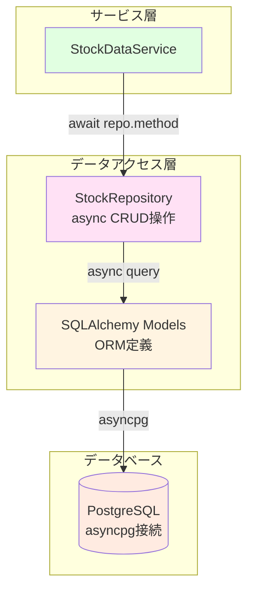
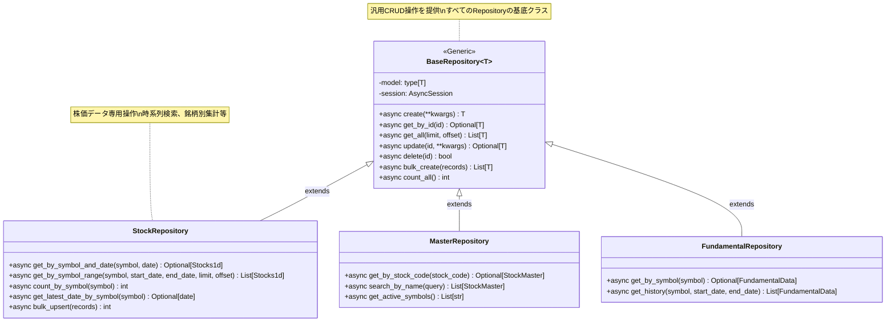
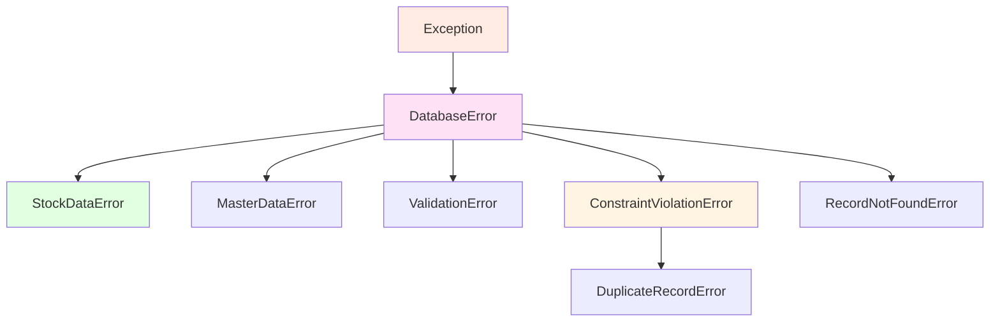

category: architecture
ai_context: high
last_updated: 2025-11-16
related_docs:
  - ../architecture_overview.md
  - ./service_layer.md
  - ./api_layer.md
  - ../database_design.md

# データアクセス層 仕様書

## 目次

- [1. 概要](#1-概要)
- [2. 構成](#2-構成)
- [3. Repositoryパターン設計](#3-repositoryパターン設計)
- [4. モデル定義](#4-モデル定義)
- [5. データベース接続管理](#5-データベース接続管理)
- [6. アーキテクチャ図](#6-アーキテクチャ図)
- [7. トランザクション管理](#7-トランザクション管理)
- [8. エラーハンドリング](#8-エラーハンドリング)

---

## 1. 概要

### 役割

データアクセス層は、**SQLAlchemyを使用してデータベーススキーマとPythonオブジェクトをマッピングし、データの永続化を担当**します。Repository Patternを採用することで、サービス層からデータベース実装詳細を隠蔽し、テスタビリティを向上させます。

### 責務

| 責務                     | 説明                                                                         |
| ------------------------ | ---------------------------------------------------------------------------- |
| **非同期ORM定義**        | SQLAlchemy async対応によるテーブル定義とマッピング                          |
| **Repository実装**       | 株価データ、銘柄マスタ、バッチ履歴等のデータアクセス抽象化                   |
| **制約定義**             | ユニーク制約、チェック制約、インデックスの設定                               |
| **非同期CRUD操作**       | asyncpg経由での非同期データベース操作（Create/Read/Update/Delete）           |
| **セッション管理**       | 非同期データベース接続のライフサイクル管理                                   |
| **型安全なデータ変換**   | データベース型⇔Python型⇔Pydanticモデルの相互変換                            |
| **クエリ最適化**         | インデックス設計とクエリパフォーマンスの最適化                               |

### 設計原則

- **Repository Pattern**: データアクセスロジックをRepositoryに集約し、サービス層からDB詳細を隠蔽
- **非同期ファースト**: 全データベース操作でasync/await使用、asyncpgドライバ採用
- **型安全性**: `Mapped`による型ヒント、Pydanticモデルとの連携
- **整合性保証**: データベース制約による不正データの防止
- **依存性注入**: FastAPIのDependsパターンでRepository提供
- **テスタビリティ**: Repositoryインターフェースによるモック注入の容易化

---

## 2. 構成

### ディレクトリ構造

```
app/
├── models/                        # SQLAlchemyモデル（ORM定義）
│   ├── __init__.py
│   ├── base.py                    # 基底クラス
│   ├── stock_data.py              # 株価データモデル（8種類の時間軸）
│   ├── stock_master.py            # 銘柄マスタモデル
│   ├── fundamental_data.py        # ファンダメンタルデータモデル
│   ├── batch.py                   # バッチ実行履歴モデル
│   ├── user.py                    # ユーザー管理モデル
│   ├── portfolio.py               # ポートフォリオモデル
│   ├── market_indices.py          # 市場インデックスモデル
│   ├── screening.py               # スクリーニングモデル
│   ├── backtest.py                # バックテストモデル
│   └── notification.py            # 通知モデル
│
└── repositories/                  # Repository実装
    ├── __init__.py
    ├── base.py                    # BaseRepository（汎用CRUD操作）
    ├── stock.py                   # StockRepository（株価データ専用）
    ├── master.py                  # MasterRepository（銘柄マスタ専用）
    ├── fundamental.py             # FundamentalRepository（財務データ専用）
    ├── user.py                    # UserRepository（ユーザー管理専用）
    ├── portfolio.py               # PortfolioRepository（ポートフォリオ専用）
    ├── indices.py                 # IndexRepository（インデックス専用）
    ├── screening.py               # ScreeningRepository（スクリーニング専用）
    ├── backtest.py                # BacktestRepository（バックテスト専用）
    └── notification.py            # NotificationRepository（通知専用）
```

### 責任分離

| 層                         | 責任                                           | 配置                 |
| -------------------------- | ---------------------------------------------- | -------------------- |
| **SQLAlchemyモデル層**     | テーブル定義、制約、インデックス               | `app/models/`        |
| **Repository層**           | 非同期CRUD操作、ビジネス固有クエリ、型変換     | `app/repositories/`  |
| **セッション管理層**       | 非同期DB接続、トランザクション制御             | FastAPI Dependencies |

---

## 3. Repositoryパターン設計

### 3.1 BaseRepository（汎用CRUD）

**目的**: すべてのRepositoryの基底クラスとして、共通のCRUD操作を提供

**主要メソッド**:

| メソッド                    | 説明                           | 戻り値型                     |
| --------------------------- | ------------------------------ | ---------------------------- |
| `async def create()`        | 新規レコード作成               | `T`（モデルインスタンス）    |
| `async def get_by_id()`     | ID検索                         | `Optional[T]`                |
| `async def get_all()`       | 全件取得（ページネーション対応）| `List[T]`                    |
| `async def update()`        | レコード更新                   | `Optional[T]`                |
| `async def delete()`        | レコード削除                   | `bool`                       |
| `async def bulk_create()`   | 一括作成                       | `List[T]`                    |
| `async def count_all()`     | 全件数取得                     | `int`                        |

**実装例**:

```python
from typing import TypeVar, Generic, List, Optional
from sqlalchemy.ext.asyncio import AsyncSession
from sqlalchemy import select, func

from app.models.base import Base

T = TypeVar('T', bound=Base)


class BaseRepository(Generic[T]):
    """Repository基底クラス（汎用CRUD操作提供）."""

    def __init__(self, model: type[T], session: AsyncSession):
        """初期化.

        Args:
            model: SQLAlchemyモデルクラス
            session: 非同期DBセッション
        """
        self.model = model
        self.session = session

    async def create(self, **kwargs) -> T:
        """新規レコード作成.

        Args:
            **kwargs: モデルのフィールド値

        Returns:
            作成されたモデルインスタンス
        """
        instance = self.model(**kwargs)
        self.session.add(instance)
        await self.session.flush()
        return instance

    async def get_by_id(self, record_id: int) -> Optional[T]:
        """ID検索.

        Args:
            record_id: レコードID

        Returns:
            モデルインスタンス、見つからない場合はNone
        """
        result = await self.session.execute(
            select(self.model).where(self.model.id == record_id)
        )
        return result.scalar_one_or_none()

    async def get_all(self, limit: int = 100, offset: int = 0) -> List[T]:
        """全件取得（ページネーション対応）.

        Args:
            limit: 取得件数（デフォルト: 100）
            offset: オフセット（デフォルト: 0）

        Returns:
            モデルインスタンスのリスト
        """
        result = await self.session.execute(
            select(self.model).limit(limit).offset(offset)
        )
        return list(result.scalars().all())

    async def count_all(self) -> int:
        """全件数取得.

        Returns:
            レコード数
        """
        result = await self.session.execute(
            select(func.count()).select_from(self.model)
        )
        return result.scalar_one()
```

### 3.2 StockRepository（株価データ専用）

**目的**: 株価データ特有のクエリ操作を提供（時系列検索、銘柄別集計等）

**主要メソッド**:

| メソッド                                | 説明                               | 戻り値型            |
| --------------------------------------- | ---------------------------------- | ------------------- |
| `async def get_by_symbol_and_date()`    | 銘柄コード+日付検索（日足以上用）   | `Optional[T]`       |
| `async def get_by_symbol_and_datetime()`| 銘柄コード+日時検索（分足・時間足用）| `Optional[T]`       |
| `async def get_by_symbol_range()`       | 銘柄コード+日付範囲検索             | `List[T]`           |
| `async def count_by_symbol()`           | 銘柄ごとのレコード数               | `int`               |
| `async def get_latest_date_by_symbol()` | 銘柄の最新日付取得                 | `Optional[date]`    |
| `async def bulk_upsert()`               | 一括UPSERT（重複時更新）           | `int`               |

**実装例**:

```python
from datetime import date, datetime
from typing import Optional, List
from sqlalchemy import select, func, and_
from sqlalchemy.dialects.postgresql import insert

from app.repositories.base import BaseRepository
from app.models.stock_data import Stocks1d


class StockRepository(BaseRepository[Stocks1d]):
    """株価データRepository（時系列データ専用操作提供）."""

    async def get_by_symbol_and_date(
        self,
        symbol: str,
        target_date: date
    ) -> Optional[Stocks1d]:
        """銘柄コード+日付検索（日足以上用）.

        Args:
            symbol: 銘柄コード（例: "7203.T"）
            target_date: 対象日付

        Returns:
            モデルインスタンス、見つからない場合はNone
        """
        result = await self.session.execute(
            select(self.model).where(
                and_(
                    self.model.symbol == symbol,
                    self.model.date == target_date
                )
            )
        )
        return result.scalar_one_or_none()

    async def get_by_symbol_range(
        self,
        symbol: str,
        start_date: Optional[date] = None,
        end_date: Optional[date] = None,
        limit: int = 100,
        offset: int = 0
    ) -> List[Stocks1d]:
        """銘柄コード+日付範囲検索.

        Args:
            symbol: 銘柄コード
            start_date: 開始日（省略可）
            end_date: 終了日（省略可）
            limit: 取得件数（デフォルト: 100）
            offset: オフセット（デフォルト: 0）

        Returns:
            モデルインスタンスのリスト
        """
        query = select(self.model).where(self.model.symbol == symbol)

        if start_date:
            query = query.where(self.model.date >= start_date)
        if end_date:
            query = query.where(self.model.date <= end_date)

        query = query.order_by(self.model.date.desc()).limit(limit).offset(offset)
        result = await self.session.execute(query)
        return list(result.scalars().all())

    async def bulk_upsert(self, records: List[dict]) -> int:
        """一括UPSERT（PostgreSQL専用）.

        Args:
            records: レコードのリスト（辞書形式）

        Returns:
            挿入・更新されたレコード数
        """
        stmt = insert(self.model).values(records)
        stmt = stmt.on_conflict_do_update(
            index_elements=['symbol', 'date'],
            set_={
                'open': stmt.excluded.open,
                'high': stmt.excluded.high,
                'low': stmt.excluded.low,
                'close': stmt.excluded.close,
                'volume': stmt.excluded.volume,
                'updated_at': func.now()
            }
        )
        result = await self.session.execute(stmt)
        return result.rowcount
```

### 3.3 依存性注入パターン

**FastAPIのDependsパターンでRepositoryを注入**:

```python
# app/api/dependencies/database.py
from typing import AsyncGenerator
from sqlalchemy.ext.asyncio import AsyncSession

from app.database import async_session_maker


async def get_db() -> AsyncGenerator[AsyncSession, None]:
    """非同期DBセッションを提供.

    Yields:
        AsyncSession: 非同期DBセッション
    """
    async with async_session_maker() as session:
        try:
            yield session
            await session.commit()
        except Exception:
            await session.rollback()
            raise
        finally:
            await session.close()
```

```python
# app/api/dependencies/repositories.py
from fastapi import Depends
from sqlalchemy.ext.asyncio import AsyncSession

from app.repositories.stock import StockRepository
from app.api.dependencies.database import get_db


def get_stock_repository(
    db: AsyncSession = Depends(get_db)
) -> StockRepository:
    """StockRepositoryを提供.

    Args:
        db: 非同期DBセッション

    Returns:
        StockRepository: 株価データRepository
    """
    return StockRepository(session=db)
```

**APIエンドポイントでの使用例**:

```python
# app/api/stock_data.py
from fastapi import APIRouter, Depends

from app.repositories.stock import StockRepository
from app.api.dependencies.repositories import get_stock_repository

router = APIRouter()


@router.get("/stocks/{symbol}")
async def get_stock_data(
    symbol: str,
    repo: StockRepository = Depends(get_stock_repository)
):
    """株価データ取得エンドポイント.

    Args:
        symbol: 銘柄コード
        repo: StockRepository（DI経由で注入）

    Returns:
        株価データ
    """
    data = await repo.get_by_symbol_range(symbol, limit=100)
    return {"data": [item.to_dict() for item in data]}
```

---

## 4. モデル定義

### 4.1 モデル一覧

**株価データモデル（8種類の時間軸）**

| モデルクラス | テーブル名  | 時間軸 | 日時カラム | 用途                 |
| ------------ | ----------- | ------ | ---------- | -------------------- |
| `Stocks1m`   | stocks_1m   | 1分足  | datetime   | 短期トレード分析     |
| `Stocks5m`   | stocks_5m   | 5分足  | datetime   | 短期トレード分析     |
| `Stocks15m`  | stocks_15m  | 15分足 | datetime   | デイトレード分析     |
| `Stocks30m`  | stocks_30m  | 30分足 | datetime   | デイトレード分析     |
| `Stocks1h`   | stocks_1h   | 1時間足| datetime   | スイングトレード分析 |
| `Stocks1d`   | stocks_1d   | 日足   | date       | 中期投資分析         |
| `Stocks1wk`  | stocks_1wk  | 週足   | date       | 中長期投資分析       |
| `Stocks1mo`  | stocks_1mo  | 月足   | date       | 長期投資分析         |

**管理データモデル**

| モデルクラス           | テーブル名             | 用途                     |
| ---------------------- | ---------------------- | ------------------------ |
| `StockMaster`          | stock_master           | JPX銘柄マスタ管理        |
| `BatchExecution`       | batch_executions       | バッチ処理実行情報       |
| `BatchExecutionDetail` | batch_execution_details| バッチ処理詳細（銘柄単位）|
| `FundamentalData`      | fundamental_data       | ファンダメンタルデータ   |

**ユーザー管理モデル**

| モデルクラス    | テーブル名      | 用途                       |
| --------------- | --------------- | -------------------------- |
| `User`          | users           | ユーザー情報（認証情報、プロフィール）|
| `UserSession`   | user_sessions   | ユーザーセッション（JWT管理）|
| `UserSettings`  | user_settings   | ユーザー設定（表示設定、通知設定等）|

**ポートフォリオ管理モデル**

| モデルクラス       | テーブル名         | 用途                         |
| ------------------ | ------------------ | ---------------------------- |
| `Portfolio`        | portfolios         | ポートフォリオ情報           |
| `PortfolioHolding` | portfolio_holdings | 保有銘柄（数量・取得単価）   |

**その他のモデル**

| モデルクラス             | テーブル名               | 用途                         |
| ------------------------ | ------------------------ | ---------------------------- |
| `MarketIndex`            | market_indices           | 市場インデックス（日経平均、TOPIX等）|
| `ScreeningCondition`     | screening_conditions     | スクリーニング条件（保存された条件セット）|
| `ScreeningResult`        | screening_results        | スクリーニング結果（実行結果の保存）|
| `BacktestJob`            | backtest_jobs            | バックテストジョブ（実行履歴、パラメータ、結果サマリ）|
| `BacktestTrade`          | backtest_trades          | バックテスト取引履歴（売買タイミング、損益詳細）|
| `UserAlert`              | user_alerts              | ユーザーアラート（株価アラート設定、通知履歴）|

### 4.2 株価データモデル詳細

**共通カラム**:

| カラム名     | 型            | 制約                     | 説明                     |
| ------------ | ------------- | ------------------------ | ------------------------ |
| `id`         | Integer       | PK, Auto Increment       | レコードID               |
| `symbol`     | String(20)    | NOT NULL                 | 銘柄コード（例: "7203.T"）|
| `open`       | Numeric(10,2) | NOT NULL, >= 0           | 始値                     |
| `high`       | Numeric(10,2) | NOT NULL, >= 0           | 高値                     |
| `low`        | Numeric(10,2) | NOT NULL, >= 0           | 安値                     |
| `close`      | Numeric(10,2) | NOT NULL, >= 0           | 終値                     |
| `volume`     | BigInteger    | NOT NULL, >= 0           | 出来高                   |
| `created_at` | DateTime(TZ)  | DEFAULT now()            | 作成日時                 |
| `updated_at` | DateTime(TZ)  | DEFAULT now()            | 更新日時                 |

**分足・時間足モデル固有カラム**:

| カラム名   | 型           | 制約                              | 説明         |
| ---------- | ------------ | --------------------------------- | ------------ |
| `datetime` | DateTime(TZ) | NOT NULL, UNIQUE(symbol, datetime)| データ日時   |

**日足・週足・月足モデル固有カラム**:

| カラム名 | 型   | 制約                         | 説明         |
| -------- | ---- | ---------------------------- | ------------ |
| `date`   | Date | NOT NULL, UNIQUE(symbol, date)| データ日付   |

**制約**:

- **ユニーク制約**: `(symbol, datetime)` または `(symbol, date)`
- **価格チェック**: `open >= 0 AND high >= 0 AND low >= 0 AND close >= 0`
- **出来高チェック**: `volume >= 0`
- **価格論理チェック**: `high >= low AND high >= open AND high >= close AND low <= open AND low <= close`

**インデックス**:

- `idx_stocks_{interval}_symbol`: 銘柄コード
- `idx_stocks_{interval}_datetime/date`: 日時/日付
- `idx_stocks_{interval}_symbol_datetime/date_desc`: 銘柄コード + 日時/日付（降順）

### 4.3 モデル実装例

```python
# app/models/stock_data.py
from datetime import date
from decimal import Decimal
from sqlalchemy import String, Date, Numeric, BigInteger, Index, UniqueConstraint, CheckConstraint
from sqlalchemy.orm import Mapped, mapped_column

from app.models.base import Base


class Stocks1d(Base):
    """日足株価データモデル."""

    __tablename__ = "stocks_1d"

    id: Mapped[int] = mapped_column(primary_key=True, autoincrement=True)
    symbol: Mapped[str] = mapped_column(String(20), nullable=False, index=True)
    date: Mapped[date] = mapped_column(Date, nullable=False)
    open: Mapped[Decimal] = mapped_column(Numeric(10, 2), nullable=False)
    high: Mapped[Decimal] = mapped_column(Numeric(10, 2), nullable=False)
    low: Mapped[Decimal] = mapped_column(Numeric(10, 2), nullable=False)
    close: Mapped[Decimal] = mapped_column(Numeric(10, 2), nullable=False)
    volume: Mapped[int] = mapped_column(BigInteger, nullable=False)
    created_at: Mapped[datetime] = mapped_column(DateTime(timezone=True), default=func.now())
    updated_at: Mapped[datetime] = mapped_column(DateTime(timezone=True), default=func.now(), onupdate=func.now())

    __table_args__ = (
        UniqueConstraint("symbol", "date", name="uq_stocks_1d_symbol_date"),
        Index("idx_stocks_1d_symbol", "symbol"),
        Index("idx_stocks_1d_date", "date"),
        Index("idx_stocks_1d_symbol_date_desc", "symbol", "date", postgresql_using="btree"),
        CheckConstraint("open >= 0 AND high >= 0 AND low >= 0 AND close >= 0", name="ck_price_positive"),
        CheckConstraint("volume >= 0", name="ck_volume_positive"),
        CheckConstraint(
            "high >= low AND high >= open AND high >= close AND low <= open AND low <= close",
            name="ck_price_logic"
        ),
    )

    def to_dict(self) -> dict:
        """辞書形式に変換."""
        return {
            "id": self.id,
            "symbol": self.symbol,
            "date": self.date.isoformat(),
            "open": float(self.open),
            "high": float(self.high),
            "low": float(self.low),
            "close": float(self.close),
            "volume": self.volume,
            "created_at": self.created_at.isoformat(),
            "updated_at": self.updated_at.isoformat(),
        }
```

---

## 5. データベース接続管理

### 5.1 非同期エンジン設定

**環境変数**:

```bash
DB_USER=postgres
DB_PASSWORD=your_password
DB_HOST=localhost
DB_PORT=5432
DB_NAME=stock_investment_db
```

**接続URL**:

```python
DATABASE_URL = f"postgresql+asyncpg://{DB_USER}:{DB_PASSWORD}@{DB_HOST}:{DB_PORT}/{DB_NAME}"
```

### 5.2 コネクションプール設定

| パラメータ        | 値   | 説明                                   |
| ----------------- | ---- | -------------------------------------- |
| `pool_size`       | 10   | 通常時に保持する接続数                 |
| `max_overflow`    | 20   | pool_sizeを超えて作成可能な追加接続数  |
| `pool_pre_ping`   | True | 接続使用前にpingして有効性確認         |
| `pool_recycle`    | 3600 | 接続を再利用する最大秒数（1時間）      |
| `pool_timeout`    | 30   | 接続取得時の最大待機秒数               |

**最大接続数**: 30（pool_size + max_overflow）

### 5.3 非同期セッション設定

```python
# app/database.py
from sqlalchemy.ext.asyncio import create_async_engine, AsyncSession, async_sessionmaker

from app.config import settings

# 非同期エンジン作成
async_engine = create_async_engine(
    settings.DATABASE_URL,
    echo=settings.DEBUG,
    pool_size=10,
    max_overflow=20,
    pool_pre_ping=True,
    pool_recycle=3600,
    pool_timeout=30,
)

# 非同期セッションメーカー
async_session_maker = async_sessionmaker(
    async_engine,
    class_=AsyncSession,
    expire_on_commit=False,
    autocommit=False,
    autoflush=False,
)
```

---

## 6. アーキテクチャ図

### 6.1 データアクセス層構成



### 6.2 Repository Pattern詳細



---

## 7. トランザクション管理

### 7.1 非同期トランザクションパターン

**パターン1: FastAPI Dependencies経由（推奨）**

```python
# app/api/dependencies/database.py
async def get_db() -> AsyncGenerator[AsyncSession, None]:
    """非同期DBセッションを提供（トランザクション自動管理）."""
    async with async_session_maker() as session:
        try:
            yield session
            await session.commit()  # 正常終了時: 自動コミット
        except Exception:
            await session.rollback()  # 例外発生時: 自動ロールバック
            raise
        finally:
            await session.close()  # 完了時: 自動クローズ
```

**パターン2: サービス層での明示的トランザクション**

```python
# app/services/stock_data_service.py
async def fetch_and_save_multiple(self, symbols: List[str]) -> dict:
    """複数銘柄のデータ取得・保存（トランザクション制御）."""
    async with async_session_maker() as session:
        try:
            results = []
            for symbol in symbols:
                # データ取得
                data = await self._fetch_from_yahoo(symbol)

                # Repository経由でDB保存
                repo = StockRepository(session=session)
                saved_data = await repo.bulk_upsert(data)
                results.append(saved_data)

            await session.commit()  # 全件成功時のみコミット
            return {"success": True, "results": results}

        except Exception as e:
            await session.rollback()  # 1件でも失敗したらロールバック
            raise
```

### 7.2 トランザクション分離レベル

| 分離レベル           | 設定                                | 用途                   |
| -------------------- | ----------------------------------- | ---------------------- |
| **READ COMMITTED**   | PostgreSQLデフォルト                | 通常のCRUD操作         |
| **REPEATABLE READ**  | 明示的に設定                        | レポート生成、集計処理 |
| **SERIALIZABLE**     | 明示的に設定                        | 高度な整合性が必要な場合|

---

## 8. エラーハンドリング

### 8.1 例外階層



### 8.2 例外クラス定義

| 例外クラス                 | 用途                                   | 発生箇所             |
| -------------------------- | -------------------------------------- | -------------------- |
| `DatabaseError`            | データベース操作の基底エラー           | 全Repository         |
| `StockDataError`           | 株価データ操作エラー                   | StockRepository      |
| `MasterDataError`          | 銘柄マスタ操作エラー                   | MasterRepository     |
| `ValidationError`          | データ検証エラー                       | Repository、Model    |
| `ConstraintViolationError` | 制約違反エラー                         | Repository           |
| `DuplicateRecordError`     | UNIQUE制約違反                         | Repository           |
| `RecordNotFoundError`      | レコード未検出エラー                   | Repository           |

### 8.3 エラーハンドリング実装例

```python
# app/repositories/stock.py
from sqlalchemy.exc import IntegrityError
from app.exceptions import DuplicateRecordError


class StockRepository(BaseRepository[Stocks1d]):
    """株価データRepository."""

    async def create(self, **kwargs) -> Stocks1d:
        """新規レコード作成（重複エラーハンドリング）."""
        try:
            instance = self.model(**kwargs)
            self.session.add(instance)
            await self.session.flush()
            return instance

        except IntegrityError as e:
            await self.session.rollback()
            error_message = str(e.orig)

            if "unique constraint" in error_message.lower():
                raise DuplicateRecordError(
                    f"Duplicate record: symbol={kwargs.get('symbol')}, date={kwargs.get('date')}",
                    model=self.model.__name__,
                    duplicate_fields=kwargs,
                    original_error=e,
                )
            else:
                raise DatabaseError(
                    f"Database error: {error_message}",
                    original_error=e,
                )
```

---

## 関連ドキュメント

- [アーキテクチャ概要](../architecture_overview.md)
- [サービス層仕様書](./service_layer.md)
- [API層仕様書](./api_layer.md)
- [データベース設計](../database_design.md)

---

**最終更新**: 2025-11-16
**設計方針**: Repository Pattern + 非同期処理による型安全なデータアクセス
