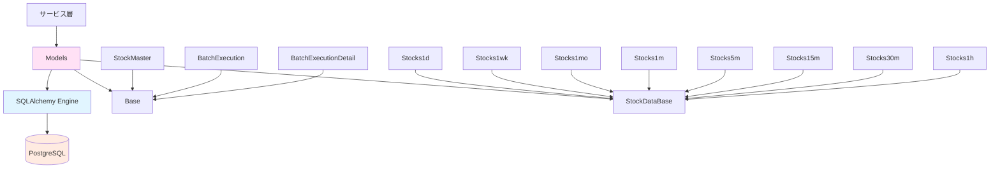
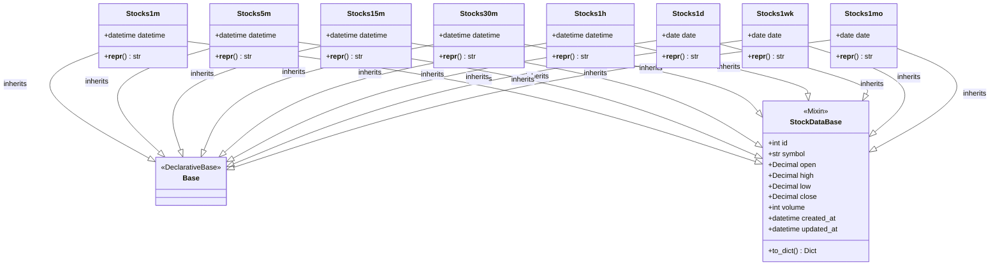
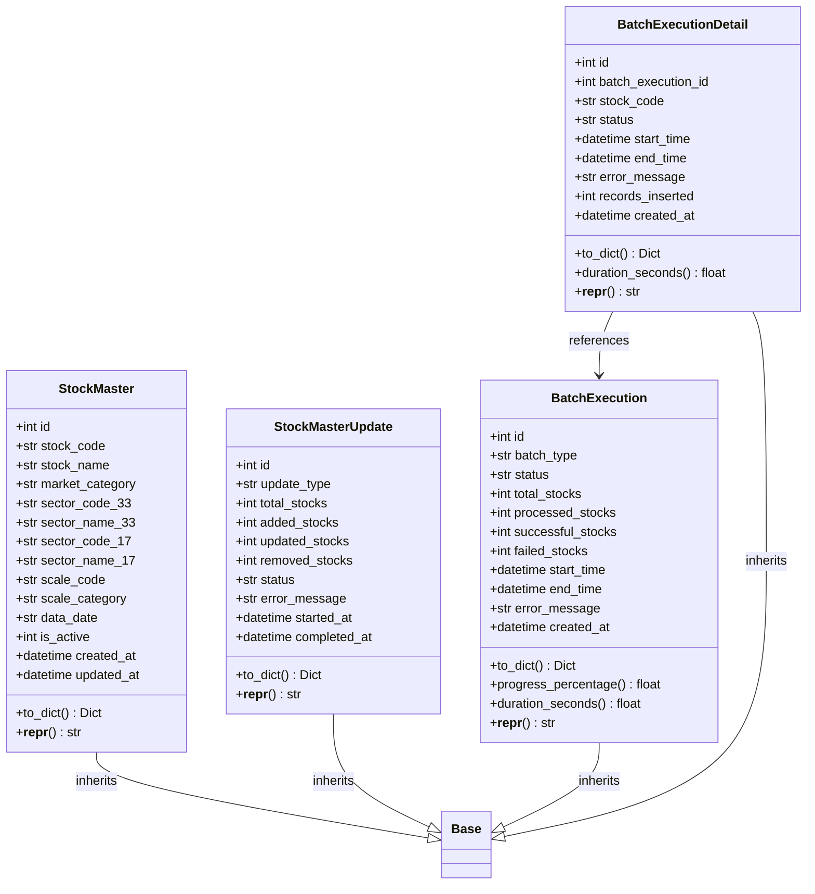
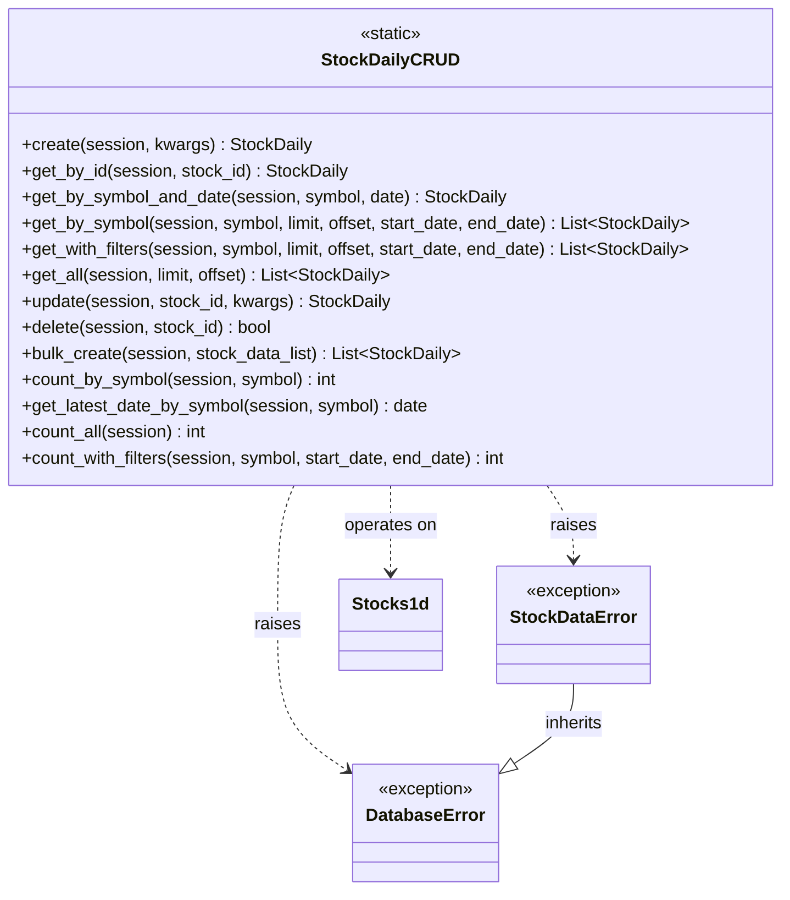

category: architecture
ai_context: high
last_updated: 2025-01-09
related_docs:
  - ../architecture_overview.md
  - ./service_layer.md
  - ./api_layer.md
  - ../database_design.md

# データアクセス層 仕様書

## 目次

- [1. 概要](#1-概要)
- [2. 構成](#2-構成)
- [3. モデル一覧](#3-モデル一覧)
- [4. クラス図](#4-クラス図)
- [5. データベース接続管理](#5-データベース接続管理)
- [6. モデル詳細](#6-モデル詳細)

---

## 1. 概要

### 役割

データアクセス層は、SQLAlchemyを使用してデータベーススキーマとPythonオブジェクトをマッピングし、データの永続化を担当します。

### 責務

| 責務 | 説明 |
|------|------|
| **ORM定義** | SQLAlchemyによるテーブル定義とマッピング |
| **データモデル提供** | 株価データ、銘柄マスタ、バッチ履歴のモデル |
| **制約定義** | ユニーク制約、チェック制約、インデックスの設定 |
| **CRUD操作** | 基本的なデータベース操作メソッドの提供 |
| **セッション管理** | データベース接続のライフサイクル管理 |
| **型変換** | データベース型とPython型の相互変換 |

### 設計原則

- **宣言的マッピング**: `DeclarativeBase`による明示的なスキーマ定義
- **型安全性**: `Mapped`による型ヒントの活用
- **整合性保証**: データベース制約による不正データの防止
- **パフォーマンス**: インデックスとコネクションプールの最適化

---

## 2. 構成

### ファイル構成

```
app/
└── models.py           # 全モデル定義（1,263行）
    ├── Base                   # 基底クラス
    ├── StockDataBase          # 株価データ共通クラス
    ├── 株価データモデル（8）
    │   ├── Stocks1m           # 1分足
    │   ├── Stocks5m           # 5分足
    │   ├── Stocks15m          # 15分足
    │   ├── Stocks30m          # 30分足
    │   ├── Stocks1h           # 1時間足
    │   ├── Stocks1d           # 日足
    │   ├── Stocks1wk          # 週足
    │   └── Stocks1mo          # 月足
    ├── 管理データモデル（4）
    │   ├── StockMaster        # 銘柄マスタ
    │   ├── StockMasterUpdate  # 銘柄更新履歴
    │   ├── BatchExecution     # バッチ実行情報
    │   └── BatchExecutionDetail # バッチ実行詳細
    ├── CRUD操作
    │   └── StockDailyCRUD     # 日足データCRUD
    ├── エラークラス
    │   ├── DatabaseError      # DB操作エラー
    │   └── StockDataError     # 株価データエラー
    └── ユーティリティ
        └── get_db_session()   # セッション管理
```

### 依存関係



---

## 3. モデル一覧

### 株価データモデル（8テーブル）

| モデルクラス | テーブル名 | 時間軸 | 日時カラム | 用途 |
|------------|-----------|--------|-----------|------|
| **Stocks1m** | stocks_1m | 1分足 | datetime | 短期トレード分析 |
| **Stocks5m** | stocks_5m | 5分足 | datetime | 短期トレード分析 |
| **Stocks15m** | stocks_15m | 15分足 | datetime | デイトレード分析 |
| **Stocks30m** | stocks_30m | 30分足 | datetime | デイトレード分析 |
| **Stocks1h** | stocks_1h | 1時間足 | datetime | スイングトレード分析 |
| **Stocks1d** | stocks_1d | 日足 | date | 中期投資分析 |
| **Stocks1wk** | stocks_1wk | 週足 | date | 中長期投資分析 |
| **Stocks1mo** | stocks_1mo | 月足 | date | 長期投資分析 |

### 管理データモデル（4テーブル）

| モデルクラス | テーブル名 | 用途 |
|------------|-----------|------|
| **StockMaster** | stock_master | JPX銘柄マスタ管理 |
| **StockMasterUpdate** | stock_master_updates | 銘柄マスタ更新履歴 |
| **BatchExecution** | batch_executions | バッチ処理実行情報 |
| **BatchExecutionDetail** | batch_execution_details | バッチ処理詳細（銘柄単位） |

---

## 4. クラス図

### 株価データモデル



### 管理データモデル



### CRUD操作クラス



---

## 5. データベース接続管理

### コネクション設定

**環境変数:**
```bash
DB_USER=postgres
DB_PASSWORD=your_password
DB_HOST=localhost
DB_PORT=5432
DB_NAME=stock_investment_db
```

**接続URL:**
```python
DATABASE_URL = "postgresql://{user}:{password}@{host}:{port}/{dbname}"
```

### コネクションプール設定

| パラメータ | 値 | 説明 |
|-----------|-----|------|
| **pool_size** | 10 | 通常時に保持する接続数 |
| **max_overflow** | 20 | pool_sizeを超えて作成可能な追加接続数 |
| **pool_pre_ping** | True | 接続使用前にpingして有効性確認 |
| **pool_recycle** | 3600 | 接続を再利用する最大秒数（1時間） |
| **pool_timeout** | 30 | 接続取得時の最大待機秒数 |

**最大接続数**: 30（pool_size + max_overflow）

### セッション管理

**コンテキストマネージャー:**
```python
@contextmanager
def get_db_session():
    """データベースセッションのコンテキストマネージャー."""
    session = SessionLocal()
    try:
        yield session
        session.commit()
    except Exception:
        session.rollback()
        raise
    finally:
        session.close()
```

**使用例:**
```python
with get_db_session() as session:
    stock_data = StockDailyCRUD.get_by_id(session, 1)
    # 正常終了時: 自動コミット
    # 例外発生時: 自動ロールバック
    # 完了時: 自動クローズ
```

---

## 6. モデル詳細

### 6.1 株価データモデル（StockDataBase）

**共通カラム:**

| カラム名 | 型 | 制約 | 説明 |
|---------|-----|------|------|
| `id` | Integer | PK, Auto Increment | レコードID |
| `symbol` | String(20) | NOT NULL | 銘柄コード（例: "7203.T"） |
| `open` | Numeric(10,2) | NOT NULL, >= 0 | 始値 |
| `high` | Numeric(10,2) | NOT NULL, >= 0 | 高値 |
| `low` | Numeric(10,2) | NOT NULL, >= 0 | 安値 |
| `close` | Numeric(10,2) | NOT NULL, >= 0 | 終値 |
| `volume` | BigInteger | NOT NULL, >= 0 | 出来高 |
| `created_at` | DateTime(TZ) | DEFAULT now() | 作成日時 |
| `updated_at` | DateTime(TZ) | DEFAULT now() | 更新日時 |

**分足・時間足モデル（Stocks1m, 5m, 15m, 30m, 1h）:**

| カラム名 | 型 | 制約 | 説明 |
|---------|-----|------|------|
| `datetime` | DateTime(TZ) | NOT NULL, UNIQUE(symbol, datetime) | データ日時 |

**日足・週足・月足モデル（Stocks1d, 1wk, 1mo）:**

| カラム名 | 型 | 制約 | 説明 |
|---------|-----|------|------|
| `date` | Date | NOT NULL, UNIQUE(symbol, date) | データ日付 |

**制約:**
- **ユニーク制約**: `(symbol, datetime)` または `(symbol, date)`
- **価格チェック**: `open >= 0 AND high >= 0 AND low >= 0 AND close >= 0`
- **出来高チェック**: `volume >= 0`
- **価格論理チェック**: `high >= low AND high >= open AND high >= close AND low <= open AND low <= close`

**インデックス:**
- `idx_stocks_{interval}_symbol`: 銘柄コード
- `idx_stocks_{interval}_datetime/date`: 日時/日付
- `idx_stocks_{interval}_symbol_datetime/date_desc`: 銘柄コード + 日時/日付（降順）

**メソッド:**
```python
def to_dict() -> Dict[str, Any]:
    """モデルインスタンスを辞書形式に変換."""
    # Decimal型をfloatに変換、NaN/Infをチェック
    # 日時をISO8601形式に変換
```

---

### 6.2 StockMaster（銘柄マスタ）

**カラム定義:**

| カラム名 | 型 | 制約 | 説明 |
|---------|-----|------|------|
| `id` | Integer | PK, Auto Increment | レコードID |
| `stock_code` | String(10) | UNIQUE, NOT NULL | 銘柄コード（例: "7203"） |
| `stock_name` | String(100) | NOT NULL | 銘柄名（例: "トヨタ自動車"） |
| `market_category` | String(50) | Nullable | 市場区分（例: "プライム"） |
| `sector_code_33` | String(10) | Nullable | 33業種コード |
| `sector_name_33` | String(100) | Nullable | 33業種区分 |
| `sector_code_17` | String(10) | Nullable | 17業種コード |
| `sector_name_17` | String(100) | Nullable | 17業種区分 |
| `scale_code` | String(10) | Nullable | 規模コード |
| `scale_category` | String(50) | Nullable | 規模区分（TOPIX分類） |
| `data_date` | String(8) | Nullable | データ取得日（YYYYMMDD形式） |
| `is_active` | Integer | NOT NULL, DEFAULT 1 | 有効フラグ（1=有効, 0=無効） |
| `created_at` | DateTime(TZ) | DEFAULT now() | 作成日時 |
| `updated_at` | DateTime(TZ) | DEFAULT now() | 更新日時 |

**インデックス:**
- `idx_stock_master_code`: 銘柄コード
- `idx_stock_master_active`: 有効フラグ
- `idx_stock_master_market`: 市場区分
- `idx_stock_master_sector_33`: 33業種コード

**メソッド:**
```python
def to_dict() -> Dict[str, Any]:
    """辞書形式に変換（is_activeをboolに変換）."""
```

---

### 6.3 StockMasterUpdate（銘柄更新履歴）

**カラム定義:**

| カラム名 | 型 | 制約 | 説明 |
|---------|-----|------|------|
| `id` | Integer | PK, Auto Increment | レコードID |
| `update_type` | String(20) | NOT NULL | 更新タイプ（manual/scheduled） |
| `total_stocks` | Integer | NOT NULL | 総銘柄数 |
| `added_stocks` | Integer | DEFAULT 0 | 新規追加銘柄数 |
| `updated_stocks` | Integer | DEFAULT 0 | 更新銘柄数 |
| `removed_stocks` | Integer | DEFAULT 0 | 削除（無効化）銘柄数 |
| `status` | String(20) | NOT NULL | ステータス（success/failed） |
| `error_message` | String | Nullable | エラーメッセージ |
| `started_at` | DateTime(TZ) | DEFAULT now() | 開始日時 |
| `completed_at` | DateTime(TZ) | Nullable | 完了日時 |

**メソッド:**
```python
def to_dict() -> Dict[str, Any]:
    """辞書形式に変換."""
```

---

### 6.4 BatchExecution（バッチ実行情報）

**カラム定義:**

| カラム名 | 型 | 制約 | 説明 |
|---------|-----|------|------|
| `id` | Integer | PK, Auto Increment | バッチID |
| `batch_type` | String(50) | NOT NULL | バッチタイプ（all_stocks/partial） |
| `status` | String(20) | NOT NULL | ステータス（running/completed/failed/paused） |
| `total_stocks` | Integer | NOT NULL | 総銘柄数 |
| `processed_stocks` | Integer | DEFAULT 0 | 処理済み銘柄数 |
| `successful_stocks` | Integer | DEFAULT 0 | 成功銘柄数 |
| `failed_stocks` | Integer | DEFAULT 0 | 失敗銘柄数 |
| `start_time` | DateTime(TZ) | DEFAULT now() | 開始日時 |
| `end_time` | DateTime(TZ) | Nullable | 終了日時 |
| `error_message` | String | Nullable | エラーメッセージ |
| `created_at` | DateTime(TZ) | DEFAULT now() | 作成日時 |

**インデックス:**
- `idx_batch_executions_status`: ステータス
- `idx_batch_executions_batch_type`: バッチタイプ
- `idx_batch_executions_start_time`: 開始日時

**プロパティ:**
```python
@property
def progress_percentage(self) -> float:
    """進捗率を計算（0.0-100.0）."""
    return (self.processed_stocks / self.total_stocks) * 100.0

@property
def duration_seconds(self) -> Optional[float]:
    """実行時間を秒で計算."""
    return (end_time - start_time).total_seconds()
```

**メソッド:**
```python
def to_dict() -> Dict[str, Any]:
    """辞書形式に変換."""
```

---

### 6.5 BatchExecutionDetail（バッチ実行詳細）

**カラム定義:**

| カラム名 | 型 | 制約 | 説明 |
|---------|-----|------|------|
| `id` | Integer | PK, Auto Increment | 詳細レコードID |
| `batch_execution_id` | Integer | NOT NULL | バッチID（外部キー） |
| `stock_code` | String(10) | NOT NULL | 銘柄コード |
| `status` | String(20) | NOT NULL | ステータス（pending/processing/completed/failed） |
| `start_time` | DateTime(TZ) | Nullable | 開始日時 |
| `end_time` | DateTime(TZ) | Nullable | 終了日時 |
| `error_message` | String | Nullable | エラーメッセージ |
| `records_inserted` | Integer | DEFAULT 0 | 挿入されたレコード数 |
| `created_at` | DateTime(TZ) | DEFAULT now() | 作成日時 |

**インデックス:**
- `idx_batch_execution_details_batch_id`: バッチID
- `idx_batch_execution_details_status`: ステータス
- `idx_batch_execution_details_stock_code`: 銘柄コード
- `idx_batch_execution_details_batch_stock`: バッチID + 銘柄コード

**プロパティ:**
```python
@property
def duration_seconds(self) -> Optional[float]:
    """処理時間を秒で計算."""
    return (end_time - start_time).total_seconds()
```

**メソッド:**
```python
def to_dict() -> Dict[str, Any]:
    """辞書形式に変換."""
```

---

### 6.6 StockDailyCRUD

**CRUD操作クラス:**

| メソッド | 説明 | パラメータ | 戻り値 |
|---------|------|-----------|--------|
| `create()` | 新規データ作成 | session, **kwargs | StockDaily |
| `get_by_id()` | ID検索 | session, stock_id | StockDaily \| None |
| `get_by_symbol_and_date()` | 銘柄コード+日付検索 | session, symbol, date | StockDaily \| None |
| `get_by_symbol()` | 銘柄コード検索 | session, symbol, limit, offset, start_date, end_date | List[StockDaily] |
| `get_with_filters()` | フィルタ検索 | session, symbol, limit, offset, start_date, end_date | List[StockDaily] |
| `get_all()` | 全件取得 | session, limit, offset | List[StockDaily] |
| `update()` | データ更新 | session, stock_id, **kwargs | StockDaily \| None |
| `delete()` | データ削除 | session, stock_id | bool |
| `bulk_create()` | 一括作成 | session, stock_data_list | List[StockDaily] |
| `count_by_symbol()` | 銘柄ごとの件数 | session, symbol | int |
| `get_latest_date_by_symbol()` | 最新日付取得 | session, symbol | date \| None |
| `count_all()` | 全件数 | session | int |
| `count_with_filters()` | フィルタ件数 | session, symbol, start_date, end_date | int |

**エラーハンドリング:**
- `StockDataError`: 重複データ、データ検証エラー
- `DatabaseError`: SQLエラー、制約違反

**使用例:**
```python
with get_db_session() as session:
    # 作成
    stock_data = StockDailyCRUD.create(
        session,
        symbol="7203.T",
        date=date(2025, 1, 9),
        open=2500.0,
        high=2550.0,
        low=2480.0,
        close=2530.0,
        volume=1000000
    )

    # 検索
    data = StockDailyCRUD.get_by_symbol_and_date(
        session, "7203.T", date(2025, 1, 9)
    )

    # 一括作成
    stock_list = [
        {"symbol": "7203.T", "date": date(2025, 1, 8), ...},
        {"symbol": "7203.T", "date": date(2025, 1, 7), ...},
    ]
    StockDailyCRUD.bulk_create(session, stock_list)
```

---

## 関連ドキュメント

- [アーキテクチャ概要](../architecture_overview.md)
- [サービス層仕様書](./service_layer.md)
- [API層仕様書](./api_layer.md)
- [データベース設計](../database_design.md)

---

**最終更新**: 2025-01-09
