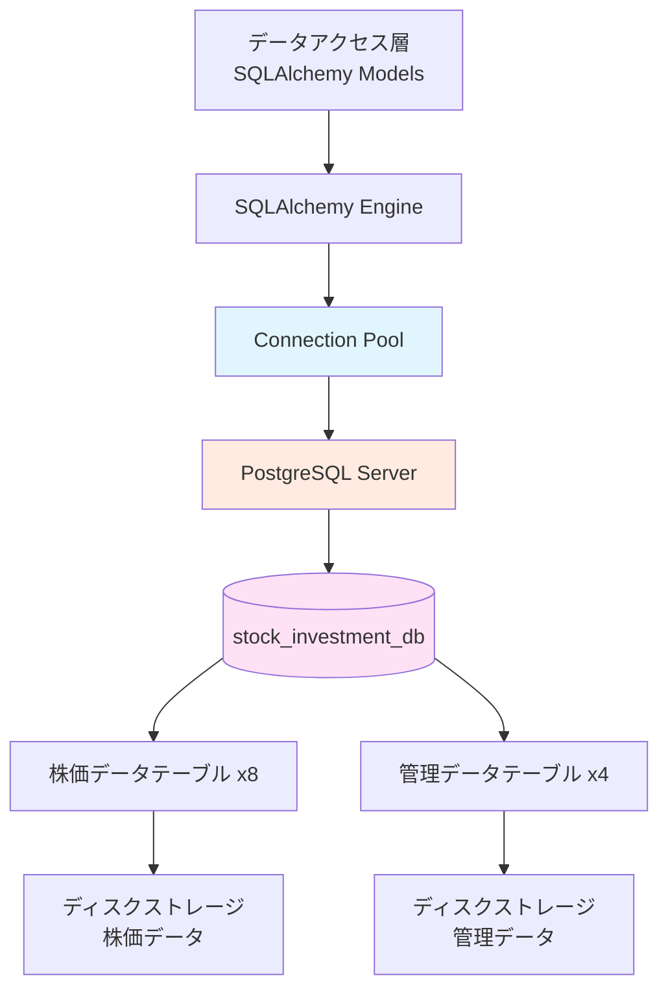

category: architecture
ai_context: high
last_updated: 2025-01-09
related_docs:
  - ../architecture_overview.md
  - ./data_access_layer.md
  - ../database_design.md
  - ../../guides/DATABASE_SETUP.md

# データストレージ層 仕様書

## 目次

- [1. 概要](#1-概要)
- [2. 構成](#2-構成)
- [3. データベーススキーマ](#3-データベーススキーマ)
- [4. 接続管理](#4-接続管理)
- [5. パフォーマンス設計](#5-パフォーマンス設計)
- [6. バックアップ・運用](#6-バックアップ運用)

---

## 1. 概要

### 役割

データストレージ層は、PostgreSQLデータベースによる株価データと管理データの永続化を担当します。

### 責務

| 責務 | 説明 |
|------|------|
| **データ永続化** | 株価データ、銘柄マスタ、バッチ履歴の物理保存 |
| **データ整合性** | トランザクション、制約による一貫性保証 |
| **クエリ実行** | SQL実行とインデックスによる高速検索 |
| **コネクション管理** | 接続プール、タイムアウト、リトライ制御 |
| **ストレージ管理** | ディスク容量、テーブルパーティション管理 |

### 設計原則

- **信頼性**: ACID特性によるデータ保護
- **スケーラビリティ**: 4,000銘柄以上のデータを効率的に管理
- **パフォーマンス**: インデックス最適化とコネクションプール
- **保守性**: シンプルなスキーマ設計、明確な命名規則

---

## 2. 構成

### DBMS情報

| 項目 | 値 | 説明 |
|------|-----|------|
| **DBMS** | PostgreSQL | バージョン12以上推奨 |
| **文字コード** | UTF-8 | すべてのテキストデータ |
| **タイムゾーン** | Asia/Tokyo (JST) | 日本株式市場に合わせて設定 |
| **接続プロトコル** | TCP/IP | デフォルトポート 5432 |

### データベース構成

```
PostgreSQL Server
└── stock_investment_db              # メインデータベース
    ├── 株価データテーブル（8）
    │   ├── stocks_1m                # 1分足
    │   ├── stocks_5m                # 5分足
    │   ├── stocks_15m               # 15分足
    │   ├── stocks_30m               # 30分足
    │   ├── stocks_1h                # 1時間足
    │   ├── stocks_1d                # 日足
    │   ├── stocks_1wk               # 週足
    │   └── stocks_1mo               # 月足
    └── 管理データテーブル（4）
        ├── stock_master             # 銘柄マスタ
        ├── stock_master_updates     # 銘柄更新履歴
        ├── batch_executions         # バッチ実行情報
        └── batch_execution_details  # バッチ実行詳細
```

### 依存関係



---

## 3. データベーススキーマ

### 3.1 株価データテーブル（8テーブル）

**テーブル一覧:**

| テーブル名 | 時間軸 | 日時型 | 主な用途 | 想定レコード数（1銘柄/1年） |
|-----------|--------|--------|---------|--------------------------|
| `stocks_1m` | 1分足 | TIMESTAMP | 短期トレード分析 | 約80,000件 |
| `stocks_5m` | 5分足 | TIMESTAMP | 短期トレード分析 | 約16,000件 |
| `stocks_15m` | 15分足 | TIMESTAMP | デイトレード分析 | 約5,300件 |
| `stocks_30m` | 30分足 | TIMESTAMP | デイトレード分析 | 約2,600件 |
| `stocks_1h` | 1時間足 | TIMESTAMP | スイングトレード分析 | 約1,300件 |
| `stocks_1d` | 日足 | DATE | 中期投資分析 | 約245件 |
| `stocks_1wk` | 週足 | DATE | 中長期投資分析 | 約52件 |
| `stocks_1mo` | 月足 | DATE | 長期投資分析 | 約12件 |

**共通制約:**

- **主キー**: `id` (SERIAL, AUTO INCREMENT)
- **ユニーク制約**:
  - 分足・時間足: `(symbol, datetime)`
  - 日足・週足・月足: `(symbol, date)`
- **価格チェック制約**:
  - `open >= 0 AND high >= 0 AND low >= 0 AND close >= 0`
  - `high >= low AND high >= open AND high >= close AND low <= open AND low <= close`
- **出来高チェック制約**: `volume >= 0`

**共通インデックス（各テーブルに適用）:**

```sql
-- 銘柄コード検索用
CREATE INDEX idx_stocks_{interval}_symbol ON stocks_{interval} (symbol);

-- 日時検索用
CREATE INDEX idx_stocks_{interval}_datetime ON stocks_{interval} (datetime); -- 分足・時間足
CREATE INDEX idx_stocks_{interval}_date ON stocks_{interval} (date);         -- 日足・週足・月足

-- 銘柄別最新データ取得用（複合インデックス、降順）
CREATE INDEX idx_stocks_{interval}_symbol_datetime_desc
    ON stocks_{interval} (symbol, datetime DESC); -- 分足・時間足
CREATE INDEX idx_stocks_{interval}_symbol_date_desc
    ON stocks_{interval} (symbol, date DESC);     -- 日足・週足・月足
```

---

### 3.2 管理データテーブル（4テーブル）

#### stock_master（銘柄マスタ）

**用途**: JPX上場銘柄の基本情報管理

**カラム定義:**

| カラム名 | 型 | 制約 | 説明 |
|---------|-----|------|------|
| `id` | INTEGER | PK, Auto Increment | レコードID |
| `stock_code` | VARCHAR(10) | UNIQUE, NOT NULL | 銘柄コード（例: "7203"） |
| `stock_name` | VARCHAR(100) | NOT NULL | 銘柄名（例: "トヨタ自動車"） |
| `market_category` | VARCHAR(50) | Nullable | 市場区分（例: "プライム（内国株式）"） |
| `sector_code_33` | VARCHAR(10) | Nullable | 33業種コード |
| `sector_name_33` | VARCHAR(100) | Nullable | 33業種区分 |
| `sector_code_17` | VARCHAR(10) | Nullable | 17業種コード |
| `sector_name_17` | VARCHAR(100) | Nullable | 17業種区分 |
| `scale_code` | VARCHAR(10) | Nullable | 規模コード |
| `scale_category` | VARCHAR(50) | Nullable | 規模区分（TOPIX分類） |
| `data_date` | VARCHAR(8) | Nullable | データ取得日（YYYYMMDD形式） |
| `is_active` | INTEGER | NOT NULL, DEFAULT 1 | 有効フラグ（1=有効, 0=無効） |
| `created_at` | TIMESTAMP(TZ) | DEFAULT now() | 作成日時 |
| `updated_at` | TIMESTAMP(TZ) | DEFAULT now() | 更新日時 |

**インデックス:**
```sql
CREATE INDEX idx_stock_master_code ON stock_master (stock_code);
CREATE INDEX idx_stock_master_active ON stock_master (is_active);
CREATE INDEX idx_stock_master_market ON stock_master (market_category);
CREATE INDEX idx_stock_master_sector_33 ON stock_master (sector_code_33);
```

#### stock_master_updates（銘柄更新履歴）

**用途**: 銘柄マスタの更新履歴記録

**カラム定義:**

| カラム名 | 型 | 制約 | 説明 |
|---------|-----|------|------|
| `id` | INTEGER | PK, Auto Increment | レコードID |
| `update_type` | VARCHAR(20) | NOT NULL | 更新タイプ（manual/scheduled） |
| `total_stocks` | INTEGER | NOT NULL | 総銘柄数 |
| `added_stocks` | INTEGER | DEFAULT 0 | 新規追加銘柄数 |
| `updated_stocks` | INTEGER | DEFAULT 0 | 更新銘柄数 |
| `removed_stocks` | INTEGER | DEFAULT 0 | 削除（無効化）銘柄数 |
| `status` | VARCHAR(20) | NOT NULL | ステータス（success/failed） |
| `error_message` | TEXT | Nullable | エラーメッセージ |
| `started_at` | TIMESTAMP(TZ) | DEFAULT now() | 開始日時 |
| `completed_at` | TIMESTAMP(TZ) | Nullable | 完了日時 |

#### batch_executions（バッチ実行情報）

**用途**: バッチ処理の実行サマリ

**カラム定義:**

| カラム名 | 型 | 制約 | 説明 |
|---------|-----|------|------|
| `id` | INTEGER | PK, Auto Increment | バッチID |
| `batch_type` | VARCHAR(50) | NOT NULL | バッチタイプ（all_stocks/partial） |
| `status` | VARCHAR(20) | NOT NULL | ステータス（running/completed/failed/paused） |
| `total_stocks` | INTEGER | NOT NULL | 総銘柄数 |
| `processed_stocks` | INTEGER | DEFAULT 0 | 処理済み銘柄数 |
| `successful_stocks` | INTEGER | DEFAULT 0 | 成功銘柄数 |
| `failed_stocks` | INTEGER | DEFAULT 0 | 失敗銘柄数 |
| `start_time` | TIMESTAMP(TZ) | DEFAULT now() | 開始日時 |
| `end_time` | TIMESTAMP(TZ) | Nullable | 終了日時 |
| `error_message` | TEXT | Nullable | エラーメッセージ |
| `created_at` | TIMESTAMP(TZ) | DEFAULT now() | 作成日時 |

**インデックス:**
```sql
CREATE INDEX idx_batch_executions_status ON batch_executions (status);
CREATE INDEX idx_batch_executions_batch_type ON batch_executions (batch_type);
CREATE INDEX idx_batch_executions_start_time ON batch_executions (start_time);
```

#### batch_execution_details（バッチ実行詳細）

**用途**: バッチ処理の銘柄ごとの詳細記録

**カラム定義:**

| カラム名 | 型 | 制約 | 説明 |
|---------|-----|------|------|
| `id` | INTEGER | PK, Auto Increment | 詳細レコードID |
| `batch_execution_id` | INTEGER | NOT NULL | バッチID（外部キー） |
| `stock_code` | VARCHAR(10) | NOT NULL | 銘柄コード |
| `status` | VARCHAR(20) | NOT NULL | ステータス（pending/processing/completed/failed） |
| `start_time` | TIMESTAMP(TZ) | Nullable | 開始日時 |
| `end_time` | TIMESTAMP(TZ) | Nullable | 終了日時 |
| `error_message` | TEXT | Nullable | エラーメッセージ |
| `records_inserted` | INTEGER | DEFAULT 0 | 挿入されたレコード数 |
| `created_at` | TIMESTAMP(TZ) | DEFAULT now() | 作成日時 |

**インデックス:**
```sql
CREATE INDEX idx_batch_execution_details_batch_id
    ON batch_execution_details (batch_execution_id);
CREATE INDEX idx_batch_execution_details_status
    ON batch_execution_details (status);
CREATE INDEX idx_batch_execution_details_stock_code
    ON batch_execution_details (stock_code);
CREATE INDEX idx_batch_execution_details_batch_stock
    ON batch_execution_details (batch_execution_id, stock_code);
```

---

## 4. 接続管理

### 4.1 接続設定

**環境変数:**

```bash
DB_USER=postgres                    # データベースユーザー
DB_PASSWORD=your_password           # パスワード
DB_HOST=localhost                   # ホスト名
DB_PORT=5432                        # ポート番号
DB_NAME=stock_investment_db         # データベース名
```

**接続URL構成:**

```python
DATABASE_URL = f"postgresql://{DB_USER}:{DB_PASSWORD}@{DB_HOST}:{DB_PORT}/{DB_NAME}"
```

### 4.2 コネクションプール設定

PostgreSQLへの接続は、SQLAlchemyのコネクションプールで管理されます。

**プール設定パラメータ:**

| パラメータ | 値 | 説明 |
|-----------|-----|------|
| `pool_size` | 10 | 通常時に保持する接続数 |
| `max_overflow` | 20 | pool_sizeを超えて作成可能な追加接続数 |
| `pool_pre_ping` | True | 接続使用前にpingして有効性を確認 |
| `pool_recycle` | 3600 | 接続を再利用する最大秒数（1時間） |
| `pool_timeout` | 30 | 接続取得時の最大待機秒数 |

**最大同時接続数**: 30（pool_size + max_overflow）

**実装例:**

```python
from sqlalchemy import create_engine

engine = create_engine(
    DATABASE_URL,
    pool_size=10,
    max_overflow=20,
    pool_pre_ping=True,
    pool_recycle=3600,
    pool_timeout=30,
    echo=False  # SQLログ出力（開発時はTrue推奨）
)
```

### 4.3 トランザクション管理

**ACID特性:**

| 特性 | 実装 | 説明 |
|------|------|------|
| **Atomicity（原子性）** | BEGIN/COMMIT/ROLLBACK | トランザクション内の処理は全て成功または全て失敗 |
| **Consistency（一貫性）** | 制約、チェック制約 | データベースは常に整合性のある状態を維持 |
| **Isolation（独立性）** | デフォルト分離レベル: READ COMMITTED | トランザクション間の干渉を防止 |
| **Durability（永続性）** | WAL（Write-Ahead Logging） | コミット後のデータは障害発生時も保持 |

**トランザクション分離レベル:**

PostgreSQLのデフォルト分離レベルは `READ COMMITTED` です。

```sql
-- 現在の分離レベル確認
SHOW default_transaction_isolation;

-- トランザクション分離レベル変更（必要に応じて）
SET TRANSACTION ISOLATION LEVEL REPEATABLE READ;
```

---

## 5. パフォーマンス設計

### 5.1 インデックス戦略

**基本方針:**

- すべてのテーブルに銘柄コード検索用インデックスを配置
- 日時検索を高速化するため、日時カラムにインデックスを配置
- 銘柄別最新データ取得クエリを最適化するため、複合インデックス（降順）を配置

**想定クエリとインデックス利用:**

| クエリ種別 | 利用インデックス | 例 |
|-----------|-----------------|-----|
| 銘柄コード検索 | `idx_stocks_{interval}_symbol` | `WHERE symbol = '7203.T'` |
| 期間指定検索 | `idx_stocks_{interval}_datetime/date` | `WHERE datetime BETWEEN ... AND ...` |
| 銘柄別最新データ | `idx_stocks_{interval}_symbol_datetime_desc` | `WHERE symbol = '7203.T' ORDER BY datetime DESC LIMIT 1` |
| 複合条件検索 | `idx_stocks_{interval}_symbol_datetime_desc` | `WHERE symbol = '7203.T' AND datetime >= ...` |

### 5.2 データ容量見積もり

**1銘柄あたりのデータ量（1年間）:**

| テーブル | レコード数/年 | 1レコードサイズ | 合計サイズ |
|---------|-------------|---------------|----------|
| stocks_1m | 80,000件 | 約80 bytes | 約6.4 MB |
| stocks_5m | 16,000件 | 約80 bytes | 約1.3 MB |
| stocks_15m | 5,300件 | 約80 bytes | 約0.4 MB |
| stocks_30m | 2,600件 | 約80 bytes | 約0.2 MB |
| stocks_1h | 1,300件 | 約80 bytes | 約0.1 MB |
| stocks_1d | 245件 | 約80 bytes | 約20 KB |
| stocks_1wk | 52件 | 約80 bytes | 約4 KB |
| stocks_1mo | 12件 | 約80 bytes | 約1 KB |
| **合計** | - | - | **約8.4 MB** |

**4,000銘柄の場合（1年間）:**

- 総容量: 約8.4 MB × 4,000 = **約33.6 GB**
- インデックス含む: 約50 GB（推定）

### 5.3 PostgreSQL設定推奨値

**主要パラメータ:**

| パラメータ | 推奨値 | 説明 |
|-----------|-------|------|
| `shared_buffers` | 256MB〜1GB | 共有メモリバッファ |
| `effective_cache_size` | 1GB〜4GB | OSがファイルキャッシュに使用するメモリの推定値 |
| `work_mem` | 4MB〜16MB | ソート、ハッシュテーブル用のメモリ |
| `maintenance_work_mem` | 64MB〜256MB | インデックス作成、VACUUM用のメモリ |
| `max_connections` | 100 | 最大接続数（コネクションプール設定と合わせる） |

**設定ファイル例（postgresql.conf）:**

```conf
# メモリ設定
shared_buffers = 512MB
effective_cache_size = 2GB
work_mem = 8MB
maintenance_work_mem = 128MB

# 接続設定
max_connections = 100

# WAL設定
wal_buffers = 16MB
checkpoint_completion_target = 0.9
```

---

## 6. バックアップ・運用

### 6.1 バックアップ戦略

**現在の運用方針（v1.0）:**

- **開発環境**: 定期バックアップなし（データはYahoo Finance APIから再取得可能）
- **本番環境**: 必要になってから検討

**将来の運用計画（必要時に検討）:**

| バックアップ種別 | 頻度 | 保存期間 | ツール |
|---------------|------|---------|-------|
| **フルバックアップ** | 週次（日曜深夜） | 4週間 | pg_dump |
| **差分バックアップ** | 日次（深夜） | 7日間 | pg_basebackup |
| **WALアーカイブ** | 継続的 | 7日間 | archive_command |

**バックアップコマンド例:**

```bash
# フルバックアップ
pg_dump -U postgres -F c -b -v -f backup_$(date +%Y%m%d).dump stock_investment_db

# リストア
pg_restore -U postgres -d stock_investment_db -v backup_20250109.dump
```

### 6.2 メンテナンス

**定期メンテナンス作業:**

| 作業 | 頻度 | コマンド | 目的 |
|------|------|---------|------|
| **VACUUM** | 週次 | `VACUUM ANALYZE;` | 不要領域の回収、統計情報更新 |
| **REINDEX** | 月次 | `REINDEX DATABASE stock_investment_db;` | インデックスの断片化解消 |
| **統計情報更新** | 週次 | `ANALYZE;` | クエリプランナーの最適化 |

**自動VACUUMの設定:**

PostgreSQLはデフォルトで自動VACUUMが有効です。

```sql
-- 自動VACUUM設定確認
SHOW autovacuum;

-- テーブルごとの統計情報確認
SELECT schemaname, tablename, last_vacuum, last_autovacuum, last_analyze
FROM pg_stat_user_tables
ORDER BY last_autovacuum DESC;
```

### 6.3 監視項目

**推奨監視項目:**

| 項目 | 確認方法 | しきい値 |
|------|---------|---------|
| **接続数** | `SELECT count(*) FROM pg_stat_activity;` | max_connectionsの80%以下 |
| **データベースサイズ** | `SELECT pg_size_pretty(pg_database_size('stock_investment_db'));` | ディスク容量の70%以下 |
| **テーブルサイズ** | `SELECT pg_size_pretty(pg_total_relation_size('stocks_1d'));` | 定期確認 |
| **インデックスサイズ** | `SELECT pg_size_pretty(pg_indexes_size('stocks_1d'));` | テーブルサイズの50%以下推奨 |
| **長時間実行クエリ** | `SELECT pid, now() - pg_stat_activity.query_start, query FROM pg_stat_activity WHERE state = 'active';` | 30秒以上のクエリを調査 |

---

## 関連ドキュメント

- [アーキテクチャ概要](../architecture_overview.md) - システム全体像
- [データアクセス層仕様書](./data_access_layer.md) - SQLAlchemyモデル定義
- [データベース設計書](../database_design.md) - 詳細なスキーマ定義
- [データベースセットアップガイド](../../guides/DATABASE_SETUP.md) - 構築手順

---

**最終更新**: 2025-01-09
