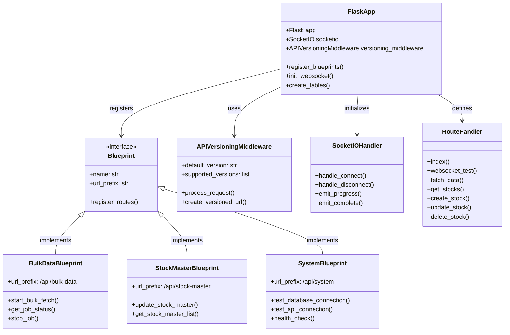
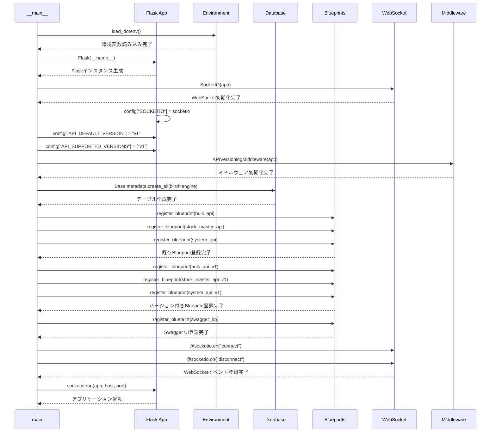
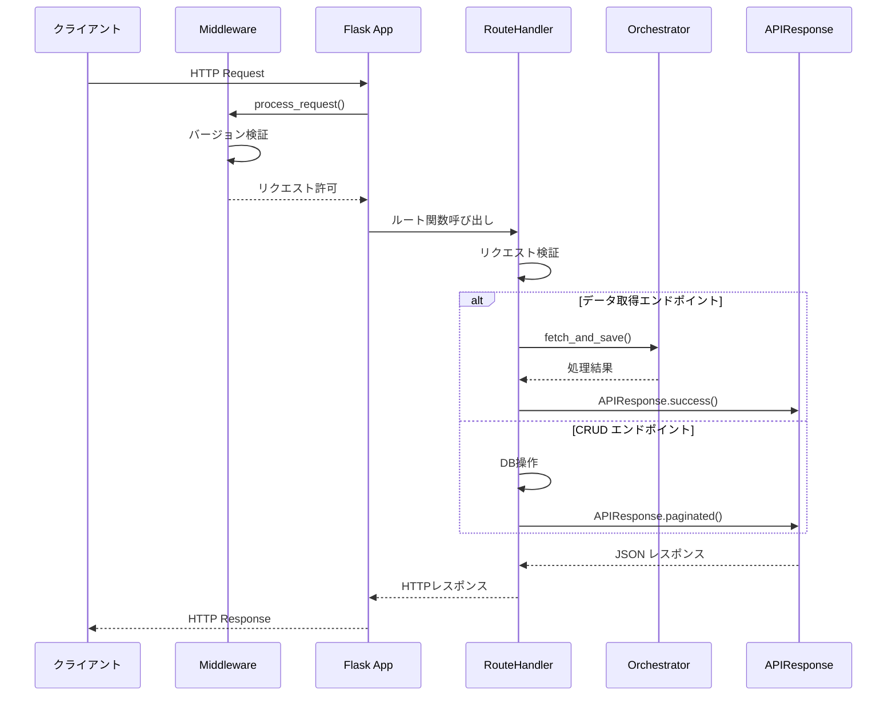
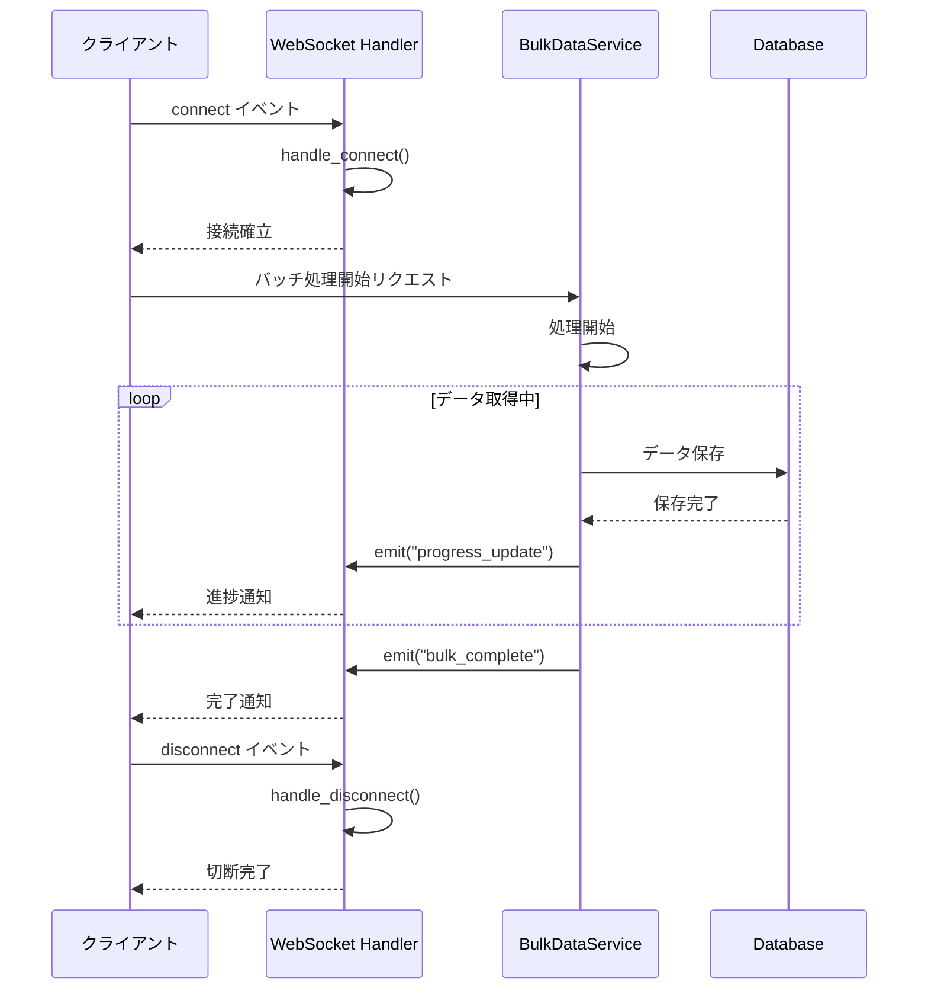
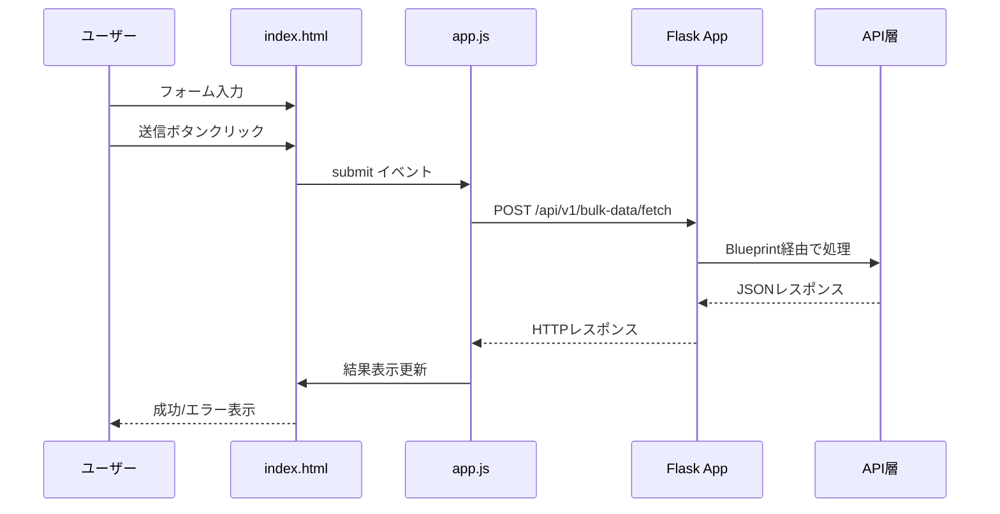
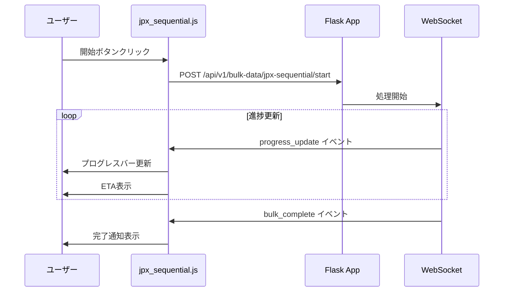

category: architecture
ai_context: high
last_updated: 2025-01-08
related_docs:
  - ../architecture_overview.md
  - ../api/api_reference.md

# プレゼンテーション層仕様書

## 概要

プレゼンテーション層は、ユーザーとシステム間のインターフェースを提供し、HTTPリクエスト/レスポンスの処理、WebSocket通信、HTMLレンダリングを担当します。

## 責務

- HTTPリクエストの受付とルーティング
- HTMLテンプレートのレンダリング
- WebSocketによるリアルタイム通信
- API Blueprintの統合管理
- 静的ファイル（CSS/JavaScript）の配信

---

## コンポーネント構成

```
app/
├── app.py              # Flaskアプリケーション本体
├── templates/          # HTMLテンプレート
│   ├── base.html
│   ├── index.html
│   └── partials/       # 再利用可能コンポーネント
└── static/             # 静的ファイル
    ├── app.js          # メインJavaScript
    ├── script.js       # ユーティリティ
    ├── state-manager.js
    ├── jpx_sequential.js
    └── style.css
```

---

## 1. Flaskアプリケーション本体

**ファイル**: [app/app.py](../../app/app.py)

### 主要機能

| 機能 | 実装内容 |
|------|---------|
| **アプリケーション初期化** | Flaskインスタンス生成、設定読み込み |
| **Blueprint登録** | API層の3つのBlueprintを統合 |
| **WebSocket初期化** | Flask-SocketIOの設定 |
| **ルートページ** | メインダッシュボードの表示 |
| **CRUD APIエンドポイント** | 株価データの作成・参照・更新・削除 |

### アーキテクチャクラス図



### アプリケーション初期化シーケンス



### リクエスト処理フロー（HTTPリクエスト）



### WebSocket通信フロー



### 登録Blueprint

```python
# 既存Blueprint（後方互換性）
app.register_blueprint(bulk_api)
app.register_blueprint(stock_master_api)
app.register_blueprint(system_api)

# API v1エンドポイント（バージョニング）
app.register_blueprint(bulk_api_v1, url_prefix='/api/v1/bulk-data')
app.register_blueprint(stock_master_api_v1, url_prefix='/api/v1/stock-master')
app.register_blueprint(system_api_v1, url_prefix='/api/v1/system')

# Swagger UI
app.register_blueprint(swagger_bp)
```

### WebSocketイベント

| イベント | 方向 | 用途 | 実装箇所 |
|---------|------|------|---------|
| `connect` | Client → Server | クライアント接続 | [app.py:145-148](../../app/app.py#L145-L148) |
| `disconnect` | Client → Server | クライアント切断 | [app.py:151-154](../../app/app.py#L151-L154) |
| `progress_update` | Server → Client | 進捗状況配信 | BulkDataService |
| `bulk_complete` | Server → Client | バッチ処理完了通知 | BulkDataService |

### ルートエンドポイント

| パス | メソッド | 処理 | 実装箇所 |
|------|---------|------|---------|
| `/` | GET | メインダッシュボード | [app.py:157-164](../../app/app.py#L157-L164) |
| `/websocket-test` | GET | WebSocketテストページ | [app.py:167-170](../../app/app.py#L167-L170) |
| `/api/stocks/data` | POST | 株価データ取得・保存 | [app.py:173-280](../../app/app.py#L173-L280) |
| `/api/stocks` | GET | 株価データ一覧取得 | [app.py:521-632](../../app/app.py#L521-L632) |
| `/api/stocks` | POST | 株価データ作成 | [app.py:286-378](../../app/app.py#L286-L378) |
| `/api/stocks/<id>` | GET | ID指定データ取得 | [app.py:381-422](../../app/app.py#L381-L422) |
| `/api/stocks/<id>` | PUT | データ更新 | [app.py:635-713](../../app/app.py#L635-L713) |
| `/api/stocks/<id>` | DELETE | データ削除 | [app.py:716-761](../../app/app.py#L716-L761) |
| `/api/stocks/test` | POST | テストデータ作成 | [app.py:764-843](../../app/app.py#L764-L843) |

---

## 2. HTMLテンプレート

**ディレクトリ**: [app/templates/](../../app/templates/)

### テンプレート構成

| ファイル | 役割 | 継承元 |
|---------|------|--------|
| `base.html` | 基本レイアウト | - |
| `index.html` | メインダッシュボード | base.html |
| `partials/form_components.html` | フォーム部品 | - |
| `partials/alerts.html` | 通知コンポーネント | - |
| `partials/data_table.html` | データテーブル | - |

### 主要UI要素（index.html）

```html
<!-- 株価データ取得フォーム -->
<form id="fetch-form">
  - 銘柄コード入力
  - 期間選択（5d～max）
  - 時間軸選択（1m～1mo）
</form>

<!-- バルクデータ取得 -->
<form id="bulk-fetch-form">
  - 複数銘柄入力
  - 並列処理設定
</form>

<!-- JPX全銘柄取得 -->
<button id="jpx-sequential-start">
  - ワンクリック全銘柄取得
  - リアルタイム進捗表示
</button>
```

---

## 3. 静的ファイル（JavaScript）

**ディレクトリ**: [app/static/](../../app/static/)

### JavaScriptモジュール

| ファイル | 責務 | 主要機能 |
|---------|------|---------|
| **app.js** | メインロジック | フォーム送信、API呼び出し |
| **state-manager.js** | 状態管理 | UI状態の一元管理 |
| **jpx_sequential.js** | JPX全銘柄処理 | WebSocket進捗受信、ETA表示 |
| **script.js** | ユーティリティ | 共通関数 |

### WebSocketクライアント実装

```javascript
// Socket.IO接続
const socket = io();

// 進捗受信
socket.on('progress_update', (data) => {
  updateProgressBar(data.current, data.total);
  displayETA(data.eta);
});

// 完了通知
socket.on('bulk_complete', (data) => {
  showCompletionMessage(data.stats);
});
```

### APIリクエスト例

```javascript
// 単一銘柄取得
fetch('/api/v1/bulk-data/fetch', {
  method: 'POST',
  headers: { 'Content-Type': 'application/json' },
  body: JSON.stringify({
    symbol: '7203.T',
    period: '1mo',
    interval: '1d'
  })
});
```

---

## 4. 静的ファイル（CSS）

**ファイル**: [app/static/style.css](../../app/static/style.css)

### スタイル構成

- レスポンシブデザイン
- カード型レイアウト
- フォームスタイル
- プログレスバー
- アラート表示

---

## ルーティング

### ページルート

| パス | メソッド | 処理 | 実装箇所 |
|------|---------|------|---------|
| `/` | GET | メインダッシュボード表示 | [app.py:156-163](../../app/app.py#L156-L163) |

### APIルート

API層の詳細は各Blueprintの仕様書を参照:

- [Bulk Data API](./api_layer.md#bulk-data-api) - `/api/v1/bulk-data/*`
- [Stock Master API](./api_layer.md#stock-master-api) - `/api/v1/stock-master/*`
- [System Monitoring API](./api_layer.md#system-monitoring-api) - `/api/v1/system/*`

---

## データフロー

### 単一銘柄取得フロー



### JPX全銘柄取得フロー（WebSocket）



---

## エラーハンドリング

### クライアントサイド

```javascript
try {
  const response = await fetch('/api/v1/...');
  if (!response.ok) {
    throw new Error(`HTTP ${response.status}`);
  }
  const data = await response.json();
  displaySuccess(data);
} catch (error) {
  displayError(error.message);
}
```

### UIフィードバック

- **成功**: 緑色のアラート表示
- **エラー**: 赤色のアラート、詳細メッセージ
- **警告**: 黄色のアラート
- **情報**: 青色のアラート

---

## セキュリティ

### 実装済み

- CSRFトークン（Flask標準）
- Content-Type検証
- エスケープ処理（Jinja2自動）

### API認証

API_KEY環境変数による認証（オプション）:

```bash
# 開発環境: 認証なし
# 本番環境: X-API-Keyヘッダーで認証
export API_KEY="your-secret-key"
```

---

## パフォーマンス考慮事項

### 最適化

- 静的ファイルのキャッシュ活用
- WebSocketによる双方向通信で効率化
- 非同期fetch APIの使用
- ページネーション対応（データテーブル）

### 推奨事項

- 本番環境ではCDNの使用を検討
- Gzip圧縮の有効化
- 静的ファイルのminify化

---

## 依存関係

### Pythonパッケージ

```python
Flask==3.0.0              # Webフレームワーク
Flask-SocketIO==5.3.5     # WebSocket
Jinja2                    # テンプレートエンジン（Flask同梱）
```

### フロントエンド

```html
<!-- CDN経由 -->
<script src="https://cdn.socket.io/4.5.4/socket.io.min.js"></script>
```

---

## 設定

### 環境変数

| 変数名 | 必須 | デフォルト | 説明 |
|--------|------|-----------|------|
| `HOST` | No | 127.0.0.1 | バインドホスト |
| `PORT` | No | 8000 | バインドポート |
| `API_KEY` | No | - | API認証キー（未設定時は認証なし） |

### 起動コマンド

```bash
# 開発環境
python app/app.py

# 本番環境（Waitress使用）
waitress-serve --host=0.0.0.0 --port=8000 app.app:app
```

---

## 関連ドキュメント

- [アーキテクチャ概要](../architecture_overview.md) - システム全体像
- [APIリファレンス](../../api/api_reference.md) - エンドポイント詳細
- [API層仕様書](./api_layer.md) - Blueprint実装詳細（作成予定）
- [サービス層仕様書](./service_layer.md) - ビジネスロジック（作成予定）

---

**最終更新**: 2025-01-08
