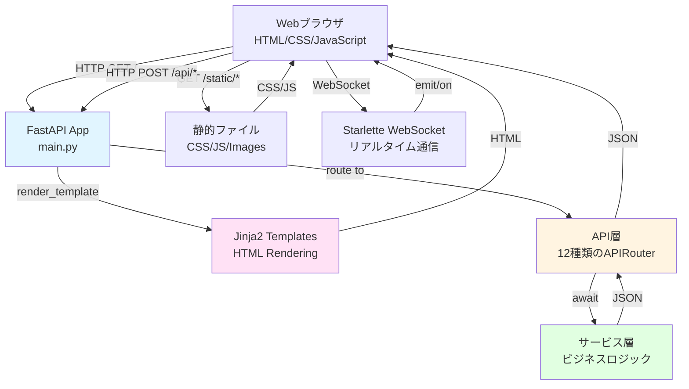
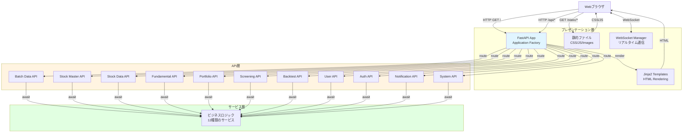
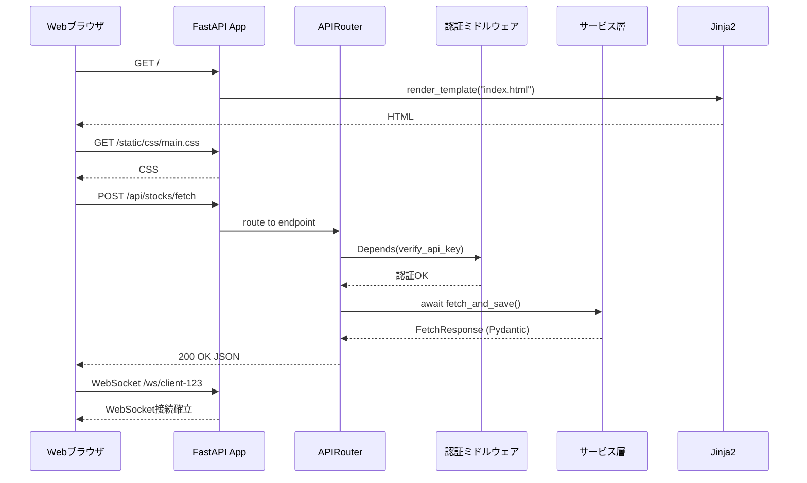

category: architecture
ai_context: high
last_updated: 2025-11-16
related_docs:
  - ../architecture_overview.md
  - ./common_modules.md
  - ./api_layer.md
  - ./service_layer.md
  - ../frontend/frontend_spec.md

# プレゼンテーション層 仕様書

## 目次

- [1. 概要](#1-概要)
- [2. 構成](#2-構成)
- [3. FastAPI Application Factory](#3-fastapi-application-factory)
- [4. テンプレートエンジン](#4-テンプレートエンジン)
- [5. 静的ファイル管理](#5-静的ファイル管理)
- [6. WebSocket通信](#6-websocket通信)
- [7. APIドキュメント自動生成](#7-apiドキュメント自動生成)
- [8. アーキテクチャ図](#8-アーキテクチャ図)
- [9. セキュリティ](#9-セキュリティ)
- [10. パフォーマンス最適化](#10-パフォーマンス最適化)

---

## 1. 概要

### 役割

プレゼンテーション層は、**FastAPIを使用してHTTPリクエスト/レスポンスの処理、HTMLレンダリング、WebSocket通信を担当**します。ユーザーとシステム間のインターフェースを提供し、API層とフロントエンドを統合します。

### 責務

| 責務                    | 説明                                                           |
| ----------------------- | -------------------------------------------------------------- |
| **非同期HTTPサーバー**  | FastAPI/Uvicornによる高速な非同期リクエスト処理                |
| **HTMLレンダリング**    | Jinja2テンプレートエンジンによるサーバーサイドレンダリング     |
| **WebSocket通信**       | Starlette WebSocketによるリアルタイム双方向通信                |
| **静的ファイル配信**    | CSS/JavaScript/画像ファイルの効率的な配信                      |
| **APIルーティング管理** | APIRouterによるエンドポイントの統合管理                        |
| **OpenAPI自動生成**     | Pydanticスキーマからの自動ドキュメント生成（Swagger UI/ReDoc） |
| **セキュリティ管理**    | CORS設定、認証・認可の統合                                     |
| **エラーハンドリング**  | 統一されたエラーレスポンスとログ記録                           |

### 設計原則

| 原則                     | 説明                                                 | 実装例                                     |
| ------------------------ | ---------------------------------------------------- | ------------------------------------------ |
| **Application Factory**  | 環境ごとに異なる設定でアプリを生成                   | `create_app(config_name)`パターン          |
| **責任の分離**           | ルーティング、ビジネスロジック、データ層を明確に分離 | API層を通じたサービス層呼び出し            |
| **型安全性**             | Pydantic統合による実行時型検証                       | 全エンドポイントでPydanticモデル使用       |
| **非同期ファースト**     | 全HTTPハンドラで async/await 使用                    | FastAPI の非同期機能をフル活用             |
| **テスタビリティ**       | 依存性注入による疎結合設計                           | `Depends()`パターンで認証・DB接続を注入    |
| **ドキュメント駆動開発** | OpenAPI自動生成でフロント/バック並行開発             | Pydanticスキーマ定義 → Swagger UI 自動生成 |

---

## 2. 構成

### ディレクトリ構造

```
app/
├── main.py                    # FastAPI Application Factory（エントリーポイント）
├── config.py                  # 環境別設定クラス
├── extensions.py              # 拡張機能初期化（WebSocket等）
│
├── api/                       # API層（12種類のAPIRouter）
│   ├── __init__.py
│   ├── dependencies/          # 依存性注入モジュール
│   ├── decorators/            # 共通デコレータ
│   ├── validators/            # 共通バリデータ
│   ├── error_handlers.py      # エラーハンドラ
│   ├── batch_data.py          # 一括データ取得API
│   ├── stock_master.py        # 銘柄マスタAPI
│   ├── stock_data.py          # 株価データAPI
│   ├── fundamental.py         # ファンダメンタルデータAPI
│   ├── portfolio.py           # ポートフォリオAPI
│   ├── market_indices.py      # 市場インデックスAPI
│   ├── screening.py           # スクリーニングAPI
│   ├── backtest.py            # バックテストAPI
│   ├── user.py                # ユーザー管理API
│   ├── auth.py                # 認証API
│   ├── notification.py        # 通知API
│   └── system_monitoring.py   # システム監視API
│
├── templates/                 # Jinja2テンプレート
│   ├── base.html              # 基本レイアウト
│   ├── index.html             # メインダッシュボード
│   ├── auth/                  # 認証関連ページ
│   │   ├── login.html
│   │   └── register.html
│   ├── portfolio/             # ポートフォリオページ
│   │   ├── summary.html
│   │   └── detail.html
│   ├── screening/             # スクリーニングページ
│   │   └── index.html
│   ├── backtest/              # バックテストページ
│   │   └── index.html
│   └── partials/              # 再利用可能コンポーネント
│       ├── navbar.html
│       ├── footer.html
│       ├── alerts.html
│       └── pagination.html
│
└── static/                    # 静的ファイル
    ├── css/                   # スタイルシート
    │   ├── main.css           # メインスタイル
    │   ├── dashboard.css      # ダッシュボード専用
    │   └── components.css     # 共通コンポーネント
    ├── js/                    # JavaScript
    │   ├── app.js             # メインロジック
    │   ├── state-manager.js   # 状態管理
    │   ├── api-client.js      # APIクライアント
    │   ├── websocket-client.js # WebSocketクライアント
    │   ├── chart-manager.js   # チャート管理（Lightweight Charts）
    │   └── utils.js           # ユーティリティ
    └── images/                # 画像ファイル
        ├── logo.svg
        └── icons/
```

### レイヤー間の通信



---

## 3. FastAPI Application Factory

### 3.1 Application Factory パターン

**目的**: 環境ごとに異なる設定でアプリケーションインスタンスを生成し、テスタビリティと柔軟性を向上させる。

### 3.2 ファクトリ関数（app/main.py）

**主要機能**:

- `create_app(config_name: Environment) -> FastAPI`: 環境設定に基づいたアプリケーションインスタンス生成
- FastAPIインスタンス生成（title, description, version, OpenAPI URL設定）
- ミドルウェア追加（CORS, セキュリティヘッダー等）
- 拡張機能初期化（WebSocket Manager等）
- APIRouter一括登録
- エラーハンドラ登録
- 静的ファイルマウント（`/static`）
- Jinja2テンプレート設定

**エントリーポイント**:

```python
# アプリケーションインスタンス生成
app = create_app(config_name=Environment.DEVELOPMENT)
```

### 3.3 設定クラス（app/config.py）

**環境別設定**:

| 環境                | DEBUG | DATABASE_URL        | CORS設定                             |
| ------------------- | ----- | ------------------- | ------------------------------------ |
| `DevelopmentConfig` | True  | PostgreSQL (開発用) | localhost:3000, localhost:8000       |
| `TestingConfig`     | False | SQLite (インメモリ) | localhost:3000, localhost:8000       |
| `ProductionConfig`  | False | PostgreSQL (本番用) | 環境変数 `FRONTEND_URL` から読み込み |

**共通設定項目**:

- SECRET_KEY: アプリケーション秘密鍵
- JWT_SECRET_KEY / JWT_ALGORITHM / JWT_EXPIRATION: JWT認証設定
- WEBSOCKET_PING_INTERVAL / WEBSOCKET_PING_TIMEOUT: WebSocket接続維持設定
- API_TIMEOUT / API_RETRY_COUNT: 外部API呼び出し設定

### 3.4 拡張機能初期化（app/main.py）

**共通モジュールの活用**:

プレゼンテーション層では、以下の共通モジュールを利用します:

| 共通モジュール              | 用途                               | インポート元                           |
| --------------------------- | ---------------------------------- | -------------------------------------- |
| `websocket_manager`         | WebSocket接続管理（シングルトン）  | `app.utils.websocket_manager`          |
| `SecurityHeadersMiddleware` | セキュリティヘッダー自動設定       | `app.utils.security`                   |
| `CacheControlMiddleware`    | キャッシュ制御ヘッダー自動設定     | `app.utils.cache`                      |
| `settings`                  | 環境別設定                         | `app.utils.config`                     |

**初期化処理**:

```python
from fastapi import FastAPI
from app.utils.websocket_manager import websocket_manager
from app.utils.security import SecurityHeadersMiddleware
from app.utils.cache import CacheControlMiddleware
from app.utils.config import settings

def create_app(config_name: Environment) -> FastAPI:
    """FastAPIアプリケーション生成（共通モジュール活用）."""
    app = FastAPI(
        title=settings.APP_NAME,
        version=settings.VERSION,
        debug=settings.DEBUG
    )

    # 共通モジュールのミドルウェアを登録
    app.add_middleware(SecurityHeadersMiddleware)
    app.add_middleware(CacheControlMiddleware)

    # WebSocketManagerをアプリケーション状態に登録
    app.state.websocket_manager = websocket_manager

    return app
```

**WebSocketManager の利用**:

WebSocketManager は共通モジュール (`app.utils.websocket_manager`) で定義されています。プレゼンテーション層では、WebSocketエンドポイントでこれを利用します。

主要メソッド:
- `connect(client_id, websocket)`: クライアント接続受け入れ
- `disconnect(client_id)`: クライアント切断処理
- `send_to_client(client_id, message)`: 特定クライアントへメッセージ送信
- `broadcast(message)`: 全クライアントへメッセージ配信

詳細は [共通モジュール仕様書 - 5.9 WebSocket接続管理](./common_modules.md#59-websocket接続管理apputilswebsocket_managerpy) を参照してください。

---

## 4. テンプレートエンジン

### 4.1 Jinja2テンプレート構成

**基本レイアウト（templates/base.html）**:

- ヘッダー: ナビゲーションバー、ユーザー情報
- コンテンツエリア: ページ固有のコンテンツ
- フッター: コピーライト、リンク

**テンプレート継承パターン**:

- **base.html**: 基本レイアウト
  - ``: ページタイトル
  - ``: ページ固有CSS
  - ``: メインコンテンツ領域
  - ``: ページ固有JavaScript
  - ``: ナビゲーションバー
  - ``: フッター

- **子テンプレート（例: index.html）**:
  - ``: 基本レイアウト継承
  - 各ブロックをオーバーライドしてページ固有の内容を定義

### 4.2 ページルート定義

**主要ページエンドポイント**:

| エンドポイント       | テンプレート             | 認証要否 | 説明                 |
| -------------------- | ------------------------ | -------- | -------------------- |
| `GET /`              | `index.html`             | 任意     | メインダッシュボード |
| `GET /auth/login`    | `auth/login.html`        | 不要     | ログインページ       |
| `GET /auth/register` | `auth/register.html`     | 不要     | ユーザー登録ページ   |
| `GET /portfolio`     | `portfolio/summary.html` | 必須     | ポートフォリオサマリ |
| `GET /screening`     | `screening/index.html`   | 必須     | スクリーニングページ |
| `GET /backtest`      | `backtest/index.html`    | 必須     | バックテストページ   |

**実装パターン**:

- `response_class=HTMLResponse`: HTML応答指定
- `Depends(get_current_user)`: 認証必須エンドポイント
- `Depends(get_current_user_optional)`: 認証任意エンドポイント
- `TemplateResponse`: Jinja2テンプレートレンダリング

---

## 5. 静的ファイル管理

### 5.1 CSS構成

**メインスタイルシート（static/css/main.css）**:

- グローバルスタイル
- レスポンシブデザイン
- CSS変数によるテーマ管理

**CSS設計方針**:

| 方針             | 説明                                  |
| ---------------- | ------------------------------------- |
| **BEM命名規則**  | Block-Element-Modifier による構造化   |
| **モジュール化** | コンポーネントごとにCSSファイルを分離 |
| **CSS変数**      | テーマ切替（ライト/ダーク）対応       |
| **レスポンシブ** | モバイル/タブレット/デスクトップ対応  |

### 5.2 JavaScript構成

**主要モジュール**:

| ファイル              | 責務                                   |
| --------------------- | -------------------------------------- |
| `app.js`              | メインエントリーポイント、初期化処理   |
| `state-manager.js`    | グローバル状態管理（シングルトン）     |
| `api-client.js`       | Fetch API ラッパー、エラーハンドリング |
| `websocket-client.js` | WebSocket通信の抽象化                  |
| `chart-manager.js`    | Lightweight Charts 管理                |
| `utils.js`            | ユーティリティ関数                     |

**APIクライアント（static/js/api-client.js）**:

- **主要機能**:
  - Fetch API のラッパー
  - GET/POST/PUT/DELETE メソッド統一インターフェース
  - 統一エラーハンドリング（`APIError` クラス）
  - 自動JSON変換
  - credentials: 'include' でCookie送信

**チャート管理（static/js/chart-manager.js）**:

- **主要機能**:
  - Lightweight Charts ライブラリのラッパー
  - ローソク足シリーズ + 出来高シリーズの統合管理
  - `loadStock(symbol, interval)`: API経由でチャートデータ取得・描画
  - レスポンシブ対応（コンテナサイズに追従）

---

## 6. WebSocket通信

### 6.1 WebSocketエンドポイント

**エンドポイント**: `/ws/{client_id}`

**共通モジュールの利用**:

WebSocket接続管理には、共通モジュールの `websocket_manager` を使用します。

```python
from fastapi import WebSocket, WebSocketDisconnect
from app.utils.websocket_manager import websocket_manager

@app.websocket("/ws/{client_id}")
async def websocket_endpoint(websocket: WebSocket, client_id: str):
    """WebSocketエンドポイント（共通モジュール利用）."""
    await websocket_manager.connect(client_id, websocket)
    try:
        while True:
            data = await websocket.receive_json()
            # メッセージ処理
            await websocket_manager.send_to_client(
                client_id,
                {"type": "response", "data": "処理完了"}
            )
    except WebSocketDisconnect:
        await websocket_manager.disconnect(client_id)
```

**処理フロー**:

1. `websocket_manager.connect(client_id, websocket)`: 接続受け入れ（共通モジュール）
2. `while True`: メッセージ受信ループ
3. `websocket.receive_json()`: JSONメッセージ受信
4. メッセージタイプに応じた処理実行
5. `websocket_manager.send_to_client()`: レスポンス送信（共通モジュール）
6. `WebSocketDisconnect` 例外時: 切断処理（共通モジュール）

### 6.2 進捗配信パターン

**メッセージタイプ**:

WebSocketManagerでサポートされるメッセージタイプは、共通モジュールで定義されています。

| タイプ     | 用途                 | ペイロード例                                                           |
| ---------- | -------------------- | ---------------------------------------------------------------------- |
| `progress` | バッチ処理進捗通知   | `{current: 10, total: 100, symbol: "7203.T", progress_percentage: 10}` |
| `complete` | バッチ処理完了通知   | `{total: 100, elapsed_time: 120.5}`                                    |
| `error`    | エラー通知           | `{message: "データ取得失敗", symbol: "7203.T"}`                        |
| `realtime` | リアルタイム株価更新 | `{symbol: "7203.T", price: 1500, change: +0.5%}`                       |

**実装パターン**:

サービス層から共通モジュールの `websocket_manager.send_to_client()` を呼び出し、進捗をリアルタイム配信します。

詳細は [共通モジュール仕様書 - 5.9 WebSocket接続管理](./common_modules.md#59-websocket接続管理apputilswebsocket_managerpy) を参照してください。

### 6.3 フロントエンドWebSocketクライアント

**WebSocketClient クラス**:

- **主要機能**:
  - 自動再接続機能（最大5回、指数バックオフ）
  - メッセージタイプ別ハンドラ登録（`on(type, handler)`）
  - JSON自動変換（送受信）
  - WebSocket URL自動生成（HTTP/HTTPS に応じて ws/wss 切替）

**使用例**:

```javascript
const wsClient = new WebSocketClient('user-123');
wsClient.connect();

wsClient.on('progress', (msg) => updateProgressBar(msg.current, msg.total));
wsClient.on('complete', (msg) => alert('完了'));
```

---

## 7. APIドキュメント自動生成

### 7.1 Swagger UI

**アクセスURL**: `http://localhost:8000/docs`

**特徴**:

- Pydanticスキーマから自動生成
- インタラクティブなAPI試行
- 認証ヘッダーの設定が可能
- cURLコマンド自動生成

### 7.2 ReDoc

**アクセスURL**: `http://localhost:8000/redoc`

**特徴**:

- 読みやすいドキュメント形式
- サイドバーナビゲーション
- サンプルコード表示

### 7.3 OpenAPI仕様書

**アクセスURL**: `http://localhost:8000/openapi.json`

**用途**:

- クライアントSDK自動生成
- API仕様の共有
- バージョン管理

---

## 8. アーキテクチャ図

### 8.1 プレゼンテーション層全体構成



### 8.2 リクエスト処理フロー



---

## 9. セキュリティ

プレゼンテーション層では、共通モジュールのセキュリティ機能を活用してアプリケーションを保護します。

### 9.1 CORS設定

**共通モジュールの設定利用**:

CORS設定は `app.utils.config` (共通モジュール) の `settings` で管理されます。

```python
from fastapi.middleware.cors import CORSMiddleware
from app.utils.config import settings

app.add_middleware(
    CORSMiddleware,
    allow_origins=settings.CORS_ORIGINS,  # 共通モジュールから取得
    allow_credentials=True,
    allow_methods=["*"],
    allow_headers=["*"],
)
```

**環境別設定**:
- **本番環境**: 環境変数 `FRONTEND_URL` から許可オリジンを読み込み
- **開発環境**: `localhost:3000`, `localhost:8000` を許可

### 9.2 HTTPS強制（本番環境）

**共通モジュールの設定に基づく条件付き有効化**:

```python
from fastapi.middleware.httpsredirect import HTTPSRedirectMiddleware
from app.utils.config import settings

if settings.ENVIRONMENT == "production":
    app.add_middleware(HTTPSRedirectMiddleware)
```

### 9.3 セキュリティヘッダー

**共通モジュールのミドルウェア利用**:

セキュリティヘッダーの設定には、`app.utils.security` (共通モジュール) の `SecurityHeadersMiddleware` を使用します。

```python
from app.utils.security import SecurityHeadersMiddleware

app.add_middleware(SecurityHeadersMiddleware)
```

**設定されるセキュリティヘッダー**:

| ヘッダー                    | 値                                    | 効果                     |
| --------------------------- | ------------------------------------- | ------------------------ |
| `X-Content-Type-Options`    | `nosniff`                             | MIME スニッフィング防止  |
| `X-Frame-Options`           | `DENY`                                | クリックジャッキング防止 |
| `X-XSS-Protection`          | `1; mode=block`                       | XSS 攻撃検出・ブロック   |
| `Strict-Transport-Security` | `max-age=31536000; includeSubDomains` | HTTPS 強制（1年間）      |

詳細は [共通モジュール仕様書 - 5.11 セキュリティミドルウェア](./common_modules.md#511-セキュリティミドルウェアapputilssecuritypy-へ追加) を参照してください。

### 9.4 レート制限

**共通モジュールのレート制限機能利用**:

レート制限には、`app.utils.rate_limiter` (共通モジュール) の `rate_limit` デコレータを使用します。

```python
from app.utils.rate_limiter import rate_limit

@router.post("/api/batch/jobs")
@rate_limit(max_requests=10, window_seconds=60)
async def start_batch_fetch(...):
    """一括データ取得開始（10リクエスト/60秒）."""
    ...
```

詳細は [共通モジュール仕様書 - 5.8 レート制限](./common_modules.md#58-レート制限apputilsrate_limiterpy) を参照してください。

---

## 10. パフォーマンス最適化

### 10.1 静的ファイルキャッシュ

**共通モジュールのキャッシュ制御ミドルウェア利用**:

キャッシュ制御には、`app.utils.cache` (共通モジュール) の `CacheControlMiddleware` を使用します。

```python
from app.utils.cache import CacheControlMiddleware

app.add_middleware(CacheControlMiddleware)
```

**Cache-Control ヘッダー設定**:

| パス              | Cache-Controlヘッダー値                  | 説明                           |
| ----------------- | ---------------------------------------- | ------------------------------ |
| `/static/*`       | `public, max-age=31536000, immutable`    | 静的ファイル: 1年間キャッシュ  |
| `/api/*`          | `no-store, no-cache`                     | APIレスポンス: キャッシュ無効  |
| その他            | `no-cache`                               | デフォルト: 毎回検証           |

詳細は [共通モジュール仕様書 - 5.10 キャッシュ制御ミドルウェア](./common_modules.md#510-キャッシュ制御ミドルウェアapputilscachepy) を参照してください。

### 10.2 圧縮（Gzip）

- **ミドルウェア**: `GZipMiddleware`
- **最小サイズ**: 1000バイト以上で圧縮有効化
- 効果: テキストベースのレスポンス（JSON/HTML/CSS/JS）を自動圧縮

### 10.3 CDN活用（本番環境）

**外部ライブラリのCDN利用**:

- Lightweight Charts: `cdn.jsdelivr.net`
- フォント・アイコン: Google Fonts CDN

### 10.4 非同期処理の活用

**バックグラウンドタスク**:

- `BackgroundTasks.add_task()` で長時間処理をバックグラウンド実行
- 即座にレスポンス返却（202 Accepted）
- WebSocket経由で進捗通知

---

## 関連ドキュメント

- [アーキテクチャ概要](../architecture_overview.md)
- [共通モジュール仕様書](./common_modules.md) ⭐ **重要**: WebSocket、セキュリティ、キャッシュ制御の詳細
- [API層仕様書](./api_layer.md)
- [サービス層仕様書](./service_layer.md)
- [フロントエンド機能仕様](../../frontend/frontend_spec.md)

---

**最終更新**: 2025-11-16
**設計方針**: Application Factory Pattern + FastAPI + Jinja2 + WebSocket
