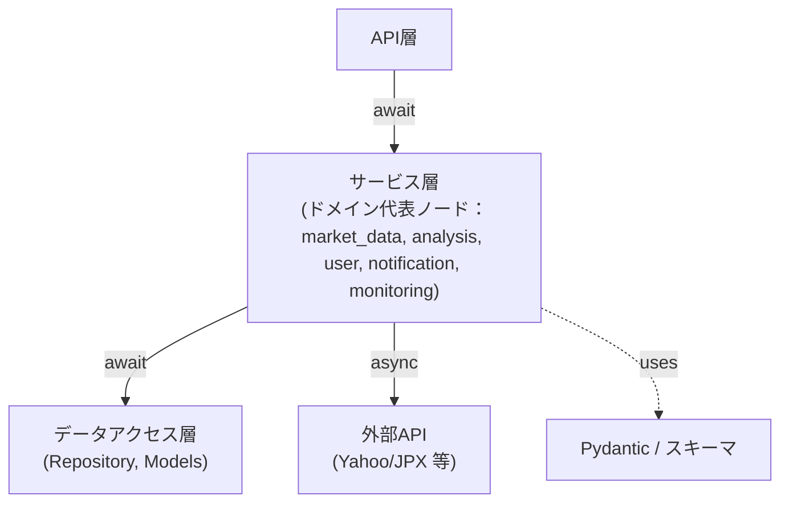
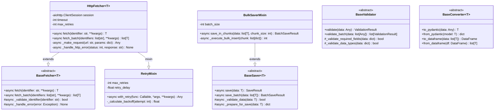
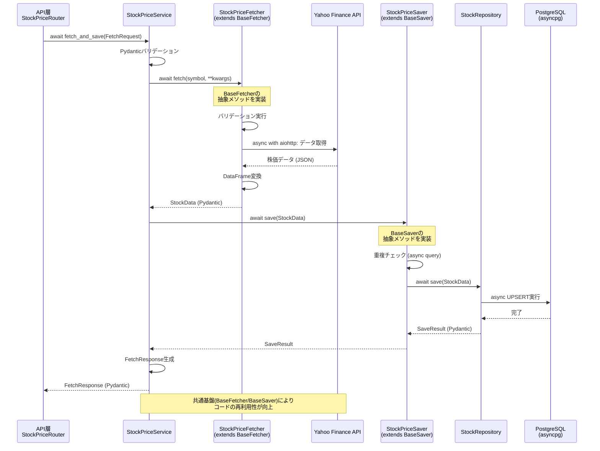
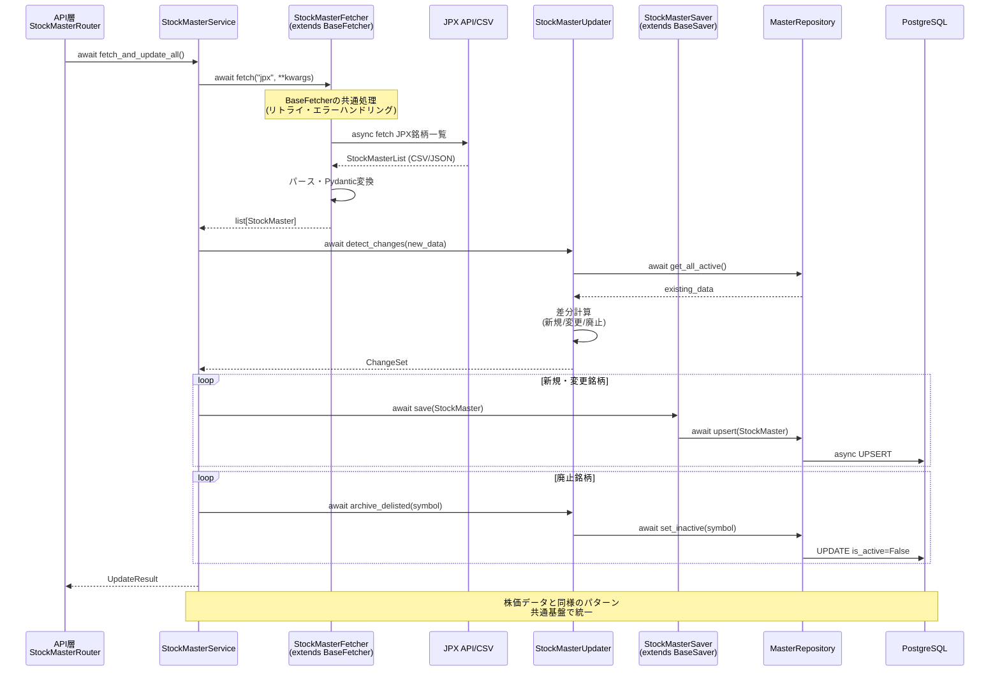
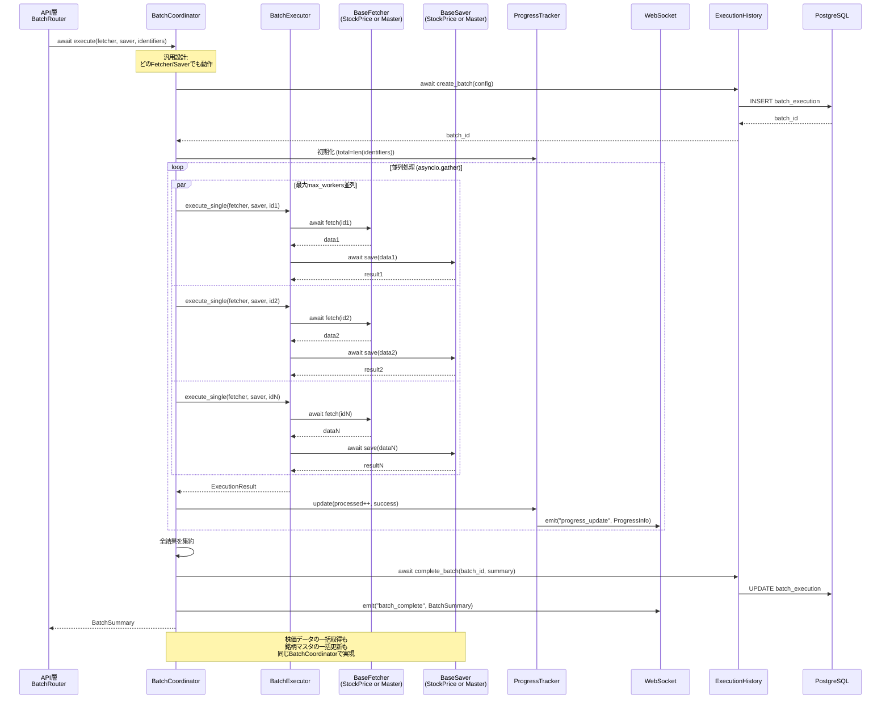

category: architecture
ai_context: high
last_updated: 2025-11-16
related_docs:
  - ../architecture_overview.md
  - ./api_layer.md
  - ./data_access_layer.md
  - ../../tasks/refactoring/service_layer_plan.md

# サービス層 仕様書

## 目次

- [1. 概要](#1-概要)
- [2. 構成](#2-構成)
- [3. サービスモジュール一覧](#3-サービスモジュール一覧)
- [4. クラス図](#4-クラス図)
- [5. シーケンス図](#5-シーケンス図)
- [6. 主要サービス詳細](#6-主要サービス詳細)
- [7. 型定義とPydantic統合](#7-型定義とpydantic統合)
- [8. 依存性注入パターン](#8-依存性注入パターン)

---

## 1. 概要

### 役割

サービス層は、**ビジネスロジックの実装を担当し、API層とデータアクセス層の橋渡し**をします。FastAPIの非同期処理能力を活用し、4,000銘柄規模の一括並列データ取得を効率的に実行します。

### 責務

| 責務                           | 説明                                                                                     | 実装方式                             |
| ------------------------------ | ---------------------------------------------------------------------------------------- | ------------------------------------ |
| **非同期ビジネスロジック実装** | 株価データ取得・保存・変換などの処理                                                     | async/await、asyncio.gather()        |
| **外部API連携**                | Yahoo Finance APIからの非同期データ取得                                                  | aiohttp / yfinance非同期ラッパー     |
| **トランザクション管理**       | 非同期DB操作のトランザクション制御                                                       | asyncpg、SQLAlchemy async session    |
| **Pydanticバリデーション**     | 入出力データの型検証とシリアライズ                                                       | Pydantic BaseModel                   |
| **エラーハンドリング**         | 例外の補足と適切な処理（詳細は[例外処理システム仕様書](../exception_handling.md)を参照） | FastAPI HTTPException、カスタム例外  |
| **データ変換**                 | 外部データの内部形式への変換                                                             | Pydantic型変換、pandas DataFrame処理 |
| **一括並列処理制御**           | 大量銘柄の一括データ取得時の非同期並列処理管理・進捗トラッキング                         | asyncio.gather()、セマフォ制御       |

### 設計原則

| 原則                       | 説明                                   | 実装例                                                            |
| -------------------------- | -------------------------------------- | ----------------------------------------------------------------- |
| **単一責任の原則 (SRP)**   | 各サービスは明確な責務を持つ           | StockDataService: データ取得専門、JPXStockService: 銘柄マスタ専門 |
| **依存性逆転の原則 (DIP)** | 抽象（インターフェース）に依存         | Repository Patternによる抽象化                                    |
| **疎結合**                 | サービス間の依存を最小限に             | 依存性注入によるモジュール間結合度低減                            |
| **再利用性**               | 共通機能はユーティリティとして切り出し | 型定義(`app/schemas/`)、共通処理(`app/utils/`)                    |
| **拡張性**                 | 新機能追加が容易な構成                 | Pydanticスキーマ駆動開発、OpenAPI自動生成                         |
| **型安全性**               | Pydanticによる実行時型検証             | 全サービスメソッドに型ヒント、Pydanticモデル活用                  |

---

## 2. 構成

### ディレクトリ構造（ドメイン駆動設計）

```
app/services/
├── core/                            # 共通基盤層（全ドメインで使用）
│   ├── fetchers/                    # データ取得抽象化
│   │   ├── __init__.py
│   │   ├── base_fetcher.py          # データ取得抽象基底クラス
│   │   ├── http_fetcher.py          # HTTP通信共通処理 (aiohttp)
│   │   └── retry_mixin.py           # リトライロジック
│   ├── savers/                      # データ保存抽象化
│   │   ├── __init__.py
│   │   ├── base_saver.py            # データ保存抽象基底クラス
│   │   └── bulk_saver_mixin.py      # 一括保存共通ロジック
│   ├── validators/                  # データ検証抽象化
│   │   ├── __init__.py
│   │   └── base_validator.py        # データ検証抽象基底クラス
│   ├── converters/                  # データ変換抽象化
│   │   ├── __init__.py
│   │   └── base_converter.py        # データ変換抽象基底クラス
│   └── decorators/                  # 共通デコレータ
│       ├── __init__.py
│       ├── error_handler.py         # エラーハンドリングデコレータ
│       └── retry.py                 # リトライデコレータ
├── market_data/                     # 市場データドメイン
│   ├── __init__.py
│   ├── stock_price/                 # 株価データサブドメイン
│   │   ├── __init__.py
│   │   ├── service.py               # StockPriceService (オーケストレーション)
│   │   ├── fetcher.py               # Yahoo Finance API経由で株価取得
│   │   ├── saver.py                 # 株価データDB保存
│   │   ├── validator.py             # 株価データ検証
│   │   └── converter.py             # DataFrame⇔Pydantic変換
│   ├── stock_master/                # 銘柄マスタサブドメイン（JPX）
│   │   ├── __init__.py
│   │   ├── service.py               # StockMasterService (オーケストレーション)
│   │   ├── fetcher.py               # JPX APIまたはCSVから銘柄マスタ取得
│   │   ├── saver.py                 # 銘柄マスタDB保存
│   │   ├── updater.py               # 定期更新ロジック
│   │   └── validator.py             # 銘柄マスタ検証
│   ├── fundamentals/                # ファンダメンタルデータサブドメイン
│   │   ├── __init__.py
│   │   ├── service.py               # FundamentalDataService
│   │   ├── fetcher.py               # 財務データ取得 (非同期)
│   │   ├── saver.py                 # 財務データ保存
│   │   └── calculator.py            # 財務指標計算
│   └── market_indices/              # 市場インデックスサブドメイン
│       ├── __init__.py
│       ├── service.py               # MarketIndexService
│       ├── fetcher.py               # インデックスデータ取得 (非同期)
│       └── saver.py                 # インデックスデータ保存
├── batch/                           # ドメイン横断バッチ処理基盤
│   ├── __init__.py
│   ├── coordinator.py               # BatchCoordinator (汎用バッチ調整)
│   ├── executor.py                  # BatchExecutor (並列実行エンジン)
│   ├── progress_tracker.py          # BatchProgressTracker (進捗管理)
│   ├── result_processor.py          # BatchResultProcessor (結果処理)
│   └── execution_history.py         # BatchExecutionHistory (履歴管理)
├── analysis/                        # 分析・解析ドメイン
│   ├── __init__.py
│   ├── screening/                   # スクリーニングサブドメイン
│   │   ├── __init__.py
│   │   ├── service.py               # ScreeningService
│   │   ├── executor.py              # 条件フィルタ実行 (非同期)
│   │   └── storage.py               # スクリーニング結果保存 (非同期)
│   └── backtest/                    # バックテストサブドメイン
│       ├── __init__.py
│       ├── service.py               # BacktestService
│       ├── engine.py                # バックテスト実行エンジン (非同期)
│       └── analyzer.py              # 結果分析・可視化
├── user/                            # ユーザー管理ドメイン
│   ├── __init__.py
│   ├── auth/                        # 認証サブドメイン
│   │   ├── __init__.py
│   │   ├── service.py               # AuthService (認証・認可管理)
│   │   ├── password_hasher.py       # パスワードハッシュ化
│   │   └── token_manager.py         # JWT トークン管理
│   ├── profile/                     # ユーザープロフィールサブドメイン
│   │   ├── __init__.py
│   │   └── service.py               # UserProfileService
│   ├── settings/                    # ユーザー設定サブドメイン
│   │   ├── __init__.py
│   │   └── service.py               # UserSettingsService
│   └── portfolio/                   # ポートフォリオサブドメイン
│       ├── __init__.py
│       ├── service.py               # PortfolioService
│       └── calculator.py            # 評価額・損益計算
├── notification/                    # 通知ドメイン
│   ├── __init__.py
│   ├── service.py                   # NotificationService (通知管理)
│   ├── alert_service.py             # AlertService (アラート管理)
│   └── sender.py                    # NotificationSender (通知送信)
└── monitoring/                      # システム監視ドメイン
    ├── __init__.py
    └── service.py                   # SystemMonitoringService
```

### 依存関係（目的別図：設計者向け・開発者向け）

以下では大きな単一図を廃し、目的（設計者／開発者）に応じて抽象度を切り替えた図を並べます。

#### 設計者向け（高レベル図）

設計者はシステムの境界・責務分離・主要依存を素早く把握する必要があるため、レイヤ（API / サービス / データ / 外部）だけを示します。



注：この図は「誰がどこに依存しているか」の概観のみを示します。実装詳細（クラスや継承、細かな矢印）は開発者向け図で扱います。


#### 開発者向け（実装詳細の参照）

開発者向けの詳細なクラス／継承関係は本ドキュメントのセクション4（クラス図）に集約しています。
実装上の依存追跡や詳細設計を確認する際は、まずセクション4の以下を参照してください：

- セクション4.1: 共通基盤（Core）のクラス図（BaseFetcher, BaseSaver 等）
- セクション4.2: 市場データドメイン（market_data）のクラス図
- セクション4.3: バッチ処理基盤（batch）のクラス図

ここに別途図を追加するのは、クラス図で表現しきれない実行フロー（シーケンス図）やドメイン横断の依存を可視化したい場合に限定してください。重複を避けるため、クラス図と同等の情報はここで繰り返さない運用ルールを推奨します。

#### 図の読み方の補足（凡例）
- 実線矢印（-->）：非同期/同期の直接呼び出し（図中で適宜注記）
- 破線矢印（-.->）：継承や "extends / uses" の関係
- 各図は目的に応じた抽象度で作成されています。レビュー時は設計者向け図で境界確認、実装時は開発者向け図で依存追跡を行ってください。


### レイヤー間の通信（非同期パターン）

| 通信パス                          | プロトコル               | データ形式          | 実装例                                        |
| --------------------------------- | ------------------------ | ------------------- | --------------------------------------------- |
| **API層 → サービス層**            | 非同期関数呼び出し       | Pydanticモデル      | `await stock_service.fetch_and_save(request)` |
| **サービス層 → データアクセス層** | 非同期Repository呼び出し | Pydanticモデル/dict | `await stock_repo.save(data)`                 |
| **サービス層 → 外部API**          | 非同期HTTP通信           | JSON/DataFrame      | `async with aiohttp.ClientSession()`          |
| **サービス層内部**                | 非同期並列処理           | Pydanticモデル      | `await asyncio.gather(*tasks)`                |

---

## 3. サービスモジュール一覧（ドメイン駆動設計）

### 3.1 共通基盤層 (Core)

**役割**: 全ドメインで共有される抽象基底クラスと共通処理

| モジュール              | クラス/関数     | 責務                             | 実装方式          | 型定義                |
| ----------------------- | --------------- | -------------------------------- | ----------------- | --------------------- |
| **base_fetcher.py**     | BaseFetcher     | データ取得の抽象基底クラス       | ABC, Generic[T]   | TypeVar T             |
| **http_fetcher.py**     | HttpFetcher     | HTTP通信共通処理(aiohttp)        | BaseFetcherの実装 | aiohttp ClientSession |
| **retry_mixin.py**      | RetryMixin      | リトライロジック                 | Mixin             | -                     |
| **base_saver.py**       | BaseSaver       | データ保存の抽象基底クラス       | ABC, Generic[T]   | TypeVar T             |
| **bulk_saver_mixin.py** | BulkSaverMixin  | 一括保存共通ロジック             | Mixin             | -                     |
| **base_validator.py**   | BaseValidator   | データ検証の抽象基底クラス       | ABC               | -                     |
| **base_converter.py**   | BaseConverter   | データ変換の抽象基底クラス       | ABC, Generic[T]   | TypeVar T             |
| **error_handler.py**    | @handle_error   | エラーハンドリング統一デコレータ | デコレータ        | -                     |
| **retry.py**            | @retry_on_error | リトライ制御デコレータ           | デコレータ        | -                     |

**設計ポイント**:
- ✅ **抽象基底クラス(ABC)による型安全性**
- ✅ **ジェネリクス(Generic[T])で型パラメータ化**
- ✅ **Mixinパターンで機能の水平展開**
- ✅ **デコレータで横断的関心事を分離**

---

### 3.2 市場データドメイン (Market Data)

**役割**: 株価・銘柄マスタ・ファンダメンタル・インデックスなど市場関連データの管理

#### 3.2.1 株価データサブドメイン (Stock Price)

| モジュール       | クラス              | 責務                            | 非同期対応    | 継承元        | 型定義                              |
| ---------------- | ------------------- | ------------------------------- | ------------- | ------------- | ----------------------------------- |
| **service.py**   | StockPriceService   | 株価データ取得・保存統括        | ✅ async/await | -             | Pydantic FetchRequest/FetchResponse |
| **fetcher.py**   | StockPriceFetcher   | Yahoo Finance APIからデータ取得 | ✅ aiohttp     | BaseFetcher   | Pydantic StockData                  |
| **saver.py**     | StockPriceSaver     | データベースへの株価保存        | ✅ asyncpg     | BaseSaver     | Pydantic SaveResult                 |
| **validator.py** | StockPriceValidator | 株価データ検証                  | -             | BaseValidator | Pydantic Field validation           |
| **converter.py** | StockPriceConverter | DataFrame⇔Pydantic変換          | -             | BaseConverter | Pydantic型変換                      |

#### 3.2.2 銘柄マスタサブドメイン (Stock Master / JPX)

| モジュール       | クラス               | 責務                             | 非同期対応    | 継承元        | 型定義                    |
| ---------------- | -------------------- | -------------------------------- | ------------- | ------------- | ------------------------- |
| **service.py**   | StockMasterService   | JPX銘柄マスタ統括管理            | ✅ async/await | -             | Pydantic StockMaster      |
| **fetcher.py**   | StockMasterFetcher   | JPX API/CSVから銘柄マスタ取得    | ✅ aiohttp/csv | BaseFetcher   | Pydantic StockMasterList  |
| **saver.py**     | StockMasterSaver     | 銘柄マスタDB保存                 | ✅ asyncpg     | BaseSaver     | Pydantic SaveResult       |
| **updater.py**   | StockMasterUpdater   | 定期更新ロジック(新規・廃止検出) | ✅ async/await | -             | Pydantic UpdateResult     |
| **validator.py** | StockMasterValidator | 銘柄マスタ検証                   | -             | BaseValidator | Pydantic Field validation |

**主要機能**:
- ✅ **JPX上場銘柄の自動取得・更新**
- ✅ **新規上場・上場廃止の検出**
- ✅ **銘柄情報の変更履歴管理**
- ✅ **バッチ処理による定期更新**

#### 3.2.3 ファンダメンタルデータサブドメイン (Fundamentals)

| モジュール        | クラス                | 責務                           | 非同期対応    | 継承元      | 型定義                               |
| ----------------- | --------------------- | ------------------------------ | ------------- | ----------- | ------------------------------------ |
| **service.py**    | FundamentalService    | ファンダメンタルデータ統合管理 | ✅ async/await | -           | Pydantic FundamentalRequest/Response |
| **fetcher.py**    | FundamentalFetcher    | 財務データ取得                 | ✅ async/await | BaseFetcher | Pydantic FundamentalData             |
| **saver.py**      | FundamentalSaver      | 財務データ保存                 | ✅ asyncpg     | BaseSaver   | Pydantic SaveResult                  |
| **calculator.py** | FundamentalCalculator | 財務指標計算                   | -             | -           | Pydantic CalculatedMetrics           |

#### 3.2.4 市場インデックスサブドメイン (Market Indices)

| モジュール     | クラス       | 責務                   | 非同期対応    | 継承元      | 型定義                 |
| -------------- | ------------ | ---------------------- | ------------- | ----------- | ---------------------- |
| **service.py** | IndexService | インデックス管理       | ✅ async/await | -           | Pydantic IndexData     |
| **fetcher.py** | IndexFetcher | インデックスデータ取得 | ✅ async/await | BaseFetcher | Pydantic IndexResponse |
| **saver.py**   | IndexSaver   | インデックスデータ保存 | ✅ asyncpg     | BaseSaver   | Pydantic SaveResult    |

---

### 3.3 バッチ処理基盤 (Batch)

**役割**: ドメイン横断の汎用バッチ処理（株価・銘柄マスタ・ファンダメンタル全てに対応）

| モジュール               | クラス               | 責務                         | 非同期対応         | 型定義                             |
| ------------------------ | -------------------- | ---------------------------- | ------------------ | ---------------------------------- |
| **coordinator.py**       | BatchCoordinator     | 汎用バッチ調整・並列処理制御 | ✅ asyncio.gather() | Pydantic BatchRequest/BatchSummary |
| **executor.py**          | BatchExecutor        | 並列実行エンジン             | ✅ async/await      | Pydantic ExecutionResult           |
| **progress_tracker.py**  | BatchProgressTracker | 進捗管理                     | ✅ WebSocket配信    | Pydantic ProgressInfo              |
| **result_processor.py**  | BatchResultProcessor | 結果処理・集計               | ✅ async/await      | Pydantic ProcessSummary            |
| **execution_history.py** | ExecutionHistory     | バッチ実行履歴管理           | ✅ async/await      | Pydantic BatchExecution            |

**設計ポイント（汎用性の実現）**:
- ✅ **BaseFetcher/BaseSaverを受け取る設計** → あらゆるデータソースに対応
- ✅ **依存性注入で柔軟性確保**
- ✅ **並列度・リトライ・タイムアウトを設定可能**
- ✅ **進捗トラッキングをWebSocketでリアルタイム配信**

**使用例**:
```python
# 株価データの一括取得
batch_coordinator.execute(
    fetcher=StockPriceFetcher(),
    saver=StockPriceSaver(),
    identifiers=["7203.T", "6758.T", ...]
)

# 銘柄マスタの一括更新
batch_coordinator.execute(
    fetcher=StockMasterFetcher(),
    saver=StockMasterSaver(),
    identifiers=jpx_all_symbols
)
```

---

### 3.4 分析・解析ドメイン (Analysis)

**役割**: スクリーニング・バックテストなどの分析機能

#### 3.4.1 スクリーニングサブドメイン (Screening)

| モジュール      | クラス            | 責務                   | 非同期対応    | 型定義                           |
| --------------- | ----------------- | ---------------------- | ------------- | -------------------------------- |
| **service.py**  | ScreeningService  | スクリーニング実行     | ✅ async/await | Pydantic ScreeningRequest/Result |
| **executor.py** | ScreeningExecutor | 条件フィルタ実行       | ✅ async/await | Pydantic FilterCondition         |
| **storage.py**  | ScreeningStorage  | スクリーニング結果保存 | ✅ async/await | Pydantic SavedScreening          |

**主要機能**:
- ✅ **複数条件のAND/OR組み合わせ**
- ✅ **ソート機能(昇順/降順)**
- ✅ **プリセット条件の提供(割安株、高配当株、成長株等)**
- ✅ **CSV/Excel形式でのエクスポート**

#### 3.4.2 バックテストサブドメイン (Backtest)

| モジュール      | クラス           | 責務                     | 非同期対応    | 型定義                          |
| --------------- | ---------------- | ------------------------ | ------------- | ------------------------------- |
| **service.py**  | BacktestService  | バックテスト実行管理     | ✅ async/await | Pydantic BacktestRequest/Result |
| **engine.py**   | BacktestEngine   | バックテスト実行エンジン | ✅ async/await | Pydantic BacktestConfig         |
| **analyzer.py** | BacktestAnalyzer | 結果分析・可視化         | -             | Pydantic PerformanceMetrics     |

**主要機能**:
- ✅ **シンプル移動平均クロス戦略の実装**
- ✅ **総収益率、シャープレシオ、最大ドローダウンの算出**
- ✅ **売買タイミングの記録と可視化**
- ✅ **手数料・スリッページの考慮**

---

### 3.5 ユーザー管理ドメイン (User)

**役割**: 認証・プロフィール・設定・ポートフォリオなどユーザー関連機能

#### 3.5.1 認証サブドメイン (Auth)

| モジュール             | クラス         | 責務                 | 非同期対応    | 型定義                      |
| ---------------------- | -------------- | -------------------- | ------------- | --------------------------- |
| **service.py**         | AuthService    | 認証・認可管理       | ✅ async/await | Pydantic LoginRequest/Token |
| **password_hasher.py** | PasswordHasher | パスワードハッシュ化 | -             | bcrypt                      |
| **token_manager.py**   | TokenManager   | JWTトークン管理      | -             | jose.jwt                    |

**主要機能**:
- ✅ **JWT認証方式（アクセストークン・リフレッシュトークン）**
- ✅ **パスワードハッシュ化(bcrypt)**
- ✅ **トークン検証・リフレッシュ**

#### 3.5.2 プロフィールサブドメイン (Profile)

| モジュール     | クラス         | 責務                     | 非同期対応    | 型定義               |
| -------------- | -------------- | ------------------------ | ------------- | -------------------- |
| **service.py** | ProfileService | ユーザープロフィール管理 | ✅ async/await | Pydantic UserProfile |

**主要機能**:
- ✅ **プロフィール編集（メールアドレス、表示名、アバター画像）**
- ✅ **パスワード変更**

#### 3.5.3 設定サブドメイン (Settings)

| モジュール     | クラス          | 責務             | 非同期対応    | 型定義                |
| -------------- | --------------- | ---------------- | ------------- | --------------------- |
| **service.py** | SettingsService | ユーザー設定管理 | ✅ async/await | Pydantic UserSettings |

**主要機能**:
- ✅ **テーマ切替(ライト/ダーク)**
- ✅ **言語切替(日本語/英語)**
- ✅ **チャート設定のカスタマイズ**

#### 3.5.4 ポートフォリオサブドメイン (Portfolio)

| モジュール        | クラス              | 責務               | 非同期対応    | 型定義                    |
| ----------------- | ------------------- | ------------------ | ------------- | ------------------------- |
| **service.py**    | PortfolioService    | ポートフォリオ管理 | ✅ async/await | Pydantic PortfolioSummary |
| **calculator.py** | PortfolioCalculator | 評価額・損益計算   | -             | Pydantic PortfolioMetrics |

**主要機能**:
- ✅ **ポートフォリオ評価額、保有銘柄一覧、損益情報の計算**
- ✅ **リアルタイム株価との連動で現在評価額を計算**
- ✅ **銘柄別保有数量・平均取得単価・現在価格・損益率を算出**

---

### 3.6 通知ドメイン (Notification)

**役割**: 通知管理とアラート機能

| モジュール           | クラス              | 責務         | 非同期対応    | 型定義                        |
| -------------------- | ------------------- | ------------ | ------------- | ----------------------------- |
| **service.py**       | NotificationService | 通知管理     | ✅ async/await | Pydantic NotificationSettings |
| **alert_service.py** | AlertService        | アラート管理 | ✅ async/await | Pydantic Alert                |
| **sender.py**        | NotificationSender  | 通知送信     | ✅ async/await | Pydantic SendResult           |

**主要機能**:
- ✅ **株価アラート(目標価格到達時)**
- ✅ **バッチ処理完了通知**
- ✅ **バックテスト完了通知**
- ✅ **メール通知/ブラウザ通知/WebSocket通知の切り替え**

---

### 3.7 システム監視ドメイン (Monitoring)

**役割**: システムヘルスチェックと監視

| モジュール     | クラス            | 責務                   | 非同期対応    | 型定義                     |
| -------------- | ----------------- | ---------------------- | ------------- | -------------------------- |
| **service.py** | MonitoringService | システムヘルスチェック | ✅ async/await | Pydantic HealthCheckResult |

**主要機能**:
- ✅ **データベース接続状態確認**
- ✅ **Yahoo Finance API接続確認**
- ✅ **CPU使用率、メモリ使用率、ディスク使用率の監視**

---

## 4. クラス図（ドメイン駆動設計）

### 4.1 共通基盤層 (Core)



### 4.2 市場データドメイン - 株価データ・銘柄マスタ

```mermaid
classDiagram
    %% 共通基盤（継承元）
    class BaseFetcher~T~ {
        <<abstract>>
        +async fetch(identifier, **kwargs) T
        +async fetch_batch(identifiers, **kwargs) list[T]
    }

    class BaseSaver~T~ {
        <<abstract>>
        +async save(data: T) SaveResult
        +async save_batch(data: list[T]) BatchSaveResult
    }

    %% 株価データサブドメイン
    class StockPriceService {
        -StockPriceFetcher fetcher
        -StockPriceSaver saver
        -StockPriceConverter converter
        +async fetch_and_save(request: FetchRequest) FetchResponse
        +async fetch_multiple_timeframes(symbol, intervals) dict
        +async check_data_integrity(symbol, interval) IntegrityResult
    }

    class StockPriceFetcher {
        -StockPriceValidator validator
        -aiohttp.ClientSession session
        +async fetch(symbol: str, **kwargs) StockData
        +async fetch_batch(symbols: list[str], **kwargs) list[StockData]
        -async _download_from_yahoo(symbol, interval, period) DataFrame
    }

    class StockPriceSaver {
        -StockRepository repository
        +async save(data: StockData) SaveResult
        +async save_batch(data: list[StockData]) BatchSaveResult
        -async _filter_duplicates(symbol, interval, data) DataFrame
    }

    %% 銘柄マスタサブドメイン
    class StockMasterService {
        -StockMasterFetcher fetcher
        -StockMasterSaver saver
        -StockMasterUpdater updater
        +async fetch_and_update_all() UpdateResult
        +async detect_new_listings() list[StockMaster]
        +async detect_delistings() list[StockMaster]
    }

    class StockMasterFetcher {
        -StockMasterValidator validator
        +async fetch(source: str, **kwargs) StockMasterList
        +async fetch_batch(sources: list[str], **kwargs) list[StockMasterList]
        -async _fetch_from_jpx_api() StockMasterList
        -async _fetch_from_csv(path: str) StockMasterList
    }

    class StockMasterSaver {
        -MasterRepository repository
        +async save(data: StockMaster) SaveResult
        +async save_batch(data: list[StockMaster]) BatchSaveResult
        -async _detect_changes(existing, new) ChangeSet
    }

    class StockMasterUpdater {
        -MasterRepository repository
        +async update_listings() UpdateResult
        +async archive_delisted(symbol: str) bool
        -async _compare_with_existing(new_data) DiffResult
    }

    %% Pydanticモデル
    class FetchRequest {
        +symbol: str
        +interval: Interval
        +period: Optional[str]
    }

    class StockData {
        +symbol: str
        +date: datetime
        +open: float
        +high: float
        +low: float
        +close: float
        +volume: int
    }

    class StockMaster {
        +symbol: str
        +company_name: str
        +market: str
        +sector: str
        +listing_date: date
        +is_active: bool
    }

    %% 継承関係
    StockPriceFetcher --|> BaseFetcher : extends
    StockPriceSaver --|> BaseSaver : extends
    StockMasterFetcher --|> BaseFetcher : extends
    StockMasterSaver --|> BaseSaver : extends

    %% 依存関係
    StockPriceService --> StockPriceFetcher : uses
    StockPriceService --> StockPriceSaver : uses
    StockMasterService --> StockMasterFetcher : uses
    StockMasterService --> StockMasterSaver : uses
    StockMasterService --> StockMasterUpdater : uses

    StockPriceService ..> FetchRequest : accepts
    StockPriceFetcher ..> StockData : returns
    StockMasterFetcher ..> StockMaster : returns
```



### 4.3 バッチ処理基盤モジュール（汎用設計）

```mermaid
classDiagram
    %% 共通基盤（依存先）
    class BaseFetcher~T~ {
        <<abstract>>
        +async fetch(identifier, **kwargs) T
        +async fetch_batch(identifiers, **kwargs) list[T]
    }

    class BaseSaver~T~ {
        <<abstract>>
        +async save(data: T) SaveResult
        +async save_batch(data: list[T]) BatchSaveResult
    }

    %% バッチ処理基盤（汎用）
    class BatchCoordinator {
        -BatchExecutor executor
        -BatchProgressTracker progress_tracker
        -BatchResultProcessor result_processor
        -ExecutionHistory history
        -int max_workers
        +async execute(fetcher: BaseFetcher, saver: BaseSaver, identifiers: list[str]) BatchSummary
        +async execute_with_config(config: BatchConfig) BatchSummary
        +async estimate_completion_time(total, completed, elapsed) dict
        -async _coordinate_parallel_execution(tasks: list) list
        -async _process_batch_results(results: list) BatchSummary
    }

    class BatchExecutor {
        -int max_workers
        -asyncio.Semaphore semaphore
        +async execute_parallel(fetcher: BaseFetcher, saver: BaseSaver, identifiers: list[str]) list[ExecutionResult]
        +async execute_single(fetcher: BaseFetcher, saver: BaseSaver, identifier: str) ExecutionResult
        -async _execute_with_semaphore(task: Callable) Any
        -async _handle_execution_error(identifier: str, error: Exception) ExecutionResult
    }

    class BatchProgressTracker {
        -int total
        -int processed
        -int successful
        -int failed
        -datetime start_time
        +update(increment: int, success: bool) void
        +get_progress() ProgressInfo
        +get_eta() float
        +async broadcast_progress(websocket) void
        +reset() void
    }

    class BatchResultProcessor {
        -ExecutionHistory history
        +async process_results(results: list[ExecutionResult]) ProcessSummary
        +async save_batch_record(batch_id: int, results: list) void
        +async generate_summary(results: list) BatchSummary
        -_calculate_statistics(results: list) dict
        -_group_by_status(results: list) dict
    }

    class ExecutionHistory {
        -BatchRepository repository
        +async create_batch(config: BatchConfig) int
        +async complete_batch(batch_id: int, summary: BatchSummary) void
        +async get_batch_history(limit: int) list[BatchExecution]
        +async get_batch_status(batch_id: int) BatchStatus
    }

    %% Pydanticモデル
    class BatchConfig {
        +data_source: str
        +identifiers: list[str]
        +max_workers: int
        +timeout: int
        +retry_count: int
    }

    class BatchRequest {
        +symbols: list[str]
        +interval: Interval
        +period: Optional[str]
        +max_workers: int
    }

    class BatchSummary {
        +total: int
        +successful: int
        +failed: int
        +duration_seconds: float
        +batch_id: int
        +start_time: datetime
        +end_time: datetime
    }

    class ExecutionResult {
        +success: bool
        +identifier: str
        +records_saved: int
        +error: Optional[str]
        +duration_ms: int
    }

    class ProgressInfo {
        +total: int
        +processed: int
        +successful: int
        +failed: int
        +progress_percentage: float
        +eta_seconds: float
        +current_rate: float
    }

    %% 依存関係
    BatchCoordinator --> BatchExecutor : uses
    BatchCoordinator --> BatchProgressTracker : uses
    BatchCoordinator --> BatchResultProcessor : uses
    BatchCoordinator --> ExecutionHistory : uses
    BatchExecutor --> BaseFetcher : accepts any
    BatchExecutor --> BaseSaver : accepts any
    BatchResultProcessor --> ExecutionHistory : uses

    %% データモデル
    BatchCoordinator ..> BatchRequest : accepts
    BatchCoordinator ..> BatchConfig : accepts
    BatchCoordinator ..> BatchSummary : returns
    BatchExecutor ..> ExecutionResult : returns
    BatchProgressTracker ..> ProgressInfo : emits

    note for BatchCoordinator "汎用設計: あらゆるFetcher/Saverに対応\n- StockPriceFetcher/Saver\n- StockMasterFetcher/Saver\n- FundamentalFetcher/Saver"
```



**注**: その他のドメイン(分析・ユーザー・通知・監視)のクラス図詳細は、必要に応じて各ドメインのドキュメントを参照してください。

---

## 5. シーケンス図（ドメイン駆動設計）

### 5.1 株価データ取得・保存フロー（共通基盤の活用）



### 5.2 銘柄マスタ更新フロー（JPX）



### 5.3 汎用バッチ処理フロー（株価・銘柄マスタ共通）



### 5.4 ファンダメンタルデータ取得フロー

**注**: ファンダメンタルデータも市場データドメインの一部として、株価データと同様のパターン(BaseFetcher/BaseSaver継承)で実装されます。詳細は省略しますが、5.1と同じフローになります。

---

## 6. 主要サービス詳細

**注**: 主要サービスの詳細仕様は、元のセクション3の各ドメイン説明を参照してください。ここでは、ドメイン駆動設計における重要な設計パターンを補足します。

### 6.1 共通基盤層の設計パターン

#### Strategy パターン (BaseFetcher/BaseSaver)

```python
# app/services/core/fetchers/base_fetcher.py
from abc import ABC, abstractmethod
from typing import TypeVar, Generic, List

T = TypeVar('T')

class BaseFetcher(ABC, Generic[T]):
    """データ取得の抽象基底クラス（Strategy パターン）"""

    @abstractmethod
    async def fetch(self, identifier: str, **kwargs) -> T:
        """単一データ取得（サブクラスで実装）"""
        pass

    @abstractmethod
    async def fetch_batch(self, identifiers: List[str], **kwargs) -> List[T]:
        """複数データ一括取得（サブクラスで実装）"""
        pass
```

#### Template Method パターン

```python
# app/services/market_data/stock_price/fetcher.py
class StockPriceFetcher(BaseFetcher[StockData]):
    """BaseFetcherを継承して具体的な取得処理を実装"""

    async def fetch(self, symbol: str, **kwargs) -> StockData:
        # 1. バリデーション（共通処理）
        await self._validate_identifier(symbol)

        # 2. データ取得（サブクラス固有）
        raw_data = await self._download_from_yahoo(symbol, **kwargs)

        # 3. 変換（サブクラス固有）
        return self._convert_to_pydantic(raw_data)
```

### 6.2 依存性注入パターン（ドメイン別）

#### 市場データドメイン

```python
# app/api/dependencies/market_data.py
async def get_stock_price_service(
    db: AsyncSession = Depends(get_db)
) -> StockPriceService:
    """StockPriceService の依存性注入"""
    repository = StockRepository(db)
    fetcher = StockPriceFetcher()
    saver = StockPriceSaver(repository)
    return StockPriceService(fetcher, saver)

async def get_stock_master_service(
    db: AsyncSession = Depends(get_db)
) -> StockMasterService:
    """StockMasterService の依存性注入"""
    repository = MasterRepository(db)
    fetcher = StockMasterFetcher()
    saver = StockMasterSaver(repository)
    updater = StockMasterUpdater(repository)
    return StockMasterService(fetcher, saver, updater)
```

#### バッチ処理基盤

```python
# app/api/dependencies/batch.py
async def get_batch_coordinator(
    db: AsyncSession = Depends(get_db)
) -> BatchCoordinator:
    """BatchCoordinator の依存性注入（汎用）"""
    executor = BatchExecutor(max_workers=10)
    progress_tracker = BatchProgressTracker()
    result_processor = BatchResultProcessor()
    history = ExecutionHistory(db)
    return BatchCoordinator(
        executor, progress_tracker, result_processor, history
    )
```

---

## 7. 型定義とPydantic統合

**注**: 型定義の配置戦略は元のセクション7.1を参照してください。ドメイン駆動設計により、以下のように整理されます:

```
app/schemas/
├── common.py                    # 共通型定義
├── market_data/                 # 市場データドメイン
│   ├── stock_price.py           # FetchRequest, StockData等
│   ├── stock_master.py          # StockMaster, UpdateResult等
│   ├── fundamentals.py          # FundamentalData等
│   └── indices.py               # IndexData等
├── batch.py                     # BatchRequest, BatchSummary等
├── analysis/                    # 分析ドメイン
│   ├── screening.py
│   └── backtest.py
├── user/                        # ユーザードメイン
│   ├── auth.py
│   ├── profile.py
│   ├── settings.py
│   └── portfolio.py
└── notification.py              # 通知ドメイン
```

---

## 8. ドメイン駆動設計のメリット

### 8.1 従来設計との比較

| 観点                 | 従来設計(機能別)                     | ドメイン駆動設計                                       |
| -------------------- | ------------------------------------ | ------------------------------------------------------ |
| **ディレクトリ構造** | stock_data/, jpx/, batch/が別々      | market_data/{stock_price, stock_master}として統合      |
| **コード重複**       | 株価とJPXで類似処理が重複            | BaseFetcher/BaseSaverで共通化                          |
| **バッチ処理**       | stock_data専用のbatch_coordinator    | 汎用BatchCoordinatorであらゆるデータソースに対応       |
| **拡張性**           | 新データソース追加時に個別実装が必要 | BaseFetcher/Saverを継承するだけ                        |
| **ビジネス的理解**   | 技術的な分類(fetch/save)が中心       | ビジネスドメイン(市場データ/分析/ユーザー)が明確       |
| **テスタビリティ**   | モック作成が煩雑                     | 抽象基底クラスでインターフェース統一、モック注入が容易 |
| **保守性**           | 関連機能が散在                       | ドメインごとにまとまり、変更の影響範囲が明確           |

### 8.2 実装時の注意点

1. **共通基盤(core)の過度な抽象化を避ける**
   - 本当に共通化すべきものだけを抽象化
   - YAGNIの原則に従う

2. **ドメイン境界を明確に**
   - market_data と user ドメインは相互に直接依存しない
   - Repository層を通じてデータアクセス

3. **バッチ処理基盤の汎用性を維持**
   - 特定ドメインに依存しない設計
   - BaseFetcher/BaseSaverのインターフェースを厳密に守る

---

## 関連ドキュメント

- [アーキテクチャ概要](../architecture_overview.md)
- [API層仕様書](./api_layer.md)
- [データアクセス層仕様書](./data_access_layer.md)
- [例外処理システム仕様書](../exception_handling.md)
- [サービス層リファクタリング計画](../../tasks/refactoring/service_layer_plan.md)

---

**最終更新**: 2025-11-16
**設計方針**: ドメイン駆動設計(DDD) + 共通基盤による再利用性向上
