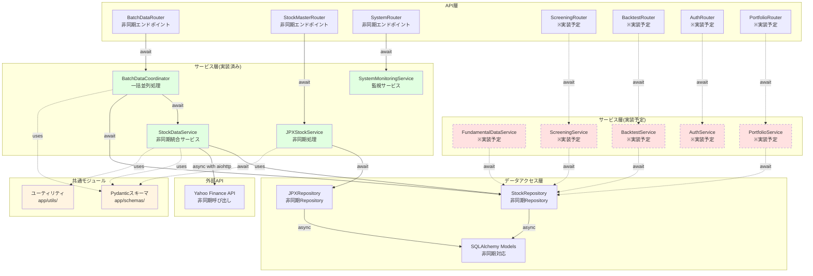
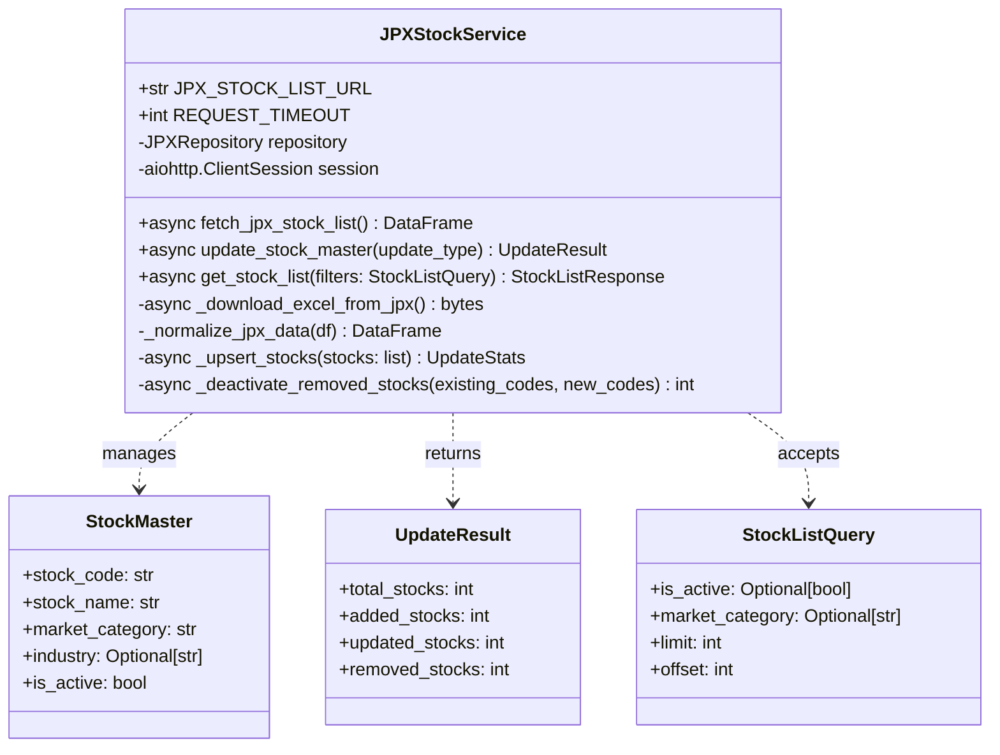
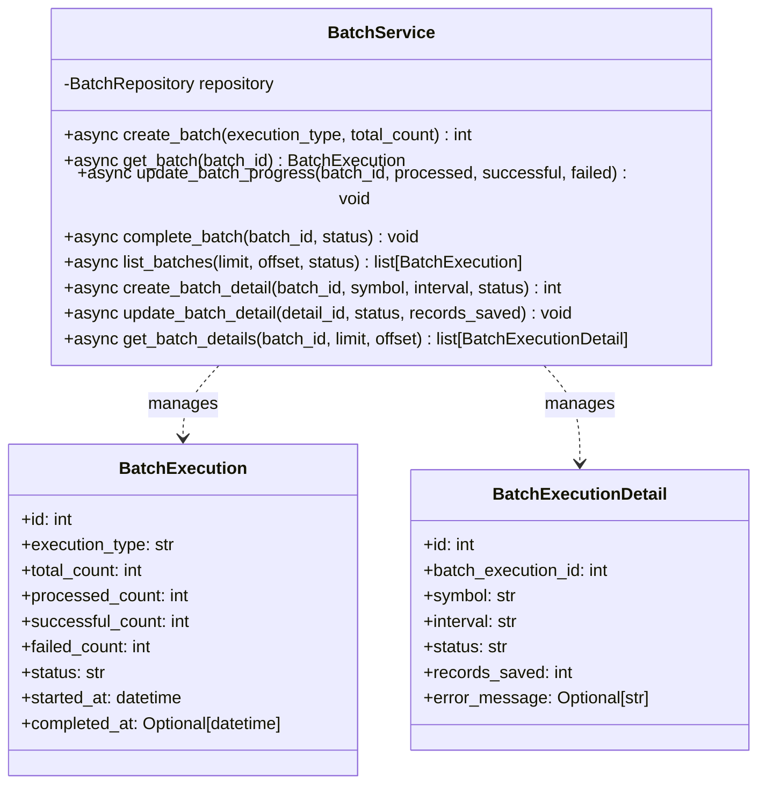
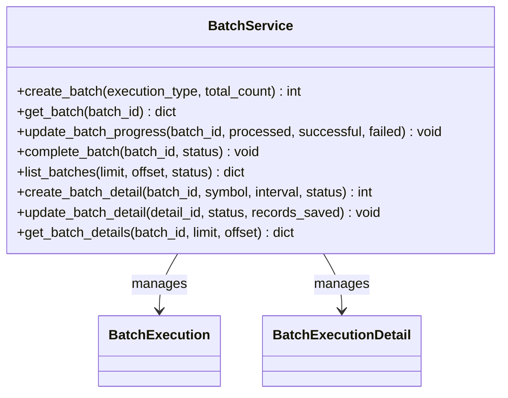
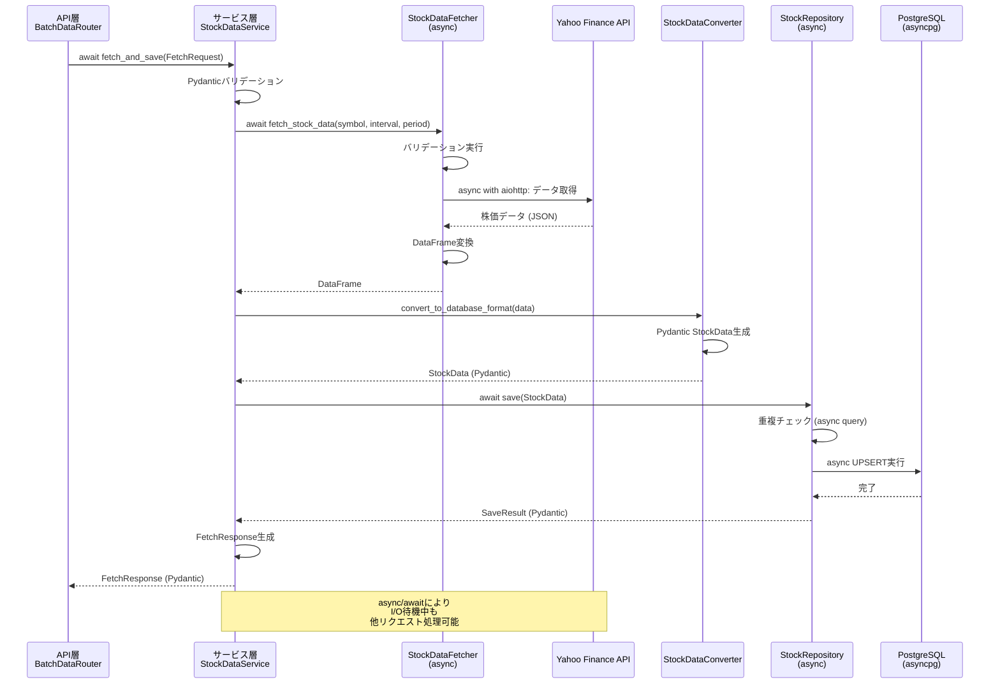
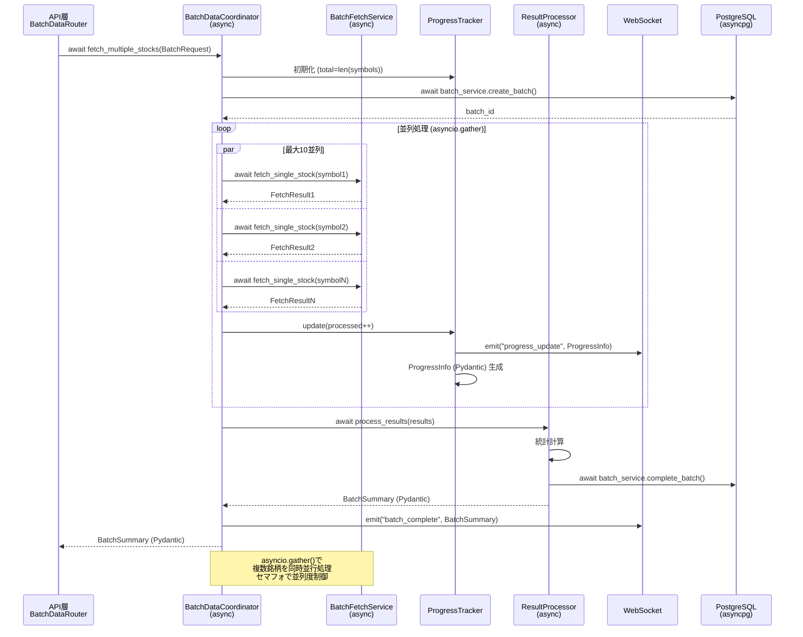
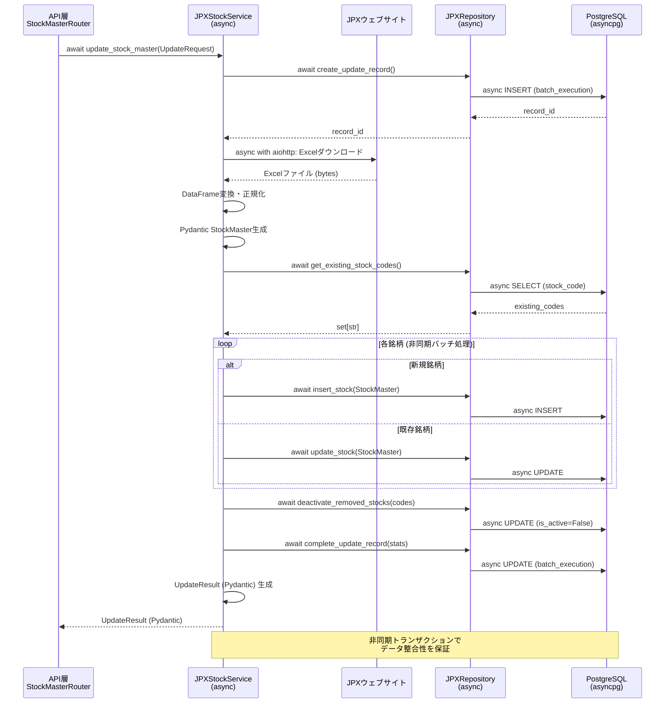

category: architecture
ai_context: high
last_updated: 2025-11-15
related_docs:
  - ../architecture_overview.md
  - ./api_layer.md
  - ./data_access_layer.md
  - ../../tasks/refactoring/service_layer_plan.md

# サービス層 仕様書

## 目次

- [1. 概要](#1-概要)
- [2. 構成](#2-構成)
- [3. サービスモジュール一覧](#3-サービスモジュール一覧)
- [4. クラス図](#4-クラス図)
- [5. シーケンス図](#5-シーケンス図)
- [6. 主要サービス詳細](#6-主要サービス詳細)
- [7. 型定義とPydantic統合](#7-型定義とpydantic統合)
- [8. 依存性注入パターン](#8-依存性注入パターン)

---

## 1. 概要

### 役割

サービス層は、**ビジネスロジックの実装を担当し、API層とデータアクセス層の橋渡し**をします。FastAPIの非同期処理能力を活用し、4,000銘柄規模の一括並列データ取得を効率的に実行します。

### 責務

| 責務                           | 説明                                                                                     | 実装方式                             |
| ------------------------------ | ---------------------------------------------------------------------------------------- | ------------------------------------ |
| **非同期ビジネスロジック実装** | 株価データ取得・保存・変換などの処理                                                     | async/await、asyncio.gather()        |
| **外部API連携**                | Yahoo Finance APIからの非同期データ取得                                                  | aiohttp / yfinance非同期ラッパー     |
| **トランザクション管理**       | 非同期DB操作のトランザクション制御                                                       | asyncpg、SQLAlchemy async session    |
| **Pydanticバリデーション**     | 入出力データの型検証とシリアライズ                                                       | Pydantic BaseModel                   |
| **エラーハンドリング**         | 例外の補足と適切な処理（詳細は[例外処理システム仕様書](../exception_handling.md)を参照） | FastAPI HTTPException、カスタム例外  |
| **データ変換**                 | 外部データの内部形式への変換                                                             | Pydantic型変換、pandas DataFrame処理 |
| **一括並列処理制御**         | 大量銘柄の一括データ取得時の非同期並列処理管理・進捗トラッキング                       | asyncio.gather()、セマフォ制御       |

### 設計原則

| 原則                       | 説明                                   | 実装例                                                            |
| -------------------------- | -------------------------------------- | ----------------------------------------------------------------- |
| **単一責任の原則 (SRP)**   | 各サービスは明確な責務を持つ           | StockDataService: データ取得専門、JPXStockService: 銘柄マスタ専門 |
| **依存性逆転の原則 (DIP)** | 抽象（インターフェース）に依存         | Repository Patternによる抽象化                                    |
| **疎結合**                 | サービス間の依存を最小限に             | 依存性注入によるモジュール間結合度低減                            |
| **再利用性**               | 共通機能はユーティリティとして切り出し | 型定義(`app/schemas/`)、共通処理(`app/utils/`)                    |
| **拡張性**                 | 新機能追加が容易な構成                 | Pydanticスキーマ駆動開発、OpenAPI自動生成                         |
| **型安全性**               | Pydanticによる実行時型検証             | 全サービスメソッドに型ヒント、Pydanticモデル活用                  |

---

## 2. 構成

### ディレクトリ構造

```
app/services/
├── stock_data/                      # 株価データ処理(実装済み)
│   ├── stock_data_service.py        # データ取得・保存統括 (非同期)
│   ├── fetcher.py                   # データ取得 (非同期)
│   ├── saver.py                     # データ保存 (非同期)
│   ├── converter.py                 # データ変換
│   └── validator.py                 # データ検証
├── batch/                            # 一括データ処理(実装済み)
│   ├── batch_coordinator.py          # 全体調整 (非同期)
│   ├── fetch_service.py             # データ取得専門 (非同期)
│   ├── progress_tracker.py          # 進捗管理
│   └── result_processor.py          # 結果処理
├── jpx/                             # JPX銘柄管理(実装済み)
│   └── jpx_stock_service.py         # JPX銘柄マスタ管理 (非同期)
├── batch/                           # バッチ実行管理(実装済み)
│   └── batch_service.py             # バッチ履歴管理 (非同期)
├── fundamental/                     # ファンダメンタルデータ処理(実装予定)
│   ├── fundamental_data_service.py  # ファンダメンタルデータ統合管理 (非同期)
│   ├── fundamental_fetcher.py       # 財務データ取得 (非同期)
│   └── fundamental_calculator.py    # 財務指標計算
├── screening/                       # スクリーニングサービス(実装予定)
│   ├── screening_service.py         # スクリーニング実行 (非同期)
│   ├── screening_executor.py        # 条件フィルタ実行 (非同期)
│   └── screening_storage.py         # スクリーニング結果保存 (非同期)
├── backtest/                        # バックテストサービス(実装予定)
│   ├── backtest_service.py          # バックテスト実行管理 (非同期)
│   ├── backtest_engine.py           # バックテスト実行エンジン (非同期)
│   └── backtest_analyzer.py         # 結果分析・可視化
├── auth/                            # 認証・ユーザー管理(実装予定)
│   ├── auth_service.py              # 認証・認可管理 (非同期)
│   ├── user_service.py              # ユーザープロフィール管理 (非同期)
│   └── user_settings_service.py     # ユーザー設定管理 (非同期)
├── portfolio/                       # ポートフォリオサービス(実装予定)
│   ├── portfolio_service.py         # ポートフォリオ管理 (非同期)
│   └── portfolio_calculator.py      # 評価額・損益計算
├── monitoring/                      # システム監視(実装済み)
│   └── system_monitoring_service.py # システムヘルスチェック (非同期)
└── common/                          # 共通機能(実装済み)
    ├── service_decorators.py        # エラーハンドリング・リトライデコレータ
    └── service_base.py              # サービス基底クラス
```

### 依存関係（4層構造）



### レイヤー間の通信（非同期パターン）

| 通信パス                          | プロトコル               | データ形式          | 実装例                                        |
| --------------------------------- | ------------------------ | ------------------- | --------------------------------------------- |
| **API層 → サービス層**            | 非同期関数呼び出し       | Pydanticモデル      | `await stock_service.fetch_and_save(request)` |
| **サービス層 → データアクセス層** | 非同期Repository呼び出し | Pydanticモデル/dict | `await stock_repo.save(data)`                 |
| **サービス層 → 外部API**          | 非同期HTTP通信           | JSON/DataFrame      | `async with aiohttp.ClientSession()`          |
| **サービス層内部**                | 非同期並列処理           | Pydanticモデル      | `await asyncio.gather(*tasks)`                |

---

## 3. サービスモジュール一覧

### 株価データ処理(実装済み)

| モジュール                | クラス             | 責務                            | 非同期対応    | 型定義                              | 状態   |
| ------------------------- | ------------------ | ------------------------------- | ------------- | ----------------------------------- | ------ |
| **stock_data_service.py** | StockDataService   | データ取得・保存の統括管理      | ✅ async/await | Pydantic FetchRequest/FetchResponse | 実装済 |
| **fetcher.py**            | StockDataFetcher   | Yahoo Finance APIからデータ取得 | ✅ aiohttp     | Pydantic StockData                  | 実装済 |
| **saver.py**              | StockDataSaver     | データベースへのデータ保存      | ✅ asyncpg     | Pydantic SaveResult                 | 実装済 |
| **converter.py**          | StockDataConverter | データ形式の変換                | -             | Pydantic型変換                      | 実装済 |
| **validator.py**          | StockDataValidator | データ検証                      | -             | Pydantic Field validation           | 実装済 |

### 一括データ処理(実装済み)

大量銘柄(JPX全銘柄4,000+)の並列データ取得を実現する一括処理サービス群。

| モジュール              | クラス              | 責務                   | 非同期対応         | 型定義                           | 状態   |
| ----------------------- | ------------------- | ---------------------- | ------------------ | -------------------------------- | ------ |
| **batch_coordinator.py** | BatchDataCoordinator | 全体調整・並列処理制御 | ✅ asyncio.gather() | Pydantic BatchRequest/BatchSummary | 実装済 |
| **fetch_service.py**    | BatchFetchService    | データ取得専門         | ✅ async/await      | Pydantic FetchResult             | 実装済 |
| **progress_tracker.py** | BatchProgressTracker | 進捗管理               | ✅ WebSocket配信    | Pydantic ProgressInfo            | 実装済 |
| **result_processor.py** | BatchResultProcessor | 結果処理・集計         | ✅ async/await      | Pydantic ProcessSummary          | 実装済 |

**一括処理の特徴**:
- **並列処理**: 最大10並列でのデータ取得
- **進捗トラッキング**: WebSocketによるリアルタイム進捗配信
- **バッチ履歴管理**: 実行履歴の自動記録
- **エラーハンドリング**: 個別銘柄の失敗が全体に影響しない設計

### JPX銘柄管理(実装済み)

| モジュール               | クラス          | 責務                | 非同期対応 | 型定義               | 状態   |
| ------------------------ | --------------- | ------------------- | ---------- | -------------------- | ------ |
| **jpx_stock_service.py** | JPXStockService | JPX銘柄マスタの管理 | ✅ aiohttp  | Pydantic StockMaster | 実装済 |

### バッチ管理(実装済み)

| モジュール           | クラス       | 責務                 | 非同期対応    | 型定義                  | 状態   |
| -------------------- | ------------ | -------------------- | ------------- | ----------------------- | ------ |
| **batch_service.py** | BatchService | バッチ実行履歴の管理 | ✅ async/await | Pydantic BatchExecution | 実装済 |

### ファンダメンタルデータ処理(実装予定)

財務指標(EPS、BPS、ROE等)の取得・管理を担当するサービス群。

| モジュール                        | クラス                   | 責務                     | 非同期対応    | 型定義                         | 状態     |
| --------------------------------- | ------------------------ | ------------------------ | ------------- | ------------------------------ | -------- |
| **fundamental_data_service.py**   | FundamentalDataService   | ファンダメンタルデータ統合管理 | ✅ async/await | Pydantic FundamentalRequest/Response | 実装予定 |
| **fundamental_fetcher.py**        | FundamentalDataFetcher   | 財務データ取得           | ✅ async/await | Pydantic FundamentalData       | 実装予定 |
| **fundamental_calculator.py**     | FundamentalCalculator    | 財務指標計算             | -             | Pydantic CalculatedMetrics     | 実装予定 |

### スクリーニングサービス(実装予定)

PER、PBR、ROE等の指標による銘柄絞り込みを提供するサービス群。

| モジュール                  | クラス             | 責務                     | 非同期対応    | 型定義                           | 状態     |
| --------------------------- | ------------------ | ------------------------ | ------------- | -------------------------------- | -------- |
| **screening_service.py**    | ScreeningService   | スクリーニング実行       | ✅ async/await | Pydantic ScreeningRequest/Result | 実装予定 |
| **screening_executor.py**   | ScreeningExecutor  | 条件フィルタ実行         | ✅ async/await | Pydantic FilterCondition         | 実装予定 |
| **screening_storage.py**    | ScreeningStorage   | スクリーニング結果保存   | ✅ async/await | Pydantic SavedScreening          | 実装予定 |

### バックテストサービス(実装予定)

簡易的な売買戦略のバックテストを提供するサービス群。

| モジュール                | クラス           | 責務                 | 非同期対応    | 型定義                         | 状態     |
| ------------------------- | ---------------- | -------------------- | ------------- | ------------------------------ | -------- |
| **backtest_service.py**   | BacktestService  | バックテスト実行管理 | ✅ async/await | Pydantic BacktestRequest/Result | 実装予定 |
| **backtest_engine.py**    | BacktestEngine   | バックテスト実行エンジン | ✅ async/await | Pydantic BacktestConfig        | 実装予定 |
| **backtest_analyzer.py**  | BacktestAnalyzer | 結果分析・可視化     | -             | Pydantic PerformanceMetrics    | 実装予定 |

### 認証・ユーザー管理サービス(実装予定)

ユーザー認証、プロフィール管理、設定管理を担当するサービス群。

| モジュール                    | クラス                 | 責務                 | 非同期対応    | 型定義                       | 状態     |
| ----------------------------- | ---------------------- | -------------------- | ------------- | ---------------------------- | -------- |
| **auth_service.py**           | AuthService            | 認証・認可管理       | ✅ async/await | Pydantic LoginRequest/Token  | 実装予定 |
| **user_service.py**           | UserService            | ユーザープロフィール管理 | ✅ async/await | Pydantic UserProfile         | 実装予定 |
| **user_settings_service.py**  | UserSettingsService    | ユーザー設定管理     | ✅ async/await | Pydantic UserSettings        | 実装予定 |

### ポートフォリオサービス(実装予定)

ポートフォリオの評価額、保有銘柄管理を担当するサービス群。

| モジュール                  | クラス             | 責務                     | 非同期対応    | 型定義                     | 状態     |
| --------------------------- | ------------------ | ------------------------ | ------------- | -------------------------- | -------- |
| **portfolio_service.py**    | PortfolioService   | ポートフォリオ管理       | ✅ async/await | Pydantic PortfolioSummary  | 実装予定 |
| **portfolio_calculator.py** | PortfolioCalculator | 評価額・損益計算         | -             | Pydantic PortfolioMetrics  | 実装予定 |

### システム監視サービス(実装済み)

| モジュール                     | クラス                | 責務                 | 非同期対応    | 型定義                   | 状態   |
| ------------------------------ | --------------------- | -------------------- | ------------- | ------------------------ | ------ |
| **system_monitoring_service.py** | SystemMonitoringService | システムヘルスチェック | ✅ async/await | Pydantic HealthCheckResult | 実装済 |

### 共通機能

| モジュール                | クラス/関数           | 責務                   | 実装方式       | 状態   |
| ------------------------- | --------------------- | ---------------------- | -------------- | ------ |
| **service_decorators.py** | @handle_service_error | エラーハンドリング統一 | デコレータ     | 実装済 |
| **service_decorators.py** | @retry_on_error       | リトライ制御           | デコレータ     | 実装済 |
| **service_base.py**       | ServiceBase           | サービス基底クラス     | 抽象基底クラス | 実装済 |

---

## 4. クラス図

### 株価データ処理モジュール


### 一括データ処理モジュール


### JPX銘柄管理モジュール



### BatchServiceモジュール



### バッチ管理モジュール



---

## 5. シーケンス図

### 単一銘柄データ取得・保存フロー



### 一括データ取得フロー（並列処理）



### JPX銘柄マスタ更新フロー



---

## 6. 主要サービス詳細

### 6.1 StockDataService

**役割**: データ取得・保存の統括管理

**主要メソッド**:

| メソッド                      | 説明                                   | パラメータ              | 戻り値                   | 非同期  |
| ----------------------------- | -------------------------------------- | ----------------------- | ------------------------ | ------- |
| `fetch_and_save()`            | 単一銘柄・単一時間軸のデータ取得・保存 | FetchRequest (Pydantic) | FetchResponse (Pydantic) | ✅ async |
| `fetch_multiple_timeframes()` | 単一銘柄・複数時間軸のデータ取得・保存 | symbol, intervals       | dict[str, FetchResponse] | ✅ async |
| `check_data_integrity()`      | データ整合性チェック                   | symbol, interval        | IntegrityCheckResult     | ✅ async |
| `get_status()`                | 銘柄の保存状況取得                     | symbol                  | StatusResponse           | ✅ async |

**依存性注入例**:

```python
from app.services.stock_data_service import StockDataService
from app.repositories.stock_repository import StockRepository
from app.services.stock_data.fetcher import StockDataFetcher
from app.services.stock_data.saver import StockDataSaver
from app.schemas.stock import FetchRequest, FetchResponse

class StockDataService:
    """株価データ統合サービス（非同期対応）."""

    def __init__(
        self,
        fetcher: StockDataFetcher,
        saver: StockDataSaver,
        repository: StockRepository,
    ):
        self.fetcher = fetcher
        self.saver = saver
        self.repository = repository

    async def fetch_and_save(
        self,
        request: FetchRequest
    ) -> FetchResponse:
        """
        単一銘柄データの取得・保存.

        Args:
            request: データ取得リクエスト (Pydantic検証済み)

        Returns:
            FetchResponse: 処理結果 (Pydantic)

        Raises:
            HTTPException: データ取得失敗時
        """
        # データ取得（非同期）
        data = await self.fetcher.fetch_stock_data(
            symbol=request.symbol,
            interval=request.interval,
            period=request.period
        )

        # データ保存（非同期）
        result = await self.saver.save_stock_data(
            symbol=request.symbol,
            interval=request.interval,
            data=data
        )

        # Pydanticレスポンス生成
        return FetchResponse(
            success=True,
            symbol=request.symbol,
            interval=request.interval,
            records_saved=result.saved,
            message=f"Successfully saved {result.saved} records"
        )
```

**使用例（FastAPIエンドポイント）**:

```python
from fastapi import APIRouter, Depends, HTTPException
from app.schemas.stock import FetchRequest, FetchResponse
from app.services.stock_data_service import StockDataService
from app.api.dependencies import get_stock_data_service

router = APIRouter()

@router.post("/fetch", response_model=FetchResponse)
async def fetch_stock_data(
    request: FetchRequest,
    service: StockDataService = Depends(get_stock_data_service)
) -> FetchResponse:
    """
    株価データ取得エンドポイント.

    - **symbol**: 銘柄コード (例: "7203.T")
    - **interval**: 時間軸 ("1d", "1wk", "1mo" etc.)
    - **period**: 取得期間 (例: "1mo")
    """
    try:
        result = await service.fetch_and_save(request)
        return result
    except Exception as e:
        raise HTTPException(status_code=500, detail=str(e))
```

---

### 6.2 StockDataFetcher

**役割**: Yahoo Finance APIからのデータ取得

**主要メソッド**:

| メソッド                 | 説明                              | パラメータ               | 戻り値    | 非同期  |
| ------------------------ | --------------------------------- | ------------------------ | --------- | ------- |
| `fetch_stock_data()`     | 株価データ取得（検証付き）        | symbol, interval, period | DataFrame | ✅ async |
| `_download_from_yahoo()` | Yahoo Finance APIからダウンロード | symbol, interval, period | DataFrame | ✅ async |
| `_retry_on_failure()`    | リトライ処理                      | func, max_retries        | Any       | ✅ async |

**特徴**:

- **非同期HTTP通信**: aiohttp使用でI/O効率化
- **リトライ機能**: 指数バックオフ付きリトライ
- **データ検証**: Pydantic Field validationによる型検証
- **並列処理対応**: 複数銘柄の同時取得に最適化

**実装例**:

```python
import aiohttp
import pandas as pd
from typing import Optional
from app.services.stock_data.validator import StockDataValidator

class StockDataFetcher:
    """株価データ取得サービス."""

    def __init__(self, validator: StockDataValidator):
        self.validator = validator
        self._session: Optional[aiohttp.ClientSession] = None

    async def fetch_stock_data(
        self,
        symbol: str,
        interval: str,
        period: str = "1mo"
    ) -> pd.DataFrame:
        """
        株価データ非同期取得.

        Args:
            symbol: 銘柄コード
            interval: 時間軸
            period: 取得期間

        Returns:
            DataFrame: 株価データ
        """
        # バリデーション
        self.validator.validate_symbol(symbol)
        self.validator.validate_interval(interval)

        # Yahoo Finance APIから非同期取得
        data = await self._download_from_yahoo(symbol, interval, period)

        # データ検証
        self.validator.validate_data_completeness(data)

        return data

    async def _download_from_yahoo(
        self,
        symbol: str,
        interval: str,
        period: str
    ) -> pd.DataFrame:
        """Yahoo Finance APIから非同期ダウンロード."""
        # aiohttp使用例（実際はyfinance非同期ラッパー使用）
        if self._session is None:
            self._session = aiohttp.ClientSession()

        # リトライ付き非同期取得
        data = await self._retry_on_failure(
            lambda: self._fetch_with_session(symbol, interval, period),
            max_retries=3
        )

        return data
```

---

### 6.3 StockDataSaver

**役割**: データベースへのデータ保存

**主要メソッド**:

| メソッド                     | 説明                 | パラメータ             | 戻り値                | 非同期  |
| ---------------------------- | -------------------- | ---------------------- | --------------------- | ------- |
| `save_stock_data()`          | 単一銘柄データ保存   | symbol, interval, data | SaveResult (Pydantic) | ✅ async |
| `save_multiple_timeframes()` | 複数時間軸データ保存 | symbol, data_dict      | dict[str, SaveResult] | ✅ async |
| `save_batch_stock_data()`    | バッチデータ保存     | batch_data, interval   | BatchSaveResult       | ✅ async |

**特徴**:

- **重複データフィルタリング**: 既存データとの重複を非同期クエリで検出
- **一括インサート対応**: asyncpgのexecutemany使用
- **トランザクション管理**: async with session.begin()
- **Pydantic統合**: SaveResultで型安全な戻り値

**実装例**:

```python
from sqlalchemy.ext.asyncio import AsyncSession
from app.repositories.stock_repository import StockRepository
from app.schemas.stock import SaveResult, StockData

class StockDataSaver:
    """株価データ保存サービス."""

    def __init__(self, repository: StockRepository):
        self.repository = repository

    async def save_stock_data(
        self,
        symbol: str,
        interval: str,
        data: pd.DataFrame
    ) -> SaveResult:
        """
        株価データ非同期保存.

        Args:
            symbol: 銘柄コード
            interval: 時間軸
            data: 株価データ (DataFrame)

        Returns:
            SaveResult: 保存結果 (Pydantic)
        """
        # 重複データフィルタリング（非同期）
        filtered_data = await self._filter_duplicate_data(
            symbol, interval, data
        )

        # レコード準備（Pydantic StockData変換）
        records = self._prepare_records(symbol, interval, filtered_data)

        # 一括インサート（非同期）
        saved_count = await self.repository.batch_insert(records, interval)

        return SaveResult(
            saved=saved_count,
            skipped=len(data) - saved_count,
            total=len(data)
        )

    async def _filter_duplicate_data(
        self,
        symbol: str,
        interval: str,
        data: pd.DataFrame
    ) -> pd.DataFrame:
        """重複データフィルタリング."""
        # 既存日付を非同期取得
        existing_dates = await self.repository.get_existing_dates(
            symbol, interval
        )

        # 新規データのみ抽出
        return data[~data.index.isin(existing_dates)]
```

---

### 6.4 BatchDataCoordinator

**役割**: 複数銘柄の並列処理調整

**主要メソッド**:

| メソッド                     | 説明             | パラメータ                | 戻り値                 | 非同期  |
| ---------------------------- | ---------------- | ------------------------- | ---------------------- | ------- |
| `fetch_multiple_stocks()`    | 複数銘柄並列取得 | BatchRequest (Pydantic)    | BatchSummary (Pydantic) | ✅ async |
| `fetch_all_from_jpx()`       | JPX全銘柄取得    | interval                  | BatchSummary            | ✅ async |
| `estimate_completion_time()` | 完了時刻推定     | total, completed, elapsed | ETAResult              | -       |

**特徴**:

- **最大10並列処理**: asyncio.Semaphore使用で並列度制御
- **進捗トラッキング**: WebSocketでリアルタイム配信
- **バッチDB記録**: 実行履歴の自動記録
- **Pydantic統合**: BatchSummaryで型安全な結果返却

**実装例**:

```python
import asyncio
from typing import List
from app.schemas.batch import BatchRequest, BatchSummary, FetchResult
from app.services.batch.fetch_service import BatchFetchService
from app.services.batch.progress_tracker import BatchProgressTracker
from app.services.batch.result_processor import BatchResultProcessor

class BatchDataCoordinator:
    """一括データ処理調整サービス."""

    def __init__(
        self,
        fetch_service: BatchFetchService,
        progress_tracker: BatchProgressTracker,
        result_processor: BatchResultProcessor,
        max_workers: int = 10
    ):
        self.fetch_service = fetch_service
        self.progress_tracker = progress_tracker
        self.result_processor = result_processor
        self.max_workers = max_workers
        self._semaphore = asyncio.Semaphore(max_workers)

    async def fetch_multiple_stocks(
        self,
        request: BatchRequest
    ) -> BatchSummary:
        """
        複数銘柄の非同期並列取得.

        Args:
            request: 一括取得リクエスト (Pydantic検証済み)

        Returns:
            BatchSummary: 処理結果サマリ (Pydantic)
        """
        # 進捗初期化
        self.progress_tracker.initialize(total=len(request.symbols))

        # 並列処理タスク生成
        tasks = [
            self._fetch_with_semaphore(
                symbol, request.interval, request.period
            )
            for symbol in request.symbols
        ]

        # 並列実行（最大10並列）
        results: List[FetchResult] = await asyncio.gather(
            *tasks,
            return_exceptions=True
        )

        # 結果処理
        summary = await self.result_processor.process_results(results)

        return summary

    async def _fetch_with_semaphore(
        self,
        symbol: str,
        interval: str,
        period: str
    ) -> FetchResult:
        """セマフォ制御付き取得."""
        async with self._semaphore:
            result = await self.fetch_service.fetch_single_stock(
                symbol, interval, period
            )
            # 進捗更新
            await self.progress_tracker.update(1)
            return result
```

---

### 6.5 JPXStockService

**役割**: JPX銘柄マスタの管理

**主要メソッド**:

| メソッド                 | 説明                | パラメータ                | 戻り値                       | 非同期  |
| ------------------------ | ------------------- | ------------------------- | ---------------------------- | ------- |
| `fetch_jpx_stock_list()` | JPXから銘柄一覧取得 | なし                      | DataFrame                    | ✅ async |
| `update_stock_master()`  | 銘柄マスタ更新      | UpdateRequest             | UpdateResult (Pydantic)      | ✅ async |
| `get_stock_list()`       | 銘柄一覧取得        | StockListQuery (Pydantic) | StockListResponse (Pydantic) | ✅ async |

**特徴**:

- **JPXウェブサイト連携**: aiohttp使用で非同期Excel取得
- **銘柄の追加・更新・無効化**: UPSERTロジック
- **更新履歴の記録**: batch_execution連携
- **Pydantic統合**: UpdateResultで型安全な結果

**実装例**:

```python
import aiohttp
import pandas as pd
from app.repositories.jpx_repository import JPXRepository
from app.schemas.jpx import UpdateRequest, UpdateResult, StockMaster

class JPXStockService:
    """JPX銘柄マスタ管理サービス."""

    JPX_STOCK_LIST_URL = "https://www.jpx.co.jp/..."
    REQUEST_TIMEOUT = 30

    def __init__(self, repository: JPXRepository):
        self.repository = repository

    async def update_stock_master(
        self,
        request: UpdateRequest
    ) -> UpdateResult:
        """
        銘柄マスタ非同期更新.

        Args:
            request: 更新リクエスト (Pydantic)

        Returns:
            UpdateResult: 更新結果 (Pydantic)
        """
        # 更新レコード作成
        record_id = await self.repository.create_update_record(
            request.update_type
        )

        # JPXからExcel非同期取得
        excel_data = await self._download_excel_from_jpx()

        # DataFrame変換・正規化
        df = self._normalize_jpx_data(excel_data)

        # Pydantic StockMaster変換
        stocks = [
            StockMaster(**row.to_dict()) for _, row in df.iterrows()
        ]

        # UPSERT実行（非同期）
        stats = await self._upsert_stocks(stocks)

        # 更新レコード完了
        await self.repository.complete_update_record(record_id, stats)

        return UpdateResult(**stats)

    async def _download_excel_from_jpx(self) -> bytes:
        """JPXからExcel非同期ダウンロード."""
        async with aiohttp.ClientSession() as session:
            async with session.get(
                self.JPX_STOCK_LIST_URL,
                timeout=aiohttp.ClientTimeout(total=self.REQUEST_TIMEOUT)
            ) as response:
                return await response.read()
```

---

### 6.6 BatchService

**役割**: バッチ実行履歴の管理

**主要メソッド**:

| メソッド                  | 説明                   | パラメータ                              | 戻り値                    | 非同期  |
| ------------------------- | ---------------------- | --------------------------------------- | ------------------------- | ------- |
| `create_batch()`          | バッチ実行レコード作成 | execution_type, total_count             | int (batch_id)            | ✅ async |
| `get_batch()`             | バッチ情報取得         | batch_id                                | BatchExecution (Pydantic) | ✅ async |
| `update_batch_progress()` | 進捗更新               | batch_id, processed, successful, failed | void                      | ✅ async |
| `complete_batch()`        | バッチ完了             | batch_id, status                        | void                      | ✅ async |
| `list_batches()`          | バッチ一覧取得         | limit, offset, status                   | list[BatchExecution]      | ✅ async |

**特徴**:

- **バッチ実行のサマリ管理**: 総数、成功数、失敗数の追跡
- **銘柄ごとの詳細記録**: BatchExecutionDetailでの細かい記録
- **ステータス管理**: running, completed, failed, cancelled
- **Pydantic統合**: BatchExecution/BatchExecutionDetailで型安全

**実装例**:

```python
from app.repositories.batch_repository import BatchRepository
from app.schemas.batch import BatchExecution, BatchExecutionDetail

class BatchService:
    """バッチ実行履歴管理サービス."""

    def __init__(self, repository: BatchRepository):
        self.repository = repository

    async def create_batch(
        self,
        execution_type: str,
        total_count: int
    ) -> int:
        """バッチ実行レコード作成."""
        return await self.repository.create_batch(
            execution_type=execution_type,
            total_count=total_count
        )

    async def update_batch_progress(
        self,
        batch_id: int,
        processed: int,
        successful: int,
        failed: int
    ) -> None:
        """進捗更新."""
        await self.repository.update_batch_progress(
            batch_id=batch_id,
            processed_count=processed,
            successful_count=successful,
            failed_count=failed
        )

    async def complete_batch(
        self,
        batch_id: int,
        status: str
    ) -> None:
        """バッチ完了."""
        await self.repository.complete_batch(
            batch_id=batch_id,
            status=status
        )
```

---

## 7. 型定義とPydantic統合

### 7.1 Pydanticスキーマの配置戦略

サービス層では、**階層的な型定義構造**を採用し、型安全性とOpenAPI自動生成を実現します:

| ファイル                | 配置基準                       | 例                                              | 用途                |
| ----------------------- | ------------------------------ | ----------------------------------------------- | ------------------- |
| `app/schemas/common.py` | 複数レイヤーで使用される共通型 | `Interval`, `ProcessStatus`, `BaseResponse`     | 全レイヤー共通      |
| `app/schemas/stock.py`  | 株価データ関連                 | `FetchRequest`, `FetchResponse`, `StockData`    | StockDataService    |
| `app/schemas/batch.py`   | 一括データ関連               | `BatchRequest`, `BatchSummary`, `ProgressInfo`    | BatchDataCoordinator |
| `app/schemas/jpx.py`    | JPX銘柄関連                    | `StockMaster`, `UpdateResult`, `StockListQuery` | JPXStockService     |
| `app/schemas/batch.py`  | バッチ実行関連                 | `BatchExecution`, `BatchExecutionDetail`        | BatchService        |

### 7.2 主要Pydanticモデル定義

#### 株価データスキーマ (`app/schemas/stock.py`)

```python
from datetime import datetime
from typing import Optional, Literal
from pydantic import BaseModel, Field, validator

# 時間軸の型定義
Interval = Literal["1m", "5m", "15m", "30m", "1h", "1d", "1wk", "1mo"]

class FetchRequest(BaseModel):
    """株価データ取得リクエスト."""

    symbol: str = Field(..., min_length=1, max_length=20, description="銘柄コード (例: 7203.T)")
    interval: Interval = Field(..., description="時間軸")
    period: Optional[str] = Field("1mo", description="取得期間 (例: 1mo, 3mo, 1y)")

    @validator('symbol')
    def validate_symbol_format(cls, v):
        if not v.endswith('.T'):
            raise ValueError('Symbol must end with .T for Tokyo Stock Exchange')
        return v

    class Config:
        schema_extra = {
            "example": {
                "symbol": "7203.T",
                "interval": "1d",
                "period": "1mo"
            }
        }

class FetchResponse(BaseModel):
    """株価データ取得レスポンス."""

    success: bool = Field(..., description="処理成功フラグ")
    symbol: str = Field(..., description="銘柄コード")
    interval: Interval = Field(..., description="時間軸")
    records_saved: int = Field(..., ge=0, description="保存レコード数")
    message: str = Field(..., description="処理結果メッセージ")

    class Config:
        schema_extra = {
            "example": {
                "success": True,
                "symbol": "7203.T",
                "interval": "1d",
                "records_saved": 20,
                "message": "Successfully saved 20 records"
            }
        }

class StockData(BaseModel):
    """株価データモデル."""

    symbol: str = Field(..., description="銘柄コード")
    date: datetime = Field(..., description="日付")
    open: float = Field(..., gt=0, description="始値")
    high: float = Field(..., gt=0, description="高値")
    low: float = Field(..., gt=0, description="安値")
    close: float = Field(..., gt=0, description="終値")
    volume: int = Field(..., ge=0, description="出来高")

    @validator('high')
    def high_must_be_highest(cls, v, values):
        if 'low' in values and v < values['low']:
            raise ValueError('high must be >= low')
        return v

class SaveResult(BaseModel):
    """データ保存結果."""

    saved: int = Field(..., ge=0, description="新規保存レコード数")
    skipped: int = Field(..., ge=0, description="スキップレコード数")
    total: int = Field(..., ge=0, description="総レコード数")
```

#### 一括データスキーマ (`app/schemas/batch.py`)

```python
from typing import List, Optional
from pydantic import BaseModel, Field

class BatchRequest(BaseModel):
    """一括データ取得リクエスト."""

    symbols: List[str] = Field(..., min_items=1, max_items=1000, description="銘柄コードリスト")
    interval: Interval = Field(..., description="時間軸")
    period: Optional[str] = Field("1mo", description="取得期間")

    class Config:
        schema_extra = {
            "example": {
                "symbols": ["7203.T", "6758.T", "9984.T"],
                "interval": "1d",
                "period": "1mo"
            }
        }

class BatchSummary(BaseModel):
    """一括処理結果サマリ."""

    total: int = Field(..., ge=0, description="総銘柄数")
    successful: int = Field(..., ge=0, description="成功数")
    failed: int = Field(..., ge=0, description="失敗数")
    duration_seconds: float = Field(..., ge=0, description="処理時間（秒）")
    batch_id: int = Field(..., description="バッチID")

class FetchResult(BaseModel):
    """個別銘柄の取得結果."""

    success: bool = Field(..., description="成功フラグ")
    symbol: str = Field(..., description="銘柄コード")
    records_saved: int = Field(0, ge=0, description="保存レコード数")
    error: Optional[str] = Field(None, description="エラーメッセージ")

class ProgressInfo(BaseModel):
    """進捗情報."""

    total: int = Field(..., ge=0, description="総数")
    processed: int = Field(..., ge=0, description="処理済み数")
    successful: int = Field(..., ge=0, description="成功数")
    failed: int = Field(..., ge=0, description="失敗数")
    progress_percentage: float = Field(..., ge=0, le=100, description="進捗率（％）")
    eta_seconds: float = Field(..., ge=0, description="推定残り時間（秒）")
```

### 7.3 Pydanticのメリット

| メリット                   | 説明                                       | 実装例                                                 |
| -------------------------- | ------------------------------------------ | ------------------------------------------------------ |
| **実行時型検証**           | リクエスト時に自動バリデーション           | FastAPIルーターで自動実行                              |
| **OpenAPI自動生成**        | Swagger UI/ReDocが自動生成                 | `@router.post("/fetch", response_model=FetchResponse)` |
| **IDE補完**                | 型ヒントによる強力な補完                   | `request.symbol` でIDE補完が効く                       |
| **シリアライズ**           | JSON⇔Pythonオブジェクトの自動変換          | `response.json()` で自動JSON化                         |
| **カスタムバリデーション** | `@validator`でドメインロジック検証         | 銘柄コード形式チェック                                 |
| **ドキュメント性**         | `Field(description=...)`で自動ドキュメント | OpenAPIに説明が自動反映                                |

---

## 8. 依存性注入パターン

### 8.1 依存性注入の目的

リファクタリング計画(`service_layer_plan.md`)に基づき、以下を実現します:

| 目的                   | 実装方法                                   | メリット             |
| ---------------------- | ------------------------------------------ | -------------------- |
| **テスタビリティ向上** | コンストラクタインジェクション             | モック注入が容易     |
| **疎結合**             | インターフェース（抽象基底クラス）への依存 | 実装の差し替えが容易 |
| **再利用性**           | サービス間で共有可能な依存オブジェクト     | コード重複削減       |
| **拡張性**             | 新しい実装の追加が容易                     | 既存コードの変更不要 |

### 8.2 FastAPIでの依存性注入実装

#### 依存性定義 (`app/api/dependencies.py`)

```python
from typing import AsyncGenerator
from sqlalchemy.ext.asyncio import AsyncSession
from app.database import async_session_maker
from app.repositories.stock_repository import StockRepository
from app.repositories.jpx_repository import JPXRepository
from app.services.stock_data_service import StockDataService
from app.services.stock_data.fetcher import StockDataFetcher
from app.services.stock_data.saver import StockDataSaver
from app.services.stock_data.converter import StockDataConverter
from app.services.stock_data.validator import StockDataValidator

# データベースセッション
async def get_db() -> AsyncGenerator[AsyncSession, None]:
    """非同期DBセッション取得."""
    async with async_session_maker() as session:
        yield session

# Repository層
async def get_stock_repository(
    db: AsyncSession = Depends(get_db)
) -> StockRepository:
    """StockRepository取得."""
    return StockRepository(db)

async def get_jpx_repository(
    db: AsyncSession = Depends(get_db)
) -> JPXRepository:
    """JPXRepository取得."""
    return JPXRepository(db)

# Service層（単一インスタンス）
def get_stock_data_validator() -> StockDataValidator:
    """StockDataValidator取得（シングルトン）."""
    return StockDataValidator()

def get_stock_data_converter() -> StockDataConverter:
    """StockDataConverter取得（シングルトン）."""
    return StockDataConverter()

async def get_stock_data_fetcher(
    validator: StockDataValidator = Depends(get_stock_data_validator)
) -> StockDataFetcher:
    """StockDataFetcher取得."""
    return StockDataFetcher(validator)

async def get_stock_data_saver(
    repository: StockRepository = Depends(get_stock_repository)
) -> StockDataSaver:
    """StockDataSaver取得."""
    return StockDataSaver(repository)

async def get_stock_data_service(
    fetcher: StockDataFetcher = Depends(get_stock_data_fetcher),
    saver: StockDataSaver = Depends(get_stock_data_saver),
    converter: StockDataConverter = Depends(get_stock_data_converter),
    repository: StockRepository = Depends(get_stock_repository)
) -> StockDataService:
    """StockDataService取得."""
    return StockDataService(fetcher, saver, converter, repository)
```

#### エンドポイントでの使用例

```python
from fastapi import APIRouter, Depends
from app.schemas.stock import FetchRequest, FetchResponse
from app.services.stock_data_service import StockDataService
from app.api.dependencies import get_stock_data_service

router = APIRouter(prefix="/api/stock", tags=["stock"])

@router.post("/fetch", response_model=FetchResponse)
async def fetch_stock_data(
    request: FetchRequest,
    service: StockDataService = Depends(get_stock_data_service)
) -> FetchResponse:
    """
    株価データ取得エンドポイント.

    依存性注入により、StockDataServiceとその全依存オブジェクトが自動注入される。
    """
    return await service.fetch_and_save(request)
```

### 8.3 テストでの依存性注入

#### ユニットテスト例

```python
import pytest
from unittest.mock import AsyncMock, Mock
from app.services.stock_data_service import StockDataService
from app.schemas.stock import FetchRequest, FetchResponse

@pytest.mark.asyncio
async def test_fetch_and_save():
    """fetch_and_saveのユニットテスト."""
    # モック作成
    mock_fetcher = AsyncMock()
    mock_saver = AsyncMock()
    mock_converter = Mock()
    mock_repository = AsyncMock()

    # モックの戻り値設定
    mock_fetcher.fetch_stock_data.return_value = Mock()  # DataFrame
    mock_saver.save_stock_data.return_value = Mock(saved=20, skipped=5, total=25)

    # サービス初期化（依存性注入）
    service = StockDataService(
        fetcher=mock_fetcher,
        saver=mock_saver,
        converter=mock_converter,
        repository=mock_repository
    )

    # テスト実行
    request = FetchRequest(symbol="7203.T", interval="1d", period="1mo")
    result = await service.fetch_and_save(request)

    # 検証
    assert result.success is True
    assert result.records_saved == 20
    mock_fetcher.fetch_stock_data.assert_called_once()
    mock_saver.save_stock_data.assert_called_once()
```

### 8.4 依存性注入のベストプラクティス

| プラクティス                                   | 説明                                             | 実装例                                               |
| ---------------------------------------------- | ------------------------------------------------ | ---------------------------------------------------- |
| **インターフェース（抽象基底クラス）への依存** | 具象クラスではなく抽象クラスに依存               | `IStockDataFetcher`インターフェース                  |
| **コンストラクタインジェクション**             | 全依存オブジェクトをコンストラクタで受け取る     | `def __init__(self, fetcher: IStockDataFetcher)`     |
| **FastAPI Depends**                            | FastAPIの依存性注入機能を活用                    | `service: Service = Depends(get_service)`            |
| **スコープ管理**                               | シングルトン・リクエストスコープを適切に使い分け | Validator: シングルトン、Service: リクエストスコープ |
| **循環依存の回避**                             | サービス間の循環依存を避ける                     | 依存グラフを一方向に                                 |

---

## 関連ドキュメント

- [アーキテクチャ概要](../architecture_overview.md) - 4層構造・FastAPI移行の全体像
- [API層仕様書](./api_layer.md) - FastAPIエンドポイント詳細
- [データアクセス層仕様書](./data_access_layer.md) - Repository Pattern・非同期DB操作
- [例外処理システム仕様書](../exception_handling.md) - エラーハンドリングの詳細
- [サービス層リファクタリング計画](../../tasks/refactoring/service_layer_plan.md) - リファクタリング方針と実装計画

---

**最終更新**: 2025-11-15
**変更履歴**:
- 2025-11-15: FastAPI移行対応、非同期処理対応、Pydantic統合、依存性注入パターン追加
- 2025-01-09: 初版作成
