category: architecture
ai_context: high
last_updated: 2025-11-16
related_docs:
  - ../architecture_overview.md
  - ./api_layer.md
  - ./data_access_layer.md
  - ../../tasks/refactoring/service_layer_plan.md

# サービス層 仕様書

## 目次

- [1. 概要](#1-概要)
- [2. 構成](#2-構成)
- [3. サービスモジュール一覧](#3-サービスモジュール一覧)
- [4. クラス図](#4-クラス図)
- [5. シーケンス図](#5-シーケンス図)
- [6. 主要サービス詳細](#6-主要サービス詳細)
- [7. 型定義とPydantic統合](#7-型定義とpydantic統合)
- [8. 依存性注入パターン](#8-依存性注入パターン)

---

## 1. 概要

### 役割

サービス層は、**ビジネスロジックの実装を担当し、API層とデータアクセス層の橋渡し**をします。FastAPIの非同期処理能力を活用し、4,000銘柄規模の一括並列データ取得を効率的に実行します。

### 責務

| 責務                           | 説明                                                                                     | 実装方式                             |
| ------------------------------ | ---------------------------------------------------------------------------------------- | ------------------------------------ |
| **非同期ビジネスロジック実装** | 株価データ取得・保存・変換などの処理                                                     | async/await、asyncio.gather()        |
| **外部API連携**                | Yahoo Finance APIからの非同期データ取得                                                  | aiohttp / yfinance非同期ラッパー     |
| **トランザクション管理**       | 非同期DB操作のトランザクション制御                                                       | asyncpg、SQLAlchemy async session    |
| **Pydanticバリデーション**     | 入出力データの型検証とシリアライズ                                                       | Pydantic BaseModel                   |
| **エラーハンドリング**         | 例外の補足と適切な処理（詳細は[例外処理システム仕様書](../exception_handling.md)を参照） | FastAPI HTTPException、カスタム例外  |
| **データ変換**                 | 外部データの内部形式への変換                                                             | Pydantic型変換、pandas DataFrame処理 |
| **一括並列処理制御**           | 大量銘柄の一括データ取得時の非同期並列処理管理・進捗トラッキング                         | asyncio.gather()、セマフォ制御       |

### 設計原則

| 原則                       | 説明                                   | 実装例                                                            |
| -------------------------- | -------------------------------------- | ----------------------------------------------------------------- |
| **単一責任の原則 (SRP)**   | 各サービスは明確な責務を持つ           | StockDataService: データ取得専門、JPXStockService: 銘柄マスタ専門 |
| **依存性逆転の原則 (DIP)** | 抽象（インターフェース）に依存         | Repository Patternによる抽象化                                    |
| **疎結合**                 | サービス間の依存を最小限に             | 依存性注入によるモジュール間結合度低減                            |
| **再利用性**               | 共通機能はユーティリティとして切り出し | 型定義(`app/schemas/`)、共通処理(`app/utils/`)                    |
| **拡張性**                 | 新機能追加が容易な構成                 | Pydanticスキーマ駆動開発、OpenAPI自動生成                         |
| **型安全性**               | Pydanticによる実行時型検証             | 全サービスメソッドに型ヒント、Pydanticモデル活用                  |

---

## 2. 構成

### ディレクトリ構造

```
app/services/
├── stock_data/                      # 株価データ処理
│   ├── stock_data_service.py        # データ取得・保存統括 (非同期)
│   ├── stock_data_fetcher.py        # データ取得 (非同期)
│   ├── stock_data_saver.py          # データ保存 (非同期)
│   ├── stock_data_converter.py      # データ変換
│   └── stock_data_validator.py      # データ検証
├── batch/                           # 一括データ処理
│   ├── batch_coordinator.py         # 全体調整 (非同期)
│   ├── batch_fetch_service.py       # データ取得専門 (非同期)
│   ├── batch_progress_tracker.py    # 進捗管理
│   └── batch_result_processor.py    # 結果処理
├── jpx/                             # JPX銘柄管理
│   └── jpx_service.py               # JPX銘柄マスタ管理 (非同期)
├── batch_execution/                 # バッチ実行管理
│   └── batch_execution_service.py   # バッチ履歴管理 (非同期)
├── fundamental/                     # ファンダメンタルデータ処理
│   ├── fundamental_data_service.py  # ファンダメンタルデータ統合管理 (非同期)
│   ├── fundamental_data_fetcher.py  # 財務データ取得 (非同期)
│   └── fundamental_calculator.py    # 財務指標計算
├── screening/                       # スクリーニングサービス
│   ├── screening_service.py         # スクリーニング実行 (非同期)
│   ├── screening_executor.py        # 条件フィルタ実行 (非同期)
│   └── screening_storage.py         # スクリーニング結果保存 (非同期)
├── backtest/                        # バックテストサービス
│   ├── backtest_service.py          # バックテスト実行管理 (非同期)
│   ├── backtest_engine.py           # バックテスト実行エンジン (非同期)
│   └── backtest_analyzer.py         # 結果分析・可視化
├── auth/                            # 認証・ユーザー管理
│   ├── auth_service.py              # 認証・認可管理 (非同期)
│   ├── user_service.py              # ユーザープロフィール管理 (非同期)
│   └── user_settings_service.py     # ユーザー設定管理 (非同期)
├── portfolio/                       # ポートフォリオサービス
│   ├── portfolio_service.py         # ポートフォリオ管理 (非同期)
│   └── portfolio_calculator.py      # 評価額・損益計算
├── market_indices/                  # 市場インデックスサービス
│   ├── index_service.py             # インデックス管理 (非同期)
│   └── index_data_fetcher.py        # インデックスデータ取得 (非同期)
├── notification/                    # 通知サービス
│   ├── notification_service.py      # 通知管理 (非同期)
│   ├── alert_service.py             # アラート管理 (非同期)
│   └── notification_sender.py       # 通知送信 (非同期)
├── monitoring/                      # システム監視
│   └── system_monitoring_service.py # システムヘルスチェック (非同期)
└── common/                          # 共通機能
    ├── service_decorators.py        # エラーハンドリング・リトライデコレータ
    └── service_base.py              # サービス基底クラス
```

### 依存関係（4層構造）

```mermaid
graph TB
    subgraph "API層"
        BatchAPI[BatchDataRouter<br/>非同期エンドポイント]
        StockAPI[StockMasterRouter<br/>非同期エンドポイント]
        MonitorAPI[SystemRouter<br/>非同期エンドポイント]
        FundamentalAPI[FundamentalRouter<br/>非同期エンドポイント]
        ScreeningAPI[ScreeningRouter<br/>非同期エンドポイント]
        BacktestAPI[BacktestRouter<br/>非同期エンドポイント]
        AuthAPI[AuthRouter<br/>非同期エンドポイント]
        PortfolioAPI[PortfolioRouter<br/>非同期エンドポイント]
        IndicesAPI[IndicesRouter<br/>非同期エンドポイント]
        NotificationAPI[NotificationRouter<br/>非同期エンドポイント]
    end

    subgraph "サービス層"
        StockService[StockDataService<br/>非同期統合サービス]
        JPXService[JPXStockService<br/>非同期処理]
        BatchCoordinator[BatchDataCoordinator<br/>一括並列処理]
        BatchService[BatchService<br/>履歴管理]
        MonitorService[SystemMonitoringService<br/>監視サービス]
        FundamentalService[FundamentalDataService<br/>財務データ管理]
        ScreeningService[ScreeningService<br/>スクリーニング]
        BacktestService[BacktestService<br/>バックテスト]
        AuthService[AuthService<br/>認証]
        UserService[UserService<br/>ユーザー管理]
        PortfolioService[PortfolioService<br/>ポートフォリオ]
        IndexService[IndexService<br/>市場インデックス]
        NotificationService[NotificationService<br/>通知]
    end

    subgraph "データアクセス層"
        StockRepo[StockRepository<br/>非同期Repository]
        JPXRepo[JPXRepository<br/>非同期Repository]
        FundamentalRepo[FundamentalRepository<br/>非同期Repository]
        UserRepo[UserRepository<br/>非同期Repository]
        Models[SQLAlchemy Models<br/>非同期対応]
    end

    subgraph "外部API"
        YFinance[Yahoo Finance API<br/>非同期呼び出し]
    end

    subgraph "共通モジュール"
        Schemas[Pydanticスキーマ<br/>app/schemas/]
        Utils[ユーティリティ<br/>app/utils/]
    end

    BatchAPI -->|await| BatchCoordinator
    StockAPI -->|await| JPXService
    MonitorAPI -->|await| MonitorService
    FundamentalAPI -->|await| FundamentalService
    ScreeningAPI -->|await| ScreeningService
    BacktestAPI -->|await| BacktestService
    AuthAPI -->|await| AuthService
    PortfolioAPI -->|await| PortfolioService
    IndicesAPI -->|await| IndexService
    NotificationAPI -->|await| NotificationService

    BatchCoordinator -->|await| StockService
    StockService -->|await| StockRepo
    StockService -->|async with aiohttp| YFinance
    JPXService -->|await| JPXRepo
    BatchService -->|await| StockRepo
    FundamentalService -->|await| FundamentalRepo
    FundamentalService -->|async| YFinance
    ScreeningService -->|await| FundamentalRepo
    BacktestService -->|await| StockRepo
    AuthService -->|await| UserRepo
    UserService -->|await| UserRepo
    PortfolioService -->|await| StockRepo
    IndexService -->|await| StockRepo
    IndexService -->|async| YFinance

    StockRepo -->|async| Models
    JPXRepo -->|async| Models
    FundamentalRepo -->|async| Models
    UserRepo -->|async| Models

    StockService -.->|uses| Schemas
    StockService -.->|uses| Utils
    JPXService -.->|uses| Schemas
    BatchCoordinator -.->|uses| Schemas

    style StockService fill:#e1ffe1
    style JPXService fill:#e1ffe1
    style BatchCoordinator fill:#e1ffe1
    style BatchService fill:#e1ffe1
    style MonitorService fill:#e1ffe1
    style FundamentalService fill:#e1ffe1
    style ScreeningService fill:#e1ffe1
    style BacktestService fill:#e1ffe1
    style AuthService fill:#e1ffe1
    style UserService fill:#e1ffe1
    style PortfolioService fill:#e1ffe1
    style IndexService fill:#e1ffe1
    style NotificationService fill:#e1ffe1
    style Schemas fill:#fff4e1
    style Utils fill:#fff4e1
```

### レイヤー間の通信（非同期パターン）

| 通信パス                          | プロトコル               | データ形式          | 実装例                                        |
| --------------------------------- | ------------------------ | ------------------- | --------------------------------------------- |
| **API層 → サービス層**            | 非同期関数呼び出し       | Pydanticモデル      | `await stock_service.fetch_and_save(request)` |
| **サービス層 → データアクセス層** | 非同期Repository呼び出し | Pydanticモデル/dict | `await stock_repo.save(data)`                 |
| **サービス層 → 外部API**          | 非同期HTTP通信           | JSON/DataFrame      | `async with aiohttp.ClientSession()`          |
| **サービス層内部**                | 非同期並列処理           | Pydanticモデル      | `await asyncio.gather(*tasks)`                |

---

## 3. サービスモジュール一覧

### 3.1 株価データ処理

| モジュール                  | クラス             | 責務                            | 非同期対応    | 型定義                              |
| --------------------------- | ------------------ | ------------------------------- | ------------- | ----------------------------------- |
| **stock_data_service.py**   | StockDataService   | データ取得・保存の統括管理      | ✅ async/await | Pydantic FetchRequest/FetchResponse |
| **stock_data_fetcher.py**   | StockDataFetcher   | Yahoo Finance APIからデータ取得 | ✅ aiohttp     | Pydantic StockData                  |
| **stock_data_saver.py**     | StockDataSaver     | データベースへのデータ保存      | ✅ asyncpg     | Pydantic SaveResult                 |
| **stock_data_converter.py** | StockDataConverter | データ形式の変換                | -             | Pydantic型変換                      |
| **stock_data_validator.py** | StockDataValidator | データ検証                      | -             | Pydantic Field validation           |

### 3.2 一括データ処理

大量銘柄(JPX全銘柄4,000+)の並列データ取得を実現する一括処理サービス群。

| モジュール                    | クラス               | 責務                   | 非同期対応         | 型定義                             |
| ----------------------------- | -------------------- | ---------------------- | ------------------ | ---------------------------------- |
| **batch_coordinator.py**      | BatchDataCoordinator | 全体調整・並列処理制御 | ✅ asyncio.gather() | Pydantic BatchRequest/BatchSummary |
| **batch_fetch_service.py**    | BatchFetchService    | データ取得専門         | ✅ async/await      | Pydantic FetchResult               |
| **batch_progress_tracker.py** | BatchProgressTracker | 進捗管理               | ✅ WebSocket配信    | Pydantic ProgressInfo              |
| **batch_result_processor.py** | BatchResultProcessor | 結果処理・集計         | ✅ async/await      | Pydantic ProcessSummary            |

**一括処理の特徴**:
- **並列処理**: 最大10並列でのデータ取得
- **進捗トラッキング**: WebSocketによるリアルタイム進捗配信
- **バッチ履歴管理**: 実行履歴の自動記録
- **エラーハンドリング**: 個別銘柄の失敗が全体に影響しない設計

### 3.3 JPX銘柄管理

| モジュール         | クラス          | 責務                | 非同期対応 | 型定義               |
| ------------------ | --------------- | ------------------- | ---------- | -------------------- |
| **jpx_service.py** | JPXStockService | JPX銘柄マスタの管理 | ✅ aiohttp  | Pydantic StockMaster |

### 3.4 バッチ管理

| モジュール                     | クラス       | 責務                 | 非同期対応    | 型定義                  |
| ------------------------------ | ------------ | -------------------- | ------------- | ----------------------- |
| **batch_execution_service.py** | BatchService | バッチ実行履歴の管理 | ✅ async/await | Pydantic BatchExecution |

### 3.5 ファンダメンタルデータ処理

財務指標(EPS、BPS、ROE等)の取得・管理を担当するサービス群。

| モジュール                      | クラス                 | 責務                           | 非同期対応    | 型定義                               |
| ------------------------------- | ---------------------- | ------------------------------ | ------------- | ------------------------------------ |
| **fundamental_data_service.py** | FundamentalDataService | ファンダメンタルデータ統合管理 | ✅ async/await | Pydantic FundamentalRequest/Response |
| **fundamental_data_fetcher.py** | FundamentalDataFetcher | 財務データ取得                 | ✅ async/await | Pydantic FundamentalData             |
| **fundamental_calculator.py**   | FundamentalCalculator  | 財務指標計算                   | -             | Pydantic CalculatedMetrics           |

**主要機能**:
- EPS、BPS、PER、PBR、ROE、配当利回り等の取得
- 年次・四半期データの両方をサポート
- 業界平均との比較データ生成

### 3.6 スクリーニングサービス

PER、PBR、ROE等の指標による銘柄絞り込みを提供するサービス群。

| モジュール                | クラス            | 責務                   | 非同期対応    | 型定義                           |
| ------------------------- | ----------------- | ---------------------- | ------------- | -------------------------------- |
| **screening_service.py**  | ScreeningService  | スクリーニング実行     | ✅ async/await | Pydantic ScreeningRequest/Result |
| **screening_executor.py** | ScreeningExecutor | 条件フィルタ実行       | ✅ async/await | Pydantic FilterCondition         |
| **screening_storage.py**  | ScreeningStorage  | スクリーニング結果保存 | ✅ async/await | Pydantic SavedScreening          |

**主要機能**:
- 複数条件のAND/OR組み合わせ
- ソート機能(昇順/降順)
- プリセット条件の提供(割安株、高配当株、成長株等)
- CSV/Excel形式でのエクスポート

### 3.7 バックテストサービス

簡易的な売買戦略のバックテストを提供するサービス群。

| モジュール               | クラス           | 責務                     | 非同期対応    | 型定義                          |
| ------------------------ | ---------------- | ------------------------ | ------------- | ------------------------------- |
| **backtest_service.py**  | BacktestService  | バックテスト実行管理     | ✅ async/await | Pydantic BacktestRequest/Result |
| **backtest_engine.py**   | BacktestEngine   | バックテスト実行エンジン | ✅ async/await | Pydantic BacktestConfig         |
| **backtest_analyzer.py** | BacktestAnalyzer | 結果分析・可視化         | -             | Pydantic PerformanceMetrics     |

**主要機能**:
- シンプル移動平均クロス戦略の実装
- 総収益率、シャープレシオ、最大ドローダウンの算出
- 売買タイミングの記録と可視化
- 手数料・スリッページの考慮

### 3.8 認証・ユーザー管理サービス

ユーザー認証、プロフィール管理、設定管理を担当するサービス群。

| モジュール                   | クラス              | 責務                     | 非同期対応    | 型定義                      |
| ---------------------------- | ------------------- | ------------------------ | ------------- | --------------------------- |
| **auth_service.py**          | AuthService         | 認証・認可管理           | ✅ async/await | Pydantic LoginRequest/Token |
| **user_service.py**          | UserService         | ユーザープロフィール管理 | ✅ async/await | Pydantic UserProfile        |
| **user_settings_service.py** | UserSettingsService | ユーザー設定管理         | ✅ async/await | Pydantic UserSettings       |

**主要機能**:
- JWT認証方式（アクセストークン・リフレッシュトークン）
- パスワードハッシュ化(bcrypt)
- プロフィール編集（メールアドレス、表示名、アバター画像）
- テーマ切替(ライト/ダーク)、言語切替(日本語/英語)

### 3.9 ポートフォリオサービス

ポートフォリオの評価額、保有銘柄管理を担当するサービス群。

| モジュール                  | クラス              | 責務               | 非同期対応    | 型定義                    |
| --------------------------- | ------------------- | ------------------ | ------------- | ------------------------- |
| **portfolio_service.py**    | PortfolioService    | ポートフォリオ管理 | ✅ async/await | Pydantic PortfolioSummary |
| **portfolio_calculator.py** | PortfolioCalculator | 評価額・損益計算   | -             | Pydantic PortfolioMetrics |

**主要機能**:
- ポートフォリオ評価額、保有銘柄一覧、損益情報の計算
- リアルタイム株価との連動で現在評価額を計算
- 銘柄別保有数量・平均取得単価・現在価格・損益率を算出

### 3.10 市場インデックスサービス

市場インデックス(日経平均、TOPIX等)の管理を担当するサービス群。

| モジュール                | クラス       | 責務                   | 非同期対応    | 型定義                 |
| ------------------------- | ------------ | ---------------------- | ------------- | ---------------------- |
| **index_service.py**      | IndexService | インデックス管理       | ✅ async/await | Pydantic IndexData     |
| **index_data_fetcher.py** | IndexFetcher | インデックスデータ取得 | ✅ async/await | Pydantic IndexResponse |

**主要機能**:
- 日経平均、TOPIX、マザーズ指数等の時系列データ管理
- 日次・週次・月次の推移チャートデータ提供
- 前日比・騰落率の計算

### 3.11 通知サービス

通知管理とアラート機能を提供するサービス群。

| モジュール                  | クラス              | 責務         | 非同期対応    | 型定義                        |
| --------------------------- | ------------------- | ------------ | ------------- | ----------------------------- |
| **notification_service.py** | NotificationService | 通知管理     | ✅ async/await | Pydantic NotificationSettings |
| **alert_service.py**        | AlertService        | アラート管理 | ✅ async/await | Pydantic Alert                |
| **notification_sender.py**  | NotificationSender  | 通知送信     | ✅ async/await | Pydantic SendResult           |

**主要機能**:
- 株価アラート(目標価格到達時)
- バッチ処理完了通知
- バックテスト完了通知
- メール通知/ブラウザ通知/WebSocket通知の切り替え

### 3.12 システム監視サービス

| モジュール                       | クラス                  | 責務                   | 非同期対応    | 型定義                     |
| -------------------------------- | ----------------------- | ---------------------- | ------------- | -------------------------- |
| **system_monitoring_service.py** | SystemMonitoringService | システムヘルスチェック | ✅ async/await | Pydantic HealthCheckResult |

**主要機能**:
- データベース接続状態確認
- Yahoo Finance API接続確認
- CPU使用率、メモリ使用率、ディスク使用率の監視

### 3.13 共通機能

| モジュール                | クラス/関数           | 責務                   | 実装方式       |
| ------------------------- | --------------------- | ---------------------- | -------------- |
| **service_decorators.py** | @handle_service_error | エラーハンドリング統一 | デコレータ     |
| **service_decorators.py** | @retry_on_error       | リトライ制御           | デコレータ     |
| **service_base.py**       | ServiceBase           | サービス基底クラス     | 抽象基底クラス |

---

## 4. クラス図

### 4.1 株価データ処理モジュール

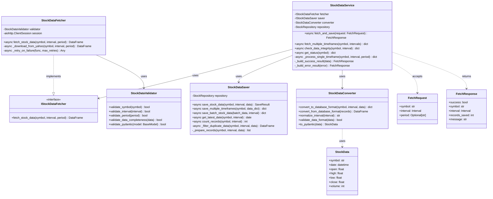

### 4.2 一括データ処理モジュール

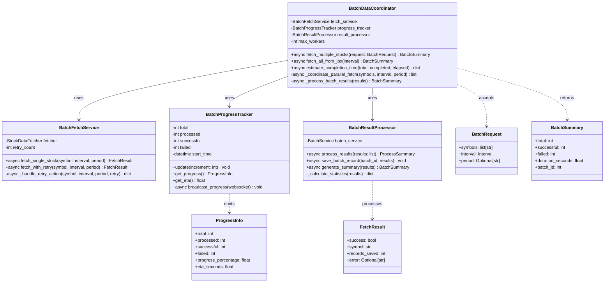

### 4.3 ファンダメンタルデータ処理モジュール

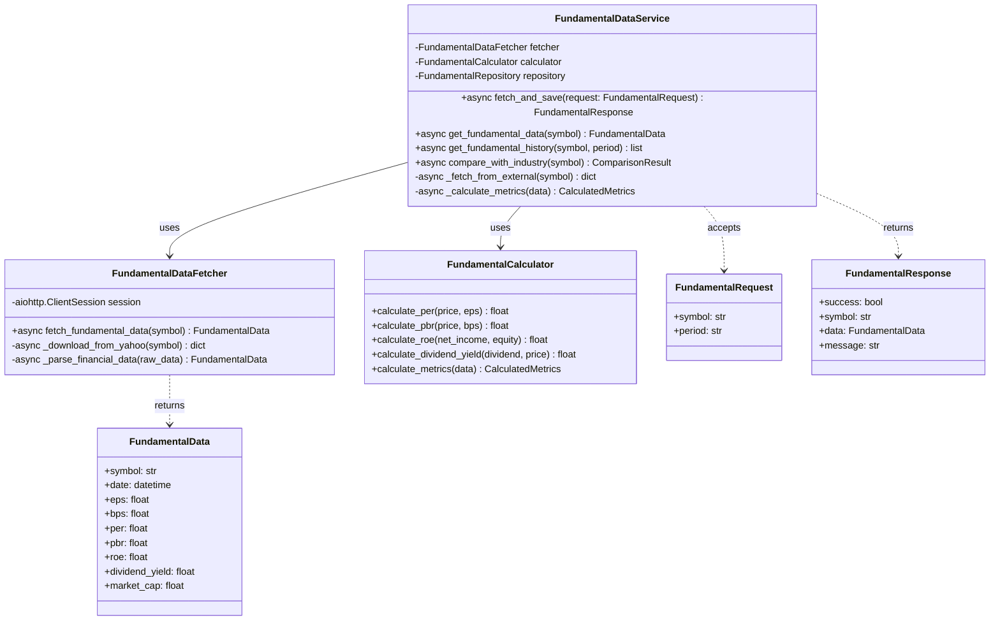

### 4.4 スクリーニングサービスモジュール

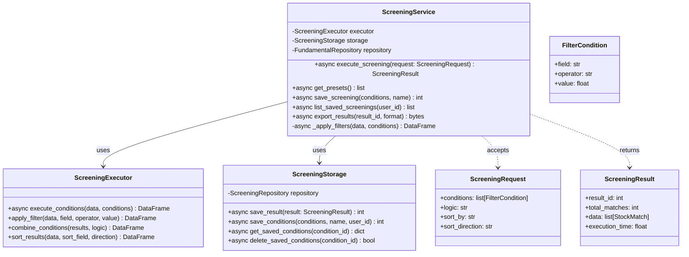

### 4.5 バックテストサービスモジュール

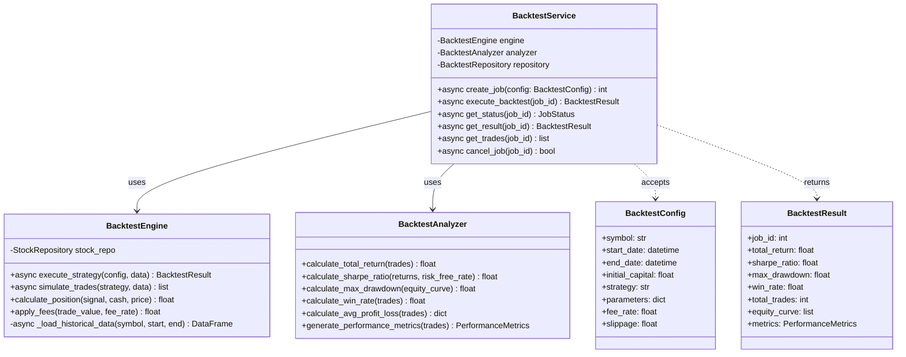

### 4.6 認証・ユーザー管理サービスモジュール

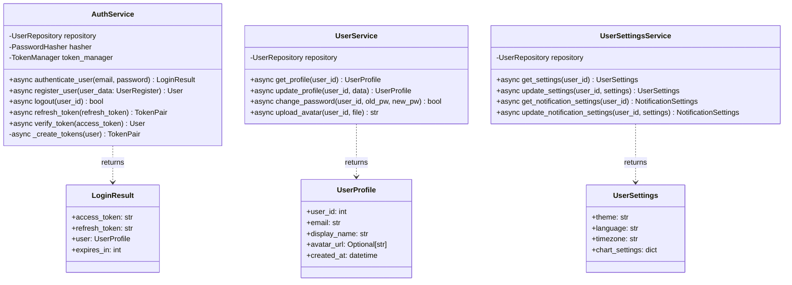

### 4.7 ポートフォリオサービスモジュール

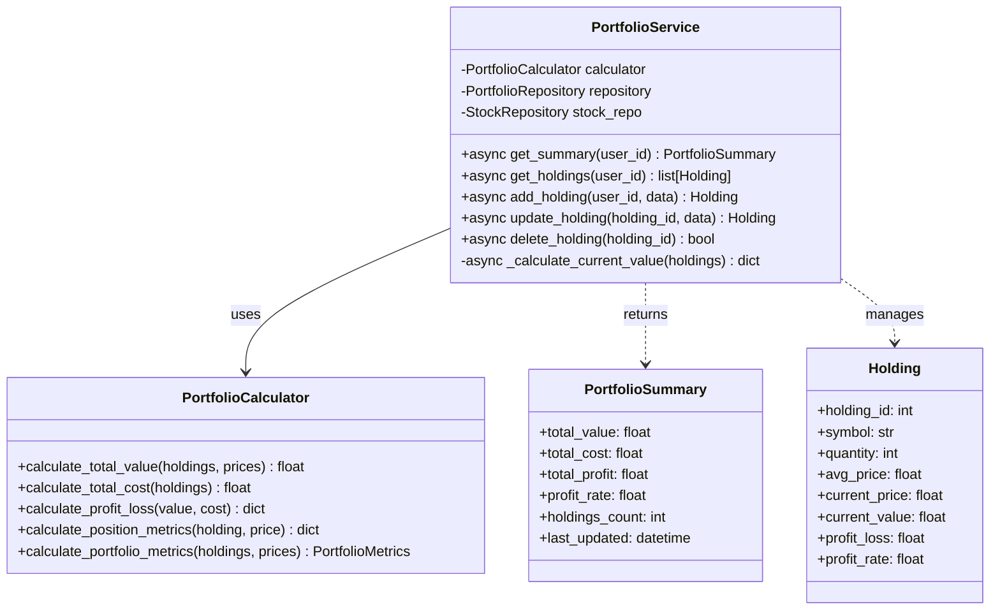

---

## 5. シーケンス図

### 5.1 単一銘柄データ取得・保存フロー

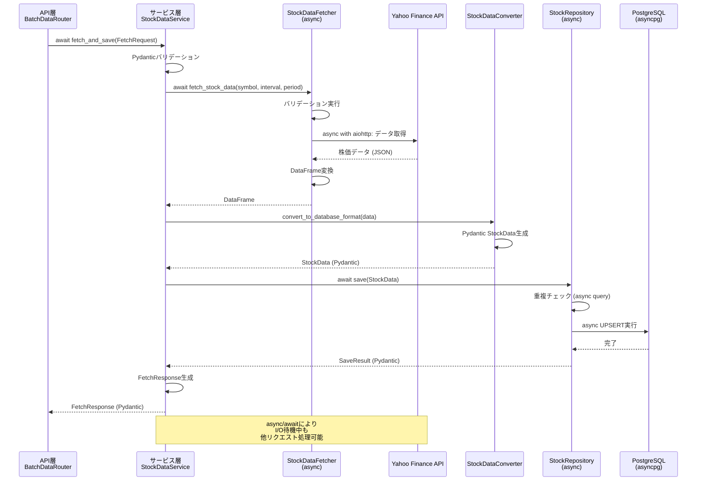

### 5.2 一括データ取得フロー（並列処理）

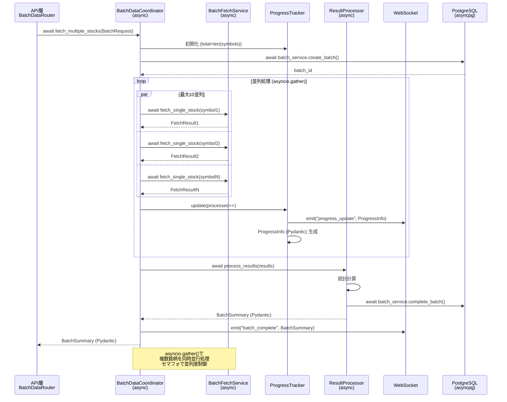

### 5.3 ファンダメンタルデータ取得フロー

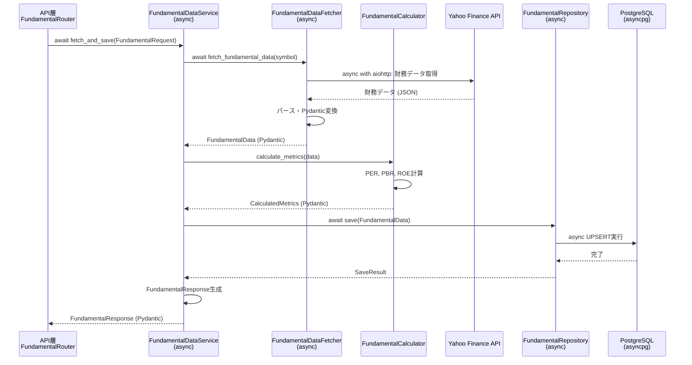

### 5.4 スクリーニング実行フロー

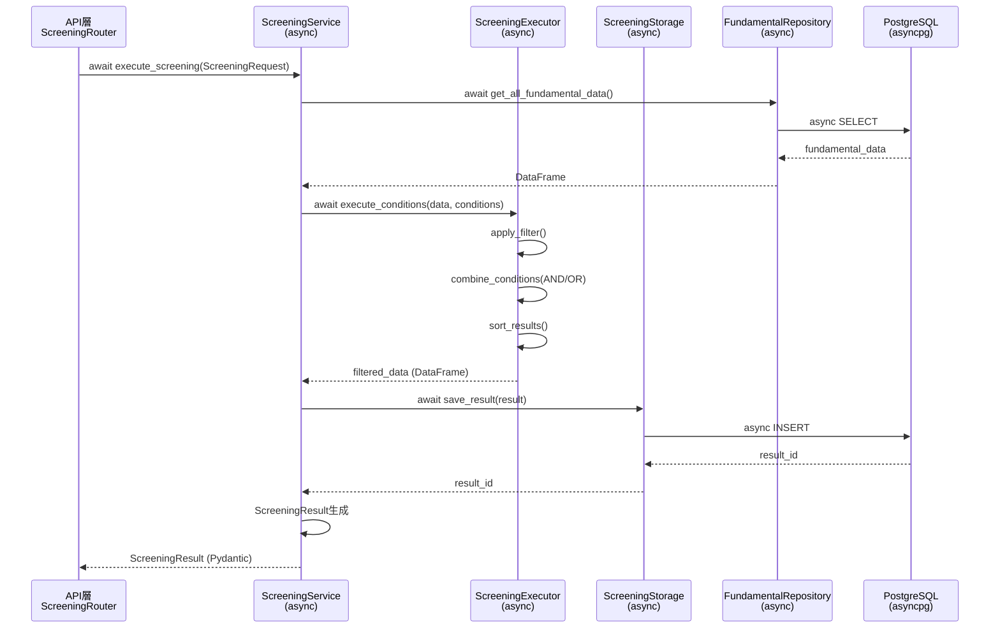

### 5.5 バックテスト実行フロー

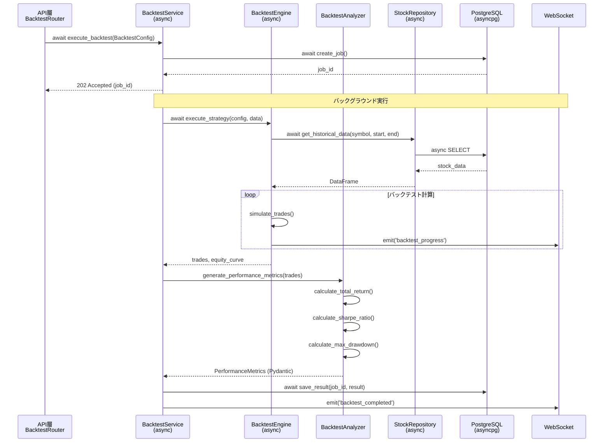

---

## 6. 主要サービス詳細

### 6.1 StockDataService

**役割**: データ取得・保存の統括管理

**主要メソッド**:

| メソッド                      | 説明                                   | パラメータ              | 戻り値                   | 非同期  |
| ----------------------------- | -------------------------------------- | ----------------------- | ------------------------ | ------- |
| `fetch_and_save()`            | 単一銘柄・単一時間軸のデータ取得・保存 | FetchRequest (Pydantic) | FetchResponse (Pydantic) | ✅ async |
| `fetch_multiple_timeframes()` | 単一銘柄・複数時間軸のデータ取得・保存 | symbol, intervals       | dict[str, FetchResponse] | ✅ async |
| `check_data_integrity()`      | データ整合性チェック                   | symbol, interval        | IntegrityCheckResult     | ✅ async |
| `get_status()`                | 銘柄の保存状況取得                     | symbol                  | StatusResponse           | ✅ async |

### 6.2 FundamentalDataService

**役割**: ファンダメンタルデータの統合管理

**主要メソッド**:

| メソッド                    | 説明                 | パラメータ         | 戻り値                | 非同期  |
| --------------------------- | -------------------- | ------------------ | --------------------- | ------- |
| `fetch_and_save()`          | 財務データ取得・保存 | FundamentalRequest | FundamentalResponse   | ✅ async |
| `get_fundamental_data()`    | 財務データ参照（DB） | symbol             | FundamentalData       | ✅ async |
| `get_fundamental_history()` | 財務データ履歴取得   | symbol, period     | list[FundamentalData] | ✅ async |
| `compare_with_industry()`   | 業界平均との比較     | symbol             | ComparisonResult      | ✅ async |

**取得データ**:
- EPS、BPS、PER、PBR、ROE、配当利回り
- 売上高、営業利益、純利益、自己資本比率
- 時価総額、発行済株式数

### 6.3 ScreeningService

**役割**: スクリーニング実行

**主要メソッド**:

| メソッド                  | 説明                          | パラメータ        | 戻り値                | 非同期  |
| ------------------------- | ----------------------------- | ----------------- | --------------------- | ------- |
| `execute_screening()`     | スクリーニング実行            | ScreeningRequest  | ScreeningResult       | ✅ async |
| `get_presets()`           | プリセット条件一覧取得        | なし              | list[PresetCondition] | ✅ async |
| `save_screening()`        | スクリーニング条件保存        | conditions, name  | int (condition_id)    | ✅ async |
| `list_saved_screenings()` | 保存済み条件一覧取得          | user_id           | list[SavedScreening]  | ✅ async |
| `export_results()`        | 結果エクスポート（CSV/Excel） | result_id, format | bytes                 | ✅ async |

**対応フィールド**: PER, PBR, ROE, 配当利回り, 株価, 出来高, 時価総額

**演算子**: lt（<）, lte（<=）, gt（>）, gte（>=）, eq（=）, ne（!=）

### 6.4 BacktestService

**役割**: バックテスト実行管理

**主要メソッド**:

| メソッド             | 説明                   | パラメータ     | 戻り値         | 非同期  |
| -------------------- | ---------------------- | -------------- | -------------- | ------- |
| `create_job()`       | バックテストジョブ作成 | BacktestConfig | int (job_id)   | ✅ async |
| `execute_backtest()` | バックテスト実行       | job_id         | BacktestResult | ✅ async |
| `get_status()`       | 進捗状態取得           | job_id         | JobStatus      | ✅ async |
| `get_result()`       | 結果取得               | job_id         | BacktestResult | ✅ async |
| `get_trades()`       | 取引履歴取得           | job_id         | list[Trade]    | ✅ async |
| `cancel_job()`       | ジョブキャンセル       | job_id         | bool           | ✅ async |

**対応戦略**:
- シンプル移動平均クロス（SMA Cross）
- パラメータ: short_window, long_window

**パフォーマンス指標**:
- 総収益率（Total Return）
- シャープレシオ（Sharpe Ratio）
- 最大ドローダウン（Max Drawdown）
- 勝率（Win Rate）
- 平均利益/損失（Average Profit/Loss）

### 6.5 AuthService

**役割**: 認証・認可管理

**主要メソッド**:

| メソッド              | 説明                 | パラメータ      | 戻り値      | 非同期  |
| --------------------- | -------------------- | --------------- | ----------- | ------- |
| `authenticate_user()` | ユーザー認証         | email, password | LoginResult | ✅ async |
| `register_user()`     | ユーザー登録         | UserRegister    | User        | ✅ async |
| `logout()`            | ログアウト           | user_id         | bool        | ✅ async |
| `refresh_token()`     | トークンリフレッシュ | refresh_token   | TokenPair   | ✅ async |
| `verify_token()`      | トークン検証         | access_token    | User        | ✅ async |

**JWT仕様**:
- アクセストークン有効期限: 1時間
- リフレッシュトークン有効期限: 30日
- パスワードハッシュ化: bcrypt
- トークン署名: HS256

### 6.6 PortfolioService

**役割**: ポートフォリオ管理

**主要メソッド**:

| メソッド           | 説明                   | パラメータ       | 戻り値           | 非同期  |
| ------------------ | ---------------------- | ---------------- | ---------------- | ------- |
| `get_summary()`    | ポートフォリオ概況取得 | user_id          | PortfolioSummary | ✅ async |
| `get_holdings()`   | 保有銘柄一覧取得       | user_id          | list[Holding]    | ✅ async |
| `add_holding()`    | 保有銘柄追加           | user_id, data    | Holding          | ✅ async |
| `update_holding()` | 保有銘柄更新           | holding_id, data | Holding          | ✅ async |
| `delete_holding()` | 保有銘柄削除           | holding_id       | bool             | ✅ async |

**ポートフォリオサマリ**:
- 総評価額、総取得コスト、総損益、損益率
- 保有銘柄数
- リアルタイム株価との連動

### 6.7 NotificationService

**役割**: 通知管理

**主要メソッド**:

| メソッド                         | 説明             | パラメータ               | 戻り値               | 非同期  |
| -------------------------------- | ---------------- | ------------------------ | -------------------- | ------- |
| `get_notification_settings()`    | 通知設定取得     | user_id                  | NotificationSettings | ✅ async |
| `update_notification_settings()` | 通知設定更新     | user_id, settings        | NotificationSettings | ✅ async |
| `create_alert()`                 | アラート作成     | user_id, alert_data      | Alert                | ✅ async |
| `list_alerts()`                  | アラート一覧取得 | user_id                  | list[Alert]          | ✅ async |
| `delete_alert()`                 | アラート削除     | alert_id                 | bool                 | ✅ async |
| `send_notification()`            | 通知送信         | user_id, message, method | SendResult           | ✅ async |

**アラート種類**:
- 株価アラート（目標価格到達）
- バッチ処理完了通知
- バックテスト完了通知

**通知方法**:
- メール通知
- ブラウザプッシュ通知
- WebSocket通知

---

## 7. 型定義とPydantic統合

### 7.1 Pydanticスキーマの配置戦略

サービス層では、**階層的な型定義構造**を採用し、型安全性とOpenAPI自動生成を実現します:

| ファイル                      | 配置基準                       | 例                                              | 用途                   |
| ----------------------------- | ------------------------------ | ----------------------------------------------- | ---------------------- |
| `app/schemas/common.py`       | 複数レイヤーで使用される共通型 | `Interval`, `ProcessStatus`, `BaseResponse`     | 全レイヤー共通         |
| `app/schemas/stock.py`        | 株価データ関連                 | `FetchRequest`, `FetchResponse`, `StockData`    | StockDataService       |
| `app/schemas/batch.py`        | 一括データ関連                 | `BatchRequest`, `BatchSummary`, `ProgressInfo`  | BatchDataCoordinator   |
| `app/schemas/jpx.py`          | JPX銘柄関連                    | `StockMaster`, `UpdateResult`, `StockListQuery` | JPXStockService        |
| `app/schemas/fundamental.py`  | ファンダメンタルデータ関連     | `FundamentalRequest`, `FundamentalData`         | FundamentalDataService |
| `app/schemas/screening.py`    | スクリーニング関連             | `ScreeningRequest`, `ScreeningResult`           | ScreeningService       |
| `app/schemas/backtest.py`     | バックテスト関連               | `BacktestConfig`, `BacktestResult`              | BacktestService        |
| `app/schemas/auth.py`         | 認証関連                       | `LoginRequest`, `LoginResult`, `TokenPair`      | AuthService            |
| `app/schemas/user.py`         | ユーザー関連                   | `UserProfile`, `UserSettings`                   | UserService            |
| `app/schemas/portfolio.py`    | ポートフォリオ関連             | `PortfolioSummary`, `Holding`                   | PortfolioService       |
| `app/schemas/notification.py` | 通知関連                       | `NotificationSettings`, `Alert`                 | NotificationService    |

### 7.2 主要Pydanticモデル定義

#### ファンダメンタルデータスキーマ (`app/schemas/fundamental.py`)

**主要モデル**:
- `FundamentalRequest`: 財務データ取得リクエスト（symbol, period）
- `FundamentalResponse`: 財務データ取得レスポンス（success, symbol, data）
- `FundamentalData`: 財務データモデル（EPS, BPS, PER, PBR, ROE, 配当利回り等）
- `CalculatedMetrics`: 計算済み財務指標

#### スクリーニングスキーマ (`app/schemas/screening.py`)

**主要モデル**:
- `ScreeningRequest`: スクリーニング実行リクエスト（conditions, logic, sort_by）
- `ScreeningResult`: スクリーニング結果（result_id, total_matches, data）
- `FilterCondition`: フィルタ条件（field, operator, value）
- `PresetCondition`: プリセット条件（name, description, conditions）

#### バックテストスキーマ (`app/schemas/backtest.py`)

**主要モデル**:
- `BacktestConfig`: バックテスト設定（symbol, start_date, end_date, strategy, parameters）
- `BacktestResult`: バックテスト結果（total_return, sharpe_ratio, max_drawdown, trades）
- `Trade`: 取引記録（date, action, price, quantity, profit_loss）
- `PerformanceMetrics`: パフォーマンス指標（win_rate, avg_profit, avg_loss）

#### ポートフォリオスキーマ (`app/schemas/portfolio.py`)

**主要モデル**:
- `PortfolioSummary`: ポートフォリオサマリ（total_value, total_cost, profit_loss, profit_rate）
- `Holding`: 保有銘柄（symbol, quantity, avg_price, current_price, profit_loss）
- `HoldingRequest`: 保有銘柄追加リクエスト（symbol, quantity, avg_price）

### 7.3 Pydanticのメリット

| メリット                   | 説明                                       | 実装例                                                 |
| -------------------------- | ------------------------------------------ | ------------------------------------------------------ |
| **実行時型検証**           | リクエスト時に自動バリデーション           | FastAPIルーターで自動実行                              |
| **OpenAPI自動生成**        | Swagger UI/ReDocが自動生成                 | `@router.post("/fetch", response_model=FetchResponse)` |
| **IDE補完**                | 型ヒントによる強力な補完                   | `request.symbol` でIDE補完が効く                       |
| **シリアライズ**           | JSON⇔Pythonオブジェクトの自動変換          | `response.json()` で自動JSON化                         |
| **カスタムバリデーション** | `@validator`でドメインロジック検証         | 銘柄コード形式チェック                                 |
| **ドキュメント性**         | `Field(description=...)`で自動ドキュメント | OpenAPIに説明が自動反映                                |

---

## 8. 依存性注入パターン

### 8.1 依存性注入の目的

| 目的                   | 実装方法                                   | メリット             |
| ---------------------- | ------------------------------------------ | -------------------- |
| **テスタビリティ向上** | コンストラクタインジェクション             | モック注入が容易     |
| **疎結合**             | インターフェース（抽象基底クラス）への依存 | 実装の差し替えが容易 |
| **再利用性**           | サービス間で共有可能な依存オブジェクト     | コード重複削減       |
| **拡張性**             | 新しい実装の追加が容易                     | 既存コードの変更不要 |

### 8.2 FastAPIでの依存性注入実装

#### 依存性定義 (`app/api/dependencies/services.py`)

**主要依存性**:
- `get_stock_data_service()`: StockDataServiceインスタンス提供
- `get_fundamental_service()`: FundamentalDataServiceインスタンス提供
- `get_screening_service()`: ScreeningServiceインスタンス提供
- `get_backtest_service()`: BacktestServiceインスタンス提供
- `get_auth_service()`: AuthServiceインスタンス提供
- `get_portfolio_service()`: PortfolioServiceインスタンス提供
- `get_notification_service()`: NotificationServiceインスタンス提供

**実装パターン**:
- DBセッションを引数として受け取り、サービスを初期化
- FastAPIの`Depends()`パターンで注入
- リクエストスコープで管理

### 8.3 依存性注入のベストプラクティス

| プラクティス                                   | 説明                                             | 実装例                                               |
| ---------------------------------------------- | ------------------------------------------------ | ---------------------------------------------------- |
| **インターフェース（抽象基底クラス）への依存** | 具象クラスではなく抽象クラスに依存               | `IStockDataFetcher`インターフェース                  |
| **コンストラクタインジェクション**             | 全依存オブジェクトをコンストラクタで受け取る     | `def __init__(self, fetcher: IStockDataFetcher)`     |
| **FastAPI Depends**                            | FastAPIの依存性注入機能を活用                    | `service: Service = Depends(get_service)`            |
| **スコープ管理**                               | シングルトン・リクエストスコープを適切に使い分け | Validator: シングルトン、Service: リクエストスコープ |
| **循環依存の回避**                             | サービス間の循環依存を避ける                     | 依存グラフを一方向に                                 |

---

## 関連ドキュメント

- [アーキテクチャ概要](../architecture_overview.md)
- [API層仕様書](./api_layer.md)
- [データアクセス層仕様書](./data_access_layer.md)
- [例外処理システム仕様書](../exception_handling.md)
- [サービス層リファクタリング計画](../../tasks/refactoring/service_layer_plan.md)

---

**最終更新**: 2025-11-16
