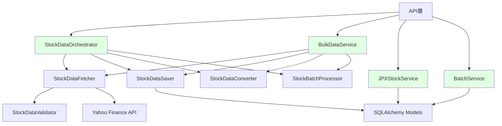
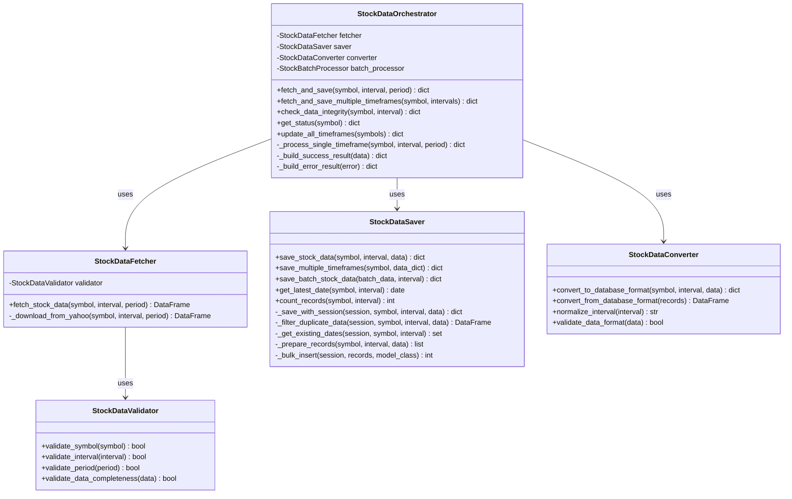
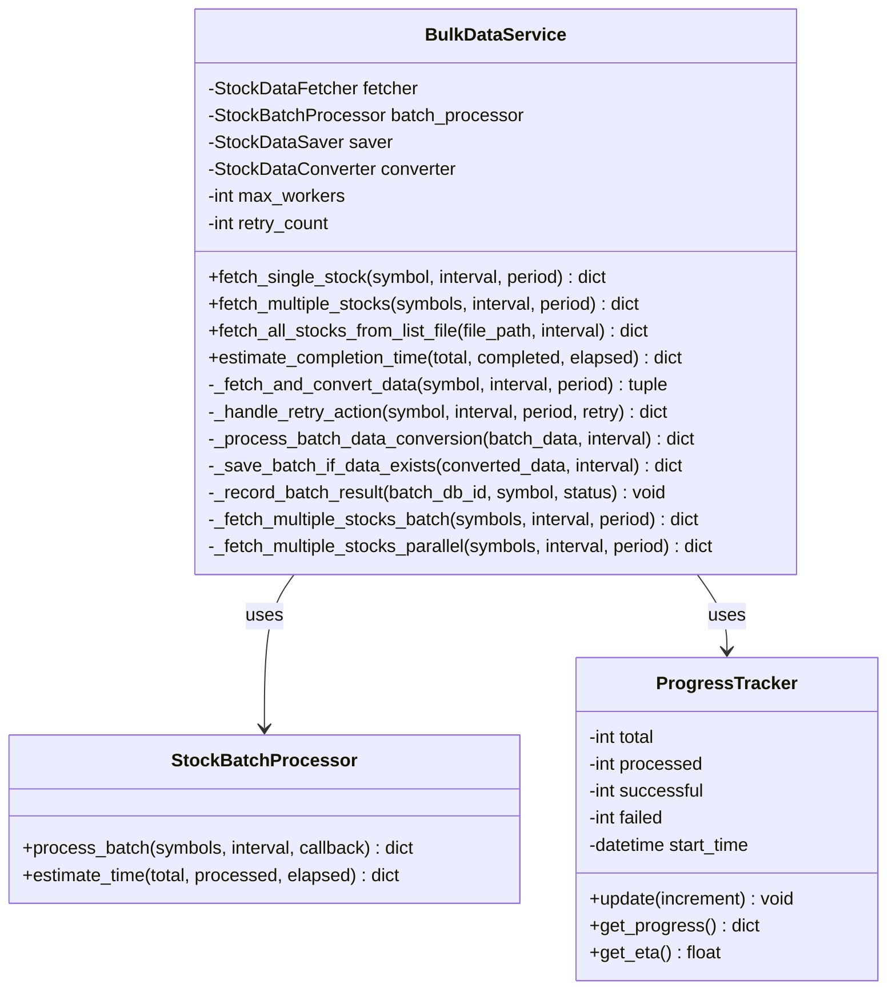
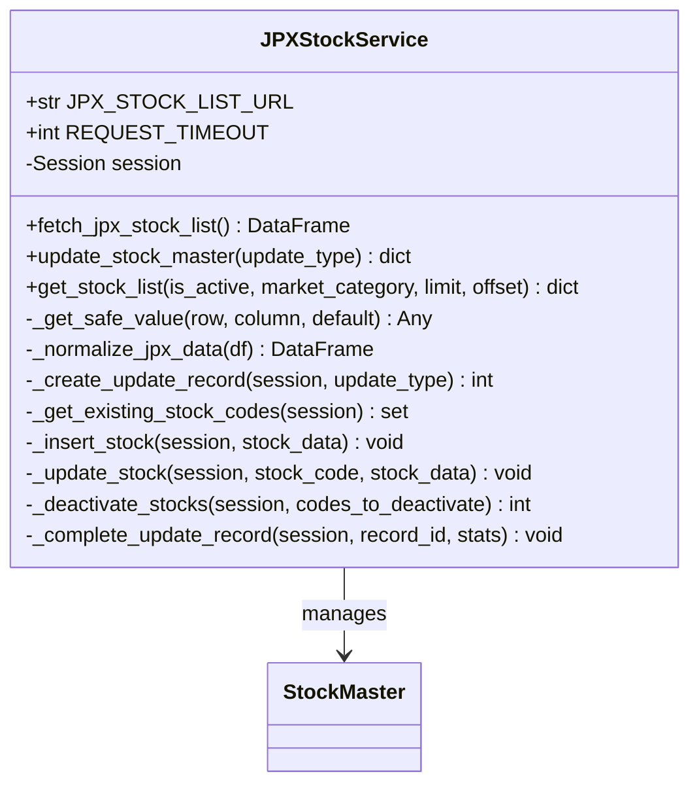
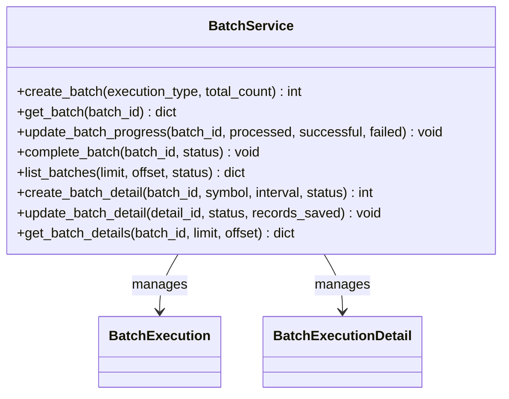
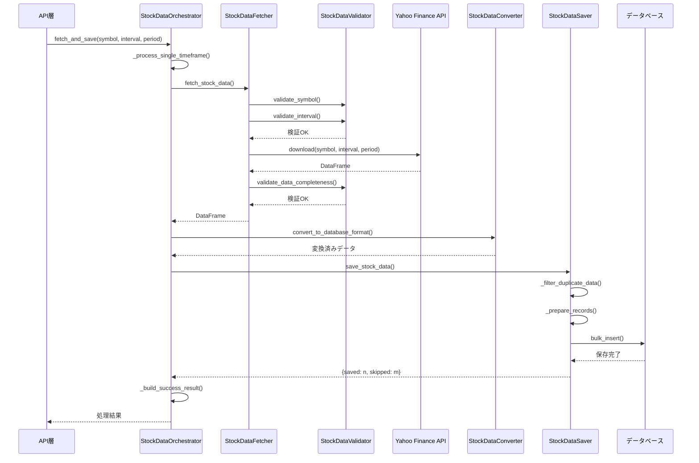
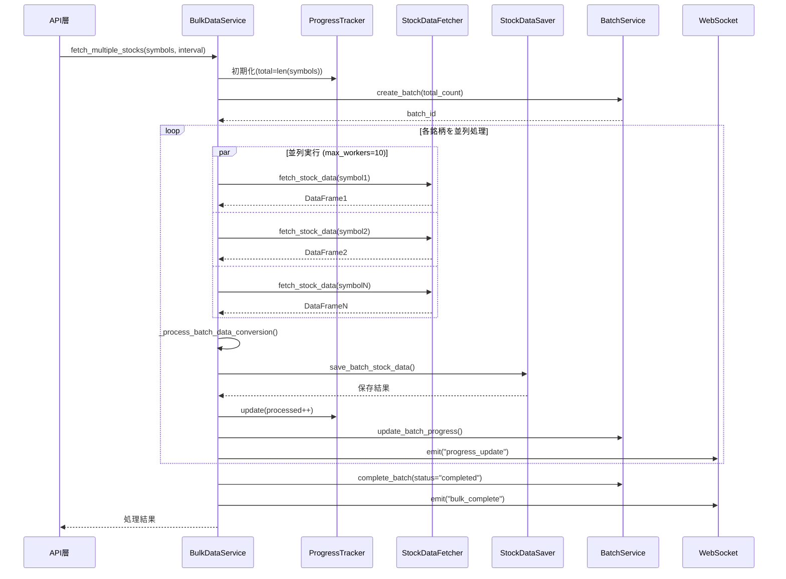
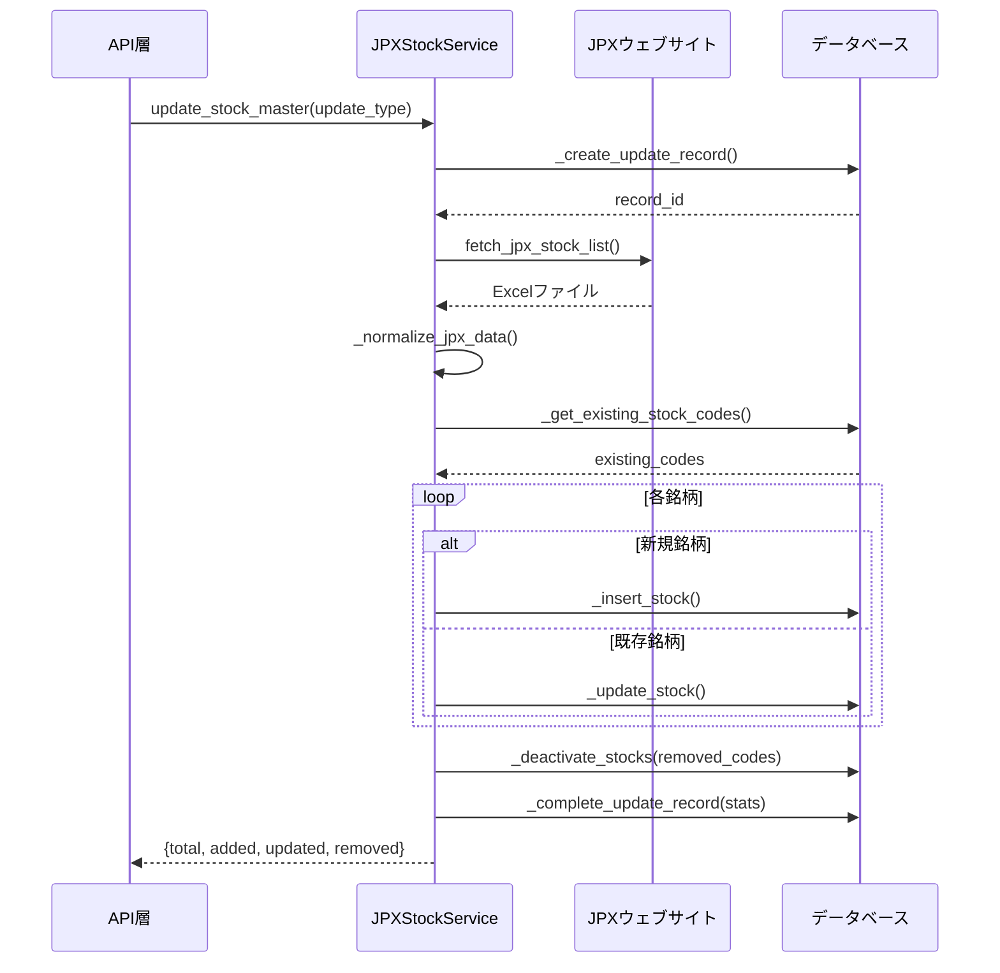

category: architecture
ai_context: high
last_updated: 2025-01-09
related_docs:
  - ../architecture_overview.md
  - ./api_layer.md
  - ./data_access_layer.md

# サービス層 仕様書

## 目次

- [1. 概要](#1-概要)
- [2. 構成](#2-構成)
- [3. サービスモジュール一覧](#3-サービスモジュール一覧)
- [4. クラス図](#4-クラス図)
- [5. シーケンス図](#5-シーケンス図)
- [6. 主要サービス詳細](#6-主要サービス詳細)

---

## 1. 概要

### 役割

サービス層は、ビジネスロジックの実装を担当し、API層とデータアクセス層の橋渡しをします。

### 責務

| 責務 | 説明 |
|------|------|
| **ビジネスロジック実装** | 株価データ取得・保存・変換などの処理 |
| **外部API連携** | Yahoo Finance APIからのデータ取得 |
| **トランザクション管理** | DB操作のトランザクション制御 |
| **エラーハンドリング** | 例外の補足と適切な処理（詳細は[例外処理システム仕様書](../exception_handling.md)を参照） |
| **データ変換** | 外部データの内部形式への変換 |
| **並列処理制御** | バルクデータ取得時の並列処理管理 |

### 設計原則

- **単一責任の原則**: 各サービスは明確な責務を持つ
- **疎結合**: サービス間の依存を最小限に
- **再利用性**: 共通機能はユーティリティとして切り出し
- **拡張性**: 新機能追加が容易な構成

---

## 2. 構成

### ディレクトリ構造

```
app/services/
├── stock_data/              # 株価データ処理
│   ├── orchestrator.py      # データ取得・保存統括
│   ├── fetcher.py           # データ取得
│   ├── saver.py             # データ保存
│   ├── converter.py         # データ変換
│   ├── validator.py         # データ検証
│   └── scheduler.py         # スケジューリング
├── bulk/                    # バルクデータ処理
│   ├── bulk_service.py      # 複数銘柄並列処理
│   └── stock_batch_processor.py  # バッチ処理
├── jpx/                     # JPX銘柄管理
│   └── jpx_stock_service.py # JPX銘柄マスタ管理
├── batch/                   # バッチ実行管理
│   └── batch_service.py     # バッチ履歴管理
└── common/                  # 共通機能
    └── error_handler.py     # エラーハンドリング統一管理
```

### 依存関係



---

## 3. サービスモジュール一覧

### 株価データ処理（stock_data/）

| モジュール | クラス | 責務 |
|-----------|--------|------|
| **orchestrator.py** | StockDataOrchestrator | データ取得・保存の統括管理 |
| **fetcher.py** | StockDataFetcher | Yahoo Finance APIからデータ取得 |
| **saver.py** | StockDataSaver | データベースへのデータ保存 |
| **converter.py** | StockDataConverter | データ形式の変換 |
| **validator.py** | StockDataValidator | データ検証 |
| **scheduler.py** | StockDataScheduler | スケジュール実行管理 |

### バルクデータ処理（bulk/）

| モジュール | クラス | 責務 |
|-----------|--------|------|
| **bulk_service.py** | BulkDataService | 複数銘柄の並列処理 |
| **stock_batch_processor.py** | StockBatchProcessor | バッチ処理実行 |

### JPX銘柄管理（jpx/）

| モジュール | クラス | 責務 |
|-----------|--------|------|
| **jpx_stock_service.py** | JPXStockService | JPX銘柄マスタの管理 |

### バッチ管理（batch/）

| モジュール | クラス | 責務 |
|-----------|--------|------|
| **batch_service.py** | BatchService | バッチ実行履歴の管理 |

### 共通機能（common/）

| モジュール | クラス | 責務 |
|-----------|--------|------|
| **error_handler.py** | ErrorHandler | エラーハンドリングの統一管理 |

---

## 4. クラス図

### 株価データ処理モジュール



### バルクデータ処理モジュール



### JPX銘柄管理モジュール



### バッチ管理モジュール



---

## 5. シーケンス図

### 単一銘柄データ取得・保存フロー



### バルクデータ取得フロー（並列処理）



### JPX銘柄マスタ更新フロー



---

## 6. 主要サービス詳細

### 6.1 StockDataOrchestrator

**役割**: データ取得・保存の統括管理

**主要メソッド**:

| メソッド | 説明 | パラメータ | 戻り値 |
|---------|------|-----------|--------|
| `fetch_and_save()` | 単一銘柄・単一時間軸のデータ取得・保存 | symbol, interval, period | dict（処理結果） |
| `fetch_and_save_multiple_timeframes()` | 単一銘柄・複数時間軸のデータ取得・保存 | symbol, intervals | dict（各時間軸の結果） |
| `check_data_integrity()` | データ整合性チェック | symbol, interval | dict（チェック結果） |
| `get_status()` | 銘柄の保存状況取得 | symbol | dict（保存状況） |
| `update_all_timeframes()` | 複数銘柄の全時間軸更新 | symbols | dict（更新結果） |

**使用例**:

```python
orchestrator = StockDataOrchestrator()

# 単一銘柄取得
result = orchestrator.fetch_and_save(
    symbol="7203.T",
    interval="1d",
    period="1mo"
)

# 複数時間軸取得
result = orchestrator.fetch_and_save_multiple_timeframes(
    symbol="7203.T",
    intervals=["1d", "1wk", "1mo"]
)
```

---

### 6.2 StockDataFetcher

**役割**: Yahoo Finance APIからのデータ取得

**主要メソッド**:

| メソッド | 説明 | パラメータ | 戻り値 |
|---------|------|-----------|--------|
| `fetch_stock_data()` | 株価データ取得（検証付き） | symbol, interval, period | DataFrame |
| `_download_from_yahoo()` | Yahoo Finance APIからダウンロード | symbol, interval, period | DataFrame |

**特徴**:

- スレッドセーフな実装（yfinance用グローバルロック使用）
- リトライ機能
- データ検証（StockDataValidator使用）

**使用例**:

```python
fetcher = StockDataFetcher()
data = fetcher.fetch_stock_data(
    symbol="7203.T",
    interval="1d",
    period="1mo"
)
```

---

### 6.3 StockDataSaver

**役割**: データベースへのデータ保存

**主要メソッド**:

| メソッド | 説明 | パラメータ | 戻り値 |
|---------|------|-----------|--------|
| `save_stock_data()` | 単一銘柄データ保存 | symbol, interval, data | dict（保存結果） |
| `save_multiple_timeframes()` | 複数時間軸データ保存 | symbol, data_dict | dict（保存結果） |
| `save_batch_stock_data()` | バッチデータ保存 | batch_data, interval | dict（保存結果） |
| `get_latest_date()` | 最新データ日付取得 | symbol, interval | date |
| `count_records()` | レコード数取得 | symbol, interval | int |

**特徴**:

- 重複データフィルタリング
- バルクインサート対応
- トランザクション管理

**使用例**:

```python
saver = StockDataSaver()
result = saver.save_stock_data(
    symbol="7203.T",
    interval="1d",
    data=dataframe
)
# 結果: {"saved": 20, "skipped": 5, "total": 25}
```

---

### 6.4 BulkDataService

**役割**: 複数銘柄の並列処理

**主要メソッド**:

| メソッド | 説明 | パラメータ | 戻り値 |
|---------|------|-----------|--------|
| `fetch_single_stock()` | 単一銘柄取得（リトライ付き） | symbol, interval, period | dict |
| `fetch_multiple_stocks()` | 複数銘柄並列取得 | symbols, interval, period | dict |
| `fetch_all_stocks_from_list_file()` | ファイルから一括取得 | file_path, interval | dict |
| `estimate_completion_time()` | 完了時刻推定 | total, completed, elapsed | dict（ETA） |

**特徴**:

- 最大10並列処理
- 進捗トラッキング
- WebSocketによる進捗配信
- バッチDB記録

**設定**:

- `max_workers`: 10（並列実行数）
- `retry_count`: 3（リトライ回数）

**使用例**:

```python
bulk_service = BulkDataService(max_workers=10, retry_count=3)
result = bulk_service.fetch_multiple_stocks(
    symbols=["7203.T", "6758.T", "9984.T"],
    interval="1d",
    period="1mo",
    progress_callback=lambda p: print(f"進捗: {p}%")
)
```

---

### 6.5 JPXStockService

**役割**: JPX銘柄マスタの管理

**主要メソッド**:

| メソッド | 説明 | パラメータ | 戻り値 |
|---------|------|-----------|--------|
| `fetch_jpx_stock_list()` | JPXから銘柄一覧取得 | なし | DataFrame |
| `update_stock_master()` | 銘柄マスタ更新 | update_type | dict（更新結果） |
| `get_stock_list()` | 銘柄一覧取得 | is_active, market_category, limit, offset | dict（銘柄リスト） |

**特徴**:

- JPXウェブサイトからExcelダウンロード
- 銘柄の追加・更新・無効化
- 更新履歴の記録

**定数**:

- `JPX_STOCK_LIST_URL`: JPX銘柄一覧ダウンロードURL
- `REQUEST_TIMEOUT`: 30秒

**使用例**:

```python
jpx_service = JPXStockService()
result = jpx_service.update_stock_master(update_type="manual")
# 結果: {
#   "total_stocks": 3800,
#   "added_stocks": 50,
#   "updated_stocks": 3700,
#   "removed_stocks": 10
# }
```

---

### 6.6 BatchService

**役割**: バッチ実行履歴の管理

**主要メソッド**:

| メソッド | 説明 | パラメータ | 戻り値 |
|---------|------|-----------|--------|
| `create_batch()` | バッチ実行レコード作成 | execution_type, total_count | int（batch_id） |
| `get_batch()` | バッチ情報取得 | batch_id | dict |
| `update_batch_progress()` | 進捗更新 | batch_id, processed, successful, failed | void |
| `complete_batch()` | バッチ完了 | batch_id, status | void |
| `list_batches()` | バッチ一覧取得 | limit, offset, status | dict |
| `create_batch_detail()` | 詳細レコード作成 | batch_id, symbol, interval, status | int |
| `update_batch_detail()` | 詳細レコード更新 | detail_id, status, records_saved | void |
| `get_batch_details()` | バッチ詳細取得 | batch_id, limit, offset | dict |

**特徴**:

- バッチ実行のサマリ管理
- 銘柄ごとの詳細記録
- ステータス管理（running, completed, failed）

**使用例**:

```python
batch_service = BatchService()

# バッチ作成
batch_id = batch_service.create_batch(
    execution_type="manual",
    total_count=100
)

# 進捗更新
batch_service.update_batch_progress(
    batch_id=batch_id,
    processed=50,
    successful=48,
    failed=2
)

# バッチ完了
batch_service.complete_batch(
    batch_id=batch_id,
    status="completed"
)
```

---

## 関連ドキュメント

- [アーキテクチャ概要](../architecture_overview.md)
- [API層仕様書](./api_layer.md)
- [プレゼンテーション層仕様書](./presentation_layer.md)
- [データアクセス層仕様書](./data_access_layer.md)
- [例外処理システム仕様書](../exception_handling.md) - エラーハンドリングの詳細

---

**最終更新**: 2025-01-09
