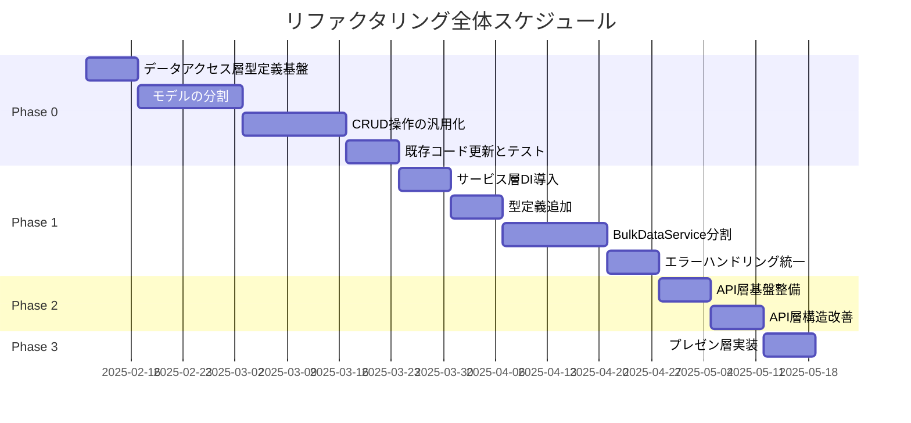

category: refactoring
ai_context: high
last_updated: 2025-01-09
related_docs:
  - ../architecture_overview.md
  - ../type_definition_strategy.md

# リファクタリング計画 概要

## 目次

- [1. はじめに](#1-はじめに)
- [2. リファクタリング対象レイヤー](#2-リファクタリング対象レイヤー)
- [3. 共通リファクタリング戦略](#3-共通リファクタリング戦略)
- [4. 実施優先順位](#4-実施優先順位)
- [5. 期待される効果](#5-期待される効果)

---

## 1. はじめに

このディレクトリには、STOCK-INVESTMENT-ANALYZERプロジェクトの各レイヤーのリファクタリング計画がまとめられています。

### 目的

プロジェクト全体の以下を実現します：

- **保守性の向上**: コードの可読性と保守性を大幅に向上
- **テスタビリティの向上**: 単体テストが書きやすい構造に変更
- **拡張性の向上**: 新機能追加時の影響範囲を最小化
- **品質の向上**: 一貫した型定義とエラーハンドリング
- **開発効率の向上**: 開発速度とコードレビュー効率を改善

### 基本方針

すべてのリファクタリングで以下の方針を採用します：

1. **段階的移行**: 既存機能を壊さず段階的にリファクタリング
2. **後方互換性**: 既存のAPI/機能は全て維持
3. **型安全性**: 階層的型定義構造による型安全性の確保
4. **テスト駆動**: 包括的なテストスイートによる品質保証

---

## 2. リファクタリング対象レイヤー

### 2.1 データアクセス層リファクタリング

**ドキュメント**: [data_access_layer_refactoring.md](./data_access_layer_refactoring.md)

**概要**:
- models.py（1,263行）を複数ファイルに分割
- CRUD操作の汎用化と共通化
- 階層的型定義構造の導入
- エラーハンドリングの一貫性確保

**優先度**: **最優先**

**対象**:
```
app/
├── types.py                      # プロジェクト共通型定義（新設）
└── models/                       # データアクセス層パッケージ（新設）
    ├── types.py                  # モデル層固有の型定義（新設）
    ├── exceptions.py             # データアクセス層専用例外（新設）
    ├── base.py                   # 基底クラス
    ├── mixins.py                 # Mixinクラス
    ├── stock_data.py             # 株価データモデル（8モデル）
    ├── master.py                 # 銘柄マスタ関連（2モデル）
    ├── batch.py                  # バッチ実行関連（2モデル）
    ├── session.py                # セッション管理
    └── crud/                     # CRUD操作
        ├── base.py               # BaseCRUD（汎用）
        └── stock.py              # 株価データCRUD（各時間軸）
```

### 2.2 サービス層リファクタリング

**ドキュメント**: [service_layer_refactoring.md](./service_layer_refactoring.md)

**概要**:
- BulkDataService（910行）を4つの専門クラスに分割
- 依存性注入パターンの導入
- エラーハンドリングの統一
- 型定義の完全化

**優先度**: **高**

**対象**:
```
app/services/
├── types.py                      # サービス層固有の型定義（新設）
├── stock_data/
│   ├── orchestrator.py           # 統括管理（リファクタ）
│   ├── fetcher.py                # データ取得
│   ├── saver.py                  # データ保存
│   └── converter.py              # データ変換
└── bulk/
    ├── coordinator.py            # 全体調整（新設）
    ├── fetch_service.py          # データ取得専門（新設）
    ├── progress_tracker.py       # 進捗管理専門（新設）
    └── result_processor.py       # 結果処理専門（新設）
```

### 2.3 API層リファクタリング

**ドキュメント**: [api_layer_refactoring.md](./api_layer_refactoring.md)

**概要**:
- bulk_data.py（650行）の責務分離
- バリデーション処理の統一
- エラーハンドリングの一貫性確保
- ジョブ管理の分離
- API固有の型定義

**優先度**: **高**

**対象**:
```
app/api/
├── types.py                      # API層固有の型定義（新設）
├── bulk_data.py                  # バルクデータAPI（リファクタ）
├── stock_master.py               # 銘柄マスタAPI（リファクタ）
└── system_monitoring.py          # システム監視API（軽微な改善）
```

### 2.4 プレゼンテーション層リファクタリング

**ドキュメント**: [presentation_layer_refactoring.md](./presentation_layer_refactoring.md)

**概要**:
- Application Factoryパターンの導入
- 環境別設定の分離
- 拡張機能の初期化改善
- 型安全な設定管理

**優先度**: **中**

**対象**:
```
app/
├── __init__.py                   # create_app() 定義（新設）
├── config.py                     # 設定クラス（新設）
├── extensions.py                 # 拡張機能（新設）
└── routes/                       # ルート定義（新設）
```

---

## 3. 共通リファクタリング戦略

### 3.1 階層的型定義構造

**すべてのレイヤーで共通の型定義戦略を採用**

詳細は [型定義配置戦略](../type_definition_strategy.md) を参照してください。

#### 型定義の配置

```
app/
├── types.py                      # プロジェクト全体の共通型（新設）
│   ├── Interval                  # 時間軸型
│   ├── ProcessStatus             # 処理ステータス
│   ├── BatchStatus               # バッチステータス
│   └── PaginationParams          # ページネーション型
├── api/
│   └── types.py                  # API層固有の型定義（新設）
├── services/
│   └── types.py                  # サービス層固有の型定義（新設）
└── exceptions.py                 # 例外定義（既存）
```

#### 配置基準

| 型の種類 | 配置場所 | 例 |
|---------|---------|---|
| **複数レイヤーで使用** | `app/types.py` | `Interval`, `ProcessStatus` |
| **API層のみで使用** | `app/api/types.py` | `APIResponse`, `BulkFetchRequest` |
| **サービス層のみで使用** | `app/services/types.py` | `ServiceResult`, `FetchResult` |
| **特定モジュール内のみ** | モジュール内 | `_InternalState` |

### 3.2 依存性注入パターン

**テスタビリティと柔軟性の向上**

```python
# 改善前
class StockDataOrchestrator:
    def __init__(self):
        self.fetcher = StockDataFetcher()  # 固定
        self.saver = StockDataSaver()      # 固定

# 改善後
class StockDataOrchestrator:
    def __init__(
        self,
        fetcher: Optional[StockDataFetcher] = None,
        saver: Optional[StockDataSaver] = None,
    ):
        self.fetcher = fetcher or StockDataFetcher()  # 柔軟
        self.saver = saver or StockDataSaver()        # 柔軟
```

### 3.3 エラーハンドリングの統一

**一貫性のあるエラー処理**

```python
# 共通デコレータの使用
@handle_service_error
def fetch_stock_data(self, symbol: str) -> pd.DataFrame:
    # エラーハンドリングはデコレータに任せる
    ...

@retry_on_error(max_retries=3, delay=1.0)
def fetch_with_retry(self, symbol: str) -> pd.DataFrame:
    # リトライ機能はデコレータに任せる
    ...
```

### 3.4 テスト駆動開発

**すべてのリファクタリングでテスト先行**

1. 既存機能のテストケース作成
2. リファクタリング実施
3. テスト実行で動作保証
4. カバレッジ向上（目標: 80%以上）

---

## 4. 実施優先順位

### Phase 0: データアクセス層リファクタリング（6週間）

**理由**: すべてのレイヤーの基盤となるため、最初に実施すべき

| 週 | タスク | 成果物 |
|---|--------|--------|
| 1週目 | 型定義基盤の構築 | app/types.py, app/models/types.py, exceptions.py |
| 2-3週目 | モデルの分割 | base.py, mixins.py, stock_data.py, master.py, batch.py, session.py |
| 4-5週目 | CRUD操作の汎用化 | crud/base.py, crud/stock.py |
| 6週目 | 既存コード更新とテスト | 型ヒント追加、統合テスト、ドキュメント |

### Phase 1: サービス層リファクタリング（5週間）

**理由**: データアクセス層の改善を受けて、サービス層を改善

| 週 | タスク | 成果物 |
|---|--------|--------|
| 1週目 | 依存性注入の導入 | DI対応済みサービスクラス |
| 2週目 | 型定義の追加 | app/services/types.py |
| 3-4週目 | BulkDataServiceの分割 | 4つの専門クラス |
| 5週目 | エラーハンドリング統一、その他改善 | decorators.py、総合テスト |

### Phase 2: API層リファクタリング（2週間）

**理由**: サービス層の改善を受けて、API層も改善

| 週 | タスク | 成果物 |
|---|--------|--------|
| 1週目 | 基盤整備、型定義追加 | app/api/types.py、共通ユーティリティ |
| 2週目 | 構造改善 | ジョブ管理分離、バリデーション統一 |

### Phase 3: プレゼンテーション層リファクタリング（1週間）

**理由**: 比較的小規模、独立性が高い

| 日 | タスク | 成果物 |
|---|--------|--------|
| 1-2日目 | Application Factory実装 | create_app(), config.py |
| 3-4日目 | ルート分離 | routes/ ディレクトリ |
| 5日目 | テストと統合 | 総合テスト、ドキュメント |

### 全体スケジュール



---

## 5. 期待される効果

### 5.1 定量的効果

| 指標 | 現状 | 改善後目標 | 効果 |
|------|------|-----------|------|
| **models.py行数** | 1,263行 | 0行（廃止、再エクスポートのみ） | **100%削減** |
| **BulkDataService行数** | 910行 | 4クラス（各150-300行） | **70%削減** |
| **bulk_data.py行数** | 650行 | 200行 | **70%削減** |
| **CRUDクラス数** | 1（StockDailyCRUDのみ） | 9（8時間軸+Base） | **+800%** |
| **テストカバレッジ** | 50% | 80%以上 | **+30pt** |
| **循環的複雑度** | 平均8-12 | 平均3-5 | **60%改善** |
| **型カバレッジ** | 60% | 95%以上 | **+35pt** |
| **コード重複** | 多数 | ほぼゼロ | **90%削減** |

### 5.2 定性的効果

#### 保守性の向上

- **単一責任の原則**: 各クラス/関数の責務が明確
- **可読性**: コード量削減と構造化により理解容易
- **変更容易性**: 影響範囲が限定的

#### テスタビリティの向上

- **モック容易性**: DI により依存オブジェクトのモック作成が容易
- **テスト独立性**: 各層のテストが独立して実行可能
- **テストカバレッジ**: 包括的なテストスイート

#### 拡張性の向上

- **新機能追加**: 既存コードへの影響を最小化
- **実装差し替え**: インターフェース経由で実装を差し替え可能
- **段階的アップグレード**: 段階的な機能追加が容易

#### 品質の向上

- **型安全性**: 型ヒントによる静的型チェック
- **一貫性**: エラーハンドリング、バリデーションの統一
- **堅牢性**: 包括的なテストによる品質保証

### 5.3 開発効率の向上

| 作業 | 現状 | 改善後 | 効果 |
|------|------|--------|------|
| **新機能追加** | 1日 | 3時間 | **75%短縮** |
| **バグ修正** | 4時間 | 1時間 | **75%短縮** |
| **コードレビュー** | 2時間 | 30分 | **75%短縮** |
| **新メンバーオンボーディング** | 2週間 | 1週間 | **50%短縮** |

---

## 関連ドキュメント

### リファクタリング計画書

- [データアクセス層リファクタリング計画](./data_access_layer_refactoring.md)
- [サービス層リファクタリング計画](./service_layer_refactoring.md)
- [API層リファクタリング計画](./api_layer_refactoring.md)
- [プレゼンテーション層リファクタリング計画](./presentation_layer_refactoring.md)

### ガイド

- [型定義配置戦略](../type_definition_strategy.md)
- [コーディング規約](../../guides/CONTRIBUTING.md)

### アーキテクチャドキュメント

- [アーキテクチャ概要](../architecture_overview.md)
- [データアクセス層仕様書](../layers/data_access_layer.md)
- [サービス層仕様書](../layers/service_layer.md)
- [API層仕様書](../layers/api_layer.md)
- [プレゼンテーション層仕様書](../layers/presentation_layer.md)

---

**最終更新**: 2025-01-09
