category: refactoring
ai_context: high
last_updated: 2025-01-09
related_docs:
  - ../layers/api_layer.md
  - ./service_layer_refactoring.md
  - ./presentation_layer_refactoring.md
  - ../type_definition_strategy.md
  - ../architecture_overview.md

# API層リファクタリング計画

## 目次

- [1. 概要](#1-概要)
- [2. 現状の課題](#2-現状の課題)
- [3. リファクタリング方針](#3-リファクタリング方針)
- [4. リファクタリング後のアーキテクチャ](#4-リファクタリング後のアーキテクチャ)
- [5. 具体的な改善項目](#5-具体的な改善項目)
- [6. 型定義戦略](#6-型定義戦略)
- [7. 実装計画](#7-実装計画)
- [8. 期待される効果](#8-期待される効果)

---

## 1. 概要

### 目的

現在のAPI層は機能的には動作していますが、以下の観点から改善の余地があります：

- **保守性の向上**: コードの可読性と保守性を向上
- **テスタビリティの向上**: 単体テストが書きやすい構造に変更
- **拡張性の向上**: 新機能追加時の影響範囲を最小化
- **品質の向上**: エラーハンドリングとバリデーションの一貫性を確保

### 対象範囲

```
app/api/
├── bulk_data.py           # バルクデータAPI（最優先）
├── stock_master.py        # 銘柄マスタAPI（優先）
├── system_monitoring.py   # システム監視API（低優先）
└── swagger.py             # Swagger UI（対象外）
```

---

## 2. 現状の課題

### 2.1 コードの複雑性

#### 問題点

**bulk_data.py**の肥大化:
- 約650行のコード（大きすぎる）
- 複数の責務が混在（ルーティング、ビジネスロジック、ジョブ管理、WebSocket通信）
- プライベート関数（`_run_job`, `_update_phase1_progress`など）が多数

**具体例**:
```python
# 130行の巨大な関数
def start_bulk_fetch():
    # バリデーション
    # ジョブID生成
    # Phase 1設定
    # Phase 2設定
    # スレッド起動
    # レスポンス生成
    ...
```

#### 影響

- 可読性の低下
- テストの困難性
- バグの混入リスク増加

### 2.2 バリデーション処理の重複

#### 問題点

各エンドポイントで個別にバリデーション実装:

```python
# bulk_data.py
if not symbols or not isinstance(symbols, list) or not all(isinstance(s, str) for s in symbols):
    return jsonify({...}), 400

# stock_master.py
if limit_str:
    try:
        limit = int(limit_str)
        if limit < 1 or limit > 1000:
            return error("INVALID_PARAMETER", ...)
    except ValueError:
        return error("INVALID_PARAMETER", ...)
```

#### 影響

- コード重複
- バリデーションロジックの不統一
- メンテナンスコストの増加

### 2.3 エラーハンドリングの一貫性欠如

#### 問題点

**統一されていないエラーレスポンス**:

```python
# bulk_data.py
return jsonify({
    "success": False,
    "error": "VALIDATION_ERROR",
    "message": "..."
}), 400

# stock_master.py（APIResponse使用）
return APIResponse.error(
    error_code=ErrorCode.INVALID_PARAMETER,
    message="...",
    status_code=400
)
```

**例外処理の粒度がバラバラ**:
- `bulk_data.py`: 広範囲のtry-except
- `stock_master.py`: 細かいtry-except
- 一部のエンドポイント: 例外処理なし

#### 影響

- クライアント側での統一的なエラー処理が困難
- デバッグの難しさ

### 2.4 ジョブ管理ロジックの密結合

#### 問題点

**`bulk_data.py`内にジョブ管理が混在**:

```python
JOBS = {}  # グローバル辞書

def _run_job(...):
    # 200行以上のジョブ実行ロジック
    ...

def _update_phase1_progress(job_id, processed, successful, failed):
    # JOBS辞書を直接操作
    ...
```

**WebSocket通信との密結合**:
```python
def _send_websocket_progress(job_id, progress):
    socketio.emit('job_progress', {...})
```

#### 影響

- 単体テストが書けない
- ジョブ管理の再利用性がない
- 並行処理のバグが発生しやすい

### 2.5 認証・認可ロジックの重複

#### 問題点

各Blueprintファイルに`require_api_key`と`rate_limit`が定義:

```python
# bulk_data.py
def require_api_key(func):
    @wraps(func)
    def wrapper(*args, **kwargs):
        ...

# stock_master.py
def require_api_key(func):
    @wraps(func)
    def wrapper(*args, **kwargs):
        ...
```

#### 影響

- コード重複（DRY原則違反）
- 認証ロジック変更時の修正箇所増加

### 2.6 ビジネスロジックの混在

#### 問題点

API層でビジネスロジックを実装:

```python
# bulk_data.py内で並列処理とデータ保存を直接実装
def _run_job(app, job_id, symbols, interval, period, batch_db_id):
    with app.app_context():
        bulk_service = get_bulk_service()
        results = bulk_service.fetch_multiple_stocks(...)
        # さらにPhase 2処理、WebSocket通知など...
```

#### 影響

- 関心の分離原則（SoC）違反
- サービス層との責務が不明瞭

### 2.7 テストが困難

#### 問題点

- グローバル変数（`JOBS`, `_RATE_BUCKETS`）への依存
- 外部サービス（DB、WebSocket）との密結合
- 巨大な関数のため、テストケースが書きにくい

#### 影響

- テストカバレッジが低い
- リグレッションリスクが高い

---

## 3. リファクタリング方針

### 3.1 設計原則

| 原則 | 適用方法 |
|------|---------|
| **Single Responsibility** | 1つの関数/クラスは1つの責務のみ |
| **Open/Closed** | 拡張に開き、修正に閉じた設計 |
| **Dependency Inversion** | 抽象に依存し、具体に依存しない |
| **DRY** | コード重複を排除 |
| **YAGNI** | 今必要なもののみ実装 |

### 3.2 段階的アプローチ

#### Phase 1: 基盤整備（優先度：高）

1. 共通ユーティリティの抽出
2. バリデーション層の統一
3. エラーハンドリングの統一

#### Phase 2: 構造改善（優先度：中）

4. ジョブ管理の分離
5. 認証・認可の共通化
6. ビジネスロジックのサービス層移行

#### Phase 3: 高度化（優先度：低）

7. DIコンテナの導入検討
8. 非同期処理の改善

### 3.3 後方互換性の保証

- 既存のエンドポイントURLは変更しない
- レスポンス形式は維持
- 段階的リファクタリングで既存機能を維持

---

## 4. リファクタリング後のアーキテクチャ

### 4.1 全体構成図

#### Before: 現在の構成


**問題点**:
- API層が肥大化（bulk_data.pyが650行）
- 責務が混在（ルーティング + ビジネスロジック + ジョブ管理）
- グローバル変数への依存
- デコレータの重複実装
- テストが困難

#### After: リファクタリング後の構成


**改善点**:
- API層が薄くシンプル（bulk_data.py: 650行 → 200行）
- 責務が明確に分離
- 共通ユーティリティで重複排除
- サービス層で適切にロジック管理
- テストが容易

### 4.2 リファクタリング後のクラス図

```mermaid
classDiagram
    %% API層
    class BulkDataAPI {
        +Blueprint bulk_api
        +start_bulk_fetch() tuple
        +get_job_status(job_id) tuple
        +stop_job(job_id) tuple
        +start_jpx_sequential() tuple
        +get_jpx_symbols() tuple
    }

    class StockMasterAPI {
        +Blueprint stock_master_api
        +update_stock_master() tuple
        +get_stock_master_list() tuple
        +get_stock_master_status() tuple
    }

    class SystemMonitoringAPI {
        +Blueprint system_api
        +health_check() tuple
    }

    %% 共通ユーティリティ
    class Decorators {
        <<utility>>
        +require_api_key(func) Callable
        +rate_limit(max_requests, window_seconds) Callable
    }

    class RateLimiter {
        -Dict _buckets
        -Dict _windows
        +is_allowed(max_requests, window_seconds) bool
        -_client_key() str
    }

    class Validators {
        <<utility>>
        +validate_symbols(symbols, max_count) tuple
        +validate_pagination(limit_str, offset_str, max_limit) tuple
        +validate_interval(interval) tuple
    }

    class ErrorHandlers {
        <<utility>>
        +register_error_handlers(blueprint) None
        +bad_request(error) tuple
        +unauthorized(error) tuple
        +not_found(error) tuple
        +rate_limit_exceeded(error) tuple
        +internal_error(error) tuple
        +handle_exception(error) tuple
    }

    class APIResponse {
        <<utility>>
        +success(data, message, meta, status_code) tuple
        +error(error_code, message, details, status_code) tuple
        +paginated(data, total, limit, offset, message) tuple
    }

    %% サービス層（新規）
    class JobManager {
        -Dict~str,Dict~ _jobs
        -Lock _lock
        +create_job(total_items, create_batch) tuple
        +get_job(job_id) Dict
        +update_progress(job_id, processed, successful, failed) None
        +mark_completed(job_id) None
        +mark_failed(job_id, error_message) None
        +mark_stopped(job_id) None
    }

    class JobExecutor {
        -Flask app
        -BulkDataService bulk_service
        -JobManager job_manager
        -NotificationService notification_service
        +execute_bulk_job(job_id, symbols, interval, period, batch_db_id) None
        +execute_jpx_sequential_job(job_id, symbols, batch_db_id) None
    }

    class NotificationService {
        -SocketIO socketio
        +send_progress(job_id, progress) None
        +send_completion(job_id) None
        +send_error(job_id, error_message) None
        +send_interval_notification(job_id, interval, stats) None
    }

    %% 既存サービス層
    class BulkDataService {
        <<service>>
        +fetch_multiple_stocks(symbols, interval, period, progress_callback) Dict
    }

    class JPXStockService {
        <<service>>
        +update_stock_master(update_type) Dict
        +get_stock_list(limit, offset, is_active, market_category) tuple
        +get_stock_master_status() Dict
    }

    class BatchService {
        <<service>>
        +create_batch(batch_type, total_stocks) Dict
        +get_batch(batch_id) Dict
        +update_batch(batch_id, status, processed_stocks, successful_stocks, failed_stocks) None
    }

    %% 関連
    BulkDataAPI --> Decorators : uses
    BulkDataAPI --> Validators : uses
    BulkDataAPI --> ErrorHandlers : uses
    BulkDataAPI --> APIResponse : uses
    BulkDataAPI --> JobManager : uses
    BulkDataAPI --> JobExecutor : uses

    StockMasterAPI --> Decorators : uses
    StockMasterAPI --> Validators : uses
    StockMasterAPI --> ErrorHandlers : uses
    StockMasterAPI --> APIResponse : uses
    StockMasterAPI --> JPXStockService : calls

    SystemMonitoringAPI --> Decorators : uses
    SystemMonitoringAPI --> ErrorHandlers : uses
    SystemMonitoringAPI --> APIResponse : uses

    Decorators --> RateLimiter : uses
    Decorators --> APIResponse : uses

    JobExecutor --> JobManager : uses
    JobExecutor --> BulkDataService : uses
    JobExecutor --> NotificationService : uses
    JobExecutor --> BatchService : uses

    ErrorHandlers --> APIResponse : uses
```



### 4.3 シーケンス図（リファクタリング後）

#### バルクデータ取得フロー


#### ジョブステータス取得フロー


#### エラーハンドリングフロー


### 4.4 ディレクトリ構造（Before/After）

#### Before: 現在の構造

```
app/
├── api/
│   ├── __init__.py
│   ├── bulk_data.py              # 650行（肥大化）
│   │   ├── JOBS (グローバル変数)
│   │   ├── require_api_key (重複)
│   │   ├── rate_limit (重複)
│   │   ├── _run_job (200行)
│   │   ├── _update_phase1_progress
│   │   ├── _send_websocket_progress
│   │   └── エンドポイント関数群
│   │
│   ├── stock_master.py           # 200行
│   │   ├── require_api_key (重複)
│   │   ├── _validate_pagination_params (重複)
│   │   └── エンドポイント関数群
│   │
│   └── system_monitoring.py      # 100行
│       └── エンドポイント関数群
│
├── services/
│   ├── bulk_data_service.py
│   ├── jpx_stock_service.py
│   └── batch_service.py
│
└── utils/
    ├── api_response.py
    └── error_codes.py
```

#### After: リファクタリング後の構造

```
app/
├── api/
│   ├── __init__.py
│   ├── decorators/                # 新規（共通デコレータ）
│   │   ├── __init__.py
│   │   ├── auth.py                # require_api_key（統一）
│   │   └── rate_limit.py          # rate_limit（統一）+ RateLimiter
│   │
│   ├── error_handlers.py          # 新規（統一エラーハンドラ）
│   │
│   ├── bulk_data.py               # 200行（70%削減）
│   │   └── エンドポイント関数群のみ
│   │
│   ├── stock_master.py            # 150行（25%削減）
│   │   └── エンドポイント関数群のみ
│   │
│   └── system_monitoring.py       # 80行（20%削減）
│       └── エンドポイント関数群のみ
│
├── services/
│   ├── job_manager.py             # 新規（ジョブライフサイクル管理）
│   ├── job_executor.py            # 新規（ジョブ実行ロジック）
│   ├── notification_service.py    # 新規（WebSocket通知）
│   ├── bulk_data_service.py
│   ├── jpx_stock_service.py
│   └── batch_service.py
│
└── utils/
    ├── validators.py              # 新規（共通バリデーション）
    ├── api_response.py
    └── error_codes.py
```

**主な変更点**:
- API層: 650行 → 430行（**34%削減**）
- 新規ファイル: 5ファイル追加
- 責務の明確化: API層 / サービス層 / ユーティリティ層

### 4.5 依存関係図


**依存方向のルール**:
- API層 → ユーティリティ層: ✅ OK
- API層 → サービス層: ✅ OK
- サービス層 → サービス層: ✅ OK（同一層内）
- ユーティリティ層 → API層: ❌ NG
- サービス層 → API層: ❌ NG

---

## 5. 具体的な改善項目

### 5.1 共通ユーティリティの抽出

#### 対象

- 認証・認可デコレータ
- バリデーション関数
- レスポンス生成

#### 新規ファイル構成

```
app/
├── api/
│   ├── bulk_data.py
│   ├── stock_master.py
│   ├── system_monitoring.py
│   └── decorators/
│       ├── __init__.py
│       ├── auth.py          # require_api_key
│       └── rate_limit.py    # rate_limit
└── utils/
    ├── api_response.py      # 既存（変更なし）
    └── validators.py        # 新規
```

#### 実装例: validators.py

```python
"""API層のバリデーション関数."""
from typing import Any, List, Optional, Tuple

from app.utils.api_response import APIResponse
from app.utils.error_codes import ErrorCode


class ValidationError(Exception):
    """バリデーションエラー."""

    def __init__(
        self, error_code: str, message: str, status_code: int = 400
    ):
        self.error_code = error_code
        self.message = message
        self.status_code = status_code
        super().__init__(message)


def validate_symbols(
    symbols: Any, max_count: int = 5000
) -> Tuple[bool, Optional[dict]]:
    """銘柄リストのバリデーション.

    Args:
        symbols: 検証対象の銘柄リスト
        max_count: 最大件数

    Returns:
        (成功/失敗, エラーレスポンス)
    """
    if (
        not symbols
        or not isinstance(symbols, list)
        or not all(isinstance(s, str) for s in symbols)
    ):
        return False, APIResponse.error(
            error_code=ErrorCode.VALIDATION_ERROR,
            message="'symbols' は文字列リストで指定してください",
            status_code=400,
        )

    if len(symbols) > max_count:
        return False, APIResponse.error(
            error_code=ErrorCode.REQUEST_TOO_LARGE,
            message=f"一度に処理できる銘柄数は{max_count}件までです。現在: {len(symbols)}件",
            status_code=413,
        )

    return True, None


def validate_pagination(
    limit_str: Optional[str] = None,
    offset_str: Optional[str] = None,
    max_limit: int = 1000,
) -> Tuple[int, int, Optional[dict]]:
    """ページネーションパラメータのバリデーション.

    Args:
        limit_str: 取得件数（文字列）
        offset_str: オフセット（文字列）
        max_limit: 最大取得件数

    Returns:
        (limit, offset, エラーレスポンス)
    """
    limit = 100  # デフォルト
    offset = 0

    if limit_str:
        try:
            limit = int(limit_str)
            if limit < 1 or limit > max_limit:
                return 0, 0, APIResponse.error(
                    error_code=ErrorCode.INVALID_PARAMETER,
                    message=f"limit は 1 から {max_limit} の範囲で指定してください",
                    status_code=400,
                )
        except ValueError:
            return 0, 0, APIResponse.error(
                error_code=ErrorCode.INVALID_PARAMETER,
                message="limit は整数で指定してください",
                status_code=400,
            )

    if offset_str:
        try:
            offset = int(offset_str)
            if offset < 0:
                return 0, 0, APIResponse.error(
                    error_code=ErrorCode.INVALID_PARAMETER,
                    message="offset は 0 以上で指定してください",
                    status_code=400,
                )
        except ValueError:
            return 0, 0, APIResponse.error(
                error_code=ErrorCode.INVALID_PARAMETER,
                message="offset は整数で指定してください",
                status_code=400,
            )

    return limit, offset, None
```

#### 利用例

```python
# Before
if not symbols or not isinstance(symbols, list) or not all(isinstance(s, str) for s in symbols):
    return jsonify({...}), 400

# After
is_valid, error_response = validate_symbols(symbols)
if not is_valid:
    return error_response
```

### 5.2 認証・認可の共通化

#### 新規ファイル: app/api/decorators/auth.py

```python
"""API認証デコレータ."""
import os
from functools import wraps

from flask import request

from app.utils.api_response import APIResponse
from app.utils.error_codes import ErrorCode


def require_api_key(func):
    """APIキー認証を必須にするデコレータ.

    環境変数 API_KEY と照合し、一致しない場合は 401 エラーを返す。

    Usage:
        @app.route('/api/protected')
        @require_api_key
        def protected_endpoint():
            return {'message': 'success'}
    """

    @wraps(func)
    def wrapper(*args, **kwargs):
        api_key = request.headers.get("X-API-Key")
        expected_key = os.environ.get("API_KEY")

        if not expected_key:
            return APIResponse.error(
                error_code=ErrorCode.CONFIGURATION_ERROR,
                message="APIキーが設定されていません（サーバー側エラー）",
                status_code=500,
            )

        if not api_key:
            return APIResponse.error(
                error_code=ErrorCode.UNAUTHORIZED,
                message="APIキーが必要です",
                status_code=401,
            )

        if api_key != expected_key:
            return APIResponse.error(
                error_code=ErrorCode.UNAUTHORIZED,
                message="APIキーが無効です",
                status_code=401,
            )

        return func(*args, **kwargs)

    return wrapper
```

#### 新規ファイル: app/api/decorators/rate_limit.py

```python
"""レート制限デコレータ."""
import time
from collections import defaultdict, deque
from functools import wraps

from flask import request

from app.utils.api_response import APIResponse
from app.utils.error_codes import ErrorCode


class RateLimiter:
    """レート制限管理クラス."""

    def __init__(self):
        self._buckets = defaultdict(deque)
        self._windows = defaultdict(deque)

    def _client_key(self) -> str:
        """クライアント識別キーを生成."""
        return request.headers.get("X-Forwarded-For", request.remote_addr)

    def is_allowed(
        self, max_requests: int = 5, window_seconds: int = 10
    ) -> bool:
        """レート制限チェック.

        Args:
            max_requests: 許可する最大リクエスト数
            window_seconds: ウィンドウ時間（秒）

        Returns:
            リクエストが許可されるか
        """
        client = self._client_key()
        now = time.time()
        window = self._windows[client]

        # 古いエントリを削除
        while window and now - window[0] > window_seconds:
            window.popleft()

        # レート制限チェック
        if len(window) >= max_requests:
            return False

        window.append(now)
        return True


# シングルトンインスタンス
_rate_limiter = RateLimiter()


def rate_limit(max_requests: int = 5, window_seconds: int = 10):
    """レート制限デコレータ.

    Args:
        max_requests: 許可する最大リクエスト数（デフォルト: 5）
        window_seconds: ウィンドウ時間（デフォルト: 10秒）

    Usage:
        @app.route('/api/limited')
        @rate_limit(max_requests=10, window_seconds=60)
        def limited_endpoint():
            return {'message': 'success'}
    """

    def decorator(func):
        @wraps(func)
        def wrapper(*args, **kwargs):
            if not _rate_limiter.is_allowed(max_requests, window_seconds):
                return APIResponse.error(
                    error_code=ErrorCode.RATE_LIMIT_EXCEEDED,
                    message="リクエストが多すぎます。しばらくしてから再度お試しください",
                    status_code=429,
                )
            return func(*args, **kwargs)

        return wrapper

    return decorator
```

#### app/api/decorators/\_\_init\_\_.py

```python
"""API デコレータパッケージ."""
from .auth import require_api_key
from .rate_limit import rate_limit

__all__ = ["require_api_key", "rate_limit"]
```

### 5.3 ジョブ管理の分離

#### 新規ファイル: app/services/job_manager.py

```python
"""ジョブ管理サービス."""
import logging
import time
from threading import Lock
from typing import Any, Callable, Dict, Optional

from app.services.batch_service import BatchService, BatchServiceError

logger = logging.getLogger(__name__)


class JobManager:
    """インメモリジョブ管理."""

    def __init__(self):
        self._jobs: Dict[str, Dict[str, Any]] = {}
        self._lock = Lock()

    def create_job(
        self, total_items: int, create_batch: bool = False
    ) -> tuple[str, Optional[int]]:
        """新規ジョブを作成.

        Args:
            total_items: 処理対象アイテム数
            create_batch: バッチレコードをDBに作成するか

        Returns:
            (job_id, batch_db_id)
        """
        job_id = f"job-{int(time.time() * 1000)}"
        batch_db_id = None

        if create_batch:
            try:
                batch_info = BatchService.create_batch(
                    batch_type="partial", total_stocks=total_items
                )
                batch_db_id = batch_info["id"]
                logger.info(f"Batch created: batch_db_id={batch_db_id}")
            except BatchServiceError as e:
                logger.error(f"Batch creation failed: {e}")

        with self._lock:
            self._jobs[job_id] = {
                "id": job_id,
                "status": "running",
                "progress": {
                    "total": total_items,
                    "processed": 0,
                    "successful": 0,
                    "failed": 0,
                    "progress_percentage": 0.0,
                },
                "created_at": time.time(),
                "updated_at": time.time(),
            }

        logger.info(f"Job created: job_id={job_id}")
        return job_id, batch_db_id

    def get_job(self, job_id: str) -> Optional[Dict[str, Any]]:
        """ジョブ情報を取得."""
        with self._lock:
            return self._jobs.get(job_id)

    def update_progress(
        self, job_id: str, processed: int, successful: int, failed: int
    ):
        """進捗を更新."""
        with self._lock:
            if job_id not in self._jobs:
                logger.warning(f"Job not found: job_id={job_id}")
                return

            job = self._jobs[job_id]
            job["progress"]["processed"] = processed
            job["progress"]["successful"] = successful
            job["progress"]["failed"] = failed
            job["progress"]["progress_percentage"] = (
                processed / job["progress"]["total"] * 100
                if job["progress"]["total"] > 0
                else 0.0
            )
            job["updated_at"] = time.time()

    def mark_completed(self, job_id: str):
        """ジョブを完了状態に."""
        with self._lock:
            if job_id in self._jobs:
                self._jobs[job_id]["status"] = "completed"
                self._jobs[job_id]["updated_at"] = time.time()
                logger.info(f"Job completed: job_id={job_id}")

    def mark_failed(self, job_id: str, error_message: str):
        """ジョブを失敗状態に."""
        with self._lock:
            if job_id in self._jobs:
                self._jobs[job_id]["status"] = "failed"
                self._jobs[job_id]["error"] = error_message
                self._jobs[job_id]["updated_at"] = time.time()
                logger.error(f"Job failed: job_id={job_id}, error={error_message}")

    def mark_stopped(self, job_id: str):
        """ジョブを停止状態に."""
        with self._lock:
            if job_id in self._jobs:
                self._jobs[job_id]["status"] = "stopped"
                self._jobs[job_id]["updated_at"] = time.time()
                logger.info(f"Job stopped: job_id={job_id}")


# シングルトンインスタンス
_job_manager = JobManager()


def get_job_manager() -> JobManager:
    """JobManagerインスタンスを取得."""
    return _job_manager
```

#### 利用例

```python
# Before（bulk_data.py内）
JOBS[job_id] = {
    "id": job_id,
    "status": "running",
    ...
}

# After
from app.services.job_manager import get_job_manager

job_manager = get_job_manager()
job_id, batch_db_id = job_manager.create_job(
    total_items=len(symbols),
    create_batch=ENABLE_PHASE2
)
```

### 5.4 エラーハンドリングの統一

#### 新規ファイル: app/api/error_handlers.py

```python
"""API層の統一エラーハンドラ."""
import logging
from typing import Callable

from flask import Blueprint
from werkzeug.exceptions import HTTPException

from app.utils.api_response import APIResponse
from app.utils.error_codes import ErrorCode

logger = logging.getLogger(__name__)


def register_error_handlers(blueprint: Blueprint):
    """Blueprintにエラーハンドラを登録.

    Args:
        blueprint: 登録対象のBlueprint
    """

    @blueprint.errorhandler(400)
    def bad_request(error):
        """400エラーハンドラ."""
        logger.warning(f"Bad Request: {error}")
        return APIResponse.error(
            error_code=ErrorCode.VALIDATION_ERROR,
            message="不正なリクエストです",
            details={"error": str(error)},
            status_code=400,
        )

    @blueprint.errorhandler(401)
    def unauthorized(error):
        """401エラーハンドラ."""
        logger.warning(f"Unauthorized: {error}")
        return APIResponse.error(
            error_code=ErrorCode.UNAUTHORIZED,
            message="認証が必要です",
            status_code=401,
        )

    @blueprint.errorhandler(404)
    def not_found(error):
        """404エラーハンドラ."""
        logger.warning(f"Not Found: {error}")
        return APIResponse.error(
            error_code=ErrorCode.NOT_FOUND,
            message="リソースが見つかりません",
            status_code=404,
        )

    @blueprint.errorhandler(429)
    def rate_limit_exceeded(error):
        """429エラーハンドラ."""
        logger.warning(f"Rate Limit Exceeded: {error}")
        return APIResponse.error(
            error_code=ErrorCode.RATE_LIMIT_EXCEEDED,
            message="リクエストが多すぎます。しばらくしてから再度お試しください",
            status_code=429,
        )

    @blueprint.errorhandler(500)
    def internal_error(error):
        """500エラーハンドラ."""
        logger.error(f"Internal Server Error: {error}", exc_info=True)
        return APIResponse.error(
            error_code=ErrorCode.INTERNAL_SERVER_ERROR,
            message="内部サーバーエラーが発生しました",
            status_code=500,
        )

    @blueprint.errorhandler(Exception)
    def handle_exception(error):
        """すべての例外をキャッチ."""
        if isinstance(error, HTTPException):
            return error

        logger.error(f"Unhandled Exception: {error}", exc_info=True)
        return APIResponse.error(
            error_code=ErrorCode.INTERNAL_SERVER_ERROR,
            message=f"予期しないエラーが発生しました: {str(error)}",
            status_code=500,
        )
```

#### 利用例

```python
# bulk_data.py
from app.api.error_handlers import register_error_handlers

bulk_api = Blueprint('bulk_api', __name__, url_prefix='/api/bulk')
register_error_handlers(bulk_api)

# エンドポイント内では例外を素直にraiseするだけでOK
@bulk_api.route('/jobs', methods=['POST'])
@require_api_key
@rate_limit()
def start_bulk_fetch():
    # バリデーション
    is_valid, error_response = validate_symbols(symbols)
    if not is_valid:
        return error_response

    # エラー時は例外をraiseするだけ
    # → error_handlersが自動でキャッチしてレスポンス生成
```

### 5.5 bulk_data.pyのリファクタリング

#### Before: 現在の構造

```
bulk_data.py (約650行)
├── グローバル変数（JOBS, _RATE_BUCKETS, etc.）
├── デコレータ（require_api_key, rate_limit）
├── ヘルパー関数（_update_phase1_progress, _send_websocket_progress, etc.）
├── ジョブ実行関数（_run_job, _run_jpx_sequential_job）
└── エンドポイント（start_bulk_fetch, get_job_status, stop_job, etc.）
```

#### After: リファクタリング後の構造

```
app/
├── api/
│   ├── decorators/
│   │   ├── auth.py              # 認証デコレータ
│   │   └── rate_limit.py        # レート制限デコレータ
│   ├── error_handlers.py        # 統一エラーハンドラ
│   └── bulk_data.py             # 薄くなったAPI層（約200行）
├── services/
│   ├── job_manager.py           # ジョブ管理
│   ├── job_executor.py          # ジョブ実行ロジック（新規）
│   └── notification_service.py  # WebSocket通知（新規）
└── utils/
    └── validators.py            # バリデーション関数
```

#### 新規ファイル: app/services/job_executor.py

```python
"""ジョブ実行サービス."""
import logging
from typing import Callable, List, Optional

from flask import Flask

from app.services.batch_service import BatchService, BatchServiceError
from app.services.bulk_data_service import BulkDataService
from app.services.job_manager import get_job_manager
from app.services.notification_service import get_notification_service

logger = logging.getLogger(__name__)


class JobExecutor:
    """バックグラウンドジョブ実行."""

    def __init__(
        self,
        app: Flask,
        bulk_service: BulkDataService,
        job_manager=None,
        notification_service=None,
    ):
        self.app = app
        self.bulk_service = bulk_service
        self.job_manager = job_manager or get_job_manager()
        self.notification_service = (
            notification_service or get_notification_service()
        )

    def execute_bulk_job(
        self,
        job_id: str,
        symbols: List[str],
        interval: str,
        period: Optional[str],
        batch_db_id: Optional[int] = None,
    ):
        """バルクデータ取得ジョブを実行.

        Args:
            job_id: ジョブID
            symbols: 銘柄リスト
            interval: データ間隔
            period: データ期間
            batch_db_id: バッチDB ID（オプション）
        """
        try:
            with self.app.app_context():
                # 進捗コールバック
                def on_progress(processed, successful, failed):
                    self.job_manager.update_progress(
                        job_id, processed, successful, failed
                    )
                    job = self.job_manager.get_job(job_id)
                    if job:
                        self.notification_service.send_progress(
                            job_id, job["progress"]
                        )

                # データ取得実行
                results = self.bulk_service.fetch_multiple_stocks(
                    symbols=symbols,
                    interval=interval,
                    period=period,
                    progress_callback=on_progress,
                )

                # Phase 2: バッチ更新
                if batch_db_id:
                    try:
                        BatchService.update_batch(
                            batch_id=batch_db_id,
                            status="completed",
                            processed_stocks=len(symbols),
                            successful_stocks=results["successful"],
                            failed_stocks=results["failed"],
                        )
                    except BatchServiceError as e:
                        logger.error(f"Batch update failed: {e}")

                # ジョブ完了
                self.job_manager.mark_completed(job_id)
                self.notification_service.send_completion(job_id)

        except Exception as e:
            logger.error(
                f"Job execution failed: job_id={job_id}, error={e}",
                exc_info=True,
            )
            self.job_manager.mark_failed(job_id, str(e))
            self.notification_service.send_error(job_id, str(e))

            if batch_db_id:
                try:
                    BatchService.update_batch(
                        batch_id=batch_db_id, status="failed"
                    )
                except BatchServiceError:
                    pass
```

#### 新規ファイル: app/services/notification_service.py

```python
"""WebSocket通知サービス."""
import logging
from typing import Any, Dict

logger = logging.getLogger(__name__)


class NotificationService:
    """WebSocket通知管理."""

    def __init__(self, socketio=None):
        self.socketio = socketio

    def send_progress(self, job_id: str, progress: Dict[str, Any]):
        """進捗通知を送信."""
        if not self.socketio:
            logger.warning("SocketIO not configured")
            return

        try:
            self.socketio.emit(
                "job_progress",
                {"job_id": job_id, "progress": progress},
            )
        except Exception as e:
            logger.error(f"Failed to send progress: {e}")

    def send_completion(self, job_id: str):
        """完了通知を送信."""
        if not self.socketio:
            return

        try:
            self.socketio.emit(
                "job_completed",
                {"job_id": job_id, "status": "completed"},
            )
        except Exception as e:
            logger.error(f"Failed to send completion: {e}")

    def send_error(self, job_id: str, error_message: str):
        """エラー通知を送信."""
        if not self.socketio:
            return

        try:
            self.socketio.emit(
                "job_failed",
                {"job_id": job_id, "error": error_message},
            )
        except Exception as e:
            logger.error(f"Failed to send error: {e}")


# シングルトンインスタンス
_notification_service = NotificationService()


def get_notification_service() -> NotificationService:
    """NotificationServiceインスタンスを取得."""
    return _notification_service


def configure_notification_service(socketio):
    """SocketIOを設定."""
    _notification_service.socketio = socketio
```

#### リファクタリング後の bulk_data.py（簡略版）

```python
"""バルクデータAPI（リファクタリング後）."""
import logging
import threading

from flask import Blueprint, current_app, jsonify, request

from app.api.decorators import rate_limit, require_api_key
from app.api.error_handlers import register_error_handlers
from app.services.batch_service import BatchService
from app.services.bulk_data_service import get_bulk_service
from app.services.job_executor import JobExecutor
from app.services.job_manager import get_job_manager
from app.utils.api_response import APIResponse
from app.utils.error_codes import ErrorCode
from app.utils.validators import validate_symbols

logger = logging.getLogger(__name__)

# Blueprint
bulk_api = Blueprint("bulk_api", __name__, url_prefix="/api/bulk")
register_error_handlers(bulk_api)

# Phase 2 有効化フラグ
ENABLE_PHASE2 = True


@bulk_api.route("/jobs", methods=["POST"])
@require_api_key
@rate_limit()
def start_bulk_fetch():
    """一括取得のジョブを開始."""
    logger.info("[bulk_data] 一括取得リクエスト受信")

    # リクエストパース
    data = request.get_json(silent=True) or {}
    symbols = data.get("symbols")
    interval = data.get("interval", "1d")
    period = data.get("period")

    # バリデーション
    is_valid, error_response = validate_symbols(symbols)
    if not is_valid:
        return error_response

    # ジョブ作成
    job_manager = get_job_manager()
    job_id, batch_db_id = job_manager.create_job(
        total_items=len(symbols), create_batch=ENABLE_PHASE2
    )

    # バックグラウンド実行
    app = current_app._get_current_object()
    bulk_service = get_bulk_service()
    executor = JobExecutor(app, bulk_service)

    thread = threading.Thread(
        target=executor.execute_bulk_job,
        args=(job_id, symbols, interval, period, batch_db_id),
        daemon=True,
    )
    thread.start()

    # レスポンス
    response_data = {
        "success": True,
        "job_id": job_id,
        "status": "accepted",
    }
    if batch_db_id:
        response_data["batch_db_id"] = batch_db_id

    logger.info(f"[bulk_data] ジョブ開始成功: job_id={job_id}")
    return jsonify(response_data), 202


@bulk_api.route("/jobs/<job_id>", methods=["GET"])
@require_api_key
@rate_limit()
def get_job_status(job_id: str):
    """ジョブステータス取得."""
    job_manager = get_job_manager()

    # Phase 2対応: 数値の場合はDB検索
    if job_id.isdigit():
        try:
            batch = BatchService.get_batch(int(job_id))
            # Phase 1形式に変換
            job = {
                "id": str(batch["id"]),
                "status": batch["status"],
                "progress": {
                    "total": batch["total_stocks"],
                    "processed": batch["processed_stocks"],
                    "successful": batch["successful_stocks"],
                    "failed": batch["failed_stocks"],
                    "progress_percentage": (
                        batch["processed_stocks"]
                        / batch["total_stocks"]
                        * 100
                        if batch["total_stocks"] > 0
                        else 0.0
                    ),
                },
                "created_at": batch["created_at"].timestamp(),
                "updated_at": batch["updated_at"].timestamp(),
            }
            return jsonify({"success": True, "job": job}), 200
        except Exception as e:
            logger.error(f"Batch fetch failed: {e}")
            return APIResponse.error(
                error_code=ErrorCode.NOT_FOUND,
                message="ジョブが見つかりません",
                status_code=404,
            )

    # Phase 1: インメモリ検索
    job = job_manager.get_job(job_id)
    if not job:
        return APIResponse.error(
            error_code=ErrorCode.NOT_FOUND,
            message="ジョブが見つかりません",
            status_code=404,
        )

    return jsonify({"success": True, "job": job}), 200


@bulk_api.route("/jobs/<job_id>", methods=["DELETE"])
@require_api_key
@rate_limit()
def stop_job(job_id: str):
    """ジョブ停止."""
    job_manager = get_job_manager()
    job = job_manager.get_job(job_id)

    if not job:
        return APIResponse.error(
            error_code=ErrorCode.NOT_FOUND,
            message="ジョブが見つかりません",
            status_code=404,
        )

    job_manager.mark_stopped(job_id)
    return jsonify({"success": True, "message": "ジョブを停止しました"}), 200


# JPX関連エンドポイントも同様にリファクタリング...
```

**削減行数**: 約650行 → 約200行（**70%削減**）

### 5.6 stock_master.pyのリファクタリング

#### 主な改善点

1. バリデーション関数の共通化
2. エラーハンドラの統一
3. 認証デコレータの共通化

#### Before

```python
# 個別にバリデーション実装
def _validate_pagination_params_stock_master(limit_str, offset_str):
    limit = 100
    offset = 0

    if limit_str:
        try:
            limit = int(limit_str)
            if limit < 1 or limit > 1000:
                return None, None, error(...)
        except ValueError:
            return None, None, error(...)

    # ... 長いバリデーションロジック
    return limit, offset, None
```

#### After

```python
from app.utils.validators import validate_pagination

@stock_master_api.route("/stocks", methods=["GET"])
@require_api_key
def get_stock_master_list():
    """銘柄マスタ一覧取得."""
    # 共通バリデーション関数を利用
    limit, offset, error_response = validate_pagination(
        request.args.get("limit"),
        request.args.get("offset")
    )
    if error_response:
        return error_response

    # ビジネスロジック
    ...
```

---

## 6. 型定義戦略

### 6.1 階層的型定義構造の採用

API層のリファクタリングでは、プロジェクト全体で一貫した**階層的型定義構造**を採用します。

詳細は [型定義配置戦略](../type_definition_strategy.md) を参照してください。

### 6.2 API層の型定義配置

```
app/
├── types.py                    # プロジェクト全体の共通型（新設）
│   ├── Interval               # 時間軸型
│   ├── ProcessStatus          # 処理ステータス
│   ├── BatchStatus            # バッチステータス
│   ├── PaginationParams       # ページネーション型
│   └── ...
├── api/
│   ├── types.py                # API層固有の型定義（新設）
│   ├── bulk_data.py
│   ├── stock_master.py
│   └── system_monitoring.py
└── services/
    └── types.py                # サービス層固有の型定義（新設）
```

### 6.3 API層固有の型定義

**app/api/types.py（新設）**

```python
"""API層の型定義.

このモジュールは、API層で使用される型定義を提供します。
"""

from typing import TypedDict, Optional, List, Any, Literal
from datetime import datetime

from app.types import Interval, Symbol, PaginationMeta


# ============================================================================
# APIリクエストの型定義
# ============================================================================

class FetchStockDataRequest(TypedDict, total=False):
    """株価データ取得リクエスト.

    Attributes:
        symbol: 銘柄コード（例: "7203.T"）
        interval: 時間軸
        period: 取得期間
    """
    symbol: Symbol
    interval: Interval
    period: str


class BulkFetchRequest(TypedDict, total=False):
    """バルク取得リクエスト.

    Attributes:
        symbols: 銘柄コードのリスト
        interval: 時間軸
        period: 取得期間（オプション）
        max_workers: 最大並列ワーカー数
        retry_count: リトライ回数
    """
    symbols: List[Symbol]
    interval: Interval
    period: Optional[str]
    max_workers: int
    retry_count: int


class StockListRequest(TypedDict, total=False):
    """銘柄一覧取得リクエスト.

    Attributes:
        is_active: 有効な銘柄のみ取得するか
        market_category: 市場区分
        limit: 取得件数上限
        offset: オフセット
    """
    is_active: bool
    market_category: Optional[str]
    limit: int
    offset: int


class UpdateStockMasterRequest(TypedDict):
    """銘柄マスタ更新リクエスト.

    Attributes:
        update_type: 更新タイプ（manual, scheduled）
    """
    update_type: Literal["manual", "scheduled"]


# ============================================================================
# APIレスポンスの型定義
# ============================================================================

class APIResponse(TypedDict):
    """API標準レスポンス.

    Attributes:
        success: 成功フラグ
        message: メッセージ
        data: レスポンスデータ
        meta: メタ情報（ページネーション等）
    """
    success: bool
    message: str
    data: Optional[Any]
    meta: Optional[dict[str, Any]]


class APIErrorResponse(TypedDict):
    """APIエラーレスポンス.

    Attributes:
        success: 成功フラグ（常にFalse）
        error_code: エラーコード
        message: エラーメッセージ
        details: エラー詳細情報
        timestamp: タイムスタンプ
    """
    success: bool
    error_code: str
    message: str
    details: Optional[dict[str, Any]]
    timestamp: datetime


class PaginatedResponse(TypedDict):
    """ページネーション付きレスポンス.

    Attributes:
        success: 成功フラグ
        data: レスポンスデータのリスト
        pagination: ページネーション情報
    """
    success: bool
    data: List[Any]
    pagination: PaginationMeta


class JobResponse(TypedDict):
    """ジョブ実行レスポンス.

    Attributes:
        success: 成功フラグ
        job_id: ジョブID
        status: ジョブステータス
        message: メッセージ
    """
    success: bool
    job_id: str
    status: str
    message: str


# ============================================================================
# WebSocket関連の型定義
# ============================================================================

class WebSocketEvent(TypedDict):
    """WebSocketイベント基本型.

    Attributes:
        event: イベント名
        data: イベントデータ
        timestamp: タイムスタンプ
    """
    event: str
    data: dict[str, Any]
    timestamp: datetime


class JobProgressEvent(WebSocketEvent):
    """ジョブ進捗イベント.

    Attributes:
        job_id: ジョブID
        progress: 進捗率（0-100）
        status: ステータス
        message: メッセージ
    """
    job_id: str
    progress: int
    status: str
    message: str


class JobCompleteEvent(WebSocketEvent):
    """ジョブ完了イベント.

    Attributes:
        job_id: ジョブID
        total: 総数
        successful: 成功数
        failed: 失敗数
        duration_ms: 処理時間（ミリ秒）
    """
    job_id: str
    total: int
    successful: int
    failed: int
    duration_ms: int


# ============================================================================
# バリデーション関連の型定義
# ============================================================================

class ValidationError(TypedDict):
    """バリデーションエラー.

    Attributes:
        field: フィールド名
        message: エラーメッセージ
        constraint: 制約条件
    """
    field: str
    message: str
    constraint: Optional[str]


class ValidationResult(TypedDict):
    """バリデーション結果.

    Attributes:
        is_valid: バリデーション成功フラグ
        errors: エラーリスト
    """
    is_valid: bool
    errors: List[ValidationError]


# ============================================================================
# ジョブ管理関連の型定義
# ============================================================================

class JobInfo(TypedDict):
    """ジョブ情報.

    Attributes:
        job_id: ジョブID
        status: ステータス
        created_at: 作成日時
        started_at: 開始日時
        completed_at: 完了日時
        total: 総数
        processed: 処理済み数
        successful: 成功数
        failed: 失敗数
    """
    job_id: str
    status: str
    created_at: datetime
    started_at: Optional[datetime]
    completed_at: Optional[datetime]
    total: int
    processed: int
    successful: int
    failed: int


class JobConfig(TypedDict):
    """ジョブ設定.

    Attributes:
        symbols: 銘柄コードリスト
        interval: 時間軸
        period: 取得期間
        max_workers: 最大ワーカー数
        retry_count: リトライ回数
        timeout: タイムアウト（秒）
    """
    symbols: List[Symbol]
    interval: Interval
    period: Optional[str]
    max_workers: int
    retry_count: int
    timeout: int
```

### 6.4 プロジェクト共通型の定義

**app/types.py（新設）**

```python
"""株価投資分析システムの共通型定義.

このモジュールは、複数のレイヤーで使用される共通の型定義を提供します。
"""

from typing import TypedDict, Optional, Literal
from enum import Enum


# ============================================================================
# 基本型定義
# ============================================================================

Interval = Literal["1m", "5m", "15m", "30m", "1h", "1d", "1wk", "1mo"]
"""株価データの時間軸型."""

Symbol = str
"""銘柄コード型（例: "7203.T"）."""


# ============================================================================
# ステータス定義
# ============================================================================

class ProcessStatus(str, Enum):
    """処理ステータス."""
    PENDING = "pending"
    IN_PROGRESS = "in_progress"
    COMPLETED = "completed"
    FAILED = "failed"
    CANCELLED = "cancelled"


class BatchStatus(str, Enum):
    """バッチステータス."""
    RUNNING = "running"
    COMPLETED = "completed"
    FAILED = "failed"
    CANCELLED = "cancelled"


# ============================================================================
# ページネーション型
# ============================================================================

class PaginationParams(TypedDict, total=False):
    """ページネーションパラメータ."""
    limit: int
    offset: int


class PaginationMeta(TypedDict):
    """ページネーションメタ情報."""
    total: int
    limit: int
    offset: int
    has_next: bool
    has_prev: bool
```

### 6.5 型定義の使用例

#### エンドポイント実装での型使用

```python
# app/api/bulk_data.py
from typing import Tuple
from flask import request, jsonify

from app.api.types import (
    BulkFetchRequest,
    JobResponse,
    APIErrorResponse,
)
from app.types import Interval
from app.services.bulk.coordinator import BulkDataCoordinator


@bulk_api.route("/fetch", methods=["POST"])
def start_bulk_fetch() -> Tuple[dict, int]:
    """バルクデータ取得を開始.

    Returns:
        JobResponse またはAPIErrorResponse と HTTPステータスコード
    """
    # リクエストデータを型付きで取得
    request_data: BulkFetchRequest = request.get_json()

    # バリデーション
    validation_result = validate_bulk_fetch_request(request_data)
    if not validation_result["is_valid"]:
        error_response: APIErrorResponse = {
            "success": False,
            "error_code": "VALIDATION_ERROR",
            "message": "リクエストが不正です",
            "details": {"errors": validation_result["errors"]},
            "timestamp": datetime.now(),
        }
        return error_response, 400

    # ジョブ作成
    coordinator = BulkDataCoordinator()
    job_id = coordinator.create_job(
        symbols=request_data["symbols"],
        interval=request_data["interval"],
        period=request_data.get("period"),
    )

    # レスポンス作成
    response: JobResponse = {
        "success": True,
        "job_id": job_id,
        "status": "started",
        "message": "バルクデータ取得を開始しました",
    }
    return response, 202
```

#### バリデーション関数での型使用

```python
# app/utils/validators.py
from typing import List
from app.api.types import ValidationResult, ValidationError, BulkFetchRequest
from app.types import Interval


def validate_bulk_fetch_request(
    request_data: BulkFetchRequest
) -> ValidationResult:
    """バルク取得リクエストをバリデーション.

    Args:
        request_data: リクエストデータ

    Returns:
        バリデーション結果
    """
    errors: List[ValidationError] = []

    # symbols バリデーション
    if "symbols" not in request_data:
        errors.append({
            "field": "symbols",
            "message": "symbols は必須です",
            "constraint": "required",
        })
    elif not isinstance(request_data["symbols"], list):
        errors.append({
            "field": "symbols",
            "message": "symbols はリストである必要があります",
            "constraint": "type",
        })

    # interval バリデーション
    valid_intervals: List[Interval] = [
        "1m", "5m", "15m", "30m", "1h", "1d", "1wk", "1mo"
    ]
    if "interval" in request_data:
        if request_data["interval"] not in valid_intervals:
            errors.append({
                "field": "interval",
                "message": f"interval は {valid_intervals} のいずれかである必要があります",
                "constraint": "enum",
            })

    return {
        "is_valid": len(errors) == 0,
        "errors": errors,
    }
```

### 6.6 型定義のメリット

#### IDEサポート

```python
# 型補完が効く
request_data: BulkFetchRequest = request.get_json()
symbols = request_data["symbols"]  # IDE が List[str] と認識
interval = request_data["interval"]  # IDE が Interval と認識

# 存在しないキーへのアクセスはIDEが警告
invalid = request_data["invalid_key"]  # IDE が警告
```

#### 型安全性

```python
# mypy による静的型チェック
def process_response(response: JobResponse) -> None:
    job_id = response["job_id"]  # OK: str
    status = response["status"]   # OK: str
    invalid = response["invalid"]  # ERROR: TypedDict has no key 'invalid'
```

#### ドキュメント性

```python
# 型定義自体がドキュメントとして機能
class BulkFetchRequest(TypedDict, total=False):
    """バルク取得リクエスト.

    すべてのフィールドがオプショナルであることが型定義から明確
    """
    symbols: List[Symbol]
    interval: Interval
    period: Optional[str]
```

---

## 7. 実装計画

### 7.1 Phase 1: 基盤整備（2-3日）

#### ステップ1: 共通ユーティリティ作成

- [ ] `app/utils/validators.py` 作成
  - `validate_symbols()`
  - `validate_pagination()`
  - `validate_interval()`
- [ ] `app/api/decorators/auth.py` 作成
  - `require_api_key` 移行
- [ ] `app/api/decorators/rate_limit.py` 作成
  - `rate_limit` 移行
  - `RateLimiter` クラス実装
- [ ] `app/api/error_handlers.py` 作成
  - 統一エラーハンドラ

#### ステップ2: 既存コードの移行

- [ ] `bulk_data.py` からデコレータを削除
- [ ] `stock_master.py` からデコレータを削除
- [ ] 各Blueprintでエラーハンドラを登録

#### ステップ3: テスト

- [ ] 認証デコレータのユニットテスト
- [ ] レート制限のユニットテスト
- [ ] バリデーション関数のユニットテスト
- [ ] エラーハンドラの統合テスト

### 7.2 Phase 2: 構造改善（3-5日）

#### ステップ1: ジョブ管理分離

- [ ] `app/services/job_manager.py` 作成
  - `JobManager` クラス実装
  - スレッドセーフな実装
- [ ] `app/services/job_executor.py` 作成
  - `JobExecutor` クラス実装
- [ ] `app/services/notification_service.py` 作成
  - `NotificationService` クラス実装

#### ステップ2: bulk_data.pyリファクタリング

- [ ] グローバル変数を削除
- [ ] `_run_job` → `JobExecutor.execute_bulk_job` に移行
- [ ] WebSocket通知を `NotificationService` に移行
- [ ] エンドポイント関数をシンプル化

#### ステップ3: stock_master.pyリファクタリング

- [ ] バリデーションを共通関数に置き換え
- [ ] エラーハンドリングを統一

#### ステップ4: テスト

- [ ] `JobManager` のユニットテスト
- [ ] `JobExecutor` のユニットテスト（モック使用）
- [ ] `NotificationService` のユニットテスト
- [ ] APIエンドポイントの統合テスト

### 7.3 Phase 3: 高度化（必要に応じて）

#### オプション改善

- [ ] DIコンテナの導入（Flask-Injector検討）
- [ ] 非同期処理の改善（Celery検討）
- [ ] キャッシュ層の追加（Redis検討）

---

## 8. 期待される効果

### 8.1 定量的効果

| 指標 | 現状 | 改善後 | 効果 |
|------|------|--------|------|
| **bulk_data.py行数** | 約650行 | 約200行 | **70%削減** |
| **コード重複** | 高（3箇所で認証実装） | なし | **100%削減** |
| **テストカバレッジ** | 低（約30%） | 高（約80%目標） | **+50pt** |
| **平均関数行数** | 約100行 | 約30行 | **70%削減** |

### 8.2 定性的効果

#### 保守性の向上

- **単一責任原則**: 各モジュールの責務が明確化
- **可読性**: 関数が短く理解しやすい
- **変更容易性**: 影響範囲が限定的

#### テスタビリティの向上

- **ユニットテスト可能**: DIによりモックが容易
- **統合テスト容易**: エンドポイントがシンプル
- **デバッグ容易**: エラー箇所の特定が簡単

#### 拡張性の向上

- **新機能追加が容易**: 既存コードへの影響最小
- **再利用性**: 共通ユーティリティの活用
- **プラグイン可能**: デコレータで機能追加

#### 品質の向上

- **一貫性**: エラーハンドリングとバリデーションが統一
- **堅牢性**: スレッドセーフなジョブ管理
- **信頼性**: テストカバレッジ向上

### 8.3 開発効率の向上

| 作業 | 現状 | 改善後 | 効果 |
|------|------|--------|------|
| **新エンドポイント追加** | 約2時間 | 約30分 | **75%短縮** |
| **バグ修正** | 約1時間 | 約20分 | **67%短縮** |
| **テスト作成** | 困難 | 容易 | **生産性3倍** |

---

## 関連ドキュメント

- [API層仕様書](../layers/api_layer.md)
- [プレゼンテーション層リファクタリング](./presentation_layer_refactoring.md)
- [アーキテクチャ概要](../architecture_overview.md)

---

**最終更新**: 2025-01-08
