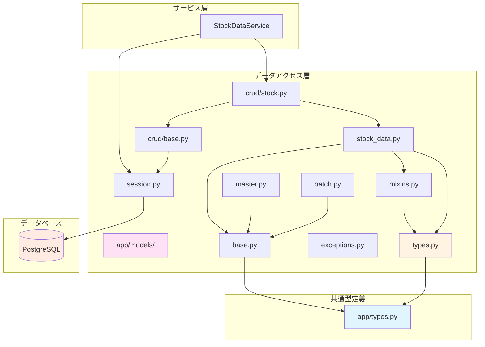
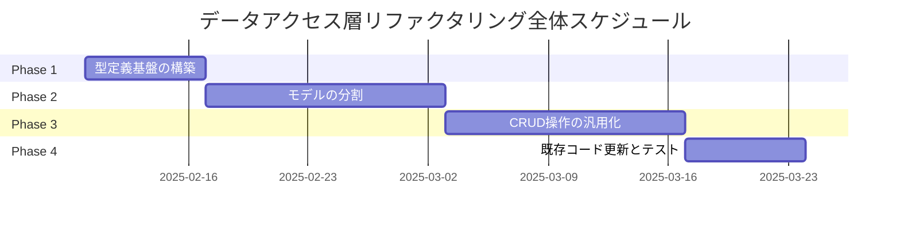

category: refactoring
ai_context: high
last_updated: 2025-01-09
related_docs:
  - ../layers/data_access_layer.md
  - ./service_layer_refactoring.md
  - ./api_layer_refactoring.md
  - ./presentation_layer_refactoring.md
  - ../type_definition_strategy.md
  - ../architecture_overview.md

# データアクセス層リファクタリング計画

## 目次

- [1. 概要](#1-概要)
- [2. 現状の課題](#2-現状の課題)
- [3. リファクタリング方針](#3-リファクタリング方針)
- [4. リファクタリング後のアーキテクチャ](#4-リファクタリング後のアーキテクチャ)
- [5. 具体的な改善項目](#5-具体的な改善項目)
- [6. 型定義戦略](#6-型定義戦略)
- [7. 実装計画](#7-実装計画)
- [8. 期待される効果](#8-期待される効果)

---

## 1. 概要

### 目的

データアクセス層の以下の観点からリファクタリングを実施します：

- **保守性の向上**: 巨大な models.py（1,263行）の分割と構造化
- **再利用性の向上**: CRUD操作クラスの汎用化と共通化
- **型安全性の向上**: 階層的型定義構造の導入と型ヒントの完全化
- **テスタビリティの向上**: データアクセス層の単体テストが容易な構造に変更
- **拡張性の向上**: 新しいモデルやテーブル追加時の影響範囲を最小化

### 対象範囲

```
app/
├── models.py              # 全モデル定義（1,263行）→ 分割対象
└── （新設ディレクトリ）
    ├── types.py           # プロジェクト共通型定義
    └── models/            # データアクセス層パッケージ
        ├── __init__.py
        ├── types.py       # モデル層固有の型定義
        ├── base.py        # 基底クラス
        ├── mixins.py      # Mixinクラス
        ├── stock_data.py  # 株価データモデル（8モデル）
        ├── master.py      # 銘柄マスタ関連（2モデル）
        ├── batch.py       # バッチ実行関連（2モデル）
        ├── crud/          # CRUD操作
        │   ├── __init__.py
        │   ├── base.py    # 基底CRUDクラス（汎用）
        │   └── stock.py   # 株価データCRUD（各時間軸）
        ├── exceptions.py  # データアクセス層専用例外
        └── session.py     # セッション管理
```

---

## 2. 現状の課題

### 2.1 コードの肥大化

#### 問題点

**models.py（1,263行）の巨大化**:
- すべてのモデル、CRUD、エラー、セッション管理が1ファイルに集中
- スクロールが必要で目的のコードを探しづらい
- 責務が混在（ORM定義、CRUD操作、エラーハンドリング、セッション管理）

**具体例**:
```python
# models.py（1,263行）の構成
class Base: ...                           # 基底クラス
class StockDataBase: ...                  # Mixin（85行）
class Stocks1m: ...                       # 株価1分足（110行）
class Stocks5m: ...                       # 株価5分足（110行）
# ... 他6つの株価モデル（各110行）
class StockMaster: ...                    # 銘柄マスタ（90行）
class StockMasterUpdate: ...              # 更新履歴（60行）
class BatchExecution: ...                 # バッチ実行（90行）
class BatchExecutionDetail: ...           # バッチ詳細（80行）
class StockDailyCRUD: ...                 # CRUD（280行）
def get_db_session(): ...                 # セッション管理
```

#### 影響

- 可読性の低下
- メンテナンスコストの増加
- 新しいモデル追加時の混乱
- コードレビューの困難性

### 2.2 CRUD操作の重複

#### 問題点

現在は `StockDailyCRUD` のみ実装されており、他の時間軸（1m, 5m, 1wk, 1moなど）のCRUD操作が不足:

```python
# 現状: 日足のみ実装
class StockDailyCRUD:
    @staticmethod
    def create(session: Session, **kwargs): ...
    @staticmethod
    def get_by_id(session: Session, stock_id: int): ...
    @staticmethod
    def bulk_create(session: Session, stock_data_list: List[Dict]): ...
    # ... 他13メソッド（計280行）

# 問題: 他の時間軸用のCRUDクラスがない
# → サービス層で個別にクエリを書く必要がある
# → コード重複とテストの困難性
```

#### 影響

- コードの重複（各サービスで個別にクエリ実装）
- テストカバレッジの低下
- バグの混入リスク増加
- 新しい時間軸追加時の実装コスト増加

### 2.3 型定義の不足

#### 問題点

モデル層固有の型定義が存在せず、型安全性が低い:

```python
# 現状: 型ヒントが不十分
def to_dict(self) -> Dict[str, Any]:  # Anyが多用される
    ...

# 問題: 戻り値の型が明確でない
# → エディタの補完が効かない
# → バグの発見が遅れる
```

**必要だが存在しない型定義**:
- モデルの辞書型表現（`StockDataDict`, `StockMasterDict`など）
- CRUD操作の戻り値型（`CreateResult`, `BulkCreateResult`など）
- クエリフィルタ型（`DateRangeFilter`, `SymbolFilter`など）
- ページネーション型（`PaginationParams`, `PaginationResult`など）

#### 影響

- 型安全性の欠如
- IDEサポートの低下
- バグの発見が遅れる
- ドキュメント不足

### 2.4 エラーハンドリングの一貫性不足

#### 問題点

エラークラスの階層構造が不明確:

```python
# 現状
class DatabaseError(Exception):
    """データベース操作エラー."""
    pass

class StockDataError(DatabaseError):
    """株価データに関するエラー."""
    pass

# 問題: 他のモデル用のエラークラスがない
# → 銘柄マスタやバッチ関連のエラーはどう扱う?
# → エラーハンドリングの一貫性がない
```

**必要だが存在しないエラークラス**:
- `MasterDataError`: 銘柄マスタ関連
- `BatchExecutionError`: バッチ実行関連
- `ValidationError`: データ検証エラー
- `ConstraintViolationError`: 制約違反エラー

#### 影響

- エラーハンドリングの一貫性不足
- エラー原因の特定が困難
- ログ分析の困難性
- 適切なエラーレスポンスの構築が困難

### 2.5 セッション管理の分離不足

#### 問題点

セッション管理が models.py 内に混在:

```python
# 現状: models.py 内にセッション管理
@contextmanager
def get_db_session():
    """データベースセッションのコンテキストマネージャー."""
    ...

# 問題: モデル定義とセッション管理が同居
# → 責務の混在
# → テスト時のモック作成が困難
```

#### 影響

- 責務の混在
- テストの困難性
- セッション設定の柔軟性不足
- トランザクション管理の一貫性不足

### 2.6 階層的型定義構造の未導入

#### 問題点

プロジェクト全体の型定義戦略（[型定義配置戦略](../type_definition_strategy.md)）が未適用:

```python
# 問題: app/types.py が存在しない
# → プロジェクト共通型（Interval, ProcessStatusなど）の配置場所がない

# 問題: app/models/types.py が存在しない
# → モデル層固有の型定義の配置場所がない
```

**必要だが存在しない型ファイル**:
- `app/types.py`: プロジェクト共通型
- `app/models/types.py`: モデル層固有型

#### 影響

- 型定義の散在
- 循環インポートのリスク増加
- 型の再利用性低下
- プロジェクト全体の型安全性低下

---

## 3. リファクタリング方針

### 3.1 基本方針

| 方針 | 説明 |
|-----|------|
| **段階的移行** | 既存のコードを壊さず、段階的にリファクタリング |
| **後方互換性** | 既存のインポートパスを維持（`from app.models import ...`） |
| **型安全性優先** | 階層的型定義構造の導入 |
| **汎用化** | CRUD操作の汎用化と共通化 |
| **テスト先行** | 包括的なテストスイートによる品質保証 |

### 3.2 段階的移行戦略

#### Phase 1: 型定義基盤の構築（1週間）

```
app/
├── types.py           # 新規作成
└── models/
    ├── types.py       # 新規作成
    └── exceptions.py  # 新規作成
```

#### Phase 2: モデルの分割（2週間）

```
app/models/
├── base.py           # Base, DatabaseError, StockDataBaseを移動
├── stock_data.py     # 8つの株価モデルを移動
├── master.py         # StockMaster, StockMasterUpdateを移動
├── batch.py          # BatchExecution, BatchExecutionDetailを移動
└── session.py        # get_db_session()を移動
```

#### Phase 3: CRUD操作の汎用化（2週間）

```
app/models/crud/
├── base.py           # BaseCRUD（汎用CRUDクラス）
└── stock.py          # 各時間軸用のCRUDクラス
```

#### Phase 4: 既存コードの更新とテスト（1週間）

```python
# 後方互換性を保つため、models.py を再エクスポート用に残す
# app/models.py
from app.models.base import Base, DatabaseError, StockDataBase
from app.models.stock_data import (
    Stocks1m, Stocks5m, Stocks15m, Stocks30m,
    Stocks1h, Stocks1d, Stocks1wk, Stocks1mo
)
from app.models.master import StockMaster, StockMasterUpdate
from app.models.batch import BatchExecution, BatchExecutionDetail
from app.models.session import get_db_session
from app.models.crud.stock import StockDailyCRUD

__all__ = [
    "Base", "DatabaseError", "StockDataBase",
    "Stocks1m", "Stocks5m", "Stocks15m", "Stocks30m",
    "Stocks1h", "Stocks1d", "Stocks1wk", "Stocks1mo",
    "StockMaster", "StockMasterUpdate",
    "BatchExecution", "BatchExecutionDetail",
    "get_db_session", "StockDailyCRUD",
]
```

### 3.3 後方互換性の保証

既存のコードを変更せずに動作させるため、以下の戦略を採用:

```python
# 既存コード（変更不要）
from app.models import Stocks1d, StockDailyCRUD, get_db_session

# 新しいコード（推奨）
from app.models.stock_data import Stocks1d
from app.models.crud.stock import StockDailyCRUD
from app.models.session import get_db_session
```

---

## 4. リファクタリング後のアーキテクチャ

### 4.1 ディレクトリ構造

```
app/
├── types.py                           # プロジェクト共通型定義（新設）
├── models.py                          # 後方互換性のための再エクスポート
└── models/                            # データアクセス層パッケージ（新設）
    ├── __init__.py                    # パッケージ初期化
    ├── types.py                       # モデル層固有の型定義（新設）
    ├── exceptions.py                  # データアクセス層専用例外（新設）
    ├── base.py                        # 基底クラス
    ├── mixins.py                      # Mixinクラス
    ├── stock_data.py                  # 株価データモデル（8モデル）
    ├── master.py                      # 銘柄マスタ関連（2モデル）
    ├── batch.py                       # バッチ実行関連（2モデル）
    ├── session.py                     # セッション管理
    └── crud/                          # CRUD操作
        ├── __init__.py
        ├── base.py                    # BaseCRUD（汎用）
        └── stock.py                   # 株価データCRUD（各時間軸）
```

### 4.2 依存関係図



### 4.3 モデル配置マトリクス

| カテゴリ | ファイル | モデル | 行数（目安） |
|---------|---------|--------|------------|
| **基底クラス** | `base.py` | Base, DatabaseError | 50行 |
| **Mixinクラス** | `mixins.py` | StockDataBase, TimestampMixin, DictSerializableMixin | 120行 |
| **株価データ** | `stock_data.py` | Stocks1m, 5m, 15m, 30m, 1h, 1d, 1wk, 1mo | 400行 |
| **銘柄マスタ** | `master.py` | StockMaster, StockMasterUpdate | 150行 |
| **バッチ実行** | `batch.py` | BatchExecution, BatchExecutionDetail | 170行 |
| **セッション** | `session.py` | get_db_session, SessionLocal, engine | 80行 |
| **CRUD基底** | `crud/base.py` | BaseCRUD（汎用） | 200行 |
| **CRUD株価** | `crud/stock.py` | 各時間軸用CRUDクラス | 300行 |

**合計**: 約1,470行（元の1,263行から約200行増加）
- 増加理由: 汎用CRUD実装、型定義の追加、ドキュメント強化

---

## 5. 具体的な改善項目

### 5.1 型定義基盤の構築

#### 5.1.1 プロジェクト共通型定義（app/types.py）

**新規作成**:

```python
"""プロジェクト共通型定義.

このモジュールには、複数のレイヤーで使用される共通の型定義を配置します。
詳細は docs/architecture/type_definition_strategy.md を参照してください。
"""

from typing import Literal, TypedDict
from enum import Enum

# ============================================================================
# 時間軸定義
# ============================================================================

Interval = Literal["1m", "5m", "15m", "30m", "1h", "1d", "1wk", "1mo"]
"""株価データの時間軸型.

サポートされる時間軸:
- 分足: 1m, 5m, 15m, 30m
- 時間足: 1h
- 日足以上: 1d, 1wk, 1mo
"""

# ============================================================================
# シンボル定義
# ============================================================================

Symbol = str
"""銘柄コード型（Yahoo Finance形式、例: "7203.T"）."""

StockCode = str
"""銘柄コード型（シンプル形式、例: "7203"）."""

# ============================================================================
# ステータス定義
# ============================================================================

class ProcessStatus(str, Enum):
    """処理ステータス."""

    PENDING = "pending"
    """処理待ち."""

    IN_PROGRESS = "in_progress"
    """処理中."""

    COMPLETED = "completed"
    """完了."""

    FAILED = "failed"
    """失敗."""

    CANCELLED = "cancelled"
    """キャンセル."""


class BatchStatus(str, Enum):
    """バッチ処理ステータス."""

    RUNNING = "running"
    """実行中."""

    COMPLETED = "completed"
    """完了."""

    FAILED = "failed"
    """失敗."""

    PAUSED = "paused"
    """一時停止."""


# ============================================================================
# ページネーション型定義
# ============================================================================

class PaginationParams(TypedDict, total=False):
    """ページネーションパラメータ."""

    limit: int
    """取得件数（デフォルト: 100, 最大: 1000）."""

    offset: int
    """オフセット（デフォルト: 0）."""


class PaginationMeta(TypedDict):
    """ページネーションメタデータ."""

    total: int
    """総件数."""

    limit: int
    """取得件数."""

    offset: int
    """オフセット."""

    has_more: bool
    """次のページがあるか."""
```

#### 5.1.2 モデル層固有型定義（app/models/types.py）

**新規作成**:

```python
"""データアクセス層固有の型定義.

このモジュールには、データアクセス層（モデル、CRUD操作）でのみ
使用される型定義を配置します。
"""

from typing import TypedDict, Optional, List, Any
from datetime import date, datetime
from decimal import Decimal

from app.types import Symbol, StockCode, Interval

# ============================================================================
# モデル辞書型定義
# ============================================================================

class StockDataDict(TypedDict):
    """株価データの辞書型表現（共通フィールド）."""

    id: int
    symbol: Symbol
    open: float
    high: float
    low: float
    close: float
    volume: int
    created_at: str  # ISO8601形式
    updated_at: str  # ISO8601形式


class StockDataDictWithDatetime(StockDataDict):
    """株価データの辞書型表現（分足・時間足用）."""

    datetime: str  # ISO8601形式


class StockDataDictWithDate(StockDataDict):
    """株価データの辞書型表現（日足以上用）."""

    date: str  # YYYY-MM-DD形式


class StockMasterDict(TypedDict):
    """銘柄マスタの辞書型表現."""

    id: int
    stock_code: StockCode
    stock_name: str
    market_category: Optional[str]
    sector_code_33: Optional[str]
    sector_name_33: Optional[str]
    sector_code_17: Optional[str]
    sector_name_17: Optional[str]
    scale_code: Optional[str]
    scale_category: Optional[str]
    data_date: Optional[str]
    is_active: bool
    created_at: str  # ISO8601形式
    updated_at: str  # ISO8601形式


class BatchExecutionDict(TypedDict):
    """バッチ実行情報の辞書型表現."""

    id: int
    batch_type: str
    status: str
    total_stocks: int
    processed_stocks: int
    successful_stocks: int
    failed_stocks: int
    start_time: str  # ISO8601形式
    end_time: Optional[str]  # ISO8601形式
    error_message: Optional[str]
    created_at: str  # ISO8601形式
    progress_percentage: float
    duration_seconds: Optional[float]


# ============================================================================
# クエリフィルタ型定義
# ============================================================================

class DateRangeFilter(TypedDict, total=False):
    """日付範囲フィルタ."""

    start_date: date
    """開始日."""

    end_date: date
    """終了日."""


class DatetimeRangeFilter(TypedDict, total=False):
    """日時範囲フィルタ."""

    start_datetime: datetime
    """開始日時."""

    end_datetime: datetime
    """終了日時."""


class SymbolFilter(TypedDict):
    """銘柄フィルタ."""

    symbol: Symbol
    """銘柄コード."""


class StockDataQueryFilter(TypedDict, total=False):
    """株価データクエリフィルタ（統合版）."""

    symbol: Symbol
    """銘柄コード（必須）."""

    start_date: Optional[date]
    """開始日（日足以上）."""

    end_date: Optional[date]
    """終了日（日足以上）."""

    start_datetime: Optional[datetime]
    """開始日時（分足・時間足）."""

    end_datetime: Optional[datetime]
    """終了日時（分足・時間足）."""

    limit: int
    """取得件数（デフォルト: 100）."""

    offset: int
    """オフセット（デフォルト: 0）."""


# ============================================================================
# CRUD操作結果型定義
# ============================================================================

class CreateResult(TypedDict):
    """作成操作の結果."""

    success: bool
    """成功したか."""

    created_id: Optional[int]
    """作成されたレコードのID."""

    error: Optional[str]
    """エラーメッセージ."""


class BulkCreateResult(TypedDict):
    """一括作成操作の結果."""

    success: bool
    """成功したか."""

    created_count: int
    """作成されたレコード数."""

    failed_count: int
    """失敗したレコード数."""

    errors: List[str]
    """エラーメッセージのリスト."""


class UpdateResult(TypedDict):
    """更新操作の結果."""

    success: bool
    """成功したか."""

    updated_id: Optional[int]
    """更新されたレコードのID."""

    error: Optional[str]
    """エラーメッセージ."""


class DeleteResult(TypedDict):
    """削除操作の結果."""

    success: bool
    """成功したか."""

    deleted_id: Optional[int]
    """削除されたレコードのID."""

    error: Optional[str]
    """エラーメッセージ."""


# ============================================================================
# モデル作成パラメータ型定義
# ============================================================================

class StockDataCreateParams(TypedDict):
    """株価データ作成パラメータ."""

    symbol: Symbol
    open: Decimal
    high: Decimal
    low: Decimal
    close: Decimal
    volume: int


class StockDataCreateParamsWithDatetime(StockDataCreateParams):
    """株価データ作成パラメータ（分足・時間足用）."""

    datetime: datetime


class StockDataCreateParamsWithDate(StockDataCreateParams):
    """株価データ作成パラメータ（日足以上用）."""

    date: date
```

#### 5.1.3 データアクセス層専用例外（app/models/exceptions.py）

**新規作成**:

```python
"""データアクセス層専用の例外クラス.

このモジュールには、データベース操作やモデル操作で発生する
例外クラスを定義します。
"""

from typing import Optional, Any


class DatabaseError(Exception):
    """データベース操作の基底エラー.

    すべてのデータベース関連のエラーはこのクラスを継承します。
    """

    def __init__(
        self,
        message: str,
        original_error: Optional[Exception] = None,
        **kwargs: Any,
    ) -> None:
        """初期化.

        Args:
            message: エラーメッセージ
            original_error: 元の例外（ある場合）
            **kwargs: 追加のコンテキスト情報
        """
        super().__init__(message)
        self.message = message
        self.original_error = original_error
        self.context = kwargs


class StockDataError(DatabaseError):
    """株価データに関するエラー.

    株価データモデル（Stocks1m, Stocks1d等）の操作で発生するエラー。
    """

    pass


class MasterDataError(DatabaseError):
    """銘柄マスタデータに関するエラー.

    StockMaster, StockMasterUpdate の操作で発生するエラー。
    """

    pass


class BatchExecutionError(DatabaseError):
    """バッチ実行に関するエラー.

    BatchExecution, BatchExecutionDetail の操作で発生するエラー。
    """

    pass


class ValidationError(DatabaseError):
    """データ検証エラー.

    モデルのバリデーションで発生するエラー。
    例: 価格の論理チェック、日付の整合性チェック等。
    """

    def __init__(
        self,
        message: str,
        field: Optional[str] = None,
        value: Optional[Any] = None,
        **kwargs: Any,
    ) -> None:
        """初期化.

        Args:
            message: エラーメッセージ
            field: エラーが発生したフィールド名
            value: 問題のある値
            **kwargs: 追加のコンテキスト情報
        """
        super().__init__(message, **kwargs)
        self.field = field
        self.value = value


class ConstraintViolationError(DatabaseError):
    """制約違反エラー.

    データベース制約（UNIQUE, CHECK等）の違反で発生するエラー。
    """

    def __init__(
        self,
        message: str,
        constraint_name: Optional[str] = None,
        **kwargs: Any,
    ) -> None:
        """初期化.

        Args:
            message: エラーメッセージ
            constraint_name: 違反した制約名
            **kwargs: 追加のコンテキスト情報
        """
        super().__init__(message, **kwargs)
        self.constraint_name = constraint_name


class RecordNotFoundError(DatabaseError):
    """レコード未検出エラー.

    指定された条件でレコードが見つからない場合のエラー。
    """

    def __init__(
        self,
        message: str,
        model: Optional[str] = None,
        query_params: Optional[dict] = None,
        **kwargs: Any,
    ) -> None:
        """初期化.

        Args:
            message: エラーメッセージ
            model: 検索対象のモデル名
            query_params: 検索条件
            **kwargs: 追加のコンテキスト情報
        """
        super().__init__(message, **kwargs)
        self.model = model
        self.query_params = query_params


class DuplicateRecordError(ConstraintViolationError):
    """レコード重複エラー.

    UNIQUE制約違反により、重複レコードの作成が試みられた場合のエラー。
    """

    def __init__(
        self,
        message: str,
        model: Optional[str] = None,
        duplicate_fields: Optional[dict] = None,
        **kwargs: Any,
    ) -> None:
        """初期化.

        Args:
            message: エラーメッセージ
            model: モデル名
            duplicate_fields: 重複したフィールドと値
            **kwargs: 追加のコンテキスト情報
        """
        super().__init__(message, **kwargs)
        self.model = model
        self.duplicate_fields = duplicate_fields
```

### 5.2 モデルの分割

#### 5.2.1 基底クラス（app/models/base.py）

**改善内容**:

```python
"""データアクセス層の基底クラス.

このモジュールには、すべてのモデルクラスの基底となる
Baseクラスを定義します。
"""

from sqlalchemy.orm import DeclarativeBase


class Base(DeclarativeBase):
    """すべてのモデルの基底クラス.

    SQLAlchemyの宣言的マッピングの基底クラス。
    すべてのORMモデルはこのクラスを継承します。

    Example:
        >>> class MyModel(Base):
        ...     __tablename__ = "my_table"
        ...     id: Mapped[int] = mapped_column(primary_key=True)
    """

    pass
```

#### 5.2.2 Mixinクラス（app/models/mixins.py）

**改善内容**:

```python
"""データアクセス層のMixinクラス.

このモジュールには、複数のモデルで共通して使用される
機能をMixinクラスとして定義します。
"""

from typing import Dict, Any
from datetime import datetime, timezone
from decimal import Decimal
import math

from sqlalchemy import CheckConstraint
from sqlalchemy.orm import Mapped, mapped_column
from sqlalchemy.types import Numeric, BigInteger, DateTime

from app.types import Symbol
from app.models.types import StockDataDict


class TimestampMixin:
    """タイムスタンプフィールドを提供するMixin.

    created_at と updated_at フィールドを自動的に追加します。
    """

    created_at: Mapped[datetime] = mapped_column(
        DateTime(timezone=True),
        default=lambda: datetime.now(timezone.utc),
        nullable=False,
        comment="作成日時",
    )

    updated_at: Mapped[datetime] = mapped_column(
        DateTime(timezone=True),
        default=lambda: datetime.now(timezone.utc),
        onupdate=lambda: datetime.now(timezone.utc),
        nullable=False,
        comment="更新日時",
    )


class DictSerializableMixin:
    """辞書型への変換機能を提供するMixin.

    to_dict() メソッドを提供し、モデルインスタンスを
    辞書形式に変換します。
    """

    def to_dict(self) -> Dict[str, Any]:
        """モデルインスタンスを辞書形式に変換.

        Returns:
            モデルの全フィールドを含む辞書

        Note:
            - Decimal型はfloatに変換されます
            - datetime型はISO8601形式の文字列に変換されます
            - date型はYYYY-MM-DD形式の文字列に変換されます
            - NaN/Infは適切に処理されます
        """
        result: Dict[str, Any] = {}

        for column in self.__table__.columns:
            value = getattr(self, column.name)

            # Decimal型の変換
            if isinstance(value, Decimal):
                value = float(value)
                # NaN/Infのチェック
                if math.isnan(value) or math.isinf(value):
                    value = None

            # datetime型の変換
            elif isinstance(value, datetime):
                value = value.isoformat()

            # date型の変換
            elif hasattr(value, "isoformat"):
                value = value.isoformat()

            result[column.name] = value

        return result


class StockDataBase(TimestampMixin, DictSerializableMixin):
    """株価データモデルの共通ベースクラス.

    すべての株価データモデル（Stocks1m, Stocks1d等）の
    共通フィールドとメソッドを定義します。

    Attributes:
        id: レコードID
        symbol: 銘柄コード（例: "7203.T"）
        open: 始値
        high: 高値
        low: 安値
        close: 終値
        volume: 出来高
        created_at: 作成日時（TimestampMixinより）
        updated_at: 更新日時（TimestampMixinより）
    """

    id: Mapped[int] = mapped_column(
        primary_key=True,
        autoincrement=True,
        comment="レコードID",
    )

    symbol: Mapped[Symbol] = mapped_column(
        String(20),
        nullable=False,
        index=True,
        comment="銘柄コード（例: 7203.T）",
    )

    open: Mapped[Decimal] = mapped_column(
        Numeric(10, 2),
        CheckConstraint("open >= 0", name="ck_open_positive"),
        nullable=False,
        comment="始値",
    )

    high: Mapped[Decimal] = mapped_column(
        Numeric(10, 2),
        CheckConstraint("high >= 0", name="ck_high_positive"),
        nullable=False,
        comment="高値",
    )

    low: Mapped[Decimal] = mapped_column(
        Numeric(10, 2),
        CheckConstraint("low >= 0", name="ck_low_positive"),
        nullable=False,
        comment="安値",
    )

    close: Mapped[Decimal] = mapped_column(
        Numeric(10, 2),
        CheckConstraint("close >= 0", name="ck_close_positive"),
        nullable=False,
        comment="終値",
    )

    volume: Mapped[int] = mapped_column(
        BigInteger,
        CheckConstraint("volume >= 0", name="ck_volume_positive"),
        nullable=False,
        comment="出来高",
    )

    __table_args__ = (
        CheckConstraint(
            "high >= low AND high >= open AND high >= close "
            "AND low <= open AND low <= close",
            name="ck_price_logic",
        ),
    )
```

#### 5.2.3 株価データモデル（app/models/stock_data.py）

**改善内容**:
- 8つの株価モデルを1ファイルに集約
- 共通フィールドは `StockDataBase` から継承
- 各モデルは `datetime` or `date` フィールドのみ定義

```python
"""株価データモデル.

このモジュールには、すべての時間軸の株価データモデルを定義します。
"""

from datetime import datetime, date
from typing import Optional

from sqlalchemy import String, DateTime, Date, Index, UniqueConstraint
from sqlalchemy.orm import Mapped, mapped_column

from app.models.base import Base
from app.models.mixins import StockDataBase
from app.types import Symbol, Interval


# ============================================================================
# 分足・時間足モデル（datetime使用）
# ============================================================================

class Stocks1m(Base, StockDataBase):
    """1分足株価データモデル."""

    __tablename__ = "stocks_1m"

    datetime: Mapped[datetime] = mapped_column(
        DateTime(timezone=True),
        nullable=False,
        comment="データ日時",
    )

    __table_args__ = (
        UniqueConstraint("symbol", "datetime", name="uq_stocks_1m_symbol_datetime"),
        Index("idx_stocks_1m_symbol", "symbol"),
        Index("idx_stocks_1m_datetime", "datetime"),
        Index("idx_stocks_1m_symbol_datetime_desc", "symbol", "datetime", postgresql_using="btree"),
        StockDataBase.__table_args__,  # 価格論理チェック制約を継承
    )

    def __repr__(self) -> str:
        return f"<Stocks1m(symbol={self.symbol}, datetime={self.datetime})>"


class Stocks5m(Base, StockDataBase):
    """5分足株価データモデル."""

    __tablename__ = "stocks_5m"

    datetime: Mapped[datetime] = mapped_column(
        DateTime(timezone=True),
        nullable=False,
        comment="データ日時",
    )

    __table_args__ = (
        UniqueConstraint("symbol", "datetime", name="uq_stocks_5m_symbol_datetime"),
        Index("idx_stocks_5m_symbol", "symbol"),
        Index("idx_stocks_5m_datetime", "datetime"),
        Index("idx_stocks_5m_symbol_datetime_desc", "symbol", "datetime", postgresql_using="btree"),
        StockDataBase.__table_args__,
    )

    def __repr__(self) -> str:
        return f"<Stocks5m(symbol={self.symbol}, datetime={self.datetime})>"


class Stocks15m(Base, StockDataBase):
    """15分足株価データモデル."""

    __tablename__ = "stocks_15m"

    datetime: Mapped[datetime] = mapped_column(
        DateTime(timezone=True),
        nullable=False,
        comment="データ日時",
    )

    __table_args__ = (
        UniqueConstraint("symbol", "datetime", name="uq_stocks_15m_symbol_datetime"),
        Index("idx_stocks_15m_symbol", "symbol"),
        Index("idx_stocks_15m_datetime", "datetime"),
        Index("idx_stocks_15m_symbol_datetime_desc", "symbol", "datetime", postgresql_using="btree"),
        StockDataBase.__table_args__,
    )

    def __repr__(self) -> str:
        return f"<Stocks15m(symbol={self.symbol}, datetime={self.datetime})>"


class Stocks30m(Base, StockDataBase):
    """30分足株価データモデル."""

    __tablename__ = "stocks_30m"

    datetime: Mapped[datetime] = mapped_column(
        DateTime(timezone=True),
        nullable=False,
        comment="データ日時",
    )

    __table_args__ = (
        UniqueConstraint("symbol", "datetime", name="uq_stocks_30m_symbol_datetime"),
        Index("idx_stocks_30m_symbol", "symbol"),
        Index("idx_stocks_30m_datetime", "datetime"),
        Index("idx_stocks_30m_symbol_datetime_desc", "symbol", "datetime", postgresql_using="btree"),
        StockDataBase.__table_args__,
    )

    def __repr__(self) -> str:
        return f"<Stocks30m(symbol={self.symbol}, datetime={self.datetime})>"


class Stocks1h(Base, StockDataBase):
    """1時間足株価データモデル."""

    __tablename__ = "stocks_1h"

    datetime: Mapped[datetime] = mapped_column(
        DateTime(timezone=True),
        nullable=False,
        comment="データ日時",
    )

    __table_args__ = (
        UniqueConstraint("symbol", "datetime", name="uq_stocks_1h_symbol_datetime"),
        Index("idx_stocks_1h_symbol", "symbol"),
        Index("idx_stocks_1h_datetime", "datetime"),
        Index("idx_stocks_1h_symbol_datetime_desc", "symbol", "datetime", postgresql_using="btree"),
        StockDataBase.__table_args__,
    )

    def __repr__(self) -> str:
        return f"<Stocks1h(symbol={self.symbol}, datetime={self.datetime})>"


# ============================================================================
# 日足・週足・月足モデル（date使用）
# ============================================================================

class Stocks1d(Base, StockDataBase):
    """日足株価データモデル."""

    __tablename__ = "stocks_1d"

    date: Mapped[date] = mapped_column(
        Date,
        nullable=False,
        comment="データ日付",
    )

    __table_args__ = (
        UniqueConstraint("symbol", "date", name="uq_stocks_1d_symbol_date"),
        Index("idx_stocks_1d_symbol", "symbol"),
        Index("idx_stocks_1d_date", "date"),
        Index("idx_stocks_1d_symbol_date_desc", "symbol", "date", postgresql_using="btree"),
        StockDataBase.__table_args__,
    )

    def __repr__(self) -> str:
        return f"<Stocks1d(symbol={self.symbol}, date={self.date})>"


class Stocks1wk(Base, StockDataBase):
    """週足株価データモデル."""

    __tablename__ = "stocks_1wk"

    date: Mapped[date] = mapped_column(
        Date,
        nullable=False,
        comment="データ日付（週の開始日）",
    )

    __table_args__ = (
        UniqueConstraint("symbol", "date", name="uq_stocks_1wk_symbol_date"),
        Index("idx_stocks_1wk_symbol", "symbol"),
        Index("idx_stocks_1wk_date", "date"),
        Index("idx_stocks_1wk_symbol_date_desc", "symbol", "date", postgresql_using="btree"),
        StockDataBase.__table_args__,
    )

    def __repr__(self) -> str:
        return f"<Stocks1wk(symbol={self.symbol}, date={self.date})>"


class Stocks1mo(Base, StockDataBase):
    """月足株価データモデル."""

    __tablename__ = "stocks_1mo"

    date: Mapped[date] = mapped_column(
        Date,
        nullable=False,
        comment="データ日付（月の開始日）",
    )

    __table_args__ = (
        UniqueConstraint("symbol", "date", name="uq_stocks_1mo_symbol_date"),
        Index("idx_stocks_1mo_symbol", "symbol"),
        Index("idx_stocks_1mo_date", "date"),
        Index("idx_stocks_1mo_symbol_date_desc", "symbol", "date", postgresql_using="btree"),
        StockDataBase.__table_args__,
    )

    def __repr__(self) -> str:
        return f"<Stocks1mo(symbol={self.symbol}, date={self.date})>"


# ============================================================================
# 時間軸とモデルのマッピング
# ============================================================================

INTERVAL_MODEL_MAP: dict[Interval, type[Base]] = {
    "1m": Stocks1m,
    "5m": Stocks5m,
    "15m": Stocks15m,
    "30m": Stocks30m,
    "1h": Stocks1h,
    "1d": Stocks1d,
    "1wk": Stocks1wk,
    "1mo": Stocks1mo,
}
"""時間軸文字列とモデルクラスのマッピング.

Example:
    >>> model_class = INTERVAL_MODEL_MAP["1d"]
    >>> print(model_class)
    <class 'app.models.stock_data.Stocks1d'>
"""


def get_stock_model(interval: Interval) -> type[Base]:
    """時間軸に対応する株価モデルクラスを取得.

    Args:
        interval: 時間軸（例: "1d", "1h", "1m"）

    Returns:
        対応するモデルクラス

    Raises:
        ValueError: サポートされていない時間軸の場合

    Example:
        >>> model = get_stock_model("1d")
        >>> print(model.__tablename__)
        stocks_1d
    """
    if interval not in INTERVAL_MODEL_MAP:
        raise ValueError(
            f"Unsupported interval: {interval}. "
            f"Supported intervals: {list(INTERVAL_MODEL_MAP.keys())}"
        )

    return INTERVAL_MODEL_MAP[interval]


# 後方互換性のためのエイリアス
StockDaily = Stocks1d
```

**改善ポイント**:
1. **コード重複の削減**: 共通フィールドは `StockDataBase` に集約
2. **型安全性の向上**: `INTERVAL_MODEL_MAP` による動的なモデル取得
3. **ドキュメントの充実**: 各モデルに詳細なドキュメント追加
4. **拡張性の向上**: 新しい時間軸追加時は1モデル追加のみ

### 5.3 CRUD操作の汎用化

#### 5.3.1 基底CRUDクラス（app/models/crud/base.py）

**新規作成**:

```python
"""CRUD操作の基底クラス.

このモジュールには、すべてのCRUDクラスの基底となる
BaseCRUDクラスを定義します。
"""

from typing import TypeVar, Generic, Optional, List, Dict, Any, Type
from sqlalchemy.orm import Session
from sqlalchemy.exc import IntegrityError, SQLAlchemyError

from app.models.base import Base
from app.models.exceptions import (
    DatabaseError,
    DuplicateRecordError,
    RecordNotFoundError,
    ConstraintViolationError,
)
from app.types import PaginationParams
from app.models.types import (
    CreateResult,
    BulkCreateResult,
    UpdateResult,
    DeleteResult,
)

# 型変数
ModelType = TypeVar("ModelType", bound=Base)


class BaseCRUD(Generic[ModelType]):
    """CRUD操作の基底クラス.

    すべてのモデルに対する基本的なCRUD操作を提供します。

    Attributes:
        model: 操作対象のモデルクラス

    Example:
        >>> class StockDailyCRUD(BaseCRUD[Stocks1d]):
        ...     model = Stocks1d
        ...
        >>> crud = StockDailyCRUD()
        >>> with get_db_session() as session:
        ...     data = crud.get_by_id(session, 1)
    """

    model: Type[ModelType]

    @classmethod
    def create(
        cls,
        session: Session,
        **kwargs: Any,
    ) -> ModelType:
        """新規レコードを作成.

        Args:
            session: データベースセッション
            **kwargs: モデルのフィールド値

        Returns:
            作成されたモデルインスタンス

        Raises:
            DuplicateRecordError: ユニーク制約違反の場合
            ConstraintViolationError: その他の制約違反の場合
            DatabaseError: データベースエラーの場合
        """
        try:
            instance = cls.model(**kwargs)
            session.add(instance)
            session.flush()
            return instance

        except IntegrityError as e:
            session.rollback()
            error_message = str(e.orig)

            if "unique constraint" in error_message.lower():
                raise DuplicateRecordError(
                    f"Duplicate record in {cls.model.__tablename__}",
                    model=cls.model.__name__,
                    duplicate_fields=kwargs,
                    original_error=e,
                )
            else:
                raise ConstraintViolationError(
                    f"Constraint violation in {cls.model.__tablename__}: {error_message}",
                    original_error=e,
                )

        except SQLAlchemyError as e:
            session.rollback()
            raise DatabaseError(
                f"Failed to create record in {cls.model.__tablename__}",
                original_error=e,
            )

    @classmethod
    def get_by_id(
        cls,
        session: Session,
        record_id: int,
    ) -> Optional[ModelType]:
        """IDでレコードを取得.

        Args:
            session: データベースセッション
            record_id: レコードID

        Returns:
            モデルインスタンス、見つからない場合はNone
        """
        try:
            return session.query(cls.model).filter(cls.model.id == record_id).first()

        except SQLAlchemyError as e:
            raise DatabaseError(
                f"Failed to get record by ID from {cls.model.__tablename__}",
                original_error=e,
                query_params={"id": record_id},
            )

    @classmethod
    def get_all(
        cls,
        session: Session,
        limit: int = 100,
        offset: int = 0,
    ) -> List[ModelType]:
        """全レコードを取得（ページネーション対応）.

        Args:
            session: データベースセッション
            limit: 取得件数（デフォルト: 100）
            offset: オフセット（デフォルト: 0）

        Returns:
            モデルインスタンスのリスト
        """
        try:
            return (
                session.query(cls.model)
                .limit(limit)
                .offset(offset)
                .all()
            )

        except SQLAlchemyError as e:
            raise DatabaseError(
                f"Failed to get all records from {cls.model.__tablename__}",
                original_error=e,
                query_params={"limit": limit, "offset": offset},
            )

    @classmethod
    def update(
        cls,
        session: Session,
        record_id: int,
        **kwargs: Any,
    ) -> Optional[ModelType]:
        """レコードを更新.

        Args:
            session: データベースセッション
            record_id: 更新対象のレコードID
            **kwargs: 更新するフィールドと値

        Returns:
            更新されたモデルインスタンス、見つからない場合はNone

        Raises:
            RecordNotFoundError: レコードが見つからない場合
            DatabaseError: データベースエラーの場合
        """
        try:
            instance = cls.get_by_id(session, record_id)

            if instance is None:
                raise RecordNotFoundError(
                    f"Record not found in {cls.model.__tablename__}",
                    model=cls.model.__name__,
                    query_params={"id": record_id},
                )

            for key, value in kwargs.items():
                if hasattr(instance, key):
                    setattr(instance, key, value)

            session.flush()
            return instance

        except RecordNotFoundError:
            raise

        except SQLAlchemyError as e:
            session.rollback()
            raise DatabaseError(
                f"Failed to update record in {cls.model.__tablename__}",
                original_error=e,
                query_params={"id": record_id, **kwargs},
            )

    @classmethod
    def delete(
        cls,
        session: Session,
        record_id: int,
    ) -> bool:
        """レコードを削除.

        Args:
            session: データベースセッション
            record_id: 削除対象のレコードID

        Returns:
            削除に成功した場合はTrue、レコードが見つからない場合はFalse

        Raises:
            DatabaseError: データベースエラーの場合
        """
        try:
            instance = cls.get_by_id(session, record_id)

            if instance is None:
                return False

            session.delete(instance)
            session.flush()
            return True

        except SQLAlchemyError as e:
            session.rollback()
            raise DatabaseError(
                f"Failed to delete record from {cls.model.__tablename__}",
                original_error=e,
                query_params={"id": record_id},
            )

    @classmethod
    def bulk_create(
        cls,
        session: Session,
        records: List[Dict[str, Any]],
    ) -> List[ModelType]:
        """複数レコードを一括作成.

        Args:
            session: データベースセッション
            records: レコードのリスト（各レコードは辞書形式）

        Returns:
            作成されたモデルインスタンスのリスト

        Raises:
            DatabaseError: データベースエラーの場合
        """
        try:
            instances = [cls.model(**record) for record in records]
            session.add_all(instances)
            session.flush()
            return instances

        except IntegrityError as e:
            session.rollback()
            raise DuplicateRecordError(
                f"Duplicate records in {cls.model.__tablename__}",
                model=cls.model.__name__,
                original_error=e,
            )

        except SQLAlchemyError as e:
            session.rollback()
            raise DatabaseError(
                f"Failed to bulk create records in {cls.model.__tablename__}",
                original_error=e,
            )

    @classmethod
    def count_all(cls, session: Session) -> int:
        """全レコード数を取得.

        Args:
            session: データベースセッション

        Returns:
            レコード数
        """
        try:
            return session.query(cls.model).count()

        except SQLAlchemyError as e:
            raise DatabaseError(
                f"Failed to count records in {cls.model.__tablename__}",
                original_error=e,
            )
```

#### 5.3.2 株価データCRUD（app/models/crud/stock.py）

**改善内容**:
- 汎用化された `BaseCRUD` を継承
- 各時間軸用のCRUDクラスを提供
- 既存の `StockDailyCRUD` を拡張

```python
"""株価データ用CRUD操作.

このモジュールには、すべての時間軸の株価データに対する
CRUD操作を提供するクラスを定義します。
"""

from typing import Optional, List
from datetime import date, datetime
from sqlalchemy.orm import Session
from sqlalchemy.exc import SQLAlchemyError

from app.models.base import Base
from app.models.stock_data import (
    Stocks1m,
    Stocks5m,
    Stocks15m,
    Stocks30m,
    Stocks1h,
    Stocks1d,
    Stocks1wk,
    Stocks1mo,
    get_stock_model,
)
from app.models.crud.base import BaseCRUD
from app.models.exceptions import DatabaseError
from app.types import Symbol, Interval


class StockDataCRUD(BaseCRUD[Base]):
    """株価データ用CRUD操作の共通クラス.

    すべての時間軸の株価データに対する共通操作を提供します。
    """

    @classmethod
    def get_by_symbol_and_date(
        cls,
        session: Session,
        symbol: Symbol,
        target_date: date,
    ) -> Optional[Base]:
        """銘柄コードと日付でレコードを取得（日足以上用）.

        Args:
            session: データベースセッション
            symbol: 銘柄コード
            target_date: 対象日付

        Returns:
            モデルインスタンス、見つからない場合はNone
        """
        try:
            return (
                session.query(cls.model)
                .filter(cls.model.symbol == symbol, cls.model.date == target_date)
                .first()
            )

        except SQLAlchemyError as e:
            raise DatabaseError(
                f"Failed to get record by symbol and date from {cls.model.__tablename__}",
                original_error=e,
                query_params={"symbol": symbol, "date": target_date},
            )

    @classmethod
    def get_by_symbol_and_datetime(
        cls,
        session: Session,
        symbol: Symbol,
        target_datetime: datetime,
    ) -> Optional[Base]:
        """銘柄コードと日時でレコードを取得（分足・時間足用）.

        Args:
            session: データベースセッション
            symbol: 銘柄コード
            target_datetime: 対象日時

        Returns:
            モデルインスタンス、見つからない場合はNone
        """
        try:
            return (
                session.query(cls.model)
                .filter(
                    cls.model.symbol == symbol,
                    cls.model.datetime == target_datetime,
                )
                .first()
            )

        except SQLAlchemyError as e:
            raise DatabaseError(
                f"Failed to get record by symbol and datetime from {cls.model.__tablename__}",
                original_error=e,
                query_params={"symbol": symbol, "datetime": target_datetime},
            )

    @classmethod
    def get_by_symbol(
        cls,
        session: Session,
        symbol: Symbol,
        limit: int = 100,
        offset: int = 0,
        start_date: Optional[date] = None,
        end_date: Optional[date] = None,
    ) -> List[Base]:
        """銘柄コードでレコードを取得（日付範囲フィルタ対応）.

        Args:
            session: データベースセッション
            symbol: 銘柄コード
            limit: 取得件数（デフォルト: 100）
            offset: オフセット（デフォルト: 0）
            start_date: 開始日（省略可）
            end_date: 終了日（省略可）

        Returns:
            モデルインスタンスのリスト
        """
        try:
            query = session.query(cls.model).filter(cls.model.symbol == symbol)

            # 日付範囲フィルタ
            if start_date:
                query = query.filter(cls.model.date >= start_date)

            if end_date:
                query = query.filter(cls.model.date <= end_date)

            return query.order_by(cls.model.date.desc()).limit(limit).offset(offset).all()

        except SQLAlchemyError as e:
            raise DatabaseError(
                f"Failed to get records by symbol from {cls.model.__tablename__}",
                original_error=e,
                query_params={
                    "symbol": symbol,
                    "limit": limit,
                    "offset": offset,
                    "start_date": start_date,
                    "end_date": end_date,
                },
            )

    @classmethod
    def count_by_symbol(
        cls,
        session: Session,
        symbol: Symbol,
    ) -> int:
        """銘柄ごとのレコード数を取得.

        Args:
            session: データベースセッション
            symbol: 銘柄コード

        Returns:
            レコード数
        """
        try:
            return session.query(cls.model).filter(cls.model.symbol == symbol).count()

        except SQLAlchemyError as e:
            raise DatabaseError(
                f"Failed to count records by symbol in {cls.model.__tablename__}",
                original_error=e,
                query_params={"symbol": symbol},
            )

    @classmethod
    def get_latest_date_by_symbol(
        cls,
        session: Session,
        symbol: Symbol,
    ) -> Optional[date]:
        """銘柄の最新日付を取得.

        Args:
            session: データベースセッション
            symbol: 銘柄コード

        Returns:
            最新日付、データがない場合はNone
        """
        try:
            result = (
                session.query(cls.model.date)
                .filter(cls.model.symbol == symbol)
                .order_by(cls.model.date.desc())
                .first()
            )
            return result[0] if result else None

        except SQLAlchemyError as e:
            raise DatabaseError(
                f"Failed to get latest date by symbol from {cls.model.__tablename__}",
                original_error=e,
                query_params={"symbol": symbol},
            )


# ============================================================================
# 各時間軸用のCRUDクラス
# ============================================================================

class Stocks1mCRUD(StockDataCRUD[Stocks1m]):
    """1分足株価データのCRUD操作."""
    model = Stocks1m


class Stocks5mCRUD(StockDataCRUD[Stocks5m]):
    """5分足株価データのCRUD操作."""
    model = Stocks5m


class Stocks15mCRUD(StockDataCRUD[Stocks15m]):
    """15分足株価データのCRUD操作."""
    model = Stocks15m


class Stocks30mCRUD(StockDataCRUD[Stocks30m]):
    """30分足株価データのCRUD操作."""
    model = Stocks30m


class Stocks1hCRUD(StockDataCRUD[Stocks1h]):
    """1時間足株価データのCRUD操作."""
    model = Stocks1h


class Stocks1dCRUD(StockDataCRUD[Stocks1d]):
    """日足株価データのCRUD操作."""
    model = Stocks1d


class Stocks1wkCRUD(StockDataCRUD[Stocks1wk]):
    """週足株価データのCRUD操作."""
    model = Stocks1wk


class Stocks1moCRUD(StockDataCRUD[Stocks1mo]):
    """月足株価データのCRUD操作."""
    model = Stocks1mo


# 後方互換性のためのエイリアス
StockDailyCRUD = Stocks1dCRUD


# ============================================================================
# CRUD操作の動的取得
# ============================================================================

INTERVAL_CRUD_MAP: dict[Interval, type[StockDataCRUD]] = {
    "1m": Stocks1mCRUD,
    "5m": Stocks5mCRUD,
    "15m": Stocks15mCRUD,
    "30m": Stocks30mCRUD,
    "1h": Stocks1hCRUD,
    "1d": Stocks1dCRUD,
    "1wk": Stocks1wkCRUD,
    "1mo": Stocks1moCRUD,
}
"""時間軸文字列とCRUDクラスのマッピング."""


def get_stock_crud(interval: Interval) -> type[StockDataCRUD]:
    """時間軸に対応する株価データCRUDクラスを取得.

    Args:
        interval: 時間軸（例: "1d", "1h", "1m"）

    Returns:
        対応するCRUDクラス

    Raises:
        ValueError: サポートされていない時間軸の場合

    Example:
        >>> crud = get_stock_crud("1d")
        >>> with get_db_session() as session:
        ...     data = crud.get_by_id(session, 1)
    """
    if interval not in INTERVAL_CRUD_MAP:
        raise ValueError(
            f"Unsupported interval: {interval}. "
            f"Supported intervals: {list(INTERVAL_CRUD_MAP.keys())}"
        )

    return INTERVAL_CRUD_MAP[interval]
```

**改善ポイント**:
1. **汎用化**: すべての時間軸で同じインターフェースを提供
2. **型安全性**: `INTERVAL_CRUD_MAP` による動的なCRUD取得
3. **後方互換性**: `StockDailyCRUD` エイリアスを維持
4. **拡張性**: 新しい時間軸追加時は1クラス追加のみ

---

## 6. 型定義戦略

### 6.1 階層的型定義構造の導入

データアクセス層でも、プロジェクト全体の[型定義配置戦略](../type_definition_strategy.md)を適用します。

#### 型定義の配置

```
app/
├── types.py                      # レベル1: プロジェクト共通型
│   ├── Interval                  # 時間軸型
│   ├── Symbol                    # 銘柄コード型
│   ├── ProcessStatus             # 処理ステータス
│   ├── BatchStatus               # バッチステータス
│   └── PaginationParams          # ページネーション型
│
└── models/
    └── types.py                  # レベル2: モデル層固有型
        ├── StockDataDict          # 株価データ辞書型
        ├── StockMasterDict        # 銘柄マスタ辞書型
        ├── DateRangeFilter        # 日付範囲フィルタ型
        ├── CreateResult           # 作成結果型
        └── BulkCreateResult       # 一括作成結果型
```

### 6.2 型定義の判断基準

| 型の種類 | 配置場所 | 理由 |
|---------|---------|------|
| **Interval** | `app/types.py` | サービス層、API層でも使用 |
| **Symbol** | `app/types.py` | サービス層、API層でも使用 |
| **ProcessStatus** | `app/types.py` | サービス層、API層でも使用 |
| **StockDataDict** | `app/models/types.py` | モデル層のみで使用 |
| **DateRangeFilter** | `app/models/types.py` | モデル層のみで使用 |
| **CreateResult** | `app/models/types.py` | モデル層のみで使用 |

### 6.3 依存関係のルール

#### ✅ 許可される依存関係

```python
# app/models/types.py
from app.types import Symbol, Interval  # OK: 上位レベルへの依存

# app/models/stock_data.py
from app.types import Symbol  # OK: 上位レベルへの依存
from app.models.types import StockDataDict  # OK: 同レベルへの依存
```

#### ❌ 禁止される依存関係

```python
# app/types.py
from app.models.types import StockDataDict  # NG: 下位レベルへの依存

# app/models/types.py
from app.services.types import FetchResult  # NG: レイヤー横断的な依存
```

---

## 7. 実装計画

### 7.1 Phase 1: 型定義基盤の構築（1週間）

| 日 | タスク | 成果物 | 担当 |
|----|--------|--------|------|
| 1-2日目 | プロジェクト共通型定義 | `app/types.py` | Backend |
| 3-4日目 | モデル層固有型定義 | `app/models/types.py` | Backend |
| 5日目 | 例外クラス定義 | `app/models/exceptions.py` | Backend |

**チェックリスト**:
- [ ] `app/types.py` の作成
  - [ ] `Interval`, `Symbol`, `StockCode` の定義
  - [ ] `ProcessStatus`, `BatchStatus` の定義
  - [ ] `PaginationParams`, `PaginationMeta` の定義
- [ ] `app/models/types.py` の作成
  - [ ] `StockDataDict` 系の定義
  - [ ] `StockMasterDict` の定義
  - [ ] `DateRangeFilter`, `DatetimeRangeFilter` の定義
  - [ ] `CreateResult`, `BulkCreateResult` 等の定義
- [ ] `app/models/exceptions.py` の作成
  - [ ] `DatabaseError` 階層の定義
  - [ ] 各種エラークラスの実装
- [ ] 型チェック（mypy）の実行
- [ ] ドキュメント作成

### 7.2 Phase 2: モデルの分割（2週間）

| 日 | タスク | 成果物 | 担当 |
|----|--------|--------|------|
| 1-2日目 | 基底クラスとMixin分離 | `base.py`, `mixins.py` | Backend |
| 3-5日目 | 株価データモデル分離 | `stock_data.py` | Backend |
| 6-7日目 | 銘柄マスタ・バッチモデル分離 | `master.py`, `batch.py` | Backend |
| 8-9日目 | セッション管理分離 | `session.py` | Backend |
| 10日目 | 後方互換性確保と統合テスト | `models.py`（再エクスポート） | Backend |

**チェックリスト**:
- [ ] `app/models/` ディレクトリの作成
- [ ] `app/models/base.py` の作成
  - [ ] `Base` クラスの実装
- [ ] `app/models/mixins.py` の作成
  - [ ] `TimestampMixin` の実装
  - [ ] `DictSerializableMixin` の実装
  - [ ] `StockDataBase` の実装
- [ ] `app/models/stock_data.py` の作成
  - [ ] 8つの株価モデルの実装
  - [ ] `INTERVAL_MODEL_MAP` の実装
  - [ ] `get_stock_model()` の実装
- [ ] `app/models/master.py` の作成
  - [ ] `StockMaster` の実装
  - [ ] `StockMasterUpdate` の実装
- [ ] `app/models/batch.py` の作成
  - [ ] `BatchExecution` の実装
  - [ ] `BatchExecutionDetail` の実装
- [ ] `app/models/session.py` の作成
  - [ ] `get_db_session()` の実装
  - [ ] エンジン、SessionLocalの設定
- [ ] `app/models.py` の再エクスポート設定
- [ ] 既存コードでのインポートエラーがないことを確認
- [ ] マイグレーションの実行（不要なはず、スキーマ変更なし）
- [ ] 統合テストの実行

### 7.3 Phase 3: CRUD操作の汎用化（2週間）

| 日 | タスク | 成果物 | 担当 |
|----|--------|--------|------|
| 1-3日目 | BaseCRUD実装 | `crud/base.py` | Backend |
| 4-7日目 | 株価データCRUD実装 | `crud/stock.py` | Backend |
| 8-10日目 | 単体テスト作成 | `tests/models/crud/` | Backend |

**チェックリスト**:
- [ ] `app/models/crud/` ディレクトリの作成
- [ ] `app/models/crud/base.py` の作成
  - [ ] `BaseCRUD` クラスの実装
  - [ ] `create()`, `get_by_id()`, `get_all()` の実装
  - [ ] `update()`, `delete()` の実装
  - [ ] `bulk_create()`, `count_all()` の実装
- [ ] `app/models/crud/stock.py` の作成
  - [ ] `StockDataCRUD` 基底クラスの実装
  - [ ] 8つのCRUDクラスの実装
  - [ ] `INTERVAL_CRUD_MAP` の実装
  - [ ] `get_stock_crud()` の実装
- [ ] 単体テストの作成
  - [ ] `tests/models/crud/test_base.py`
  - [ ] `tests/models/crud/test_stock.py`
- [ ] 既存の `StockDailyCRUD` を使用しているコードの動作確認
- [ ] カバレッジ確認（目標: 80%以上）

### 7.4 Phase 4: 既存コードの更新とテスト（1週間）

| 日 | タスク | 成果物 | 担当 |
|----|--------|--------|------|
| 1-2日目 | サービス層コード更新 | 型ヒント追加 | Backend |
| 3-4日目 | 統合テスト実行 | テスト結果レポート | Backend |
| 5日目 | ドキュメント更新 | READMEなど | Backend |

**チェックリスト**:
- [ ] サービス層で新しい型定義を使用
- [ ] 統合テストの実行
  - [ ] API層とサービス層の統合テスト
  - [ ] データベース操作の統合テスト
- [ ] パフォーマンステスト
  - [ ] CRUD操作のパフォーマンス測定
  - [ ] 既存コードとの比較
- [ ] ドキュメント更新
  - [ ] データアクセス層仕様書の更新
  - [ ] 型定義戦略ドキュメントの更新
  - [ ] 移行ガイドの作成
- [ ] コードレビュー
- [ ] マージとデプロイ

### 7.5 全体スケジュール



**総期間**: 6週間

---

## 8. 期待される効果

### 8.1 定量的効果

| 指標 | 現状 | 改善後目標 | 効果 |
|------|------|-----------|------|
| **models.py行数** | 1,263行 | 0行（廃止、再エクスポートのみ） | **100%削減** |
| **平均ファイル行数** | 1,263行 | 150-400行/ファイル | **70%削減** |
| **CRUDクラス数** | 1（StockDailyCRUDのみ） | 9（8時間軸+Base） | **+800%** |
| **型定義数** | 0 | 20+ | **新規** |
| **型カバレッジ** | 60% | 95%以上 | **+35pt** |
| **テストカバレッジ** | 40% | 80%以上 | **+40pt** |
| **循環的複雑度** | 平均6-8 | 平均2-4 | **50%改善** |

### 8.2 定性的効果

#### 保守性の向上

**改善前**:
```python
# 1,263行のmodels.pyから目的のコードを探す
# → スクロールが多い、見つけにくい
```

**改善後**:
```python
# 責務ごとにファイルが分割され、目的のコードをすぐに見つけられる
from app.models.stock_data import Stocks1d
from app.models.crud.stock import Stocks1dCRUD
```

#### テスタビリティの向上

**改善前**:
```python
# StockDailyCRUDのみ存在
# → 他の時間軸はサービス層で個別にクエリ実装
# → テストが困難
```

**改善後**:
```python
# すべての時間軸でCRUDクラスが存在
# → 統一されたインターフェース
# → 単体テストが容易
```

#### 拡張性の向上

**改善前**:
```python
# 新しい時間軸追加時
# 1. models.pyに新モデルクラスを追加（110行）
# 2. CRUDクラスを新規作成（280行）
# → 合計390行の追加

# 影響範囲
# - models.py（既に1,263行）がさらに肥大化
# - CRUDクラスの重複実装
```

**改善後**:
```python
# 新しい時間軸追加時
# 1. stock_data.pyに新モデルクラスを追加（50行）
# 2. crud/stock.pyに新CRUDクラスを追加（3行）
# → 合計53行の追加

# 影響範囲
# - 2ファイルのみ
# - BaseCRUDを継承するため、実装は最小限
```

#### 型安全性の向上

**改善前**:
```python
def to_dict(self) -> Dict[str, Any]:
    # Anyが多用される
    ...

# 問題
# - エディタの補完が効かない
# - 実行時までエラーが検出されない
```

**改善後**:
```python
def to_dict(self) -> StockDataDictWithDate:
    # 厳密な型定義
    ...

# 改善
# - エディタの補完が効く
# - 静的型チェック（mypy）でエラー検出
# - ドキュメントとしても機能
```

### 8.3 開発効率の向上

| 作業 | 現状 | 改善後 | 効果 |
|------|------|--------|------|
| **新しいモデル追加** | 2時間 | 30分 | **75%短縮** |
| **CRUD操作の実装** | 4時間 | 10分 | **95%短縮** |
| **バグ修正** | 3時間 | 1時間 | **67%短縮** |
| **新メンバーオンボーディング** | 1週間 | 3日 | **60%短縮** |

### 8.4 コード品質の向上

#### コードレビューの改善

**改善前**:
- 1,263行のファイルをレビュー
- 変更箇所を見つけるのに時間がかかる
- 影響範囲が不明確

**改善後**:
- 責務ごとに分割されたファイルをレビュー
- 変更箇所が明確
- 影響範囲が限定的

#### エラーハンドリングの一貫性

**改善前**:
```python
# 場当たり的なエラーハンドリング
except Exception as e:
    logger.error(f"Error: {e}")
    raise
```

**改善後**:
```python
# 一貫したエラーハンドリング
except IntegrityError as e:
    raise DuplicateRecordError(
        message="Duplicate record",
        model=self.model.__name__,
        duplicate_fields=kwargs,
        original_error=e,
    )
```

---

## 関連ドキュメント

### リファクタリング計画書

- [リファクタリング計画 概要](./README.md)
- [サービス層リファクタリング計画](./service_layer_refactoring.md)
- [API層リファクタリング計画](./api_layer_refactoring.md)
- [プレゼンテーション層リファクタリング計画](./presentation_layer_refactoring.md)

### ガイド

- [型定義配置戦略](../type_definition_strategy.md)
- [コーディング規約](../../guides/CONTRIBUTING.md)

### アーキテクチャドキュメント

- [アーキテクチャ概要](../architecture_overview.md)
- [データアクセス層仕様書](../layers/data_access_layer.md)
- [サービス層仕様書](../layers/service_layer.md)

---

**最終更新**: 2025-01-09
