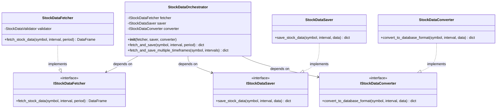
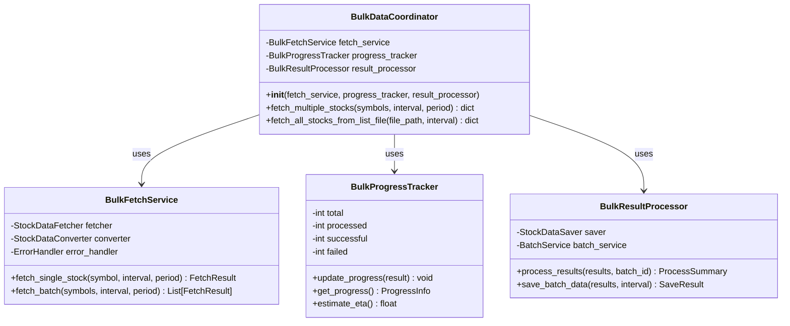
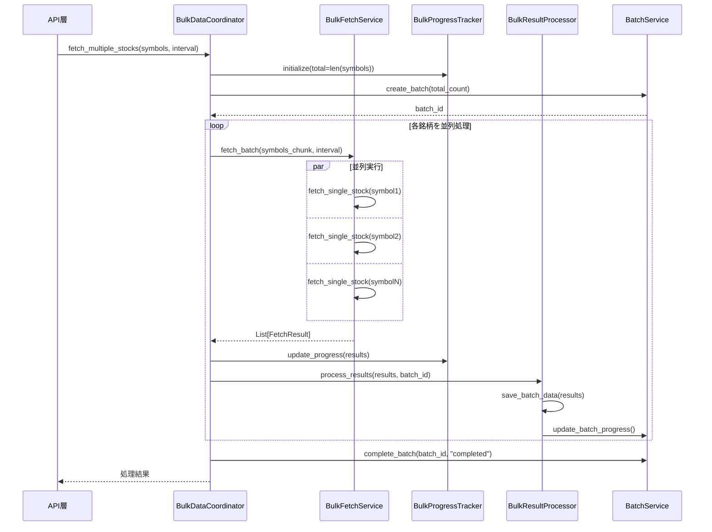

category: refactoring
ai_context: high
last_updated: 2025-01-09
related_docs:
  - ../layers/service_layer.md
  - ./api_layer_refactoring.md
  - ./presentation_layer_refactoring.md
  - ../architecture_overview.md

# サービス層リファクタリング計画

## 目次

- [1. 概要](#1-概要)
- [2. 現状の課題](#2-現状の課題)
- [3. リファクタリング方針](#3-リファクタリング方針)
- [4. リファクタリング後のアーキテクチャ](#4-リファクタリング後のアーキテクチャ)
- [5. 具体的な改善項目](#5-具体的な改善項目)
- [6. 実装計画](#6-実装計画)
- [7. 期待される効果](#7-期待される効果)
- [8. リスクと対策](#8-リスクと対策)

---

## 1. 概要

### 目的

現在のサービス層は機能的には動作していますが、以下の観点から改善の余地があります：

- **保守性の向上**: コードの可読性と保守性を向上
- **テスタビリティの向上**: 単体テストが書きやすい構造に変更
- **拡張性の向上**: 新機能追加時の影響範囲を最小化
- **責務の明確化**: 各サービスクラスの責務を明確に分離
- **依存性の管理**: 依存性注入パターンの導入によるテスト容易性向上

### 対象範囲

```
app/services/
├── stock_data/              # 株価データ処理（最優先）
│   ├── orchestrator.py      # 380行 - 統括管理
│   ├── fetcher.py           # 130行 - データ取得
│   ├── saver.py             # 330行 - データ保存
│   ├── converter.py         # 120行 - データ変換
│   └── validator.py         # 80行 - データ検証
├── bulk/                    # バルクデータ処理（最優先）
│   ├── bulk_service.py      # 910行（巨大） - 複数銘柄並列処理
│   └── stock_batch_processor.py  # バッチ処理
├── jpx/                     # JPX銘柄管理（優先）
│   └── jpx_stock_service.py # JPX銘柄マスタ管理
├── batch/                   # バッチ実行管理（優先）
│   └── batch_service.py     # バッチ履歴管理
└── common/                  # 共通機能（対象外）
    └── error_handler.py     # エラーハンドリング統一管理
```

---

## 2. 現状の課題

### 2.1 コードの肥大化

#### 問題点

**BulkDataService（bulk_service.py）の肥大化**:
- 約910行の巨大なファイル
- 12個のメソッドを持つ複雑なクラス
- 複数の責務が混在：
  - データ取得調整
  - データ変換
  - データ保存
  - 進捗管理
  - エラーハンドリング
  - リトライ制御
  - バッチDB記録
  - WebSocket通信

**具体例**:
```python
# fetch_single_stock: 91行の巨大なメソッド
def fetch_single_stock(self, symbol, interval, period):
    # リトライループ
    # データ取得
    # データ変換
    # データ保存
    # エラーハンドリング
    # ログ記録
    ...
```

**StockDataOrchestrator（orchestrator.py）の複雑性**:
- 約405行
- 11個のメソッド
- 複数の依存オブジェクトを直接生成（DI未使用）

#### 影響

- **可読性の低下**: コードの流れを追うのが困難
- **テストの困難性**: モックの作成と管理が複雑
- **変更の影響範囲が広い**: 1つの修正が複数の機能に影響
- **循環的複雑度の増加**: メンテナンスコスト増大

### 2.2 責務の不明確さ

#### 問題点

**OrchestratorとBulkServiceの責務重複**:

```python
# orchestrator.py
class StockDataOrchestrator:
    def __init__(self):
        self.fetcher = StockDataFetcher()      # 直接生成
        self.saver = StockDataSaver()          # 直接生成
        self.converter = StockDataConverter()  # 直接生成
        self.batch_processor = StockBatchProcessor()  # 直接生成

# bulk_service.py
class BulkDataService:
    def __init__(self):
        self.fetcher = StockDataFetcher()      # 重複
        self.saver = StockDataSaver()          # 重複
        self.converter = StockDataConverter()  # 重複
        self.batch_processor = StockBatchProcessor()  # 重複
```

#### 影響

- **コードの重複**: 同じ依存オブジェクトを複数箇所で生成
- **テストの複雑化**: 各クラスごとにモックを設定
- **責務の曖昧さ**: どちらを使うべきか不明確

### 2.3 エラーハンドリングの分散

#### 問題点

**各メソッドで個別にエラーハンドリング**:

```python
# orchestrator.py
def fetch_and_save(self, symbol, interval, period):
    try:
        data = self.fetcher.fetch_stock_data(...)
    except Exception as e:
        logger.error(f"データ取得エラー: {e}")
        return self._build_error_result(e)

# bulk_service.py
def fetch_single_stock(self, symbol, interval, period):
    try:
        ...
    except Exception as e:
        action = self.error_handler.handle_error(e, symbol, ...)
        should_continue = self._handle_retry_action(...)
```

#### 影響

- **一貫性の欠如**: エラーハンドリング方法が統一されていない
- **重複コード**: 同じようなtry-exceptが多数
- **保守性の低下**: エラーハンドリングロジックの変更が困難

### 2.4 依存性注入の欠如

#### 問題点

**コンストラクタ内での直接インスタンス化**:

```python
class StockDataOrchestrator:
    def __init__(self):
        # 依存オブジェクトを直接生成（DI未使用）
        self.fetcher = StockDataFetcher()
        self.saver = StockDataSaver()
        self.converter = StockDataConverter()
```

#### 影響

- **テストの困難性**: モック注入が不可能
- **柔軟性の欠如**: 実装の差し替えが困難
- **結合度の増加**: クラス間の密結合

### 2.5 メソッドの長大化

#### 問題点

**巨大なメソッドの存在**:

| ファイル | メソッド | 行数 | 複雑度 |
|---------|---------|------|--------|
| bulk_service.py | `fetch_single_stock` | 91行 | 高 |
| bulk_service.py | `_fetch_multiple_stocks_batch` | 137行 | 高 |
| bulk_service.py | `_fetch_multiple_stocks_parallel` | 123行 | 高 |
| orchestrator.py | `update_all_timeframes` | 48行 | 中 |
| saver.py | `save_stock_data` | 60行 | 中 |

#### 影響

- **可読性の低下**: メソッドの目的が不明確
- **再利用性の低下**: 部分的な機能の再利用が困難
- **テストの困難性**: 1つのメソッドで複数のシナリオをテスト

### 2.6 型ヒントの不完全性

#### 問題点

一部のメソッドで型ヒントが不完全:

```python
# 戻り値の型ヒントが曖昧
def _build_success_result(self, data) -> dict:
    ...

# パラメータの型ヒントが不足
def _process_batch_results(self, results):
    ...
```

#### 影響

- **IDE補完の低下**: 開発効率の低下
- **バグの混入リスク**: 型エラーの検出困難
- **ドキュメント性の低下**: コードの意図が不明確

---

## 3. リファクタリング方針

### 3.1 設計原則

以下の設計原則に基づいてリファクタリングを実施：

| 原則 | 適用方法 |
|------|---------|
| **単一責任の原則（SRP）** | 各クラスが1つの責務のみを持つように分割 |
| **依存性逆転の原則（DIP）** | 抽象（インターフェース）に依存、具象に依存しない |
| **開放閉鎖の原則（OCP）** | 拡張に開いて、修正に閉じた設計 |
| **インターフェース分離の原則（ISP）** | 不要な依存を持たない小さなインターフェース |
| **依存性注入（DI）** | コンストラクタインジェクションによる疎結合 |

### 3.2 リファクタリング戦略

#### Phase 1: 依存性注入の導入

**目的**: テスタビリティと柔軟性の向上

**アプローチ**:
1. コンストラクタで依存オブジェクトを受け取る
2. デフォルト引数で互換性を保持
3. 既存コードへの影響を最小化

```python
class StockDataOrchestrator:
    def __init__(
        self,
        fetcher: Optional[StockDataFetcher] = None,
        saver: Optional[StockDataSaver] = None,
        converter: Optional[StockDataConverter] = None,
    ):
        self.fetcher = fetcher or StockDataFetcher()
        self.saver = saver or StockDataSaver()
        self.converter = converter or StockDataConverter()
```

#### Phase 2: クラス分割とメソッド抽出

**目的**: 責務の明確化と可読性向上

**アプローチ**:
1. 巨大なクラスを複数の小さなクラスに分割
2. 長大なメソッドを小さなメソッドに分割
3. 共通処理をユーティリティメソッドとして抽出

**BulkDataServiceの分割例**:
```
BulkDataService（910行）
    ↓
BulkDataCoordinator（300行）        # 全体調整
BulkFetchService（250行）           # データ取得専門
BulkProgressTracker（200行）        # 進捗管理専門
BulkResultProcessor（160行）        # 結果処理専門
```

#### Phase 3: エラーハンドリングの統一

**目的**: 一貫性のあるエラー処理

**アプローチ**:
1. 共通エラーハンドリングデコレータの作成
2. カスタム例外クラスの整理
3. エラーコンテキストの標準化

```python
@handle_service_error
def fetch_stock_data(self, symbol: str, interval: str) -> pd.DataFrame:
    # エラーハンドリングはデコレータに任せる
    ...
```

#### Phase 4: 型ヒントの完全化

**目的**: 型安全性の向上

**アプローチ**:
1. すべてのメソッドに型ヒントを追加
2. TypedDictで複雑な辞書型を定義
3. Genericを使った汎用的な型定義

```python
from typing import TypedDict, List

class FetchResult(TypedDict):
    success: bool
    symbol: str
    interval: str
    records_fetched: int
    records_saved: int
    duration_ms: int
    attempt: int

def fetch_single_stock(
    self,
    symbol: str,
    interval: str = "1d",
    period: Optional[str] = None
) -> FetchResult:
    ...
```

---

## 4. リファクタリング後のアーキテクチャ

### 4.1 新しいディレクトリ構造

```
app/
├── types.py                          # プロジェクト全体の共通型定義（新設）
├── exceptions.py                     # 例外定義（既存）
├── models.py                         # データベースモデル（既存）
├── api/
│   ├── types.py                      # API層固有の型定義（新設）
│   └── ...
└── services/
    ├── types.py                      # サービス層固有の型定義（新設）
    ├── stock_data/                   # 株価データ処理
    │   ├── core/                     # コア機能（新設）
    │   │   ├── fetcher.py            # データ取得
    │   │   ├── saver.py              # データ保存
    │   │   ├── converter.py          # データ変換
    │   │   └── validator.py          # データ検証
    │   ├── orchestrator.py           # 統括管理（リファクタ）
    │   └── scheduler.py              # スケジューリング
    ├── bulk/                         # バルクデータ処理（大幅リファクタ）
    │   ├── coordinator.py            # 全体調整（新設）
    │   ├── fetch_service.py          # データ取得専門（新設）
    │   ├── progress_tracker.py       # 進捗管理専門（新設）
    │   ├── result_processor.py       # 結果処理専門（新設）
    │   └── stock_batch_processor.py  # バッチ処理（既存）
    ├── jpx/                          # JPX銘柄管理
    │   ├── jpx_stock_service.py      # JPX銘柄マスタ管理（リファクタ）
    │   └── jpx_data_normalizer.py    # データ正規化（新設）
    ├── batch/                        # バッチ実行管理
    │   └── batch_service.py          # バッチ履歴管理（軽微な改善）
    └── common/                       # 共通機能
        ├── error_handler.py          # エラーハンドリング
        └── decorators.py             # デコレータ（新設）
```

### 4.2 クラス図（リファクタリング後）

#### 株価データ処理モジュール



#### バルクデータ処理モジュール（リファクタリング後）



### 4.3 シーケンス図（リファクタリング後）

#### バルクデータ取得フロー（改善版）



---

## 5. 具体的な改善項目

### 5.1 BulkDataServiceの分割

#### 現状（910行の巨大クラス）

```python
class BulkDataService:
    def __init__(self):
        # 多数の依存オブジェクト
        ...

    # 12個のメソッド（データ取得、変換、保存、進捗管理、エラーハンドリング）
    def fetch_single_stock(self, ...):  # 91行
    def fetch_multiple_stocks(self, ...):  # 30行
    def _fetch_and_convert_data(self, ...):  # 40行
    def _process_batch_data_conversion(self, ...):  # 47行
    def _save_batch_if_data_exists(self, ...):  # 30行
    def _record_batch_result(self, ...):  # 65行
    def _fetch_multiple_stocks_batch(self, ...):  # 137行
    def _fetch_multiple_stocks_parallel(self, ...):  # 123行
    ...
```

#### 改善後（4つの専門クラス）

**1. BulkDataCoordinator（全体調整）**

```python
class BulkDataCoordinator:
    """バルクデータ取得の全体調整を行うクラス."""

    def __init__(
        self,
        fetch_service: Optional[BulkFetchService] = None,
        progress_tracker: Optional[BulkProgressTracker] = None,
        result_processor: Optional[BulkResultProcessor] = None,
    ):
        self.fetch_service = fetch_service or BulkFetchService()
        self.progress_tracker = progress_tracker or BulkProgressTracker()
        self.result_processor = result_processor or BulkResultProcessor()

    def fetch_multiple_stocks(
        self,
        symbols: List[str],
        interval: str = "1d",
        period: Optional[str] = None,
        progress_callback: Optional[Callable] = None,
    ) -> BulkFetchSummary:
        """複数銘柄のデータを取得・保存.

        Args:
            symbols: 銘柄コードのリスト
            interval: 時間軸
            period: 取得期間
            progress_callback: 進捗コールバック関数

        Returns:
            処理結果サマリ
        """
        # 進捗トラッカー初期化
        self.progress_tracker.initialize(len(symbols))

        # バッチ作成
        batch_id = self._create_batch_record(len(symbols))

        # データ取得
        results = self.fetch_service.fetch_batch(
            symbols, interval, period
        )

        # 結果処理
        summary = self.result_processor.process_results(
            results, batch_id
        )

        # バッチ完了
        self._complete_batch_record(batch_id, summary)

        return summary
```

**2. BulkFetchService（データ取得専門）**

```python
from typing import TypedDict

class FetchResult(TypedDict):
    """データ取得結果の型定義."""
    success: bool
    symbol: str
    interval: str
    records_fetched: int
    records_saved: int
    duration_ms: int
    attempt: int
    error: Optional[str]

class BulkFetchService:
    """バルクデータ取得を専門に行うクラス."""

    def __init__(
        self,
        fetcher: Optional[StockDataFetcher] = None,
        converter: Optional[StockDataConverter] = None,
        error_handler: Optional[ErrorHandler] = None,
        max_workers: int = 10,
        retry_count: int = 3,
    ):
        self.fetcher = fetcher or StockDataFetcher()
        self.converter = converter or StockDataConverter()
        self.error_handler = error_handler or ErrorHandler()
        self.max_workers = max_workers
        self.retry_count = retry_count

    def fetch_single_stock(
        self,
        symbol: str,
        interval: str = "1d",
        period: Optional[str] = None,
    ) -> FetchResult:
        """単一銘柄のデータ取得（リトライ付き）.

        Args:
            symbol: 銘柄コード
            interval: 時間軸
            period: 取得期間

        Returns:
            取得結果
        """
        start_time = time.time()

        for attempt in range(1, self.retry_count + 1):
            result = self._attempt_fetch(symbol, interval, period, attempt)
            if result["success"]:
                return self._build_success_result(
                    result, start_time, attempt
                )

        return self._build_error_result(symbol, interval, start_time)

    def fetch_batch(
        self,
        symbols: List[str],
        interval: str = "1d",
        period: Optional[str] = None,
    ) -> List[FetchResult]:
        """複数銘柄の並列取得.

        Args:
            symbols: 銘柄コードのリスト
            interval: 時間軸
            period: 取得期間

        Returns:
            取得結果のリスト
        """
        with ThreadPoolExecutor(max_workers=self.max_workers) as executor:
            futures = [
                executor.submit(
                    self.fetch_single_stock, symbol, interval, period
                )
                for symbol in symbols
            ]
            return [future.result() for future in as_completed(futures)]

    def _attempt_fetch(
        self,
        symbol: str,
        interval: str,
        period: Optional[str],
        attempt: int,
    ) -> Dict[str, Any]:
        """データ取得を試行.

        Args:
            symbol: 銘柄コード
            interval: 時間軸
            period: 取得期間
            attempt: 試行回数

        Returns:
            取得結果
        """
        try:
            # データ取得
            data = self.fetcher.fetch_stock_data(symbol, interval, period)

            # データ変換
            converted = self.converter.convert_to_database_format(
                symbol, interval, data
            )

            return {
                "success": True,
                "data": converted,
                "records": len(data),
            }

        except Exception as e:
            logger.error(f"データ取得エラー: {symbol} (試行{attempt}): {e}")
            return {
                "success": False,
                "error": str(e),
            }
```

**3. BulkProgressTracker（進捗管理専門）**

```python
from typing import TypedDict
from datetime import datetime

class ProgressInfo(TypedDict):
    """進捗情報の型定義."""
    total: int
    processed: int
    successful: int
    failed: int
    progress_percent: float
    elapsed_seconds: float
    eta_seconds: float

class BulkProgressTracker:
    """バルクデータ取得の進捗を管理するクラス."""

    def __init__(self):
        self.total: int = 0
        self.processed: int = 0
        self.successful: int = 0
        self.failed: int = 0
        self.start_time: Optional[datetime] = None

    def initialize(self, total: int) -> None:
        """進捗トラッカーを初期化.

        Args:
            total: 処理対象の総数
        """
        self.total = total
        self.processed = 0
        self.successful = 0
        self.failed = 0
        self.start_time = datetime.now()

    def update_progress(self, result: FetchResult) -> None:
        """進捗を更新.

        Args:
            result: 取得結果
        """
        self.processed += 1
        if result["success"]:
            self.successful += 1
        else:
            self.failed += 1

    def get_progress(self) -> ProgressInfo:
        """現在の進捗情報を取得.

        Returns:
            進捗情報
        """
        elapsed = (datetime.now() - self.start_time).total_seconds()
        progress_percent = (
            (self.processed / self.total * 100) if self.total > 0 else 0
        )
        eta = self._calculate_eta(elapsed)

        return {
            "total": self.total,
            "processed": self.processed,
            "successful": self.successful,
            "failed": self.failed,
            "progress_percent": round(progress_percent, 2),
            "elapsed_seconds": round(elapsed, 2),
            "eta_seconds": round(eta, 2),
        }

    def _calculate_eta(self, elapsed: float) -> float:
        """残り時間を推定.

        Args:
            elapsed: 経過時間（秒）

        Returns:
            推定残り時間（秒）
        """
        if self.processed == 0:
            return 0.0

        avg_time_per_stock = elapsed / self.processed
        remaining_stocks = self.total - self.processed
        return avg_time_per_stock * remaining_stocks
```

**4. BulkResultProcessor（結果処理専門）**

```python
from typing import TypedDict, List

class ProcessSummary(TypedDict):
    """処理サマリの型定義."""
    total: int
    successful: int
    failed: int
    total_records_saved: int
    duration_ms: int

class BulkResultProcessor:
    """バルクデータ取得結果を処理するクラス."""

    def __init__(
        self,
        saver: Optional[StockDataSaver] = None,
        batch_service: Optional[BatchService] = None,
    ):
        self.saver = saver or StockDataSaver()
        self.batch_service = batch_service or BatchService()

    def process_results(
        self,
        results: List[FetchResult],
        batch_id: int,
    ) -> ProcessSummary:
        """取得結果を処理.

        Args:
            results: 取得結果のリスト
            batch_id: バッチID

        Returns:
            処理サマリ
        """
        start_time = time.time()

        successful_results = [r for r in results if r["success"]]
        failed_results = [r for r in results if not r["success"]]

        # データ保存
        total_saved = self._save_results(successful_results)

        # バッチ詳細記録
        self._record_batch_details(batch_id, results)

        duration_ms = int((time.time() - start_time) * 1000)

        return {
            "total": len(results),
            "successful": len(successful_results),
            "failed": len(failed_results),
            "total_records_saved": total_saved,
            "duration_ms": duration_ms,
        }

    def _save_results(
        self,
        results: List[FetchResult],
    ) -> int:
        """取得結果をデータベースに保存.

        Args:
            results: 取得結果のリスト

        Returns:
            保存されたレコード数
        """
        total_saved = 0
        for result in results:
            if result.get("records_saved"):
                total_saved += result["records_saved"]
        return total_saved

    def _record_batch_details(
        self,
        batch_id: int,
        results: List[FetchResult],
    ) -> None:
        """バッチ詳細をデータベースに記録.

        Args:
            batch_id: バッチID
            results: 取得結果のリスト
        """
        for result in results:
            status = "success" if result["success"] else "failed"
            self.batch_service.create_batch_detail(
                batch_id=batch_id,
                symbol=result["symbol"],
                interval=result["interval"],
                status=status,
            )
```

### 5.2 StockDataOrchestratorの改善

#### 改善前

```python
class StockDataOrchestrator:
    def __init__(self):
        # 依存オブジェクトを直接生成
        self.fetcher = StockDataFetcher()
        self.saver = StockDataSaver()
        self.converter = StockDataConverter()
        self.batch_processor = StockBatchProcessor()
        self.logger = logging.getLogger(__name__)
```

#### 改善後

```python
class StockDataOrchestrator:
    """株価データ取得・保存の統括管理クラス."""

    def __init__(
        self,
        fetcher: Optional[StockDataFetcher] = None,
        saver: Optional[StockDataSaver] = None,
        converter: Optional[StockDataConverter] = None,
        batch_processor: Optional[StockBatchProcessor] = None,
    ):
        """コンストラクタ（依存性注入対応）.

        Args:
            fetcher: データ取得サービス
            saver: データ保存サービス
            converter: データ変換サービス
            batch_processor: バッチ処理サービス
        """
        self.fetcher = fetcher or StockDataFetcher()
        self.saver = saver or StockDataSaver()
        self.converter = converter or StockDataConverter()
        self.batch_processor = batch_processor or StockBatchProcessor()
        self.logger = logging.getLogger(__name__)

    @handle_service_error  # エラーハンドリングデコレータ
    def fetch_and_save(
        self,
        symbol: str,
        interval: str = "1d",
        period: str = "1mo",
    ) -> ServiceResult:
        """単一銘柄・単一時間軸のデータ取得・保存.

        Args:
            symbol: 銘柄コード
            interval: 時間軸
            period: 取得期間

        Returns:
            処理結果

        Raises:
            StockDataFetchError: データ取得エラー
            StockDataSaveError: データ保存エラー
        """
        # データ取得
        data = self.fetcher.fetch_stock_data(symbol, interval, period)

        # データ変換
        converted = self.converter.convert_to_database_format(
            symbol, interval, data
        )

        # データ保存
        save_result = self.saver.save_stock_data(
            symbol, interval, converted
        )

        return self._build_success_result(data, save_result)
```

### 5.3 型定義の追加

#### 型定義の配置戦略

プロジェクト全体で一貫した型定義管理を実現するため、**階層的な型定義構造**を採用します：

| ファイル | 配置基準 | 例 |
|---------|---------|---|
| `app/types.py` | 複数レイヤーで使用される共通型 | `Interval`, `ProcessStatus`, `BaseResponse` |
| `app/services/types.py` | サービス層固有の型 | `ServiceResult`, `FetchResult`, `ProgressInfo` |
| `app/api/types.py` | API層固有の型 | `APIResponse`, `FetchStockDataRequest` |

**app/types.py（プロジェクト全体の共通型）**

```python
"""株価投資分析システムの共通型定義."""

from typing import Literal
from enum import Enum

# 時間軸の型定義
Interval = Literal["1m", "5m", "15m", "30m", "1h", "1d", "1wk", "1mo"]

# ステータスの型定義
class ProcessStatus(str, Enum):
    """処理ステータス."""
    PENDING = "pending"
    IN_PROGRESS = "in_progress"
    COMPLETED = "completed"
    FAILED = "failed"
    CANCELLED = "cancelled"

class BatchStatus(str, Enum):
    """バッチステータス."""
    RUNNING = "running"
    COMPLETED = "completed"
    FAILED = "failed"
    CANCELLED = "cancelled"
```

**app/services/types.py（サービス層固有の型）**

```python
"""サービス層の型定義."""

from typing import TypedDict, Optional, List, Any
from app.types import Interval, ProcessStatus

# サービス実行結果の型定義
class ServiceResult(TypedDict):
    """サービス実行結果の共通型."""
    success: bool
    message: str
    data: Optional[Any]
    error: Optional[str]

# データ取得結果の型定義
class FetchResult(TypedDict):
    """データ取得結果."""
    success: bool
    symbol: str
    interval: Interval
    records_fetched: int
    records_saved: int
    duration_ms: int
    attempt: int
    error: Optional[str]

# 保存結果の型定義
class SaveResult(TypedDict):
    """データ保存結果."""
    saved: int
    skipped: int
    total: int

# 進捗情報の型定義
class ProgressInfo(TypedDict):
    """進捗情報."""
    total: int
    processed: int
    successful: int
    failed: int
    progress_percent: float
    elapsed_seconds: float
    eta_seconds: float
    status: ProcessStatus

# バルク処理サマリの型定義
class BulkFetchSummary(TypedDict):
    """バルク処理サマリ."""
    total: int
    successful: int
    failed: int
    total_records_saved: int
    duration_ms: int
    batch_id: int
```

**app/api/types.py（API層固有の型）**

```python
"""API層の型定義."""

from typing import TypedDict, Optional, List, Any
from app.types import Interval

# APIリクエストの型定義
class FetchStockDataRequest(TypedDict, total=False):
    """株価データ取得リクエスト."""
    symbol: str
    interval: Interval
    period: str

# APIレスポンスの型定義
class APIResponse(TypedDict):
    """API標準レスポンス."""
    success: bool
    message: str
    data: Optional[Any]
    meta: Optional[dict[str, Any]]
```

### 5.4 エラーハンドリングデコレータの追加

**common/decorators.py（新設）**

```python
import functools
import logging
from typing import Callable, Any, TypeVar, cast

logger = logging.getLogger(__name__)

T = TypeVar('T')

def handle_service_error(func: Callable[..., T]) -> Callable[..., T]:
    """サービスメソッドのエラーハンドリングデコレータ.

    Args:
        func: デコレート対象の関数

    Returns:
        エラーハンドリング付き関数
    """
    @functools.wraps(func)
    def wrapper(*args: Any, **kwargs: Any) -> T:
        try:
            return func(*args, **kwargs)
        except Exception as e:
            logger.error(
                f"サービスエラー発生: {func.__name__}: {e}",
                exc_info=True,
            )
            # エラーを適切なカスタム例外に変換
            raise ServiceError(
                f"{func.__name__}でエラーが発生しました: {e}"
            ) from e

    return cast(Callable[..., T], wrapper)

def retry_on_error(
    max_retries: int = 3,
    delay: float = 1.0,
) -> Callable[[Callable[..., T]], Callable[..., T]]:
    """リトライ機能付きデコレータ.

    Args:
        max_retries: 最大リトライ回数
        delay: リトライ間隔（秒）

    Returns:
        リトライ機能付き関数
    """
    def decorator(func: Callable[..., T]) -> Callable[..., T]:
        @functools.wraps(func)
        def wrapper(*args: Any, **kwargs: Any) -> T:
            last_error = None
            for attempt in range(1, max_retries + 1):
                try:
                    return func(*args, **kwargs)
                except Exception as e:
                    last_error = e
                    if attempt < max_retries:
                        logger.warning(
                            f"リトライ {attempt}/{max_retries}: "
                            f"{func.__name__}: {e}"
                        )
                        time.sleep(delay)
                    else:
                        logger.error(
                            f"最大リトライ回数到達: {func.__name__}: {e}"
                        )

            raise last_error

        return cast(Callable[..., T], wrapper)

    return decorator
```

---

## 6. 実装計画

### 6.1 フェーズ別実装ロードマップ

#### Phase 1: 依存性注入の導入（1週間）

**目標**: テスタビリティの基盤整備

**タスク**:

| タスク | 対象ファイル | 優先度 | 工数 |
|--------|------------|--------|------|
| StockDataOrchestratorにDI導入 | orchestrator.py | 高 | 1日 |
| BulkDataServiceにDI導入 | bulk_service.py | 高 | 1日 |
| JPXStockServiceにDI導入 | jpx_stock_service.py | 中 | 0.5日 |
| 既存コードの互換性確認 | - | 高 | 1日 |
| 単体テスト作成 | tests/services/ | 高 | 1.5日 |

**成果物**:
- DI対応済みサービスクラス
- 既存機能の動作保証
- 基本的な単体テスト

#### Phase 2: 型定義の追加（3日）

**目標**: 型安全性の向上

**タスク**:

| タスク | 対象ファイル | 優先度 | 工数 |
|--------|------------|--------|------|
| プロジェクト共通型定義作成 | app/types.py | 高 | 0.5日 |
| サービス層型定義作成 | app/services/types.py | 高 | 0.5日 |
| API層型定義作成 | app/api/types.py | 中 | 0.3日 |
| 各サービスに型ヒント追加 | services/**/*.py | 高 | 1日 |
| mypy検証とエラー修正 | - | 中 | 0.7日 |

**成果物**:
- app/types.py（プロジェクト共通型定義）
- app/services/types.py（サービス層型定義）
- app/api/types.py（API層型定義）
- 型ヒント完備のサービスコード
- mypy検証合格

#### Phase 3: BulkDataServiceの分割（2週間）

**目標**: 責務の明確化と可読性向上

**タスク**:

| タスク | 対象ファイル | 優先度 | 工数 |
|--------|------------|--------|------|
| BulkFetchService作成 | bulk/fetch_service.py | 高 | 2日 |
| BulkProgressTracker作成 | bulk/progress_tracker.py | 高 | 1日 |
| BulkResultProcessor作成 | bulk/result_processor.py | 高 | 2日 |
| BulkDataCoordinator作成 | bulk/coordinator.py | 高 | 2日 |
| 既存bulk_service.pyからマイグレーション | - | 高 | 2日 |
| 統合テスト | tests/services/bulk/ | 高 | 2日 |
| APIレイヤーの接続確認 | api/bulk_data.py | 高 | 1日 |

**成果物**:
- 4つの専門クラス
- 統合テスト
- 既存機能の完全互換

#### Phase 4: エラーハンドリングの統一（1週間）

**目標**: 一貫性のあるエラー処理

**タスク**:

| タスク | 対象ファイル | 優先度 | 工数 |
|--------|------------|--------|------|
| デコレータファイル作成 | common/decorators.py | 高 | 1日 |
| カスタム例外クラス整理 | common/exceptions.py | 中 | 0.5日 |
| 各サービスにデコレータ適用 | services/**/*.py | 高 | 2日 |
| エラーハンドリングテスト | tests/services/ | 高 | 1.5日 |

**成果物**:
- decorators.py（共通デコレータ）
- exceptions.py（カスタム例外）
- エラーハンドリング統一済みコード

#### Phase 5: その他サービスの改善（1週間）

**目標**: 全サービスの品質向上

**タスク**:

| タスク | 対象ファイル | 優先度 | 工数 |
|--------|------------|--------|------|
| JPXStockService改善 | jpx/jpx_stock_service.py | 中 | 2日 |
| JPXDataNormalizer作成 | jpx/jpx_data_normalizer.py | 低 | 1日 |
| BatchService軽微な改善 | batch/batch_service.py | 低 | 1日 |
| 総合テスト | tests/services/ | 高 | 2日 |

**成果物**:
- 改善済みJPXStockService
- 新規JPXDataNormalizer
- 全サービスの総合テスト

### 6.2 実装優先順位

| 優先度 | 対象 | 理由 |
|--------|------|------|
| **最優先** | BulkDataServiceの分割 | 最も肥大化しており影響範囲が大きい |
| **高** | 依存性注入の導入 | テスタビリティ向上の基盤 |
| **高** | 型定義の追加 | 型安全性の向上、IDE補完向上 |
| **中** | エラーハンドリング統一 | 一貫性の確保 |
| **低** | その他サービスの改善 | 比較的小規模な改善 |

### 6.3 段階的移行戦略

#### ステップ1: 新旧コードの並行稼働

```python
# 既存コード（deprecated）
class BulkDataService:
    """
    非推奨: BulkDataCoordinatorを使用してください
    """
    def __init__(self):
        warnings.warn(
            "BulkDataServiceは非推奨です。"
            "BulkDataCoordinatorを使用してください。",
            DeprecationWarning,
        )
        # 内部的に新しいクラスを使用
        self._coordinator = BulkDataCoordinator()

    def fetch_multiple_stocks(self, symbols, interval, period):
        # 新しいクラスに委譲
        return self._coordinator.fetch_multiple_stocks(
            symbols, interval, period
        )
```

#### ステップ2: 段階的な切り替え

```python
# フィーチャーフラグで新旧コードを切り替え
USE_NEW_BULK_SERVICE = os.getenv("USE_NEW_BULK_SERVICE", "false") == "true"

if USE_NEW_BULK_SERVICE:
    from app.services.bulk.coordinator import BulkDataCoordinator as BulkService
else:
    from app.services.bulk.bulk_service import BulkDataService as BulkService
```

#### ステップ3: 旧コードの削除

```python
# 新コードが安定したら旧コードを削除
# bulk_service.py は削除
# coordinator.py, fetch_service.py, progress_tracker.py, result_processor.py が正式版
```

---

## 7. 期待される効果

### 7.1 保守性の向上

| 項目 | 改善前 | 改善後 | 効果 |
|------|--------|--------|------|
| **BulkDataServiceの行数** | 910行 | 4クラス（各150-300行） | 可読性大幅向上 |
| **メソッドの平均行数** | 60行 | 20行 | 理解容易性向上 |
| **責務の明確性** | 曖昧 | 明確 | 変更影響範囲の最小化 |

### 7.2 テスタビリティの向上

**改善前**:
```python
# モックの作成が困難
orchestrator = StockDataOrchestrator()  # 依存オブジェクトが内部で生成される
```

**改善後**:
```python
# モックの注入が容易
mock_fetcher = Mock(spec=StockDataFetcher)
mock_saver = Mock(spec=StockDataSaver)
orchestrator = StockDataOrchestrator(
    fetcher=mock_fetcher,
    saver=mock_saver,
)
```

**効果**:
- 単体テストのカバレッジ向上（目標: 80%以上）
- テストの実行速度向上（外部依存を排除）
- テストの安定性向上（モックによる制御）

### 7.3 拡張性の向上

**改善前**:
```python
# 実装の差し替えが困難
class StockDataOrchestrator:
    def __init__(self):
        self.fetcher = StockDataFetcher()  # 固定
```

**改善後**:
```python
# 実装の差し替えが容易
class StockDataOrchestrator:
    def __init__(self, fetcher: IStockDataFetcher = None):
        self.fetcher = fetcher or StockDataFetcher()  # 柔軟

# 異なる実装を使用
custom_fetcher = CustomStockDataFetcher()
orchestrator = StockDataOrchestrator(fetcher=custom_fetcher)
```

**効果**:
- 新しいデータソースの追加が容易
- A/Bテストの実施が容易
- 段階的なアップグレードが可能

### 7.4 コード品質の向上

| 指標 | 改善前 | 改善後（目標） |
|------|--------|---------------|
| **循環的複雑度** | 平均8-12 | 平均3-5 |
| **型カバレッジ** | 60% | 95%以上 |
| **テストカバレッジ** | 50% | 80%以上 |
| **Pylintスコア** | 7.5/10 | 9.0/10以上 |

### 7.5 開発効率の向上

**効果**:
- **新機能追加時間**: 30%削減（責務が明確なため）
- **バグ修正時間**: 40%削減（テストカバレッジ向上のため）
- **コードレビュー時間**: 25%削減（可読性向上のため）
- **新メンバーのオンボーディング**: 50%短縮（コード理解容易性のため）

---

## 8. リスクと対策

### 8.1 リスク分析

| リスク | 影響度 | 発生確率 | 対策 |
|--------|--------|---------|------|
| **既存機能の破壊** | 高 | 中 | 包括的なテストスイート整備 |
| **パフォーマンス低下** | 中 | 低 | ベンチマークテスト実施 |
| **スケジュール遅延** | 中 | 中 | 段階的リリース、フィーチャーフラグ |
| **チーム学習コスト** | 低 | 高 | ドキュメント整備、勉強会実施 |

### 8.2 対策詳細

#### 8.2.1 既存機能の破壊を防ぐ

**対策**:
1. **包括的なテストスイート作成**
   - 既存機能の統合テスト
   - リグレッションテスト
   - E2Eテスト

2. **段階的移行**
   - フィーチャーフラグで新旧コード切り替え
   - 本番環境で一定期間並行稼働
   - 段階的にユーザーを新コードに移行

3. **ロールバック計画**
   - 問題発生時の即座のロールバック手順
   - データベース変更の可逆性確保

#### 8.2.2 パフォーマンス低下を防ぐ

**対策**:
1. **ベンチマークテスト実施**
   ```python
   import pytest
   from time import time

   def test_bulk_fetch_performance():
       symbols = [...100銘柄...]
       start = time()
       result = bulk_coordinator.fetch_multiple_stocks(symbols, "1d")
       duration = time() - start

       # 目標: 100銘柄を60秒以内
       assert duration < 60
   ```

2. **プロファイリング**
   - cProfileでボトルネック特定
   - メモリ使用量の監視

3. **最適化**
   - 必要に応じて並列処理の調整
   - データベースクエリの最適化

#### 8.2.3 スケジュール遅延を防ぐ

**対策**:
1. **段階的リリース**
   - Phase 1完了時点でリリース可能な状態を維持
   - 各Phaseで独立した価値を提供

2. **優先順位の明確化**
   - 最優先項目（BulkDataService分割）に集中
   - 低優先度項目は必要に応じて延期

3. **定期的な進捗確認**
   - 週次での進捗レビュー
   - 早期の問題検出と対応

#### 8.2.4 チーム学習コストを低減

**対策**:
1. **ドキュメント整備**
   - リファクタリングガイド
   - 新しいアーキテクチャの説明
   - コーディング例

2. **勉強会実施**
   - 依存性注入の基礎
   - 新しいクラス構造の説明
   - ハンズオン形式での学習

3. **ペアプログラミング**
   - 新コード作成時にペアで実施
   - 知識の共有と品質向上

---

## 関連ドキュメント

- [サービス層仕様書](../layers/service_layer.md)
- [API層リファクタリング計画](./api_layer_refactoring.md)
- [プレゼンテーション層リファクタリング計画](./presentation_layer_refactoring.md)
- [アーキテクチャ概要](../architecture_overview.md)

---

**最終更新**: 2025-01-09
