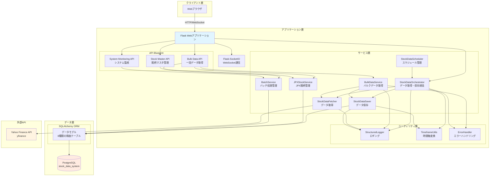
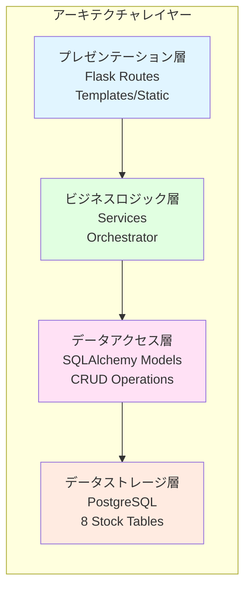

# システムアーキテクチャ概要

## 目次

- [1. システム全体像](#1-システム全体像)
- [2. アーキテクチャ図](#2-アーキテクチャ図)
- [3. 主要コンポーネント](#3-主要コンポーネント)
- [4. 技術スタック](#4-技術スタック)
- [5. システムの特徴](#5-システムの特徴)

## 1. システム全体像

本システムは、Yahoo Financeから日本企業の株価データを取得し、PostgreSQLデータベースに保存・管理するWebアプリケーションです。

**設計理念:**
- **動作優先**: まず動くものを作る
- **シンプル設計**: 複雑さを避け、必要最小限の構成
- **後から拡張**: 必要になってから機能追加・リファクタリング

## 2. アーキテクチャ図

### 2.1 システム全体アーキテクチャ

### 2.2 レイヤー構造

### 2.3 サービス層のモジュール化（ディレクトリ再編成）

- `app/services/stock_data/`（取得・保存・変換・検証・統括・スケジューラ）
- `app/services/bulk/`（一括取得と進捗管理）
- `app/services/jpx/`（JPX銘柄マスタ管理）
- `app/services/batch/`（バッチ実行管理）
- `app/services/common/`（共通エラー処理 など）

> 目的：サービス群の機能単位分割により、クラス増加時のスケール、責務の明確化、依存の整理を実現します。
## 3. 主要コンポーネント

### 3.1 Flaskアプリケーション (app.py)

**役割:**
- HTTPリクエストのルーティング
- APIエンドポイントの提供
- WebSocket通信の管理
- Blueprint統合

**主要エンドポイント:**
- `/` - メインページ
- `/api/fetch-data` - 単一銘柄データ取得
- `/api/stocks` - 株価データCRUD操作
- `/api/test-connection` - DB接続テスト

### 3.2 データモデル (models.py)

**8種類の株価テーブル:**

| テーブル名 | 時間軸 | 日時型 |
|-----------|--------|--------|
| stocks_1m | 1分足 | datetime |
| stocks_5m | 5分足 | datetime |
| stocks_15m | 15分足 | datetime |
| stocks_30m | 30分足 | datetime |
| stocks_1h | 1時間足 | datetime |
| stocks_1d | 日足 | date |
| stocks_1wk | 週足 | date |
| stocks_1mo | 月足 | date |

**共通カラム:**
- symbol (VARCHAR) - 銘柄コード
- date/datetime - 日付/日時
- open/high/low/close (DECIMAL) - 四本値
- volume (BIGINT) - 出来高
- created_at/updated_at (TIMESTAMP) - 作成/更新日時

**その他テーブル:**
- `stock_master` - 銘柄マスタ（JPX全銘柄）
- `batch_execution` - バッチ実行管理
- `batch_execution_detail` - バッチ実行詳細

### 3.3 サービス層

#### StockDataOrchestrator
**役割:** データ取得・保存の統括管理

**主要メソッド:**
- `fetch_and_save()` - 単一銘柄・単一時間軸のデータ取得・保存
- `fetch_and_save_multiple_timeframes()` - 複数時間軸の一括取得
- `check_data_integrity()` - データ整合性チェック
- `update_all_timeframes()` - 全時間軸の更新

#### BulkDataService
**役割:** 複数銘柄の一括データ取得

**主要機能:**
- 並列処理による高速データ取得
- 進捗トラッキング（WebSocket配信）
- ETA（残り時間）推定
- リトライ機能
- エラーハンドリング

**主要メソッド:**
- `fetch_single_stock()` - 単一銘柄取得
- `fetch_multiple_stocks()` - 複数銘柄取得（バッチ/並列）
- `fetch_all_stocks_from_list_file()` - リストファイルから一括取得

#### JPXStockService
**役割:** JPX全銘柄マスタの管理

**主要機能:**
- JPX銘柄一覧の取得・管理
- 銘柄マスタの更新
- 順次データ取得の制御

#### StockDataFetcher
**役割:** Yahoo Finance APIからのデータ取得

**主要機能:**
- yfinanceライブラリを使用したデータ取得
- データの正規化・変換
- エラーハンドリング

#### StockDataSaver
**役割:** データベースへのデータ保存

**主要機能:**
- 時間軸に応じたテーブル振り分け
- 重複チェック（UPSERT操作）
- トランザクション管理

### 3.4 API Blueprint

#### Bulk Data API (api/bulk_data.py)
**エンドポイント:**
- `POST /api/bulk/start` - バルクデータ取得開始
- `GET /api/bulk/status/<job_id>` - ジョブステータス取得
- `POST /api/bulk/stop/<job_id>` - ジョブ停止
- `POST /api/bulk/jpx-sequential/start` - JPX全銘柄順次取得開始

#### Stock Master API (api/stock_master.py)
**エンドポイント:**
- `GET /api/stock-master/symbols` - 銘柄一覧取得
- `POST /api/stock-master/update` - 銘柄マスタ更新

#### System Monitoring API (api/system_monitoring.py)
**エンドポイント:**
- `GET /api/monitoring/batch/executions` - バッチ実行履歴取得
- `GET /api/monitoring/batch/current` - 現在実行中のバッチ取得

### 3.5 ユーティリティ

#### StructuredLogger (utils/structured_logger.py)
**役割:** 構造化ロギング

**機能:**
- JSON形式のログ出力
- ファイルローテーション
- レベル別ログ管理

#### TimeframeUtils (utils/timeframe_utils.py)
**役割:** 時間軸の変換・管理

**機能:**
- 時間軸文字列の検証
- 対応するモデルクラスの取得
- テーブル名の取得

#### ErrorHandler (services/error_handler.py)
**役割:** エラーハンドリングの統一管理

**機能:**
- エラー分類
- エラーメッセージの生成
- エラーレスポンスの標準化

## 4. 技術スタック

### 4.1 バックエンド

| カテゴリ | 技術 | バージョン | 用途 |
|---------|------|-----------|------|
| Webフレームワーク | Flask | 3.0.0 | HTTPサーバー・ルーティング |
| WebSocket | Flask-SocketIO | 5.3.5 | リアルタイム通信 |
| ORM | SQLAlchemy | 2.0.23 | データベース操作 |
| データベースドライバ | psycopg2-binary | 2.9.9 | PostgreSQL接続 |
| 株価データ取得 | yfinance | 0.2.66 | Yahoo Finance API |
| 環境変数管理 | python-dotenv | 1.0.0 | 設定管理 |
| スケジューラ | APScheduler | 3.10.4 | 定期実行 |
| データ処理 | pandas | 2.2.0+ | データフレーム操作 |
| WSGIサーバー | Waitress | 3.0.0 | 本番環境サーバー |
| 非同期処理 | eventlet | 0.36.1 | WebSocket対応 |

### 4.2 フロントエンド

| カテゴリ | 技術 | 用途 |
|---------|------|------|
| テンプレートエンジン | Jinja2 | HTML生成 |
| スタイル | CSS | スタイリング |
| スクリプト | Vanilla JavaScript | クライアントサイドロジック |
| WebSocket | Socket.IO Client | リアルタイム通信 |

### 4.3 データベース

| カテゴリ | 技術 | 用途 |
|---------|------|------|
| RDBMS | PostgreSQL 12+ | データストレージ |
| テーブル数 | 11テーブル | 8種類の株価 + 3種類のマスタ/管理 |

### 4.4 開発・テスト

| カテゴリ | 技術 | バージョン | 用途 |
|---------|------|-----------|------|
| テストフレームワーク | pytest | 7.4.3 | ユニット/統合テスト |
| Webスクレイピング | selenium | 4.15.2 | JPX銘柄一覧取得 |
| Webドライバ管理 | webdriver-manager | 4.0.1 | ドライバ自動管理 |
| Excelファイル処理 | xlrd, openpyxl | 2.0.1+, 3.1.0+ | 銘柄リスト読込 |

## 5. システムの特徴

### 5.1 マルチタイムフレーム対応

**8種類の時間軸を管理:**
- 短期分析: 1分、5分、15分、30分、1時間足
- 中長期分析: 日足、週足、月足

**テーブル自動振り分け:**
- TimeframeUtilsが時間軸に応じて適切なテーブルを選択
- 日時型の自動判定（datetime型 vs date型）

### 5.2 スケーラブルなデータ取得

**単一銘柄取得:**
- StockDataOrchestratorによる統括管理
- リトライ機能付き

**バルクデータ取得:**
- 並列処理による高速化（最大10並列）
- WebSocketによるリアルタイム進捗配信
- ETA（残り時間）推定機能

**JPX全銘柄順次取得:**
- 4,000銘柄以上の自動取得
- 8種類の時間軸を順次処理
- 進捗管理・エラーハンドリング

### 5.3 堅牢なエラーハンドリング

**多層エラーハンドリング:**
1. カスタム例外クラス（DatabaseError, StockDataError）
2. ErrorHandlerによる統一的なエラー処理
3. StructuredLoggerによる詳細ログ記録

**リトライ機能:**
- ネットワークエラー時の自動リトライ
- リトライ回数・待機時間の設定可能

### 5.4 リアルタイム性

**WebSocketによる双方向通信:**
- 進捗状況のリアルタイム配信
- バッチ処理のステータス通知
- クライアント-サーバー間の効率的な通信

### 5.5 拡張性

**モジュール化された設計:**
- 各コンポーネントが独立して動作
- 新しい時間軸の追加が容易
- サービスの追加・変更が柔軟

**Blueprint による API 分離:**
- 機能ごとにAPIを分離
- 独立したルーティング管理
- メンテナンス性の向上

## 関連ドキュメント

- [コンポーネント依存関係](component_dependency.md) - サービス間の依存関係
- [データフロー](data_flow.md) - データの流れと処理フロー
- [データベース設計](database_design.md) - データベーススキーマ詳細
- [API仕様書](../api/api_specification.md) - API エンドポイント詳細
- [プロジェクトアーキテクチャ](project_architecture.md) - プロジェクト全体のアーキテクチャ
