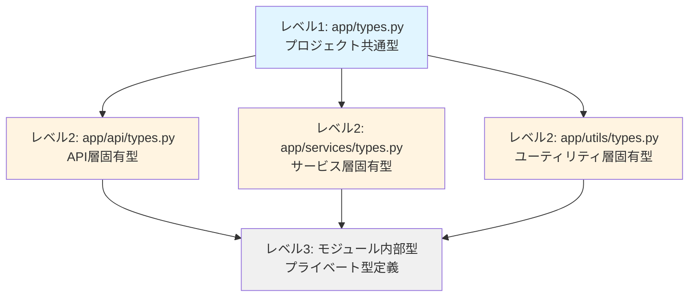
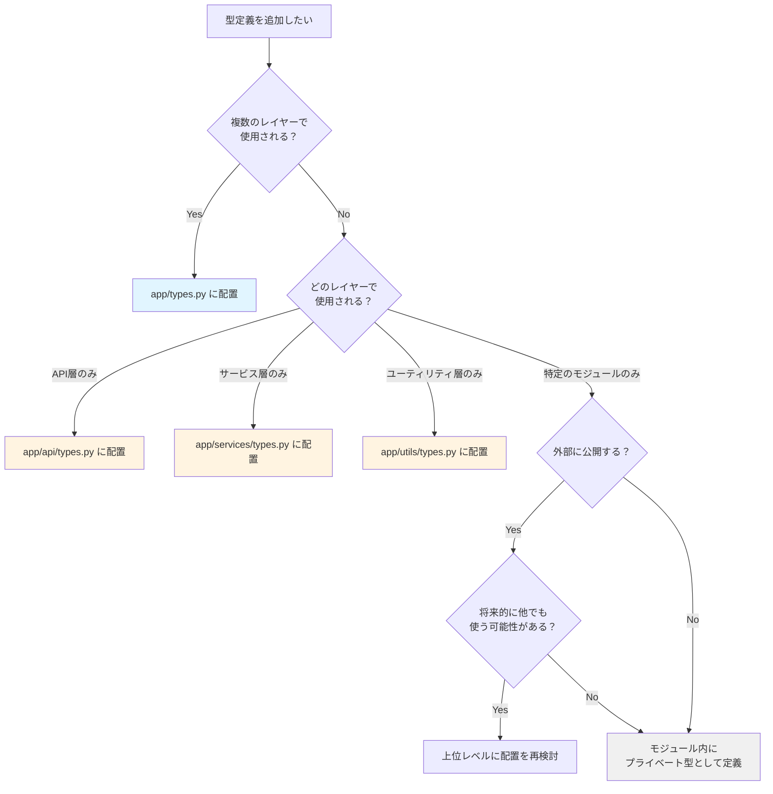

category: architecture
ai_context: high
last_updated: 2025-01-09
related_docs:
  - ./refactoring/service_layer_refactoring.md
  - ./refactoring/api_layer_refactoring.md
  - ./refactoring/presentation_layer_refactoring.md
  - ./architecture_overview.md

# 型定義配置戦略

## 目次

- [1. 概要](#1-概要)
- [2. 階層的型定義構造](#2-階層的型定義構造)
- [3. 配置基準とルール](#3-配置基準とルール)
- [4. ベストプラクティス](#4-ベストプラクティス)

---

## 1. 概要

### 目的

STOCK-INVESTMENT-ANALYZERプロジェクトにおける型定義の配置戦略を明確にし、一貫性のある型定義管理を実現します。

### 基本方針

**階層的型定義構造（Hierarchical Type Definition）**を採用します：

- **プロジェクト共通型**: 複数レイヤーで使用される型
- **レイヤー固有型**: 特定のレイヤーでのみ使用される型
- **モジュール内部型**: 特定のモジュール内でのみ使用される型

### 既存パターンとの整合性

プロジェクトには既に `app/exceptions.py` という全体共通ファイルが存在しており、型定義も同様のアプローチを採用します。

---

## 2. 階層的型定義構造

### 2.1 ディレクトリ構造

```
app/
├── types.py                    # レベル1: プロジェクト全体の共通型
├── exceptions.py               # プロジェクト全体の例外定義（既存）
├── models.py                   # データベースモデル（既存）
├── api/
│   ├── types.py                # レベル2: API層固有の型
│   └── ...
├── services/
│   ├── types.py                # レベル2: サービス層固有の型
│   └── ...
└── utils/
    └── types.py                # レベル2: ユーティリティ層固有の型（必要に応じて）
```

### 2.2 型定義の階層



---

## 3. 配置基準とルール

### 3.1 配置判断フローチャート



### 3.2 配置ルール一覧

| 型の種類 | 配置場所 | 具体例 | 理由 |
|---------|---------|--------|------|
| **時間軸、ステータスなど基本的な型** | `app/types.py` | `Interval`, `ProcessStatus`, `BatchStatus` | 全レイヤーで使用 |
| **共通レスポンス型** | `app/types.py` | `BaseResponse`, `ErrorResponse` | 全レイヤーで使用 |
| **ページネーション型** | `app/types.py` | `PaginationParams`, `PaginationMeta` | 全レイヤーで使用 |
| **APIリクエスト型** | `app/api/types.py` | `FetchStockDataRequest`, `BulkFetchRequest` | API層のみで使用 |
| **APIレスポンス型** | `app/api/types.py` | `APIResponse`, `PaginatedResponse` | API層のみで使用 |
| **サービス実行結果型** | `app/services/types.py` | `ServiceResult`, `FetchResult` | サービス層のみで使用 |
| **進捗情報型** | `app/services/types.py` | `ProgressInfo`, `BulkFetchSummary` | サービス層のみで使用 |
| **内部実装の詳細型** | モジュール内 | `_InternalState`, `_ProcessingContext` | カプセル化 |

### 3.3 依存関係のルール

#### ✅ 許可される依存関係

```python
# app/services/types.py
from app.types import Interval, ProcessStatus  # OK: 上位レベルへの依存

# app/api/stock_data.py
from app.types import Interval  # OK: 上位レベルへの依存
from app.api.types import APIResponse  # OK: 同レベルへの依存
```

#### ❌ 禁止される依存関係

```python
# app/types.py
from app.services.types import FetchResult  # NG: 下位レベルへの依存

# app/api/types.py
from app.services.types import ServiceResult  # NG: 横断的な依存
```

**依存関係の原則**:
1. 上位レベル → 下位レベル: ❌ 禁止
2. 下位レベル → 上位レベル: ✅ OK
3. 同レベル内: ✅ OK
4. レイヤー横断: ❌ 基本的に禁止（共通型は `app/types.py` に配置）

### 3.4 型定義の判断基準

型を定義する際は、以下の観点で考えます：

#### 使用範囲で判断

```
複数レイヤーで使用 → app/types.py
   ↓
1つのレイヤーのみで使用 → app/{layer}/types.py
   ↓
1つのモジュールのみで使用 → モジュール内部
```

#### 将来性で判断

```
将来的に他でも使う可能性が高い → 上位レベルに配置
   ↓
現時点でのみ必要 → 現在のレベルに配置
   ↓
拡張や変更の可能性が低い → モジュール内部
```

#### 抽象度で判断

```
高い抽象度（汎用的） → app/types.py
   ↓
中程度の抽象度（レイヤー固有） → app/{layer}/types.py
   ↓
低い抽象度（実装依存） → モジュール内部
```

---

## 4. ベストプラクティス

### 4.1 型定義のグルーピング

型定義ファイル内では、関連する型をグループ化してセクションごとにコメントで区切ります：

```python
# ============================================================================
# ステータス定義
# ============================================================================

class ProcessStatus(str, Enum):
    """処理ステータス."""
    ...

class BatchStatus(str, Enum):
    """バッチステータス."""
    ...


# ============================================================================
# レスポンス型定義
# ============================================================================

class BaseResponse(TypedDict):
    """基本レスポンス型."""
    ...
```

### 4.2 型エイリアスの使用

再利用性の高い型はエイリアスとして定義します：

```python
# app/types.py
Symbol = str
"""銘柄コード型（例: "7203.T"）."""

StockCode = str
"""銘柄コード型（シンプル形式、例: "7203"）."""

Interval = Literal["1m", "5m", "15m", "30m", "1h", "1d", "1wk", "1mo"]
"""株価データの時間軸型."""
```

### 4.3 TypedDictの使用

辞書型データには `TypedDict` を使用します：

```python
from typing import TypedDict

class FetchResult(TypedDict):
    """データ取得結果."""
    success: bool
    symbol: str
    records_fetched: int
```

### 4.4 total=Falseの活用

オプショナルフィールドが多い場合は `total=False` を使用します：

```python
class FetchStockDataRequest(TypedDict, total=False):
    """株価データ取得リクエスト（全フィールドオプショナル）."""
    symbol: str
    interval: str
    period: str
```

### 4.5 Enumの活用

固定値のセットには `Enum` を使用します：

```python
from enum import Enum

class ProcessStatus(str, Enum):
    """処理ステータス."""
    PENDING = "pending"
    IN_PROGRESS = "in_progress"
    COMPLETED = "completed"
```

### 4.6 ドキュメント文字列の追加

すべての型定義にドキュメント文字列を追加します：

```python
class FetchResult(TypedDict):
    """データ取得結果.

    単一銘柄のデータ取得処理の結果を表します。
    成功時にはデータ件数と保存件数が含まれ、
    失敗時にはエラー情報が含まれます。
    """
    success: bool
    symbol: str
    ...
```

### 4.7 型の命名規則

#### わかりやすい名前を使用

```python
# Good
class FetchResult(TypedDict):
    """何をする結果なのかが明確."""
    ...

class APIResponse(TypedDict):
    """APIのレスポンスであることが明確."""
    ...

# Bad
class Result(TypedDict):
    """何の結果かわからない."""
    ...

class Response(TypedDict):
    """どこのレスポンスかわからない."""
    ...
```

#### 一貫性のある接尾辞を使用

```python
# リクエスト型: ~Request
class BulkFetchRequest(TypedDict):
    ...

# レスポンス型: ~Response
class APIResponse(TypedDict):
    ...

# 結果型: ~Result
class FetchResult(TypedDict):
    ...

# 設定型: ~Config
class BulkFetchConfig(TypedDict):
    ...
```

### 4.8 循環インポートの回避

#### 型定義を上位レベルに移動

```python
# 循環インポートの原因
# app/services/types.py から app/api/types.py をインポート
# app/api/types.py から app/services/types.py をインポート

# 解決策: 共通型を app/types.py に移動
```

#### TYPE_CHECKINGを使用

```python
from typing import TYPE_CHECKING

if TYPE_CHECKING:
    from app.services.types import FetchResult

def process_result(result: "FetchResult") -> None:
    ...
```

### 4.9 型定義の進化

#### 段階的な型定義の追加

```python
# ステップ1: 最小限の型定義
class FetchResult(TypedDict):
    success: bool
    symbol: str

# ステップ2: 必要に応じてフィールドを追加
class FetchResult(TypedDict):
    success: bool
    symbol: str
    records_fetched: int  # 追加
    records_saved: int    # 追加

# ステップ3: オプショナルフィールドを追加
class FetchResult(TypedDict, total=False):
    success: bool          # 必須（明示的に記述）
    symbol: str            # 必須（明示的に記述）
    records_fetched: int   # オプショナル
    records_saved: int     # オプショナル
    error: str             # オプショナル（追加）
```

### 4.10 プロジェクトに途中から参加した場合

型定義を使用する際は、以下の順序で確認します：

1. **`app/types.py` を確認** - 基本的な型が定義されている
2. **自分が作業するレイヤーの types.py を確認** - レイヤー固有の型
3. **既存コードを参照** - 似た機能で使われている型を確認
4. **不明な場合はチームメンバーに相談**

---

## 関連ドキュメント

- [サービス層リファクタリング計画](./refactoring/service_layer_refactoring.md)
- [API層リファクタリング計画](./refactoring/api_layer_refactoring.md)
- [プレゼンテーション層リファクタリング計画](./refactoring/presentation_layer_refactoring.md)
- [アーキテクチャ概要](./architecture_overview.md)

---

**最終更新**: 2025-01-09
