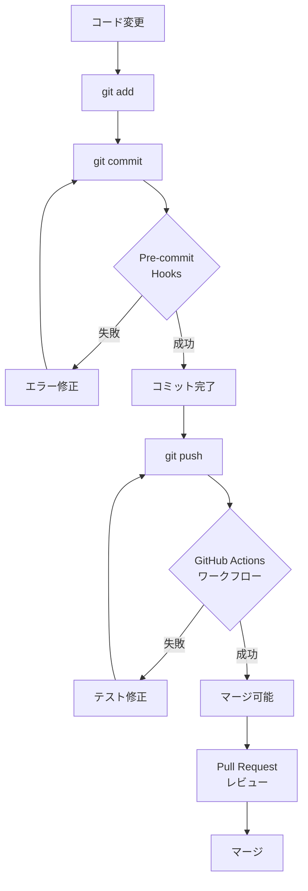
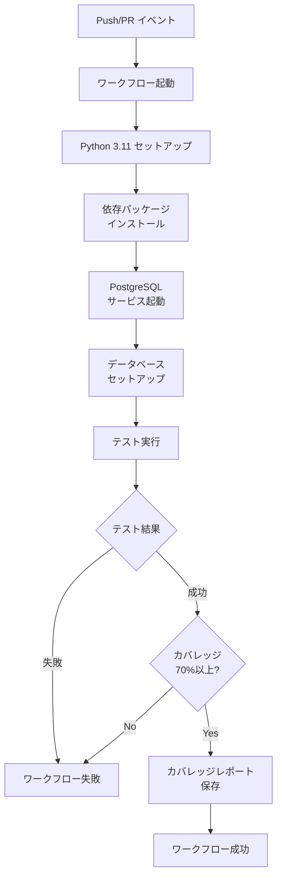

# ⚠️ 非推奨: このドキュメントは統合されました

**このドキュメントは 2025年11月2日 に非推奨となりました。**

代わりに以下の統合ドキュメントを参照してください:
- **[CI/CDパイプライン設定ガイド (v2.0.0)](../ci-cd/pipeline-config.md)** ← こちらを使用

このファイルは `pipeline_overview.md` と `troubleshooting.md` を統合した最新バージョンです。

---

# CI/CDパイプライン概要 (ARCHIVED)

## 📋 目次

- [概要](#概要)
- [CI/CDパイプラインの全体像](#cicdパイプラインの全体像)
- [ワークフロー詳細](#ワークフロー詳細)
- [品質ゲート](#品質ゲート)
- [実行タイミング](#実行タイミング)
- [ワークフロー図解](#ワークフロー図解)

## 概要

本プロジェクトでは、GitHub Actionsを使用してCI/CDパイプラインを構築しています。
コードの品質を維持し、デプロイの安全性を確保するため、自動テストと品質チェックを実行しています。

### 目的

1. **継続的インテグレーション (CI)**
   - コードの変更を自動的にビルド・テストし、問題を早期に発見
   - コード品質を一定レベル以上に維持

2. **継続的デリバリー (CD)**
   - テスト済みのコードを安全にデプロイ可能な状態に保つ
   - デプロイプロセスの自動化（将来的な実装予定）

### CI/CDツールの構成

| ツール           | 用途                         | 実行タイミング        |
| ---------------- | ---------------------------- | --------------------- |
| Pre-commit Hooks | コミット前のローカルチェック | コミット時 (ローカル) |
| GitHub Actions   | 統合テストと品質ゲート       | Push/PR時 (リモート)  |

## CI/CDパイプラインの全体像

```
┌─────────────────────────────────────────────────────────────┐
│                    開発者のローカル環境                      │
├─────────────────────────────────────────────────────────────┤
│                                                               │
│  コード変更                                                   │
│      ↓                                                        │
│  git add                                                      │
│      ↓                                                        │
│  git commit  ←── Pre-commit Hooks 実行                        │
│      │           ├─ 基本チェック (ファイル、構文)              │
│      │           ├─ Black (フォーマット)                       │
│      │           ├─ isort (インポート整理)                     │
│      │           ├─ flake8 (Linter)                           │
│      │           ├─ 複雑度チェック                             │
│      │           └─ mypy (型チェック)                          │
│      │                                                         │
│      ↓ (チェックOKの場合)                                      │
│  git push                                                     │
│                                                               │
└─────────────────────────────────────────────────────────────┘
                          │
                          ↓
┌─────────────────────────────────────────────────────────────┐
│                    GitHub (リモート環境)                      │
├─────────────────────────────────────────────────────────────┤
│                                                               │
│  Push/Pull Request イベント                                   │
│      ↓                                                        │
│  GitHub Actions ワークフロー起動                               │
│      │                                                         │
│      ├─ 環境セットアップ                                       │
│      │   ├─ Python 3.11 インストール                          │
│      │   ├─ 依存パッケージキャッシュ                           │
│      │   └─ パッケージインストール                            │
│      │                                                         │
│      ├─ PostgreSQL サービス起動                                │
│      │   ├─ Docker コンテナ起動                               │
│      │   ├─ ヘルスチェック                                     │
│      │   ├─ スキーマ作成                                       │
│      │   └─ サンプルデータ挿入                                 │
│      │                                                         │
│      ├─ テスト実行                                             │
│      │   ├─ ユニットテスト                                     │
│      │   ├─ 統合テスト                                         │
│      │   └─ カバレッジ計測 (70%以上必須)                       │
│      │                                                         │
│      └─ カバレッジレポート保存                                  │
│                                                               │
│      ↓ (すべてOKの場合)                                        │
│  マージ可能 ✅                                                 │
│                                                               │
└─────────────────────────────────────────────────────────────┘
```

## ワークフロー詳細

### 1. Pre-commit Hooks (ローカル)

**ファイル**: `.pre-commit-config.yaml`

#### 実行されるチェック

##### 1.1 基本チェック (`pre-commit-hooks`)

| チェック項目            | 内容                                  | 修正 |
| ----------------------- | ------------------------------------- | ---- |
| end-of-file-fixer       | ファイル末尾の空行を統一              | 自動 |
| trailing-whitespace     | 行末の空白を削除                      | 自動 |
| check-merge-conflict    | マージコンフリクトマーカーの検出      | 手動 |
| check-yaml/json/toml    | 各種設定ファイルの構文チェック        | 手動 |
| check-added-large-files | 大きなファイル(500KB以上)の追加を防止 | 手動 |
| check-ast               | Python構文チェック                    | 手動 |
| debug-statements        | デバッグ文(pdb等)の検出               | 手動 |

##### 1.2 コードフォーマット

| ツール | 内容                        | 設定             |
| ------ | --------------------------- | ---------------- |
| Black  | PEP 8準拠の自動フォーマット | 行の長さ: 79文字 |
| isort  | インポート文の自動整理      | Blackと互換設定  |

##### 1.3 静的解析

| ツール         | 内容                     | 設定                         |
| -------------- | ------------------------ | ---------------------------- |
| flake8         | コーディング規約チェック | 最大行長: 79、最大複雑度: 10 |
| 複雑度チェック | McCabe複雑度チェック     | 最大複雑度: 10               |
| mypy           | 型ヒントチェック         | pyproject.toml設定に従う     |

##### 1.4 サマリー表示

各チェックツールの実行結果をサマリー形式で表示:
- 実行されたツール名
- チェック結果 (OK/FAILED)
- エラー数/警告数
- 処理時間

**詳細**: [Pre-commit セットアップガイド](../development/pre_commit_setup.md)

### 2. GitHub Actions (リモート)

**ファイル**: `.github/workflows/quality.yml`

#### ワークフロー名
`Python CI - Tests`

#### トリガー条件

```yaml
on:
  push:
    branches: ["**"]  # すべてのブランチへのpush
  pull_request:
    branches: ["**"]  # すべてのブランチへのPR
```

#### ジョブ構成

##### Job: `test` (テスト実行)

**実行環境**: `ubuntu-latest`

**ステップ詳細**:

###### ステップ1: 環境セットアップ

| ステップ名           | 内容                         | 使用アクション            |
| -------------------- | ---------------------------- | ------------------------- |
| Checkout repository  | リポジトリのチェックアウト   | `actions/checkout@v4`     |
| Set up Python 3.11   | Python 3.11のインストール    | `actions/setup-python@v4` |
| Cache pip packages   | pipパッケージのキャッシュ    | `actions/cache@v4`        |
| Install dependencies | 依存パッケージのインストール | -                         |

**依存パッケージインストール内容**:
```bash
python -m pip install --upgrade pip
pip install -r requirements.txt       # 本番環境用
pip install -r requirements-dev.txt   # 開発用 (pytest, coverage等)
```

**キャッシュ設定**:
- キャッシュパス: `~/.cache/pip`
- キャッシュキー: `${{ runner.os }}-pip-${{ hashFiles('**/requirements*.txt') }}`
- 効果: 依存パッケージインストール時間を大幅短縮 (初回: 約60秒 → 2回目以降: 約10秒)

###### ステップ2: データベースセットアップ

**PostgreSQLサービスコンテナ設定**:

```yaml
services:
  postgres:
    image: postgres:14
    env:
      POSTGRES_USER: stock_user
      POSTGRES_PASSWORD: stock_password
      POSTGRES_DB: stock_data_system
    options: >-
      --health-cmd pg_isready
      --health-interval 10s
      --health-timeout 5s
      --health-retries 5
    ports:
      - 5432:5432
```

**データベースセットアップ内容**:
1. データベース接続確認
2. スキーマ作成 (`scripts/database/schema/create_tables.sql`)
3. サンプルデータ挿入 (`scripts/database/seed/insert_sample_data.sql`)
4. スキーマ作成確認

###### ステップ3: テスト実行

**テストコマンド**:
```bash
pytest -m "not e2e" \
  --verbosity=1 \
  --maxfail=1 \
  --cov=app \
  --cov-report=xml \
  --cov-report=term \
  --cov-fail-under=70
```

**テストオプション説明**:

| オプション            | 説明                                           |
| --------------------- | ---------------------------------------------- |
| `-m "not e2e"`        | E2Eテストを除外 (ユニット・統合テストのみ実行) |
| `--verbosity=1`       | 標準的な詳細度で出力                           |
| `--maxfail=1`         | 最初の失敗で即座に停止 (高速フィードバック)    |
| `--cov=app`           | `app`ディレクトリのカバレッジを計測            |
| `--cov-report=xml`    | XMLフォーマットでカバレッジレポートを出力      |
| `--cov-report=term`   | ターミナルにカバレッジサマリーを表示           |
| `--cov-fail-under=70` | カバレッジが70%未満の場合は失敗                |

**環境変数**:
```yaml
env:
  DB_HOST: localhost
  DB_PORT: 5432
  DB_USER: stock_user
  DB_PASSWORD: stock_password
  DB_NAME: stock_data_system
```

**テスト種別**:
- **ユニットテスト**: 個々の関数・メソッドの動作を検証
- **統合テスト**: データベース接続を含む複数コンポーネントの連携を検証

**詳細**: [テスト作成ガイドライン](../development/testing_guide.md)

###### ステップ4: カバレッジレポート保存

**アーティファクト保存**:
```yaml
- name: Upload coverage report
  uses: actions/upload-artifact@v4
  with:
    name: coverage-report
    path: coverage.xml
```

保存されたカバレッジレポートは、GitHub Actionsの実行結果画面からダウンロード可能です。

## 品質ゲート

### カバレッジ品質ゲート

**基準**: コードカバレッジ 70%以上

**チェックタイミング**: GitHub Actions (CI環境)

**失敗時の動作**:
- テストジョブが失敗
- PRマージがブロック (ブランチ保護ルールが有効な場合)
- 開発者はカバレッジを向上させる必要あり

### 複雑度品質ゲート

**基準**: McCabe複雑度 10以下

**チェックタイミング**: Pre-commit Hooks (ローカル)、flake8 (CI環境)

**失敗時の動作**:
- コミットがブロック (pre-commit)
- 開発者はコードをリファクタリングして複雑度を下げる必要あり

### 型チェック品質ゲート

**基準**: mypy型チェックエラーなし

**チェックタイミング**: Pre-commit Hooks (ローカル)

**失敗時の動作**:
- 警告を表示するが、コミットはブロックしない (現在の設定)
- 開発者は型ヒントを追加・修正することを推奨

## 実行タイミング

### Pre-commit Hooks

**トリガー**: `git commit` 実行時 (ローカル)

**実行内容**:
1. 基本チェック
2. Black (コードフォーマット)
3. isort (インポート整理)
4. flake8 (Linter)
5. 複雑度チェック
6. mypy (型チェック)
7. サマリー表示

**所要時間**: 約10〜30秒 (ファイル数に依存)

**失敗時**:
- コミットがキャンセル
- エラーメッセージが表示
- 開発者は問題を修正して再度コミット

### GitHub Actions

**トリガー**:
- `git push` 実行時 (すべてのブランチ)
- Pull Request作成/更新時 (すべてのブランチ)

**実行内容**:
1. 環境セットアップ (Python、依存パッケージ)
2. PostgreSQLサービス起動
3. データベースセットアップ
4. テスト実行 (ユニット・統合テスト)
5. カバレッジレポート保存

**所要時間**: 約2〜5分 (キャッシュ有効時)

**失敗時**:
- ワークフローが失敗ステータス
- PRマージがブロック (保護ルール有効時)
- 開発者はテストを修正して再度push

## ワークフロー図解

### 開発フロー全体



### GitHub Actions ワークフロー詳細



## まとめ

本プロジェクトのCI/CDパイプラインは、以下の2層構造で品質を保証しています:

1. **ローカル層 (Pre-commit Hooks)**:
   - コミット前に基本的な品質チェックを実施
   - 開発者に即座にフィードバック
   - コードフォーマットの統一

2. **リモート層 (GitHub Actions)**:
   - テストの自動実行
   - カバレッジの計測と品質ゲート
   - 統合的な品質保証

これにより、コードの品質を維持しながら、効率的な開発を実現しています。

## 関連ドキュメント

- [CI/CD トラブルシューティング](troubleshooting.md)
- [Pre-commit セットアップガイド](../development/pre_commit_setup.md)
- [テスト作成ガイドライン](../development/testing_guide.md)
- [コーディング規約](../development/coding_standards.md)
