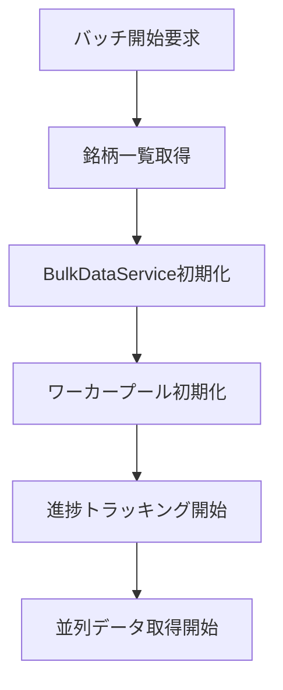
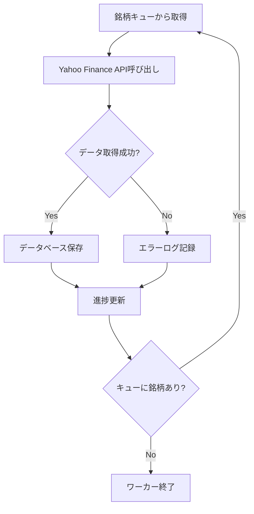
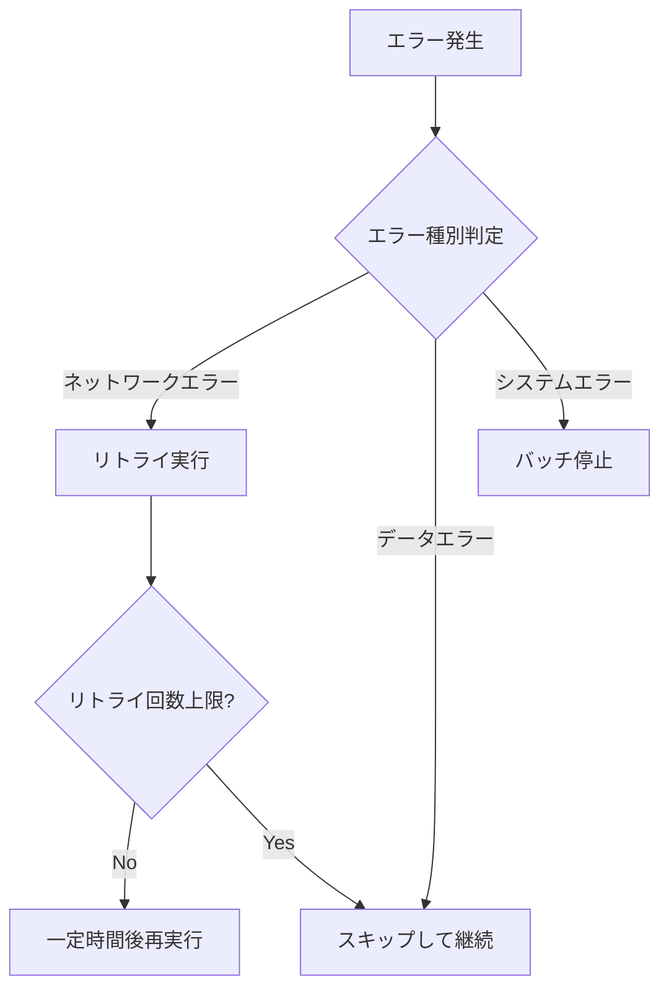

# 全銘柄一括取得システム完全ガイド

このドキュメントは、全銘柄一括取得システムの完全な仕様、設計、利用方法をまとめた統合ドキュメントです。

## 📋 目次

- [システム概要](#システム概要)
- [API仕様](#api仕様)
- [システム設計](#システム設計)
- [実装ガイド](#実装ガイド)
- [運用ガイド](#運用ガイド)
- [将来拡張計画](#将来拡張計画)

---

## システム概要

### 目的

JPXから取得した銘柄一覧を基に、全銘柄の株価データを効率的に一括取得するシステムです。

### 主要機能

- **並列データ取得**: 複数銘柄を並列で取得・保存
- **進捗トラッキング**: リアルタイム進捗表示と完了時間推定
- **エラーハンドリング**: 個別銘柄のエラー時もバッチ処理を継続
- **WebSocket配信**: リアルタイム進捗通知
- **ファイル入力**: テキストファイルからの銘柄リスト読み込み

### 実装フェーズ

**Phase 1 (MVP - 実装済み)**
- 基本的なREST API
- 簡易バッチ処理
- インメモリジョブ管理
- WebSocket進捗配信
- BulkDataService実装

**Phase 2 (計画中)**
- 高度なバッチ処理エンジン
- データベース永続化
- エラーリカバリ強化
- JPX銘柄マスタ管理

### 要件定義

#### 機能要件
1. **全銘柄データ取得**: JPX銘柄一覧の全銘柄に対して株価データを一括取得
2. **進捗表示**: 取得進捗をリアルタイムで表示
3. **エラーハンドリング**: 個別銘柄のエラー時もバッチ処理を継続
4. **取得状況管理**: 中断・再開機能
5. **結果レポート**: 取得完了後のサマリー表示

#### 非機能要件
1. **パフォーマンス**: 効率的な並列処理による高速化
2. **信頼性**: ネットワークエラーに対する堅牢性
3. **拡張性**: 銘柄数増加に対応可能な設計
4. **監視性**: 詳細なログ出力と状況可視化

---

## API仕様

### エンドポイント一覧

#### POST `/api/bulk/start`

一括取得ジョブを開始します。

**認証**: 必須（`X-API-KEY`）※環境変数 `API_KEY` が設定されている場合のみ

**リクエストボディ**:
```json
{
  "symbols": ["7203.T", "6758.T"],
  "interval": "1d",
  "period": "1mo"
}
```

- `symbols` (必須): 取得する銘柄コードの配列
- `interval` (オプション): データの間隔（デフォルト: `1d`）
- `period` (オプション): データの期間

**成功レスポンス** (202 Accepted):
```json
{
  "success": true,
  "job_id": "job-1720000000000",
  "status": "accepted"
}
```

**エラーレスポンス**:
- `400 Bad Request`: バリデーションエラー
- `401 Unauthorized`: APIキー不正
- `429 Too Many Requests`: レート制限超過

#### GET `/api/bulk/status/{job_id}`

ジョブの進捗と状態を取得します。

**成功レスポンス** (200 OK):
```json
{
  "success": true,
  "job": {
    "id": "job-1720000000000",
    "status": "running",
    "progress": {
      "total": 2,
      "processed": 1,
      "successful": 1,
      "failed": 0,
      "progress_percentage": 50.0
    },
    "created_at": 1720000000.0,
    "updated_at": 1720000050.0
  }
}
```

**ジョブステータス値**:
- `running`: 実行中
- `completed`: 完了
- `failed`: 失敗
- `cancel_requested`: キャンセル要求済み

#### POST `/api/bulk/stop/{job_id}`

ジョブのキャンセルを要求します。

### WebSocket進捗配信

#### 接続設定
- **URL**: `ws://<server-host>:<port>/socket.io/`
- **プロトコル**: Socket.IO
- **CORS**: すべてのオリジンから接続可能

#### イベント

**`bulk_progress`**: 進捗更新
```json
{
  "job_id": "job-1720000000000",
  "progress": {
    "total": 3,
    "processed": 1,
    "successful": 1,
    "failed": 0,
    "progress_percentage": 33.3
  }
}
```

**`bulk_complete`**: バッチ完了
```json
{
  "job_id": "job-1720000000000",
  "summary": {
    "total_symbols": 3,
    "successful": 3,
    "failed": 0,
    "duration_seconds": 5.2
  }
}
```

#### クライアント実装例

```javascript
<script src="https://cdn.socket.io/4.5.4/socket.io.min.js"></script>

const socket = io();

socket.on('connect', () => {
    console.log('WebSocketに接続しました');
});

socket.on('bulk_progress', (data) => {
    console.log('進捗更新:', data);
    updateProgressBar(data.progress.progress_percentage);
});

socket.on('bulk_complete', (data) => {
    console.log('バッチ完了:', data);
    showCompletionMessage(data.summary);
});
```

### 認証・レート制限

- `.env` に `API_KEY` を設定
- `.env` に `RATE_LIMIT_PER_MINUTE` を設定（デフォルト: 60）

---

## システム設計

### アーキテクチャ図

```
[フロントエンド]
       ↓
[バッチ制御API]
       ↓
[BulkDataService] ←→ [ProgressTracker]
       ↓
[並列データ取得ワーカー]
       ↓
[StockDataFetcher] / [StockDataSaver]
       ↓
[Yahoo Finance API] / [PostgreSQL Database]
```

### コンポーネント構成

#### BulkDataService
複数銘柄の株価データを並列で効率的に取得し、保存するためのサービス

**主要パラメータ**:
- `max_workers: int` - 並列ワーカー数（デフォルト: `10`）
- `retry_count: int` - リトライ回数（デフォルト: `3`）

**主要メソッド**:
- `fetch_multiple_stocks()` - 複数銘柄を並列で取得・保存
- `fetch_all_stocks_from_list_file()` - ファイルから銘柄リスト読み込み
- `estimate_completion_time()` - 総処理時間を推定

#### ProgressTracker
進捗の集計と推定（速度・ETA）を管理

**主要メソッド**:
- `update()` - 進捗更新
- `get_progress()` - 現在の進捗取得
- `get_summary()` - サマリー取得

### データ構造（Phase 2計画）

#### バッチ実行情報テーブル
```sql
CREATE TABLE batch_executions (
    id SERIAL PRIMARY KEY,
    batch_type VARCHAR(50) NOT NULL,
    status VARCHAR(20) NOT NULL,
    total_stocks INTEGER NOT NULL,
    processed_stocks INTEGER DEFAULT 0,
    successful_stocks INTEGER DEFAULT 0,
    failed_stocks INTEGER DEFAULT 0,
    start_time TIMESTAMP DEFAULT CURRENT_TIMESTAMP,
    end_time TIMESTAMP,
    error_message TEXT,
    created_at TIMESTAMP DEFAULT CURRENT_TIMESTAMP
);
```

#### バッチ実行詳細テーブル
```sql
CREATE TABLE batch_execution_details (
    id SERIAL PRIMARY KEY,
    batch_execution_id INTEGER REFERENCES batch_executions(id),
    stock_code VARCHAR(10) NOT NULL,
    status VARCHAR(20) NOT NULL,
    start_time TIMESTAMP,
    end_time TIMESTAMP,
    error_message TEXT,
    records_inserted INTEGER DEFAULT 0,
    created_at TIMESTAMP DEFAULT CURRENT_TIMESTAMP
);
```

### 処理フロー

#### 1. バッチ開始フロー


#### 2. データ取得フロー


#### 3. エラーハンドリングフロー


### エラーハンドリング

#### エラー分類
1. **一時的エラー（リトライ対象）**
   - ネットワークタイムアウト
   - API制限（Rate Limit）
   - 一時的なサーバーエラー（5xx）

2. **永続的エラー（スキップ対象）**
   - 銘柄コード不正（404）
   - データ形式エラー
   - 認証エラー（401, 403）

3. **システムエラー（バッチ停止）**
   - データベース接続エラー
   - メモリ不足
   - 予期しない例外

---

## 実装ガイド

### インポートと初期化

```python
from services.bulk_data_service import BulkDataService

# サービス初期化
service = BulkDataService(max_workers=4, retry_count=2)
```

### 基本的な使用例

#### 複数銘柄の並列取得

```python
symbols = ['7203.T', '6758.T', '9984.T']

# 進捗コールバック（任意）
def on_progress(progress):
    print(f"進捗: {progress['progress_percentage']}%")
    print(f"処理済: {progress['processed']}/{progress['total']}")
    print(f"成功: {progress['successful']}, 失敗: {progress['failed']}")

# 実行
summary = service.fetch_multiple_stocks(
    symbols=symbols,
    interval='1d',
    period='1y',
    progress_callback=on_progress
)

# 結果確認
print(f"成功: {summary['successful']}, 失敗: {summary['failed']}")
for result in summary['results']:
    print(f"{result['symbol']}: {result.get('records_saved')} 件保存")
```

#### ファイルから銘柄を読み込んで取得

```python
# list.txt（UTF-8, 1行1銘柄）
# 7203.T
# 6758.T
# 9984.T

summary = service.fetch_all_stocks_from_list_file(
    file_path='list.txt',
    interval='1d',
    period='1y',
    progress_callback=on_progress
)

print(f"合計: {summary['total']}, 成功: {summary['successful']}")
```

#### 完了時間の推定

```python
estimate = service.estimate_completion_time(
    symbol_count=500,
    interval='1d'
)

print(f"推定処理時間: {estimate['estimated_total_minutes']} 分")
print(f"並列ワーカー数: {estimate['max_workers']}")
```

### 進捗データ構造

```python
{
    "total": 100,
    "processed": 50,
    "successful": 48,
    "failed": 2,
    "progress_percentage": 50.0,
    "elapsed_time": 120.5,
    "stocks_per_second": 0.42,
    "estimated_completion": "2024-01-15T10:45:00",
    "error_details": [
        {"symbol": "INVALID.T", "error": "Symbol not found"}
    ]
}
```

### サマリーデータ構造

```python
{
    "total": 100,
    "processed": 100,
    "successful": 98,
    "failed": 2,
    "progress_percentage": 100.0,
    "elapsed_time": 240.8,
    "stocks_per_second": 0.42,
    "results": [
        {
            "symbol": "7203.T",
            "success": true,
            "records_saved": 252,
            "error": null
        },
        ...
    ]
}
```

---

## 運用ガイド

### パフォーマンスチューニング

#### 並列数（max_workers）
- **推奨**: マシンのCPUコア数〜その2倍程度
- **調整指針**:
  - 失敗が増える場合は縮小
  - CPUに余裕がある場合は増加
  - APIレート制限に注意

#### リトライ（retry_count）
- **推奨**: 3回
- **考慮事項**:
  - 一時的なネットワークエラーに備える
  - 過度なリトライはパフォーマンス低下の原因

### ログとモニタリング

#### ログ確認
- 10件ごとの進捗ログ
- 失敗時のエラー詳細（最大100件保持）
- アプリ側のロガー設定を適切に構成

#### メトリクス
- **スループット**: 分あたり処理銘柄数
- **成功率**: 処理成功/失敗の比率
- **平均処理時間**: 銘柄あたりの平均処理時間
- **エラー率**: エラー種別ごとの発生率

### バッチ開始手順

1. **システム状態確認**
   - データベース接続確認
   - API接続確認

2. **銘柄リスト準備**
   - ファイルまたは配列で銘柄コードを準備
   - 銘柄コード形式を確認（日本株: `XXXX.T`）

3. **バッチ実行**
   - API経由で実行、またはBulkDataServiceを直接使用
   - 進捗監視開始

4. **完了確認**
   - サマリーで成功/失敗件数を確認
   - エラー詳細を確認し、必要に応じて再実行

### 障害時対応

1. **エラー検知**: ログ監視、アラート受信
2. **状況確認**: バッチ実行状況、エラー内容確認
3. **対応判定**: 継続/一時停止/停止の判断
4. **対応実行**: 必要に応じてバッチ操作実行
5. **復旧確認**: 正常動作確認

### データ整合性確認

- バッチ完了後の件数チェック
- 欠損データの検出・補完
- データ品質チェック（異常値検出）

### 制限事項と注意点

#### APIレート制限
- Yahoo Finance APIに依存するため、レート制限や一時的な失敗が発生
- 並列数・リトライで緩和可能だが、過負荷を避ける

#### シンボル形式
- 日本株: `XXXX.T` 形式（例: トヨタ `7203.T`）
- 取得元仕様に従う

#### データ品質
- 欠損や分割等のイベントによりデータが不整合になる可能性
- 保存前の検証・保存後の監視を推奨

#### Phase 1の制限事項
- **ジョブ管理**: インメモリ管理のため、アプリケーション再起動時にジョブ情報が失われる
- **並列処理**: 簡易なスレッド実行。大規模運用ではキュー（RQ/Celery等）の採用が必要
- **エラーリカバリ**: 基本的なリトライのみ。高度なエラーハンドリングは未実装

---

## 将来拡張計画

### Phase 2: 高度なバッチ処理

#### JPX銘柄マスタ管理

**データ取得元**:
- **URL**: https://www.jpx.co.jp/markets/statistics-equities/misc/tvdivq0000001vg2-att/data_j.xls
- **形式**: Excel形式（.xls）
- **内容**: 東証上場全銘柄の情報

**銘柄マスタテーブル**:
```sql
CREATE TABLE stock_master (
    id SERIAL PRIMARY KEY,
    stock_code VARCHAR(10) UNIQUE NOT NULL,
    stock_name VARCHAR(100) NOT NULL,
    market_category VARCHAR(50),
    sector VARCHAR(100),
    is_active BOOLEAN DEFAULT TRUE,
    created_at TIMESTAMP DEFAULT CURRENT_TIMESTAMP,
    updated_at TIMESTAMP DEFAULT CURRENT_TIMESTAMP
);
```

**API エンドポイント（計画中）**:
- `POST /api/stock-master/update` - JPXから銘柄一覧更新
- `GET /api/stock-master/list` - 銘柄マスタ一覧取得

#### データベース永続化
- バッチ実行情報の永続化
- ジョブ状態の永続化
- 再起動時のジョブ復旧

#### エラーリカバリ強化
- エラー分類に基づいた適切な処理
- 自動リトライ戦略
- エラーログの詳細記録

#### ワーカープール管理
- 効率的な並列処理
- リソース使用量の最適化

### Phase 3: スケーラビリティ

- **スケジューリング**: 定期実行機能
- **差分更新**: 前回実行からの差分のみ取得
- **データ検証**: 取得データの品質チェック
- **通知機能**: 完了/エラー時のメール/Slack通知
- **分散処理**: 複数サーバーでの並列実行
- **ロードバランシング**: 処理負荷の動的調整

### 移行計画

**Phase 1からPhase 2への移行ステップ**:
1. データベーススキーマ追加
2. バッチエンジン実装
3. API拡張
4. WebSocket実装強化
5. エラーハンドリング強化
6. テスト・検証

**互換性維持**:
- Phase 1のAPIエンドポイントは維持（下位互換性）
- 既存のフロントエンドコードは最小限の変更で動作
- 段階的な移行が可能な設計

---

## よくある質問（FAQ）

**Q. 何銘柄まで一度に処理できますか？**
- A. ハードウェア性能とAPI制約に依存します。大規模処理はバッチ分割と進捗通知の活用を推奨します。

**Q. 進捗をWeb UIで表示したいです。**
- A. `progress_callback` またはWebSocket経由で進捗を取得し、UIへ反映してください。

**Q. 保存前のデータ整形を挟めますか？**
- A. `StockDataFetcher.convert_to_dict` の出力をカスタマイズする、または `fetch_single_stock` 前後にフックを設ける拡張で対応可能です。

**Q. RESTポーリングとWebSocketの併用は可能ですか？**
- A. 可能です。WebSocketはリアルタイム進捗配信に、RESTポーリングは WebSocket非対応環境での代替手段として利用できます。

---

## テストページ

WebSocket機能のテストページが利用可能です:
- **URL**: `http://<server-host>:<port>/websocket-test`
- **機能**: WebSocket接続テスト、バッチ実行、リアルタイム進捗表示

---

この統合ドキュメントにより、全銘柄一括取得システムの全体像から詳細な実装・運用まで、一箇所で参照できます。
