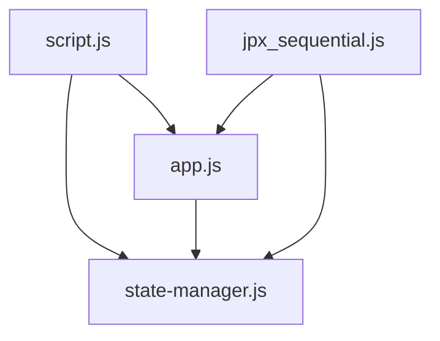

# フロントエンド開発ガイド

## 概要

このドキュメントは、株価データ管理システムのフロントエンド開発におけるガイドラインとベストプラクティスを定義します。新規開発者のオンボーディング時間短縮、一貫したコーディングスタイルの確立、コード品質向上を目的としています。

## 目次

- [フロントエンド開発ガイド](#フロントエンド開発ガイド)
  - [概要](#概要)
  - [目次](#目次)
  - [1. ディレクトリ構成](#1-ディレクトリ構成)
    - [1.1 基本構成](#11-基本構成)
    - [1.2 ディレクトリの役割](#12-ディレクトリの役割)
  - [2. ファイル命名規則](#2-ファイル命名規則)
    - [2.1 HTMLテンプレート](#21-htmlテンプレート)
    - [2.2 JavaScriptファイル](#22-javascriptファイル)
    - [2.3 CSSファイル](#23-cssファイル)
  - [3. モジュール構造](#3-モジュール構造)
    - [3.1 JavaScriptモジュール設計](#31-javascriptモジュール設計)
    - [3.2 モジュール間の依存関係](#32-モジュール間の依存関係)
    - [3.3 インポート/エクスポート規則](#33-インポートエクスポート規則)
  - [4. コンポーネント開発ガイドライン](#4-コンポーネント開発ガイドライン)
    - [4.1 HTMLテンプレート設計](#41-htmlテンプレート設計)
      - [基本構造](#基本構造)
      - [部分テンプレートの活用](#部分テンプレートの活用)
    - [4.2 JavaScriptクラス設計](#42-javascriptクラス設計)
      - [クラス設計原則](#クラス設計原則)
    - [4.3 CSS設計原則](#43-css設計原則)
      - [BEM方法論の採用](#bem方法論の採用)
      - [CSS変数の活用](#css変数の活用)
  - [5. 状態管理](#5-状態管理)
    - [5.1 StateManagerの使用方法](#51-statemanagerの使用方法)
      - [基本的な使用方法](#基本的な使用方法)
      - [永続化の活用](#永続化の活用)
    - [5.2 状態の種類と管理方針](#52-状態の種類と管理方針)
      - [アプリケーション状態](#アプリケーション状態)
      - [UI状態の管理](#ui状態の管理)
    - [5.3 永続化戦略](#53-永続化戦略)
      - [localStorage vs sessionStorage](#localstorage-vs-sessionstorage)
  - [6. スタイリング](#6-スタイリング)
    - [6.1 CSS設計方針](#61-css設計方針)
      - [レイヤー構造](#レイヤー構造)
    - [6.2 デザインシステム](#62-デザインシステム)
      - [カラーシステム](#カラーシステム)
      - [タイポグラフィシステム](#タイポグラフィシステム)
    - [6.3 レスポンシブデザイン](#63-レスポンシブデザイン)
      - [ブレークポイント](#ブレークポイント)
      - [レスポンシブテーブル](#レスポンシブテーブル)
  - [7. WebSocket通信](#7-websocket通信)
    - [7.1 WebSocket接続管理](#71-websocket接続管理)
      - [基本的な接続管理](#基本的な接続管理)
    - [7.2 メッセージハンドリング](#72-メッセージハンドリング)
      - [イベントハンドラーの設定](#イベントハンドラーの設定)
    - [7.3 エラーハンドリング](#73-エラーハンドリング)
      - [WebSocketエラーの処理](#websocketエラーの処理)
  - [8. API通信](#8-api通信)
    - [8.1 APIサービス設計](#81-apiサービス設計)
      - [基本的なAPIサービス](#基本的なapiサービス)
    - [8.2 エラーハンドリング](#82-エラーハンドリング)
      - [APIエラーの処理](#apiエラーの処理)
    - [8.3 ローディング状態管理](#83-ローディング状態管理)
      - [ローディング状態の管理](#ローディング状態の管理)
  - [9. フォームバリデーション](#9-フォームバリデーション)
    - [9.1 バリデーションルール](#91-バリデーションルール)
      - [FormValidatorクラスの使用](#formvalidatorクラスの使用)
    - [9.2 エラー表示](#92-エラー表示)
      - [フォームエラーの表示](#フォームエラーの表示)
    - [9.3 ユーザビリティ](#93-ユーザビリティ)
      - [リアルタイムバリデーション](#リアルタイムバリデーション)
  - [10. パフォーマンス最適化](#10-パフォーマンス最適化)
    - [10.1 基本原則](#101-基本原則)
      - [パフォーマンス最適化の指針](#パフォーマンス最適化の指針)
    - [10.2 具体的な最適化手法](#102-具体的な最適化手法)
      - [DOM操作の最適化](#dom操作の最適化)
      - [デバウンス・スロットリングの活用](#デバウンススロットリングの活用)
      - [メモリ管理](#メモリ管理)
    - [10.3 監視とメトリクス](#103-監視とメトリクス)
      - [パフォーマンス測定](#パフォーマンス測定)
  - [11. テスト戦略](#11-テスト戦略)
    - [11.1 テストの種類](#111-テストの種類)
      - [単体テスト（Unit Tests）](#単体テストunit-tests)
      - [統合テスト（Integration Tests）](#統合テストintegration-tests)
      - [E2Eテスト（End-to-End Tests）](#e2eテストend-to-end-tests)
    - [11.2 テストファイル構成](#112-テストファイル構成)
    - [11.3 テスト実行方法](#113-テスト実行方法)
      - [テストランナーの設定](#テストランナーの設定)
  - [12. デバッグとトラブルシューティング](#12-デバッグとトラブルシューティング)
    - [12.1 開発者ツールの活用](#121-開発者ツールの活用)
      - [デバッグ用ユーティリティ](#デバッグ用ユーティリティ)
    - [12.2 ログ出力規則](#122-ログ出力規則)
      - [ログレベルの定義](#ログレベルの定義)
    - [12.3 よくある問題と解決方法](#123-よくある問題と解決方法)
      - [問題解決ガイド](#問題解決ガイド)
  - [13. セキュリティ考慮事項](#13-セキュリティ考慮事項)
    - [13.1 XSS対策](#131-xss対策)
      - [HTMLエスケープの徹底](#htmlエスケープの徹底)
    - [13.2 CSRF対策](#132-csrf対策)
      - [CSRFトークンの処理](#csrfトークンの処理)
    - [13.3 データ検証](#133-データ検証)
      - [クライアントサイド検証の限界](#クライアントサイド検証の限界)
  - [14. ベストプラクティス](#14-ベストプラクティス)
    - [14.1 コーディング規約](#141-コーディング規約)
      - [JavaScript コーディングスタイル](#javascript-コーディングスタイル)
      - [定数の定義](#定数の定義)
    - [14.2 コメント記述規則](#142-コメント記述規則)
      - [JSDoc形式のコメント](#jsdoc形式のコメント)
      - [インラインコメント](#インラインコメント)
    - [14.3 コードレビューポイント](#143-コードレビューポイント)
      - [チェックリスト](#チェックリスト)
  - [まとめ](#まとめ)

## 1. ディレクトリ構成

### 1.1 基本構成

```
app/
├── static/                    # 静的ファイル
│   ├── app.js                # メインアプリケーションロジック
│   ├── state-manager.js      # 状態管理システム
│   ├── script.js             # アプリケーション初期化
│   ├── jpx_sequential.js     # JPX連続取得機能
│   └── style.css             # メインスタイルシート
└── templates/                # HTMLテンプレート
    ├── base.html             # ベーステンプレート
    ├── index.html            # メインページ
    ├── websocket_test.html   # WebSocketテストページ
    └── partials/             # 部分テンプレート
        ├── header.html       # ヘッダー
        ├── footer.html       # フッター
        ├── alerts.html       # アラート表示
        ├── data_table.html   # データテーブル
        └── form_components.html # フォームコンポーネント
```

### 1.2 ディレクトリの役割

- **static/**: JavaScriptファイル、CSSファイル、画像などの静的リソース
- **templates/**: Jinja2テンプレートファイル
- **partials/**: 再利用可能な部分テンプレート

## 2. ファイル命名規則

### 2.1 HTMLテンプレート

- **形式**: `snake_case.html`
- **例**: `websocket_test.html`, `data_table.html`
- **部分テンプレート**: `partials/` ディレクトリ内に配置

### 2.2 JavaScriptファイル

- **形式**: `kebab-case.js` または `snake_case.js`
- **例**: `state-manager.js`, `jpx_sequential.js`
- **機能別命名**: 機能を表す明確な名前を使用

### 2.3 CSSファイル

- **メインファイル**: `style.css`
- **追加ファイル**: 機能別に分割する場合は `feature-name.css`

## 3. モジュール構造

### 3.1 JavaScriptモジュール設計

現在のシステムでは、以下のモジュール構成を採用しています：

```javascript
// state-manager.js - 状態管理の基盤
export class StateManager { /* ... */ }
export class AppStateManager extends StateManager { /* ... */ }
export const appStateManager = new AppStateManager();

// app.js - アプリケーションロジック
import { appStateManager } from './state-manager.js';
export class AppState { /* ... */ }
export class Utils { /* ... */ }
export class ApiService { /* ... */ }
export class UIComponents { /* ... */ }
export class FormValidator { /* ... */ }

// script.js - アプリケーション初期化
import { AppState, Utils, ApiService, UIComponents, FormValidator } from './app.js';
import { appStateManager } from './state-manager.js';
```

### 3.2 モジュール間の依存関係



### 3.3 インポート/エクスポート規則

```javascript
// ✅ 良い例: 明示的なインポート
import { appStateManager, StateManager } from './state-manager.js';
import { Utils, ApiService } from './app.js';

// ✅ 良い例: 明示的なエクスポート
export class Utils {
    // クラス実装
}

export const apiService = new ApiService();

// ❌ 避ける: デフォルトエクスポート（現在のシステムでは使用しない）
export default Utils;
```

## 4. コンポーネント開発ガイドライン

### 4.1 HTMLテンプレート設計

#### 基本構造

```html
<!-- base.html -->
<!DOCTYPE html>
<html lang="ja">
<head>
    <meta charset="UTF-8">
    <meta name="viewport" content="width=device-width, initial-scale=1.0">
    <title>株価データ管理システム</title>

    <!-- Bootstrap CSS -->
    <link href="https://cdn.jsdelivr.net/npm/bootstrap@5.3.0/dist/css/bootstrap.min.css" rel="stylesheet">

    <!-- Custom CSS -->
    <link rel="stylesheet" href="{{ url_for('static', filename='style.css') }}">

    
</head>
<body>
    

    <main class="layout__main">
        
    </main>

    

    <!-- Bootstrap JS -->
    <script src="https://cdn.jsdelivr.net/npm/bootstrap@5.3.0/dist/js/bootstrap.bundle.min.js"></script>

    
    
</body>
</html>
```

#### 部分テンプレートの活用

```html
<!-- partials/alerts.html -->
<div id="alert-container" class="alert-container">
    <!-- アラートメッセージがここに動的に挿入される -->
</div>

<!-- partials/data_table.html -->
<div class="table-responsive">
    <table class="table table-striped table-hover" id="data-table">
        <thead class="table-dark">
            <!-- テーブルヘッダー -->
        </thead>
        <tbody id="table-body">
            <!-- データ行がここに動的に挿入される -->
        </tbody>
    </table>
</div>
```

### 4.2 JavaScriptクラス設計

#### クラス設計原則

```javascript
// ✅ 良い例: 単一責任の原則
class ApiService {
    constructor() {
        this.baseUrl = '/api';
    }

    // 株価データ取得
    async fetchStockData(symbol, period, interval) {
        try {
            const response = await fetch(`${this.baseUrl}/stock-data`, {
                method: 'POST',
                headers: {
                    'Content-Type': 'application/json',
                },
                body: JSON.stringify({ symbol, period, interval })
            });

            if (!response.ok) {
                throw new Error(`HTTP error! status: ${response.status}`);
            }

            return await response.json();
        } catch (error) {
            console.error('Failed to fetch stock data:', error);
            throw error;
        }
    }
}

// ✅ 良い例: UIコンポーネントの分離
class UIComponents {
    // アラート表示
    static showAlert(message, type = 'info') {
        const alertContainer = document.getElementById('alert-container');
        const alertElement = document.createElement('div');
        alertElement.className = `alert alert-${type} alert-dismissible fade show`;
        alertElement.innerHTML = `
            ${message}
            <button type="button" class="btn-close" data-bs-dismiss="alert"></button>
        `;
        alertContainer.appendChild(alertElement);

        // 5秒後に自動削除
        setTimeout(() => {
            if (alertElement.parentNode) {
                alertElement.remove();
            }
        }, 5000);
    }

    // ローディング表示
    static showLoading(elementId) {
        const element = document.getElementById(elementId);
        if (element) {
            element.innerHTML = '<div class="spinner-border" role="status"><span class="visually-hidden">Loading...</span></div>';
        }
    }
}
```

### 4.3 CSS設計原則

#### BEM方法論の採用

```css
/* ✅ 良い例: BEM命名規則 */
.data-table {
    /* ブロック */
}

.data-table__header {
    /* エレメント */
}

.data-table__row {
    /* エレメント */
}

.data-table__row--selected {
    /* モディファイア */
}

.data-table__cell {
    /* エレメント */
}

.data-table__cell--numeric {
    /* モディファイア */
    text-align: right;
}
```

#### CSS変数の活用

```css
/* デザインシステムの定義 */
:root {
    /* カラーパレット */
    --primary-color: #007bff;
    --primary-hover: #0056b3;
    --success-color: #28a745;
    --error-color: #dc3545;
    --warning-color: #ffc107;

    /* スペーシング */
    --spacing-xs: 0.25rem;
    --spacing-sm: 0.5rem;
    --spacing-md: 1rem;
    --spacing-lg: 1.5rem;
    --spacing-xl: 2rem;

    /* タイポグラフィ */
    --font-size-sm: 0.875rem;
    --font-size-base: 1rem;
    --font-size-lg: 1.125rem;
}

/* 使用例 */
.button {
    background-color: var(--primary-color);
    padding: var(--spacing-sm) var(--spacing-md);
    font-size: var(--font-size-base);
}

.button:hover {
    background-color: var(--primary-hover);
}
```

## 5. 状態管理

### 5.1 StateManagerの使用方法

#### 基本的な使用方法

```javascript
import { appStateManager } from './state-manager.js';

// 状態の設定
appStateManager.setState('currentSymbol', 'AAPL');
appStateManager.setState('timeframe', '1d');

// 状態の取得
const symbol = appStateManager.getState('currentSymbol');
const timeframe = appStateManager.getState('timeframe');

// 状態変更の監視
appStateManager.addListener('currentSymbol', (newValue, oldValue) => {
    console.log(`Symbol changed from ${oldValue} to ${newValue}`);
    // UI更新処理
    updateSymbolDisplay(newValue);
});

// 複数の状態を一度に設定
appStateManager.setStates({
    currentSymbol: 'GOOGL',
    timeframe: '1h',
    isLoading: true
});
```

#### 永続化の活用

```javascript
// localStorage に永続化される状態
appStateManager.setState('userPreferences', {
    theme: 'dark',
    defaultTimeframe: '1d',
    autoRefresh: true
}, true); // 第3引数をtrueにすると永続化

// sessionStorage に永続化される状態
appStateManager.setState('sessionData', {
    lastQuery: 'AAPL',
    timestamp: Date.now()
}, false, true); // 第4引数をtrueにするとsessionStorage
```

### 5.2 状態の種類と管理方針

#### アプリケーション状態

```javascript
// グローバルな状態管理
const APP_STATES = {
    // データ関連
    CURRENT_SYMBOL: 'currentSymbol',
    TIMEFRAME: 'timeframe',
    STOCK_DATA: 'stockData',

    // UI状態
    IS_LOADING: 'isLoading',
    CURRENT_PAGE: 'currentPage',
    SORT_CONFIG: 'sortConfig',

    // ユーザー設定
    USER_PREFERENCES: 'userPreferences',

    // WebSocket状態
    WS_CONNECTION_STATUS: 'wsConnectionStatus',
    WS_LAST_MESSAGE: 'wsLastMessage'
};

// 状態の初期化
function initializeAppState() {
    appStateManager.setStates({
        [APP_STATES.CURRENT_SYMBOL]: '',
        [APP_STATES.TIMEFRAME]: '1d',
        [APP_STATES.IS_LOADING]: false,
        [APP_STATES.CURRENT_PAGE]: 1,
        [APP_STATES.WS_CONNECTION_STATUS]: 'disconnected'
    });
}
```

#### UI状態の管理

```javascript
// UI状態の更新例
class DataTableManager {
    constructor() {
        this.setupStateListeners();
    }

    setupStateListeners() {
        // ローディング状態の監視
        appStateManager.addListener(APP_STATES.IS_LOADING, (isLoading) => {
            this.toggleLoadingState(isLoading);
        });

        // データ更新の監視
        appStateManager.addListener(APP_STATES.STOCK_DATA, (data) => {
            this.updateTable(data);
        });

        // ページ変更の監視
        appStateManager.addListener(APP_STATES.CURRENT_PAGE, (page) => {
            this.updatePagination(page);
        });
    }

    toggleLoadingState(isLoading) {
        const tableBody = document.getElementById('table-body');
        if (isLoading) {
            tableBody.innerHTML = '<tr><td colspan="100%" class="text-center">Loading...</td></tr>';
        }
    }
}
```

### 5.3 永続化戦略

#### localStorage vs sessionStorage

```javascript
// ユーザー設定: localStorage（ブラウザ閉じても保持）
const saveUserPreferences = (preferences) => {
    appStateManager.setState('userPreferences', preferences, true);
};

// セッションデータ: sessionStorage（タブ閉じると削除）
const saveSessionData = (data) => {
    appStateManager.setState('sessionData', data, false, true);
};

// 一時的な状態: メモリのみ（ページリロードで削除）
const setTemporaryState = (key, value) => {
    appStateManager.setState(key, value);
};
```

## 6. スタイリング

### 6.1 CSS設計方針

#### レイヤー構造

```css
/* 1. リセット・ノーマライズ（Bootstrap使用） */

/* 2. デザインシステム（CSS変数） */
:root {
    /* カラーパレット、スペーシング、タイポグラフィ */
}

/* 3. ベースレイアウト */
.layout__main {
    min-height: calc(100vh - 120px); /* ヘッダー・フッター分を除く */
    padding: var(--spacing-lg);
}

/* 4. コンポーネント */
.data-table { /* ... */ }
.form-group { /* ... */ }
.alert-container { /* ... */ }

/* 5. ユーティリティ */
.text-center { text-align: center; }
.mb-3 { margin-bottom: var(--spacing-md); }
```

### 6.2 デザインシステム

#### カラーシステム

```css
:root {
    /* プライマリカラー */
    --primary-color: #007bff;
    --primary-hover: #0056b3;
    --primary-light: #cce7ff;
    --primary-dark: #004085;

    /* セマンティックカラー */
    --success-color: #28a745;
    --error-color: #dc3545;
    --warning-color: #ffc107;
    --info-color: #17a2b8;

    /* グレースケール */
    --gray-100: #f8f9fa;
    --gray-200: #e9ecef;
    --gray-300: #dee2e6;
    --gray-400: #ced4da;
    --gray-500: #adb5bd;
    --gray-600: #6c757d;
    --gray-700: #495057;
    --gray-800: #343a40;
    --gray-900: #212529;
}
```

#### タイポグラフィシステム

```css
:root {
    /* フォントファミリー */
    --font-family-base: -apple-system, BlinkMacSystemFont, "Segoe UI", Roboto, sans-serif;
    --font-family-mono: SFMono-Regular, Menlo, Monaco, Consolas, monospace;

    /* フォントサイズ */
    --font-size-xs: 0.75rem;   /* 12px */
    --font-size-sm: 0.875rem;  /* 14px */
    --font-size-base: 1rem;    /* 16px */
    --font-size-lg: 1.125rem;  /* 18px */
    --font-size-xl: 1.25rem;   /* 20px */
    --font-size-xxl: 1.5rem;   /* 24px */

    /* フォントウェイト */
    --font-weight-light: 300;
    --font-weight-normal: 400;
    --font-weight-medium: 500;
    --font-weight-semibold: 600;
    --font-weight-bold: 700;
}
```

### 6.3 レスポンシブデザイン

#### ブレークポイント

```css
/* モバイルファースト設計 */
.data-table {
    font-size: var(--font-size-sm);
}

/* タブレット以上 */
@media (min-width: 768px) {
    .data-table {
        font-size: var(--font-size-base);
    }
}

/* デスクトップ以上 */
@media (min-width: 1024px) {
    .data-table {
        font-size: var(--font-size-base);
    }

    .layout__main {
        max-width: 1200px;
        margin: 0 auto;
    }
}
```

#### レスポンシブテーブル

```css
.table-responsive {
    overflow-x: auto;
    -webkit-overflow-scrolling: touch;
}

@media (max-width: 767px) {
    .data-table th,
    .data-table td {
        padding: var(--spacing-xs) var(--spacing-sm);
        font-size: var(--font-size-xs);
    }

    /* 重要でない列を非表示 */
    .data-table .optional-column {
        display: none;
    }
}
```

## 7. WebSocket通信

### 7.1 WebSocket接続管理

#### 基本的な接続管理

```javascript
class WebSocketManager {
    constructor() {
        this.socket = null;
        this.reconnectAttempts = 0;
        this.maxReconnectAttempts = 5;
        this.reconnectDelay = 1000;
    }

    connect() {
        try {
            this.socket = io();
            this.setupEventHandlers();
            appStateManager.setState('wsConnectionStatus', 'connecting');
        } catch (error) {
            console.error('WebSocket connection failed:', error);
            appStateManager.setState('wsConnectionStatus', 'error');
        }
    }

    setupEventHandlers() {
        this.socket.on('connect', () => {
            console.log('WebSocket connected');
            appStateManager.setState('wsConnectionStatus', 'connected');
            this.reconnectAttempts = 0;
        });

        this.socket.on('disconnect', () => {
            console.log('WebSocket disconnected');
            appStateManager.setState('wsConnectionStatus', 'disconnected');
            this.handleReconnect();
        });

        this.socket.on('error', (error) => {
            console.error('WebSocket error:', error);
            appStateManager.setState('wsConnectionStatus', 'error');
        });
    }

    handleReconnect() {
        if (this.reconnectAttempts < this.maxReconnectAttempts) {
            this.reconnectAttempts++;
            setTimeout(() => {
                console.log(`Reconnecting... (${this.reconnectAttempts}/${this.maxReconnectAttempts})`);
                this.connect();
            }, this.reconnectDelay * this.reconnectAttempts);
        }
    }
}
```

### 7.2 メッセージハンドリング

#### イベントハンドラーの設定

```javascript
class WebSocketEventHandler {
    constructor(wsManager) {
        this.wsManager = wsManager;
        this.setupMessageHandlers();
    }

    setupMessageHandlers() {
        // 株価データ更新
        this.wsManager.socket.on('stock_data_update', (data) => {
            console.log('Received stock data update:', data);
            appStateManager.setState('stockData', data);
            this.updateUI(data);
        });

        // 進捗更新
        this.wsManager.socket.on('progress_update', (progress) => {
            console.log('Progress update:', progress);
            this.updateProgressBar(progress);
        });

        // エラー通知
        this.wsManager.socket.on('error_notification', (error) => {
            console.error('Server error:', error);
            UIComponents.showAlert(error.message, 'error');
        });
    }

    updateUI(data) {
        // データテーブルの更新
        const tableManager = new DataTableManager();
        tableManager.updateTable(data);

        // 最終更新時刻の表示
        const timestamp = new Date().toLocaleString('ja-JP');
        document.getElementById('last-update').textContent = `最終更新: ${timestamp}`;
    }

    updateProgressBar(progress) {
        const progressBar = document.getElementById('progress-bar');
        if (progressBar) {
            progressBar.style.width = `${progress.percentage}%`;
            progressBar.textContent = `${progress.current}/${progress.total}`;
        }
    }
}
```

### 7.3 エラーハンドリング

#### WebSocketエラーの処理

```javascript
class WebSocketErrorHandler {
    static handleConnectionError(error) {
        console.error('WebSocket connection error:', error);

        // ユーザーへの通知
        UIComponents.showAlert(
            'サーバーとの接続に問題が発生しました。ページを再読み込みしてください。',
            'error'
        );

        // 状態の更新
        appStateManager.setState('wsConnectionStatus', 'error');

        // 再接続の試行
        setTimeout(() => {
            window.location.reload();
        }, 5000);
    }

    static handleMessageError(error, message) {
        console.error('WebSocket message error:', error, message);

        // エラーログの記録
        const errorLog = {
            timestamp: new Date().toISOString(),
            error: error.message,
            message: message,
            userAgent: navigator.userAgent
        };

        // サーバーにエラーレポートを送信（オプション）
        this.sendErrorReport(errorLog);
    }

    static sendErrorReport(errorLog) {
        fetch('/api/error-report', {
            method: 'POST',
            headers: {
                'Content-Type': 'application/json',
            },
            body: JSON.stringify(errorLog)
        }).catch(err => {
            console.error('Failed to send error report:', err);
        });
    }
}
```

## 8. API通信

### 8.1 APIサービス設計

#### 基本的なAPIサービス

```javascript
class ApiService {
    constructor() {
        this.baseUrl = '/api';
        this.defaultHeaders = {
            'Content-Type': 'application/json',
        };
    }

    // 汎用的なHTTPリクエストメソッド
    async request(endpoint, options = {}) {
        const url = `${this.baseUrl}${endpoint}`;
        const config = {
            headers: { ...this.defaultHeaders, ...options.headers },
            ...options
        };

        try {
            const response = await fetch(url, config);

            if (!response.ok) {
                throw new ApiError(`HTTP ${response.status}: ${response.statusText}`, response.status);
            }

            const contentType = response.headers.get('content-type');
            if (contentType && contentType.includes('application/json')) {
                return await response.json();
            }

            return await response.text();
        } catch (error) {
            console.error(`API request failed: ${url}`, error);
            throw error;
        }
    }

    // 株価データ取得
    async fetchStockData(symbol, period, interval) {
        return this.request('/stock-data', {
            method: 'POST',
            body: JSON.stringify({ symbol, period, interval })
        });
    }

    // JPX銘柄一覧取得
    async fetchJpxSymbols() {
        return this.request('/jpx-symbols');
    }

    // システム状態取得
    async getSystemStatus() {
        return this.request('/system-status');
    }
}

// カスタムエラークラス
class ApiError extends Error {
    constructor(message, status) {
        super(message);
        this.name = 'ApiError';
        this.status = status;
    }
}
```

### 8.2 エラーハンドリング

#### APIエラーの処理

```javascript
class ApiErrorHandler {
    static async handleApiError(error, context = '') {
        console.error(`API Error in ${context}:`, error);

        let userMessage = 'エラーが発生しました。';

        if (error instanceof ApiError) {
            switch (error.status) {
                case 400:
                    userMessage = '入力データに問題があります。';
                    break;
                case 401:
                    userMessage = '認証が必要です。';
                    break;
                case 403:
                    userMessage = 'アクセス権限がありません。';
                    break;
                case 404:
                    userMessage = '要求されたデータが見つかりません。';
                    break;
                case 429:
                    userMessage = 'リクエストが多すぎます。しばらく待ってから再試行してください。';
                    break;
                case 500:
                    userMessage = 'サーバーエラーが発生しました。';
                    break;
                default:
                    userMessage = `エラーが発生しました (${error.status})`;
            }
        } else if (error.name === 'TypeError' && error.message.includes('fetch')) {
            userMessage = 'ネットワークエラーが発生しました。接続を確認してください。';
        }

        // ユーザーへの通知
        UIComponents.showAlert(userMessage, 'error');

        // 状態の更新
        appStateManager.setState('lastError', {
            message: error.message,
            timestamp: new Date().toISOString(),
            context
        });

        return { success: false, error: userMessage };
    }
}
```

### 8.3 ローディング状態管理

#### ローディング状態の管理

```javascript
class LoadingManager {
    static async withLoading(asyncFunction, loadingKey = 'isLoading') {
        try {
            // ローディング開始
            appStateManager.setState(loadingKey, true);

            // 非同期処理の実行
            const result = await asyncFunction();

            return result;
        } catch (error) {
            throw error;
        } finally {
            // ローディング終了
            appStateManager.setState(loadingKey, false);
        }
    }

    // 使用例
    static async fetchDataWithLoading(symbol, period, interval) {
        return this.withLoading(async () => {
            const apiService = new ApiService();
            return await apiService.fetchStockData(symbol, period, interval);
        }, 'dataLoading');
    }
}

// 使用例
async function handleDataFetch() {
    try {
        const data = await LoadingManager.fetchDataWithLoading('AAPL', '1mo', '1d');
        appStateManager.setState('stockData', data);
        UIComponents.showAlert('データを取得しました。', 'success');
    } catch (error) {
        await ApiErrorHandler.handleApiError(error, 'データ取得');
    }
}
```

## 9. フォームバリデーション

### 9.1 バリデーションルール

#### FormValidatorクラスの使用

```javascript
class FormValidator {
    // 銘柄コードの検証
    static validateSymbol(symbol) {
        if (!symbol || symbol.trim() === '') {
            return { isValid: false, message: '銘柄コードを入力してください。' };
        }

        // 日本株の場合（4桁数字）
        if (/^\d{4}$/.test(symbol)) {
            return { isValid: true };
        }

        // 米国株の場合（英字）
        if (/^[A-Z]{1,5}$/.test(symbol.toUpperCase())) {
            return { isValid: true };
        }

        return {
            isValid: false,
            message: '有効な銘柄コードを入力してください（例: 7203, AAPL）。'
        };
    }

    // 期間の検証
    static validatePeriod(period) {
        const validPeriods = ['1d', '5d', '1mo', '3mo', '6mo', '1y', '2y', '5y', '10y', 'ytd', 'max'];

        if (!validPeriods.includes(period)) {
            return {
                isValid: false,
                message: '有効な期間を選択してください。'
            };
        }

        return { isValid: true };
    }

    // 足の検証
    static validateInterval(interval) {
        const validIntervals = ['1m', '2m', '5m', '15m', '30m', '60m', '90m', '1h', '1d', '5d', '1wk', '1mo', '3mo'];

        if (!validIntervals.includes(interval)) {
            return {
                isValid: false,
                message: '有効な足を選択してください。'
            };
        }

        return { isValid: true };
    }

    // 期間と足の組み合わせ検証
    static validatePeriodIntervalCombination(period, interval) {
        const rules = {
            '1d': ['1m', '2m', '5m', '15m', '30m', '60m', '90m'],
            '5d': ['1m', '2m', '5m', '15m', '30m', '60m', '90m'],
            '1mo': ['30m', '60m', '90m', '1h', '1d'],
            '3mo': ['1h', '1d'],
            '6mo': ['1d'],
            '1y': ['1d', '5d', '1wk'],
            '2y': ['1d', '5d', '1wk'],
            '5y': ['1wk', '1mo'],
            '10y': ['1wk', '1mo'],
            'ytd': ['1d', '5d', '1wk'],
            'max': ['1wk', '1mo', '3mo']
        };

        if (!rules[period] || !rules[period].includes(interval)) {
            return {
                isValid: false,
                message: `期間 ${period} では足 ${interval} は使用できません。`
            };
        }

        return { isValid: true };
    }

    // フォーム全体の検証
    static validateStockDataForm(formData) {
        const errors = [];

        // 銘柄コード検証
        const symbolValidation = this.validateSymbol(formData.symbol);
        if (!symbolValidation.isValid) {
            errors.push({ field: 'symbol', message: symbolValidation.message });
        }

        // 期間検証
        const periodValidation = this.validatePeriod(formData.period);
        if (!periodValidation.isValid) {
            errors.push({ field: 'period', message: periodValidation.message });
        }

        // 足検証
        const intervalValidation = this.validateInterval(formData.interval);
        if (!intervalValidation.isValid) {
            errors.push({ field: 'interval', message: intervalValidation.message });
        }

        // 組み合わせ検証
        if (symbolValidation.isValid && periodValidation.isValid && intervalValidation.isValid) {
            const combinationValidation = this.validatePeriodIntervalCombination(formData.period, formData.interval);
            if (!combinationValidation.isValid) {
                errors.push({ field: 'combination', message: combinationValidation.message });
            }
        }

        return {
            isValid: errors.length === 0,
            errors
        };
    }
}
```

### 9.2 エラー表示

#### フォームエラーの表示

```javascript
class FormErrorDisplay {
    static showFieldError(fieldId, message) {
        // 既存のエラーメッセージを削除
        this.clearFieldError(fieldId);

        const field = document.getElementById(fieldId);
        if (!field) return;

        // フィールドにエラークラスを追加
        field.classList.add('is-invalid');

        // エラーメッセージ要素を作成
        const errorElement = document.createElement('div');
        errorElement.className = 'invalid-feedback';
        errorElement.textContent = message;
        errorElement.id = `${fieldId}-error`;

        // エラーメッセージを挿入
        field.parentNode.appendChild(errorElement);
    }

    static clearFieldError(fieldId) {
        const field = document.getElementById(fieldId);
        if (field) {
            field.classList.remove('is-invalid');
        }

        const errorElement = document.getElementById(`${fieldId}-error`);
        if (errorElement) {
            errorElement.remove();
        }
    }

    static clearAllErrors(formId) {
        const form = document.getElementById(formId);
        if (!form) return;

        // すべてのis-invalidクラスを削除
        const invalidFields = form.querySelectorAll('.is-invalid');
        invalidFields.forEach(field => {
            field.classList.remove('is-invalid');
        });

        // すべてのエラーメッセージを削除
        const errorMessages = form.querySelectorAll('.invalid-feedback');
        errorMessages.forEach(message => {
            message.remove();
        });
    }

    static displayValidationErrors(errors) {
        errors.forEach(error => {
            if (error.field === 'combination') {
                // 組み合わせエラーは全体的なアラートとして表示
                UIComponents.showAlert(error.message, 'warning');
            } else {
                // フィールド固有のエラーを表示
                this.showFieldError(error.field, error.message);
            }
        });
    }
}
```

### 9.3 ユーザビリティ

#### リアルタイムバリデーション

```javascript
class RealTimeValidator {
    static setupFormValidation(formId) {
        const form = document.getElementById(formId);
        if (!form) return;

        // 各フィールドにイベントリスナーを設定
        const symbolField = form.querySelector('#symbol');
        const periodField = form.querySelector('#period');
        const intervalField = form.querySelector('#interval');

        if (symbolField) {
            symbolField.addEventListener('blur', () => {
                this.validateField('symbol', symbolField.value);
            });

            symbolField.addEventListener('input', () => {
                // 入力中はエラーをクリア
                FormErrorDisplay.clearFieldError('symbol');
            });
        }

        if (periodField) {
            periodField.addEventListener('change', () => {
                this.validateField('period', periodField.value);
                this.updateIntervalOptions(periodField.value);
            });
        }

        if (intervalField) {
            intervalField.addEventListener('change', () => {
                this.validateField('interval', intervalField.value);
            });
        }
    }

    static validateField(fieldName, value) {
        let validation;

        switch (fieldName) {
            case 'symbol':
                validation = FormValidator.validateSymbol(value);
                break;
            case 'period':
                validation = FormValidator.validatePeriod(value);
                break;
            case 'interval':
                validation = FormValidator.validateInterval(value);
                break;
            default:
                return;
        }

        if (!validation.isValid) {
            FormErrorDisplay.showFieldError(fieldName, validation.message);
        } else {
            FormErrorDisplay.clearFieldError(fieldName);
        }
    }

    static updateIntervalOptions(period) {
        const intervalSelect = document.getElementById('interval');
        if (!intervalSelect) return;

        // 期間に応じて利用可能な足を更新
        const validIntervals = {
            '1d': ['1m', '2m', '5m', '15m', '30m', '60m', '90m'],
            '5d': ['1m', '2m', '5m', '15m', '30m', '60m', '90m'],
            '1mo': ['30m', '60m', '90m', '1h', '1d'],
            '3mo': ['1h', '1d'],
            '6mo': ['1d'],
            '1y': ['1d', '5d', '1wk'],
            '2y': ['1d', '5d', '1wk'],
            '5y': ['1wk', '1mo'],
            '10y': ['1wk', '1mo'],
            'ytd': ['1d', '5d', '1wk'],
            'max': ['1wk', '1mo', '3mo']
        };

        const allowedIntervals = validIntervals[period] || [];
        const options = intervalSelect.querySelectorAll('option');

        options.forEach(option => {
            if (option.value === '') return; // 空のオプションはスキップ

            if (allowedIntervals.includes(option.value)) {
                option.disabled = false;
                option.style.display = '';
            } else {
                option.disabled = true;
                option.style.display = 'none';
            }
        });

        // 現在選択されている足が無効な場合、最初の有効な足を選択
        if (!allowedIntervals.includes(intervalSelect.value)) {
            intervalSelect.value = allowedIntervals[0] || '';
        }
    }
}
```

## 10. パフォーマンス最適化

### 10.1 基本原則

#### パフォーマンス最適化の指針

1. **測定ファースト**: 最適化前に必ず測定する
2. **ボトルネック特定**: 実際の問題箇所を特定する
3. **段階的改善**: 一度に多くを変更しない
4. **ユーザー体験重視**: 体感速度を優先する

### 10.2 具体的な最適化手法

#### DOM操作の最適化

```javascript
class DOMOptimizer {
    // DocumentFragmentを使用した効率的なDOM操作
    static createTableRows(data) {
        const fragment = document.createDocumentFragment();

        data.forEach(item => {
            const row = document.createElement('tr');
            row.innerHTML = `
                <td>${Utils.escapeHtml(item.symbol)}</td>
                <td>${Utils.formatCurrency(item.price)}</td>
                <td class="${item.change >= 0 ? 'text-success' : 'text-danger'}">
                    ${Utils.formatNumber(item.change, 2)}
                </td>
                <td>${Utils.formatDateTime(item.timestamp)}</td>
            `;
            fragment.appendChild(row);
        });

        return fragment;
    }

    // バッチ更新による再描画の最小化
    static updateTable(tableId, data) {
        const tableBody = document.getElementById(tableId);
        if (!tableBody) return;

        // 一度に更新してリフローを最小化
        requestAnimationFrame(() => {
            tableBody.innerHTML = '';
            const fragment = this.createTableRows(data);
            tableBody.appendChild(fragment);
        });
    }
}
```

#### デバウンス・スロットリングの活用

```javascript
class PerformanceUtils {
    // デバウンス: 連続した呼び出しを遅延
    static debounce(func, wait) {
        let timeout;
        return function executedFunction(...args) {
            const later = () => {
                clearTimeout(timeout);
                func(...args);
            };
            clearTimeout(timeout);
            timeout = setTimeout(later, wait);
        };
    }

    // スロットリング: 一定間隔での実行制限
    static throttle(func, limit) {
        let inThrottle;
        return function executedFunction(...args) {
            if (!inThrottle) {
                func.apply(this, args);
                inThrottle = true;
                setTimeout(() => inThrottle = false, limit);
            }
        };
    }

    // 使用例: 検索フィールドのデバウンス
    static setupSearchDebounce(inputId, searchFunction, delay = 300) {
        const input = document.getElementById(inputId);
        if (!input) return;

        const debouncedSearch = this.debounce(searchFunction, delay);
        input.addEventListener('input', (e) => {
            debouncedSearch(e.target.value);
        });
    }

    // 使用例: スクロールイベントのスロットリング
    static setupScrollThrottle(scrollFunction, limit = 100) {
        const throttledScroll = this.throttle(scrollFunction, limit);
        window.addEventListener('scroll', throttledScroll);
    }
}
```

#### メモリ管理

```javascript
class MemoryManager {
    // イベントリスナーの適切な削除
    static cleanupEventListeners(element) {
        if (element && element.parentNode) {
            // 要素を削除する前にイベントリスナーをクリア
            const clone = element.cloneNode(true);
            element.parentNode.replaceChild(clone, element);
        }
    }

    // 大量データの分割処理
    static processLargeDataset(data, batchSize = 100, processingFunction) {
        let index = 0;

        function processBatch() {
            const batch = data.slice(index, index + batchSize);
            if (batch.length === 0) return;

            processingFunction(batch);
            index += batchSize;

            // 次のバッチを非同期で処理
            if (index < data.length) {
                setTimeout(processBatch, 0);
            }
        }

        processBatch();
    }

    // WeakMapを使用したメモリリーク防止
    static createWeakCache() {
        const cache = new WeakMap();

        return {
            set(key, value) {
                cache.set(key, value);
            },
            get(key) {
                return cache.get(key);
            },
            has(key) {
                return cache.has(key);
            }
        };
    }
}
```

### 10.3 監視とメトリクス

#### パフォーマンス測定

```javascript
class PerformanceMonitor {
    // 処理時間の測定
    static measureExecutionTime(name, func) {
        return async function(...args) {
            const startTime = performance.now();

            try {
                const result = await func.apply(this, args);
                const endTime = performance.now();
                const duration = endTime - startTime;

                console.log(`${name} execution time: ${duration.toFixed(2)}ms`);

                // パフォーマンスデータを記録
                this.recordMetric(name, duration);

                return result;
            } catch (error) {
                const endTime = performance.now();
                const duration = endTime - startTime;
                console.error(`${name} failed after ${duration.toFixed(2)}ms:`, error);
                throw error;
            }
        };
    }

    // メトリクスの記録
    static recordMetric(name, value) {
        if (!window.performanceMetrics) {
            window.performanceMetrics = {};
        }

        if (!window.performanceMetrics[name]) {
            window.performanceMetrics[name] = [];
        }

        window.performanceMetrics[name].push({
            value,
            timestamp: Date.now()
        });

        // 古いデータを削除（最新100件のみ保持）
        if (window.performanceMetrics[name].length > 100) {
            window.performanceMetrics[name] = window.performanceMetrics[name].slice(-100);
        }
    }

    // パフォーマンスレポートの生成
    static generateReport() {
        if (!window.performanceMetrics) return null;

        const report = {};

        Object.keys(window.performanceMetrics).forEach(name => {
            const metrics = window.performanceMetrics[name];
            const values = metrics.map(m => m.value);

            report[name] = {
                count: values.length,
                average: values.reduce((a, b) => a + b, 0) / values.length,
                min: Math.min(...values),
                max: Math.max(...values),
                latest: values[values.length - 1]
            };
        });

        return report;
    }
}
```

## 11. テスト戦略

### 11.1 テストの種類

#### 単体テスト（Unit Tests）

```javascript
// tests/unit/test_utils.html
<!DOCTYPE html>
<html>
<head>
    <title>Utils Unit Tests</title>
    <script src="../../app/static/app.js"></script>
</head>
<body>
    <div id="test-results"></div>

    <script>
        // 簡易テストフレームワーク
        class SimpleTest {
            constructor() {
                this.tests = [];
                this.results = [];
            }

            test(name, testFunction) {
                this.tests.push({ name, testFunction });
            }

            async run() {
                for (const test of this.tests) {
                    try {
                        await test.testFunction();
                        this.results.push({ name: test.name, status: 'PASS' });
                        console.log(`✅ ${test.name}`);
                    } catch (error) {
                        this.results.push({ name: test.name, status: 'FAIL', error: error.message });
                        console.error(`❌ ${test.name}: ${error.message}`);
                    }
                }

                this.displayResults();
            }

            displayResults() {
                const container = document.getElementById('test-results');
                const passed = this.results.filter(r => r.status === 'PASS').length;
                const total = this.results.length;

                container.innerHTML = `
                    <h2>Test Results: ${passed}/${total} passed</h2>
                    <ul>
                        ${this.results.map(r => `
                            <li class="${r.status.toLowerCase()}">
                                ${r.name}: ${r.status}
                                ${r.error ? ` - ${r.error}` : ''}
                            </li>
                        `).join('')}
                    </ul>
                `;
            }

            assert(condition, message) {
                if (!condition) {
                    throw new Error(message || 'Assertion failed');
                }
            }

            assertEqual(actual, expected, message) {
                if (actual !== expected) {
                    throw new Error(message || `Expected ${expected}, got ${actual}`);
                }
            }
        }

        // テストケース
        const test = new SimpleTest();

        test.test('Utils.formatCurrency should format numbers correctly', () => {
            test.assertEqual(Utils.formatCurrency(1234.56), '¥1,234.56');
            test.assertEqual(Utils.formatCurrency(0), '¥0.00');
            test.assertEqual(Utils.formatCurrency(-1234.56), '-¥1,234.56');
        });

        test.test('Utils.formatNumber should format numbers with specified decimals', () => {
            test.assertEqual(Utils.formatNumber(1234.5678, 2), '1,234.57');
            test.assertEqual(Utils.formatNumber(1234, 0), '1,234');
        });

        test.test('Utils.escapeHtml should escape HTML characters', () => {
            test.assertEqual(Utils.escapeHtml('<script>'), '&lt;script&gt;');
            test.assertEqual(Utils.escapeHtml('A & B'), 'A &amp; B');
        });

        test.test('FormValidator.validateSymbol should validate symbols correctly', () => {
            test.assert(FormValidator.validateSymbol('7203').isValid);
            test.assert(FormValidator.validateSymbol('AAPL').isValid);
            test.assert(!FormValidator.validateSymbol('').isValid);
            test.assert(!FormValidator.validateSymbol('invalid').isValid);
        });

        // テスト実行
        test.run();
    </script>

    <style>
        .pass { color: green; }
        .fail { color: red; }
    </style>
</body>
</html>
```

#### 統合テスト（Integration Tests）

```javascript
// tests/integration/test_api_integration.html
<!DOCTYPE html>
<html>
<head>
    <title>API Integration Tests</title>
    <script src="../../app/static/app.js"></script>
    <script src="../../app/static/state-manager.js"></script>
</head>
<body>
    <div id="test-results"></div>

    <script>
        class IntegrationTest extends SimpleTest {
            async testApiService() {
                const apiService = new ApiService();

                // モックレスポンスの設定
                const originalFetch = window.fetch;
                window.fetch = async (url, options) => {
                    if (url.includes('/api/stock-data')) {
                        return {
                            ok: true,
                            json: async () => ({
                                symbol: 'AAPL',
                                data: [
                                    { date: '2023-01-01', open: 100, high: 110, low: 95, close: 105, volume: 1000000 }
                                ]
                            })
                        };
                    }
                    return originalFetch(url, options);
                };

                try {
                    const result = await apiService.fetchStockData('AAPL', '1d', '1h');
                    this.assert(result.symbol === 'AAPL', 'Symbol should match');
                    this.assert(Array.isArray(result.data), 'Data should be an array');
                } finally {
                    // モックを元に戻す
                    window.fetch = originalFetch;
                }
            }

            async testStateManagerIntegration() {
                // 状態管理のテスト
                appStateManager.setState('testValue', 'initial');
                this.assertEqual(appStateManager.getState('testValue'), 'initial');

                // リスナーのテスト
                let listenerCalled = false;
                const listener = (newValue) => {
                    listenerCalled = true;
                    this.assertEqual(newValue, 'updated');
                };

                appStateManager.addListener('testValue', listener);
                appStateManager.setState('testValue', 'updated');

                this.assert(listenerCalled, 'Listener should be called');

                // クリーンアップ
                appStateManager.removeListener('testValue', listener);
                appStateManager.removeState('testValue');
            }
        }

        const integrationTest = new IntegrationTest();

        integrationTest.test('API Service Integration', () => integrationTest.testApiService());
        integrationTest.test('State Manager Integration', () => integrationTest.testStateManagerIntegration());

        // テスト実行
        integrationTest.run();
    </script>
</body>
</html>
```

#### E2Eテスト（End-to-End Tests）

```javascript
// tests/e2e/test_user_workflow.html
<!DOCTYPE html>
<html>
<head>
    <title>E2E User Workflow Tests</title>
</head>
<body>
    <div id="test-results"></div>

    <script>
        class E2ETest {
            async testCompleteUserWorkflow() {
                // 1. ページロード確認
                this.assert(document.title.includes('株価データ管理'), 'Page should load correctly');

                // 2. フォーム入力
                const symbolInput = document.getElementById('symbol');
                const periodSelect = document.getElementById('period');
                const intervalSelect = document.getElementById('interval');

                this.assert(symbolInput, 'Symbol input should exist');
                this.assert(periodSelect, 'Period select should exist');
                this.assert(intervalSelect, 'Interval select should exist');

                // 3. データ入力
                symbolInput.value = 'AAPL';
                periodSelect.value = '1mo';
                intervalSelect.value = '1d';

                // 4. フォーム送信
                const submitButton = document.getElementById('submit-btn');
                this.assert(submitButton, 'Submit button should exist');

                // 5. 結果確認（モック環境での確認）
                // 実際のE2Eテストでは、実際のAPIレスポンスを確認
            }
        }
    </script>
</body>
</html>
```

### 11.2 テストファイル構成

```
tests/
├── unit/                     # 単体テスト
│   ├── test_utils.html      # Utilsクラスのテスト
│   ├── test_validator.html  # FormValidatorクラスのテスト
│   └── test_state_manager.html # StateManagerクラスのテスト
├── integration/             # 統合テスト
│   ├── test_api_integration.html # API統合テスト
│   └── test_component_integration.html # コンポーネント統合テスト
├── e2e/                     # E2Eテスト
│   ├── test_user_workflow.html # ユーザーワークフローテスト
│   └── test_websocket_flow.html # WebSocket通信テスト
└── test_runner.html         # テスト実行用ページ
```

### 11.3 テスト実行方法

#### テストランナーの設定

```html
<!-- tests/test_runner.html -->
<!DOCTYPE html>
<html>
<head>
    <title>Test Runner</title>
    <style>
        .test-suite { margin: 20px 0; padding: 10px; border: 1px solid #ccc; }
        .pass { color: green; }
        .fail { color: red; }
    </style>
</head>
<body>
    <h1>Frontend Test Runner</h1>

    <div id="test-suites">
        <div class="test-suite">
            <h2>Unit Tests</h2>
            <iframe src="unit/test_utils.html" width="100%" height="300"></iframe>
        </div>

        <div class="test-suite">
            <h2>Integration Tests</h2>
            <iframe src="integration/test_api_integration.html" width="100%" height="300"></iframe>
        </div>

        <div class="test-suite">
            <h2>E2E Tests</h2>
            <iframe src="e2e/test_user_workflow.html" width="100%" height="300"></iframe>
        </div>
    </div>

    <div id="overall-results">
        <h2>Overall Results</h2>
        <p>テスト結果がここに表示されます</p>
    </div>
</body>
</html>
```

## 12. デバッグとトラブルシューティング

### 12.1 開発者ツールの活用

#### デバッグ用ユーティリティ

```javascript
class DebugUtils {
    // 状態のデバッグ出力
    static logState(key = null) {
        if (key) {
            console.log(`State[${key}]:`, appStateManager.getState(key));
        } else {
            console.log('All States:', appStateManager.getAllStates());
        }
    }

    // パフォーマンス情報の出力
    static logPerformance() {
        const report = PerformanceMonitor.generateReport();
        console.table(report);
    }

    // DOM要素の詳細情報
    static inspectElement(selector) {
        const element = document.querySelector(selector);
        if (!element) {
            console.error(`Element not found: ${selector}`);
            return;
        }

        console.group(`Element: ${selector}`);
        console.log('Element:', element);
        console.log('Computed Style:', window.getComputedStyle(element));
        console.log('Event Listeners:', getEventListeners(element));
        console.groupEnd();
    }

    // API呼び出しの監視
    static monitorApiCalls() {
        const originalFetch = window.fetch;
        window.fetch = async function(...args) {
            const [url, options] = args;
            console.group(`API Call: ${url}`);
            console.log('Options:', options);

            const startTime = performance.now();
            try {
                const response = await originalFetch(...args);
                const endTime = performance.now();

                console.log(`Status: ${response.status}`);
                console.log(`Duration: ${(endTime - startTime).toFixed(2)}ms`);
                console.groupEnd();

                return response;
            } catch (error) {
                const endTime = performance.now();
                console.error(`Error after ${(endTime - startTime).toFixed(2)}ms:`, error);
                console.groupEnd();
                throw error;
            }
        };
    }
}

// グローバルに利用可能にする
window.DebugUtils = DebugUtils;
```

### 12.2 ログ出力規則

#### ログレベルの定義

```javascript
class Logger {
    static LOG_LEVELS = {
        ERROR: 0,
        WARN: 1,
        INFO: 2,
        DEBUG: 3
    };

    static currentLevel = this.LOG_LEVELS.INFO;

    static error(message, ...args) {
        if (this.currentLevel >= this.LOG_LEVELS.ERROR) {
            console.error(`[ERROR] ${new Date().toISOString()} - ${message}`, ...args);
        }
    }

    static warn(message, ...args) {
        if (this.currentLevel >= this.LOG_LEVELS.WARN) {
            console.warn(`[WARN] ${new Date().toISOString()} - ${message}`, ...args);
        }
    }

    static info(message, ...args) {
        if (this.currentLevel >= this.LOG_LEVELS.INFO) {
            console.log(`[INFO] ${new Date().toISOString()} - ${message}`, ...args);
        }
    }

    static debug(message, ...args) {
        if (this.currentLevel >= this.LOG_LEVELS.DEBUG) {
            console.log(`[DEBUG] ${new Date().toISOString()} - ${message}`, ...args);
        }
    }

    // 本番環境では警告・エラーのみ
    static setProductionMode() {
        this.currentLevel = this.LOG_LEVELS.WARN;
    }

    // 開発環境ではすべてのログを出力
    static setDevelopmentMode() {
        this.currentLevel = this.LOG_LEVELS.DEBUG;
    }
}
```

### 12.3 よくある問題と解決方法

#### 問題解決ガイド

```javascript
class TroubleshootingGuide {
    static commonIssues = {
        'データが表示されない': {
            causes: [
                'APIエラー',
                '状態管理の問題',
                'DOM更新の失敗'
            ],
            solutions: [
                'ネットワークタブでAPIレスポンスを確認',
                'DebugUtils.logState()で状態を確認',
                'コンソールでJavaScriptエラーを確認'
            ]
        },

        'WebSocket接続が失敗する': {
            causes: [
                'サーバーが起動していない',
                'ポート番号の不一致',
                'CORS設定の問題'
            ],
            solutions: [
                'サーバーの起動状態を確認',
                'ネットワークタブでWebSocket接続を確認',
                'サーバーのCORS設定を確認'
            ]
        },

        'フォームバリデーションが動作しない': {
            causes: [
                'イベントリスナーの設定ミス',
                'バリデーションルールの問題',
                'DOM要素の取得失敗'
            ],
            solutions: [
                'RealTimeValidator.setupFormValidation()の呼び出しを確認',
                'フォーム要素のIDを確認',
                'コンソールでエラーメッセージを確認'
            ]
        }
    };

    static diagnose(issue) {
        const guide = this.commonIssues[issue];
        if (!guide) {
            console.log('該当する問題が見つかりません。');
            console.log('利用可能な問題:', Object.keys(this.commonIssues));
            return;
        }

        console.group(`問題: ${issue}`);
        console.log('考えられる原因:');
        guide.causes.forEach((cause, index) => {
            console.log(`${index + 1}. ${cause}`);
        });

        console.log('\n解決方法:');
        guide.solutions.forEach((solution, index) => {
            console.log(`${index + 1}. ${solution}`);
        });
        console.groupEnd();
    }

    // 自動診断機能
    static runDiagnostics() {
        console.group('Frontend Diagnostics');

        // 基本的な要素の存在確認
        const criticalElements = ['#symbol', '#period', '#interval', '#data-table'];
        criticalElements.forEach(selector => {
            const element = document.querySelector(selector);
            console.log(`${selector}: ${element ? '✅ Found' : '❌ Missing'}`);
        });

        // 状態管理の確認
        console.log('State Manager:', appStateManager ? '✅ Available' : '❌ Missing');

        // API接続の確認
        fetch('/api/system-status')
            .then(response => {
                console.log(`API Connection: ${response.ok ? '✅ OK' : '❌ Failed'}`);
            })
            .catch(error => {
                console.log('API Connection: ❌ Failed', error);
            });

        console.groupEnd();
    }
}

// グローバルに利用可能にする
window.TroubleshootingGuide = TroubleshootingGuide;
```

## 13. セキュリティ考慮事項

### 13.1 XSS対策

#### HTMLエスケープの徹底

```javascript
// Utils.escapeHtml()の使用例
class SecurityUtils {
    // 動的コンテンツの安全な挿入
    static safeSetInnerHTML(elementId, content) {
        const element = document.getElementById(elementId);
        if (element) {
            element.textContent = content; // innerHTML ではなく textContent を使用
        }
    }

    // HTMLテンプレートの安全な生成
    static createSafeTemplate(template, data) {
        let safeTemplate = template;

        Object.keys(data).forEach(key => {
            const placeholder = `{{${key}}}`;
            const safeValue = Utils.escapeHtml(String(data[key]));
            safeTemplate = safeTemplate.replace(new RegExp(placeholder, 'g'), safeValue);
        });

        return safeTemplate;
    }

    // CSP（Content Security Policy）の確認
    static checkCSP() {
        const metaCSP = document.querySelector('meta[http-equiv="Content-Security-Policy"]');
        if (!metaCSP) {
            console.warn('CSP meta tag not found. Consider adding CSP for security.');
        } else {
            console.log('CSP Policy:', metaCSP.content);
        }
    }
}
```

### 13.2 CSRF対策

#### CSRFトークンの処理

```javascript
class CSRFProtection {
    static getCSRFToken() {
        const tokenElement = document.querySelector('meta[name="csrf-token"]');
        return tokenElement ? tokenElement.getAttribute('content') : null;
    }

    static addCSRFTokenToRequest(options = {}) {
        const token = this.getCSRFToken();
        if (token) {
            options.headers = {
                ...options.headers,
                'X-CSRFToken': token
            };
        }
        return options;
    }

    // APIサービスでの使用例
    static secureApiRequest(url, options = {}) {
        const secureOptions = this.addCSRFTokenToRequest(options);
        return fetch(url, secureOptions);
    }
}
```

### 13.3 データ検証

#### クライアントサイド検証の限界

```javascript
class DataValidation {
    // クライアントサイド検証（UX向上のため）
    static validateClientSide(data) {
        // 基本的な検証のみ実施
        const errors = [];

        if (!data.symbol || data.symbol.trim() === '') {
            errors.push('銘柄コードは必須です');
        }

        // 注意: クライアントサイド検証は改ざん可能
        // サーバーサイドでの検証が必須

        return {
            isValid: errors.length === 0,
            errors
        };
    }

    // 入力値のサニタイゼーション
    static sanitizeInput(input) {
        if (typeof input !== 'string') {
            return input;
        }

        return input
            .trim()
            .replace(/[<>]/g, '') // 基本的なHTMLタグを除去
            .substring(0, 1000); // 長さ制限
    }

    // 数値の安全な変換
    static safeParseNumber(value, defaultValue = 0) {
        const parsed = parseFloat(value);
        return isNaN(parsed) ? defaultValue : parsed;
    }
}
```

## 14. ベストプラクティス

### 14.1 コーディング規約

#### JavaScript コーディングスタイル

```javascript
// ✅ 良い例: 明確な命名
class StockDataManager {
    constructor(apiService, stateManager) {
        this.apiService = apiService;
        this.stateManager = stateManager;
        this.isLoading = false;
    }

    async fetchAndUpdateStockData(symbol, period, interval) {
        if (this.isLoading) {
            Logger.warn('Data fetch already in progress');
            return;
        }

        try {
            this.isLoading = true;
            this.stateManager.setState('isLoading', true);

            const data = await this.apiService.fetchStockData(symbol, period, interval);
            this.stateManager.setState('stockData', data);

            Logger.info(`Stock data updated for ${symbol}`);
            return data;
        } catch (error) {
            Logger.error('Failed to fetch stock data:', error);
            throw error;
        } finally {
            this.isLoading = false;
            this.stateManager.setState('isLoading', false);
        }
    }
}

// ❌ 避ける例: 不明確な命名
class SDM {
    constructor(api, sm) {
        this.api = api;
        this.sm = sm;
        this.loading = false;
    }

    async fetch(s, p, i) {
        // 処理内容が不明確
    }
}
```

#### 定数の定義

```javascript
// ✅ 良い例: 定数の適切な定義
const API_ENDPOINTS = {
    STOCK_DATA: '/api/stock-data',
    JPX_SYMBOLS: '/api/jpx-symbols',
    SYSTEM_STATUS: '/api/system-status'
};

const UI_CONSTANTS = {
    DEBOUNCE_DELAY: 300,
    THROTTLE_LIMIT: 100,
    MAX_RETRY_ATTEMPTS: 3,
    LOADING_TIMEOUT: 30000
};

const VALIDATION_RULES = {
    SYMBOL_MAX_LENGTH: 10,
    SYMBOL_MIN_LENGTH: 1,
    VALID_PERIODS: ['1d', '5d', '1mo', '3mo', '6mo', '1y', '2y', '5y', '10y', 'ytd', 'max'],
    VALID_INTERVALS: ['1m', '2m', '5m', '15m', '30m', '60m', '90m', '1h', '1d', '5d', '1wk', '1mo', '3mo']
};
```

### 14.2 コメント記述規則

#### JSDoc形式のコメント

```javascript
/**
 * 株価データを取得し、UIを更新するクラス
 * @class StockDataManager
 */
class StockDataManager {
    /**
     * StockDataManagerのコンストラクタ
     * @param {ApiService} apiService - API通信を担当するサービス
     * @param {StateManager} stateManager - 状態管理を担当するマネージャー
     */
    constructor(apiService, stateManager) {
        this.apiService = apiService;
        this.stateManager = stateManager;
    }

    /**
     * 指定された銘柄の株価データを取得し、状態を更新する
     * @param {string} symbol - 銘柄コード（例: 'AAPL', '7203'）
     * @param {string} period - 取得期間（例: '1mo', '1y'）
     * @param {string} interval - データの間隔（例: '1d', '1h'）
     * @returns {Promise<Object>} 取得した株価データ
     * @throws {ApiError} API通信でエラーが発生した場合
     * @example
     * const manager = new StockDataManager(apiService, stateManager);
     * const data = await manager.fetchStockData('AAPL', '1mo', '1d');
     */
    async fetchStockData(symbol, period, interval) {
        // バリデーション
        const validation = FormValidator.validateStockDataForm({ symbol, period, interval });
        if (!validation.isValid) {
            throw new Error(`Validation failed: ${validation.errors.map(e => e.message).join(', ')}`);
        }

        // API呼び出し
        const data = await this.apiService.fetchStockData(symbol, period, interval);

        // 状態更新
        this.stateManager.setState('stockData', data);

        return data;
    }
}
```

#### インラインコメント

```javascript
class DataTableRenderer {
    renderTable(data) {
        // テーブル要素の取得
        const tableBody = document.getElementById('table-body');
        if (!tableBody) {
            Logger.error('Table body element not found');
            return;
        }

        // 既存の行をクリア
        tableBody.innerHTML = '';

        // DocumentFragmentを使用してパフォーマンスを向上
        const fragment = document.createDocumentFragment();

        data.forEach((item, index) => {
            // 行要素の作成
            const row = document.createElement('tr');

            // 偶数行に背景色を設定（Bootstrap以外の場合）
            if (index % 2 === 0) {
                row.classList.add('table-row-even');
            }

            // セルの内容を設定
            row.innerHTML = `
                <td>${Utils.escapeHtml(item.symbol)}</td>
                <td class="text-end">${Utils.formatCurrency(item.price)}</td>
                <td class="text-end ${item.change >= 0 ? 'text-success' : 'text-danger'}">
                    ${Utils.formatNumber(item.change, 2)}
                </td>
                <td class="text-end">${Utils.formatDateTime(item.timestamp)}</td>
            `;

            fragment.appendChild(row);
        });

        // 一度にDOMに追加（リフローを最小化）
        tableBody.appendChild(fragment);
    }
}
```

### 14.3 コードレビューポイント

#### チェックリスト

```markdown
## フロントエンドコードレビューチェックリスト

### 🔒 セキュリティ
- [ ] ユーザー入力は適切にエスケープされているか
- [ ] XSS攻撃の可能性はないか
- [ ] CSRFトークンが適切に処理されているか
- [ ] 機密情報がクライアントサイドに露出していないか

### 🎯 機能性
- [ ] 要件を満たしているか
- [ ] エラーハンドリングが適切に実装されているか
- [ ] バリデーションが適切に実装されているか
- [ ] 境界値テストが考慮されているか

### 🚀 パフォーマンス
- [ ] 不要なDOM操作がないか
- [ ] メモリリークの可能性はないか
- [ ] 大量データの処理が適切に分割されているか
- [ ] デバウンス・スロットリングが適切に使用されているか

### 🎨 UI/UX
- [ ] レスポンシブデザインが実装されているか
- [ ] アクセシビリティが考慮されているか
- [ ] ローディング状態が適切に表示されるか
- [ ] エラーメッセージが分かりやすいか

### 📝 コード品質
- [ ] 命名規則に従っているか
- [ ] コメントが適切に記述されているか
- [ ] 関数・クラスが適切なサイズか
- [ ] 重複コードがないか

### 🧪 テスト
- [ ] 単体テストが実装されているか
- [ ] テストカバレッジが十分か
- [ ] エッジケースがテストされているか
- [ ] モックが適切に使用されているか

### 📚 ドキュメント
- [ ] JSDocコメントが記述されているか
- [ ] 使用例が提供されているか
- [ ] 設定方法が明確か
- [ ] 依存関係が明記されているか
```
---
## まとめ

このフロントエンド開発ガイドは、株価データ管理システムの開発における統一されたアプローチを提供します。新規開発者は、このガイドに従うことで：

1. **一貫したコード品質**を維持できます
2. **セキュリティベストプラクティス**を適用できます
3. **パフォーマンス最適化**を実現できます
4. **保守性の高いコード**を作成できます

定期的にこのガイドを見直し、プロジェクトの成長に合わせて更新していくことが重要です。

---
**最終更新日**: 2024年12月
**バージョン**: 1.0.0
**作成者**: 開発チーム
