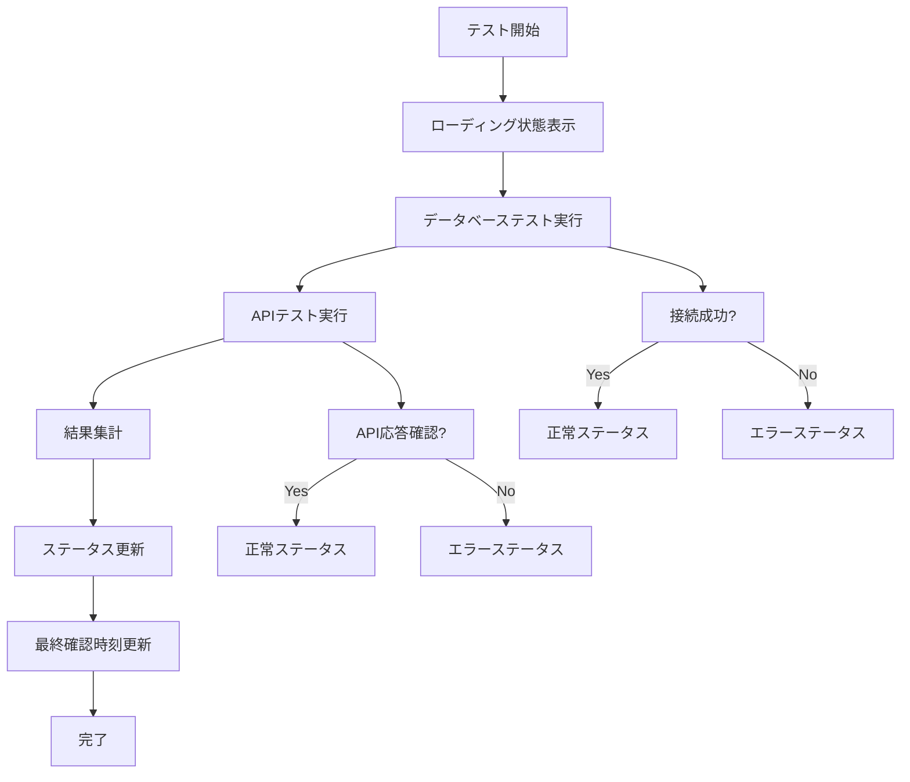

# システム監視設計書

## 概要

株価データ取得システムのシステム監視機能の設計仕様書です。
マイルストン3のUI/UX改善・バグ修正において、システム状態の可視化と接続テスト機能を実装します。

## 目次

- [システム監視設計書](#システム監視設計書)
  - [概要](#概要)
  - [目次](#目次)
  - [1. 基本方針](#1-基本方針)
    - [1.1 設計理念](#11-設計理念)
    - [1.2 監視対象](#12-監視対象)
  - [2. 監視機能設計](#2-監視機能設計)
    - [2.1 システム状態監視](#21-システム状態監視)
    - [2.2 接続テスト機能](#22-接続テスト機能)
    - [2.3 リアルタイム監視](#23-リアルタイム監視)
  - [3. UI/UX設計](#3-uiux設計)
    - [3.1 システム状態表示](#31-システム状態表示)
    - [3.2 ステータスインジケータ](#32-ステータスインジケータ)
    - [3.3 操作コントロール](#33-操作コントロール)
  - [4. API設計](#4-api設計)
    - [4.1 接続テストAPI](#41-接続テストapi)
    - [4.2 システム状態API](#42-システム状態api)
    - [4.3 監視データAPI](#43-監視データapi)
  - [5. 実装仕様](#5-実装仕様)
    - [5.1 フロントエンド実装](#51-フロントエンド実装)
    - [5.2 バックエンド実装](#52-バックエンド実装)
    - [5.3 エラーハンドリング](#53-エラーハンドリング)
  - [6. テスト仕様](#6-テスト仕様)
    - [6.1 接続テスト項目](#61-接続テスト項目)
    - [6.2 状態監視テスト](#62-状態監視テスト)
    - [6.3 UI動作テスト](#63-ui動作テスト)
  - [7. 運用考慮事項](#7-運用考慮事項)
    - [7.1 監視間隔](#71-監視間隔)
    - [7.2 アラート設定](#72-アラート設定)
    - [7.3 ログ管理](#73-ログ管理)

## 1. 基本方針

### 1.1 設計理念

- **リアルタイム可視化**: システム状態を即座に把握可能
- **シンプルな操作**: ワンクリックでの接続テスト実行
- **直感的な表示**: 色分けによる状態の視覚的理解
- **運用効率化**: 問題の早期発見と対応支援

### 1.2 監視対象

| 監視項目 | 重要度 | 説明 |
|----------|--------|------|
| **データベース接続** | 高 | PostgreSQL接続状態 |
| **Yahoo Finance API** | 高 | 外部API接続状態 |
| **システム稼働状況** | 中 | 全体的なシステム健全性 |
| **メモリ使用量** | 低 | アプリケーションリソース監視（将来実装） |
| **ディスク容量** | 低 | ストレージ監視（将来実装） |

## 2. 監視機能設計

### 2.1 システム状態監視

#### 2.1.1 状態レベル定義

```javascript
const StatusLevel = {
  HEALTHY: {
    level: 'healthy',
    color: '#10b981',
    backgroundColor: '#dcfce7',
    label: '正常',
    icon: '✅'
  },
  WARNING: {
    level: 'warning',
    color: '#f59e0b',
    backgroundColor: '#fef3c7',
    label: '警告',
    icon: '⚠️'
  },
  ERROR: {
    level: 'error',
    color: '#ef4444',
    backgroundColor: '#fee2e2',
    label: 'エラー',
    icon: '❌'
  },
  UNKNOWN: {
    level: 'unknown',
    color: '#6b7280',
    backgroundColor: '#f3f4f6',
    label: '確認中',
    icon: '❓'
  }
};
```

#### 2.1.2 監視項目詳細

##### データベース接続監視
```javascript
const DatabaseMonitor = {
  // 接続テスト実行
  testConnection: async function() {
    try {
      const startTime = Date.now();
      const response = await fetch('/api/system/db-connection-test', {
        method: 'POST',
        headers: { 'Content-Type': 'application/json' }
      });
      const endTime = Date.now();
      const responseTime = endTime - startTime;

      const result = await response.json();

      return {
        success: result.success,
        responseTime: responseTime,
        message: result.message,
        details: {
          host: result.host,
          database: result.database,
          connectionCount: result.connectionCount
        }
      };
    } catch (error) {
      return {
        success: false,
        error: error.message,
        responseTime: null
      };
    }
  }
};
```

##### Yahoo Finance API監視
```javascript
const ApiMonitor = {
  testConnection: async function(symbol = '7203.T') {
    try {
      const startTime = Date.now();
      const response = await fetch('/api/system/api-connection-test', {
        method: 'POST',
        headers: { 'Content-Type': 'application/json' },
        body: JSON.stringify({ symbol })
      });
      const endTime = Date.now();
      const responseTime = endTime - startTime;

      const result = await response.json();

      return {
        success: result.success,
        responseTime: responseTime,
        message: result.message,
        details: {
          symbol: symbol,
          dataPoints: result.dataPoints,
          lastUpdate: result.lastUpdate
        }
      };
    } catch (error) {
      return {
        success: false,
        error: error.message,
        responseTime: null
      };
    }
  }
};
```

### 2.2 接続テスト機能

#### 2.2.1 テスト実行フロー



#### 2.2.2 テスト項目

##### データベーステスト
- **接続確認**: PostgreSQL接続の成功/失敗
- **応答時間**: 接続確立までの時間
- **接続数**: 現在のアクティブ接続数
- **テーブル存在確認**: `stocks_daily`テーブルの存在確認

##### APIテスト
- **外部API接続**: Yahoo Finance APIへのアクセス確認
- **データ取得**: サンプル銘柄（7203.T）のデータ取得
- **応答時間**: API応答時間の測定
- **データ形式**: 返却データの形式確認

### 2.3 リアルタイム監視

#### 2.3.1 自動監視機能

```javascript
const AutoMonitor = {
  interval: 300000, // 5分間隔
  isRunning: false,

  start: function() {
    if (this.isRunning) return;

    this.isRunning = true;
    this.intervalId = setInterval(() => {
      this.runHealthCheck();
    }, this.interval);

    // 初回実行
    this.runHealthCheck();
  },

  stop: function() {
    if (this.intervalId) {
      clearInterval(this.intervalId);
      this.intervalId = null;
    }
    this.isRunning = false;
  },

  runHealthCheck: async function() {
    try {
      const [dbResult, apiResult] = await Promise.all([
        DatabaseMonitor.testConnection(),
        ApiMonitor.testConnection()
      ]);

      SystemStatus.updateStatus('database', dbResult);
      SystemStatus.updateStatus('api', apiResult);
      SystemStatus.updateOverallStatus();

    } catch (error) {
      console.error('Auto monitor error:', error);
    }
  }
};
```

## 3. UI/UX設計

### 3.1 システム状態表示

#### 3.1.1 レイアウト構成

```html
<!-- システム状態セクション -->
<section id="system-status" class="card system-status-section">
  <header class="card-header">
    <h2 class="card-title">システム状態</h2>
    <div class="header-actions">
      <button type="button" id="auto-monitor-toggle" class="btn btn-outline-secondary btn-sm">
        <span class="auto-monitor-icon">🔄</span>
        <span class="auto-monitor-text">自動監視: OFF</span>
      </button>
      <button type="button" id="refresh-status-btn" class="btn btn-primary btn-sm">
        <span class="refresh-icon">🔄</span>
        手動更新
      </button>
    </div>
  </header>

  <div class="card-body">
    <!-- システム全体ステータス -->
    <div class="overall-status">
      <div class="status-summary">
        <div class="status-icon-large" id="overall-status-icon">❓</div>
        <div class="status-info">
          <h3 id="overall-status-text">システム状態確認中</h3>
          <p class="status-description" id="overall-status-description">
            システムの接続状態を確認しています...
          </p>
        </div>
      </div>
      <div class="last-check-info">
        <small class="text-muted">
          最終確認: <span id="last-check-time">未確認</span>
        </small>
      </div>
    </div>

    <!-- 個別監視項目 -->
    <div class="monitoring-items">
      <!-- データベース監視 -->
      <div class="status-item" id="db-monitoring">
        <div class="status-header">
          <div class="status-label-group">
            <span class="status-icon" id="db-status-icon">❓</span>
            <span class="status-label">データベース接続</span>
          </div>
          <span id="db-status" class="status-indicator status-unknown">確認中</span>
        </div>
        <div class="status-details" id="db-status-details" style="display: none;">
          <div class="detail-item">
            <span class="detail-label">応答時間:</span>
            <span id="db-response-time">-</span>
          </div>
          <div class="detail-item">
            <span class="detail-label">接続数:</span>
            <span id="db-connection-count">-</span>
          </div>
        </div>
        <div class="status-actions">
          <button type="button" id="test-db-connection-btn" class="btn btn-outline-secondary btn-sm">
            接続テスト実行
          </button>
          <button type="button" class="btn btn-link btn-sm toggle-details" data-target="db-status-details">
            詳細表示
          </button>
        </div>
      </div>

      <!-- Yahoo Finance API監視 -->
      <div class="status-item" id="api-monitoring">
        <div class="status-header">
          <div class="status-label-group">
            <span class="status-icon" id="api-status-icon">❓</span>
            <span class="status-label">Yahoo Finance API</span>
          </div>
          <span id="api-status" class="status-indicator status-unknown">確認中</span>
        </div>
        <div class="status-details" id="api-status-details" style="display: none;">
          <div class="detail-item">
            <span class="detail-label">応答時間:</span>
            <span id="api-response-time">-</span>
          </div>
          <div class="detail-item">
            <span class="detail-label">テスト銘柄:</span>
            <span id="api-test-symbol">7203.T</span>
          </div>
        </div>
        <div class="status-actions">
          <button type="button" id="test-api-connection-btn" class="btn btn-outline-secondary btn-sm">
            API テスト実行
          </button>
          <button type="button" class="btn btn-link btn-sm toggle-details" data-target="api-status-details">
            詳細表示
          </button>
        </div>
      </div>
    </div>
  </div>
</section>
```

### 3.2 ステータスインジケータ

#### 3.2.1 CSS実装

```css
/* システム状態表示 */
.system-status-section {
  margin-bottom: 2rem;
}

.system-status-section .card-header {
  display: flex;
  justify-content: space-between;
  align-items: center;
  background: linear-gradient(135deg, #f8fafc 0%, #e2e8f0 100%);
  border-bottom: 2px solid var(--border-color);
}

.header-actions {
  display: flex;
  gap: 0.5rem;
}

/* システム全体ステータス */
.overall-status {
  background: #fafafa;
  border-radius: 8px;
  padding: 1.5rem;
  margin-bottom: 1.5rem;
  border: 1px solid var(--border-color);
}

.status-summary {
  display: flex;
  align-items: center;
  gap: 1rem;
  margin-bottom: 0.5rem;
}

.status-icon-large {
  font-size: 2.5rem;
  line-height: 1;
}

.status-info h3 {
  margin: 0 0 0.25rem 0;
  font-size: 1.25rem;
  font-weight: 600;
}

.status-description {
  margin: 0;
  color: var(--text-secondary);
  font-size: 0.9rem;
}

.last-check-info {
  text-align: right;
}

/* 監視項目 */
.monitoring-items {
  display: flex;
  flex-direction: column;
  gap: 1rem;
}

.status-item {
  background: var(--background);
  border: 1px solid var(--border-color);
  border-radius: 8px;
  padding: 1rem;
  transition: box-shadow 0.2s ease;
}

.status-item:hover {
  box-shadow: 0 2px 8px rgba(0, 0, 0, 0.1);
}

.status-header {
  display: flex;
  justify-content: space-between;
  align-items: center;
  margin-bottom: 0.75rem;
}

.status-label-group {
  display: flex;
  align-items: center;
  gap: 0.5rem;
}

.status-icon {
  font-size: 1.25rem;
}

.status-label {
  font-weight: 500;
  color: var(--text-primary);
  font-size: 1rem;
}

/* ステータスインジケータ */
.status-indicator {
  padding: 0.375rem 0.75rem;
  border-radius: 20px;
  font-size: 0.875rem;
  font-weight: 500;
  display: inline-flex;
  align-items: center;
  gap: 0.25rem;
}

.status-indicator.status-healthy {
  background-color: #dcfce7;
  color: #166534;
  border: 1px solid #bbf7d0;
}

.status-indicator.status-warning {
  background-color: #fef3c7;
  color: #92400e;
  border: 1px solid #fde68a;
}

.status-indicator.status-error {
  background-color: #fee2e2;
  color: #991b1b;
  border: 1px solid #fecaca;
}

.status-indicator.status-unknown {
  background-color: #f3f4f6;
  color: #374151;
  border: 1px solid #d1d5db;
}

/* 詳細情報 */
.status-details {
  background: #f8fafc;
  border-radius: 6px;
  padding: 0.75rem;
  margin: 0.75rem 0;
  border: 1px solid #e2e8f0;
}

.detail-item {
  display: flex;
  justify-content: space-between;
  margin-bottom: 0.25rem;
}

.detail-item:last-child {
  margin-bottom: 0;
}

.detail-label {
  font-weight: 500;
  color: var(--text-secondary);
  font-size: 0.875rem;
}

/* アクション */
.status-actions {
  display: flex;
  gap: 0.5rem;
  align-items: center;
}

.auto-monitor-icon {
  transition: transform 0.3s ease;
}

.auto-monitor-active .auto-monitor-icon {
  animation: spin 2s linear infinite;
}

@keyframes spin {
  from { transform: rotate(0deg); }
  to { transform: rotate(360deg); }
}

/* レスポンシブ対応 */
@media (max-width: 768px) {
  .system-status-section .card-header {
    flex-direction: column;
    gap: 1rem;
    align-items: stretch;
  }

  .header-actions {
    justify-content: center;
  }

  .status-summary {
    flex-direction: column;
    text-align: center;
  }

  .status-header {
    flex-direction: column;
    align-items: stretch;
    gap: 0.5rem;
  }

  .status-actions {
    justify-content: center;
    flex-wrap: wrap;
  }
}
```

## 4. API設計

### 4.1 接続テストAPI

#### 4.1.1 データベース接続テスト

```python
# app/api/system.py

@app.route('/api/system/db-connection-test', methods=['POST'])
def test_database_connection():
    """
    データベース接続テストを実行
    """
    try:
        start_time = time.time()

        # データベース接続テスト
        with get_db_session() as session:
            # 基本接続確認
            result = session.execute(text("SELECT 1")).fetchone()

            # テーブル存在確認
            table_check = session.execute(
                text("SELECT COUNT(*) FROM information_schema.tables WHERE table_name = 'stocks_daily'")
            ).fetchone()

            # 接続数確認
            connection_count = session.execute(
                text("SELECT COUNT(*) FROM pg_stat_activity WHERE state = 'active'")
            ).fetchone()

        end_time = time.time()
        response_time = round((end_time - start_time) * 1000, 2)  # ミリ秒

        return jsonify({
            'success': True,
            'message': 'データベース接続正常',
            'responseTime': response_time,
            'details': {
                'host': app.config.get('DB_HOST', 'localhost'),
                'database': app.config.get('DB_NAME', 'stock_db'),
                'tableExists': table_check[0] > 0,
                'connectionCount': connection_count[0] if connection_count else 0
            },
            'timestamp': datetime.now().isoformat()
        })

    except Exception as e:
        return jsonify({
            'success': False,
            'message': f'データベース接続エラー: {str(e)}',
            'error': str(e),
            'timestamp': datetime.now().isoformat()
        }), 500
```

#### 4.1.2 API接続テスト

```python
@app.route('/api/system/api-connection-test', methods=['POST'])
def test_api_connection():
    """
    Yahoo Finance API接続テストを実行
    """
    try:
        data = request.get_json()
        test_symbol = data.get('symbol', '7203.T')

        start_time = time.time()

        # Yahoo Finance APIテスト
        import yfinance as yf
        ticker = yf.Ticker(test_symbol)

        # 基本情報取得テスト
        info = ticker.info

        # 直近データ取得テスト
        hist = ticker.history(period="1d")

        end_time = time.time()
        response_time = round((end_time - start_time) * 1000, 2)  # ミリ秒

        if hist.empty:
            raise Exception("データが取得できませんでした")

        return jsonify({
            'success': True,
            'message': 'Yahoo Finance API接続正常',
            'responseTime': response_time,
            'details': {
                'symbol': test_symbol,
                'dataPoints': len(hist),
                'lastUpdate': hist.index[-1].strftime('%Y-%m-%d') if not hist.empty else None,
                'companyName': info.get('longName', 'N/A')
            },
            'timestamp': datetime.now().isoformat()
        })

    except Exception as e:
        return jsonify({
            'success': False,
            'message': f'API接続エラー: {str(e)}',
            'error': str(e),
            'timestamp': datetime.now().isoformat()
        }), 500
```

### 4.2 システム状態API

#### 4.2.1 統合ヘルスチェック

```python
@app.route('/api/system/health-check', methods=['GET'])
def system_health_check():
    """
    システム全体のヘルスチェック
    """
    try:
        health_status = {
            'overall': 'healthy',
            'timestamp': datetime.now().isoformat(),
            'services': {}
        }

        # データベースチェック
        try:
            with get_db_session() as session:
                session.execute(text("SELECT 1"))
            health_status['services']['database'] = {
                'status': 'healthy',
                'message': '接続正常'
            }
        except Exception as e:
            health_status['services']['database'] = {
                'status': 'error',
                'message': f'接続エラー: {str(e)}'
            }
            health_status['overall'] = 'error'

        # API接続チェック
        try:
            import yfinance as yf
            ticker = yf.Ticker('7203.T')
            hist = ticker.history(period="1d")
            if not hist.empty:
                health_status['services']['api'] = {
                    'status': 'healthy',
                    'message': 'API接続正常'
                }
            else:
                health_status['services']['api'] = {
                    'status': 'warning',
                    'message': 'データ取得できず'
                }
                if health_status['overall'] == 'healthy':
                    health_status['overall'] = 'warning'
        except Exception as e:
            health_status['services']['api'] = {
                'status': 'error',
                'message': f'API接続エラー: {str(e)}'
            }
            health_status['overall'] = 'error'

        return jsonify(health_status)

    except Exception as e:
        return jsonify({
            'overall': 'error',
            'message': f'ヘルスチェック実行エラー: {str(e)}',
            'timestamp': datetime.now().isoformat()
        }), 500
```

## 5. 実装仕様

### 5.1 フロントエンド実装

#### 5.1.1 システム状態管理クラス

```javascript
// static/js/system-monitor.js

class SystemMonitor {
  constructor() {
    this.autoMonitorInterval = null;
    this.autoMonitorEnabled = false;
    this.lastCheckTime = null;

    this.initializeEventListeners();
    this.loadInitialStatus();
  }

  initializeEventListeners() {
    // 手動更新ボタン
    document.getElementById('refresh-status-btn')?.addEventListener('click', () => {
      this.runFullHealthCheck();
    });

    // 自動監視切り替え
    document.getElementById('auto-monitor-toggle')?.addEventListener('click', () => {
      this.toggleAutoMonitor();
    });

    // 個別テストボタン
    document.getElementById('test-db-connection-btn')?.addEventListener('click', () => {
      this.testDatabaseConnection();
    });

    document.getElementById('test-api-connection-btn')?.addEventListener('click', () => {
      this.testApiConnection();
    });

    // 詳細表示切り替え
    document.querySelectorAll('.toggle-details').forEach(btn => {
      btn.addEventListener('click', (e) => {
        const targetId = e.target.dataset.target;
        this.toggleDetails(targetId);
      });
    });
  }

  async loadInitialStatus() {
    await this.runFullHealthCheck();
  }

  async runFullHealthCheck() {
    try {
      this.showLoading();

      const [dbResult, apiResult] = await Promise.all([
        this.testDatabaseConnection(),
        this.testApiConnection()
      ]);

      this.updateOverallStatus(dbResult, apiResult);
      this.updateLastCheckTime();

    } catch (error) {
      console.error('Health check error:', error);
      this.showError('システム状態の確認中にエラーが発生しました');
    } finally {
      this.hideLoading();
    }
  }

  async testDatabaseConnection() {
    try {
      const response = await fetch('/api/system/db-connection-test', {
        method: 'POST',
        headers: { 'Content-Type': 'application/json' }
      });

      const result = await response.json();
      this.updateDatabaseStatus(result);
      return result;

    } catch (error) {
      const errorResult = {
        success: false,
        message: `接続エラー: ${error.message}`,
        error: error.message
      };
      this.updateDatabaseStatus(errorResult);
      return errorResult;
    }
  }

  async testApiConnection() {
    try {
      const response = await fetch('/api/system/api-connection-test', {
        method: 'POST',
        headers: { 'Content-Type': 'application/json' },
        body: JSON.stringify({ symbol: '7203.T' })
      });

      const result = await response.json();
      this.updateApiStatus(result);
      return result;

    } catch (error) {
      const errorResult = {
        success: false,
        message: `API接続エラー: ${error.message}`,
        error: error.message
      };
      this.updateApiStatus(errorResult);
      return errorResult;
    }
  }

  updateDatabaseStatus(result) {
    const statusElement = document.getElementById('db-status');
    const iconElement = document.getElementById('db-status-icon');
    const responseTimeElement = document.getElementById('db-response-time');
    const connectionCountElement = document.getElementById('db-connection-count');

    if (result.success) {
      this.setStatusIndicator(statusElement, 'healthy', '正常');
      iconElement.textContent = '✅';

      if (result.responseTime) {
        responseTimeElement.textContent = `${result.responseTime}ms`;
      }

      if (result.details?.connectionCount !== undefined) {
        connectionCountElement.textContent = `${result.details.connectionCount}個`;
      }
    } else {
      this.setStatusIndicator(statusElement, 'error', 'エラー');
      iconElement.textContent = '❌';
      responseTimeElement.textContent = '-';
      connectionCountElement.textContent = '-';
    }
  }

  updateApiStatus(result) {
    const statusElement = document.getElementById('api-status');
    const iconElement = document.getElementById('api-status-icon');
    const responseTimeElement = document.getElementById('api-response-time');
    const testSymbolElement = document.getElementById('api-test-symbol');

    if (result.success) {
      this.setStatusIndicator(statusElement, 'healthy', '正常');
      iconElement.textContent = '✅';

      if (result.responseTime) {
        responseTimeElement.textContent = `${result.responseTime}ms`;
      }

      if (result.details?.symbol) {
        testSymbolElement.textContent = result.details.symbol;
      }
    } else {
      this.setStatusIndicator(statusElement, 'error', 'エラー');
      iconElement.textContent = '❌';
      responseTimeElement.textContent = '-';
    }
  }

  updateOverallStatus(dbResult, apiResult) {
    const iconElement = document.getElementById('overall-status-icon');
    const textElement = document.getElementById('overall-status-text');
    const descriptionElement = document.getElementById('overall-status-description');

    const dbHealthy = dbResult?.success ?? false;
    const apiHealthy = apiResult?.success ?? false;

    if (dbHealthy && apiHealthy) {
      iconElement.textContent = '✅';
      textElement.textContent = 'システム正常稼働中';
      descriptionElement.textContent = 'すべてのサービスが正常に動作しています。';
      textElement.style.color = '#166534';
    } else if (dbHealthy || apiHealthy) {
      iconElement.textContent = '⚠️';
      textElement.textContent = 'システム部分稼働中';
      descriptionElement.textContent = '一部のサービスに問題があります。';
      textElement.style.color = '#92400e';
    } else {
      iconElement.textContent = '❌';
      textElement.textContent = 'システム障害発生';
      descriptionElement.textContent = '複数のサービスで問題が発生しています。';
      textElement.style.color = '#991b1b';
    }
  }

  setStatusIndicator(element, status, text) {
    if (!element) return;

    // クラスリセット
    element.className = 'status-indicator';

    // 新しいステータス設定
    element.classList.add(`status-${status}`);
    element.textContent = text;
  }

  toggleAutoMonitor() {
    if (this.autoMonitorEnabled) {
      this.stopAutoMonitor();
    } else {
      this.startAutoMonitor();
    }
  }

  startAutoMonitor() {
    this.autoMonitorEnabled = true;
    this.autoMonitorInterval = setInterval(() => {
      this.runFullHealthCheck();
    }, 300000); // 5分間隔

    const toggleBtn = document.getElementById('auto-monitor-toggle');
    const textElement = toggleBtn.querySelector('.auto-monitor-text');

    toggleBtn.classList.add('auto-monitor-active');
    textElement.textContent = '自動監視: ON';

    // 初回実行
    this.runFullHealthCheck();
  }

  stopAutoMonitor() {
    this.autoMonitorEnabled = false;

    if (this.autoMonitorInterval) {
      clearInterval(this.autoMonitorInterval);
      this.autoMonitorInterval = null;
    }

    const toggleBtn = document.getElementById('auto-monitor-toggle');
    const textElement = toggleBtn.querySelector('.auto-monitor-text');

    toggleBtn.classList.remove('auto-monitor-active');
    textElement.textContent = '自動監視: OFF';
  }

  updateLastCheckTime() {
    const element = document.getElementById('last-check-time');
    if (element) {
      this.lastCheckTime = new Date();
      element.textContent = this.lastCheckTime.toLocaleString('ja-JP');
    }
  }

  toggleDetails(targetId) {
    const element = document.getElementById(targetId);
    if (element) {
      const isVisible = element.style.display !== 'none';
      element.style.display = isVisible ? 'none' : 'block';

      const button = document.querySelector(`[data-target="${targetId}"]`);
      if (button) {
        button.textContent = isVisible ? '詳細表示' : '詳細非表示';
      }
    }
  }

  showLoading() {
    const refreshBtn = document.getElementById('refresh-status-btn');
    if (refreshBtn) {
      refreshBtn.disabled = true;
      refreshBtn.innerHTML = '<span class="refresh-icon">⏳</span> 確認中...';
    }
  }

  hideLoading() {
    const refreshBtn = document.getElementById('refresh-status-btn');
    if (refreshBtn) {
      refreshBtn.disabled = false;
      refreshBtn.innerHTML = '<span class="refresh-icon">🔄</span> 手動更新';
    }
  }

  showError(message) {
    // エラートースト表示（ErrorHandlerクラスを使用）
    if (window.ErrorHandler) {
      window.ErrorHandler.showError(message);
    } else {
      alert(message);
    }
  }
}

// 初期化
document.addEventListener('DOMContentLoaded', function() {
  window.systemMonitor = new SystemMonitor();
});
```

## 6. テスト仕様

### 6.1 接続テスト項目

#### 6.1.1 データベーステスト
- [ ] PostgreSQL接続確認
- [ ] 接続応答時間測定
- [ ] テーブル存在確認（stocks_daily）
- [ ] アクティブ接続数取得
- [ ] 接続エラー時の適切なエラー表示

#### 6.1.2 APIテスト
- [ ] Yahoo Finance API接続確認
- [ ] テスト銘柄（7203.T）データ取得
- [ ] API応答時間測定
- [ ] データ形式検証
- [ ] API エラー時の適切なエラー表示

### 6.2 状態監視テスト

#### 6.2.1 UI動作テスト
- [ ] システム状態の正確な表示
- [ ] ステータスインジケータの色分け
- [ ] 手動更新ボタンの動作
- [ ] 自動監視機能の開始/停止
- [ ] 詳細情報の表示/非表示切り替え

#### 6.2.2 レスポンシブテスト
- [ ] モバイル表示での適切なレイアウト
- [ ] タブレット表示での操作性確認
- [ ] デスクトップ表示での情報表示

## 7. 運用考慮事項

### 7.1 監視間隔

- **自動監視**: 5分間隔（設定可能）
- **手動更新**: ユーザー操作によるリアルタイム確認
- **初期読み込み**: ページアクセス時の即座確認

### 7.2 アラート設定

将来実装予定：
- **エラー状態継続時**: 3回連続エラーでアラート
- **応答時間劣化**: 平均応答時間の2倍を超えた場合
- **サービス復旧**: エラー状態からの復旧通知

### 7.3 ログ管理

将来実装予定：
- **接続テスト履歴**: 過去24時間の接続テスト結果
- **エラーログ**: 詳細なエラー情報の記録
- **パフォーマンスログ**: 応答時間の推移記録

---

この設計書に基づいて、マイルストン3のシステム監視機能を実装し、ユーザーがシステム状態を即座に把握できる環境を提供します。