# 【Phase 2 計画書】API層リファクタリング

> **📋 ドキュメント種別**: リファクタリング詳細計画書
> **🎯 Phase**: Phase 2
> **📅 実施期間**: 2025年4月28日 ～ 2025年5月11日（2週間）
> **👥 対象読者**: API開発者、バックエンド開発者
> **⚠️ 優先度**: 🟠 High
> **⚡ 依存関係**: Phase 1（サービス層）完了後に開始

## 目次

- [1. 概要](#1-概要)
- [2. 現状の課題](#2-現状の課題)
- [3. リファクタリング方針](#3-リファクタリング方針)
- [4. リファクタリング後のアーキテクチャ](#4-リファクタリング後のアーキテクチャ)
- [5. 具体的な改善項目](#5-具体的な改善項目)
- [6. 型定義戦略](#6-型定義戦略)
- [7. 実装計画](#7-実装計画)
- [8. 期待される効果](#8-期待される効果)

---

## 1. 概要

### 目的

現在のAPI層は機能的には動作していますが、以下の観点から改善の余地があります：

- **保守性の向上**: コードの可読性と保守性を向上
- **テスタビリティの向上**: 単体テストが書きやすい構造に変更
- **拡張性の向上**: 新機能追加時の影響範囲を最小化
- **品質の向上**: エラーハンドリングとバリデーションの一貫性を確保

### 対象範囲

```
app/api/
├── bulk_data.py           # バルクデータAPI（最優先）
├── stock_master.py        # 銘柄マスタAPI（優先）
├── system_monitoring.py   # システム監視API（低優先）
└── swagger.py             # Swagger UI（対象外）
```

---

## 2. 現状の課題

### 2.1 コードの複雑性

#### 問題点

**bulk_data.py**の肥大化:
- 約650行のコード（大きすぎる）
- 複数の責務が混在（ルーティング、ビジネスロジック、ジョブ管理、WebSocket通信）
- プライベート関数（`_run_job`, `_update_phase1_progress`など）が多数

**具体例**:
```python
# 130行の巨大な関数
def start_bulk_fetch():
    # バリデーション
    # ジョブID生成
    # Phase 1設定
    # Phase 2設定
    # スレッド起動
    # レスポンス生成
    ...
```

#### 影響

- 可読性の低下
- テストの困難性
- バグの混入リスク増加

### 2.2 バリデーション処理の重複

#### 問題点

各エンドポイントで個別にバリデーション実装:

```python
# bulk_data.py
if not symbols or not isinstance(symbols, list) or not all(isinstance(s, str) for s in symbols):
    return jsonify({...}), 400

# stock_master.py
if limit_str:
    try:
        limit = int(limit_str)
        if limit < 1 or limit > 1000:
            return error("INVALID_PARAMETER", ...)
    except ValueError:
        return error("INVALID_PARAMETER", ...)
```

#### 影響

- コード重複
- バリデーションロジックの不統一
- メンテナンスコストの増加

### 2.3 エラーハンドリングの一貫性欠如

#### 問題点

**統一されていないエラーレスポンス**:

```python
# bulk_data.py
return jsonify({
    "success": False,
    "error": "VALIDATION_ERROR",
    "message": "..."
}), 400

# stock_master.py（APIResponse使用）
return APIResponse.error(
    error_code=ErrorCode.INVALID_PARAMETER,
    message="...",
    status_code=400
)
```

**例外処理の粒度がバラバラ**:
- `bulk_data.py`: 広範囲のtry-except
- `stock_master.py`: 細かいtry-except
- 一部のエンドポイント: 例外処理なし

#### 影響

- クライアント側での統一的なエラー処理が困難
- デバッグの難しさ

### 2.4 ジョブ管理ロジックの密結合

#### 問題点

**`bulk_data.py`内にジョブ管理が混在**:

```python
JOBS = {}  # グローバル辞書

def _run_job(...):
    # 200行以上のジョブ実行ロジック
    ...

def _update_phase1_progress(job_id, processed, successful, failed):
    # JOBS辞書を直接操作
    ...
```

**WebSocket通信との密結合**:
```python
def _send_websocket_progress(job_id, progress):
    socketio.emit('job_progress', {...})
```

#### 影響

- 単体テストが書けない
- ジョブ管理の再利用性がない
- 並行処理のバグが発生しやすい

### 2.5 認証・認可ロジックの重複

#### 問題点

各Blueprintファイルに`require_api_key`と`rate_limit`が定義:

```python
# bulk_data.py
def require_api_key(func):
    @wraps(func)
    def wrapper(*args, **kwargs):
        ...

# stock_master.py
def require_api_key(func):
    @wraps(func)
    def wrapper(*args, **kwargs):
        ...
```

#### 影響

- コード重複（DRY原則違反）
- 認証ロジック変更時の修正箇所増加

### 2.6 ビジネスロジックの混在

#### 問題点

API層でビジネスロジックを実装:

```python
# bulk_data.py内で並列処理とデータ保存を直接実装
def _run_job(app, job_id, symbols, interval, period, batch_db_id):
    with app.app_context():
        bulk_service = get_bulk_service()
        results = bulk_service.fetch_multiple_stocks(...)
        # さらにPhase 2処理、WebSocket通知など...
```

#### 影響

- 関心の分離原則（SoC）違反
- サービス層との責務が不明瞭

### 2.7 テストが困難

#### 問題点

- グローバル変数（`JOBS`, `_RATE_BUCKETS`）への依存
- 外部サービス（DB、WebSocket）との密結合
- 巨大な関数のため、テストケースが書きにくい

#### 影響

- テストカバレッジが低い
- リグレッションリスクが高い

---

## 3. リファクタリング方針

### 3.1 設計原則

| 原則 | 適用方法 |
|------|---------|
| **Single Responsibility** | 1つの関数/クラスは1つの責務のみ |
| **Open/Closed** | 拡張に開き、修正に閉じた設計 |
| **Dependency Inversion** | 抽象に依存し、具体に依存しない |
| **DRY** | コード重複を排除 |
| **YAGNI** | 今必要なもののみ実装 |

### 3.2 段階的アプローチ

#### Phase 1: 基盤整備（優先度：高）

1. 共通ユーティリティの抽出
2. バリデーション層の統一
3. エラーハンドリングの統一

#### Phase 2: 構造改善（優先度：中）

4. ジョブ管理の分離
5. 認証・認可の共通化
6. ビジネスロジックのサービス層移行

#### Phase 3: 高度化（優先度：低）

7. DIコンテナの導入検討
8. 非同期処理の改善

### 3.3 後方互換性の保証

- 既存のエンドポイントURLは変更しない
- レスポンス形式は維持
- 段階的リファクタリングで既存機能を維持

---

## 4. リファクタリング後のアーキテクチャ

### 4.1 全体構成図

#### Before: 現在の構成

```mermaid
graph TB
    subgraph "API層（肥大化）"
        BulkAPI[bulk_data.py<br/>650行]
        StockAPI[stock_master.py<br/>200行]
        SystemAPI[system_monitoring.py<br/>100行]
    end

    subgraph "サービス層"
        BulkService[BulkDataService]
        JPXService[JPXStockService]
        BatchService[BatchService]
    end

    subgraph "データアクセス層"
        DB[(PostgreSQL)]
    end

    BulkAPI -->|直接呼び出し| BulkService
    BulkAPI -->|直接呼び出し| JPXService
    BulkAPI -->|直接呼び出し| BatchService
    BulkAPI -->|グローバル変数| JOBS[JOBS辞書]
    BulkAPI -->|直接通信| WebSocket[WebSocket]

    StockAPI -->|直接呼び出し| JPXService
    SystemAPI -->|直接呼び出し| BulkService

    BulkService --> DB
    JPXService --> DB
    BatchService --> DB

    style BulkAPI fill:#ffcccc
    style JOBS fill:#ffcccc
    style WebSocket fill:#ffcccc
```



**問題点**:
- API層が肥大化（bulk_data.pyが650行）
- 責務が混在（ルーティング + ビジネスロジック + ジョブ管理）
- グローバル変数への依存
- デコレータの重複実装
- テストが困難

#### After: リファクタリング後の構成

```mermaid
graph TB
    subgraph "API層（薄い層）"
        BulkAPI[bulk_data.py<br/>200行]
        StockAPI[stock_master.py<br/>150行]
        SystemAPI[system_monitoring.py<br/>80行]
    end

    subgraph "共通ユーティリティ"
        Decorators[Decorators<br/>auth.py<br/>rate_limit.py]
        Validators[Validators<br/>validators.py]
        ErrorHandlers[ErrorHandlers<br/>error_handlers.py]
        APIResponse[APIResponse<br/>api_response.py]
    end

    subgraph "サービス層（拡張）"
        JobManager[JobManager<br/>job_manager.py]
        JobExecutor[JobExecutor<br/>job_executor.py]
        NotificationService[NotificationService<br/>notification_service.py]
        BulkService[BulkDataService]
        JPXService[JPXStockService]
        BatchService[BatchService]
    end

    subgraph "データアクセス層"
        DB[(PostgreSQL)]
    end

    subgraph "外部サービス"
        WebSocket[WebSocket<br/>SocketIO]
    end

    BulkAPI --> Decorators
    BulkAPI --> Validators
    BulkAPI --> ErrorHandlers
    BulkAPI --> APIResponse
    BulkAPI --> JobManager
    BulkAPI --> JobExecutor

    StockAPI --> Decorators
    StockAPI --> Validators
    StockAPI --> ErrorHandlers
    StockAPI --> APIResponse

    SystemAPI --> Decorators
    SystemAPI --> ErrorHandlers
    SystemAPI --> APIResponse

    JobExecutor --> JobManager
    JobExecutor --> BulkService
    JobExecutor --> NotificationService
    JobExecutor --> BatchService

    JobManager -->|管理| JobState[Job State<br/>スレッドセーフ]
    NotificationService --> WebSocket

    BulkService --> DB
    JPXService --> DB
    BatchService --> DB

    style BulkAPI fill:#ccffcc
    style StockAPI fill:#ccffcc
    style SystemAPI fill:#ccffcc
    style Decorators fill:#cce5ff
    style Validators fill:#cce5ff
    style ErrorHandlers fill:#cce5ff
    style JobManager fill:#ffffcc
    style JobExecutor fill:#ffffcc
    style NotificationService fill:#ffffcc
```



**改善点**:
- API層が薄くシンプル（bulk_data.py: 650行 → 200行）
- 責務が明確に分離
- 共通ユーティリティで重複排除
- サービス層で適切にロジック管理
- テストが容易

### 4.2 リファクタリング後のクラス図

```mermaid
classDiagram
    %% API層
    class BulkDataAPI {
        +Blueprint bulk_api
        +start_bulk_fetch() tuple
        +get_job_status(job_id) tuple
        +stop_job(job_id) tuple
        +start_jpx_sequential() tuple
        +get_jpx_symbols() tuple
    }

    class StockMasterAPI {
        +Blueprint stock_master_api
        +update_stock_master() tuple
        +get_stock_master_list() tuple
        +get_stock_master_status() tuple
    }

    class SystemMonitoringAPI {
        +Blueprint system_api
        +health_check() tuple
    }

    %% 共通ユーティリティ
    class Decorators {
        <<utility>>
        +require_api_key(func) Callable
        +rate_limit(max_requests, window_seconds) Callable
    }

    class RateLimiter {
        -Dict _buckets
        -Dict _windows
        +is_allowed(max_requests, window_seconds) bool
        -_client_key() str
    }

    class Validators {
        <<utility>>
        +validate_symbols(symbols, max_count) tuple
        +validate_pagination(limit_str, offset_str, max_limit) tuple
        +validate_interval(interval) tuple
    }

    class ErrorHandlers {
        <<utility>>
        +register_error_handlers(blueprint) None
        +bad_request(error) tuple
        +unauthorized(error) tuple
        +not_found(error) tuple
        +rate_limit_exceeded(error) tuple
        +internal_error(error) tuple
        +handle_exception(error) tuple
    }

    class APIResponse {
        <<utility>>
        +success(data, message, meta, status_code) tuple
        +error(error_code, message, details, status_code) tuple
        +paginated(data, total, limit, offset, message) tuple
    }

    %% サービス層（新規）
    class JobManager {
        -Dict~str,Dict~ _jobs
        -Lock _lock
        +create_job(total_items, create_batch) tuple
        +get_job(job_id) Dict
        +update_progress(job_id, processed, successful, failed) None
        +mark_completed(job_id) None
        +mark_failed(job_id, error_message) None
        +mark_stopped(job_id) None
    }

    class JobExecutor {
        -Flask app
        -BulkDataService bulk_service
        -JobManager job_manager
        -NotificationService notification_service
        +execute_bulk_job(job_id, symbols, interval, period, batch_db_id) None
        +execute_jpx_sequential_job(job_id, symbols, batch_db_id) None
    }

    class NotificationService {
        -SocketIO socketio
        +send_progress(job_id, progress) None
        +send_completion(job_id) None
        +send_error(job_id, error_message) None
        +send_interval_notification(job_id, interval, stats) None
    }

    %% 既存サービス層
    class BulkDataService {
        <<service>>
        +fetch_multiple_stocks(symbols, interval, period, progress_callback) Dict
    }

    class JPXStockService {
        <<service>>
        +update_stock_master(update_type) Dict
        +get_stock_list(limit, offset, is_active, market_category) tuple
        +get_stock_master_status() Dict
    }

    class BatchService {
        <<service>>
        +create_batch(batch_type, total_stocks) Dict
        +get_batch(batch_id) Dict
        +update_batch(batch_id, status, processed_stocks, successful_stocks, failed_stocks) None
    }

    %% 関連
    BulkDataAPI --> Decorators : uses
    BulkDataAPI --> Validators : uses
    BulkDataAPI --> ErrorHandlers : uses
    BulkDataAPI --> APIResponse : uses
    BulkDataAPI --> JobManager : uses
    BulkDataAPI --> JobExecutor : uses

    StockMasterAPI --> Decorators : uses
    StockMasterAPI --> Validators : uses
    StockMasterAPI --> ErrorHandlers : uses
    StockMasterAPI --> APIResponse : uses
    StockMasterAPI --> JPXStockService : calls

    SystemMonitoringAPI --> Decorators : uses
    SystemMonitoringAPI --> ErrorHandlers : uses
    SystemMonitoringAPI --> APIResponse : uses

    Decorators --> RateLimiter : uses
    Decorators --> APIResponse : uses

    JobExecutor --> JobManager : uses
    JobExecutor --> BulkDataService : uses
    JobExecutor --> NotificationService : uses
    JobExecutor --> BatchService : uses

    ErrorHandlers --> APIResponse : uses
```



### 4.3 シーケンス図（リファクタリング後）

#### バルクデータ取得フロー

```mermaid
sequenceDiagram
    participant Client as クライアント
    participant BulkAPI as BulkDataAPI
    participant Validators as Validators
    participant JobMgr as JobManager
    participant JobExec as JobExecutor
    participant BulkSvc as BulkDataService
    participant NotifySvc as NotificationService
    participant BatchSvc as BatchService
    participant WebSocket as WebSocket

    Client->>BulkAPI: POST /api/bulk/jobs
    BulkAPI->>BulkAPI: @require_api_key
    BulkAPI->>BulkAPI: @rate_limit()

    BulkAPI->>Validators: validate_symbols(symbols)
    Validators-->>BulkAPI: (is_valid, error_response)

    alt バリデーションエラー
        BulkAPI-->>Client: 400 Bad Request
    end

    BulkAPI->>JobMgr: create_job(total_items, create_batch=True)
    JobMgr->>JobMgr: job_id生成
    JobMgr->>JobMgr: JOBS[job_id]作成（スレッドセーフ）

    alt Phase 2有効
        JobMgr->>BatchSvc: create_batch(batch_type, total_stocks)
        BatchSvc-->>JobMgr: batch_db_id
    end

    JobMgr-->>BulkAPI: (job_id, batch_db_id)

    BulkAPI->>JobExec: execute_bulk_job() (別スレッド起動)
    BulkAPI-->>Client: 202 Accepted<br/>{job_id, batch_db_id}

    Note over JobExec: バックグラウンド実行

    JobExec->>BulkSvc: fetch_multiple_stocks(symbols, interval, period, on_progress)

    loop 各銘柄処理
        BulkSvc->>BulkSvc: 並列データ取得・保存
        BulkSvc->>JobExec: progress_callback(processed, successful, failed)
        JobExec->>JobMgr: update_progress(job_id, ...)
        JobExec->>NotifySvc: send_progress(job_id, progress)
        NotifySvc->>WebSocket: emit('job_progress')
        WebSocket-->>Client: リアルタイム進捗
    end

    BulkSvc-->>JobExec: results

    alt Phase 2有効
        JobExec->>BatchSvc: update_batch(batch_id, status, ...)
    end

    JobExec->>JobMgr: mark_completed(job_id)
    JobExec->>NotifySvc: send_completion(job_id)
    NotifySvc->>WebSocket: emit('job_completed')
    WebSocket-->>Client: 完了通知
```



#### ジョブステータス取得フロー

```mermaid
sequenceDiagram
    participant Client as クライアント
    participant BulkAPI as BulkDataAPI
    participant JobMgr as JobManager
    participant BatchSvc as BatchService
    participant Response as APIResponse

    Client->>BulkAPI: GET /api/bulk/jobs/{job_id}
    BulkAPI->>BulkAPI: @require_api_key
    BulkAPI->>BulkAPI: @rate_limit()

    alt Phase 2 (job_idが数値)
        BulkAPI->>BatchSvc: get_batch(batch_db_id)
        BatchSvc-->>BulkAPI: batch_info
        BulkAPI->>BulkAPI: Phase 1形式に変換
    else Phase 1 (job_idが文字列)
        BulkAPI->>JobMgr: get_job(job_id)
        JobMgr->>JobMgr: _jobs.get(job_id) (スレッドセーフ)
        JobMgr-->>BulkAPI: job_info
    end

    alt ジョブが存在
        BulkAPI->>Response: jsonify(job)
        Response-->>Client: 200 OK<br/>{job: {...}}
    else ジョブが存在しない
        BulkAPI->>Response: error(NOT_FOUND, ...)
        Response-->>Client: 404 Not Found
    end
```



#### エラーハンドリングフロー

```mermaid
sequenceDiagram
    participant Client as クライアント
    participant BulkAPI as BulkDataAPI
    participant Validators as Validators
    participant ErrorHandler as ErrorHandlers
    participant Response as APIResponse

    Client->>BulkAPI: POST /api/bulk/jobs<br/>{invalid_data}

    BulkAPI->>Validators: validate_symbols(invalid_symbols)
    Validators->>Response: error(VALIDATION_ERROR, ...)
    Validators-->>BulkAPI: (False, error_response)

    BulkAPI-->>Client: 400 Bad Request<br/>{error: {...}}

    Note over Client,Response: 予期しない例外の場合

    Client->>BulkAPI: POST /api/bulk/jobs
    BulkAPI->>BulkAPI: 処理中に例外発生
    BulkAPI-->>ErrorHandler: Exception raised

    ErrorHandler->>ErrorHandler: handle_exception(error)
    ErrorHandler->>Response: error(INTERNAL_SERVER_ERROR, ...)
    ErrorHandler-->>Client: 500 Internal Server Error<br/>{error: {...}}
```



### 4.4 ディレクトリ構造（Before/After）

#### Before: 現在の構造

```
app/
├── api/
│   ├── __init__.py
│   ├── bulk_data.py              # 650行（肥大化）
│   │   ├── JOBS (グローバル変数)
│   │   ├── require_api_key (重複)
│   │   ├── rate_limit (重複)
│   │   ├── _run_job (200行)
│   │   ├── _update_phase1_progress
│   │   ├── _send_websocket_progress
│   │   └── エンドポイント関数群
│   │
│   ├── stock_master.py           # 200行
│   │   ├── require_api_key (重複)
│   │   ├── _validate_pagination_params (重複)
│   │   └── エンドポイント関数群
│   │
│   └── system_monitoring.py      # 100行
│       └── エンドポイント関数群
│
├── services/
│   ├── bulk_data_service.py
│   ├── jpx_stock_service.py
│   └── batch_service.py
│
└── utils/
    ├── api_response.py
    └── error_codes.py
```

#### After: リファクタリング後の構造

```
app/
├── api/
│   ├── __init__.py
│   ├── decorators/                # 新規（共通デコレータ）
│   │   ├── __init__.py
│   │   ├── auth.py                # require_api_key（統一）
│   │   └── rate_limit.py          # rate_limit（統一）+ RateLimiter
│   │
│   ├── error_handlers.py          # 新規（統一エラーハンドラ）
│   │
│   ├── bulk_data.py               # 200行（70%削減）
│   │   └── エンドポイント関数群のみ
│   │
│   ├── stock_master.py            # 150行（25%削減）
│   │   └── エンドポイント関数群のみ
│   │
│   └── system_monitoring.py       # 80行（20%削減）
│       └── エンドポイント関数群のみ
│
├── services/
│   ├── job_manager.py             # 新規（ジョブライフサイクル管理）
│   ├── job_executor.py            # 新規（ジョブ実行ロジック）
│   ├── notification_service.py    # 新規（WebSocket通知）
│   ├── bulk_data_service.py
│   ├── jpx_stock_service.py
│   └── batch_service.py
│
└── utils/
    ├── validators.py              # 新規（共通バリデーション）
    ├── api_response.py
    └── error_codes.py
```

**主な変更点**:
- API層: 650行 → 430行（**34%削減**）
- 新規ファイル: 5ファイル追加
- 責務の明確化: API層 / サービス層 / ユーティリティ層

### 4.5 依存関係図

```mermaid
graph LR
    subgraph "API層"
        A1[bulk_data.py]
        A2[stock_master.py]
        A3[system_monitoring.py]
    end

    subgraph "共通ユーティリティ"
        U1[decorators/auth.py]
        U2[decorators/rate_limit.py]
        U3[validators.py]
        U4[error_handlers.py]
        U5[api_response.py]
    end

    subgraph "サービス層（新規）"
        S1[job_manager.py]
        S2[job_executor.py]
        S3[notification_service.py]
    end

    subgraph "サービス層（既存）"
        S4[bulk_data_service.py]
        S5[jpx_stock_service.py]
        S6[batch_service.py]
    end

    A1 --> U1
    A1 --> U2
    A1 --> U3
    A1 --> U4
    A1 --> U5
    A1 --> S1
    A1 --> S2

    A2 --> U1
    A2 --> U3
    A2 --> U4
    A2 --> U5
    A2 --> S5

    A3 --> U1
    A3 --> U4
    A3 --> U5

    U4 --> U5

    S2 --> S1
    S2 --> S3
    S2 --> S4
    S2 --> S6

    style A1 fill:#e1f5e1
    style A2 fill:#e1f5e1
    style A3 fill:#e1f5e1
    style U1 fill:#e1e5f5
    style U2 fill:#e1e5f5
    style U3 fill:#e1e5f5
    style U4 fill:#e1e5f5
    style U5 fill:#e1e5f5
    style S1 fill:#fff5e1
    style S2 fill:#fff5e1
    style S3 fill:#fff5e1
```



**依存方向のルール**:
- API層 → ユーティリティ層: ✅ OK
- API層 → サービス層: ✅ OK
- サービス層 → サービス層: ✅ OK（同一層内）
- ユーティリティ層 → API層: ❌ NG
- サービス層 → API層: ❌ NG

---

## 5. 具体的な改善項目

### 5.1 共通ユーティリティの抽出

#### 対象

- 認証・認可デコレータ
- バリデーション関数
- レスポンス生成

#### 新規ファイル構成

```
app/
├── api/
│   ├── bulk_data.py
│   ├── stock_master.py
│   ├── system_monitoring.py
│   └── decorators/
│       ├── __init__.py
│       ├── auth.py          # require_api_key
│       └── rate_limit.py    # rate_limit
└── utils/
    ├── api_response.py      # 既存（変更なし）
    └── validators.py        # 新規
```

#### 実装例: validators.py

```python
"""API層のバリデーション関数."""
from typing import Any, List, Optional, Tuple

from app.utils.api_response import APIResponse
from app.utils.error_codes import ErrorCode


class ValidationError(Exception):
    """バリデーションエラー."""

    def __init__(
        self, error_code: str, message: str, status_code: int = 400
    ):
        self.error_code = error_code
        self.message = message
        self.status_code = status_code
        super().__init__(message)


def validate_symbols(
    symbols: Any, max_count: int = 5000
) -> Tuple[bool, Optional[dict]]:
    """銘柄リストのバリデーション.

    Args:
        symbols: 検証対象の銘柄リスト
        max_count: 最大件数

    Returns:
        (成功/失敗, エラーレスポンス)
    """
    if (
        not symbols
        or not isinstance(symbols, list)
        or not all(isinstance(s, str) for s in symbols)
    ):
        return False, APIResponse.error(
            error_code=ErrorCode.VALIDATION_ERROR,
            message="'symbols' は文字列リストで指定してください",
            status_code=400,
        )

    if len(symbols) > max_count:
        return False, APIResponse.error(
            error_code=ErrorCode.REQUEST_TOO_LARGE,
            message=f"一度に処理できる銘柄数は{max_count}件までです。現在: {len(symbols)}件",
            status_code=413,
        )

    return True, None


def validate_pagination(
    limit_str: Optional[str] = None,
    offset_str: Optional[str] = None,
    max_limit: int = 1000,
) -> Tuple[int, int, Optional[dict]]:
    """ページネーションパラメータのバリデーション.

    Args:
        limit_str: 取得件数（文字列）
        offset_str: オフセット（文字列）
        max_limit: 最大取得件数

    Returns:
        (limit, offset, エラーレスポンス)
    """
    limit = 100  # デフォルト
    offset = 0

    if limit_str:
        try:
            limit = int(limit_str)
            if limit < 1 or limit > max_limit:
                return 0, 0, APIResponse.error(
                    error_code=ErrorCode.INVALID_PARAMETER,
                    message=f"limit は 1 から {max_limit} の範囲で指定してください",
                    status_code=400,
                )
        except ValueError:
            return 0, 0, APIResponse.error(
                error_code=ErrorCode.INVALID_PARAMETER,
                message="limit は整数で指定してください",
                status_code=400,
            )

    if offset_str:
        try:
            offset = int(offset_str)
            if offset < 0:
                return 0, 0, APIResponse.error(
                    error_code=ErrorCode.INVALID_PARAMETER,
                    message="offset は 0 以上で指定してください",
                    status_code=400,
                )
        except ValueError:
            return 0, 0, APIResponse.error(
                error_code=ErrorCode.INVALID_PARAMETER,
                message="offset は整数で指定してください",
                status_code=400,
            )

    return limit, offset, None
```

#### 利用例

```python
# Before
if not symbols or not isinstance(symbols, list) or not all(isinstance(s, str) for s in symbols):
    return jsonify({...}), 400

# After
is_valid, error_response = validate_symbols(symbols)
if not is_valid:
    return error_response
```

### 5.2 認証・認可の共通化

#### 新規ファイル: app/api/decorators/auth.py

```python
"""API認証デコレータ."""
import os
from functools import wraps

from flask import request

from app.utils.api_response import APIResponse
from app.utils.error_codes import ErrorCode


def require_api_key(func):
    """APIキー認証を必須にするデコレータ.

    環境変数 API_KEY と照合し、一致しない場合は 401 エラーを返す。

    Usage:
        @app.route('/api/protected')
        @require_api_key
        def protected_endpoint():
            return {'message': 'success'}
    """

    @wraps(func)
    def wrapper(*args, **kwargs):
        api_key = request.headers.get("X-API-Key")
        expected_key = os.environ.get("API_KEY")

        if not expected_key:
            return APIResponse.error(
                error_code=ErrorCode.CONFIGURATION_ERROR,
                message="APIキーが設定されていません（サーバー側エラー）",
                status_code=500,
            )

        if not api_key:
            return APIResponse.error(
                error_code=ErrorCode.UNAUTHORIZED,
                message="APIキーが必要です",
                status_code=401,
            )

        if api_key != expected_key:
            return APIResponse.error(
                error_code=ErrorCode.UNAUTHORIZED,
                message="APIキーが無効です",
                status_code=401,
            )

        return func(*args, **kwargs)

    return wrapper
```

#### 新規ファイル: app/api/decorators/rate_limit.py

```python
"""レート制限デコレータ."""
import time
from collections import defaultdict, deque
from functools import wraps

from flask import request

from app.utils.api_response import APIResponse
from app.utils.error_codes import ErrorCode


class RateLimiter:
    """レート制限管理クラス."""

    def __init__(self):
        self._buckets = defaultdict(deque)
        self._windows = defaultdict(deque)

    def _client_key(self) -> str:
        """クライアント識別キーを生成."""
        return request.headers.get("X-Forwarded-For", request.remote_addr)

    def is_allowed(
        self, max_requests: int = 5, window_seconds: int = 10
    ) -> bool:
        """レート制限チェック.

        Args:
            max_requests: 許可する最大リクエスト数
            window_seconds: ウィンドウ時間（秒）

        Returns:
            リクエストが許可されるか
        """
        client = self._client_key()
        now = time.time()
        window = self._windows[client]

        # 古いエントリを削除
        while window and now - window[0] > window_seconds:
            window.popleft()

        # レート制限チェック
        if len(window) >= max_requests:
            return False

        window.append(now)
        return True


# シングルトンインスタンス
_rate_limiter = RateLimiter()


def rate_limit(max_requests: int = 5, window_seconds: int = 10):
    """レート制限デコレータ.

    Args:
        max_requests: 許可する最大リクエスト数（デフォルト: 5）
        window_seconds: ウィンドウ時間（デフォルト: 10秒）

    Usage:
        @app.route('/api/limited')
        @rate_limit(max_requests=10, window_seconds=60)
        def limited_endpoint():
            return {'message': 'success'}
    """

    def decorator(func):
        @wraps(func)
        def wrapper(*args, **kwargs):
            if not _rate_limiter.is_allowed(max_requests, window_seconds):
                return APIResponse.error(
                    error_code=ErrorCode.RATE_LIMIT_EXCEEDED,
                    message="リクエストが多すぎます。しばらくしてから再度お試しください",
                    status_code=429,
                )
            return func(*args, **kwargs)

        return wrapper

    return decorator
```

#### app/api/decorators/\_\_init\_\_.py

```python
"""API デコレータパッケージ."""
from .auth import require_api_key
from .rate_limit import rate_limit

__all__ = ["require_api_key", "rate_limit"]
```

### 5.3 ジョブ管理の分離

#### 新規ファイル: app/services/job_manager.py

```python
"""ジョブ管理サービス."""
import logging
import time
from threading import Lock
from typing import Any, Callable, Dict, Optional

from app.services.batch_service import BatchService, BatchServiceError

logger = logging.getLogger(__name__)


class JobManager:
    """インメモリジョブ管理."""

    def __init__(self):
        self._jobs: Dict[str, Dict[str, Any]] = {}
        self._lock = Lock()

    def create_job(
        self, total_items: int, create_batch: bool = False
    ) -> tuple[str, Optional[int]]:
        """新規ジョブを作成.

        Args:
            total_items: 処理対象アイテム数
            create_batch: バッチレコードをDBに作成するか

        Returns:
            (job_id, batch_db_id)
        """
        job_id = f"job-{int(time.time() * 1000)}"
        batch_db_id = None

        if create_batch:
            try:
                batch_info = BatchService.create_batch(
                    batch_type="partial", total_stocks=total_items
                )
                batch_db_id = batch_info["id"]
                logger.info(f"Batch created: batch_db_id={batch_db_id}")
            except BatchServiceError as e:
                logger.error(f"Batch creation failed: {e}")

        with self._lock:
            self._jobs[job_id] = {
                "id": job_id,
                "status": "running",
                "progress": {
                    "total": total_items,
                    "processed": 0,
                    "successful": 0,
                    "failed": 0,
                    "progress_percentage": 0.0,
                },
                "created_at": time.time(),
                "updated_at": time.time(),
            }

        logger.info(f"Job created: job_id={job_id}")
        return job_id, batch_db_id

    def get_job(self, job_id: str) -> Optional[Dict[str, Any]]:
        """ジョブ情報を取得."""
        with self._lock:
            return self._jobs.get(job_id)

    def update_progress(
        self, job_id: str, processed: int, successful: int, failed: int
    ):
        """進捗を更新."""
        with self._lock:
            if job_id not in self._jobs:
                logger.warning(f"Job not found: job_id={job_id}")
                return

            job = self._jobs[job_id]
            job["progress"]["processed"] = processed
            job["progress"]["successful"] = successful
            job["progress"]["failed"] = failed
            job["progress"]["progress_percentage"] = (
                processed / job["progress"]["total"] * 100
                if job["progress"]["total"] > 0
                else 0.0
            )
            job["updated_at"] = time.time()

    def mark_completed(self, job_id: str):
        """ジョブを完了状態に."""
        with self._lock:
            if job_id in self._jobs:
                self._jobs[job_id]["status"] = "completed"
                self._jobs[job_id]["updated_at"] = time.time()
                logger.info(f"Job completed: job_id={job_id}")

    def mark_failed(self, job_id: str, error_message: str):
        """ジョブを失敗状態に."""
        with self._lock:
            if job_id in self._jobs:
                self._jobs[job_id]["status"] = "failed"
                self._jobs[job_id]["error"] = error_message
                self._jobs[job_id]["updated_at"] = time.time()
                logger.error(f"Job failed: job_id={job_id}, error={error_message}")

    def mark_stopped(self, job_id: str):
        """ジョブを停止状態に."""
        with self._lock:
            if job_id in self._jobs:
                self._jobs[job_id]["status"] = "stopped"
                self._jobs[job_id]["updated_at"] = time.time()
                logger.info(f"Job stopped: job_id={job_id}")


# シングルトンインスタンス
_job_manager = JobManager()


def get_job_manager() -> JobManager:
    """JobManagerインスタンスを取得."""
    return _job_manager
```

#### 利用例

```python
# Before（bulk_data.py内）
JOBS[job_id] = {
    "id": job_id,
    "status": "running",
    ...
}

# After
from app.services.job_manager import get_job_manager

job_manager = get_job_manager()
job_id, batch_db_id = job_manager.create_job(
    total_items=len(symbols),
    create_batch=ENABLE_PHASE2
)
```

### 5.4 エラーハンドリングの統一

#### 新規ファイル: app/api/error_handlers.py

```python
"""API層の統一エラーハンドラ."""
import logging
from typing import Callable

from flask import Blueprint
from werkzeug.exceptions import HTTPException

from app.utils.api_response import APIResponse
from app.utils.error_codes import ErrorCode

logger = logging.getLogger(__name__)


def register_error_handlers(blueprint: Blueprint):
    """Blueprintにエラーハンドラを登録.

    Args:
        blueprint: 登録対象のBlueprint
    """

    @blueprint.errorhandler(400)
    def bad_request(error):
        """400エラーハンドラ."""
        logger.warning(f"Bad Request: {error}")
        return APIResponse.error(
            error_code=ErrorCode.VALIDATION_ERROR,
            message="不正なリクエストです",
            details={"error": str(error)},
            status_code=400,
        )

    @blueprint.errorhandler(401)
    def unauthorized(error):
        """401エラーハンドラ."""
        logger.warning(f"Unauthorized: {error}")
        return APIResponse.error(
            error_code=ErrorCode.UNAUTHORIZED,
            message="認証が必要です",
            status_code=401,
        )

    @blueprint.errorhandler(404)
    def not_found(error):
        """404エラーハンドラ."""
        logger.warning(f"Not Found: {error}")
        return APIResponse.error(
            error_code=ErrorCode.NOT_FOUND,
            message="リソースが見つかりません",
            status_code=404,
        )

    @blueprint.errorhandler(429)
    def rate_limit_exceeded(error):
        """429エラーハンドラ."""
        logger.warning(f"Rate Limit Exceeded: {error}")
        return APIResponse.error(
            error_code=ErrorCode.RATE_LIMIT_EXCEEDED,
            message="リクエストが多すぎます。しばらくしてから再度お試しください",
            status_code=429,
        )

    @blueprint.errorhandler(500)
    def internal_error(error):
        """500エラーハンドラ."""
        logger.error(f"Internal Server Error: {error}", exc_info=True)
        return APIResponse.error(
            error_code=ErrorCode.INTERNAL_SERVER_ERROR,
            message="内部サーバーエラーが発生しました",
            status_code=500,
        )

    @blueprint.errorhandler(Exception)
    def handle_exception(error):
        """すべての例外をキャッチ."""
        if isinstance(error, HTTPException):
            return error

        logger.error(f"Unhandled Exception: {error}", exc_info=True)
        return APIResponse.error(
            error_code=ErrorCode.INTERNAL_SERVER_ERROR,
            message=f"予期しないエラーが発生しました: {str(error)}",
            status_code=500,
        )
```

#### 利用例

```python
# bulk_data.py
from app.api.error_handlers import register_error_handlers

bulk_api = Blueprint('bulk_api', __name__, url_prefix='/api/bulk')
register_error_handlers(bulk_api)

# エンドポイント内では例外を素直にraiseするだけでOK
@bulk_api.route('/jobs', methods=['POST'])
@require_api_key
@rate_limit()
def start_bulk_fetch():
    # バリデーション
    is_valid, error_response = validate_symbols(symbols)
    if not is_valid:
        return error_response

    # エラー時は例外をraiseするだけ
    # → error_handlersが自動でキャッチしてレスポンス生成
```

### 5.5 bulk_data.pyのリファクタリング

#### Before: 現在の構造

```
bulk_data.py (約650行)
├── グローバル変数（JOBS, _RATE_BUCKETS, etc.）
├── デコレータ（require_api_key, rate_limit）
├── ヘルパー関数（_update_phase1_progress, _send_websocket_progress, etc.）
├── ジョブ実行関数（_run_job, _run_jpx_sequential_job）
└── エンドポイント（start_bulk_fetch, get_job_status, stop_job, etc.）
```

#### After: リファクタリング後の構造

```
app/
├── api/
│   ├── decorators/
│   │   ├── auth.py              # 認証デコレータ
│   │   └── rate_limit.py        # レート制限デコレータ
│   ├── error_handlers.py        # 統一エラーハンドラ
│   └── bulk_data.py             # 薄くなったAPI層（約200行）
├── services/
│   ├── job_manager.py           # ジョブ管理
│   ├── job_executor.py          # ジョブ実行ロジック（新規）
│   └── notification_service.py  # WebSocket通知（新規）
└── utils/
    └── validators.py            # バリデーション関数
```

#### 新規ファイル: app/services/job_executor.py

```python
"""ジョブ実行サービス."""
import logging
from typing import Callable, List, Optional

from flask import Flask

from app.services.batch_service import BatchService, BatchServiceError
from app.services.bulk_data_service import BulkDataService
from app.services.job_manager import get_job_manager
from app.services.notification_service import get_notification_service

logger = logging.getLogger(__name__)


class JobExecutor:
    """バックグラウンドジョブ実行."""

    def __init__(
        self,
        app: Flask,
        bulk_service: BulkDataService,
        job_manager=None,
        notification_service=None,
    ):
        self.app = app
        self.bulk_service = bulk_service
        self.job_manager = job_manager or get_job_manager()
        self.notification_service = (
            notification_service or get_notification_service()
        )

    def execute_bulk_job(
        self,
        job_id: str,
        symbols: List[str],
        interval: str,
        period: Optional[str],
        batch_db_id: Optional[int] = None,
    ):
        """バルクデータ取得ジョブを実行.

        Args:
            job_id: ジョブID
            symbols: 銘柄リスト
            interval: データ間隔
            period: データ期間
            batch_db_id: バッチDB ID（オプション）
        """
        try:
            with self.app.app_context():
                # 進捗コールバック
                def on_progress(processed, successful, failed):
                    self.job_manager.update_progress(
                        job_id, processed, successful, failed
                    )
                    job = self.job_manager.get_job(job_id)
                    if job:
                        self.notification_service.send_progress(
                            job_id, job["progress"]
                        )

                # データ取得実行
                results = self.bulk_service.fetch_multiple_stocks(
                    symbols=symbols,
                    interval=interval,
                    period=period,
                    progress_callback=on_progress,
                )

                # Phase 2: バッチ更新
                if batch_db_id:
                    try:
                        BatchService.update_batch(
                            batch_id=batch_db_id,
                            status="completed",
                            processed_stocks=len(symbols),
                            successful_stocks=results["successful"],
                            failed_stocks=results["failed"],
                        )
                    except BatchServiceError as e:
                        logger.error(f"Batch update failed: {e}")

                # ジョブ完了
                self.job_manager.mark_completed(job_id)
                self.notification_service.send_completion(job_id)

        except Exception as e:
            logger.error(
                f"Job execution failed: job_id={job_id}, error={e}",
                exc_info=True,
            )
            self.job_manager.mark_failed(job_id, str(e))
            self.notification_service.send_error(job_id, str(e))

            if batch_db_id:
                try:
                    BatchService.update_batch(
                        batch_id=batch_db_id, status="failed"
                    )
                except BatchServiceError:
                    pass
```

#### 新規ファイル: app/services/notification_service.py

```python
"""WebSocket通知サービス."""
import logging
from typing import Any, Dict

logger = logging.getLogger(__name__)


class NotificationService:
    """WebSocket通知管理."""

    def __init__(self, socketio=None):
        self.socketio = socketio

    def send_progress(self, job_id: str, progress: Dict[str, Any]):
        """進捗通知を送信."""
        if not self.socketio:
            logger.warning("SocketIO not configured")
            return

        try:
            self.socketio.emit(
                "job_progress",
                {"job_id": job_id, "progress": progress},
            )
        except Exception as e:
            logger.error(f"Failed to send progress: {e}")

    def send_completion(self, job_id: str):
        """完了通知を送信."""
        if not self.socketio:
            return

        try:
            self.socketio.emit(
                "job_completed",
                {"job_id": job_id, "status": "completed"},
            )
        except Exception as e:
            logger.error(f"Failed to send completion: {e}")

    def send_error(self, job_id: str, error_message: str):
        """エラー通知を送信."""
        if not self.socketio:
            return

        try:
            self.socketio.emit(
                "job_failed",
                {"job_id": job_id, "error": error_message},
            )
        except Exception as e:
            logger.error(f"Failed to send error: {e}")


# シングルトンインスタンス
_notification_service = NotificationService()


def get_notification_service() -> NotificationService:
    """NotificationServiceインスタンスを取得."""
    return _notification_service


def configure_notification_service(socketio):
    """SocketIOを設定."""
    _notification_service.socketio = socketio
```

#### リファクタリング後の bulk_data.py（簡略版）

```python
"""バルクデータAPI（リファクタリング後）."""
import logging
import threading

from flask import Blueprint, current_app, jsonify, request

from app.api.decorators import rate_limit, require_api_key
from app.api.error_handlers import register_error_handlers
from app.services.batch_service import BatchService
from app.services.bulk_data_service import get_bulk_service
from app.services.job_executor import JobExecutor
from app.services.job_manager import get_job_manager
from app.utils.api_response import APIResponse
from app.utils.error_codes import ErrorCode
from app.utils.validators import validate_symbols

logger = logging.getLogger(__name__)

# Blueprint
bulk_api = Blueprint("bulk_api", __name__, url_prefix="/api/bulk")
register_error_handlers(bulk_api)

# Phase 2 有効化フラグ
ENABLE_PHASE2 = True


@bulk_api.route("/jobs", methods=["POST"])
@require_api_key
@rate_limit()
def start_bulk_fetch():
    """一括取得のジョブを開始."""
    logger.info("[bulk_data] 一括取得リクエスト受信")

    # リクエストパース
    data = request.get_json(silent=True) or {}
    symbols = data.get("symbols")
    interval = data.get("interval", "1d")
    period = data.get("period")

    # バリデーション
    is_valid, error_response = validate_symbols(symbols)
    if not is_valid:
        return error_response

    # ジョブ作成
    job_manager = get_job_manager()
    job_id, batch_db_id = job_manager.create_job(
        total_items=len(symbols), create_batch=ENABLE_PHASE2
    )

    # バックグラウンド実行
    app = current_app._get_current_object()
    bulk_service = get_bulk_service()
    executor = JobExecutor(app, bulk_service)

    thread = threading.Thread(
        target=executor.execute_bulk_job,
        args=(job_id, symbols, interval, period, batch_db_id),
        daemon=True,
    )
    thread.start()

    # レスポンス
    response_data = {
        "success": True,
        "job_id": job_id,
        "status": "accepted",
    }
    if batch_db_id:
        response_data["batch_db_id"] = batch_db_id

    logger.info(f"[bulk_data] ジョブ開始成功: job_id={job_id}")
    return jsonify(response_data), 202


@bulk_api.route("/jobs/<job_id>", methods=["GET"])
@require_api_key
@rate_limit()
def get_job_status(job_id: str):
    """ジョブステータス取得."""
    job_manager = get_job_manager()

    # Phase 2対応: 数値の場合はDB検索
    if job_id.isdigit():
        try:
            batch = BatchService.get_batch(int(job_id))
            # Phase 1形式に変換
            job = {
                "id": str(batch["id"]),
                "status": batch["status"],
                "progress": {
                    "total": batch["total_stocks"],
                    "processed": batch["processed_stocks"],
                    "successful": batch["successful_stocks"],
                    "failed": batch["failed_stocks"],
                    "progress_percentage": (
                        batch["processed_stocks"]
                        / batch["total_stocks"]
                        * 100
                        if batch["total_stocks"] > 0
                        else 0.0
                    ),
                },
                "created_at": batch["created_at"].timestamp(),
                "updated_at": batch["updated_at"].timestamp(),
            }
            return jsonify({"success": True, "job": job}), 200
        except Exception as e:
            logger.error(f"Batch fetch failed: {e}")
            return APIResponse.error(
                error_code=ErrorCode.NOT_FOUND,
                message="ジョブが見つかりません",
                status_code=404,
            )

    # Phase 1: インメモリ検索
    job = job_manager.get_job(job_id)
    if not job:
        return APIResponse.error(
            error_code=ErrorCode.NOT_FOUND,
            message="ジョブが見つかりません",
            status_code=404,
        )

    return jsonify({"success": True, "job": job}), 200


@bulk_api.route("/jobs/<job_id>", methods=["DELETE"])
@require_api_key
@rate_limit()
def stop_job(job_id: str):
    """ジョブ停止."""
    job_manager = get_job_manager()
    job = job_manager.get_job(job_id)

    if not job:
        return APIResponse.error(
            error_code=ErrorCode.NOT_FOUND,
            message="ジョブが見つかりません",
            status_code=404,
        )

    job_manager.mark_stopped(job_id)
    return jsonify({"success": True, "message": "ジョブを停止しました"}), 200


# JPX関連エンドポイントも同様にリファクタリング...
```

**削減行数**: 約650行 → 約200行（**70%削減**）

### 5.6 stock_master.pyのリファクタリング

#### 主な改善点

1. バリデーション関数の共通化
2. エラーハンドラの統一
3. 認証デコレータの共通化

#### Before

```python
# 個別にバリデーション実装
def _validate_pagination_params_stock_master(limit_str, offset_str):
    limit = 100
    offset = 0

    if limit_str:
        try:
            limit = int(limit_str)
            if limit < 1 or limit > 1000:
                return None, None, error(...)
        except ValueError:
            return None, None, error(...)

    # ... 長いバリデーションロジック
    return limit, offset, None
```

#### After

```python
from app.utils.validators import validate_pagination

@stock_master_api.route("/stocks", methods=["GET"])
@require_api_key
def get_stock_master_list():
    """銘柄マスタ一覧取得."""
    # 共通バリデーション関数を利用
    limit, offset, error_response = validate_pagination(
        request.args.get("limit"),
        request.args.get("offset")
    )
    if error_response:
        return error_response

    # ビジネスロジック
    ...
```

---

## 6. 型定義戦略

### 6.1 階層的型定義構造の採用

API層のリファクタリングでは、プロジェクト全体で一貫した**階層的型定義構造**を採用します。

詳細は [型定義配置戦略](../type_definition_strategy.md) を参照してください。

### 6.2 API層の型定義配置

```
app/
├── types.py                    # プロジェクト全体の共通型（新設）
│   ├── Interval               # 時間軸型
│   ├── ProcessStatus          # 処理ステータス
│   ├── BatchStatus            # バッチステータス
│   ├── PaginationParams       # ページネーション型
│   └── ...
├── api/
│   ├── types.py                # API層固有の型定義（新設）
│   ├── bulk_data.py
│   ├── stock_master.py
│   └── system_monitoring.py
└── services/
    └── types.py                # サービス層固有の型定義（新設）
```

### 6.3 API層固有の型定義

**app/api/types.py（新設）**

```python
"""API層の型定義.

このモジュールは、API層で使用される型定義を提供します。
"""

from typing import TypedDict, Optional, List, Any, Literal
from datetime import datetime

from app.types import Interval, Symbol, PaginationMeta


# ============================================================================
# APIリクエストの型定義
# ============================================================================

class FetchStockDataRequest(TypedDict, total=False):
    """株価データ取得リクエスト.

    Attributes:
        symbol: 銘柄コード（例: "7203.T"）
        interval: 時間軸
        period: 取得期間
    """
    symbol: Symbol
    interval: Interval
    period: str


class BulkFetchRequest(TypedDict, total=False):
    """バルク取得リクエスト.

    Attributes:
        symbols: 銘柄コードのリスト
        interval: 時間軸
        period: 取得期間（オプション）
        max_workers: 最大並列ワーカー数
        retry_count: リトライ回数
    """
    symbols: List[Symbol]
    interval: Interval
    period: Optional[str]
    max_workers: int
    retry_count: int


class StockListRequest(TypedDict, total=False):
    """銘柄一覧取得リクエスト.

    Attributes:
        is_active: 有効な銘柄のみ取得するか
        market_category: 市場区分
        limit: 取得件数上限
        offset: オフセット
    """
    is_active: bool
    market_category: Optional[str]
    limit: int
    offset: int


class UpdateStockMasterRequest(TypedDict):
    """銘柄マスタ更新リクエスト.

    Attributes:
        update_type: 更新タイプ（manual, scheduled）
    """
    update_type: Literal["manual", "scheduled"]


# ============================================================================
# APIレスポンスの型定義
# ============================================================================

class APIResponse(TypedDict):
    """API標準レスポンス.

    Attributes:
        success: 成功フラグ
        message: メッセージ
        data: レスポンスデータ
        meta: メタ情報（ページネーション等）
    """
    success: bool
    message: str
    data: Optional[Any]
    meta: Optional[dict[str, Any]]


class APIErrorResponse(TypedDict):
    """APIエラーレスポンス.

    Attributes:
        success: 成功フラグ（常にFalse）
        error_code: エラーコード
        message: エラーメッセージ
        details: エラー詳細情報
        timestamp: タイムスタンプ
    """
    success: bool
    error_code: str
    message: str
    details: Optional[dict[str, Any]]
    timestamp: datetime


class PaginatedResponse(TypedDict):
    """ページネーション付きレスポンス.

    Attributes:
        success: 成功フラグ
        data: レスポンスデータのリスト
        pagination: ページネーション情報
    """
    success: bool
    data: List[Any]
    pagination: PaginationMeta


class JobResponse(TypedDict):
    """ジョブ実行レスポンス.

    Attributes:
        success: 成功フラグ
        job_id: ジョブID
        status: ジョブステータス
        message: メッセージ
    """
    success: bool
    job_id: str
    status: str
    message: str


# ============================================================================
# WebSocket関連の型定義
# ============================================================================

class WebSocketEvent(TypedDict):
    """WebSocketイベント基本型.

    Attributes:
        event: イベント名
        data: イベントデータ
        timestamp: タイムスタンプ
    """
    event: str
    data: dict[str, Any]
    timestamp: datetime


class JobProgressEvent(WebSocketEvent):
    """ジョブ進捗イベント.

    Attributes:
        job_id: ジョブID
        progress: 進捗率（0-100）
        status: ステータス
        message: メッセージ
    """
    job_id: str
    progress: int
    status: str
    message: str


class JobCompleteEvent(WebSocketEvent):
    """ジョブ完了イベント.

    Attributes:
        job_id: ジョブID
        total: 総数
        successful: 成功数
        failed: 失敗数
        duration_ms: 処理時間（ミリ秒）
    """
    job_id: str
    total: int
    successful: int
    failed: int
    duration_ms: int


# ============================================================================
# バリデーション関連の型定義
# ============================================================================

class ValidationError(TypedDict):
    """バリデーションエラー.

    Attributes:
        field: フィールド名
        message: エラーメッセージ
        constraint: 制約条件
    """
    field: str
    message: str
    constraint: Optional[str]


class ValidationResult(TypedDict):
    """バリデーション結果.

    Attributes:
        is_valid: バリデーション成功フラグ
        errors: エラーリスト
    """
    is_valid: bool
    errors: List[ValidationError]


# ============================================================================
# ジョブ管理関連の型定義
# ============================================================================

class JobInfo(TypedDict):
    """ジョブ情報.

    Attributes:
        job_id: ジョブID
        status: ステータス
        created_at: 作成日時
        started_at: 開始日時
        completed_at: 完了日時
        total: 総数
        processed: 処理済み数
        successful: 成功数
        failed: 失敗数
    """
    job_id: str
    status: str
    created_at: datetime
    started_at: Optional[datetime]
    completed_at: Optional[datetime]
    total: int
    processed: int
    successful: int
    failed: int


class JobConfig(TypedDict):
    """ジョブ設定.

    Attributes:
        symbols: 銘柄コードリスト
        interval: 時間軸
        period: 取得期間
        max_workers: 最大ワーカー数
        retry_count: リトライ回数
        timeout: タイムアウト（秒）
    """
    symbols: List[Symbol]
    interval: Interval
    period: Optional[str]
    max_workers: int
    retry_count: int
    timeout: int
```

### 6.4 プロジェクト共通型の定義

**app/types.py（新設）**

```python
"""株価投資分析システムの共通型定義.

このモジュールは、複数のレイヤーで使用される共通の型定義を提供します。
"""

from typing import TypedDict, Optional, Literal
from enum import Enum


# ============================================================================
# 基本型定義
# ============================================================================

Interval = Literal["1m", "5m", "15m", "30m", "1h", "1d", "1wk", "1mo"]
"""株価データの時間軸型."""

Symbol = str
"""銘柄コード型（例: "7203.T"）."""


# ============================================================================
# ステータス定義
# ============================================================================

class ProcessStatus(str, Enum):
    """処理ステータス."""
    PENDING = "pending"
    IN_PROGRESS = "in_progress"
    COMPLETED = "completed"
    FAILED = "failed"
    CANCELLED = "cancelled"


class BatchStatus(str, Enum):
    """バッチステータス."""
    RUNNING = "running"
    COMPLETED = "completed"
    FAILED = "failed"
    CANCELLED = "cancelled"


# ============================================================================
# ページネーション型
# ============================================================================

class PaginationParams(TypedDict, total=False):
    """ページネーションパラメータ."""
    limit: int
    offset: int


class PaginationMeta(TypedDict):
    """ページネーションメタ情報."""
    total: int
    limit: int
    offset: int
    has_next: bool
    has_prev: bool
```

### 6.5 型定義の使用例

#### エンドポイント実装での型使用

```python
# app/api/bulk_data.py
from typing import Tuple
from flask import request, jsonify

from app.api.types import (
    BulkFetchRequest,
    JobResponse,
    APIErrorResponse,
)
from app.types import Interval
from app.services.bulk.coordinator import BulkDataCoordinator


@bulk_api.route("/fetch", methods=["POST"])
def start_bulk_fetch() -> Tuple[dict, int]:
    """バルクデータ取得を開始.

    Returns:
        JobResponse またはAPIErrorResponse と HTTPステータスコード
    """
    # リクエストデータを型付きで取得
    request_data: BulkFetchRequest = request.get_json()

    # バリデーション
    validation_result = validate_bulk_fetch_request(request_data)
    if not validation_result["is_valid"]:
        error_response: APIErrorResponse = {
            "success": False,
            "error_code": "VALIDATION_ERROR",
            "message": "リクエストが不正です",
            "details": {"errors": validation_result["errors"]},
            "timestamp": datetime.now(),
        }
        return error_response, 400

    # ジョブ作成
    coordinator = BulkDataCoordinator()
    job_id = coordinator.create_job(
        symbols=request_data["symbols"],
        interval=request_data["interval"],
        period=request_data.get("period"),
    )

    # レスポンス作成
    response: JobResponse = {
        "success": True,
        "job_id": job_id,
        "status": "started",
        "message": "バルクデータ取得を開始しました",
    }
    return response, 202
```

#### バリデーション関数での型使用

```python
# app/utils/validators.py
from typing import List
from app.api.types import ValidationResult, ValidationError, BulkFetchRequest
from app.types import Interval


def validate_bulk_fetch_request(
    request_data: BulkFetchRequest
) -> ValidationResult:
    """バルク取得リクエストをバリデーション.

    Args:
        request_data: リクエストデータ

    Returns:
        バリデーション結果
    """
    errors: List[ValidationError] = []

    # symbols バリデーション
    if "symbols" not in request_data:
        errors.append({
            "field": "symbols",
            "message": "symbols は必須です",
            "constraint": "required",
        })
    elif not isinstance(request_data["symbols"], list):
        errors.append({
            "field": "symbols",
            "message": "symbols はリストである必要があります",
            "constraint": "type",
        })

    # interval バリデーション
    valid_intervals: List[Interval] = [
        "1m", "5m", "15m", "30m", "1h", "1d", "1wk", "1mo"
    ]
    if "interval" in request_data:
        if request_data["interval"] not in valid_intervals:
            errors.append({
                "field": "interval",
                "message": f"interval は {valid_intervals} のいずれかである必要があります",
                "constraint": "enum",
            })

    return {
        "is_valid": len(errors) == 0,
        "errors": errors,
    }
```

### 6.6 型定義のメリット

#### IDEサポート

```python
# 型補完が効く
request_data: BulkFetchRequest = request.get_json()
symbols = request_data["symbols"]  # IDE が List[str] と認識
interval = request_data["interval"]  # IDE が Interval と認識

# 存在しないキーへのアクセスはIDEが警告
invalid = request_data["invalid_key"]  # IDE が警告
```

#### 型安全性

```python
# mypy による静的型チェック
def process_response(response: JobResponse) -> None:
    job_id = response["job_id"]  # OK: str
    status = response["status"]   # OK: str
    invalid = response["invalid"]  # ERROR: TypedDict has no key 'invalid'
```

#### ドキュメント性

```python
# 型定義自体がドキュメントとして機能
class BulkFetchRequest(TypedDict, total=False):
    """バルク取得リクエスト.

    すべてのフィールドがオプショナルであることが型定義から明確
    """
    symbols: List[Symbol]
    interval: Interval
    period: Optional[str]
```

---

## 7. 実装計画

### 7.1 Phase 1: 基盤整備（2-3日）

#### ステップ1: 共通ユーティリティ作成

- [ ] `app/utils/validators.py` 作成
  - `validate_symbols()`
  - `validate_pagination()`
  - `validate_interval()`
- [ ] `app/api/decorators/auth.py` 作成
  - `require_api_key` 移行
- [ ] `app/api/decorators/rate_limit.py` 作成
  - `rate_limit` 移行
  - `RateLimiter` クラス実装
- [ ] `app/api/error_handlers.py` 作成
  - 統一エラーハンドラ

#### ステップ2: 既存コードの移行

- [ ] `bulk_data.py` からデコレータを削除
- [ ] `stock_master.py` からデコレータを削除
- [ ] 各Blueprintでエラーハンドラを登録

#### ステップ3: テスト

- [ ] 認証デコレータのユニットテスト
- [ ] レート制限のユニットテスト
- [ ] バリデーション関数のユニットテスト
- [ ] エラーハンドラの統合テスト

### 7.2 Phase 2: 構造改善（3-5日）

#### ステップ1: ジョブ管理分離

- [ ] `app/services/job_manager.py` 作成
  - `JobManager` クラス実装
  - スレッドセーフな実装
- [ ] `app/services/job_executor.py` 作成
  - `JobExecutor` クラス実装
- [ ] `app/services/notification_service.py` 作成
  - `NotificationService` クラス実装

#### ステップ2: bulk_data.pyリファクタリング

- [ ] グローバル変数を削除
- [ ] `_run_job` → `JobExecutor.execute_bulk_job` に移行
- [ ] WebSocket通知を `NotificationService` に移行
- [ ] エンドポイント関数をシンプル化

#### ステップ3: stock_master.pyリファクタリング

- [ ] バリデーションを共通関数に置き換え
- [ ] エラーハンドリングを統一

#### ステップ4: テスト

- [ ] `JobManager` のユニットテスト
- [ ] `JobExecutor` のユニットテスト（モック使用）
- [ ] `NotificationService` のユニットテスト
- [ ] APIエンドポイントの統合テスト

### 7.3 Phase 3: 高度化（必要に応じて）

#### オプション改善

- [ ] DIコンテナの導入（Flask-Injector検討）
- [ ] 非同期処理の改善（Celery検討）
- [ ] キャッシュ層の追加（Redis検討）

---

## 8. 期待される効果

### 8.1 定量的効果

| 指標 | 現状 | 改善後 | 効果 |
|------|------|--------|------|
| **bulk_data.py行数** | 約650行 | 約200行 | **70%削減** |
| **コード重複** | 高（3箇所で認証実装） | なし | **100%削減** |
| **テストカバレッジ** | 低（約30%） | 高（約80%目標） | **+50pt** |
| **平均関数行数** | 約100行 | 約30行 | **70%削減** |

### 8.2 定性的効果

#### 保守性の向上

- **単一責任原則**: 各モジュールの責務が明確化
- **可読性**: 関数が短く理解しやすい
- **変更容易性**: 影響範囲が限定的

#### テスタビリティの向上

- **ユニットテスト可能**: DIによりモックが容易
- **統合テスト容易**: エンドポイントがシンプル
- **デバッグ容易**: エラー箇所の特定が簡単

#### 拡張性の向上

- **新機能追加が容易**: 既存コードへの影響最小
- **再利用性**: 共通ユーティリティの活用
- **プラグイン可能**: デコレータで機能追加

#### 品質の向上

- **一貫性**: エラーハンドリングとバリデーションが統一
- **堅牢性**: スレッドセーフなジョブ管理
- **信頼性**: テストカバレッジ向上

### 8.3 開発効率の向上

| 作業 | 現状 | 改善後 | 効果 |
|------|------|--------|------|
| **新エンドポイント追加** | 約2時間 | 約30分 | **75%短縮** |
| **バグ修正** | 約1時間 | 約20分 | **67%短縮** |
| **テスト作成** | 困難 | 容易 | **生産性3倍** |

---

## 関連ドキュメント

- [API層仕様書](../layers/api_layer.md)
- [プレゼンテーション層リファクタリング](./presentation_layer_refactoring.md)
- [アーキテクチャ概要](../architecture_overview.md)

---

**最終更新**: 2025-01-08
