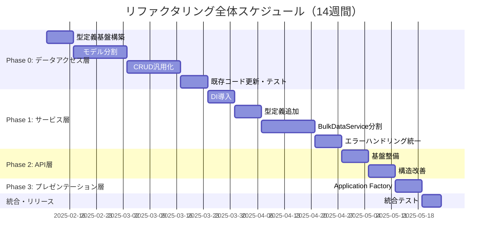

# 【計画書】リファクタリング総合計画

> **📋 ドキュメント種別**: タスク計画書
> **🎯 目的**: プロジェクト全体のリファクタリングを計画・管理
> **👥 対象読者**: プロジェクトマネージャー、技術リード、開発チーム全員
> **📅 計画期間**: 2025年2月10日 ～ 2025年5月23日（約14週間）

---

## 📑 目次

- [1. エグゼクティブサマリー](#1-エグゼクティブサマリー)
- [2. 計画の背景と目的](#2-計画の背景と目的)
- [3. リファクタリング対象レイヤー](#3-リファクタリング対象レイヤー)
- [4. 実施スケジュールとマイルストーン](#4-実施スケジュールとマイルストーン)
- [5. 共通戦略とアプローチ](#5-共通戦略とアプローチ)
- [6. 期待される成果とKPI](#6-期待される成果とkpi)
- [7. リスクと軽減策](#7-リスクと軽減策)
- [8. 承認とレビュー](#8-承認とレビュー)

---

## 1. エグゼクティブサマリー

### 1.1 計画概要

STOCK-INVESTMENT-ANALYZERプロジェクトの全レイヤーを対象とした包括的なリファクタリング計画です。

**主要目標:**
- コードベースの保守性・テスタビリティ・拡張性を大幅に向上
- 型安全性の強化と一貫したエラーハンドリングの実現
- 開発効率の向上（新機能追加・バグ修正時間を75%削減）

### 1.2 実施期間

| 項目 | 内容 |
|------|------|
| **開始日** | 2025年2月10日 |
| **完了予定日** | 2025年5月23日 |
| **総期間** | 約14週間 |
| **工数見積** | 約280時間（週20時間想定） |

### 1.3 主要成果物

| Phase | 成果物 | 完了予定 |
|-------|--------|----------|
| **Phase 0** | データアクセス層リファクタリング完了 | 2025/3/23 |
| **Phase 1** | サービス層リファクタリング完了 | 2025/4/27 |
| **Phase 2** | API層リファクタリング完了 | 2025/5/11 |
| **Phase 3** | プレゼンテーション層リファクタリング完了 | 2025/5/18 |
| **統合テスト** | 全レイヤー統合テスト完了 | 2025/5/23 |

### 1.4 期待される効果（サマリー）

| 指標 | 現状 | 目標 | 改善率 |
|------|------|------|--------|
| **models.py行数** | 1,263行 | 0行（廃止） | **100%削減** |
| **テストカバレッジ** | 50% | 80%+ | **+30pt** |
| **新機能追加時間** | 1日 | 3時間 | **75%短縮** |
| **循環的複雑度** | 平均8-12 | 平均3-5 | **60%改善** |

---

## 2. 計画の背景と目的

### 2.1 現状の課題

#### 技術的負債

| 課題 | 影響 | 重要度 |
|------|------|--------|
| **巨大ファイル** | models.py（1,263行）、BulkDataService（910行）が肥大化 | 🔴 Critical |
| **型定義の不統一** | 型カバレッジ60%、型定義が各所に散在 | 🟠 High |
| **テスト不足** | カバレッジ50%、単体テストが困難 | 🟠 High |
| **責務の不明確** | 単一責任原則違反、高い循環的複雑度 | 🟡 Medium |
| **コード重複** | CRUD操作の重複、エラーハンドリングの重複 | 🟡 Medium |

#### ビジネスインパクト

- **開発速度の低下**: 新機能追加に1日かかる（本来3時間で完了可能）
- **バグ修正の困難**: 影響範囲が広く、修正に4時間かかる
- **オンボーディングの遅延**: 新メンバーが2週間かかる
- **技術的負債の蓄積**: 負債解消に年間200時間以上必要

### 2.2 計画の目的

#### プライマリー目標

1. **保守性の向上**: コードの可読性・理解容易性を劇的に改善
2. **テスタビリティの向上**: 包括的なテストスイートを構築（カバレッジ80%+）
3. **拡張性の向上**: 新機能追加時の影響範囲を最小化
4. **品質の向上**: 型安全性・エラーハンドリングの一貫性確保

#### セカンダリー目標

1. **開発効率の向上**: 開発速度を75%向上
2. **チーム生産性の向上**: オンボーディング期間を50%短縮
3. **ドキュメントの整備**: 包括的なドキュメント体系を構築

### 2.3 成功基準

#### 定量的基準

- ✅ テストカバレッジ80%以上達成
- ✅ 循環的複雑度を平均3-5に改善
- ✅ 型カバレッジ95%以上達成
- ✅ コード重複90%削減

#### 定性的基準

- ✅ すべての既存機能が正常動作
- ✅ 包括的なテストスイートの完成
- ✅ チーム全員がアーキテクチャを理解
- ✅ ドキュメントが完全に整備

---

## 3. リファクタリング対象レイヤー

### 3.1 Phase 0: データアクセス層リファクタリング

**📄 詳細計画書**: [data_access_layer_plan.md](./data_access_layer_plan.md)

**優先度**: 🔴 **最優先**（すべてのレイヤーの基盤）

**期間**: 6週間（2025/2/10 ～ 2025/3/23）

**主要タスク**:

| 週 | タスク | 成果物 |
|---|--------|--------|
| 1週目 | 型定義基盤の構築 | `app/types.py`, `app/models/types.py`, `exceptions.py` |
| 2-3週目 | モデルの分割 | `base.py`, `mixins.py`, `stock_data.py`, `master.py`, `batch.py`, `session.py` |
| 4-5週目 | CRUD操作の汎用化 | `crud/base.py`, `crud/stock.py` |
| 6週目 | 既存コード更新とテスト | 型ヒント追加、統合テスト、ドキュメント |

**目標成果**:
- ✅ models.py（1,263行）を廃止
- ✅ 8つのモデルファイルに分割
- ✅ 9つの汎用CRUDクラス作成
- ✅ 型カバレッジ95%達成

---

### 3.2 Phase 1: サービス層リファクタリング

**📄 詳細計画書**: [service_layer_plan.md](./service_layer_plan.md)

**優先度**: 🟠 **高**（データアクセス層に依存）

**期間**: 5週間（2025/3/24 ～ 2025/4/27）

**主要タスク**:

| 週 | タスク | 成果物 |
|---|--------|--------|
| 1週目 | 依存性注入の導入 | DI対応済みサービスクラス |
| 2週目 | 型定義の追加 | `app/services/types.py` |
| 3-4週目 | BulkDataServiceの分割 | 4つの専門クラス |
| 5週目 | エラーハンドリング統一 | `decorators.py`、総合テスト |

**目標成果**:
- ✅ BulkDataService（910行）を4クラスに分割
- ✅ 依存性注入パターン導入
- ✅ 統一されたエラーハンドリング
- ✅ テストカバレッジ80%達成

---

### 3.3 Phase 2: API層リファクタリング

**📄 詳細計画書**: [api_layer_plan.md](./api_layer_plan.md)

**優先度**: 🟠 **高**（サービス層に依存）

**期間**: 2週間（2025/4/28 ～ 2025/5/11）

**主要タスク**:

| 週 | タスク | 成果物 |
|---|--------|--------|
| 1週目 | 基盤整備、型定義追加 | `app/api/types.py`、共通ユーティリティ |
| 2週目 | 構造改善 | ジョブ管理分離、バリデーション統一 |

**目標成果**:
- ✅ bulk_data.py（650行）を70%削減
- ✅ ジョブ管理の分離
- ✅ バリデーション処理の統一
- ✅ API固有の型定義完備

---

### 3.4 Phase 3: プレゼンテーション層リファクタリング

**📄 詳細計画書**: [presentation_layer_plan.md](./presentation_layer_plan.md)

**優先度**: 🟡 **中**（比較的独立）

**期間**: 1週間（2025/5/12 ～ 2025/5/18）

**主要タスク**:

| 日 | タスク | 成果物 |
|---|--------|--------|
| 1-2日目 | Application Factory実装 | `create_app()`, `config.py` |
| 3-4日目 | ルート分離 | `routes/` ディレクトリ |
| 5日目 | テストと統合 | 総合テスト、ドキュメント |

**目標成果**:
- ✅ Application Factoryパターン導入
- ✅ 環境別設定の分離
- ✅ 拡張機能の初期化改善

---

## 4. 実施スケジュールとマイルストーン

### 4.1 全体スケジュール



### 4.2 マイルストーン

| マイルストーン | 完了予定日 | 主要成果物 | 成功基準 |
|--------------|-----------|-----------|----------|
| **MS-R0: データアクセス層完了** | 2025/3/23 | models/ パッケージ完成 | ✅ 既存テスト全合格<br>✅ 型カバレッジ95%<br>✅ models.py廃止 |
| **MS-R1: サービス層完了** | 2025/4/27 | services/ リファクタ完了 | ✅ テストカバレッジ80%<br>✅ DI導入完了<br>✅ BulkDataService分割完了 |
| **MS-R2: API層完了** | 2025/5/11 | API層リファクタ完了 | ✅ API型定義完備<br>✅ ジョブ管理分離完了 |
| **MS-R3: 全レイヤー完了** | 2025/5/18 | 全レイヤーリファクタ完了 | ✅ Application Factory導入 |
| **MS-R4: 統合テスト完了** | 2025/5/23 | プロジェクト完了 | ✅ 全テスト合格<br>✅ ドキュメント完備<br>✅ デプロイ可能状態 |

### 4.3 週次進捗確認

**毎週金曜日 17:00** に以下を確認:

- ✅ 今週の完了タスク確認
- ✅ 次週のタスク計画
- ✅ ブロッカーの特定と解決策
- ✅ スケジュールの調整（必要に応じて）

---

## 5. 共通戦略とアプローチ

### 5.1 階層的型定義構造

**すべてのレイヤーで統一された型定義戦略を採用**

詳細は [型定義配置戦略](../../architecture/type_definition_strategy.md) を参照してください。

#### 型定義の配置ルール

```
app/
├── types.py                      # プロジェクト全体共通型
│   ├── Interval                  # 時間軸型
│   ├── ProcessStatus             # 処理ステータス
│   ├── BatchStatus               # バッチステータス
│   └── PaginationParams          # ページネーション型
├── api/
│   └── types.py                  # API層固有の型定義
├── services/
│   └── types.py                  # サービス層固有の型定義
└── models/
    └── types.py                  # モデル層固有の型定義
```

#### 配置基準

| 型の種類 | 配置場所 | 例 |
|---------|---------|---|
| **複数レイヤーで使用** | `app/types.py` | `Interval`, `ProcessStatus` |
| **API層のみで使用** | `app/api/types.py` | `APIResponse`, `BulkFetchRequest` |
| **サービス層のみで使用** | `app/services/types.py` | `ServiceResult`, `FetchResult` |
| **モデル層のみで使用** | `app/models/types.py` | `ModelConfig`, `TablePrefix` |
| **特定モジュール内のみ** | モジュール内 | `_InternalState` |

### 5.2 依存性注入（DI）パターン

**テスタビリティと柔軟性の向上**

```python
# 改善前: 固定的な依存関係
class StockDataOrchestrator:
    def __init__(self):
        self.fetcher = StockDataFetcher()  # 固定
        self.saver = StockDataSaver()      # 固定

# 改善後: 柔軟な依存関係
class StockDataOrchestrator:
    def __init__(
        self,
        fetcher: Optional[StockDataFetcher] = None,
        saver: Optional[StockDataSaver] = None,
    ):
        self.fetcher = fetcher or StockDataFetcher()  # モック可能
        self.saver = saver or StockDataSaver()        # モック可能
```

**メリット**:
- ✅ ユニットテストでのモック作成が容易
- ✅ 実装の差し替えが可能
- ✅ 疎結合なアーキテクチャ

### 5.3 エラーハンドリングの統一

**一貫性のあるエラー処理戦略**

```python
# 共通デコレータの使用
from app.utils.decorators import handle_service_error, retry_on_error

@handle_service_error
def fetch_stock_data(self, symbol: str) -> pd.DataFrame:
    """エラーハンドリングはデコレータに任せる"""
    ...

@retry_on_error(max_retries=3, delay=1.0)
def fetch_with_retry(self, symbol: str) -> pd.DataFrame:
    """リトライ機能はデコレータに任せる"""
    ...
```

**メリット**:
- ✅ エラーハンドリングロジックの重複排除
- ✅ 一貫したエラーメッセージ
- ✅ 統一されたロギング

### 5.4 テスト駆動開発（TDD）

**すべてのリファクタリングでテスト先行**

#### テスト戦略

1. **既存機能のテストケース作成** (Week 1)
   - 現在の動作を保証するテストを作成
   - エッジケース・エラーケースも網羅

2. **リファクタリング実施** (Week 2-5)
   - 段階的にリファクタリング
   - 各ステップでテスト実行

3. **テストカバレッジ向上** (Week 6)
   - カバレッジ80%以上を目標
   - 未テスト部分の洗い出しと追加

#### テストレベル

| レベル | 対象 | カバレッジ目標 |
|-------|------|--------------|
| **単体テスト** | 各クラス・関数 | 85%以上 |
| **統合テスト** | レイヤー間連携 | 75%以上 |
| **E2Eテスト** | API ～ DB | 60%以上 |
| **全体** | プロジェクト全体 | 80%以上 |

---

## 6. 期待される成果とKPI

### 6.1 定量的KPI

#### コード品質

| 指標 | 現状 | 目標 | 改善率 | 測定方法 |
|------|------|------|--------|----------|
| **models.py行数** | 1,263行 | 0行（廃止） | **100%削減** | `wc -l` |
| **BulkDataService行数** | 910行 | 4クラス（各150-300行） | **70%削減** | `wc -l` |
| **bulk_data.py行数** | 650行 | 200行 | **70%削減** | `wc -l` |
| **循環的複雑度** | 平均8-12 | 平均3-5 | **60%改善** | `radon cc` |
| **型カバレッジ** | 60% | 95%以上 | **+35pt** | `mypy` |
| **コード重複** | 多数 | ほぼゼロ | **90%削減** | `radon` |

#### テストカバレッジ

| 指標 | 現状 | 目標 | 改善率 | 測定方法 |
|------|------|------|--------|----------|
| **全体カバレッジ** | 50% | 80%以上 | **+30pt** | `pytest-cov` |
| **単体テストカバレッジ** | 40% | 85%以上 | **+45pt** | `pytest-cov` |
| **統合テストカバレッジ** | 30% | 75%以上 | **+45pt** | `pytest-cov` |

#### 開発効率

| 指標 | 現状 | 目標 | 改善率 | 測定方法 |
|------|------|------|--------|----------|
| **新機能追加時間** | 1日（8時間） | 3時間 | **75%短縮** | タスク追跡 |
| **バグ修正時間** | 4時間 | 1時間 | **75%短縮** | タスク追跡 |
| **コードレビュー時間** | 2時間 | 30分 | **75%短縮** | タスク追跡 |
| **オンボーディング期間** | 2週間 | 1週間 | **50%短縮** | 新メンバーアンケート |

### 6.2 定性的成果

#### 保守性の向上

- ✅ **単一責任の原則**: 各クラス/関数の責務が明確
- ✅ **可読性**: コード量削減と構造化により理解容易
- ✅ **変更容易性**: 影響範囲が限定的

#### テスタビリティの向上

- ✅ **モック容易性**: DI により依存オブジェクトのモック作成が容易
- ✅ **テスト独立性**: 各層のテストが独立して実行可能
- ✅ **テストカバレッジ**: 包括的なテストスイート

#### 拡張性の向上

- ✅ **新機能追加**: 既存コードへの影響を最小化
- ✅ **実装差し替え**: インターフェース経由で実装を差し替え可能
- ✅ **段階的アップグレード**: 段階的な機能追加が容易

#### 品質の向上

- ✅ **型安全性**: 型ヒントによる静的型チェック
- ✅ **一貫性**: エラーハンドリング、バリデーションの統一
- ✅ **堅牢性**: 包括的なテストによる品質保証

---

## 7. リスクと軽減策

### 7.1 リスク管理マトリクス

| リスク | 影響度 | 発生確率 | リスクレベル | 軽減策 |
|--------|--------|----------|--------------|--------|
| **既存機能の破壊** | 🔴 Critical | 🟡 Medium | 🔴 High | ✅ 包括的なテストスイート作成<br>✅ 段階的移行<br>✅ 毎週のリグレッションテスト |
| **スケジュール遅延** | 🟠 High | 🟡 Medium | 🟠 Medium | ✅ バッファ期間の確保（各Phase末に1週間）<br>✅ 週次進捗確認<br>✅ 優先度に基づく調整 |
| **技術的難易度** | 🟠 High | 🟢 Low | 🟡 Low | ✅ 事前のプロトタイピング<br>✅ ペアプログラミング<br>✅ 外部レビュー |
| **チームの理解不足** | 🟡 Medium | 🟡 Medium | 🟡 Medium | ✅ 包括的なドキュメント整備<br>✅ 勉強会の開催<br>✅ ペアプログラミング |
| **依存関係の問題** | 🟡 Medium | 🟢 Low | 🟢 Low | ✅ 依存関係マップ作成<br>✅ Phase間の明確な境界 |

### 7.2 コンティンジェンシープラン

#### Plan A: スケジュール遅延時

**トリガー**: 週次進捗確認で20%以上の遅延が発生

**対応策**:
1. 優先度の低いタスクを次フェーズに移動
2. ペアプログラミングで効率化
3. スケジュール全体を1-2週間延長

#### Plan B: 既存機能破壊時

**トリガー**: テストで重大なリグレッションを検出

**対応策**:
1. 即座にリファクタリングを一時停止
2. ロールバック可能な状態に戻す
3. 根本原因の分析と修正
4. テストスイートの強化
5. リファクタリング再開

#### Plan C: 技術的困難時

**トリガー**: 3日以上進捗がない、または解決策が見つからない

**対応策**:
1. チーム内でのブレインストーミング
2. 外部エキスパートへの相談
3. アプローチの見直しと代替案検討
4. 必要に応じてスコープ調整

---

## 8. 承認とレビュー

### 8.1 レビュープロセス

#### Phase開始前レビュー

**目的**: 計画の妥当性確認

**参加者**: プロジェクトマネージャー、技術リード、開発チーム

**チェックリスト**:
- ✅ タスクの明確性
- ✅ スケジュールの現実性
- ✅ リソースの確保
- ✅ 依存関係の確認
- ✅ リスクの特定と軽減策

#### Phase完了後レビュー

**目的**: 成果の確認と次フェーズへの準備

**参加者**: プロジェクトマネージャー、技術リード、開発チーム

**チェックリスト**:
- ✅ 成功基準の達成
- ✅ テストの合格
- ✅ ドキュメントの完成
- ✅ コードレビューの完了
- ✅ 次フェーズの準備完了

### 8.2 承認プロセス

#### Phase開始承認

| 承認者 | 役割 | 承認内容 |
|--------|------|----------|
| **プロジェクトマネージャー** | 最終承認 | スケジュール・リソース・リスク |
| **技術リード** | 技術承認 | 技術的アプローチ・アーキテクチャ |
| **開発チーム** | 実施承認 | タスクの理解・実施可能性 |

#### Phase完了承認

| 承認者 | 役割 | 承認内容 |
|--------|------|----------|
| **プロジェクトマネージャー** | 最終承認 | 成功基準の達成確認 |
| **技術リード** | 品質承認 | コード品質・アーキテクチャ適合性 |
| **QAチーム** | テスト承認 | テストカバレッジ・品質基準 |

---

## 📚 関連ドキュメント

### 計画書（本ディレクトリ）

- [データアクセス層リファクタリング計画](./data_access_layer_plan.md)
- [サービス層リファクタリング計画](./service_layer_plan.md)
- [API層リファクタリング計画](./api_layer_plan.md)
- [プレゼンテーション層リファクタリング計画](./presentation_layer_plan.md)

### アーキテクチャドキュメント

- [アーキテクチャ概要](../../architecture/architecture_overview.md)
- [型定義配置戦略](../../architecture/type_definition_strategy.md)
- [データアクセス層仕様書](../../architecture/layers/data_access_layer.md)
- [サービス層仕様書](../../architecture/layers/service_layer.md)
- [API層仕様書](../../architecture/layers/api_layer.md)
- [プレゼンテーション層仕様書](../../architecture/layers/presentation_layer.md)

### ガイド

- [開発ワークフロー](../../guides/development-workflow.md)
- [コーディング規約](../../guides/CONTRIBUTING.md)
- [Git運用ワークフロー](../../standards/git-workflow.md)

---

## 📝 変更履歴

| 日付 | バージョン | 変更内容 | 承認者 |
|------|-----------|----------|--------|
| 2025-01-09 | 1.0 | 初版作成 | - |

---

**📌 次のアクション**:
1. 本計画書のレビューと承認取得
2. Phase 0 詳細計画書の確認
3. 2025年2月10日から Phase 0 開始

---

**最終更新**: 2025-01-09
**ドキュメント管理者**: プロジェクトマネージャー
**レビューサイクル**: 各Phase開始前・完了後
